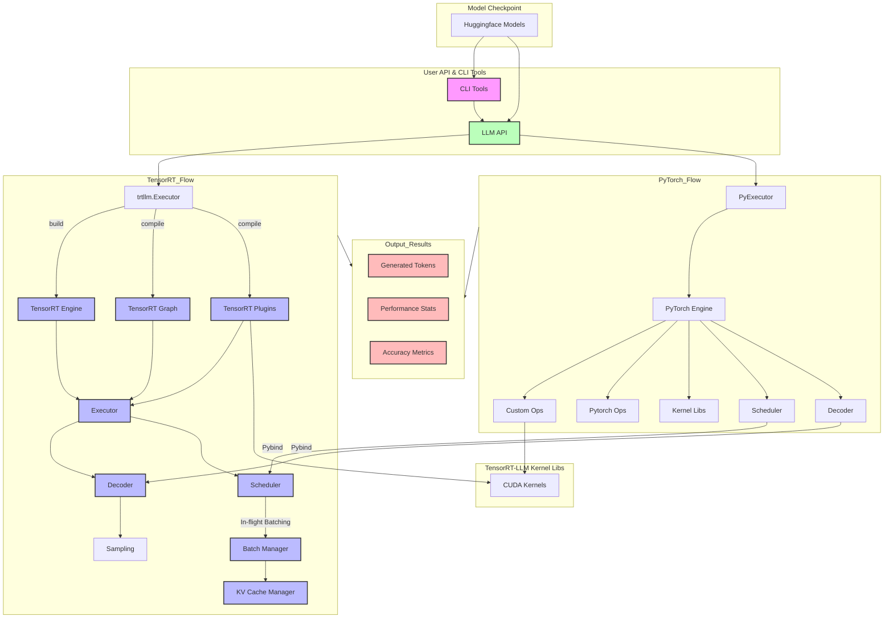

```mermaid
graph TB
    subgraph "User API & CLI Tools"
        CLI[CLI Tools]
        LLMAPI[LLM API]
        CLI --> LLMAPI
    end

    subgraph "Model Checkpoint"
        Checkpoint[Huggingface Models]
        Checkpoint --> CLI
        Checkpoint --> LLMAPI

    end

    subgraph "TensorRT_Flow"
        trtllmExecutor[trtllm.Executor]
        Engine[TensorRT Engine]
        TRTGraph[TensorRT Graph]
        Plugins[TensorRT Plugins]
        LLMAPI --> trtllmExecutor
        trtllmExecutor --> |build|Engine
        trtllmExecutor --> |compile|TRTGraph
        trtllmExecutor --> |compile|Plugins
        Engine --> Executor
        Plugins --> Executor
        TRTGraph --> Executor
        Executor --> Decoder[Decoder]
        Decoder --> Sampling[Sampling]
        Executor --> Scheduler[Scheduler]
        Scheduler --> |In-flight Batching| BatchManager[Batch Manager]
        BatchManager --> KVCache[KV Cache Manager]
    end

    subgraph "PyTorch_Flow"
        PyExecutor[PyExecutor]
        PyEngine[PyTorch Engine]
        CustomOps[Custom Ops]
        PyTorchOps[Pytorch Ops]
        KernelLibs[Kernel Libs]
        LLMAPI --> PyExecutor
        PyExecutor --> PyEngine[PyTorch Engine]
        PyEngine --> CustomOps
        PyEngine --> PyTorchOps
        PyEngine --> KernelLibs
        PyEngine --> PyScheduler[Scheduler]
        PyEngine --> PyDecoder[Decoder]
        PyScheduler --> |Pybind|Scheduler
        PyDecoder --> |Pybind|Decoder
        
    end

    subgraph "TensorRT-LLM Kernel Libs"
        cudaKernel[CUDA Kernels]
    end

    subgraph "Output_Results"
        Tokens[Generated Tokens]
        Stats[Performance Stats]
        Metrics[Accuracy Metrics]
    end

    TensorRT_Flow --> Output_Results
    PyTorch_Flow --> Output_Results

    CustomOps --> cudaKernel
    Plugins --> cudaKernel

    %% CLI tools format
    classDef cli fill:#f9f,stroke:#333,stroke-width:2px;
    class CLI cli;
    
    %% TRT flow format
    classDef component fill:#bbf,stroke:#333,stroke-width:2px;
    class TRTGraph,Plugins,Engine,Executor,Decoder,Scheduler,BatchManager,KVCache component;
    
    %% APIs format
    classDef api fill:#bfb,stroke:#333,stroke-width:2px;
    class PythonAPI,CppAPI,LLMAPI api;

    %% Results format
    classDef result fill:#fbb,stroke:#333,stroke-width:2px;
    class Tokens,Stats,Metrics result;
```
