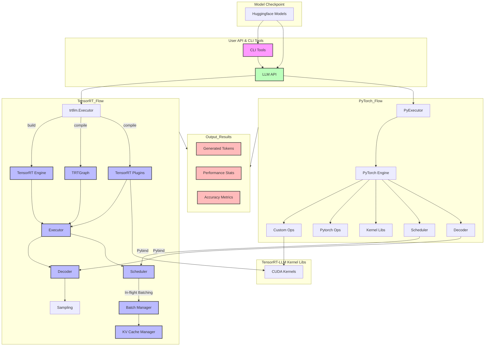

## CLI Tools Description

1. **trtllm-build**: Builds TensorRT engines from TensorRT-LLM checkpoints
2. **trtllm-bench**: Benchmarks the performance of TensorRT-LLM models
3. **trtllm-eval**: Evaluates model accuracy and performance
4. **trtllm-llmapi-launch**: Launches the LLM API server
5. **trtllm-prune**: Prunes model weights for optimization
6. **trtllm-refit**: Updates weights in a TensorRT engine
7. **trtllm-serve**: Serves models through various interfaces

## Key Components

1. **Model Definition & Conversion**:
   - Converts models from various sources (HuggingFace, NeMo, JAX, etc.)
   - Creates TensorRT-LLM checkpoints
   - Supports different model formats and architectures

2. **TensorRT Flow**:
   - TensorRT Engine: Optimized inference engine
   - Runtime: Core execution engine
   - C++ Runtime: High-performance implementation
   - Executor: Manages model execution
   - Scheduler: Handles request scheduling and batching
   - Batch Manager: Manages in-flight batching
   - KV Cache Manager: Handles KV cache memory
   - Decoder: Generates output tokens
   - TensorRT Plugins: Custom operations
   - Custom Kernels: Optimized CUDA implementations

3. **PyTorch Flow**:
   - PyTorch Runtime: Python-based implementation
   - PyExecutor: Manages PyTorch model execution
   - PyScheduler: Handles PyTorch request scheduling
   - PyDecoder: PyTorch token generation
   - PyModelEngine: PyTorch model engine

4. **API Layer**:
   - Python API: High-level Python interface
   - C++ API: Low-level C++ interface
   - LLM API: Interface for model interaction (generate, chat, stream, batch, embed, tokenize)

5. **Output Results**:
   - Generated Tokens: Output text from the model
   - Performance Stats: Throughput, latency, memory usage
   - Accuracy Metrics: Model evaluation metrics
