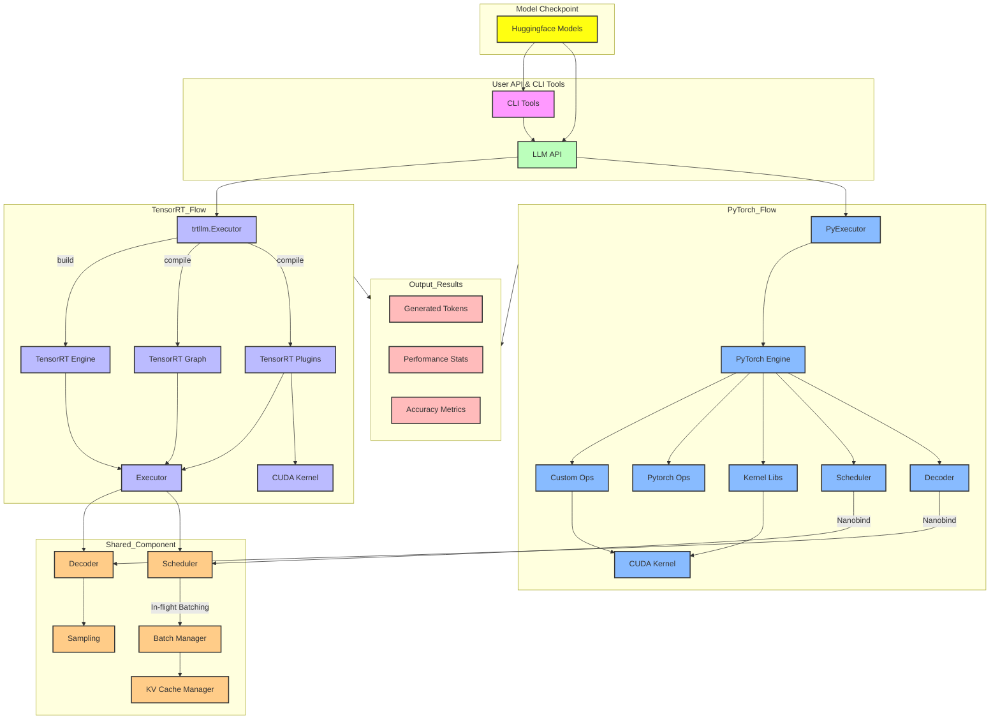

```mermaid
graph TB
    subgraph "User API & CLI Tools"
        CLI[CLI Tools]
        LLMAPI[LLM API]
        CLI --> LLMAPI
    end

    subgraph "Model Checkpoint"
        Checkpoint[Huggingface Models]
        Checkpoint --> CLI
        Checkpoint --> LLMAPI
    end

    subgraph "TensorRT_Flow"
        trtllmExecutor[trtllm.Executor]
        Engine[TensorRT Engine]
        TRTGraph[TensorRT Graph]
        Plugins[TensorRT Plugins]
        cudaKernel[CUDA Kernel]
        Executor[Executor]
        LLMAPI --> trtllmExecutor
        trtllmExecutor --> |build|Engine
        trtllmExecutor --> |compile|TRTGraph
        trtllmExecutor --> |compile|Plugins
        Engine --> Executor
        Plugins --> Executor
        TRTGraph --> Executor
        Plugins --> cudaKernel
    end

    subgraph "PyTorch_Flow"
        PyExecutor[PyExecutor]
        PyEngine[PyTorch Engine]
        CustomOps[Custom Ops]
        PyTorchOps[Pytorch Ops]
        KernelLibs[Kernel Libs]
        PyScheduler[Scheduler]
        PyDecoder[Decoder]
        CUDAKernel[CUDA Kernel]
        LLMAPI --> PyExecutor
        PyExecutor --> PyEngine[PyTorch Engine]
        PyEngine --> CustomOps
        PyEngine --> PyTorchOps
        PyEngine --> KernelLibs
        PyEngine --> PyScheduler
        PyEngine --> PyDecoder
        KernelLibs --> CUDAKernel
        CustomOps --> CUDAKernel
    end

    subgraph "Shared_Component"
        Shared_Decoder[Decoder]
        Shared_Scheduler[Scheduler]
        Sampling[Sampling]
        BatchManager[Batch Manager]
        KVCache[KV Cache Manager]
        PyScheduler --> |Nanobind|Shared_Scheduler
        PyDecoder --> |Nanobind|Shared_Decoder
        Executor --> Shared_Decoder
        Shared_Decoder --> Sampling
        Executor --> Shared_Scheduler[Scheduler]
        Shared_Scheduler --> |In-flight Batching| BatchManager
        BatchManager --> KVCache
    end

    subgraph "Output_Results"
        Tokens[Generated Tokens]
        Stats[Performance Stats]
        Metrics[Accuracy Metrics]
    end

    %% PyTorch_Flow ~~~ TensorRT_Flow 

    TensorRT_Flow --> Output_Results
    PyTorch_Flow --> Output_Results

    %% Force Output_Results to be between PyTorch_flow and TensorRT_flow
    PyTorch_Flow ~~~ Output_Results

    %% Model checkpoint format
    classDef checkpoint fill:#ff1,stroke:#333,stroke-width:2px;
    class Checkpoint checkpoint;

    %% CLI tools format
    classDef cli fill:#f9f,stroke:#333,stroke-width:2px;
    class CLI cli;
    
    %% TRT flow format
    classDef trt fill:#bbf,stroke:#333,stroke-width:2px;
    class trtllmExecutor,TRTGraph,Plugins,Engine,Executor,cudaKernel trt;

    %% PyTorch flow format
    classDef pytorch fill:#8bf,stroke:#333,stroke-width:2px;
    class PyExecutor,PyEngine,CustomOps,PyTorchOps,KernelLibs,PyScheduler,PyDecoder,CUDAKernel pytorch;

    %% Shared Componnet format
    classDef component fill:#fc8,stroke:#333,stroke-width:2px;
    class Shared_Decoder,Sampling,Shared_Scheduler,BatchManager,KVCache component;
    
    %% APIs format
    classDef api fill:#bfb,stroke:#333,stroke-width:2px;
    class PythonAPI,CppAPI,LLMAPI api;

    %% Results format
    classDef result fill:#fbb,stroke:#333,stroke-width:2px;
    class Tokens,Stats,Metrics result;
```
