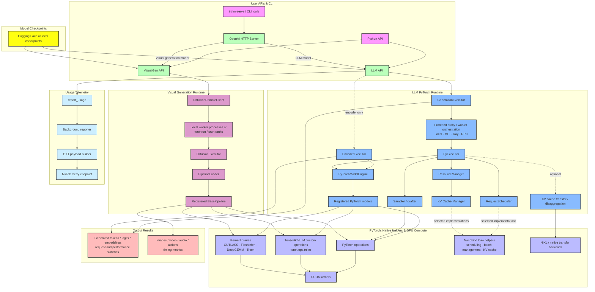

```mermaid
graph TB
    subgraph EntryPoints["User APIs & CLI"]
        CLI["trtllm-serve / CLI tools"]
        PythonAPI["Python API"]
        OpenAIServer["OpenAI HTTP Server"]
        LLMAPI["LLM API"]
        VisualGenAPI["VisualGen API"]

        CLI --> OpenAIServer
        PythonAPI --> LLMAPI
        PythonAPI --> VisualGenAPI
        OpenAIServer -->|LLM model| LLMAPI
        OpenAIServer -->|Visual generation model| VisualGenAPI
    end

    subgraph Checkpoints["Model Checkpoints"]
        Checkpoint["Hugging Face or local checkpoints"]
    end

    Checkpoint --> LLMAPI
    Checkpoint --> VisualGenAPI

    subgraph LLMFlow["LLM PyTorch Runtime"]
        GenerationExecutor["GenerationExecutor"]
        Orchestration["Frontend proxy / worker orchestration<br/>Local · MPI · Ray · RPC"]
        PyExecutor["PyExecutor"]
        EncoderExecutor["EncoderExecutor"]
        ModelEngine["PyTorchModelEngine"]
        RequestScheduler["RequestScheduler"]
        Sampler["Sampler / drafter"]
        ResourceManager["ResourceManager"]
        KVCache["KV Cache Manager"]
        KVTransfer["KV cache transfer / disaggregation"]
        TorchModels["Registered PyTorch models"]

        LLMAPI --> GenerationExecutor
        GenerationExecutor --> Orchestration
        Orchestration --> PyExecutor
        LLMAPI -. encode_only .-> EncoderExecutor
        EncoderExecutor --> ModelEngine
        PyExecutor --> ModelEngine
        PyExecutor --> RequestScheduler
        PyExecutor --> Sampler
        PyExecutor --> ResourceManager
        ResourceManager --> KVCache
        PyExecutor -. optional .-> KVTransfer
        ModelEngine --> TorchModels
    end

    subgraph VisualGenFlow["Visual Generation Runtime"]
        DiffusionClient["DiffusionRemoteClient"]
        WorkerLaunch["Local worker processes or<br/>torchrun / srun ranks"]
        DiffusionExecutor["DiffusionExecutor"]
        PipelineLoader["PipelineLoader"]
        DiffusionPipeline["Registered BasePipeline"]

        VisualGenAPI --> DiffusionClient
        DiffusionClient --> WorkerLaunch
        WorkerLaunch --> DiffusionExecutor
        DiffusionExecutor --> PipelineLoader
        PipelineLoader --> DiffusionPipeline
    end

    subgraph Compute["PyTorch, Native Helpers & GPU Compute"]
        TorchOps["PyTorch operations"]
        CustomOps["TensorRT-LLM custom operations<br/>torch.ops.trtllm"]
        KernelLibs["Kernel libraries<br/>CUTLASS · FlashInfer · DeepGEMM · Triton"]
        NativeHelpers["Nanobind C++ helpers<br/>scheduling · batch management · KV cache"]
        TransferBackends["NIXL / native transfer backends"]
        CUDAKernels["CUDA kernels"]

        TorchModels --> TorchOps
        TorchModels --> CustomOps
        TorchModels --> KernelLibs
        Sampler --> TorchOps
        RequestScheduler -. selected implementations .-> NativeHelpers
        KVCache -. selected implementations .-> NativeHelpers
        KVTransfer --> TransferBackends
        DiffusionPipeline --> TorchOps
        DiffusionPipeline --> CustomOps
        DiffusionPipeline --> KernelLibs
        TorchOps --> CUDAKernels
        CustomOps --> CUDAKernels
        KernelLibs --> CUDAKernels
    end

    subgraph UsageTelemetry["Usage Telemetry"]
        ReportUsage["report_usage"]
        BgReporter["Background reporter"]
        GxtPayload["GXT payload builder"]
        GxtEndpoint["NvTelemetry endpoint"]

        LLMAPI --> ReportUsage
        ReportUsage --> BgReporter
        BgReporter --> GxtPayload
        GxtPayload --> GxtEndpoint
    end

    subgraph Results["Output Results"]
        LLMResults["Generated tokens / logits / embeddings<br/>request and performance statistics"]
        VisualResults["Images / video / audio / actions<br/>timing metrics"]

        GenerationExecutor --> LLMResults
        EncoderExecutor --> LLMResults
        DiffusionPipeline --> VisualResults
    end

    classDef entry fill:#f9f,stroke:#333,stroke-width:2px;
    classDef api fill:#bfb,stroke:#333,stroke-width:2px;
    classDef checkpoint fill:#ff1,stroke:#333,stroke-width:2px;
    classDef llm fill:#8bf,stroke:#333,stroke-width:2px;
    classDef visualgen fill:#d9c,stroke:#333,stroke-width:2px;
    classDef compute fill:#bbf,stroke:#333,stroke-width:2px;
    classDef telemetry fill:#cef,stroke:#333,stroke-width:2px;
    classDef result fill:#fbb,stroke:#333,stroke-width:2px;

    class CLI,PythonAPI entry;
    class OpenAIServer,LLMAPI,VisualGenAPI api;
    class Checkpoint checkpoint;
    class GenerationExecutor,Orchestration,PyExecutor,EncoderExecutor,ModelEngine llm;
    class RequestScheduler,Sampler,ResourceManager,KVCache,KVTransfer,TorchModels llm;
    class DiffusionClient,WorkerLaunch,DiffusionExecutor,PipelineLoader,DiffusionPipeline visualgen;
    class TorchOps,CustomOps,KernelLibs,NativeHelpers,TransferBackends,CUDAKernels compute;
    class ReportUsage,BgReporter,GxtPayload,GxtEndpoint telemetry;
    class LLMResults,VisualResults result;
```
