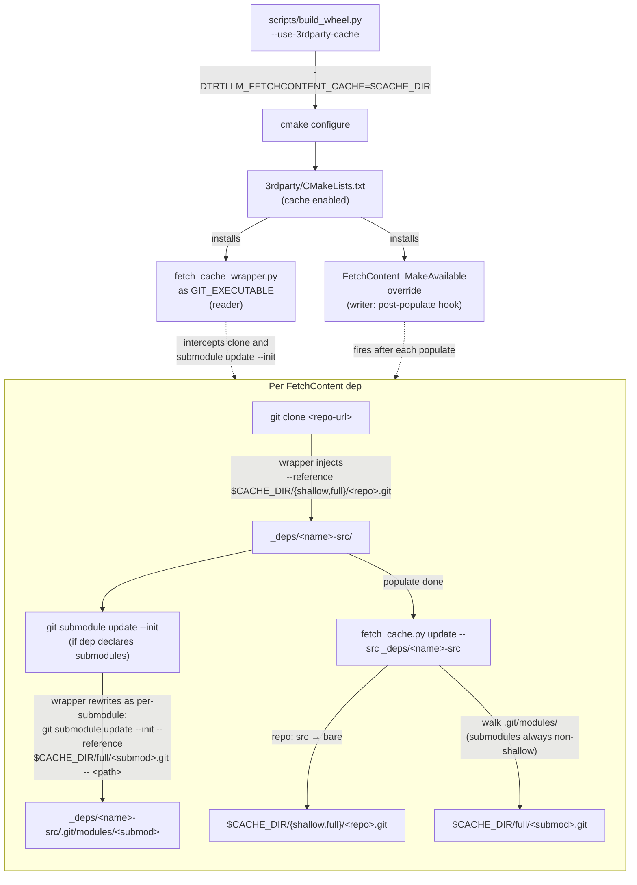

# FetchContent cache (`--use-3rdparty-cache`)

`3rdparty/CMakeLists.txt` drives ~15 third-party repositories through cmake
`FetchContent`. A full cmake configure re-clones every repo from GitHub,
which dominates wall-clock time on slow networks and for shared CI workers
that repeatedly build different checkouts. The cache mechanism keeps a
local **bare reference repo** per dep and has cmake invoke
`git clone --reference <bare>` so objects the bare already has are reused
from disk instead of refetched over the network.

## How to enable

Opt-in via `scripts/build_wheel.py --use-3rdparty-cache`. The flag forwards
`-DTRTLLM_FETCHCONTENT_CACHE=<dir>` to cmake (default
`<project>/3rdparty/.cache_3rdparty`, git-ignored). Without the flag, not
a single `-D` is added, the entire cache block in
`3rdparty/CMakeLists.txt` is bypassed, `GIT_EXECUTABLE` stays at the
system git, and the build path is byte-for-byte identical to before.

For read-only shared caches — the typical setup for the autonomous-agent
builds discussed in the [threat model](#why-this-exists) — pass
`-DTRTLLM_FETCHCONTENT_UPDATE_CMD=<script>`. The write-back step then
runs `<script> <src_dir>` in place of `fetch_cache.py`, so the
orchestrator that owns the real cache can mount it read-only into the
build container.

## Scope

This document covers only the **in-tree** cache for current TensorRT-LLM
versions that drive third-party deps through `FetchContent`. An
out-of-tree variant exists for older trees that still use git submodules;
that code lives outside this repository and is not documented here.

## Flow

Two activation points wire the cache into a cmake configure:

* **`GIT_EXECUTABLE` wrapper** — `fetch_cache_wrapper.py`, installed as
  `GIT_EXECUTABLE` when the cache is enabled. This is the **reader**: it
  intercepts `git clone` and `git submodule update --init` and injects
  `--reference $CACHE_DIR/{shallow,full}/<name>.git` when the matching
  bare exists. Everything else is `execv`'d through to the real git
  unchanged.
* **`FetchContent_MakeAvailable` override** — a cmake macro defined in
  `3rdparty/CMakeLists.txt` that shadows the cmake primitive. This is the
  **writer**: it calls the original populate, then runs
  `fetch_cache.py update --src <dep_SOURCE_DIR>`. The hook runs in the
  outer cmake scope on purpose — the FetchContent subbuild's stdout is
  swallowed by `FETCHCONTENT_QUIET=ON`, the outer scope's is not.



Consequences of this design:

* **No separate init step.** The cache is built on the fly, dep by dep.
  If a build aborts halfway, every dep already populated is in the cache
  and will be reused next time.
* **No parsing of `fetch_content.json` or `.gitmodules`.** The writer
  walks `_deps/<name>-src` and `<dep-src>/.git/modules/` directly, so it
  stays compatible across schema changes.
* **No shell hooks into `build_wheel.py`.** The post-populate write-back
  is driven by the cmake `FetchContent_MakeAvailable` override, so the
  cache fills up even on builds that bypass `build_wheel.py`.

### Full-scan rebuild

`fetch_cache.py` also exposes a `--build-dir <cmake-build-dir>` mode
that walks every `_deps/*-src` and each `.git/modules/` underneath it,
rebuilding the cache in bulk:

```bash
python 3rdparty/fetch_cache.py update \
    --cache-dir $TRTLLM_FETCHCONTENT_CACHE \
    --build-dir <cmake-build-dir>
```

It is a manual-repair / legacy path — use it when the cmake override is
unavailable (older TRT-LLM trees without
`FetchContent_MakeAvailable` shadowed, or cmake failures that skip the
post-populate hook) or when a cache directory needs to be reseeded from
an existing build tree. Primary builds do not need it; the hook path
keeps the cache in sync incrementally.

## Cache layout

```
$CACHE_DIR/
├── shallow/
│   ├── cutlass.git/      ← from srcs cloned with GIT_SHALLOW TRUE
│   └── ...
└── full/
    ├── nanobind.git/     ← from srcs cloned without GIT_SHALLOW
    ├── fmt.git/          ← from _deps/deepgemm-src/.git/modules/third-party/fmt
    └── ...
```

**The split between `shallow/` and `full/` is load-bearing.** A bare
created from a shallow src contains tip commits whose parents are absent
from the object store. Advertising such a tip as a "have" to a
non-shallow consumer during `clone --reference` negotiation tricks
upstream into skipping parent history, leaving the consumer's `git log`
unable to traverse ancestors. That is the exact bug the split prevents
(historically observed as `Could not read <SHA>: Failed to traverse
parents of commit <SHA>` after a clone from a cache first populated from
a shallow src).

Routing is purely local and hardcoded on both sides:

| Side   | Predicate                                              | Target pool |
| ------ | ------------------------------------------------------ | ----------- |
| Writer | `<src_git>/shallow` is a non-empty regular file        | `shallow/`  |
| Writer | otherwise                                              | `full/`     |
| Reader | caller passed `git clone --depth N` (shallow consumer) | `shallow/`  |
| Reader | otherwise (including `git submodule update`)           | `full/`     |

No code path writes to both pools from a single src, and no reader
consults the other pool on a miss — cache miss simply falls through to a
plain network clone, with no correctness impact. Disk cost of the split
is one extra copy of any dep that is ever consumed in both modes, which
is rare in practice (a given cmake configure does not toggle
`GIT_SHALLOW` per dep).

Submodules always route to `full/`. cmake `FetchContent` does not pass
`--depth` to its `git submodule update --init` invocation, so submodule
clones are non-shallow by construction.

## Threat model

### Why this exists

`build_wheel.py --use-3rdparty-cache` is invoked both by trusted
developers on their own workstations and by **autonomous agents**
(e.g. Claude Code) driving builds on branches whose contents may be
effectively attacker-controlled. In the agent scenario the
`_deps/<name>-src` directories that the cache writer reads from are an
untrusted input: an attacker-crafted third-party dep declaration can
steer the cache to ingest a repository of the attacker's choosing, with
attacker-controlled `.git/config`, refs, and object store. Every design
choice in this section exists to let such a hostile src pass through the
update path safely — without giving the attacker code execution on the
host, and without letting them corrupt legitimate content in any other
user's cache entry.

### Trust boundary

**Trusted:**

* `$TRTLLM_FETCHCONTENT_CACHE` (the top-level path and write permissions
  to it — chosen by the operator, not by the attacker).
* The constant strings `"shallow"` and `"full"` — hardcoded in the
  writer and the reader, never derived from src. Attacker-chosen content
  can only land under `$CACHE_DIR/shallow/` or `$CACHE_DIR/full/`; it
  cannot escape those two subdirectories.

**Untrusted (everything else):**

* The entire `_deps/<name>-src` directory: contents, `.git/config`,
  `refs/`, `objects/`, hooks, and the presence/contents of
  `.git/shallow`.
* The **cache key** (bare's basename). The writer takes it from src's
  `remote.origin.url`; attacker controls that value and therefore picks
  which `<name>.git` the bare becomes.
* Whether src is shallow or not. Attacker can plant or remove
  `.git/shallow` to steer which pool their content lands in.
* The dep name handed to `FetchContent_MakeAvailable`. A change to
  `fetch_content.json` is itself an attack vector.

### Attacker capabilities

* Deliver an arbitrary src to the cache update path, with any chosen
  cache key, in either pool.
* Abort a clone mid-way and leave a half-populated src.
* Mutate src metadata after the clone finishes.
* Mutate src concurrently while the update is running.
* Race concurrent updates against a legitimate user sharing the same
  `$CACHE_DIR`.
* Construct a non-shallow-looking src that is in fact missing ancestors
  (no `.git/shallow`, but incomplete object store), trying to poison
  the full pool with disconnected history.

### Invariants

The following must hold for any attacker-controlled input.

**I1. The user's checkout is authoritative.**
`git clone --reference` never reads the reference's refs, config, or
remote URLs — only its objects (through alternates). SHA-1DC rules out
object-SHA forgery. Whatever the cache contains, the final working tree
matches upstream by SHA.

**I2. The cache is monotonic append-only, per subdir.**
No code path reachable from untrusted input overwrites or deletes a
legitimately-recorded `(object, have/<sha>)`. The guarantee rests on the
conjunction of:

* Refname **equals** the SHA → distinct SHAs necessarily have distinct
  refnames; same SHA is idempotent.
* `git update-ref <ref> <sha> ""` (empty old-value) is git's native
  "create-only" CAS.
* SHA-1DC prevents object-SHA forgery.
* `gc.auto=0` + `gc.pruneExpire=never` prevent object deletion.

Even when the attacker chooses a cache key colliding with a legitimate
dep's, they can only **add** objects and SHA-named refs under that
bare. Existing legitimate content stays usable; a legitimate
`clone --reference` still hits SHAs upstream recognizes, while
attacker-added SHAs upstream does not know are simply ignored.

The `refs/fetch-cache/{heads,remotes,tags}/...` namespace (written by
the fetch refspec with a `+` force-flag) **does not** carry append-only
semantics; it is a volatile advertisement layer consumed during `clone
--reference` negotiation. Append-only is only promised on
`refs/fetch-cache/have/<sha>`. `_prune_disconnected_fetch_refs` may
delete entries from the advertisement namespace without breaking
legitimate anchors — `have/<sha>` survives and still makes upstream
recognize the SHA.

**I3. Untrusted src does not trigger code execution in the update
process.**

Every "read src" path is pure Python file I/O, never `git` with cwd in
src:

* `_read_src_origin_url` parses `src/.git/config` as text — attacker
  `include.path` chains do not fire.
* `_read_src_ref_shas` / `_read_src_refs` walk `src/.git/refs/**` and
  read `packed-refs` as text. A `stat` + `S_ISREG` gate drops FIFOs and
  sockets that would hang `open()` waiting for a writer; a whitelist
  regex on refnames prevents shell/git metacharacter injection when
  those refs are written into the standin's `packed-refs`.
* `_update_submodules` discovers submodule git dirs by filesystem
  probing (`HEAD` + `objects/`), never via `git rev-parse`.

These three close the **static** config-loading surface.

The remaining surface is `git fetch` over git's local transport, which
forks `upload-pack` with `GIT_DIR=<src>/.git`. Upload-pack loads src's
config before sending a single object, at which point these
attacker-controlled keys can fire code execution:

* `uploadpack.packObjectsHook` — documented hook, straight `exec()`.
* `core.fsmonitor` — runs on index / ref-scan operations.
* `core.hooksPath` — redirects hook lookup, making
  `post-upload-pack` an attacker-controlled binary.
* `include.path` / `includeIf.*.path` — chain in further
  attacker-controlled config.

This surface is closed by routing the fetch through an ephemeral
**standin bare + alternates** instead of fetching from src directly
(`_safe_fetch_into_cache`):

* An ephemeral `.fc-standin-<random>/` is created inside `$CACHE_DIR`
  (the only writable trusted location) with
  `tempfile.mkdtemp`. The leading dot keeps it out of the way of any
  `ls` over cache keys (cache keys never start with a dot).
* `standin/objects/info/alternates` points at the absolute path of
  src's `objects/`. Alternates is a pure object-store pointer — git's
  object layer follows it to resolve SHAs, the config layer never opens
  a file rooted at the alternate path.
* `standin/packed-refs` is written directly from the whitelisted
  `(refname, sha)` pairs returned by `_read_src_refs`. The refname
  character class already rejects whitespace, newlines, and shell
  metacharacters, so no quoting is needed.
* `git fetch <standin>` then runs with `GIT_DIR=<standin>` — upload-pack
  loads the standin's config, which was freshly created by
  `git init --bare` and contains only git defaults.

Defense in depth applied independently of the standin:

* `GIT_CONFIG_SYSTEM=/dev/null` + `GIT_CONFIG_GLOBAL=/dev/null` in the
  child env mask `/etc/gitconfig` and `~/.gitconfig`, propagating to
  the forked upload-pack. Covers shared CI where another user may
  have planted `hooksPath` in `/etc/gitconfig`.
* `-c uploadpack.packObjectsHook=`, `-c core.fsmonitor=`,
  `-c core.hooksPath=/dev/null` forcibly empty the known code-exec
  keys through `GIT_CONFIG_PARAMETERS` (which propagates to
  upload-pack too).
* `-c protocol.file.allow=always` permits the local-path fetch on
  hosts whose default is `user` for non-interactive builds.

The cache-side `fetch.fsckObjects` remains on: standin → cache is a
regular pack exchange, so the cache still validates every incoming
object before it lands.

**I4. Concurrent legitimate users converge to a correct state.**
Multiple processes sharing `$CACHE_DIR` may call `_ensure_cache`
simultaneously. Correctness relies entirely on git's native idempotency
and locks:

* `update-ref`'s `packed-refs.lock` + per-ref `<ref>.lock` serialize
  ref writes.
* Pack and loose-object writes are tmp+rename.
* `git init --bare`, `git config`, and `git fetch` are each
  independently idempotent.

We deliberately do **not** hold our own lock and do **not** `rmtree` a
half-built bare on failure. Leaving a partial bare lets the next update
resume; deleting it would race against a concurrent fetch writing into
it.

**I5. The shallow pool and the full pool do not borrow from each other;
every advertised full-pool ref has verified ancestry.**

Writer routing (`_ensure_cache`): `_src_is_shallow(src_git)` (`stat` +
`S_ISREG` on `<src_git>/shallow`) picks the pool. The attacker can
choose the pool but cannot make a single code path write to both.

Reader routing (`lookup_cache`): `ns.depth is not None` picks the pool.
A shallow consumer reads only the shallow pool; a non-shallow consumer
reads only the full pool.

Writer defense on the full pool:

* Before `have/<sha>` is written, `_is_connected(bare, sha)` runs
  `git -C <bare> rev-list --quiet <sha> --`. Failure → skip.
* The fetch writes `refs/fetch-cache/{heads,remotes,tags}/*` via its
  `+` refspec; once the fetch returns,
  `_prune_disconnected_fetch_refs` iterates those refs and
  `update-ref -d` any whose tip fails the same check.

A successful fetch already implies commit-graph connectivity under
the standard protocol, so under current git the prune never actually
deletes anything — every just-landed ref is connected by
construction. These checks are defense in depth: if a future git
evolution (partial clone, filter, promisor refs) weakens that
guarantee, the failure mode becomes a visible ref-level prune rather
than a silently poisoned cache.

**Write-then-prune window.** Between `_safe_fetch_into_cache`
returning and `_prune_disconnected_fetch_refs` completing (ms to a
few s per dep), the `refs/fetch-cache/{heads,remotes,tags}/*`
namespace may briefly hold tips that the prune is about to delete.
Under current git the window is vacuous — fetch success already
implies connectivity, so a concurrent `clone --reference <bare>`
sees only connected tips. Under the weakened-future scenario the
prune guards against, a concurrent reader racing into the window
could advertise a disconnected tip as a "have" during its
negotiation and end up with a clone unable to traverse ancestors.
The `have/<sha>` layer on which repeat builds rely is unaffected:
those anchors are only written after the connectivity check passes,
so the monotonic append-only surface (I2) stays clean. We accept
this window as residual risk; closing it would require a staging
namespace + atomic `update-ref --stdin` promote per update, adding a
full refs pass on the hot path without closing any current-day
attack.

Memoization keeps the check cheap. A single
`for-each-ref refs/fetch-cache/have/` enumerates SHAs whose
connectivity was already proven; prune and replicate both use that set
as a skip list. Connectivity is monotonic (objects never disappear), so
skipping is safe. Steady state (no new src refs since last build)
collapses to a constant number of git invocations regardless of ref
count. The attacker cannot forge a have-anchor: `update-ref` refuses to
point at a nonexistent object, and the code path that writes
`have/<sha>` only runs after `rev-list` passes.

### Native git mechanisms relied on

| Mechanism                                      | Role                              |
| ---------------------------------------------- | --------------------------------- |
| SHA-1DC                                        | Object hash collision resistance  |
| `transfer.fsckObjects` / `fetch.fsckObjects`   | Inbound object structural check   |
| `update-ref <ref> <new> ""`                    | Atomic create-only CAS            |
| `packed-refs.lock` + `<ref>.lock`              | Ref-write serialization           |
| Tmp+rename on pack and loose objects           | Atomic object writes              |

### Accepted residual risks (DoS, do not break correctness)

* Attacker picks any cache key and pours objects + have-anchors into
  it. Cost: wasted disk, slightly slower negotiation. Legitimate
  content in the same bare is unaffected (I2).
* A single update may be incomplete if src is mutated mid-read. Cost:
  this build's hit rate for that dep is reduced; the next update
  heals.
* Disk amplification across pools if a dep is ever consumed in both
  shallow and non-shallow modes. One-time cost per dep per mode switch.
* First time the full pool is populated, each new ref pays one
  `rev-list` walk. Steady state pays zero (memoization).
* Write-then-prune window on the full pool: a concurrent reader
  racing between a fetch and its prune can see unvalidated
  `refs/fetch-cache/{heads,remotes,tags}/*` tips. Vacuous under
  current git; see I5 for the future-git scenario.

### Explicit non-goals

* Adversarial DoS against the cache itself. Use external measures
  (disk quota, periodic cleanup).
* Information leak via `.git/objects` symlinks pointing at (e.g.)
  `/etc/passwd`. git's content-addressing refuses an object whose
  contents hash to a different SHA than its filename; the worst
  outcome is an error message containing a leading chunk of the target
  file — not code exec.
* Deeply nested submodules triggering Python `RecursionError` in
  `_walk_submodule_dirs`. Self-DoS only.
* `SIGKILL`-proof standin cleanup. Leaked `.fc-standin-<random>`
  directories are safe to remove out of band; their contents carry no
  cross-process state.

## Other design choices

**`init --bare` + `fetch`, not `clone --bare`.** cmake `FetchContent`
clones most deps with `GIT_SHALLOW TRUE`, so `_deps/<name>-src` is
itself shallow. `clone --bare` would inherit that shallow state, and
git refuses a shallow repo as `--reference`.

**No `--update-shallow` on the fetch.** With the flag, git writes
`.git/shallow` into the bare when src is shallow; making the bare
usable as `--reference` then requires deleting that file out-of-band,
which races against concurrent fetches holding git's `shallow.lock` —
a direct conflict with I4. Without the flag, git silently rejects
shallow-boundary refs on the refspec side (stderr:
`warning: rejected refs/heads/... because shallow roots are not allowed
to be updated`, exit 0), but **objects still transfer**. The
`_replicate_src_refs*` helpers add the refs we need afterwards.

**Refspec covers `refs/heads/*` + `refs/remotes/origin/*` +
`refs/tags/*`.** cmake clones with `--no-single-branch`, so
`_deps/<name>-src` stores all remote branch tips under
`refs/remotes/origin/*`. Omitting those in the refspec forces a later
`--reference` clone to re-download N-1 branch tip trees over the
network (measured: `nlohmann/json` jumps from 9.5 MB to 18 MB when
`remotes/*` is missing).

**No automatic `pack-refs`.** Loose-ref count grows at ~3–4k/year of
builds (`~15 deps × ~25 tip refs × ~10 version bumps`). At that rate
`clone --reference`'s `readdir` cost stays well below a second. Running
`pack-refs --all` on every update adds measurable time to a hot path
(every dep on every build), which is a worse trade. Offered as optional
offline maintenance instead:

```bash
git -C $TRTLLM_FETCHCONTENT_CACHE/<subdir>/<name>.git pack-refs --all
```

`pack-refs` is concurrency-safe with in-flight updates
(`packed-refs.lock` + delete-if-matches), so it does not need to
coordinate with builds.

**Cmake internals published as `CACHE INTERNAL`.** `_FC_CACHE_DIR`,
`_FC_UPDATE_CMD`, `_FC_CACHE_PY`, `_FC_PYTHON` are stored as
`CACHE INTERNAL` in `3rdparty/CMakeLists.txt`. Sibling subdirectories
(`cpp/tests`, `cpp/kernels/xqa`, `cpp/tensorrt_llm/deep_ep`, ...) call
`FetchContent_MakeAvailable` from their own scopes; directory-scoped
variables would be invisible to them.

**Fail-closed strict argparse in the wrapper.**
`fetch_cache_wrapper.py` only accepts the argument set cmake actually
uses for `git clone` and `git submodule update`. Unknown args raise a
`RuntimeError` with (a) the parser to extend, (b) the absolute path of
the file, and (c) `TRTLLM_FETCHCONTENT_CACHE=` as a one-shot bypass.
Silent passthrough would risk mis-parsing a new flag as a URL and
producing confusing clone failures.

**No default clone timeout.** Network speed spans orders of magnitude
between workstations and CI, and large repos (`cutlass`) legitimately
take minutes on slow links. A hardcoded timeout would cause surprising
failures; we leave timeouts to the caller's git configuration.

## Performance model

Per-dep cost of one `fetch_cache.py update --src` call:

| Step                                                  | Complexity                   | Typical               |
| ----------------------------------------------------- | ---------------------------- | --------------------- |
| `_src_is_shallow` (one `stat`)                        | O(1)                         | µs                    |
| `git init --bare` (no-op if present)                  | O(1)                         | µs                    |
| `_apply_safety_config`                                | O(1)                         | few ms                |
| standin `mkdtemp` + `init --bare`                     | O(1)                         | few ms                |
| `_read_src_refs` + write `packed-refs`                | O(refs)                      | ms                    |
| `git fetch <standin>` + fsck                          | O(object bytes transferred)  | tens of ms            |
| standin `rmtree`                                      | O(1)                         | µs                    |
| `_existing_have_shas`                                 | O(have anchors)              | ms                    |
| `_is_connected` (full pool only, new SHAs only)       | O(commits) × new refs        | first time: ~1 s/dep  |
| `update-ref` × new src refs                           | O(new refs)                  | ms                    |

Rule of thumb:

* Shallow pool single update: **< 100 ms**.
* Full pool first fill: **< 1–2 s per dep**.
* Full pool steady state (no new refs): **< 100 ms**.

`fetch` does not re-transfer existing objects — haves advertised from
the bare's refs constrain the server to send only missing deltas. fsck
runs only on inbound objects, not on the existing pack.

**Protocol floor.** Even with a complete non-shallow cache, a
`--no-single-branch --depth 1` clone of `nlohmann/json` still
downloads ~9.5 MB: `deepen 1` semantics require sending each wanted
tip's tree and blobs. This is the shallow-fetch protocol floor, not a
cache limitation.
