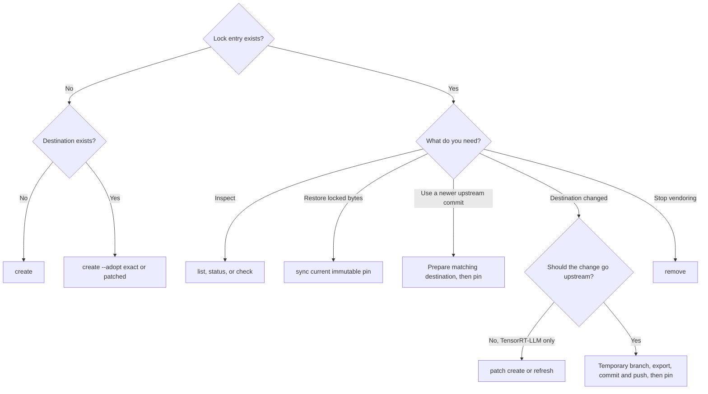

# Vendored Sources

TensorRT-LLM keeps some upstream source trees in this repository so they can be
built, packaged, and reviewed with the code that uses them. The generic
vendoring tool records where each tree came from, materializes it reproducibly,
and rejects destination edits that are not represented by its lock entry.

The generated lock is `3rdparty/vendor_sources.lock.yaml`. It records an
upstream Git URL, an immutable commit, the source and destination directories,
the selected files, any persistent compatibility patch and its content digest,
and a digest of the materialized destination. A short branch or tag may explain
where the commit came from, but the full commit is authoritative.

Use `scripts/vendor_sources.py` for every lock or vendor-state change. Do not
edit the YAML, generated patches, or digests by hand. All examples below use the
default lock. For an isolated test or another consumer repository, place
`--lock PATH` before the subcommand.

## Lock contract

A locked vendor has one of two durable states:

- **Exact**: the selected destination files are byte-for-byte copies of the
  selected files at the locked upstream commit.
- **Patched**: applying a deterministic, persistent compatibility patch to
  those upstream files reproduces the destination exactly. Use this patch only
  for TensorRT-LLM-specific adaptations that do not belong upstream.

A destination edit is not a third state. While such an edit is pending,
`status`, the default offline `check`, and the pre-commit check intentionally
fail. Resolve it by discarding it with `sync`, recording a TensorRT-LLM-only
adaptation with `patch`, or exporting an upstream-worthy change and pinning the
resulting commit. `export` accepts this pending destination delta by default and
does not change the lock or persistent patch.

## Choose a command



`sync` only restores the commit and compatibility patch already recorded in the
lock. It never discovers, imports, or pins a newer upstream commit. To move to a
new upstream revision, first make the destination equal that revision plus the
existing compatibility patch, then use `pin`.

## Inspect vendors

List entries, or run the offline integrity status for all or one vendor:

```bash
python scripts/vendor_sources.py list
python scripts/vendor_sources.py status
python scripts/vendor_sources.py status VENDOR
python scripts/vendor_sources.py check VENDOR
```

`status` and the default `check` exit unsuccessfully if the destination has a
pending delta. That failure is expected during an export workflow and remains
until `pin` succeeds.

## Add or adopt a vendor

When neither the lock entry nor destination exists, create both from an
immutable commit and a local upstream checkout:

```bash
python scripts/vendor_sources.py create VENDOR \
  --url https://example.com/organization/repository.git \
  --branch main \
  --commit FULL_COMMIT \
  --source path/in/upstream \
  --destination path/in/tensorrt-llm \
  --include '**/*.py' \
  --repo /path/to/upstream
```

Use `--tag TAG` instead of `--branch BRANCH` for a tagged source. Without
`--repo`, the tool obtains the commit from the recorded URL.

If the destination already exists but has no lock entry, adopt it. Use `exact`
to require an exact upstream match:

```bash
python scripts/vendor_sources.py create VENDOR \
  --url https://example.com/organization/repository.git \
  --commit FULL_COMMIT \
  --source path/in/upstream \
  --destination path/in/tensorrt-llm \
  --include '**/*.py' \
  --adopt exact \
  --repo /path/to/upstream
```

Use `--adopt patched` instead to capture intentional TensorRT-LLM compatibility
adaptations. Adoption never silently accepts an unrepresented difference.

## Restore the current lock

Discard destination edits and reproduce the currently locked upstream commit
plus its persistent patch:

```bash
python scripts/vendor_sources.py sync VENDOR --repo /path/to/upstream
```

This overwrites the selected destination files. It does not update the lock,
look at a branch tip, or choose a newer commit.

## Maintain a TensorRT-LLM compatibility patch

After editing an exact destination for a change that must remain downstream,
create its persistent patch:

```bash
python scripts/vendor_sources.py patch VENDOR create --repo /path/to/upstream
```

After intentionally changing an already patched destination, regenerate the
patch:

```bash
python scripts/vendor_sources.py patch VENDOR refresh --repo /path/to/upstream
```

Drop a no-longer-needed patch only after the destination exactly matches the
currently locked upstream selection:

```bash
python scripts/vendor_sources.py patch VENDOR drop --repo /path/to/upstream
```

Generated patches live under `3rdparty/vendor_patches/`. Review them, but update
them only through the tool. Do not use a persistent patch for a change that
should be contributed upstream; use the export workflow instead.

## Export a destination change upstream

Start with the desired change in the TensorRT-LLM destination. The offline
check now fails by design. In a clean upstream checkout, create a temporary
branch at the currently locked commit **before** exporting:

```bash
git -C /path/to/upstream switch -c trtllm-vendor-fix LOCKED_FULL_COMMIT
python scripts/vendor_sources.py export VENDOR --repo /path/to/upstream
```

The upstream checkout's selected source must be clean before export and its
`HEAD` must equal the locked commit. `export` computes the pending destination
delta relative to the locked materialization, applies only that delta to the
raw upstream source, and leaves the vendor lock, destination, and persistent
compatibility patch unchanged.

Run the upstream tests, review the result, then commit and push the temporary
branch:

```bash
git -C /path/to/upstream add path/in/upstream
git -C /path/to/upstream commit -s -m 'Apply exported fix'
git -C /path/to/upstream push -u origin trtllm-vendor-fix
```

Finally, pin the committed revision from that checkout:

```bash
python scripts/vendor_sources.py pin VENDOR \
  --url https://example.com/my-fork/repository.git \
  --branch trtllm-vendor-fix \
  --commit NEW_FULL_COMMIT \
  --repo /path/to/upstream
```

`pin` first tries the selected files at `NEW_FULL_COMMIT` plus the existing
persistent compatibility patch. They must exactly equal the checked-in
destination. One exception is safe: if the raw new commit itself exactly equals
the destination, upstream has absorbed the compatibility patch, so `pin` drops
that patch and its metadata. Otherwise `pin` does not absorb a mismatch,
regenerate the patch, or copy candidate files into the destination. On success
it durably updates the immutable lock before removing an absorbed patch and
restores passing offline checks. If the patch cannot be removed after that
commit, `pin` succeeds with a warning and leaves a safe, unreferenced orphan;
delete the reported file manually. A failure before the durable lock commit
does not remove the existing patch. If directory synchronization fails after
the atomic replacement, the lock may already show the new pin, but the retained
patch keeps either recovered lock version reproducible.

The same rule applies when adopting a newer commit that was developed upstream
first: prepare the destination to exactly match the proposed commit plus the
existing patch, then run `pin`. Do not use `sync` to look for that commit.

## Remove a vendor

Remove a lock entry and its generated compatibility patch while preserving the
destination:

```bash
python scripts/vendor_sources.py remove VENDOR
```

The preserved destination is no longer protected by the lock. Delete or move
it separately as part of the reviewed migration that removes the vendor.

## Source access and checks

The default check is deliberately offline:

```bash
python scripts/vendor_sources.py check
python scripts/vendor_sources.py check --offline
```

It validates the lock schema and path safety, patch metadata, and the checked-in
destination digest. It never invokes Git, performs DNS resolution, or contacts
a recorded URL. This is the always-run pre-commit check. A pending destination
delta therefore blocks a commit until it is synchronized, patched, or pinned.

When network access is available, attempt verification against every recorded
upstream:

```bash
python scripts/vendor_sources.py check --upstream
```

An inaccessible repository is reported as unavailable rather than failing. If
a commit can be obtained, a source, patch, or destination mismatch is an error.
Trusted maintainer CI can require access to every source:

```bash
python scripts/vendor_sources.py check --upstream --require-access
```

To verify one vendor against an existing checkout without contacting the
recorded URL, provide it explicitly:

```bash
python scripts/vendor_sources.py check VENDOR --repo /path/to/upstream
```

The checkout's configured remote may differ from the lock URL; it only needs to
contain the locked commit. Source-consuming commands accept the same `--repo`
form.

An offline digest proves that the committed destination matches the lock. It
cannot independently prove that a URL, commit, and source directory produced
that destination. Creating and pinning vendors therefore require a fetched or
local repository, and URL or commit changes require vendor CODEOWNER review.
Never put credentials in a lock URL. Run checks that use internal credentials
only in a trusted environment, not with pull-request-controlled scripts.

## License and attribution

The vendor lock is a reproducibility record, not a license manifest. Before
adding a vendor, verify that the selected upstream files carry the required
notices and follow [the Python third-party process](py-thirdparty.md) or
[the C++ third-party process](cpp-thirdparty.md), as applicable. Exact upstream
files retain their upstream copyright headers. Add an NVIDIA header only to
files that TensorRT-LLM modifies.

## PrimTS

The `flashinfer-prims-ts` entry selects the complete Python tree under
`flashinfer/attention/prims_ts` and materializes it at
`tensorrt_llm/_torch/attention/backends/prims_ts`. The `**/*.py` selection
deliberately omits upstream README files. Its persistent patch contains only
TensorRT-LLM integration and compatibility adaptations; all other selected
files remain exact upstream copies.

Use the normal commands with `flashinfer-prims-ts`, for example:

```bash
python scripts/vendor_sources.py status flashinfer-prims-ts
python scripts/vendor_sources.py check flashinfer-prims-ts
```
