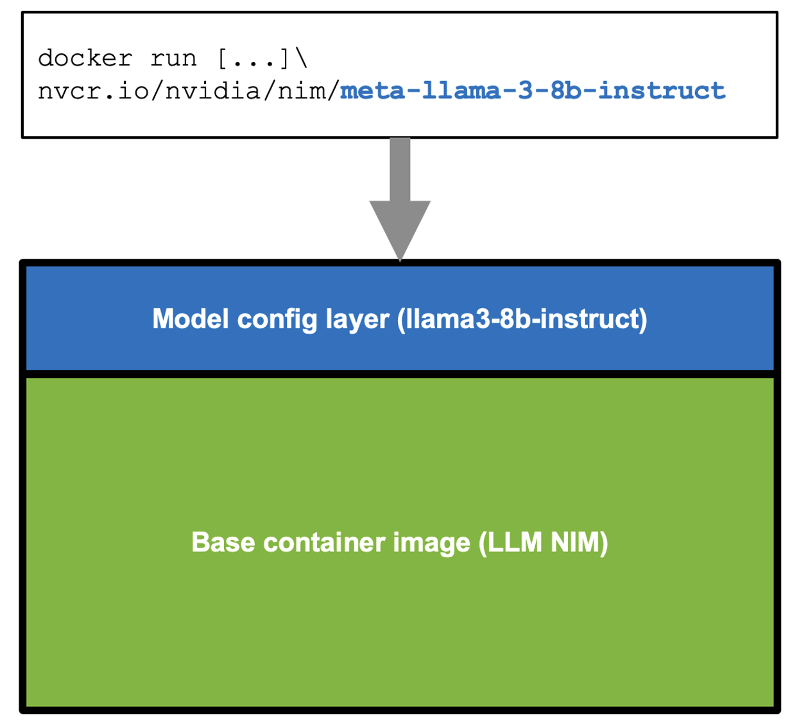

TensorRT-LLM
===========================
<h4> A TensorRT Toolbox for Optimized Large Language Model Inference</h4>

[Architecture](./docs/source/architecture/overview.md)&nbsp;&nbsp;&nbsp;|&nbsp;&nbsp;&nbsp;[Results](./docs/source/performance/perf-overview.md)&nbsp;&nbsp;&nbsp;|&nbsp;&nbsp;&nbsp;[Examples](./examples/)&nbsp;&nbsp;&nbsp;|&nbsp;&nbsp;&nbsp;[Documentation](./docs/source/)

---

## Latest News
* [2024/07/09] Checklist to maximize multi-language performance of @meta #Llama3 with #TensorRT #LLM inference:
✅ MultiLingual
✅ NIM
✅ LoRA tuned adaptors[➡️ Tech blog](https://developer.nvidia.com/blog/deploy-multilingual-llms-with-nvidia-nim/)

* [2024/07/02] Let the @MistralAI MoE tokens fly 📈 🚀 #Mixtral 8x7B with NVIDIA #TensorRT #LLM on #H100.
[➡️ Tech blog](https://developer.nvidia.com/blog/achieving-high-mixtral-8x7b-performance-with-nvidia-h100-tensor-core-gpus-and-tensorrt-llm?ncid=so-twit-928467)

* [2024/06/24] Enhanced with NVIDIA #TensorRT #LLM, @upstage.ai’s solar-10.7B-instruct is ready to power your developer projects through our API catalog 🏎️. ✨[➡️ link](https://build.nvidia.com/upstage/solar-10_7b-instruct?snippet_tab=Try )

* [2024/06/18] CYMI: 🤩 Stable Diffusion 3 dropped last week 🎊 🏎️ Speed up your SD3 with #TensorRT INT8 Quantization[➡️ link](https://build.nvidia.com/upstage/solar-10_7b-instruct?snippet_tab=Try )

* [2024/06/18] 🧰Deploying ComfyUI with TensorRT?  Here’s your setup guide [➡️ link](https://github.com/comfyanonymous/ComfyUI_TensorRT)

* [2024/06/11] ✨#TensorRT Weight-Stripped Engines ✨
Technical Deep Dive for serious coders ✅+99% compression ✅1 set of weights → ** GPUs ✅0 performance loss ✅** models…LLM, CNN, etc.[➡️ link](https://developer.nvidia.com/blog/maximum-performance-and-minimum-footprint-for-ai-apps-with-nvidia-tensorrt-weight-stripped-engines/)

* [2024/06/04] ✨ #TensorRT and GeForce #RTX unlock ComfyUI SD superhero powers 🦸⚡ 🎥 Demo: [➡️ link](https://youtu.be/64QEVfbPHyg)
📗 DIY notebook: [➡️ link](https://console.brev.dev/launchable/deploy?userID=2x2sil999&orgID=ktj33l4xj&name=ComfyUI_TensorRT&instance=L4%40g2-standard-4%3Anvidia-l4%3A1&diskStorage=500&cloudID=GCP&baseImage=docker.io%2Fpytorch%2Fpytorch%3A2.2.0-cuda12.1-cudnn8-runtime&ports=ComfUI%3A8188&file=https%3A%2F%2Fgithub.com%2Fbrevdev%2Fnotebooks%2Fblob%2Fmain%2Ftensorrt-comfyui.ipynb&launchableID=env-2hQX3n7ae5mq3NjNZ32DfAG0tJf)

* [2024/05/28] ✨#TensorRT weight stripping for ResNet-50 ✨ ✅+99% compression
✅1 set of weights → ** GPUs\ ✅0 performance loss ✅** models…LLM, CNN, etc
👀 📚 DIY [➡️ link](https://console.brev.dev/launchable/deploy?userID=2x2sil999&orgID=ktj33l4xj&launchableID=env-2h6bym7h5GFNho3vpWQQeUYMwTM&instance=L4%40g6.xlarge&diskStorage=500&cloudID=devplane-brev-1&baseImage=nvcr.io%2Fnvidia%2Ftensorrt%3A24.05-py3&file=https%3A%2F%2Fgithub.com%2FNVIDIA%2FTensorRT%2Fblob%2Frelease%2F10.0%2Fsamples%2Fpython%2Fsample_weight_stripping%2Fnotebooks%2Fweight_stripping.ipynb&name=tensorrt_weight_stripping_resnet50)

* [2024/05/21] ✨@modal_labs has the codes for serverless @AIatMeta Llama 3 on #TensorRT #LLM ✨👀 📚 Marvelous Modal Manual:
Serverless TensorRT-LLM (LLaMA 3 8B) | Modal Docs [➡️ link](https://modal.com/docs/examples/trtllm_llama)

* [2024/05/08] NVIDIA TensorRT Model Optimizer -- the newest member of the #TensorRT ecosystem is a library of post-training and training-in-the-loop model optimization techniques ✅quantization ✅sparsity ✅QAT [➡️ blog](https://developer.nvidia.com/blog/accelerate-generative-ai-inference-performance-with-nvidia-tensorrt-model-optimizer-now-publicly-available/)

* [2024/05/07] 🦙🦙🦙 24,000 tokens per second 🛫Meta Llama 3 takes off with #TensorRT #LLM 📚[➡️ link](https://blogs.nvidia.com/blog/meta-llama3-inference-acceleration/)

Previous News

* [2024/02/06] [🚀 Speed up inference with SOTA quantization techniques in TRT-LLM](./docs/source/blogs/quantization-in-TRT-LLM.md)
* [2024/01/30] [ New XQA-kernel provides 2.4x more Llama-70B throughput within the same latency budget](./docs/source/blogs/XQA-kernel.md)
* [2023/12/04] [Falcon-180B on a single H200 GPU with INT4 AWQ, and 6.7x faster Llama-70B over A100](./docs/source/blogs/Falcon180B-H200.md)
* [2023/11/27] [SageMaker LMI now supports TensorRT-LLM - improves throughput by 60%, compared to previous version](https://aws.amazon.com/blogs/machine-learning/boost-inference-performance-for-llms-with-new-amazon-sagemaker-containers/)
* [2023/11/13] [H200 achieves nearly 12,000 tok/sec on Llama2-13B](./docs/source/blogs/H200launch.md)
* [2023/10/22] [🚀 RAG on Windows using TensorRT-LLM and LlamaIndex 🦙](https://github.com/NVIDIA/trt-llm-rag-windows#readme)
* [2023/10/19] Getting Started Guide - [Optimizing Inference on Large Language Models with NVIDIA TensorRT-LLM, Now Publicly Available
](https://developer.nvidia.com/blog/optimizing-inference-on-llms-with-tensorrt-llm-now-publicly-available/)
* [2023/10/17] [Large Language Models up to 4x Faster on RTX With TensorRT-LLM for Windows
](https://blogs.nvidia.com/blog/2023/10/17/tensorrt-llm-windows-stable-diffusion-rtx/)

## TensorRT-LLM Overview

TensorRT-LLM is an easy-to-use Python API to define Large
Language Models (LLMs) and build
[TensorRT](https://developer.nvidia.com/tensorrt) engines that contain
state-of-the-art optimizations to perform inference efficiently on NVIDIA GPUs.
TensorRT-LLM contains components to create Python and C++ runtimes that
execute those TensorRT engines. It also includes a
[backend](https://github.com/triton-inference-server/tensorrtllm_backend)
for integration with the
[NVIDIA Triton Inference Server](https://developer.nvidia.com/nvidia-triton-inference-server);
a production-quality system to serve LLMs.  Models built with TensorRT-LLM can
be executed on a wide range of configurations going from a single GPU to
multiple nodes with multiple GPUs (using
[Tensor Parallelism](https://docs.nvidia.com/deeplearning/nemo/user-guide/docs/en/stable/nlp/nemo_megatron/parallelisms.html#tensor-parallelism)
and/or
[Pipeline Parallelism](https://docs.nvidia.com/deeplearning/nemo/user-guide/docs/en/stable/nlp/nemo_megatron/parallelisms.html#pipeline-parallelism)).

The TensorRT-LLM Python API architecture looks similar to the
[PyTorch](https://pytorch.org) API. It provides a
[functional](./tensorrt_llm/functional.py) module containing functions like
`einsum`, `softmax`, `matmul` or `view`. The [layers](./tensorrt_llm/layers)
module bundles useful building blocks to assemble LLMs; like an `Attention`
block, a `MLP` or the entire `Transformer` layer. Model-specific components,
like `GPTAttention` or `BertAttention`, can be found in the
[models](./tensorrt_llm/models) module.

TensorRT-LLM comes with several popular models pre-defined. They can easily be
modified and extended to fit custom needs. Refer to the [Support Matrix](https://nvidia.github.io/TensorRT-LLM/reference/support-matrix.html) for a list of supported models.

To maximize performance and reduce memory footprint, TensorRT-LLM allows the
models to be executed using different quantization modes (refer to
[`support matrix`](https://nvidia.github.io/TensorRT-LLM/reference/support-matrix.html#software)).  TensorRT-LLM supports
INT4 or INT8 weights (and FP16 activations; a.k.a.  INT4/INT8 weight-only) as
well as a complete implementation of the
[SmoothQuant](https://arxiv.org/abs/2211.10438) technique.

## Getting Started

To get started with TensorRT-LLM, visit our documentation:

- [Quick Start Guide](https://nvidia.github.io/TensorRT-LLM/quick-start-guide.html)
- [Release Notes](https://nvidia.github.io/TensorRT-LLM/release-notes.html)
- [Installation Guide for Linux](https://nvidia.github.io/TensorRT-LLM/installation/linux.html)
- [Installation Guide for Windows](https://nvidia.github.io/TensorRT-LLM/installation/windows.html)
- [Supported Hardware, Models, and other Software](https://nvidia.github.io/TensorRT-LLM/reference/support-matrix.html)

## Community
- [Model zoo](https://huggingface.co/TheFloat16) (generated by TRT-LLM rel 0.9 a9356d4b7610330e89c1010f342a9ac644215c52)
