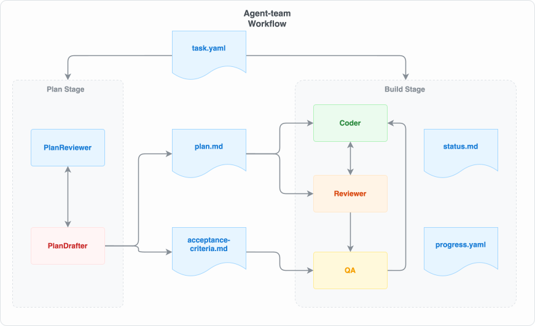
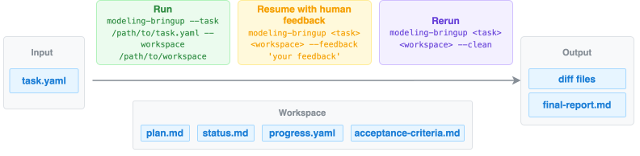
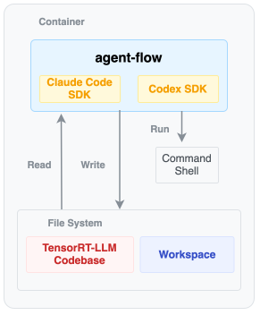
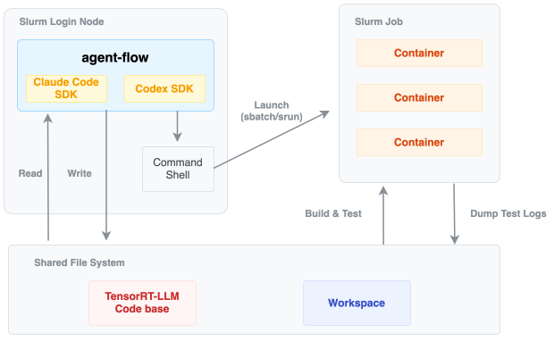
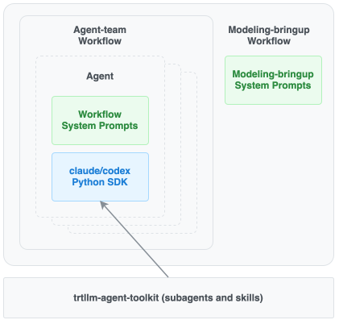

# Modeling-bringup workflow

## Introduction

`modeling_bringup` is an application built on the
[`agent-flow`](../../../README.md) framework. It orchestrates a team of coding
agents to implement a new model in TensorRT-LLM from reference model code,
checkpoints, and task-specific bring-up requirements.

The workflow specializes the generic [`agent_team`](../agent_team/README.md)
plan-build-verify loop for TensorRT-LLM model development. Its goal is to turn a
model bring-up request into an implementation that uses TensorRT-LLM
infrastructure and is validated against accuracy criteria.



## Capabilities

### What it can do

- Implement text-only LLMs in TensorRT-LLM using its high-performance backends
  and modules.
- Produce implementations compatible with core TensorRT-LLM features including
  CUDA graphs, CPU overlap, and chunked prefill.
- Support various model-parallel strategies used by TensorRT-LLM.
- Validate the implemented model's accuracy on datasets.

### What it cannot do yet

- Multimodal models are not well exercised yet.
- Complex serving features such as disaggregated serving and speculative
  decoding are not validated by the workflow today.
- Accuracy debugging can still fall short of human expert tuning, and human
  effort may still be needed to fine-tune accuracy in complex cases. For
  example, a human expert may tune GSM8K accuracy to 96%, while
  `modeling_bringup` may only reach 90% in some cases.

## Usage

### Installation

```bash
pip install -e .[devel]
```

Note: this automatically installs Claude-Agent-SDK and Codex-SDK. Users still
need to complete Claude Code and Codex authentication and activation themselves.

Start with [`quick_start.md`](quick_start.md), an end-to-end walkthrough that
brings up ChatGLM3-6B. It covers fetching the reference Hugging Face repo,
writing the task brief, launching the workflow, and watching QA complete final
verification.

To bring up your own model, copy [`task.example.yaml`](task.example.yaml) to
`task.yaml`, fill in the source paths, completion criteria, and implementation
tips, then run:

```bash
modeling-bringup \
    --task task.yaml \
    --workspace workspace/modeling-bringup
```

This is equivalent to:

```bash
python -m agent_flow.workflows.modeling_bringup.cli \
    --task task.yaml \
    --workspace workspace/modeling-bringup
```



## Running with a human in the loop

`modeling-bringup` is built to run with a human in the loop, not fully
unattended. This section covers why that matters, how to watch a run, and how
to steer it with feedback.

### Why human involvement is needed

The workflow needs to respond to human intervention quickly and effectively:

- A human may discover partway through that the plan is unreasonable, and then
  adjust it accordingly.
- When the delivery deadline is tight, human intervention becomes necessary —
  the human frequently offers suggestions on the agents' execution to keep the
  run on the fastest path to a working model.

An unattended run will still converge in many cases, but a human who watches
the intermediate artifacts and injects course corrections at the right moments
is typically both faster and more reliable — especially for models where
accuracy tuning is delicate.

### Observing the modeling agent's execution

A run continuously writes its state into the workspace as a set of intermediate
files:

- `plan.md` — the current implementation plan and risk register.
- `acceptance-criteria.md` — the outcome-bound pass/fail checklist QA verifies
  against.
- `progress.yaml` — an append-only audit log of every plan/build/QA turn, with
  each agent's `decision` and `weighted_score`, plus the `human_feedback`
  entries.
- `status.md` — a rolling scratchpad the Coder and Reviewer overwrite each turn;
  in replan mode its `## Stages & Goals` table at the top is the live state
  machine (see below).
- `.agent_team_state.json` — the checkpoint (current stage + iteration indices).

You can tail these directly, but the recommended way to observe a run is to
**open a second, independent Claude Code or Codex session** pointed at the same
workspace and ask it to read these files and report back — for example, "read
`progress.yaml` and `status.md` in this workspace and tell me which Stage we're
on, what the last QA verdict was, and whether the run is stuck." That gives you
a natural-language summary of a long run without parsing the raw artifacts
yourself, and you can keep asking the observer session follow-up questions while
the main run keeps going.

### Steering the run with feedback

**Delivering feedback.** Feedback is delivered by stopping the run (Ctrl-C) and
re-running the same command with `--feedback`. Because the workspace holds all
state, the run resumes from its checkpoint and folds in your note:

```bash
modeling-bringup \
    --task task.yaml \
    --workspace workspace/modeling-bringup \
    --feedback "your feedback for the next iteration"
```

By default `--feedback` appends your note to `progress.yaml`'s `human_feedback`
list, and the build-phase agents (Coder, Reviewer, QA) pick it up on their next
turn. This lets you steer the workflow one iteration at a time without losing
the plan, progress, or checkpoint state. (Use `--clean` instead to wipe the
workspace and restart from the plan phase.)

**Why the workflow keeps replanning.** Simply making a plan once at the start is
not enough:

- The initial plan gradually becomes ineffective as requirements shift.
- The changing product requirements call for adjustments to the plan.

To keep the plan alive, run with `--replan-on-qa`. After every QA turn the
PlanDrafter is re-invoked in *replan mode* to revise `plan.md` and
`acceptance-criteria.md` from the latest coder/reviewer/qa findings, and it —
not QA — decides whether the task is `DONE`, needs a quick polish (straight back
to the Coder), or a major rewrite (routed through the PlanReviewer first).

To make your feedback drive a replan *immediately* instead of waiting for the
agents to consume it on their own turn, combine the flags:

```bash
modeling-bringup \
    --task task.yaml \
    --workspace workspace/modeling-bringup \
    --replan-on-qa \
    --trigger-replan-with-feedback \
    --feedback "the plan should ...; drop the ... goal"
```

On resume, `--trigger-replan-with-feedback` jumps straight into the replan
sub-cycle so the PlanDrafter folds your new feedback (and the latest findings)
into `plan.md` / `acceptance-criteria.md` before any further coding, rather than
resuming at the saved build stage. It requires `--replan-on-qa`, and is a no-op
on a fresh run or when `--feedback` is absent.

**Stages and Goals.** Replan mode also introduces a **Stage/Goal** breakdown
that makes a run far easier to observe and steer. `plan.md`'s implementation
steps are organized into numbered Stages, each with an explicit exit criterion,
and each Stage holds a list of Goals (`Goal <Stage>.<Goal>`). `status.md` carries
a `## Stages & Goals` table at the top that is the live state machine:

- **Stage** states: `PENDING`, `IN_PROGRESS`, `CLOSED (pending QA)`, `CLOSED`
  (verified by QA), and `INTERRUPTED` (preempted by a feedback-triggered
  replan).
- **Goal** states: `[Undo]` (not started), `[Doing]` (active, with an
  `(iterations=N)` counter), `[Done]`, `[Failed]`, and `[Skipped]` (superseded
  by a feedback-triggered replan).

The Coder works exactly one `[Doing]` Goal per turn, and the Reviewer and
replan-mode PlanDrafter own the state transitions. For a modeling bring-up the
Stages typically map to the bring-up milestones — e.g. Stage 1 accuracy
convergence on a simple backend, Stage 2 the production performance backends,
Stage 3 cuda_graph + overlap_scheduler — so at a glance you can see which
milestone the run is on, which Goal is active, and how many iterations it has
spent there. This is the single most useful thing for the observer session (or
you) to read when deciding whether and how to intervene.


## Task file

The three required fields are `reference_code_path`, `checkpoint_path`, and
`trtllm_repo_path`. They are validated up front: a missing field or a path that
does not exist aborts the run before any agent is constructed.

`completion_criteria` and `implements_tips` are optional lists of strings. The
`implements_tips` name is part of the task schema and is used for implementation
guidance. Extra YAML keys are preserved on disk for the agents to read.

To run from a Slurm login node, add an optional `slurm-environment` section
with `slurm_partition` and `docker_image`. The presence of this section is
what injects the Slurm/container prompt block into the agents. See
[`task.slurm.example.yaml`](task.slurm.example.yaml) for a full example.

All flags from the generic `agent-team` CLI are accepted as-is. See the
[`agent_team` README](../agent_team/README.md#useful-flags) for their semantics.
`--concurrent-review` overlaps the Reviewer with the next Coder iteration: it
freezes `trtllm_repo_path` at a git ref after each Coder turn (or
`review_snapshot_repo` / `--review-snapshot-repo` when the checkout the Coder
edits is not the TensorRT-LLM one), so from then on **the Coder must do its
work in a git worktree branched from that snapshot** and fold the commits back
once the verdict notice arrives — the main checkout has to stay still while the
Reviewer builds and runs it. Add optional `worktrees_dir` /
`worktree_reservations` keys to name where those worktrees live. An
uncommitted working tree at the end of a Coder turn falls back to a sequential
review for that iteration.
The workflow source lives in `agent_flow/workflows/modeling_bringup/`; import
the bundle programmatically with
`from agent_flow.workflows.modeling_bringup import MODELING_BRINGUP_PROMPTS`.

## Environment

`modeling-bringup` agents support two execution modes for different runtime
environments.

### Container mode

In container mode, agents edit and run code inside the TensorRT-LLM container.
This mode is suitable when the target model can be developed and validated in a
single container environment.



### Slurm mode

Slurm mode is for models that cannot run on a single node. In this mode, the
workflow runs directly on the login node of a Slurm cluster and uses the cluster
environment to execute larger model bring-up and validation tasks.



To run in Slurm mode, add a `slurm-environment` section to the task YAML, as
shown in `task.slurm.example.yaml`, and provide the required
`slurm_partition` and `docker_image` values.

In Slurm mode, the build-phase agents share an additional workspace file
`test_command.md` that caches verified `srun`/`sbatch` wrappers around
`trtllm-bench`, `trtllm-eval`, and pytest. Coder, Reviewer, and QA append to
the file, delete entries that no longer pass, and overwrite entries when a
command is corrected. On local tasks without `slurm-environment`, the Slurm
prompt block is not injected and this file is not created. Bring-up-specific
drafting rules live in
`agent_flow/workflows/modeling_bringup/prompts/_common.py:TEST_COMMAND_CACHE`.

## Implementation

`modeling-bringup` inherits the implementation of
[`agent_team`](../agent_team/README.md). It reuses the same orchestration loop,
workspace state files, checkpoint/resume behavior, MCP tools, and CLI flags, and
specializes the agents with TensorRT-LLM modeling bring-up prompts.

The `agent_team` workflow starts with a planning phase: `PlanDrafter` writes the
implementation plan and acceptance criteria, then `PlanReviewer` reviews them
and either approves or asks for a revision. After the plan is approved, the
workflow enters the build phase, where `Coder` implements the change,
`Reviewer` checks the implementation, and `QA` runs the final verification. If
review or QA rejects the result, the workflow loops back to the coder for the
next iteration.

For the full implementation contract, shared workspace files, flags, and MCP
tool details, see the [`agent_team` README](../agent_team/README.md).

On top of the inherited `agent_team` implementation, `modeling-bringup` extends
the agent prompts with domain-specific principles for TensorRT-LLM model
bring-up. These prompts guide the agents to respect TensorRT-LLM implementation
boundaries, prefer existing high-performance modules, validate model accuracy,
and use TensorRT-LLM-related skills during planning, coding, review, and QA.


