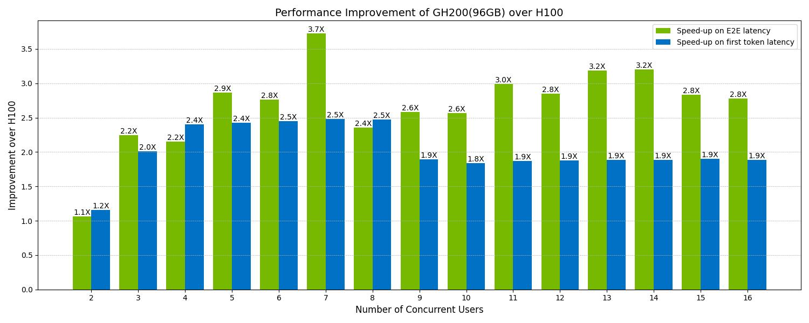

# Benchmark Multi-user Multi-round Serving with Llama-3.1-70B

## Overview
This benchmark is a multi-user, multi-round serving system designed to handle interactions with multiple users simultaneously, enabling a sequence of requests and responses in multiple rounds per user. It is suitable for applications like chatbots, customer support systems, or other interactive services where stateful conversations are required.

#### Application Setup
Each user is assigned a unique long context prompt consisting of 16,000 tokens with precomputed kv_cache.

* First Round: The input includes the 16,000-token context prompt and an additional 64 new input tokens. The output length is limited to 64 tokens.
* Subsequent Rounds: The input is formed by combining the previous input, the output tokens from the last round, and 64 new input tokens. The output length is limited to 64 tokens.

#### Benchmark Features
This benchmark leverages kv_cache reuse and allocates host (CPU) memory as a secondary pool for kv_cache blocks. It measures the end-to-end runtime of 10 rounds, with user requests processed in a round-robin fashion. As the number of users increases, the kv_cache footprints exceed the GPU memory capacity. In such cases, less recently used cache blocks are offloaded to CPU memory and brought back to the GPU as needed for subsequent rounds.

Additionally, the benchmark tracks the Time to First Token (TTFT). Since each user’s long context prompt has precomputed kv_cache, a new request can reuse this cache while processing the additional input tokens, ensuring efficient response generation of the first output token.

#### Comparing GH200 and H100
This benchmark highlights the potential of the NVIDIA GH200 in comparison to the H100. The GH200 utilizes NVIDIA NVLink-C2C to provide a CPU+GPU coherent memory model with 900 gigabytes per second (GB/s) memcpy throughput, which is 7x faster than the H100 connected via PCIe Gen5. GH200 also has larger on GPU memory. GH200 offers configurations of 96 GB or 144 GB while is equipped with 80 GB of GPU memory.

## Performance Comparison
> NOTE: GH200 with 96 GB on GPU memory is used to generate the below results.

#### On-GPU kv_cache Storage:
The H100 can support 2 concurrent users with on-GPU kv_cache storage, whereas the GH200 can support 7 concurrent users, leveraging its larger GPU memory capacity.

#### User Size = 2:
At a user size of 2, kv_cache is fully stored in GPU memory for both H100 and GH200. Performance improvements in this scenario are unrelated to NVLink-C2C or the larger GPU memory size of the GH200.

#### User Sizes 3 to 7:
The H100 must offload kv_cache to CPU memory and transfer precomputed blocks back to GPU when needed. This additional memory transfer introduces latency due to the slower communication between CPU and GPU. GH200 can handle kv_cache entirely in GPU memory, eliminating the need for memory transfers. Thus, GH200’s performance improvement peaks at a user size of 7.

#### User Size > 7:
GH200 needs to utilize the CPU memory pool of kv_cache. The latency added is much less than H100 due to faster communication between CPU and GPU. GH200 delivers a 1.9x improvement in Time to First Token (TTFT) and approximately 3x improvement in end-to-end runtime over 10 rounds compared to the H100.

## Reproduction
Use **run.sh** to reproduce the benchmark.
