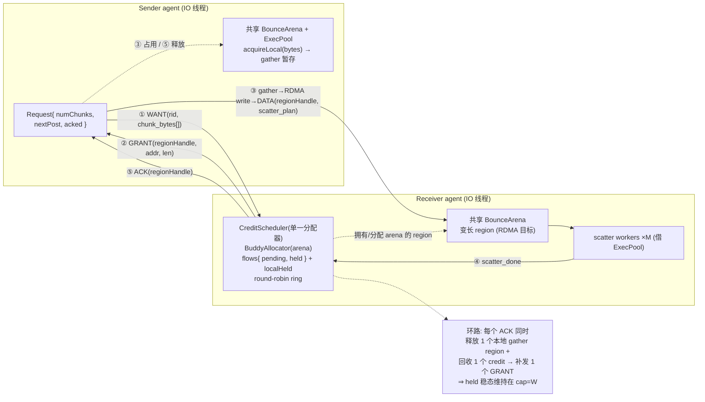
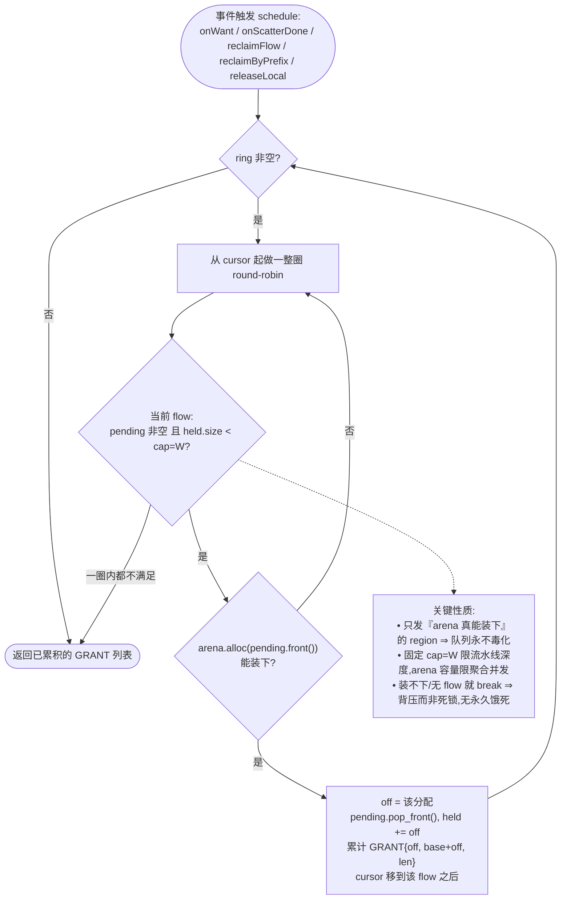
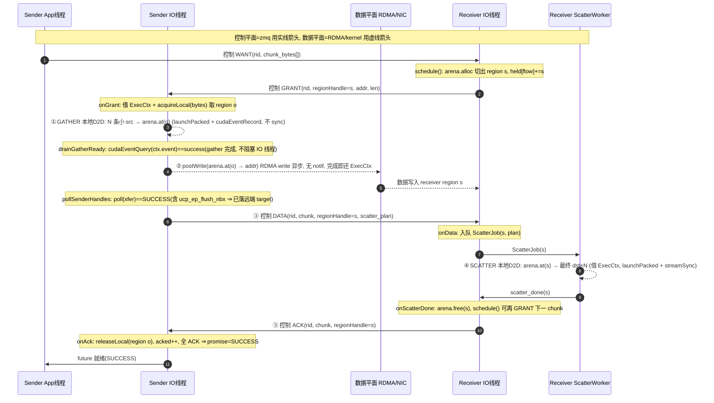
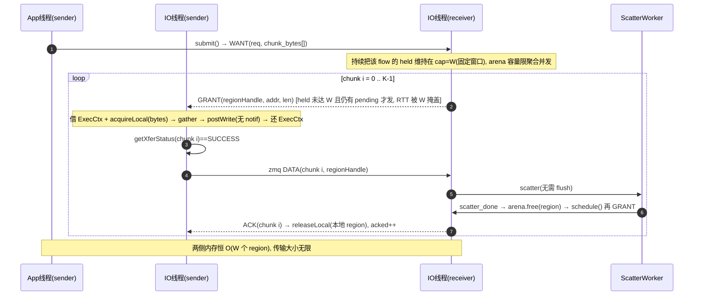
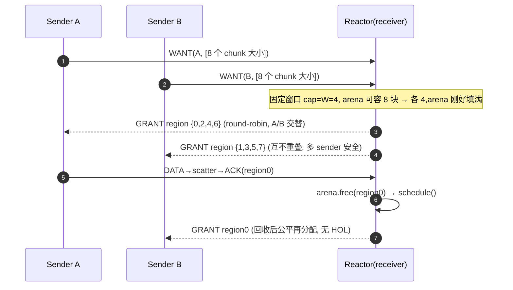
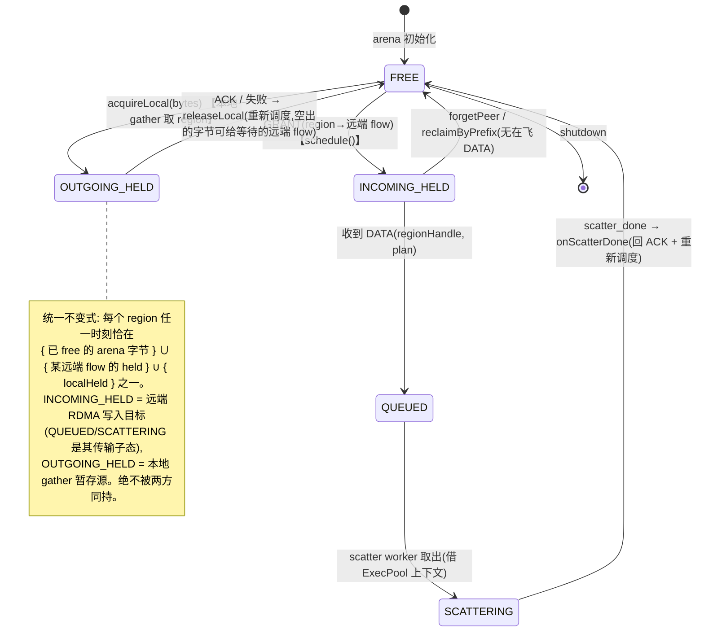
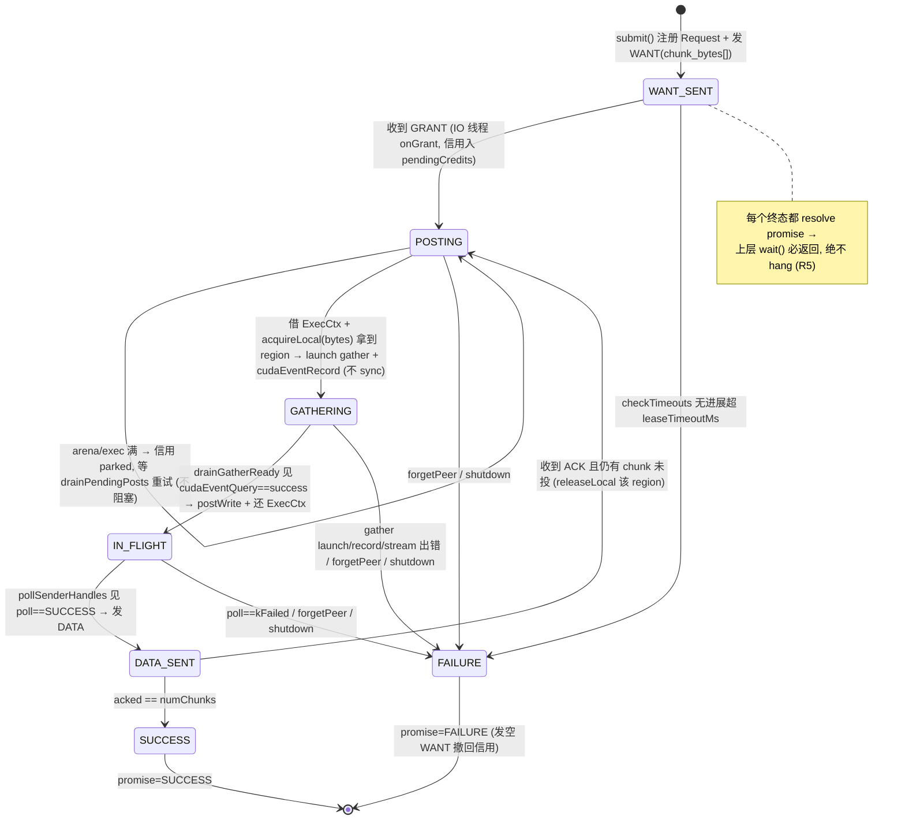
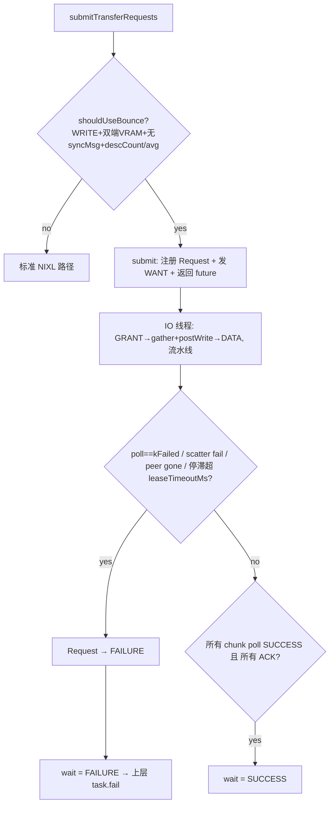

# NIXL Bounce-Buffer v2 — 设计文档

> 描述当前实现(as-built)。代码位于 `cpp/tensorrt_llm/executor/cache_transmission/nixl_utils/bounce/`,
> 通过 `NixlTransferAgent` 集成(`transferAgent.cpp`),运行期由 `TRTLLM_NIXL_BOUNCE_ENABLE` 开关。

---

## 1. Motivation / 要解决的痛点

Disaggregated KV 传输里,一次 `submitTransferRequests` 常携带**几千~几万条 ~4KiB 的分散 desc**。
逐 desc 提交给 NIXL → NIC 的 **per-desc 开销主导**,链路远低于线速。

数据通路思路:sender 把分散小 desc **gather** 进一块预注册大缓冲 → **单次 RDMA write** 打到对端缓冲
→ receiver **scatter** 回最终 dst:

```
src×N  ──gather──▶  region(sender)  ──RDMA write──▶  region(receiver)  ──scatter──▶  dst×N
```

真正要做对的是**控制平面**:缓冲在多 sender 间如何分配、流控、回收、错误处理。要同时满足:

- **R1** 单请求数据量 > 两侧缓冲总和时仍能优雅流式传输(有界缓冲承载无界传输)。
- **R2** Pipeline:gather / RDMA write / scatter 在 GPU 与 NIC 上重叠,打满 NIC。
- **R3** 一个 receiver 被多个 sender 并发写,公平、无饿死、无串扰。
- **R4** sender 多线程并发 `submit`,线程安全。
- **R5** 任意错误 / 对端失联 / teardown 都让 `wait()` 返回(SUCCESS/FAILURE),**绝不 hang**。
- **R6/R7** 模块化、可测、可读;控制 / 数据平面可插拔。

另一个关键诉求:**高并发大量小请求**(每请求总字节 < 缓冲大小)时不应让每请求独占一整块大缓冲
(浪费 + 限制并发),**同时**还要能承载单个大于整块缓冲的请求。→ 采用**变长 region arena**。

---

## 2. 设计总览 (Overview)

- **一块共享 `BounceArena`**(注册一次的设备大缓冲)被切成**变长 region**:每个 chunk 拿一块**正好其
  字节大小**的 region。大量小请求紧致打包(高并发、无浪费);超过整块的请求按 chunk 流式 + 回收。
- **信用流控**:receiver 是缓冲的所有者;sender 必须先拿到**信用**(对某 region 的独占写权)才能写。
  信用按 chunk 增量发放(WANT/GRANT),scatter 完成即回收再发(ACK),全程有界。
- **单 IO 线程 reactor**:每 agent 一个 IO 线程独占信用 / 请求状态(几乎无锁)+ M 个 scatter worker。
- **无 `notifMsg`、无额外 flush**:数据落地判定完全靠 sender 本地 `poll==SUCCESS`(NIXL UCX 后端每次
  传输已追加 `ucp_ep_flush_nbx`,SUCCESS ⇒ 数据已在对端 target 落地可见)。
- **执行资源解耦**:跑一次 gather/scatter kernel 所需的 stream/event/scratch 来自一个小 `ExecPool`,
  按 kernel 借 / 还;与 region 的长生命周期(到 ACK)分离。



一个 agent 可同时是 sender 和 receiver,**两角色共用同一块 arena**(多数 disagg agent 只发或只收,
单块缓冲省一半内存;双角色时也只共用一份,无死锁)。

---

## 3. 术语 (Terminology)

| 术语 | 含义 |
|---|---|
| **region** | 从 `BounceArena` 切出的一块变长缓冲;其 **handle = arena 内字节偏移**(`addr = baseAddr + offset`)。 |
| **chunk** | `BounceTransferPlan` 把分散 (src,dst) desc 打包成的一块,字节数 ≤ `maxChunkBytes`,用一次 RDMA write 搬运。 |
| **credit / 信用** | 对某个 region 的**独占写权**,以 `GRANT{regionHandle, addr, len}` 发给唯一一个 sender。 |
| **flow** | 一条独立请求流,key = `"peer\x1f rid"`(同一 peer 的多个并发请求是独立 flow)。 |
| **window W** | per-flow 在飞 region 数上限(= pipeline 深度);`windowDepth` 是默认值,`window` 可覆盖。 |
| **arena** | 单块共享、注册一次的设备缓冲(`BounceArena`)。 |
| **ExecCtx** | 跑一次 gather/scatter 所需的 `{stream, event, scratch, hostPinned}`,来自 `ExecPool`,按 kernel 借 / 还。 |
| **gather / scatter** | 多条小 desc ↔ 连续 region 之间的批量 D2D 拷贝(`GatherScatterKernel`)。 |

---

## 4. 模块与职责 (Modules)

纯逻辑(无 GPU / 线程 / IO,可单测):

| 模块 | 职责 |
|---|---|
| `BounceConfig` | env → POD 配置快照(`fromEnv`)。 |
| `BounceTransferPlan` | bin-pack (src,dst) desc → `chunks`(每块 ≤ `maxChunkBytes`,32B 对齐,跳过零长);算每 desc 在 region 内的偏移(`bounceOffsets`)与 `packedBytes`。 |
| `BounceMessage` | 控制平面 wire 编解码(40B 头 + 定长 entry);little-endian。 |
| `BuddyAllocator` | 纯逻辑 power-of-two buddy 分配器(按字节 offset);`alloc(bytes)`/`free(offset)`,合并 buddy,无外碎片、内碎片 ≤2×。 |
| `CreditScheduler` | receiver 信用分配 + round-robin 公平调度;内嵌 `BuddyAllocator`(覆盖 arena);也供本地 sender `acquireLocal(bytes)`。**单 IO 线程独占,非线程安全**。 |

设备 / IO / 集成:

| 模块 | 职责 |
|---|---|
| `BounceArena` | 一块 `arenaBytes` 设备缓冲(MNNVL 走 `common::FabricMemory`,否则 `cudaMalloc`),注册一次;`base()/baseAddr()/at(offset)`。 |
| `ExecPool` | E 个 `ExecCtx`;`tryAcquire()`(非阻塞,满则 nullptr)/`release()`,线程安全。 |
| `GatherScatterKernel` | 批量 memcpy(uint4 向量化,非对齐走 byte 路径)。 |
| `TransferEngine`(抽象)| 数据平面唯一操作:`registerRegion` / `postWrite` / `poll` / `release`。`NixlTransferEngine`(生产,包同一个 `nixlAgent`)、`LocalCopyTransferEngine`(loopback 测试,D2D)。 |
| `ControlChannel`(抽象)| `addPeer` / `sendTo` / `recv`。`ZmqControlChannel`:ROUTER 收 + 每 peer DEALER 发;`sendTo` **非阻塞**(队列满 `kSendHwm` 即丢弃,绝不阻塞 IO 线程)。 |
| `BounceTransport` | **thin reactor**:1 IO 线程 + M scatter worker;持有 `BounceContext` + `BounceSender` + `BounceReceiver`,把控制消息路由给对应角色、每轮驱动两个角色的 drain;`submit()` / `addPeer()` / `forgetPeer()` / `shutdown()`。 |
| `BounceContext` | 两个角色共享、单 IO 线程独占的依赖:注入的 channel/engine/arena/exec、那**唯一一个** `CreditScheduler`(同一 arena 服务收发两侧)、`sendGrants()`。 |
| `BounceSender` | **[S] 角色**:`submit→WANT`、`GRANT→gather+write`、`ACK→resolve`;持有请求表 + 发送侧延迟清理状态(`mOrphanLocal` / `mPendingCancel`)。 |
| `BounceReceiver` | **[R] 角色**:`WANT→授信 region`、`DATA→scatter`、回 `ACK`;持有 scatter worker + job/done 队列 + `mScattering`(在飞 scatter 的 orphaned 标记)。 |
| `NixlTransferAgent` 集成 | `maybeInitBounce`(建 arena+exec+transport,注册 arena)、`shouldUseBounce`(路由判定)、`AgentDesc` 携带本端 bounce 端点(sender→receiver 方向 bootstrap)+ **WANT 携带 sender 端点(receiver 反向自举,见 §6)**、`invalidateRemoteAgent`→`forgetPeer`。 |

---

## 5. 控制平面:信用流控 + 公平调度 (R1/R3)

**消息**(全部走 `ControlChannel`,默认 zmq):

| 消息 | 方向 | 载荷 |
|---|---|---|
| `WANT` | sender → receiver | 每个 chunk 的字节大小数组(空数组 = cancel)+ **sender 自己的 bounce 控制端点**。 |
| `GRANT` | receiver → sender | credit 数组 `{addr, len, devId(receiver), regionHandle}`。 |
| `DATA` | sender → receiver | `regionHandle` + scatter plan;**仅在 `poll==SUCCESS` 后发**(即 scatter 触发器)。 |
| `ACK` | receiver → sender | `regionHandle`;scatter 完成、region 可回收。 |

**控制面双向自举(关键)**:bounce 需要双向控制通道(sender 发 WANT/DATA,receiver 回 GRANT/ACK),但
disagg 的元数据交换是**单向**的——KV sender 会 `loadRemoteAgent` 加载 receiver 的 `AgentDesc`(于是 sender
`addPeer`(receiver),能发 WANT),但 **receiver 从不加载 sender**。因此 WANT 额外携带 **sender 的控制端点**,
receiver 在 `onWant` 里据此 `addPeer(sender)` 自举反向通道,GRANT/ACK 才能回流。否则每个 bounce 传输都会
卡到 leaseTimeout 失败(发送侧 `AgentDesc` 路径只覆盖 sender→receiver 一个方向)。cancel/abort 靠**空 WANT**
(仍带端点),不需要单独的握手 / RETURN 消息。

**端点是可路由 IP(跨节点)**:`ZmqControlChannel` 不能 bind `127.0.0.1`(跨节点对端连不上)。`maybeInitBounce`
用共享的 `common::getLocalIp(getEnvNixlInterface(), rank)` 解析本机可路由 IP(`TRTLLM_NIXL_INTERFACE` 指定
NIC,否则按出网路由 / hostname 自动探测——与 UCX/NIXL 选址完全一致),bind `tcp://<ip>:*`;`localEndpoint()`
经 zmq `last_endpoint` 拿到实际 `tcp://<ip>:<port>` 随 AgentDesc / WANT 广告出去。单元测试直接构造
`ZmqControlChannel` 时仍用 `tcp://127.0.0.1:*` 默认(同机足够)。**IPv6**:zmq 默认关闭 IPv6,故 IP 为 IPv6
时 bind 地址加方括号 `tcp://[<ip>]:*` 且 ROUTER 置 `ZMQ_IPV6`;DEALER(`addPeer`)无条件置 `ZMQ_IPV6`
以便连 IPv6 端点(对 IPv4 无害)——同样对齐 ucx_utils。

**receiver 状态**(活在 IO 线程,无锁):`BuddyAllocator arena` + `flows{ pending: 各 chunk 字节, held: region offsets }`
+ 轮询 `ring`(活跃 flow key) + cursor。固定 `cap = W`。

`schedule()` —— 按需、round-robin 公平、永不毒化、永不死锁:



**直观理解(给新人)** —— `schedule()` 解决的问题:多个远端 sender 同时想往**同一块共享 arena** 写数据,如何
**公平且有界**地把 arena 空间发出去。三个约束:

1. **公平**:多个 flow **轮流**拿(round-robin),不让先到的 flow 独占。
2. **单 flow 限速(窗口 W)**:每个 flow 同时最多 `W` 块 region 在飞(`held.size() < W`),多了要等 ACK 释放
   —— 这就是流水线深度。
3. **总量限速(arena)**:所有 flow 的在飞 region 共享一块 arena,装不下就先不发(背压,不报错)。

把它想成**排队发号**:`ring` 是排队的 flow 列表,`cursor` 是"下一个轮到谁"的指针。每趟内层循环**只发一块**
region —— 发给"轮到的、还想要(`pending` 非空)、窗口没满(`held < W`)、且 arena 此刻装得下队首 chunk"的那个
flow,然后把 `cursor` 移到它**之后**、`break` 重新从头再发一块。于是发放顺序在各 flow 之间**交替**,而不是把一个
flow 的窗口一次性灌满。外层循环一直发,直到**整整一圈都没发出任何一块**(全都 pending 空 / 窗口满 / 装不下)才停。

**一个例子**(`W=2`,arena 此刻够放 4 块;flow A 有 3 个 chunk c1/c2/c3,flow B 有 2 个 d1/d2,起始 cursor→A):

| 步 | cursor 指向 | 动作 | A.held | B.held |
|---|---|---|---|---|
| 1 | A | 发 `A/c1` | 1 | 0 |
| 2 | B | 发 `B/d1` | 1 | 1 |
| 3 | A | 发 `A/c2` | 2 | 1 |
| 4 | B | 发 `B/d2` | 2 | 2 |
| 5 | A | A 窗口满(2≥W)跳过;B 窗口满跳过 → 一圈无进展 → **停** | 2 | 2 |

发放顺序 `A,B,A,B`(严格交替);A 的 `c3` 留在 `pending`,等 A 的某块 region 被 ACK 释放(`onScatterDone`→
`schedule()`)后的**下一次** `schedule()` 才发出。每次 `schedule()` 返回的就是这一批新发的 GRANT,由 `sendGrants`
按 flow key 拆出 peer 发回去。

要点:

- **两级限流**:per-flow 窗口 `W` 限单 flow 流水线深度;**arena 容量**限聚合并发(`alloc` 失败 ⇒ 背压,
  不死锁)。不存在"按活跃 flow 数动态均分 cap"的逻辑。
- **flow 生命周期回收**:flow key 含单调不复用的 `rid`;`pending` 与 `held` 都空时 `eraseIfDone` 立即删除
  该 flow,否则长跑 server 上 `flows/ring` 无界增长、`schedule()` 退化为 O(历史请求数)。
- **本地 sender 共用同一 arena**:`acquireLocal(bytes)` 从同一 `BuddyAllocator` 取 gather 暂存 region;守恒
  不变式跨 `{free 字节, 各 flow held, localHeld}` 成立。
- **大 chunk 公平性(已知特性)**:`schedule()` 无 aging——head flow 的大 chunk 暂时装不下时跳过试下一个。
  持续的小 chunk 负载理论上可让大 chunk 久等(非死锁,契约满足:buddy 合并最终腾出高阶块)。配置上保证
  `maxChunkBytes ≤ arenaBytes`(见 §11,超出则 clamp),即**全新 arena 必能装下任一 chunk**,排除"永远装不下"。

---

## 6. 数据平面 & Pipeline (R2)

- receiver 一次把某 flow 的 `held` 顶到 `W`(空闲足够时一条 GRANT 连发 W 个)→ sender 同时握 W 个信用
  → **W 个 chunk 同时在飞**;每个 ACK 释放 1 个 region,receiver 补 1 个 GRANT 维持 held=W。
- **W 按"整圈延迟"取**:`W ≥ ⌈整圈(write + getXferStatus + DATA + scatter + ACK/GRANT 回程) / 单 chunk write⌉`
  (带宽-延迟积);gather/scatter(D2D ~TB/s)藏在前一 chunk RDMA(IB ~25GB/s)的影子里,NIC 始终是瓶颈。
- gather/scatter 各借一个 `ExecCtx` 的独立 stream,不同 chunk 的 gather/write/scatter wall-clock 重叠。

**无 `notifMsg` / 无 GPUDirect flush**:`getXferStatus==SUCCESS` 已含 NIXL 每传输追加的 `ucp_ep_flush_nbx`
(数据在 origin 与 target 均完成)。sender 一旦 poll 到 SUCCESS 即发 DATA,receiver 收到即可 scatter。

---

## 7. 线程模型 (R4/R5)

- **每 agent 1 个 IO 线程**,是 `CreditScheduler` + sender 请求表的唯一拥有者(去锁的关键)。每圈:
  1. `recv` 一条控制消息并 dispatch;
  2. `drainGatherReady`(gather event 就绪 → postWrite + 还 ExecCtx);
  3. `pollSenderHandles`(`poll==SUCCESS` → 发 DATA);
  4. `drainScatterDone`(worker 回报 → 发 ACK + free region + 再调度);
  5. `drainForgets` / `drainPendingPosts`(重试 parked 信用)/ `checkTimeouts`。
- **M 个 scatter worker**:取 ScatterJob → 借 ExecCtx → scatter kernel + sync → 回报 IO 线程。
- **`submit()` 不阻塞**:仅注册 Request + 发 WANT 即返回 `shared_future`,可多线程并发调用。
- **自适应 poll**:有在飞 gather/scatter 时 `recv` 用 0ms(低延迟);全空闲时 1ms;长时间 0ms 空转时退避
  ~50µs,避免在 gather 被模型 kernel 长延迟时空转占满一核。

---

## 8. 关键流程 (时序图)

**单 chunk 的双平面时序**(控制=实线,数据=虚线):



**大请求(K > 窗口 / arena 容量):窗口 + 回收**(两侧内存恒 O(W),传输大小无界 → R1):



**多 sender → 单 receiver(公平、无 HOL)**:



---

## 9. 状态变化 (状态机)

**一个 region 的统一生命周期**(一块 arena 服务两角色;任一时刻只被一种占用持有,守恒不变式):



**sender 侧 Request 状态机(永不 hang)**:



---

## 10. 错误处理与生命周期 (R5)

每个 request 必达终态,`wait()` 绝不 hang:

| 情况 | 触发 | 处理 |
|---|---|---|
| 对端从不 GRANT(不可达/未就绪) | `checkTimeouts` 超 `leaseTimeoutMs` | Request → FAILURE(发空 WANT 撤回信用)。 |
| 传输引擎报错 | `poll==kFailed` | Request → FAILURE,释放在飞 handle。 |
| gather launch/record 出错 | `pumpRequest` 标记 → `drainGatherReady` | Request → FAILURE(未成功 record 的 event 会被误判 complete,故必须显式失败)。 |
| scatter kernel/sync 出错 | scatter worker | **不发 ACK** → sender 超时失败;**绝不误判数据已落**(否则静默损坏 KV)。region 仍被释放(不泄漏)。 |
| 对端失联 | `invalidateRemoteAgent` → `forgetPeer` | IO 线程 `reclaimByPrefix("peer\x1f")` 回收该 peer 全部 flow + 失败其在飞请求。 |
| 控制消息发不出去(对端 stall,队列满 `kSendHwm`) | `sendTo` 非阻塞发送返回 EAGAIN | **丢弃**该消息 + WARNING;**绝不阻塞 IO 线程**。受影响 request 经 `leaseTimeout` → FAILURE(不 hang、不损坏)。 |
| `shutdown` | — | join 线程 → `cudaDeviceSynchronize` → 失败所有在飞 request。 |

并发安全要点:

- **scatter 在飞 vs 重授竞争**:接收侧用一张 `mScattering`(region offset → 是否已 orphaned)记录所有
  正在 scatter 的 region。`forgetPeer` 回收某 region 时若它仍在 `mScattering` 中(worker 正读),
  `reclaimByPrefix` **延迟回收**(把该 region 在 `mScattering` 里标记为 orphaned),scatter 完成才
  `freeOrphanRegion`,杜绝"新 sender 的 RDMA 写 ⊥ worker 的读"竞争。
- **失败路径的 gather**:回收一个仍 GATHERING 的 region 前 `cudaStreamSynchronize` 其 stream(避免被放弃
  的 gather 在 region 重授后写脏);sync 出错给 WARNING 并清 sticky error。
- **失败路径的在飞 write**:`state == Writing` 的 region 此刻 NIC 仍可能在读它做源,**不能立即回收**。
  记入 `mOrphanLocal`,`drainOrphanLocal()` 轮询其 xfer 到终态后才 `release` + `releaseLocal`(发送侧的
  orphan 机制,对称于接收侧 `mScattering` 的 orphaned 标记)。
- **取消(空 WANT)精确回收 + 防迟到 DATA**:sender 失败/中止时发空 WANT;receiver `reclaimFlow` 立即释放
  该 flow **已授予但未写**的 region(否则会一直 held 到 peer 失联,长跑 receiver 反复失败将累积泄漏),
  正在 scatter 的延迟回收。配套 `onData` 用 `heldByFlow` 校验:若空 WANT 抢在 DATA 前到达使 region 已释放
  /重授,则**丢弃该迟到 DATA**(不 scatter 一块已被他人持有的 region)。
- **scatter 输入校验(防御纵深)**:scatter 的 `bounceOffset/size` 来自对端 DATA;接收侧在 launch 前校验每个
  源区间 `[regionBase+bounceOffset, +size)` **落在 arena 内**,且 plan 数组不超过本地 `scratchBytes`
  (对端 maxChunkBytes 更大时条目可能更多)。任一越界 → 不 launch、不发 ACK。
- **CUDA 错误**:gather/scatter/sync 的返回码不再被吞;出错记 WARNING(带 `cudaGetErrorString`)。

**入口路由**(对上层透明,关闭即字节等价于原 NIXL 路径):



bootstrap:bounce 端点随 **`AgentDesc`** 序列化(`getLocalAgentDesc` / `loadRemoteAgent(AgentDesc)` →
`addPeer`),即生产 disagg 实际用的路径;首个 WANT 直接起步,无独立握手。

---

## 11. 配置 (env)

| 字段 | env | 默认 | 含义 |
|---|---|---|---|
| `enabled` | `TRTLLM_NIXL_BOUNCE_ENABLE` | off | 总开关。 |
| `arenaBytes` | `..._ARENA_BYTES` | 256 MiB | 共享 region arena 大小。 |
| `minBlock` | `..._MIN_BLOCK` | 1 MiB | buddy 最小块(分配粒度)。 |
| `maxChunkBytes` | `..._MAX_CHUNK_BYTES` | 32 MiB | 每 chunk 字节上限(plan 的 bin-pack 上限);**> `arenaBytes` 时会 clamp 到 `arenaBytes`**。 |
| `windowDepth` | `..._DEPTH` | 8 | 默认 per-flow 窗口 W。 |
| `window` | `..._WINDOW` | 0 | 覆盖 W;0 表示用 `windowDepth`。 |
| `execCtxCount` | `..._EXEC_CTX` | 8 | ExecPool 上下文数(GPU kernel 并发上限)。 |
| `scatterWorkers` | `..._SCATTER_WORKERS` | 4 | scatter worker 线程数。 |
| `minDescCount` | `..._MIN_DESC` | 1024 | 路由门槛:desc 条数下限。 |
| `maxAvgDescBytes` | `..._MAX_AVG` | 16 KiB | 路由门槛:平均 desc 字节上限。 |
| `leaseTimeoutMs` | `..._LEASE_TIMEOUT_MS` | 30000 | 无进展超时。 |
| `forceFallback` | `..._FORCE_FALLBACK` | off | 禁用 fabric 内存(CI/x86)。 |

`shouldUseBounce` 命中条件:`WRITE` op、src/dst 均 `VRAM`、无 syncMessage、`descCount ≥ minDescCount`、
平均 desc 字节 `≤ maxAvgDescBytes`;否则走标准 NIXL。

---

## 12. 测试覆盖

- **纯逻辑(无 GPU)**:`buddyAllocatorTest`(切分/合并/碎片/边界/溢出)、`creditSchedulerTest`(窗口/公平/
  回收/守恒/reclaim-defer/orphan)、`bounceMessageCodecTest`(round-trip/截断/魔数/跨型拒绝/大 count)、
  `bounceTransferPlanTest`(bin-pack 边界)。
- **GPU 单元**:`bounceArenaTest`、`execPoolTest`、`gatherScatterKernelTest`。
- **集成(zmq)**:`zmqControlChannelTest`、`bounceTransportTest`(loopback 端到端逐字节)、
  `bounceTransportFailureTest`(无 GRANT 超时 / 引擎失败 / shutdown 在飞 / forgetPeer 在飞 / 多 peer 共享
  arena 超额不死锁 / 多线程并发 submit)。
- **真实 NIXL RDMA**:`nixlTransferEngineTest`;`bounceNixlE2ETest`(`RealRdmaLoopback` 单传输 /
  `ConcurrentBidirectionalRealRdma` 8 线程双向并发 / `MultiAgentManySendersToOneReceiver` 多 agent 多发一收);
  `bounceAgentE2ETest`(生产 `submitTransferRequests` 路径:单传输 + `ConcurrentSubmitUsesBounce` 多线程并发)。
  **所有 e2e 均逐字节校验**(每传输用 seed-distinct 模式,杜绝串扰/精度问题)。
