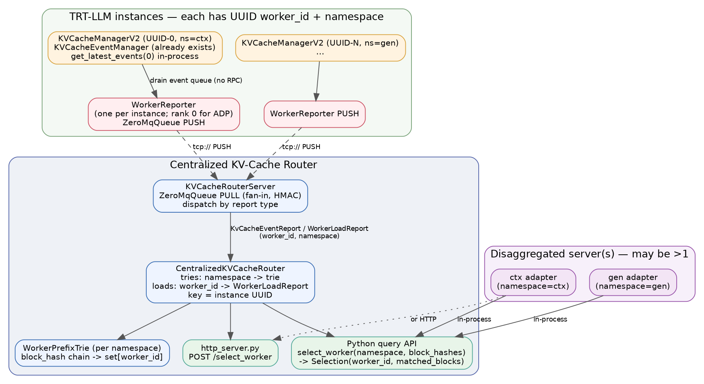
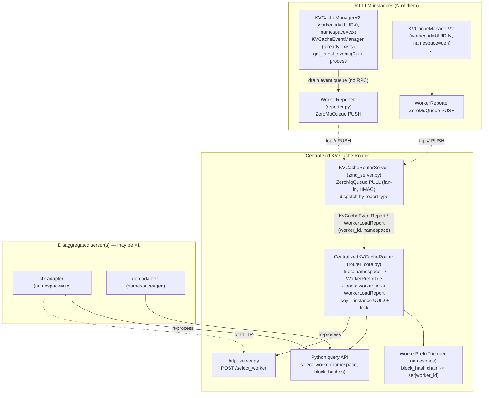
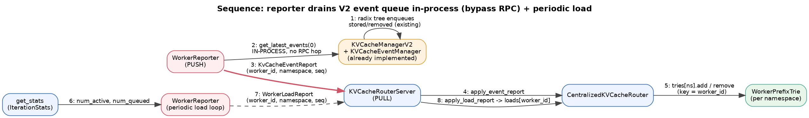
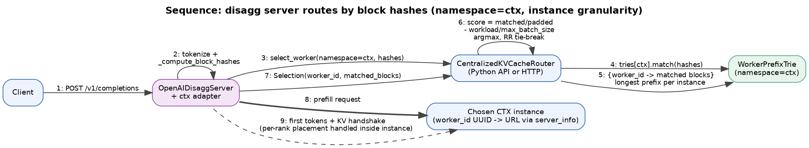
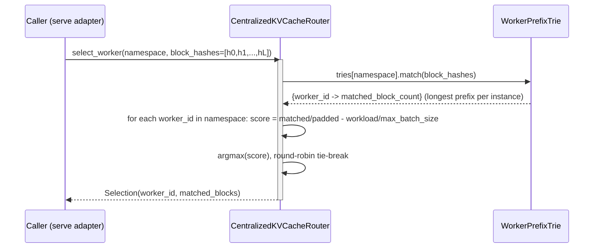
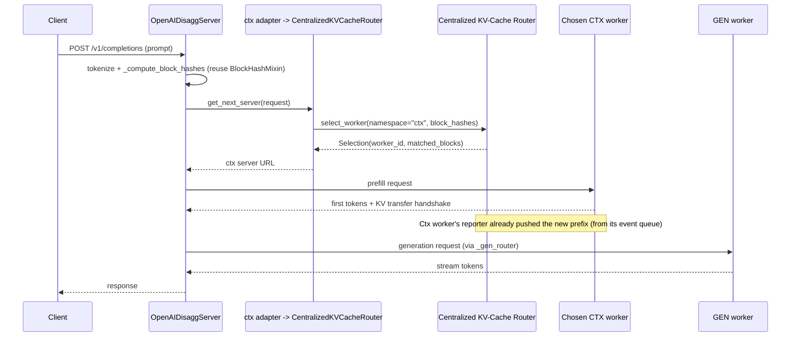

# Design: Centralized KV-Cache Router Module

## Motivation

Today's KV-cache-aware routing (`KvCacheAwareRouter` in
`tensorrt_llm/serve/router.py`) has four limits this design removes:

1. **Not real-time.** Events flush only at iteration end, and the router pulls a
   worker's `/kv_cache_events` only in `finish_request` (`router.py:1238`) — when
   a request completes. Its block table lags reality by up to a full request. A
   push model keeps the index continuously fresh.
2. **Per-router state blocks scaling.** Each router holds its own copy of every
   worker's block table and load, so you can't run multiple frontends over one
   worker pool without divergent, inconsistent views. Centralizing state lets
   workers push once and any number of frontends query a shared, consistent
   source of truth.
3. **Disagg-only.** KV-cache-aware routing is wired into the disagg server only,
   but a plain pool of aggregated `trtllm-serve` replicas needs the same
   prefix-affinity routing. A standalone router serves both; disagg ctx/gen
   pools are just one configuration.
4. **Coupled to the data plane.** With an HTTP query API, an external gateway or
   ingress can make placement decisions without embedding tokenizers, block
   hashing, or any TRT-LLM internals.

## Context

TensorRT-LLM already has a **pull-based**, HTTP-coupled KV-cache-aware router
inside `tensorrt_llm/serve/router.py` (`KvCacheAwareRouter` +
`KvCacheAwareServerState`). The orchestrator polls each worker's
`/kv_cache_events` endpoint, keeps a per-worker `set[int]` of block hashes, and
scores workers by `matched_tokens/total − load/max_batch_size`.

We want a **standalone, push-based, centralized** router instead:

1. Each TRT-LLM instance has a stable `worker_id`. It actively **pushes** two
   streams keyed by `worker_id` + `seq`: a **KV-cache event** stream (block
   stored/removed) and a **worker-load** stream (current workload + number of
   queued requests).
   - **`worker_id` is the instance's existing `llm_id`** (`llm.py:312`,
     `hostname-pid-timestamp`) — a stable, fleet-unique id we reuse rather than
     minting a new UUID. The worker advertises it (alongside `max_batch_size` /
     `tokens_per_block` / `kv_cache_hash_algo`) via the existing
     `GET /server_info` endpoint (`openai_server.py:1873`, now returning
     `worker_id`), which the router already fetches and caches in `_server_info`
     (`router.py:407,427`). The same id is stamped on every ZMQ report.
   - **`worker_id → address` mapping.** ZMQ reports identify a worker by
     `worker_id`, but the disagg server dispatches to a **URL**. So when the
     adapter fetches `/server_info` for a server it calls
     `router.register_worker_address(info["worker_id"], server_addr)`, and on
     server removal `router.unregister_worker_address(address=server_addr)`.
     `select_worker` then resolves the chosen `worker_id` to that address and
     returns both in `Selection`. This is what joins "holds these blocks / has
     this load" (from ZMQ) with "lives at this URL" (from `server_info`),
     decoupling worker identity from network address. If events arrive before
     `/server_info` is fetched, `Selection.address` is `None` and the caller
     falls back to its normal server-list dispatch.
2. The module exposes a **ZMQ API** to *receive* those reports, plus a query
   surface — **in-process Python API or HTTP API** — to ask: given a list of
   block hashes for a request, return the best `worker_id` to route to.

Goal: a reusable component that gives true longest-prefix KV-cache locality
matching across all workers, combined with live load awareness. The real
consumer is the **disaggregated server** (`OpenAIDisaggServer`), which routes
context and generation pools separately; there may be more than one frontend
querying a single shared router.

### Decisions (confirmed with user)

- **Form factor**: New standalone module + thin adapter so `trtllm-serve`'s
  router can optionally delegate to it.
- **Match index**: Global **prefix trie** keyed by block-hash chains
  (`parent_hash` links) → set of `worker_id`s, giving O(L) longest-prefix match.
- **Routing policy**: Reuse the existing score
  `matched_tokens/padded_tokens − workload/max_batch_size`, round-robin
  tie-break. `workload = num_active_requests + num_queued_requests` from reports.
- **Push, not poll**: the worker **pushes** reports to the router. Default
  transport is PUSH/PULL to a single central router; PUB/SUB (replica per
  frontend) is a later option behind the same report schema — see
  [Transport](#transport-pushpull-vs-pubsub).
- **Reuse the existing V2 event path**: `KVCacheManagerV2` already owns a
  `KVCacheEventManager` and emits `stored`/`removed` events when
  `event_buffer_max_size > 0` (`resource_manager.py:2090`); the radix tree
  already enqueues them and `flush_iteration_events()` / `get_latest_events()`
  already exist. The reporter **drains that queue in-process** via
  `kv_cache_manager.get_latest_events(0)` — deliberately bypassing
  `llm.get_kv_cache_events_async()` (the RPC path, motivation #1). No manager
  changes, no radix-tree hooks.

### Reused building blocks (do NOT reinvent)

| Need | Reuse | Location |
|------|-------|----------|
| Block-hash event schema | `stored`/`removed`/`created`/`updated` dicts | `tensorrt_llm/_utils.py:1141` `KVCacheEventSerializer` |
| In-process event drain (bypass RPC) | `kv_cache_manager.get_latest_events(0)` | `resource_manager.py:3482` |
| Token IDs → block hashes | `block_key_hasher()`, `BlockKeyHasher.hash` | `tensorrt_llm/serve/router.py:664`; `bindings/internal/batch_manager` |
| ZMQ socket (PUSH/PULL/HMAC/pickle) | `ZeroMqQueue` | `tensorrt_llm/executor/ipc.py:34` |
| Scoring formula + tie-break | logic in `KvCacheAwareRouter.get_next_server` | `tensorrt_llm/serve/router.py:815` |
| Workload/queue stat fields | `num_active_requests`, `num_queued_context_requests`, `num_queued_gen_requests` | `bindings/executor/__init__.pyi` |

---

## Part A — KV-cache events from KVCacheManagerV2 (already present; just consume)

**This is essentially already implemented in the current code base.**
`KVCacheManagerV2` already owns a Python `KVCacheEventManager`
(`tensorrt_llm/runtime/kv_cache_manager_v2/_event_manager.py`) and wires it up
the same way V1 does:

- The manager instantiates it when `event_buffer_max_size > 0`
  (`resource_manager.py:2090-2101`). The old `assert event_buffer_max_size == 0`
  is **gone**.
- The radix tree already enqueues events into it: `add_stored_*` on commit and
  `add_removed_event` on eviction (`_block_radix_tree.py:181,346,408`).
- `KVCacheManagerV2.flush_iteration_events()` and `get_latest_events()` already
  exist (`resource_manager.py:3478,3482`) and delegate to that event manager —
  full parity with V1.

The public chain (`py_executor.get_latest_kv_cache_events()` →
`llm.get_kv_cache_events_async()` / `executor.aget_kv_events()` →
`/kv_cache_events` HTTP) still works, but **we deliberately bypass it**.

### What this design actually needs from Part A

The reporter consumes events **directly from the V2 event manager, in-process**,
*not* through `llm.get_kv_cache_events_async()`:

1. Launch the worker with `event_buffer_max_size > 0` (and
   `enable_block_reuse=True`) so the V2 `KVCacheEventManager` is active. Config
   only.
2. **Bypass the public API.** `llm.get_kv_cache_events_async()` routes through
   the executor RPC/proxy and only surfaces events at request/iteration
   boundaries (this is exactly motivation #1). Instead, the `WorkerReporter`
   lives next to the engine and drains the manager directly via
   `kv_cache_manager.get_latest_events(timeout_ms=0)`
   (`resource_manager.py:3482`) on a tight tick — same call the executor uses
   internally (`py_executor.py:1062`), but pulled by us as soon as
   `flush_iteration_events()` makes events available, with no RPC hop. It then
   forwards them as `KvCacheEventReport`s. No radix-tree hooks, no new manager
   code.

### Block-hash compatibility (the one thing to verify)

Emitted hashes must match the router-side `block_key_hasher` (the 64-bit ints
from `BlockKeyHasher`) so a request's client-computed hashes line up with
worker-emitted hashes. V2's event manager has a configurable `hash_algo`
(`resource_manager.py:2098`, surfaced as `kv_cache_hash_algo` in `server_info`,
`openai_server.py:1882`). The router must hash requests with the **same**
algorithm the worker advertises — read it from `server_info` rather than
assuming. Output uses the existing `KVCacheEventSerializer` dict schema.

---

## Part B — Centralized router module structure

New package `tensorrt_llm/serve/kv_cache_router/` with these files:

```
kv_cache_router/
├── __init__.py
├── messages.py        # WorkerReport dataclass + (de)serialization helpers
├── prefix_trie.py     # WorkerPrefixTrie: global block-hash trie -> worker_ids
├── router_core.py     # CentralizedKVCacheRouter: state + query API
├── zmq_server.py      # KVCacheRouterServer: ZMQ ingest loop -> router_core
└── reporter.py        # WorkerReporter: runs inside each TRT-LLM instance
```

### Component diagram



<details><summary>Mermaid source</summary>



</details>

### Transport: PUSH/PULL vs PUB/SUB

Reports are fire-and-forget (no per-message reply), so the choice is between the
two one-way ZMQ patterns. They differ in **fan-out**, which is exactly what
decides how the frontend tier scales (motivation #2).

| | **PUSH → PULL** | **PUB → SUB** |
|---|---|---|
| Delivery | each msg to **one** puller (load-balanced) | each msg to **every** subscriber (fan-out) |
| Multiple routers | ❌ splits the stream → divergent state | ✅ every router gets a full copy |
| Loss | queued, effectively lossless | **lossy** (drops at HWM / slow or late subscriber) |
| Backpressure | sender blocks if consumer stalls | publisher never blocks (drops instead) |
| Late join | n/a (1 consumer) | misses history → needs snapshot/resync |
| In `ZeroMqQueue` today | ✅ supported (`ipc.py`) | ❌ must extend (PUB/SUB not wired) |

**The deciding factor is whether router state is centralized or replicated:**

- **One central router → PUSH/PULL.** Workers PUSH; the router binds one PULL
  socket (fan-in). Frontends *query* that shared router (in-process or HTTP).
  Lossless, simplest, reuses `ZeroMqQueue` verbatim. Downside: the router is a
  singleton — a query bottleneck and SPOF.
- **State replicated into every frontend → PUB/SUB.** Each worker PUBlishes;
  each frontend embeds a SUBscriber + its own full copy of the router state, so
  routing becomes a **local in-process call with no query hop and no SPOF** —
  the cleanest realization of "horizontally scalable frontend tier." `namespace`
  is the natural SUB topic filter (a frontend subscribes only to the namespaces
  it serves). Costs: extend `ZeroMqQueue` for PUB/SUB, N× event bandwidth, and a
  resync path for loss / late joiners.

**Loss tolerance differs by stream — and `seq` makes PUB/SUB safe:**

- *Load stream* is state-replacing (latest wins), so a dropped `WorkerLoadReport`
  just means briefly stale load — PUB/SUB loss is harmless.
- *Event stream* is **deltas**; a dropped `stored`/`removed` corrupts the block
  table. But every report carries a monotonic `seq`, so a subscriber that sees a
  gap requests a full snapshot (`is_full_snapshot`) from that worker and
  self-heals — the classic ZMQ snapshot + live-updates "Clone" pattern. This is
  the mechanism that makes PUB/SUB usable for events at all.

**Recommendation.** Start with **PUSH/PULL to a single central router** — it is
lossless, reuses the existing socket wrapper with zero changes, and the
query-side HTTP/Python API already gives multiple frontends a shared view. Adopt
**PUB/SUB only when** the single router's query load or availability becomes the
bottleneck and frontends must each hold a local replica; the `seq`-gap → snapshot
resync designed above makes that migration additive (the report schema does not
change, only the socket type and a resync channel). Keep the transport behind
the `KVCacheRouterServer` / `WorkerReporter` boundary so switching does not touch
`router_core.py`.

---

## Data model

Two **separate** report messages flow over the same ZMQ channel — they have
very different cadences and lifetimes, so we do not fold them into one struct:

- **`KvCacheEventReport`** — KV-cache deltas, emitted from the radix tree the
  instant a block is stored/removed (high frequency, event-driven).
- **`WorkerLoadReport`** — a workload snapshot (active + queued requests),
  emitted on a periodic tick (low frequency, state-replacing).

Both carry `worker_id` (the instance UUID, as a string), a `namespace`, and a
per-stream `seq` so the router can attribute and de-duplicate / drop
stale/out-of-order messages. The router dispatches on type.

**`namespace`** scopes routing. A worker **reports** the namespace it belongs to
(e.g. `"ctx"` / `"gen"` for disagg, or a model name / tenant for a shared
router), and a caller **must** supply the namespace a request is to be routed
within — the router only ever considers workers in that namespace. This
generalizes the disagg ctx/gen split into a first-class field next to
`worker_id`, so one router can serve many independent worker groups.

### `KvCacheEventReport` (messages.py)

```python
@dataclass
class KvCacheEventReport:
    worker_id: str                 # instance UUID (same one advertised via /server_info)
    namespace: str                 # routing group this worker serves, e.g. "ctx" / "gen"
    seq: int                       # per-(worker, event) stream; monotonically increasing
    events: list[dict]             # KVCacheEventSerializer dict form:
                                   #   [{event_id, data:{type: stored|removed|...},
                                   #     window_size}, ...]
    is_full_snapshot: bool = False # True on (re)registration: replaces this worker's table
```

The `events` payload is exactly the `KVCacheEventSerializer.serialize(...)`
output already produced for the `/kv_cache_events` HTTP endpoint — no new schema.
For an ADP instance, this is the **rank-0 gathered** stream (union of all ranks'
blocks); the router treats the instance as one target — see
[Attention-DP ranks](#attention-dp-ranks) for why per-rank routing is *not*
done here.

### `WorkerLoadReport` (messages.py)

```python
@dataclass
class WorkerLoadReport:
    worker_id: str                 # instance UUID
    namespace: str                 # routing group this worker serves
    seq: int                       # per-(worker, load) stream; monotonically increasing
    num_active_requests: int       # instance total (summed across ADP ranks)
    num_queued_requests: int       # ctx + gen queued
                                   #   (num_queued_context_requests + num_queued_gen_requests)
    max_batch_size: int            # for normalizing load in the score
```

### Router-side state (router_core.py)

The router stores the **latest `WorkerLoadReport` per worker** directly — no
separate struct. A separate prefix trie is kept **per namespace** so a query
never crosses groups. Identity key is the instance id `worker_id` (the `llm_id`):

```python
# in CentralizedKVCacheRouter, per namespace:
tries:          dict[str, WorkerPrefixTrie]   # namespace -> trie (over worker_ids)
loads:          dict[str, WorkerLoadReport]   # latest load snapshot per worker
last_event_seq: dict[str, int]               # drop stale KvCacheEventReport
last_load_seq:  dict[str, int]               # drop stale WorkerLoadReport
last_load_ts:   dict[str, float]             # last LOAD report time (suspend gate)
last_seen_ts:   dict[str, float]             # last report of any kind (eviction)
# fleet-global (not namespace-scoped), learned from /server_info:
worker_address: dict[str, str]               # worker_id -> address
address_worker: dict[str, str]               # address -> worker_id (rebind safety)
```

`workload(worker_id) = loads[w].num_active_requests + loads[w].num_queued_requests`.

### Liveness: suspend vs evict (two timeouts)

The load stream doubles as a heartbeat, with **two** thresholds:

- **Suspend (`load_suspend_s`, short — a few × `load_interval_s`).** If a
  worker's most recent *load* report is older than this, it is **excluded from
  selection** until it reports load again. Rationale: without a fresh load
  reading the router cannot trust the worker's capacity, so routing to it risks
  overloading a hung/slow/partitioned instance. Crucially, its **KV-cache trie
  entries are retained** — the cache is still valid, so when load reporting
  resumes the worker is instantly eligible again with full prefix-match, no
  event re-send. Checked inline in `select_worker` against `last_load_ts`.
- **Evict (`stale_timeout_s`, long).** If a worker sends *no report of any kind*
  for this long it is fully forgotten (trie + load dropped) by
  `evict_stale_workers`. This reclaims state for instances that are truly gone.

A worker that keeps pushing events but stops pushing load is therefore
suspended (not routed) but not evicted (cache kept) — the safe outcome.

---

## Prefix trie (prefix_trie.py)

Each KV block hash already encodes its parent chain (the hasher folds
`parent_hash` in — `block_key_hasher`). A request's block-hash list is therefore
an ordered prefix path. There is **one trie per namespace**; each node maps to
the set of `worker_id`s that currently hold that block.

```python
class WorkerPrefixTrie:
    class _Node:
        __slots__ = ("children", "worker_ids")   # dict[int,_Node], set[str]

    def add(self, worker_id: str, block_hashes: list[int], parent_hash: int | None): ...
    def remove(self, worker_id: str, block_hashes: list[int]): ...
    def remove_worker(self, worker_id: str): ...     # full eviction on disconnect
    def match(self, block_hashes: list[int]) -> dict[str, int]:
        """worker_id -> number of consecutive prefix blocks matched."""
```

`match` walks the query path; at each depth it intersects the running candidate
set with the node's `worker_id`s, recording per-worker matched-block depth. This
yields true **longest common prefix** per worker in O(L) (L = query block
count), honoring the parent chain (fixes the existing router's TODO about
partial / parent-hash matching at `router.py:149`).

Event application (within the report's namespace trie):
- `stored` event → `add(worker_id, [b.block_hash for b in blocks], parent_hash)`
- `removed` event → `remove(worker_id, block_hashes)`
- `created`/`updated` → no membership change (ignored for matching)

---

## Router core (router_core.py)

```python
@dataclass
class Selection:
    worker_id: str
    matched_blocks: int             # for logging / disagg KV-transfer decisions

class CentralizedKVCacheRouter:
    def __init__(self, tokens_per_block=32, stale_timeout_s=30.0): ...

    # --- ingest side (called by zmq_server); dispatch on report type ---
    def apply_event_report(self, report: KvCacheEventReport) -> None:
        # under lock: drop if report.seq <= last_event_seq[worker_id] (stale)
        # if is_full_snapshot: tries[ns].remove_worker(worker_id) first
        # apply each event to tries[report.namespace]; members[ns].add(worker_id)
        ...

    def apply_load_report(self, report: WorkerLoadReport) -> None:
        # under lock: drop if report.seq <= last_load_seq[worker_id] (stale)
        # loads[worker_id] = report; touch last_seen_ts
        ...

    def drop_worker(self, worker_id: str) -> None: ...
    def evict_stale_workers(self, now: float) -> None: ...

    # --- query side (Python API); namespace is REQUIRED ---
    def select_worker(self, namespace: str,
                      block_hashes: list[int]) -> Selection | None:
        """Best instance for these block hashes, restricted to `namespace`."""
        # candidates = members[namespace]
        # matched = tries[namespace].match(block_hashes)   # worker_id -> matched blocks
        # padded = max(len(block_hashes),1) * tokens_per_block
        # for each candidate worker_id:
        #     m = matched.get(worker_id,0) * tokens_per_block
        #     score = m/padded - workload(worker_id)/loads[worker_id].max_batch_size
        # argmax score, round-robin tie-break (reuse existing logic)
        # -> Selection(worker_id, matched_blocks)
        ...

    def select_worker_from_tokens(self, namespace: str,
                                  token_ids: list[int]) -> Selection | None:
        """Convenience: tokenize-free path that hashes token IDs via
        block_key_hasher() then calls select_worker()."""
```

Routing is at **instance granularity**. Per-rank ADP placement is left to the
instance's own `KVCacheAwareADPRouter` (see [Attention-DP ranks](#attention-dp-ranks)).

Thread-safety: a single `threading.Lock` guards `tries` + `loads`. Ingest runs
on the ZMQ server thread; queries run on caller threads. Both are O(L) /
O(workers), so contention is negligible.

---

## ZMQ ingest server (zmq_server.py)

```python
class KVCacheRouterServer:
    def __init__(self, router: CentralizedKVCacheRouter, address=None, hmac_key=None):
        self._q = ZeroMqQueue(address=(address, hmac_key),
                              socket_type=zmq.PULL, is_server=True)   # binds, fan-in
        # self._q.address -> (endpoint, hmac_key) to hand to workers

    def serve_forever(self):   # background thread
        while not self._stop:
            report = self._q.get()              # HMAC-verified, unpickled report
            if isinstance(report, KvCacheEventReport):
                self.router.apply_event_report(report)
            elif isinstance(report, WorkerLoadReport):
                self.router.apply_load_report(report)
            # periodically: self.router.evict_stale_workers(now)

    @property
    def address(self): return self._q.address   # (endpoint, hmac_key) for workers
```

Reuses `ZeroMqQueue`'s HMAC + pickle path verbatim (`ipc.py`). The bound
endpoint + HMAC key are published to workers out-of-band (CLI arg / env /
metadata server, same way disagg shares addresses today).

---

## Worker-side reporter (reporter.py)

Runs inside each TRT-LLM instance, **next to the engine** so it can drain the KV
event manager in-process (not via the public RPC API). It owns one PUSH socket
and drives **two independent streams**, each with its own `seq`. `worker_id`
(UUID) and `namespace` are fixed at construction:

```python
class WorkerReporter:
    def __init__(self, worker_id, namespace, kv_cache_manager, get_stats,
                 router_address, hmac_key,
                 event_interval_s=0.01, load_interval_s=0.5, max_batch_size=...):
        self._q = ZeroMqQueue(address=(router_address, hmac_key),
                              socket_type=zmq.PUSH, is_server=False)  # connects
        self._event_seq = 0
        self._load_seq = 0

    # --- KV-cache event stream: drain the V2 event manager DIRECTLY ---
    def run_event_loop(self):
        # 1) On start: PUSH KvCacheEventReport(is_full_snapshot=True) so a
        #    (re)started router rebuilds this worker's table.
        # 2) Tight loop (event_interval_s): events = kv_cache_manager
        #        .get_latest_events(timeout_ms=0)   # in-process, no RPC hop
        #    if events: PUSH KvCacheEventReport(worker_id, namespace, event_seq++,
        #                                        events)
        #    (bypasses llm.get_kv_cache_events_async — see Part A)

    # --- worker-load stream: periodic snapshot ---
    def run_load_loop(self):
        # Every load_interval_s: read get_stats() -> num_active, num_queued
        # PUSH WorkerLoadReport(worker_id, namespace, load_seq++, ...)
```

For ADP, the worker runs **one** reporter on rank 0 over the gathered event
stream — the instance reports as a single target (see
[Attention-DP ranks](#attention-dp-ranks)).

- **Events**: drained **in-process** from `kv_cache_manager.get_latest_events()`
  (bypassing `llm.get_kv_cache_events_async()` / the executor RPC — see Part A),
  so the router sees a stored prefix within one engine tick. The reporter is
  just a transport; no radix-tree internals.
- **Load**: sourced from `IterationStats` (`get_stats`);
  `num_queued_requests = num_queued_context_requests + num_queued_gen_requests`.
  No engine changes.

---

## Attention-DP ranks

An ADP instance has several attention-DP ranks, each owning a slice of the KV
cache. **The centralized router routes at instance granularity and does *not*
attempt per-rank routing** — rank placement is left to the instance's own
`KVCacheAwareADPRouter` (`_torch/pyexecutor/scheduler/adp_router.py`). Here's
why that is the right split.

### Why not centralized per-rank routing

ADP rank assignment is an **intra-instance, per-iteration** step at the head of
the executor loop:

```
_executor_loop (every iteration):
  _prepare_and_schedule_batch
    └─ _fetch_new_requests                       (py_executor.py:3216)
         1. gather_all_rank_states   ── allgather per-rank load          [:3229]
         2. fetch + pop waiting queue → new_requests
         3. gather_prefix_matches    ── allgather per-rank prefix match,
                                        probed on each rank's LOCAL radix tree [:3259]
         4. route_requests           ── dict[rank → requests]            [:3262]
  _forward_step → _sample_async → _update_requests
  _add_kv_cache_events → flush_iteration_events   ── events visible HERE  [:3356]
```

If the centralized router tried to drive rank placement, the **most** it could
remove is the step-3 `gather_prefix_matches` allgather — and only if the local
router stopped re-probing and fully trusted the hint. That is a bad trade:

- `gather_prefix_matches` is **cheap** (a couple of ints per new request, once
  per iteration). `gather_all_rank_states` (step 1) is still required regardless,
  because capacity caps need live per-rank load.
- The local probe at step 3 reads each rank's **current** radix tree — strictly
  fresher than the centralized state, which is always at least one
  push-interval + network hop behind. Replacing it with a stale hint makes rank
  placement *less* accurate to save a negligible collective.

So per-rank centralized routing would add coupling and staleness to eliminate
one small allgather. Not worth it. The rank dimension is already handled well,
cheaply, and with the freshest possible data inside the instance.

### What the centralized router does instead

It routes **which instance** — the genuinely hard problem, because that state is
fragmented across N separate processes with no collective between them (unlike
ranks, which already allgather every iteration). Each ADP instance therefore
reports as a **single target**:

- **Events**: rank 0 gathers all ranks' events via the existing
  `attention_dp_gather` fn (`_event_manager.py:265-281`) and the worker sends
  **one** `KvCacheEventReport` per instance — the union of all ranks' blocks.
- **Load**: one `WorkerLoadReport` per instance, with load summed across ranks.

This also sidesteps **context-parallel / CP-helix** (`has_cp_helix`,
`adp_router.py:270`), where a single request's tokens *are* sharded across ranks
and a per-rank prefix notion would be meaningless anyway.

> Chunked prefill, for the record, does **not** split a request across ranks: a
> request is assigned whole to one rank (`route_requests` →
> `dict[rank → list[request]]`, `py_executor.py:3266`), and chunking only splits
> its prefill across *iterations* on that same rank. So instance-level reporting
> loses nothing here — the per-rank detail simply isn't needed at the
> cross-instance layer.

---

## Sequence diagrams

### Registration + steady-state reporting (push)



<details><summary>Mermaid source</summary>

```mermaid
sequenceDiagram
    participant Mgr as KVCacheManagerV2 + KVCacheEventManager
    participant W as Worker (worker_id=UUID)
    participant Rep as WorkerReporter (PUSH)
    participant Srv as KVCacheRouterServer (PULL)
    participant Core as CentralizedKVCacheRouter
    participant Trie as WorkerPrefixTrie

    Note over W,Srv: router endpoint + HMAC key provided out-of-band
    Rep->>Srv: KvCacheEventReport(worker_id, namespace, seq=0, is_full_snapshot=True)
    Srv->>Core: apply_event_report
    Core->>Trie: tries[ns].remove_worker(worker_id); add(worker_id, blocks)

    rect rgb(235,245,255)
    Note over Mgr,Rep: Event stream — drain V2 event queue IN-PROCESS (bypass RPC API)
    Mgr->>Mgr: radix tree enqueues stored/removed (already implemented)
    Rep->>Mgr: kv_cache_manager.get_latest_events(0)
    Rep->>Srv: KvCacheEventReport(worker_id, namespace, seq++, events)
    Srv->>Core: apply_event_report -> tries[ns].add/remove
    end

    loop every load_interval_s (workload stream)
        W-->>Rep: get_stats() -> num_active, num_queued
        Rep->>Srv: WorkerLoadReport(worker_id, namespace, load_seq++, ...)
        Srv->>Core: apply_load_report
        Core->>Core: if load_seq<=last_load_seq: drop (stale); else update loads[worker_id]
    end
```

</details>

### Query: route a request by its block hashes



<details><summary>Mermaid source</summary>



</details>

### End-to-end with the disaggregated server

The real consumer is the **disaggregated server** (`OpenAIDisaggServer`,
`openai_disagg_server.py:102`), which already builds **two** routers via
`create_router` — `_ctx_router` over the context (prefill) workers and
`_gen_router` over the generation (decode) workers. Both delegate to the same
centralized router; what differs is only the `namespace` each one queries
(`"ctx"` vs `"gen"`).



### Adapter: Python API or HTTP API

The adapter in `router.py` can reach the centralized router two ways; choice is
a config option (`kv_cache_router_endpoint`):

- **In-process Python API** — when the router runs in the *same* process as the
  disagg server, the adapter holds a `CentralizedKVCacheRouter` instance and
  calls `select_worker(namespace, block_hashes)` directly. Lowest latency;
  default for a single-node disagg server.
- **HTTP API** — when the router is a *separate* service (multiple disagg
  servers / frontends sharing one router, or cross-node), the adapter POSTs to
  the router's HTTP endpoint (`POST /select_worker` with
  `{namespace, block_hashes}` → `{worker_id, matched_blocks}`).
  A small FastAPI shim wraps the same `select_worker` core, so the two paths
  share one implementation.

Multiple frontends are supported because workers PUSH reports to the router
regardless of how many frontends query it; the per-namespace tries + loads are a
single shared source of truth. `namespace` scopes the candidate set (ctx vs gen,
or per-model / per-tenant) so one router can serve many worker groups.

---

## Files to create / modify

**New — router module** (`tensorrt_llm/serve/kv_cache_router/`):
- `messages.py` — `KvCacheEventReport`, `WorkerLoadReport` (both carry
  `worker_id`, `namespace`), `Selection`.
- `prefix_trie.py` — `WorkerPrefixTrie` (model on the existing `_BlockHashTrie`
  at `router.py:888`, but node values are `set[worker_id]` and `match` returns
  per-worker depth).
- `router_core.py` — `CentralizedKVCacheRouter`: per-namespace tries, the query
  API (`select_worker(namespace, block_hashes)`, `apply_*_report`,
  `evict_stale_workers`).
- `zmq_server.py` — `KVCacheRouterServer` wrapping `ZeroMqQueue(PULL)`;
  dispatches reports by type.
- `http_server.py` — FastAPI shim exposing `POST /select_worker` (and a
  `/healthz`) over the same `select_worker` core, for the out-of-process /
  multi-frontend deployment.
- `reporter.py` — `WorkerReporter` wrapping `ZeroMqQueue(PUSH)`; `run_event_loop`
  (drains `kv_cache_manager.get_latest_events(0)` in-process) + periodic
  `run_load_loop` (load stream). One reporter per instance (on rank 0 for ADP,
  over the gathered event stream).
- `__init__.py` — export `CentralizedKVCacheRouter`, `KVCacheRouterServer`,
  `WorkerReporter`, `KvCacheEventReport`, `WorkerLoadReport`, `Selection`.

**V2 event emission — no new files needed.** `KVCacheManagerV2` already owns a
`KVCacheEventManager` (`_event_manager.py`), the radix tree already enqueues
`stored`/`removed` events, and `flush_iteration_events()` / `get_latest_events()`
already exist (`resource_manager.py:2090,3478`). Part A is config-only: launch
the worker with `event_buffer_max_size > 0` + `enable_block_reuse=True`. Only
verify that the emitted hash algo matches the router's (read `kv_cache_hash_algo`
from `/server_info`).

**Worker `/server_info` — advertise `worker_id` (done):**
- `tensorrt_llm/serve/openai_server.py` `get_server_info` (`:1873`) now returns
  `worker_id = self.generator.llm_id` so the router can learn the
  `worker_id → address` mapping. (`max_batch_size` / `tokens_per_block` /
  `kv_cache_hash_algo` were already there.)

**Modify — serve adapter (thin, used by the disagg server)**:
- `tensorrt_llm/serve/router.py` — add a `CentralizedRouter` whose
  `get_next_server` reuses `BlockHashMixin._tokenize_and_compute_block_hashes`
  then delegates to the centralized router via **either** an in-process
  `CentralizedKVCacheRouter.select_worker(namespace, ...)` **or** an HTTP client
  to `http_server.py` (selected by `kv_cache_router_endpoint`). It carries a
  `namespace` so the same adapter class instantiates as the ctx and gen routers.
  Register it in the `create_router`/policy map (`router.py:1374`). Keep
  existing routers intact.
  - **Address-map upkeep is the adapter's job.** Hook the router's existing
    server-info lifecycle: in `_prepare_server` (`:419`, after `_fetch_server_info`
    populates `_server_info[server]`) call
    `central.register_worker_address(info["worker_id"], server)`; in
    `remove_server` (`:455`) call
    `central.unregister_worker_address(address=server)`. This keeps the mapping
    consistent with the live server list, and the `address ↔ worker_id` reverse
    index makes a restarted instance (new `llm_id` at the same URL) supersede the
    stale id cleanly.
  - `get_next_server` uses `Selection.address` when present; if it is `None`
    (events seen but `/server_info` not yet fetched) it falls back to the normal
    least-loaded server pick, so routing degrades gracefully rather than failing.
- `tensorrt_llm/serve/openai_disagg_server.py` — `_ctx_router` / `_gen_router`
  (`:103-104`) can be `CentralizedRouter(namespace="ctx")` /
  `(namespace="gen")` when the centralized policy is configured. No structural
  change to the disagg flow.
- **Worker side** — start one `WorkerReporter` per instance (on rank 0 for ADP,
  over the gathered event stream), with `worker_id = llm_id` and the same
  `namespace`, pointed at the router's ZMQ endpoint.

All new files need the NVIDIA copyright header; update the year on modified
files.

---

## Verification

1. **Unit — trie matching** (`tests/unittest/serve/test_kv_cache_router.py`):
   - Build a `WorkerPrefixTrie`; add overlapping prefixes for workers 0/1/2;
     assert `match()` returns correct longest-prefix depth per worker, and that
     `remove`/`remove_worker` prune correctly.
2. **Unit — scoring + namespace isolation**: feed known load snapshots + matches
   into `select_worker`; assert the `match/padded − load/max_batch_size` argmax
   and round-robin tie-break match hand-computed values (mirror
   `router.py:815-869`); assert `namespace="ctx"` only ever returns ctx workers
   and never sees `"gen"` blocks/loads.
3. **Unit — ingest (both report types)**: send `KvCacheEventReport`s with
   `stored`/`removed` events (in `KVCacheEventSerializer` dict format) and
   `WorkerLoadReport`s; assert the namespace trie updates from events and the
   load snapshot updates from load reports independently; stale `event_seq`/
   `load_seq` are dropped; `is_full_snapshot` replaces the table.
3b. **Unit — ADP routes as one instance**: feed a gathered report (union of all
   ranks' blocks) for an ADP `worker_id`; assert it is treated as a single
   routing target and `select_worker` returns just that `worker_id` (no per-rank
   distinction). Confirms instance-granularity routing.
4. **Integration — ZMQ loopback**: start `KVCacheRouterServer` on
   `tcp://127.0.0.1:*`; create a `WorkerReporter` (PUSH) with the returned
   `(endpoint, hmac_key)`; push one of each report type; assert the router
   answers `select_worker` with that worker UUID. Verifies HMAC + pickle
   round-trip. Also hit `http_server.py`'s `POST /select_worker` and assert it
   agrees with the in-process call.
5. **Unit — V2 events already flow**: build a `KVCacheManagerV2` with
   `event_buffer_max_size > 0`; commit/evict blocks; assert
   `get_latest_events()` returns `stored`/`removed` events and that their hashes
   match the router-side hash for the same tokens under the advertised
   `kv_cache_hash_algo` (cross-side compatibility). This guards the one real
   risk in Part A; it does not add new manager code.
6. **Optional e2e**: 2 `trtllm-serve` workers (V2 manager,
   `event_buffer_max_size>0`) behind a disagg server + the adapter; send a
   request, then a second request sharing a long prefix; confirm the second is
   routed to the same worker (cache locality).

Run: `pytest tests/unittest/serve/test_kv_cache_router.py -v`
and the V2 emission test above.
