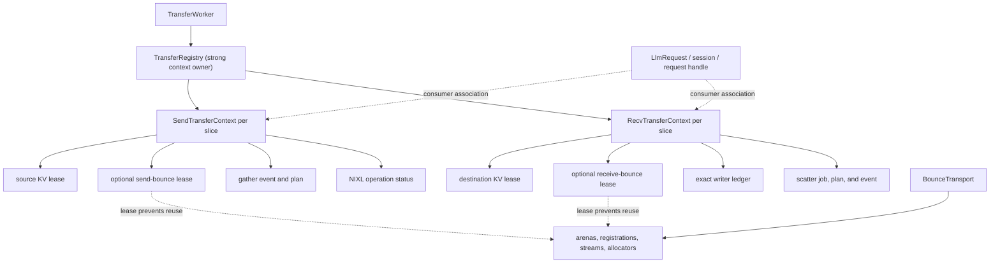

# Python Native Disaggregated KV Transfer Ownership and Lifecycle

| Field | Value |
|---|---|
| **Owner** | Chien-Chun Hung |
| **Status** | Draft design contract |
| **Created** | 2026-07-08 |
| **Last updated** | 2026-07-08 |
| **Implementation baseline** | [PR #15618](https://github.com/NVIDIA/TensorRT-LLM/pull/15618), merged as [`3bf37d2`](https://github.com/NVIDIA/TensorRT-LLM/commit/3bf37d25387c2b99ef6dba4555ed432bcedfcf4d) |
| **Primary target** | Python native KV cache transceiver with NIXL, direct and bounce paths |
| **Detailed plan** | [`implementation-plan.md`](implementation-plan.md) |

## Executive Summary

PR #15618 introduced an opt-in bounce path for the Python native KV cache
transceiver. It gathers fragmented sender KV into a contiguous arena, performs a
coalesced NIXL write, and scatters the contiguous receive region back to the
destination KV blocks. The PR also added a receive-side `TransferContext` that
waits for fan-in writers and scatter completion before releasing a bounce slot.

That context closes an important part of the normal-path bounce lifetime, but it
is not an end-to-end transfer owner. Ownership remains split across
`LlmRequest`, `RxSession`, sender worker stack frames, bounce allocators, CUDA
events, NIXL status objects, and KV cache managers. Cancellation, timeout,
partial publication, fan-in failure, and shutdown can therefore make logical
request completion happen before every physical memory accessor is known to be
quiescent.

This document defines the target ownership contract for the Python native
transceiver:

- The unit of physical ownership is an **endpoint-local context per KV slice**,
  with an exact per-writer ledger. A request-level handle aggregates slices for
  user-visible completion.
- `TransferWorker` owns a registry that strongly retains transfer contexts.
  `LlmRequest` and session objects are associated consumers, not the root owners.
- A context owns leases for every allocation and asynchronous operation that can
  outlive request/session cleanup.
- Logical completion and physical retirement are independent states.
- Cancellation, timeout, session destruction, elapsed quarantine time, and an
  ambiguous transport failure are not proof of quiescence.
- Direct, bounce, and mixed fan-in paths follow the same contract.
- In-doubt memory remains unavailable for reuse until terminal evidence or
  backend-wide quiescence exists. The initial implementation chooses safety over
  bounded reclamation.

The functional scope is the Python transceiver. This is not necessarily a
Python-files-only change: allocator-enforced KV leases or definitive NIXL status
may require small C++/nanobind extensions. The separate C++
`CacheTransceiver` is not an implementation target.

## Design Decisions

The following decisions are normative for the implementation plan.

1. **One transfer does not have a single cross-process owner.** Sender and
   receiver each have an endpoint-local context correlated by protocol identity.
2. **Physical ownership is per KV slice.** Each receive context contains a
   per-writer ledger; a request-level handle aggregates one or more slice
   contexts.
3. **The registry is the root owner.** Request or session removal cannot destroy
   an active context.
4. **KV ownership is allocator-enforced.** A strong reference to `LlmRequest` is
   not a sufficient KV lease if `free_resources()` can independently recycle its
   blocks.
5. **The contract covers direct and bounce paths.** Bounce being disabled or a
   sender falling back to direct transfer does not bypass ownership tracking.
6. **Logical completion is separate from physical retirement.** A request may
   fail promptly while its memory remains leased and unavailable for reuse.
7. **Address publication is conservative.** A writer is considered capable of
   access before any message containing its address is sent.
8. **Quarantine is containment, not evidence.** Wall-clock expiry never makes an
   in-doubt allocation safe to reuse.
9. **Identity is generation-safe.** Results are matched by transfer, slice,
   generation, and exact writer identity, not merely by writer count.
10. **Shutdown drains before deregistration or unmapping.** If quiescence cannot
    be proven, memory remains mapped and shutdown reports a non-drained state.
11. **Wire changes are negotiated.** New generation, writer, or mode fields
    require capability/version negotiation or explicit mixed-version rejection
    before address publication.
12. **Non-KV auxiliary transfers are a separate audit.** This project covers all
    resources used to perform KV transfer, including KV descriptors and bounce
    gather/scatter plans, but does not claim to own independent auxiliary-buffer
    transfers.

## Background

### Bounce transfer introduced by PR #15618

KV cache pages are often physically fragmented. A direct NIXL transfer may
therefore require many descriptors. The bounce path introduced by
[PR #15618](https://github.com/NVIDIA/TensorRT-LLM/pull/15618) changes the data
path to:

```text
source KV pages
    -> CUDA gather into a contiguous sender bounce slot
    -> coalesced NIXL WRITE into a contiguous receiver bounce slot
    -> CUDA scatter into destination KV pages
```

The feature is opt-in through `kv_cache_bounce_size_mb`; zero disables it. It is
constructed only by the Python native transceiver. The sender may still fall
back to the direct fragmented path when a transfer is not bounceable or no slot
is available.

The merged
[`bounce.TransferContext`](https://github.com/NVIDIA/TensorRT-LLM/blob/3bf37d25387c2b99ef6dba4555ed432bcedfcf4d/tensorrt_llm/_torch/disaggregation/native/bounce/core.py#L61-L175)
tracks a receive bounce slot, writer results, scatter state, and settlement. It
does not hold source or destination KV leases, the sender bounce lease, the NIXL
operation, or the publication identity. In this design, that class is treated as
an internal receive-bounce state object and should be renamed accordingly when
the general context is introduced.

### Related work

Status snapshot: 2026-07-08.

| Work | Relationship to this design |
|---|---|
| [PR #15618](https://github.com/NVIDIA/TensorRT-LLM/pull/15618) | Merged Python/native bounce implementation and baseline for this follow-up. |
| [Transfer-owner review on #15618](https://github.com/NVIDIA/TensorRT-LLM/pull/15618#pullrequestreview-4612079358) and [follow-up acknowledgement](https://github.com/NVIDIA/TensorRT-LLM/pull/15618#pullrequestreview-4630057518) | Review provenance for the comprehensive ownership follow-up. |
| [PR #16116](https://github.com/NVIDIA/TensorRT-LLM/pull/16116) | Open post-merge follow-up intended to exercise the Python bounce configuration. It is validation-adjacent, not ownership work. |
| [PR #15780](https://github.com/NVIDIA/TensorRT-LLM/pull/15780) | Open draft proposing an independent C++ NIXL bounce implementation with a different arena and credit protocol. Useful lifecycle prior art; not a shared implementation target. |
| [PR #15139](https://github.com/NVIDIA/TensorRT-LLM/pull/15139) | Merged C++/V1 precedent for rank-consistent terminal-state consensus. This design adopts the logical/physical separation for Python native transfers. |
| [PR #15356](https://github.com/NVIDIA/TensorRT-LLM/pull/15356) | Merged bounded polling/admission work. Draining must remain non-blocking to the executor hot path. |
| [PRs #15238](https://github.com/NVIDIA/TensorRT-LLM/pull/15238) and [#15737](https://github.com/NVIDIA/TensorRT-LLM/pull/15737) | Open inputs to the C++ cancellation chain: gated NIXL in-flight cancellation/quiescence containment and sender liveness hardening. They are conceptual precedents, not Python-native dependencies. |
| [PRs #15794](https://github.com/NVIDIA/TensorRT-LLM/pull/15794), [#15795](https://github.com/NVIDIA/TensorRT-LLM/pull/15795), [#15798](https://github.com/NVIDIA/TensorRT-LLM/pull/15798), and [#15799](https://github.com/NVIDIA/TensorRT-LLM/pull/15799) | Open draft C++-transceiver cancellation chain plus PyExecutor integration: buffer ownership, detached-owner/fatal cleanup, negotiation, and a generation-safe peer-protocol design. This work aligns conceptually but fills the Python-native gap. |
| [PR #15738](https://github.com/NVIDIA/TensorRT-LLM/pull/15738) | Open draft default-on policy for a qualified C++ NIXL/UCX configuration. It explicitly excludes the Python transceiver, so this work is complementary. |
| [Chunked KV transfer design](../chunked-kv-transfer/README.md) and [PR #15727](https://github.com/NVIDIA/TensorRT-LLM/pull/15727) | Open Python pipelined/chunked transfer consumer. The owner must support multiple independently progressing chunks/slices and overlapping prefill/transfer lifetimes. |
| [PR #15803](https://github.com/NVIDIA/TensorRT-LLM/pull/15803) | Open draft C++-transceiver/V1 work and prior art for explicit KV transfer leases, descriptor lifetime, and constrained early release. It is not an available shared primitive. |

The adjacent
[`disagg-inflight-cancel-poison`](../disagg-inflight-cancel-poison/README.md)
design owns cancellation consensus and process-health policy across a wider
runtime matrix. This note owns the physical resource-lifetime contract for the
Python native transfer path. Cancellation intent enters this design as a logical
event; it never authorizes physical release by itself.

## Problem Statement

### Current ownership is fragmented

The present path has several partial owners:

- `LlmRequest` carries request state and allocated block identifiers.
- `AsyncTransferManager` retains context-side requests during asynchronous send
  work, but does not provide a symmetric allocator lease for receiver loading.
- `RxSession` owns request-facing receive state and callbacks.
- Sender worker stack frames hold the NIXL status and release sender bounce slots
  in local cleanup.
- `VmmBounceTransport` owns arena allocators, registrations, CUDA streams, and
  receive bounce contexts.
- KV managers remain the authority that can return blocks to their pools.

No object has both the information and authority to answer: **which asynchronous
accessors can still touch which allocation generation?**

### Concrete remaining hazards

#### Released bounce address can still be advertised

The current
[`dispatch_task()` sequence](https://github.com/NVIDIA/TensorRT-LLM/blob/3bf37d25387c2b99ef6dba4555ed432bcedfcf4d/tensorrt_llm/_torch/disaggregation/native/transfer.py#L1522-L1589)
reserves a receive slot, then separately finds the session, changes task state,
and publishes the address. Concurrent
[`RxSession.cancel()`](https://github.com/NVIDIA/TensorRT-LLM/blob/3bf37d25387c2b99ef6dba4555ed432bcedfcf4d/tensorrt_llm/_torch/disaggregation/native/transfer.py#L1985-L2006)
can observe the task as not transferring and release the reservation between
those steps. Dispatch may then advertise an address that has already returned to
the allocator, creating a potential cross-request overwrite if a remote writer
uses the stale address after the slot is reused.

#### First fan-in failure can outlive its session

The first failed writer currently
[`fail()`s the task immediately](https://github.com/NVIDIA/TensorRT-LLM/blob/3bf37d25387c2b99ef6dba4555ed432bcedfcf4d/tensorrt_llm/_torch/disaggregation/native/transfer.py#L1898-L1912).
Failed-session cleanup can remove the `RxSession`, while
[`_process_kv_agent_result()`](https://github.com/NVIDIA/TensorRT-LLM/blob/3bf37d25387c2b99ef6dba4555ed432bcedfcf4d/tensorrt_llm/_torch/disaggregation/native/transfer.py#L1684-L1710)
drops later results when that session is absent.

For an all-bounce transfer this can strand the receive slot. For a mixed or
direct transfer, a sibling writer may still be writing destination KV. If
request cleanup recycles those blocks before that sibling is quiescent, this
creates a potential physical GPU memory use-after-release/ABA hazard, not merely
a Python object-lifetime issue.

#### Timeout and quarantine do not prove retirement

`mark_orphaned()` exists in the bounce state object but has no production
callers through the transport interface. Timeout, cancellation, partial
publication, and session destruction do not consistently transition the
physical owner into a drain or containment state.

The allocator's fixed-duration quarantine, if wired into production, would also
not be a transport guarantee. An elapsed grace period cannot prove that a
one-sided operation will not access the region later.

#### Shutdown order can destroy live memory

Sender workers use an unbounded transfer wait but are joined with a finite
deadline. The enclosing
[`TransferWorker.shutdown()`](https://github.com/NVIDIA/TensorRT-LLM/blob/3bf37d25387c2b99ef6dba4555ed432bcedfcf4d/tensorrt_llm/_torch/disaggregation/native/transfer.py#L2297-L2339)
invokes the current
[`VmmBounceTransport.close()`](https://github.com/NVIDIA/TensorRT-LLM/blob/3bf37d25387c2b99ef6dba4555ed432bcedfcf4d/tensorrt_llm/_torch/disaggregation/native/bounce/impl.py#L382-L394)
which stops the scatter worker, deregisters arenas, and destroys their mappings.
This occurs before the
[`BaseTransferAgent.shutdown()` quiescence contract](https://github.com/NVIDIA/TensorRT-LLM/blob/3bf37d25387c2b99ef6dba4555ed432bcedfcf4d/tensorrt_llm/_torch/disaggregation/base/agent.py#L85-L121)
is invoked. A sender worker, remote RMA, or queued scatter may still reference
those ranges.

#### Count-based fan-in is not identity-safe

The current receive context records distinct peer ranks until
`len(_writer_ok) >= num_writers`. It does not retain the exact advertised writer
set or a transfer generation. An unexpected distinct writer can count toward
completion, and a stale result can collide with a later reuse of the same
`(request_id, slice_id)` key.

## Scope and Applicability

### In scope

| Axis | In-scope variants |
|---|---|
| **Transceiver runtime** | Python native `KvCacheTransceiverV2`. Here, “V2” names the transceiver, not necessarily the KV manager. |
| **Network backend** | NIXL/DEFAULT as supported by the Python transceiver. |
| **Transfer path** | Direct fragmented transfer, bounce transfer, and per-writer fallback between them. |
| **Bounce configuration** | Disabled (`kv_cache_bounce_size_mb == 0`) and enabled (`> 0`). |
| **KV manager** | Python KV manager V2 and the C++-backed V1 manager exposed to Python. |
| **Direction** | Context-side send and generation-side receive. |
| **Fan-in/topology** | Single writer and every multi-writer topology supported by the Python transceiver, including TP/ADP fan-in and multiple slices/chunks. |
| **Executor** | PyTorch backend and AutoDeploy when they select the Python transceiver. |
| **Resources** | KV allocations, bounce-slot leases, CUDA gather/scatter work, transfer descriptor/plan storage, NIXL operation state, result delivery state, and registration/mapping shutdown dependencies. |

The ownership path must be active even when bounce is disabled. The bounce
configuration changes which leases exist; it does not select whether lifetime
safety applies.

### Non-goals

- Replacing or porting the design into the separate C++ `CacheTransceiver`.
- Unifying the Python bounce implementation with the independent C++ bounce
  implementation in PR #15780.
- Redesigning rank consensus, scheduler cancellation, or request admission.
- Making `LlmRequest` the low-level transfer state machine.
- Creating one distributed object that owns both processes.
- Retrying or resuming a failed model request.
- Rolling back KV bytes written before a transfer fails.
- Optimizing gather/scatter kernels, descriptor coalescing, or arena sizing.
- Enabling bounce by default.
- Transparent recovery from a crashed peer without transport or process-level
  quiescence evidence.
- Independent non-KV auxiliary-buffer transfer ownership. Such paths require a
  separate audit against the same invariant.

## Terminology

| Term | Meaning |
|---|---|
| **Logical outcome** | Request-visible success, failure, or cancellation. It controls scheduling and notification, not memory reuse. |
| **Physical retirement** | Proof that no network or CUDA accessor can touch the leased resource generation, followed by exactly-once lease release. |
| **Lease** | A token that prevents an allocator, arena, or manager from reusing or destroying a resource while the token is live. |
| **Publication** | Any attempt to send an address or descriptor to a writer that could cause the writer to access it. |
| **Terminal evidence** | Positive evidence, defined by the backend contract, that a specific operation cannot perform later memory access. |
| **Quiescence** | A per-operation or backend-wide guarantee that no relevant asynchronous access can occur later. |
| **Quarantine** | Removal from reuse while quiescence is unknown. It does not become safe through elapsed time. |
| **Generation** | A nonce distinguishing successive uses of the same request/slice or arena slot identity. |
| **Consumer** | The request/session-facing observer that receives logical completion. It is not the physical owner. |

## Normative Safety Contract

The load-bearing invariant is:

> For every asynchronous accessor and every memory range it may read or write,
> the range's allocation generation and registration MUST remain unchanged from
> before its address becomes observable until there is positive evidence that
> the accessor can no longer touch it.

The following are explicitly **not** terminal evidence:

- client cancellation;
- request or session destruction;
- scheduler timeout;
- elapsed quarantine duration;
- release of a local request handle without an abort guarantee;
- loss of the result message;
- an ambiguous `False` from a bounded wait that conflates in-progress and
  terminal failure;
- local CUDA synchronization when a remote RMA may still be active.

### Required invariants

**O1 — Register before publication.** All leases and the complete planned
writer-operation ledger, including candidate direct and bounce ranges, MUST be
installed in the registry before publication begins.

**O2 — Mark possible access first.** Before the system attempts to send any
message containing an address, `publication_started()` MUST atomically set the
writer operation's exposure state to `MAY_ACCESS` and access state to
`POSSIBLE`. A send error may revert to `NEVER_EXPOSED`/`QUIESCED` only when the
messaging layer positively guarantees non-delivery.

**O3 — Request lifetime is not resource lifetime.** Closing an `LlmRequest`,
`TxSession`, `RxSession`, future, or request-level transfer handle MUST NOT
directly release transfer-owned resources or bypass the context retirement
predicate. It MAY trigger retirement when that predicate is already satisfied.

**O4 — Logical and physical state are independent.** Failure or cancellation MAY
be reported immediately, but physical retirement MUST wait for all possible
accessors.

**O5 — Exact operation accounting.** A receive context MUST track every planned
writer-operation identity, generation, and candidate direct/bounce range. The
actual target mode is recorded after sender selection. Writer count alone is
insufficient.

**O6 — Registry-first result routing.** Results MUST be routed to the transfer
registry before optional session lookup or notification. A missing consumer MUST
NOT cause a physical result to be dropped.

**O7 — Allocator-enforced KV leases.** Lease acquisition MUST atomically validate
and pin `(pool, block, allocation_generation)` before raw pointers are resolved
or descriptors are constructed. `free_resources()` atomically drops request
ownership and marks leased blocks pending-free. A generation becomes reusable
only when request ownership is gone and its transfer-lease count reaches zero.
Overlapping slice leases are reference-counted, and KV-manager shutdown obeys
the same rule. Holding only block IDs or a Python request reference is
insufficient.

**O8 — Exactly-once retirement.** Duplicate, reordered, late, or contradictory
events MUST NOT double-release a lease or advance another generation.

**O9 — Safe uncertainty.** When quiescence is unknown, resources MUST remain
leased or quarantined. Admission may fail due to exhausted safe capacity; reuse
is forbidden.

**O10 — Drain before teardown.** A KV or bounce registration/mapping MUST NOT be
destroyed until every relevant network accessor is quiescent (or backend-wide
quiescence substitutes for missing per-operation evidence) **and** all local
CUDA work that can touch it is complete. If shutdown also removes registrations
used by auxiliary transfers, those independent owners MUST drain as an external
precondition; draining only the KV registry is insufficient.

**O11 — No blocking under the context lock.** Network operations, CUDA
synchronization, allocator callbacks, and consumer callbacks MUST execute
outside the context state lock.

**O12 — Bounded executor polling.** Ownership draining MUST preserve the bounded
polling behavior established by PR #15356. Waiting for physical retirement MUST
NOT block the main executor loop.

**O13 — Range authorization.** Before NIXL submission or gather/scatter launch,
every descriptor segment MUST be validated as a subset of the correct leased
allocation generation and the writer's authorized candidate range. Validation
includes device, required alignment, non-negative size, integer overflow,
aggregate byte count, and per-writer subrange boundaries. A lifetime lease does
not authorize out-of-range access.

## Ownership Model



### Ownership granularity

The physical context key is conceptually:

```text
(transfer_id, slice_id, generation, sender_endpoint_epoch, receiver_endpoint_epoch)
```

A **slice** is the smallest address set that is published and physically retired
as one unit. One receive context contains one ledger entry per planned writer
operation; a writer that issues multiple NIXL operations for the slice has a
distinct operation ID for each. One request-level `TransferHandle` aggregates
all slice contexts needed to compute the logical request outcome. This supports
chunked and pipelined transfers without making a single request-wide context
serialize independent slices.

### Component responsibilities

| Component | Owns | Must not own or decide |
|---|---|---|
| `TransferRegistry` | Strong references to live contexts; identity lookup; shutdown drain accounting. | Request scheduling or KV allocation policy. |
| `SendTransferContext` | Source KV lease, optional send-bounce lease, gather fence/plan, descriptor storage, NIXL operation, result-delivery state. | Receiver resources or request object destruction. |
| `RecvTransferContext` | Destination KV lease, optional receive-bounce lease, writer ledger, scatter fence/plan, detachable consumer callback. | Source resources or distributed request consensus. |
| `TransferHandle` | Request-facing aggregation and logical cancellation/notification. | Physical lease release. |
| `BounceTransport` | Arena mappings, registrations, allocators, streams, and lease issuance. | End-to-end transfer outcome. |
| KV manager | Underlying KV allocation and enforcement of active transfer leases. | Network completion inference. |
| NIXL agent | Submission/progress and documented quiescence evidence. | KV block reuse. |

The current `bounce.TransferContext` should become an implementation detail such
as `RecvBounceContext` or be replaced by `RecvBounceLease` state. Expanding it
into the general owner would couple direct transfer, request notification, KV
allocation, and transport arena internals into the bounce package.

### Resource retirement matrix

| Resource | Earliest safe release |
|---|---|
| Source KV, bounce writer | Gather fence completed; NIXL subsequently reads only the send-bounce slot. |
| Source KV, direct writer | The NIXL operation is definitively quiescent. |
| Send-bounce slot | The NIXL operation reading it is definitively quiescent. |
| Receive-bounce slot | Every writer operation that may have received its address is quiescent, and scatter either completed or was conclusively suppressed. |
| Destination KV, direct writer | Every direct writer operation targeting those blocks is quiescent. |
| Destination KV, bounce writer | All bounce writers are quiescent and successful scatter completed, or scatter was conclusively suppressed because the data outcome failed. |
| Destination KV, mixed fan-in | All direct writers are quiescent, all bounce writers are quiescent, and scatter completed or was conclusively suppressed. |
| Descriptor/plan backing storage | The backend has copied it synchronously, or every asynchronous consumer is quiescent. |
| Gather/scatter CUDA event | Completion has been observed and no queued work or callback still references it. |
| Transfer context | All physical leases are released exactly once; only lightweight result-delivery/tombstone state may remain. |
| Arena registration and VMM mapping | All contexts that can access that arena are retired; all local CUDA work is complete; and any missing per-operation network evidence is replaced by backend-wide quiescence. |

Resources MAY be released independently at their earliest safe boundary. For
example, bounce gather completion can release source KV while the send-bounce
lease remains active through NIXL completion. The context remains registered
until all of its responsibilities are settled.

### Relationship to `LlmRequest`

The request and transfer lifetimes largely overlap, so they should be associated
through `TransferHandle`. They must not be collapsed into one owner:

- a request can become logically terminal before DMA or scatter retires;
- one request can own several independently progressing slices;
- transport result handling must survive session removal;
- retaining a request object does not necessarily prevent explicit KV
  `free_resources()`;
- transport workers should not mutate scheduler-facing request state directly.

Request cleanup does not perform a check-then-free against `TransferHandle`.
Instead, `free_resources()` atomically drops request ownership in the KV manager;
leased generations become pending-free and are reclaimed automatically when the
last transfer lease is released. This avoids a race between checking the handle
and acquiring a new lease.

## State Model

One enum must not conflate request outcome with memory safety.

### Logical outcome

```text
ACTIVE -> SUCCEEDED
ACTIVE -> FAILED
ACTIVE -> CANCELLED
```

Logical failure may occur on the first writer failure. Logical cancellation may
occur on client cancellation, deadline, consensus outcome, or shutdown. Neither
transition implies physical retirement.

Logical success requires every required writer to succeed and all required
scatter work to complete successfully.

The first logical terminal outcome wins. For example, cancellation already
reported to the consumer is not overwritten by a later writer failure. Later
events still update physical and process-health state.

### Physical access, target, and data state

Each writer operation tracks separate dimensions rather than one overloaded
terminal enum.

**Exposure state:**

```text
PLANNED -> NEVER_EXPOSED
PLANNED -> MAY_ACCESS
MAY_ACCESS -> NEVER_EXPOSED  (only with positive non-delivery proof)
```

- `PLANNED`: leases exist, but publication has not started.
- `NEVER_EXPOSED`: positive proof exists that no address was observable. It is a
  physically terminal exposure state.
- `MAY_ACCESS`: publication started, submission may be active, or outcome is
  uncertain.

**Access state:** `NOT_STARTED`, `POSSIBLE`, or `QUIESCED`. `QUIESCED` requires
positive per-operation evidence or a backend-wide drain that covers the
operation. A generic failure without that guarantee remains `POSSIBLE`.

**Target mode:** `PENDING`, `DIRECT`, `BOUNCE`, `NO_REMOTE_ACCESS`, or `UNKNOWN`.
The pre-publication plan contains authorized direct and bounce candidate ranges;
the actual mode is selected later.

**Data outcome:** `UNKNOWN`, `SUCCESS`, `FAILURE`, `ABORTED`, or `INVALID`.
Physical quiescence and data validity are independent. For example, a valid
quiescence-bearing NIXL result with malformed scatter metadata makes the data outcome
`INVALID` and suppresses scatter, but it can still prove that the network
accessor is `QUIESCED`. Backend-wide drain after a lost result can produce
`QUIESCED` with data outcome `UNKNOWN`; the logical transfer fails and no
scatter occurs.

### Local accessor state

Gather, each sender-side NIXL operation, and scatter are local asynchronous
accessors with their own state:

```text
PLANNED -> MAY_ACCESS -> QUIESCED
```

The context and required leases MUST exist before deriving raw pointers or
constructing plans. The accessor enters `MAY_ACCESS` before CUDA launch, queue
publication, or NIXL submission. Synchronous failure before launch may move
directly to `QUIESCED`; an exception after an ambiguous launch/submission stays
`MAY_ACCESS` until positive evidence arrives. Worker death does not imply
quiescence.

### Publication contract

Network send cannot be made atomic with local cancellation. The safe ordering
is:

1. Acquire all required KV and bounce leases.
2. Create the exact writer-operation plan and authorized candidate ranges.
3. Register the context.
4. Under the context lock, atomically set the selected writer operation's
   exposure state to `MAY_ACCESS` and access state to `POSSIBLE`.
5. Release the lock and attempt to publish its addresses.
6. Record send/submission outcome without weakening `MAY_ACCESS` unless
   non-delivery is proven.

Cancellation before any writer enters `MAY_ACCESS` can retire immediately.
Cancellation after that boundary changes the logical outcome and starts drain;
it does not release memory.

For partial fan-out publication, operations that never crossed the boundary
become `NEVER_EXPOSED`; operations that crossed it drain independently. The
request may fail immediately, but the context retires only after all possible
accessors do.

### Direct, bounce, and fallback mode

The receiver may offer a bounce target while the sender later chooses direct
fallback. Until the actual mode is known, the receiver conservatively holds both
the destination KV lease and any offered receive-bounce lease.

The writer-operation ledger records target mode independently from exposure,
access, and data state. The mode is initially `PENDING` and normally becomes:

- `DIRECT`: destination KV access retires when the writer operation is quiescent.
- `BOUNCE`: receive-bounce access retires when the writer operation is quiescent; successful
  writers contribute a validated scatter plan.

`NEVER_EXPOSED` is not a transfer mode. It is a physical exposure state proving
that neither candidate target was observable to that writer.

`NO_REMOTE_ACCESS` means the address may have been exposed, but the sender has
positive evidence that it did not submit a remote operation. `UNKNOWN` means the
backend or a global drain established quiescence without reconstructing which
candidate target was used.

A failed transfer is never scattered into usable KV. Partial direct writes need
not be rolled back; the destination KV lease remains until all writers drain,
then the failed allocation may be recycled.

### Identity and result routing

A result must identify:

- protocol version/capability;
- transfer ID;
- slice ID;
- generation/attempt nonce;
- exact writer identity and writer-operation ID;
- sender and receiver endpoint/instance epochs, because ranks can be reused
  after restart;
- actual direct/bounce mode;
- quiescence evidence and data outcome;
- validated scatter metadata when bounce succeeded.

The registry validates identity before any request/session lookup. Duplicate
results are idempotent. Unexpected writer operations, contradictory duplicates,
and wrong generations cannot advance any live context. Valid quiescence evidence
may advance physical access state even when result payload or scatter metadata
is invalid; that invalid data fails the logical transfer and suppresses scatter.
All ranges are checked against the registered authorization before use.

Creating a context with an already-live identity MUST fail rather than replace
the existing context. Generations MUST NOT be reused within an endpoint epoch.
Retired identities may leave bounded diagnostic tombstones; pruning a tombstone
does not authorize generation reuse or resource reclamation.

A result may advance access state to `QUIESCED` only when the sender has positive
evidence that its NIXL operation cannot perform later DMA. It is not enough to
report that the request was cancelled or that a bounded wait elapsed.

### Lost results and quarantine

In the first implementation, a receive context whose quiescence-bearing result is lost
remains in doubt until backend-wide or driver-level teardown explicitly revokes
the relevant registrations and prevents later DMA. Merely losing Python objects,
running destructors, or entering generic process-control teardown is not
evidence. The memory is not reused. This can reduce capacity and eventually
reject admission, but it does not trade memory safety for a timer.

Bounded in-process reclamation requires one of:

- reliable result acknowledgement and retry;
- a receiver query that obtains per-operation quiescence evidence;
- a peer/session epoch transition with a backend guarantee that old operations
  cannot access current registrations; or
- backend-wide quiescence.

Those are liveness improvements, not permission to weaken the baseline safety
contract.

### Unknown writer cohort

Some gen-first ADP flows broadcast discovery/request messages before the active
DP cohort is known. Before publishing memory addresses, the implementation MUST
either:

1. select the exact writer-operation cohort through an address-free handshake;
   or
2. register every recipient as a potential writer operation and obtain a
   quiescent `NO_REMOTE_ACCESS` acknowledgement from every non-participant.

If neither is implemented, that topology is excluded from the first ownership
rollout even though it remains an eventual design target. An expected writer
count is not an acceptable substitute.

### Threading and callbacks

State changes are serialized per context. The implementation must not hold a
context or registry lock while:

- sending or receiving network messages;
- waiting for NIXL;
- synchronizing CUDA work;
- allocating or freeing KV/bounce memory;
- invoking request/session callbacks.

Queue entries for gather/scatter work hold a strong context reference rather
than only raw slot IDs and callbacks. Consumer callback exceptions are recorded
but cannot interrupt physical finalization.

## Proposed Interfaces

Names are illustrative; behavior is normative.

```python
class TransferRegistry:
    def prepare_send(self, plan: SendPlan) -> SendTransferContext: ...
    def prepare_receive(self, plan: RecvPlan) -> RecvTransferContext: ...
    def route_result(self, result: WriterOperationResult) -> None: ...
    def cancel_consumer(self, transfer_id: TransferId, reason: str) -> None: ...
    def begin_shutdown(self) -> None: ...
    def drain(self, deadline: float | None) -> DrainResult: ...


class RecvTransferContext:
    def publication_started(
        self, operation: WriterOperationId
    ) -> PublicationToken: ...
    def mark_never_published(
        self, operation: WriterOperationId, proof: NonDeliveryProof
    ) -> None: ...
    def record_result(self, result: WriterOperationResult) -> None: ...
    def record_global_quiescence(self, evidence: QuiescenceEvidence) -> None: ...
    def cancel_consumer(self, reason: str) -> None: ...
    def detach_consumer(self) -> None: ...


class KVTransferLease:
    def release(self) -> None: ...
```

Required properties:

- Methods are thread-safe and idempotent.
- Registry insertion rejects a duplicate live identity.
- Resource release is private to the context.
- Request-facing handles cannot force physical retirement.
- `KVTransferLease` prevents allocator reuse even if request cleanup runs.
- `BounceTransport` issues optional `SendBounceLease` and `RecvBounceLease`
  objects; it remains the arena owner.
- `NoBounceTransport` issues no bounce lease, but the direct path still creates
  send/receive contexts and KV leases.
- Invariant violations retain resources and emit diagnostics rather than trying
  to recover through reuse.

### NIXL status contract

The lifecycle owner needs at least:

```text
IN_PROGRESS
QUIESCED_SUCCESS
QUIESCED_FAILURE
QUIESCED_ABORTED
IN_DOUBT
```

The current Python-facing boolean wait is insufficient for bounded drain if it
maps both timeout/in-progress and failure to `False`. The adapter may expose a
tri-state poll plus a separate quiescence guarantee, or a richer enum such as
the above. Exact names are not important; distinguishing “still possible” from
“cannot access memory” is mandatory. This classification is correctness
infrastructure required by the first retirement implementation. A richer
per-operation cancel/recovery API may remain a later liveness improvement.

## Shutdown Contract

Shutdown follows this order:

1. Stop admitting requests and publishing new addresses.
2. Mark remaining consumers failed/cancelled, but keep result listeners,
   transfer workers, and CUDA completion workers alive.
3. Drain endpoint contexts until the shutdown deadline.
4. For network operations still in doubt, request backend-wide quiescence
   through a
   documented `quiesce()`/drain operation.
5. Synchronize remaining gather/scatter work.
6. Release transfer leases and remove retired contexts.
7. Stop listeners and completion workers.
8. Confirm that any non-KV registration owners, including auxiliary transfer
   paths, have independently drained; then deregister memory and destroy VMM
   mappings.
9. Destroy the backend agent.

The backend likely needs two phases: quiesce while registrations are still
usable, followed by final destruction after deregistration. If the deadline
expires and quiescence cannot be proven, shutdown returns a non-drained result
and must not deregister, unmap, or reuse the affected memory. The worker remains
alive and retryable, and listeners/completion workers remain available for a
later drain attempt. Destructors MUST NOT perform fallback unmapping. The caller
may escalate process health through the adjacent cancellation/poison policy, but
in-process cleanup fails closed.

## Protocol and Rolling Upgrade Contract

PR #15618 changed advertisement and result framing without a general protocol
negotiation layer. This follow-up must not add generation or mode fields with
another implicit same-version assumption.

Before any address is published, peers must either:

1. negotiate a protocol version/capability set that includes the required
   identity and result fields; or
2. reject the mixed-version session explicitly.

Silent downgrade is not allowed when it would remove generation-safe identity,
exact writer accounting, or quiescence/mode reporting. The negotiation approach
should align with the protocol work in PRs #15798 and #15799 where practical,
without coupling this Python implementation to the C++ transceiver internals.

If implementation Phase 1 initially retains the existing wire identity, it must
prove and enforce that transfer IDs and tombstones cannot be reused during the
lifetime of any late result, including worker recreation. If that proof is not
available, generation and protocol negotiation move into Phase 1. One of those
two conditions is a hard Phase 1 exit criterion, not optional follow-up work.

## Implementation and Validation

See [`implementation-plan.md`](implementation-plan.md) for the performance and
capacity contract, observability requirements, phased implementation plan,
validation matrix, risks, alternatives, and phase gates.
