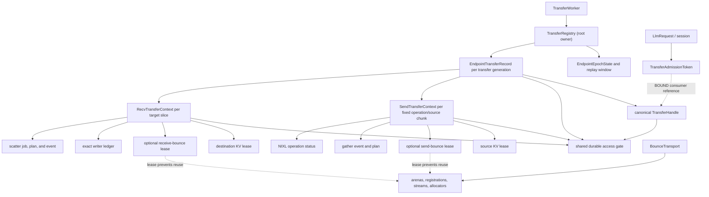

<!--
SPDX-FileCopyrightText: Copyright (c) 2026 NVIDIA CORPORATION & AFFILIATES. All rights reserved.
SPDX-License-Identifier: Apache-2.0
-->

# Python Native Disaggregated KV Transfer Ownership and Lifecycle

| Field | Value |
|---|---|
| **Owner** | Chien-Chun Hung |
| **Status** | Draft design contract |
| **Created** | 2026-07-08 |
| **Last updated** | 2026-07-13 |
| **Implementation baseline** | [PR #15618](https://github.com/NVIDIA/TensorRT-LLM/pull/15618), merged as [`3bf37d2`](https://github.com/NVIDIA/TensorRT-LLM/commit/3bf37d25387c2b99ef6dba4555ed432bcedfcf4d) |
| **Primary target** | Python native KV cache transceiver with NIXL, direct and bounce paths |
| **Detailed plan** | [`implementation-plan.md`](implementation-plan.md) |

## Executive Summary

PR #15618 introduced an opt-in bounce path for the Python native KV cache
transceiver. It gathers fragmented sender KV into a contiguous arena, performs a
coalesced NIXL write, and scatters the contiguous receive region back to the
destination KV blocks. The PR also added a receive-side `TransferContext` that
waits for fan-in writers and scatter completion before releasing a bounce slot.

That context closes an important part of the normal-path bounce lifetime, but it
is not an end-to-end transfer owner. Ownership remains split across
`LlmRequest`, `RxSession`, sender worker stack frames, bounce allocators, CUDA
events, NIXL status objects, and KV cache managers. Cancellation, timeout,
partial publication, fan-in failure, and shutdown can therefore make logical
request completion happen before every physical memory accessor is known to be
quiescent.

This document defines the target ownership contract for the Python native
transceiver:

- The unit of physical ownership is an **endpoint-local address unit**: a
  receiver target slice or sender source chunk. Receive contexts carry the
  exact per-writer ledger, and a request-level handle aggregates local contexts
  for user-visible completion.
- `TransferWorker` owns a registry that strongly retains each canonical
  endpoint-transfer record, its handle/gate, and its contexts. `LlmRequest` and
  session objects are associated consumers, not the root owners.
- A context owns leases for every allocation and asynchronous operation that can
  outlive request/session cleanup.
- Logical completion and physical retirement are independent states.
- Cancellation, timeout, session destruction, elapsed quarantine time, and an
  ambiguous transport failure are not proof of quiescence.
- Direct, bounce, and mixed fan-in paths follow the same contract.
- In-doubt memory remains unavailable for reuse until terminal evidence or
  backend-wide quiescence exists. The initial implementation chooses safety over
  bounded reclamation.

The functional scope is the Python transceiver. This is not necessarily a
Python-files-only change: allocator-enforced KV leases or definitive NIXL status
may require small C++/nanobind extensions. The separate C++
`CacheTransceiver` is not an implementation target.

## Design Decisions

The following decisions are normative for the implementation plan.

1. **One transfer does not have a single cross-process owner.** Sender and
   receiver each have an endpoint-local context correlated by protocol identity.
2. **Physical ownership is per endpoint-local address unit.** A receive context
   owns one advertised target slice; a send context owns one fixed operation or
   dynamically scheduled source chunk. A request-level handle aggregates those
   local contexts.
3. **The registry is the root owner.** It strongly owns one canonical
   endpoint-transfer record, its handle/gate, and all contexts for a transfer
   generation. Request or session removal cannot destroy that lifecycle state.
4. **KV ownership is allocator-enforced.** A strong reference to `LlmRequest` is
   not a sufficient KV lease if `free_resources()` can independently recycle its
   blocks.
5. **The contract covers direct and bounce paths.** Bounce being disabled or a
   sender falling back to direct transfer does not bypass ownership tracking.
6. **Logical completion is separate from physical retirement.** A request may
   fail promptly while its memory remains leased and unavailable for reuse.
7. **Address publication is conservative.** A writer is considered capable of
   access before any message containing its address is sent.
8. **Quarantine is containment, not evidence.** Wall-clock expiry never makes an
   in-doubt allocation safe to reuse.
9. **Identity is transfer-generation-safe.** Every lifecycle/control message is
   matched by endpoint epochs, transfer, and a strictly increasing admission
   generation allocated by the admission initiator. Endpoint-owned replay state
   prevents a retired generation from recreating a transfer record. Writer
   results additionally carry slice plus exact writer stream/operation identity;
   no mutation is keyed only by request ID or writer count.
10. **Shutdown drains before deregistration or unmapping.** If quiescence cannot
    be proven, memory remains mapped and shutdown reports a non-drained state.
11. **Wire changes are negotiated.** New transfer-generation, writer, stream,
    or mode fields require capability/version negotiation or explicit
    mixed-version rejection before address publication.
12. **Non-KV auxiliary transfers are a separate audit.** This project covers all
    resources used to perform KV transfer, including KV descriptors and bounce
    gather/scatter plans, but does not claim to own independent auxiliary-buffer
    transfers.
13. **Handle enrollment closes cancellation races.** Context admission and
    request-handle enrollment are one transaction. Cancellation closes the
    handle to new contexts before it snapshots and cancels existing contexts.
14. **Initial binding closes the local cancellation race.** Before a canonical
    handle exists, the request/session owns a one-shot admission token.
    Admission atomically binds that token to the registry-owned handle, while
    cancellation either aborts the pending token or forwards to the bound
    handle; it cannot fall between those states.

## Background

### Bounce transfer introduced by PR #15618

KV cache pages are often physically fragmented. A direct NIXL transfer may
therefore require many descriptors. The bounce path introduced by
[PR #15618](https://github.com/NVIDIA/TensorRT-LLM/pull/15618) changes the data
path to:

```text
source KV pages
    -> CUDA gather into a contiguous sender bounce slot
    -> coalesced NIXL WRITE into a contiguous receiver bounce slot
    -> CUDA scatter into destination KV pages
```

`kv_cache_bounce_size_mb > 0` requests the feature; zero disables it. Requested
does not imply active: the Python-native factory returns `NoBounceTransport` if
the fabric-VMM arena cannot be constructed or fitted, and an active transport
still falls back per transfer when a request is ineligible or no slot is
available. The merged baseline has a bounce-configured integration test marked
as GB200/GB300-eligible and scheduled on GB200, but it does not assert that the
transport or transfer actually engaged bounce. PR #16116 proposes that positive
signal. Treat those MNNVL cells as candidates, not proven active-bounce coverage,
until an equivalent assertion lands. Other environments may also run only the
direct fallback.

The merged
[`bounce.TransferContext`](https://github.com/NVIDIA/TensorRT-LLM/blob/3bf37d25387c2b99ef6dba4555ed432bcedfcf4d/tensorrt_llm/_torch/disaggregation/native/bounce/core.py#L61-L175)
tracks a receive bounce slot, writer results, scatter state, and settlement. It
does not hold source or destination KV leases, the sender bounce lease, the NIXL
operation, or the publication identity. In this design, that class is treated as
an internal receive-bounce state object and should be renamed accordingly when
the general context is introduced.

### Related work

Status snapshot: 2026-07-13.

| Work | Relationship to this design |
|---|---|
| [PR #15618](https://github.com/NVIDIA/TensorRT-LLM/pull/15618) | Merged Python/native bounce implementation and baseline for this follow-up. |
| [Transfer-owner review on #15618](https://github.com/NVIDIA/TensorRT-LLM/pull/15618#pullrequestreview-4612079358) and [follow-up acknowledgement](https://github.com/NVIDIA/TensorRT-LLM/pull/15618#pullrequestreview-4630057518) | Review provenance for the comprehensive ownership follow-up. |
| [PR #16116](https://github.com/NVIDIA/TensorRT-LLM/pull/16116) | Open post-merge follow-up adding positive active-bounce validation and partial bounce-only lifecycle containment: it proposes orphaning/quarantining in-flight receive reservations during cancellation/session close and propagating local gather/build failures. It does not provide direct-path or allocator-enforced KV ownership, generation-safe routing, or bounded safe reclamation. |
| [PR #15780](https://github.com/NVIDIA/TensorRT-LLM/pull/15780) | Open draft proposing an independent C++ NIXL bounce implementation with a different arena and credit protocol. Useful lifecycle prior art; not a shared implementation target. |
| [PR #15139](https://github.com/NVIDIA/TensorRT-LLM/pull/15139) | Merged C++/V1 precedent for rank-consistent terminal-state consensus. This design adopts the logical/physical separation for Python native transfers. |
| [PR #15356](https://github.com/NVIDIA/TensorRT-LLM/pull/15356) | Merged bounded polling/admission work. Draining must remain non-blocking to the executor hot path. |
| [PR #15238](https://github.com/NVIDIA/TensorRT-LLM/pull/15238) | Open input to the C++ cancellation chain for gated NIXL in-flight cancellation and quiescence containment. It is a conceptual precedent, not a Python-native dependency. |
| [PR #15737](https://github.com/NVIDIA/TensorRT-LLM/pull/15737) | Merged sender-liveness hardening for disaggregated KV transfer. It is operationally adjacent, not a replacement for endpoint-local ownership. |
| [PRs #15794](https://github.com/NVIDIA/TensorRT-LLM/pull/15794), [#15795](https://github.com/NVIDIA/TensorRT-LLM/pull/15795), [#15798](https://github.com/NVIDIA/TensorRT-LLM/pull/15798), and [#15799](https://github.com/NVIDIA/TensorRT-LLM/pull/15799) | Open draft C++-transceiver cancellation chain plus PyExecutor integration: buffer ownership, detached-owner/fatal cleanup, negotiation, and a generation-safe peer-protocol design. This work aligns conceptually but fills the Python-native gap. |
| [PR #15738](https://github.com/NVIDIA/TensorRT-LLM/pull/15738) | Open draft default-on policy for a qualified C++ NIXL/UCX configuration. It explicitly excludes the Python transceiver, so this work is complementary. |
| [PR #15727](https://github.com/NVIDIA/TensorRT-LLM/pull/15727) | Open Python pipelined/chunked transfer consumer. The owner must support multiple independently progressing chunks/slices and overlapping prefill/transfer lifetimes. |
| [PR #15803](https://github.com/NVIDIA/TensorRT-LLM/pull/15803) | Open draft C++-transceiver/V1 work and prior art for explicit KV transfer leases, descriptor lifetime, and constrained early release. It is not an available shared primitive. |

The adjacent cancellation chain represented by PRs #15238, #15794, #15795,
#15798, and #15799 owns cancellation consensus and process-health policy across
a wider runtime matrix.
This note owns the physical resource-lifetime contract for the Python native
transfer path. Cancellation intent enters this design as a logical event; it
never authorizes physical release by itself.

## Problem Statement

### Current ownership is fragmented

The present path has several partial owners:

- `LlmRequest` carries request state and allocated block identifiers.
- `AsyncTransferManager` retains context-side requests during asynchronous send
  work, but does not provide a symmetric allocator lease for receiver loading.
- `RxSession` owns request-facing receive state and callbacks.
- Sender worker stack frames hold the NIXL status and release sender bounce slots
  in local cleanup.
- `VmmBounceTransport` owns arena allocators, registrations, CUDA streams, and
  receive bounce contexts.
- KV managers remain the authority that can return blocks to their pools.

No object has both the information and authority to answer: **which asynchronous
accessors can still touch which allocation generation?**

### Concrete remaining hazards

#### Released bounce address can still be advertised

The current
[`dispatch_task()` sequence](https://github.com/NVIDIA/TensorRT-LLM/blob/3bf37d25387c2b99ef6dba4555ed432bcedfcf4d/tensorrt_llm/_torch/disaggregation/native/transfer.py#L1522-L1589)
reserves a receive slot, then separately finds the session, changes task state,
and publishes the address. Concurrent
[`RxSession.cancel()`](https://github.com/NVIDIA/TensorRT-LLM/blob/3bf37d25387c2b99ef6dba4555ed432bcedfcf4d/tensorrt_llm/_torch/disaggregation/native/transfer.py#L1985-L2006)
can observe the task as not transferring and release the reservation between
those steps. Dispatch may then advertise an address that has already returned to
the allocator, creating a potential cross-request overwrite if a remote writer
uses the stale address after the slot is reused.

#### First fan-in failure can outlive its session

The first failed writer currently
[`fail()`s the task immediately](https://github.com/NVIDIA/TensorRT-LLM/blob/3bf37d25387c2b99ef6dba4555ed432bcedfcf4d/tensorrt_llm/_torch/disaggregation/native/transfer.py#L1898-L1912).
Failed-session cleanup can remove the `RxSession`, while
[`_process_kv_agent_result()`](https://github.com/NVIDIA/TensorRT-LLM/blob/3bf37d25387c2b99ef6dba4555ed432bcedfcf4d/tensorrt_llm/_torch/disaggregation/native/transfer.py#L1684-L1710)
drops later results when that session is absent.

For an all-bounce transfer this can strand the receive slot. For a mixed or
direct transfer, a sibling writer may still be writing destination KV. If
request cleanup recycles those blocks before that sibling is quiescent, this
creates a potential physical GPU memory use-after-release/ABA hazard, not merely
a Python object-lifetime issue.

#### Timeout and quarantine do not prove retirement

At the pinned PR #15618 baseline, `mark_orphaned()` exists in the bounce state
object but has no production callers through the transport interface. PR #16116
proposes callers for cancellation/session close, but that is bounce-only
containment: direct destination KV and sender resources remain uncovered, and
quarantine still does not prove safe reclamation. Timeout, partial publication,
and other session-destruction paths therefore still need the general owner.

The allocator's fixed-duration quarantine, if wired into production, would also
not be a transport guarantee. An elapsed grace period cannot prove that a
one-sided operation will not access the region later.

#### Shutdown order can destroy live memory

Sender workers use an unbounded transfer wait but are joined with a finite
deadline. The enclosing
[`TransferWorker.shutdown()`](https://github.com/NVIDIA/TensorRT-LLM/blob/3bf37d25387c2b99ef6dba4555ed432bcedfcf4d/tensorrt_llm/_torch/disaggregation/native/transfer.py#L2297-L2339)
invokes the current
[`VmmBounceTransport.close()`](https://github.com/NVIDIA/TensorRT-LLM/blob/3bf37d25387c2b99ef6dba4555ed432bcedfcf4d/tensorrt_llm/_torch/disaggregation/native/bounce/impl.py#L382-L394)
which stops the scatter worker, deregisters arenas, and destroys their mappings.
This occurs before the
[`BaseTransferAgent.shutdown()` quiescence contract](https://github.com/NVIDIA/TensorRT-LLM/blob/3bf37d25387c2b99ef6dba4555ed432bcedfcf4d/tensorrt_llm/_torch/disaggregation/base/agent.py#L85-L121)
is invoked. A sender worker, remote RMA, or queued scatter may still reference
those ranges.

#### Count-based fan-in is not identity-safe

The current receive context records distinct peer ranks until
`len(_writer_ok) >= num_writers`. It does not retain the exact advertised writer
set or a transfer generation. An unexpected distinct writer can count toward
completion, and a stale result can collide with a later reuse of the same
`(request_id, slice_id)` key.

## Scope and Applicability

### In scope

| Axis | In-scope variants |
|---|---|
| **Transceiver runtime** | Python native `KvCacheTransceiverV2`. Here, “V2” names the transceiver, not necessarily the KV manager. |
| **Network backend** | NIXL/DEFAULT as supported by the Python transceiver. |
| **Transfer path** | Direct fragmented transfer, bounce transfer, and per-writer fallback between them. |
| **Bounce configuration** | Not requested (`kv_cache_bounce_size_mb == 0`), requested but factory-inactive (`> 0` with `NoBounceTransport` fallback), and arena-active with per-transfer bounce/direct fallback. |
| **Active-bounce hardware validation** | GB200/GB300 MNNVL are candidate cells in the existing test marker, with the merged baseline scheduled on GB200; neither counts as active-bounce coverage without a positive transport-active and per-transfer engagement assertion. Other hardware remains in direct-path scope and needs the same positive evidence before a bounce rollout. |
| **KV manager** | Python KV manager V2 and the C++-backed V1 manager exposed to Python. |
| **Direction** | Context-side send and generation-side receive. |
| **Fan-in/topology** | Single writer and every multi-writer topology supported by the Python transceiver, including TP/PP/ADP overlap or fan-in and multiple slices/chunks. |
| **Executor** | PyTorch backend and AutoDeploy when they select the Python transceiver. |
| **Resources** | KV allocations, bounce-slot leases, CUDA gather/scatter work, transfer descriptor/plan storage, NIXL operation state, result delivery state, and registration/mapping shutdown dependencies. |

The ownership path must be active even when bounce is disabled. The bounce
configuration changes which leases exist; it does not select whether lifetime
safety applies.

### Non-goals

- Replacing or porting the design into the separate C++ `CacheTransceiver`.
- Unifying the Python bounce implementation with the independent C++ bounce
  implementation in PR #15780.
- Redesigning rank consensus, scheduler cancellation, or request admission.
- Making `LlmRequest` the low-level transfer state machine.
- Creating one distributed object that owns both processes.
- Retrying or resuming a failed model request.
- Rolling back KV bytes written before a transfer fails.
- Optimizing gather/scatter kernels, descriptor coalescing, or arena sizing.
- Enabling bounce by default.
- Transparent recovery from a crashed peer without transport or process-level
  quiescence evidence.
- Independent non-KV auxiliary-buffer transfer ownership. Such paths require a
  separate audit against the same invariant.

## Terminology

| Term | Meaning |
|---|---|
| **Logical outcome** | Request-visible success, failure, or cancellation. It controls scheduling and notification, not memory reuse. |
| **Physical retirement** | Proof that no network or CUDA accessor can touch the leased allocation generation, followed by exactly-once lease release. |
| **Lease** | A token that prevents an allocator, arena, or manager from reusing or destroying a resource while the token is live. |
| **Publication** | Any attempt to send an address or descriptor to a writer that could cause the writer to access it. |
| **Admission control** | An address-free protocol record that admits, rejects, skips, or creation-closes one transfer generation. Sending it is not address publication. |
| **Generation skip** | An authenticated admission control used only when local state positively proves normal admission never became observable and no address can be published; the peer must acknowledge it before replay floors advance. |
| **Terminal evidence** | Positive evidence, defined by the backend contract, that a specific operation cannot perform later memory access. |
| **Quiescence** | A per-operation or backend-wide guarantee that no relevant asynchronous access can occur later. |
| **Quarantine** | Removal from reuse while quiescence is unknown. It does not become safe through elapsed time. |
| **Transfer generation** | A strictly increasing admission sequence allocated by the admission initiator within its endpoint epoch. Every slice in that attempt and every request-level lifecycle control share it. |
| **Allocation generation** | An allocator-issued incarnation of a KV block or bounce slot. It is carried by the resource lease and is independent of the transfer generation. |
| **Endpoint replay state** | Endpoint-epoch-owned anti-replay state: a contiguous retired-generation floor plus a bounded sparse window for newer live or out-of-order-retired generations. |
| **Target slice** | The receiver address set published and physically retired as one unit. |
| **Source chunk** | A sender scheduling/lease unit. In dynamic chunking it need not be one-to-one with the receiver target slice. |
| **Creation close** | Phase 1 acknowledgement that an endpoint producer cannot create another local context for a transfer generation. It does not prove that a published address cannot be accessed. |
| **Submission fence** | Phase 3 acknowledgement that a peer cannot later submit against the covered published operation/stream addresses. |
| **Consumer** | The request/session-facing observer that receives logical completion. It is not the physical owner. |
| **Transfer admission token** | A one-shot request/session gate whose state is `PENDING`, `BOUND(handle)`, or `ABORTED`; it serializes local cancellation with initial canonical-handle admission. |

## Normative Safety Contract

The load-bearing invariant is:

> For every asynchronous accessor and every memory range it may read or write,
> the range's allocation generation and registration MUST remain unchanged from
> before its address becomes observable until there is positive evidence that
> the accessor can no longer touch it.

The following are explicitly **not** terminal evidence:

- client cancellation;
- request or session destruction;
- scheduler timeout;
- elapsed quarantine duration;
- release of a local request handle without an abort guarantee;
- loss of the result message;
- an ambiguous `False` from a bounded wait that conflates in-progress and
  terminal failure;
- local CUDA synchronization when a remote RMA may still be active.

### Required invariants

**O1 — Prepare each endpoint before its access boundary.** On the receiver, the
destination KV snapshot/lease, optional receive-bounce lease, exact authorized
writer cohort, fixed-operation manifest or bounded operation-stream ledger, and
receive context MUST be registered before target addresses are published. On
the sender, a preparation transaction MUST own the source KV snapshot/lease
before it resolves source addresses. The optional send-bounce lease, descriptor
storage, and send context MUST be committed before those addresses are used by
gather or NIXL. The sender-side precondition occurs after it receives the target
advertisement; it is not a cross-process prerequisite for receiver publication.

**O2 — Mark possible access first.** Before the receiver attempts to send a
target advertisement containing an address, `publication_started()` MUST pass
through the request handle's cancellation gate and atomically set that writer
operation or authorized operation stream's exposure state to `MAY_ACCESS` and
access state to `POSSIBLE`. An advertisement-send error may revert to
`NEVER_EXPOSED`/`QUIESCED` only when the messaging layer positively guarantees
non-delivery.

**O3 — Request lifetime is not resource lifetime.** Closing an `LlmRequest`,
`TxSession`, `RxSession`, future, or request-level transfer handle MUST NOT
directly release transfer-owned resources or bypass the context retirement
predicate. It MAY trigger retirement when that predicate is already satisfied.

**O4 — Logical and physical state are independent.** Failure or cancellation MAY
be reported immediately, but physical retirement MUST wait for all possible
accessors.

**O5 — Exact writer and operation accounting.** Before publication, a receive
context MUST track every authorized peer writer and use one of two negotiated
forms:

- A fixed manifest lists every writer-operation identity, its exact expected
  logical source-to-target KV mapping, and its authorized candidate
  direct/bounce ranges and descriptor/scatter-segment envelope.
- A dynamic operation stream pre-authorizes one exact writer, target slice,
  required logical source-to-target mapping, candidate range, stream ID,
  monotonically increasing operation-sequence domain, and maximum
  operation/descriptor-segment/byte budget. Each sender chunk gets a distinct
  `(writer_stream_id, operation_sequence)` before local submission. An
  authenticated end-of-stream record carries the final sequence high-water mark
  and closes both future enrollment and future submission. The sender may emit
  it only after every sequence through that mark has made an irreversible
  decision: already `SUBMITTED` with owned status, or terminal
  `NO_REMOTE_ACCESS`. The receiver validates every operation subrange and does
  not retire the stream target until end-of-stream (or an acknowledged
  submission fence) and quiescence for every submitted operation through that
  high-water mark.

The stream form supports a monolithic receiver target with a sender-determined
chunk count, as in PR #15727, without pretending the receiver knows all chunks
before publication. Actual target mode is recorded per operation after sender
selection. Duplicate advertisements and operation identities are idempotent;
contradictory reuse is rejected. Writer count alone is insufficient. Fixed
manifests have negotiated operation-count, descriptor/scatter-segment, and
authorized-byte limits, and both forms obey the per-transfer context/slice and
endpoint-global metadata limits in O19.

Fixed-mode success requires the normalized delivered source-to-target mapping
to equal each operation's expected mapping and the manifest's complete mapping.
In-range undercoverage, gaps, duplicate segments, aggregate-byte mismatch, and
unintended within- or cross-writer overlap are invalid even when every segment
is individually authorized. Full target coverage with permuted source intervals
or wrong bounce offsets is also invalid. The initial implementation rejects
cross-writer overlap; a future explicit overlap mode would need deterministic
idempotent semantics and separate negotiation/validation.

Dynamic-stream success likewise requires the normalized union of all operations
through the authenticated high-water mark to equal the stream's required
logical source-to-target mapping. A sequence-complete stream with in-range
undercoverage, a mapping permutation, or a coverage gap fails; lowering the
high-water mark cannot redefine the required target.

**O6 — Registry-first result routing.** Every KV writer-operation result MUST be
routed to the transfer registry before optional session lookup or notification.
A missing consumer MUST NOT cause a physical result to be dropped. Independent
auxiliary results remain with their separate owner.

**O7 — Allocator-enforced KV leases.** The KV manager MUST provide one atomic
`snapshot_and_lease(request, slice_spec)` operation under its allocation lock.
It validates that the request still owns each current allocation, increments
the transfer-lease count, and returns immutable descriptors containing at least
`(logical_kv_range, pool, block, allocation_generation, address, size)`. The
stable logical coordinate binds each physical source/destination interval to the
manifest's source-to-target mapping. Context construction and range
authorization use those lease tokens; copying block IDs and acquiring a lease
later is forbidden because it leaves an ABA window. `free_resources()`
atomically drops request ownership and marks leased blocks pending-free. An
allocation generation becomes reusable only when request ownership is gone and
its transfer-lease count reaches zero. Overlapping slice leases are
reference-counted, and KV-manager shutdown obeys the same rule. Holding only
block IDs or a Python request reference is insufficient.

**O8 — Exactly-once retirement.** Duplicate, reordered, late, or contradictory
events MUST NOT double-release a lease, advance another transfer generation, or
release another allocation generation.

**O9 — Safe uncertainty.** When quiescence is unknown, resources MUST remain
leased or quarantined. Admission may fail due to exhausted safe capacity; reuse
is forbidden.

**O10 — Drain before teardown.** A KV or bounce registration/mapping MUST NOT be
destroyed until every relevant network accessor is quiescent (or backend-wide
quiescence substitutes for missing per-operation evidence) **and** all local
CUDA work that can touch it is complete. If shutdown also removes registrations
used by auxiliary transfers, those independent owners MUST drain as an external
precondition; draining only the KV registry is insufficient.

**O11 — No blocking under lifecycle locks.** The only permitted nested
lifecycle-lock order is admission token, then registry, then handle, then
context; registry/remote paths never acquire a token gate. Network operations,
CUDA synchronization, allocator callbacks, and consumer callbacks MUST execute
outside all of those state locks.

**O12 — Bounded executor polling.** Ownership draining MUST preserve the bounded
polling behavior established by PR #15356. Waiting for physical retirement MUST
NOT block the main executor loop.

**O13 — Range authorization.** Before NIXL submission or gather/scatter launch,
every descriptor segment MUST be validated as a subset of the correct leased
allocation generation and the writer's authorized candidate range. Validation
includes device, required alignment, non-negative size, integer overflow,
aggregate byte count, and per-writer subrange boundaries. A lifetime lease does
not authorize out-of-range access. Before fixed-mode success, normalize the
actual source-to-target segment pairs and require the exact expected
per-operation and manifest mapping with no permutation, gap, duplicate, or
overlap under the negotiated policy. Bounce validation includes the expected
bounce-source offset paired with each destination interval.

**O14 — Endpoint-local transactional preparation.** `prepare_send()` and
`prepare_receive()` MUST be all-or-nothing construction transactions. A
preparation object owns partial KV/bounce leases until registry insertion
commits. The receiver may unwind only before its target-publication boundary.
The sender may unwind unused local resources until its own gather/NIXL launch
boundary even though the receiver already published a target. It then reports
quiescent `NO_REMOTE_ACCESS`; if that result is lost, the receiver remains in
doubt but the unused sender resources need not. After an endpoint crosses its
own boundary, failure follows normal fail-closed context retirement and never
uses construction rollback to release possibly accessible memory.

**O15 — Independent auxiliary cleanup.** KV logical completion or cancellation
MUST NOT release a generation-first auxiliary slot or close the session that
owns it while an auxiliary RMA may still target that slot. Auxiliary transfer
ownership remains a separate audit, so it keeps an independent safe-to-clean
gate. Any configuration that cannot provide that gate is excluded from the
ownership rollout until the auxiliary path is covered.

**O16 — Atomic handle enrollment, access gating, and closure.** A
`TransferHandle` has an `OPEN`, `SEALED`, or `ABORTED` admission/access state;
the separate logical outcome records whether an abort reason is failure,
cancellation, or shutdown.
Endpoint context insertion and handle enrollment MUST commit atomically with
respect to `cancel()` and `seal()`. Every publication, gather, NIXL, or scatter
boundary obtains the same handle gate before the context lock, verifies that
the handle is not `ABORTED` and the context's logical state still authorizes
that accessor, then marks it possible before releasing the locks. An accepted
cancellation, first logical failure, or shutdown changes the handle to
`ABORTED` and snapshots its enrolled contexts while holding that gate, then
performs context/peer callbacks outside it. If an access boundary wins the gate,
the abort observes an already-possible accessor and drains it; if the abort wins,
the boundary is rejected even before its context callback runs. A preparation
racing abort either enrolls and is included in it, or transactionally unwinds
before publication/local access. Failure/cancellation also starts the applicable
peer operation/stream close or submission-fence protocol; missing acknowledgement
keeps remote targets in doubt.

All contexts in one handle share one `transfer_generation`. The local
producer/session is the only sealing authority. It seals only after atomically
enrolling the complete required local context set: either an immutable expected
target-slice/source-chunk manifest, or a validated final-chunk proof enrolled
with the final send context. Receiver planning may provide its target manifest
up front; incremental sender chunks cannot seal merely because the currently
known contexts completed. Logical success requires a sealed handle whose
declared contexts all succeeded.

**O17 — Atomic, capacity-reserved pre-cancellation.** Validated remote
cancellation and lifecycle-record/context creation MUST serialize under the
registry lock. Before a peer is authorized to send lifecycle controls or
addresses for a transfer generation, admission reserves a registry-owned
`TransferHandle`/control-state slot. Cancellation either closes that live handle
or marks its zero-context record pre-cancelled; preparation under the same lock
observes the state and cannot cross an access boundary. A control for an
unnegotiated identity is a protocol violation: poison and close that endpoint
session in O(1), rejecting every later admission on it. A replacement requires
full negotiation and may retain the endpoint epoch only if its existing
`EndpointEpochState`/replay window survives; otherwise it uses a fresh epoch.
Do not create unbounded per-identity deny state for arbitrary controls.

Capacity is backpressured before authorizing a new transfer generation, so every
valid pre-cancel has reserved durable state. A pre-cancelled or otherwise closed
handle remains until local producer sealing or an acknowledged session/endpoint
creation fence proves that no later context can be created, and until all
physical contexts retire. Age alone cannot prune it. The registry never drops a
live lifecycle record to admit new work.

**O18 — Durable endpoint anti-replay state.** The endpoint that initiates
transfer admission MUST allocate `transfer_generation` monotonically from
endpoint-epoch state that survives session, request, and transfer-record
cleanup. On that endpoint, counter advancement, replay-window live-entry
reservation, canonical record creation, and admission-token binding commit in
one registry transaction after capacity checks; a pre-commit rejection consumes
no generation. Once committed, a generation is never rolled back. If its normal
admission control will not be sent, the initiator sends an authenticated
generation-skip record and obtains the peer acknowledgement before sending a
higher-generation admission control. A cumulative contiguous closed watermark
may compress skips, but the receiver rejects one that crosses any locally live,
published, or otherwise unclosed generation. If normal admission control was
sent or its delivery is ambiguous but no target address was published, the
initiator retries/deduplicates normal admission and rejection or abandonment
uses the authenticated creation-close/reject exchange; it cannot relabel the
generation as skipped without positive non-delivery proof. Once any target
address was published, neither skip nor creation close retires the record or
memory; full operation/stream closure and physical quiescence remain mandatory.
Both endpoint replay trackers mark an empty/fully retired generation retired
before its slot can compact. Both peers bind the admission to the negotiated
endpoint-epoch pair.
Session negotiation authenticates the initiator epoch, initial generation
floor, and maximum outstanding-generation window. The registry retains,
independently of individual transfer records, a contiguous retired-generation
floor and a bounded sparse set for newer live or out-of-order-retired
generations. Admission outside the negotiated window, at or below the retired
floor, or naming an already-retired sparse entry is rejected. Advertisement,
result, and control messages for such a generation can never recreate a
canonical record. The initiator does not send admission outside the peer's
negotiated window. For an in-window admission, the peer reserves its replay
entry before evaluating later metadata/resource capacity; a rejection marks
that entry closed and returns an authenticated close/reject acknowledgement.

Out-of-order retirement marks the sparse entry and advances the floor only when
all preceding generations are retired or explicitly closed by the negotiated
creation-close protocol. A missing generation consumes the negotiated replay
window and eventually backpressures new admission; it is never evicted to make
progress. The sparse set compacts as the contiguous floor advances, keeping
healthy sequential churn O(maximum outstanding generations). Recreating the
endpoint owner MUST allocate a new, non-reused endpoint epoch. Messages from an
older epoch cannot bootstrap a new session or mutate the new endpoint, so its
old generation window may be discarded only after the new epoch is installed
and session admission enforces that epoch binding. Reconnecting with the same
endpoint epoch MUST resume the existing local replay state; negotiation cannot
reset the window or advance its retired floor past a locally live/unclosed
generation, and an inconsistent peer claim rejects the session.

**O19 — Bounded metadata admission.** Configured endpoint limits and negotiated
per-transfer envelopes MUST bound canonical records, contexts/slices, fixed
writer operations, dynamic-stream operations, descriptor/scatter-plan segments,
authorized bytes, and replay entries. A fixed manifest reserves its actual
operation/authorized-byte counts and the worst-case descriptor/scatter segments
permitted by its envelope; a dynamic stream reserves its negotiated maximum
envelope. The registry atomically reserves all required worst-case metadata
credits before their first applicable boundary: record/control/replay credits
at admission before the peer is authorized, and context/manifest/stream credits
before the first address publication or sender local launch. Oversized plans or
unavailable credits fail/backpressure before that boundary, and a partial
preparation returns its credits transactionally. Live work never overshoots a
limit, and capacity reserved for an already-admitted control or stream cannot
be evicted to admit another transfer. Unused and retired credits return only at
their defined boundary. For a dynamic stream, unused envelope credits may
return only when an authenticated end-of-stream or submission-fence result both
irrevocably closes future enrollment/submission and establishes the exact final
operation set/high-water mark. A fence that only prevents future submission
cannot classify unreported prior operations as unused; those credits remain
reserved until exact ledger reconciliation or backend quiescence provides the
required evidence. Credits backing materialized operations remain until those
entries retire.

**O20 — Atomic local admission and cancellation binding.** Before transfer
admission is scheduled, the request/session MUST create one
`TransferAdmissionToken` in the same request-lifecycle transition that makes
transfer scheduling eligible. Cancellation that wins before this transition
makes the request ineligible and prevents token creation. After creation, local
cancellation, request cleanup, and `admit_and_bind()` serialize on that token.
If cancellation wins while the token is `PENDING`, it changes the token to
`ABORTED` and later admission fails before peer authorization, publication, or
local launch. If admission wins, it creates or resolves the canonical registry
record and changes the token directly from `PENDING` to `BOUND(handle)` before
the peer is authorized; a racing or later cancellation observes that handle
and aborts its shared access gate.

The token gate precedes the registry lock, and the registry never acquires a
request/session lock while holding a lifecycle lock. On the initiating endpoint,
a failed admission before the atomic generation/record/token commit consumes no
generation and returns all provisional credits. A committed generation whose
normal admission control is not sent is converted into an authenticated
generation skip; a higher-generation admission control cannot be sent until the
peer acknowledges it. If normal admission control was sent but no address was
published, abandonment uses the authenticated creation-close/reject exchange.
After address publication, abandonment follows the full physical-retirement
contract instead. Thus neither endpoint leaves an unretired replay gap or treats
an address-bearing transfer as empty. After binding, dropping the token or any
request-facing handle reference cannot destroy the registry-owned record,
handle, gate, or contexts.

`begin_shutdown()` is the third participant in this arbitration. Under the
registry lock it atomically changes endpoint admission to `CLOSED` and snapshots
all already-committed records. `admit_and_bind()` that loses this race changes
its still-pending token to `ABORTED(shutdown)` and cannot create a record or
authorize the peer. A record that wins admission is visible in the shutdown
snapshot. Its later peer-authorization boundary passes through the same handle
gate: it is either marked possible before shutdown aborts the handle and is then
owned/drained, or it is rejected without sending authorization. No record or
peer authorization may appear after the shutdown snapshot unaccounted.

**O21 — No unbudgeted healthy-path admission round trip.** Session capability
negotiation is amortized. Per-transfer generation, epoch, fixed-envelope, and
admission fields MUST piggyback on the existing address-free KV request and
target-advertisement response: the receiver commits admission before sending
that existing response, whose target advertisement also confirms acceptance.
The normal path does not add a separate admission request/ack RTT. Generation
skip, creation-close, rejection, cancellation, and shutdown-fence
acknowledgements are exceptional-path controls and may add messages. If an
implementation cannot preserve this piggybacking, its additional RTT is an
explicit design/performance change that must be budgeted and qualified before
that cohort can claim the healthy-path non-regression expectation.

## Ownership Model



### Ownership granularity

The endpoint-local physical context key is conceptually:

```text
(role, local_endpoint_epoch, admission_authority_epoch,
 transfer_id, transfer_generation, local_context_id)
```

`local_context_id` is the target-slice ID on the receiver and the fixed-operation
or source-chunk ID on the sender; those IDs need not match. `role` prevents a
simultaneous local send and receive from sharing an identity.
`admission_authority_epoch` names the endpoint that allocated the monotonic
generation; the full registry identity also binds the negotiated endpoint-epoch
pair. A receive context contains ledger entries keyed by
`(peer_endpoint_epoch, peer_rank, writer_operation_or_stream_id)`. A writer that
issues multiple NIXL operations for the target uses a distinct fixed operation
ID or stream sequence for each. Lookup resolves the endpoint-local context
first, then validates the exact peer operation. One request-level
`TransferHandle` aggregates all local contexts in one transfer generation. Its
sealing proof defines the complete required local context set needed to compute
the logical request outcome. This supports fan-in, peer restart, and chunked or
pipelined transfers without serializing independent units or allowing early
completion before a later chunk enrolls.

### Component responsibilities

| Component | Owns | Must not own or decide |
|---|---|---|
| `TransferRegistry` | Endpoint-epoch replay state; exactly one canonical `EndpointTransferRecord` per admitted transfer generation; identity/replay lookup; shutdown drain accounting. | Request scheduling or KV allocation policy. |
| `EndpointEpochState` | Stable local endpoint epoch, monotonic generation allocation when this endpoint initiates admission, and a retired floor/bounded sparse live-or-retired window for each negotiated admission authority and endpoint-epoch pair. | Per-context resources or request outcome. |
| `EndpointTransferRecord` | Canonical handle, durable access gate, context membership, sealing/pre-cancel state, and operation/stream replay identities until its full retirement predicate holds. | KV allocator policy or remote resources. |
| `SendTransferContext` | Source KV lease, optional send-bounce lease, gather fence/plan, descriptor storage, NIXL operation, result-delivery state. | Receiver resources or request object destruction. |
| `RecvTransferContext` | Destination KV lease, optional receive-bounce lease, writer ledger, scatter fence/plan, detachable consumer callback. | Source resources or distributed request consensus. |
| `TransferHandle` | Registry-owned request-facing facade for context aggregation, sealing, logical cancellation/notification, and the shared access gate. | Physical lease release. |
| `TransferAdmissionToken` | One-shot local arbitration between request/session cancellation and initial binding to the canonical handle. | Physical resources, record retirement, or remote control routing. |
| Shared access gate | Durable admission/access serialization retained by the record and each context. | Context membership or resource release. |
| `BounceTransport` | Arena mappings, registrations, allocators, streams, and lease issuance. | End-to-end transfer outcome. |
| KV manager | Underlying KV allocation; atomic allocation-generation-bearing snapshot/lease issuance; enforcement of active transfer leases. | Network completion inference. |
| NIXL agent | Submission/progress and documented quiescence evidence. | KV block reuse. |

The current `bounce.TransferContext` should become an implementation detail such
as `RecvBounceContext` or be replaced by `RecvBounceLease` state. Expanding it
into the general owner would couple direct transfer, request notification, KV
allocation, and transport arena internals into the bounce package.

Before admission, the request/session holds a one-shot
`TransferAdmissionToken`; after atomic binding it exposes only a
consumer-facing reference to the canonical `TransferHandle`. Dropping either
does not drop the handle or gate. To avoid an ownership cycle, the
`EndpointTransferRecord` owns context membership and the gate, while contexts
retain only the gate, not the record/handle. The gate owns no contexts.
Retirement first removes every settled context from the record.
It then marks the generation retired in `EndpointEpochState` before dropping
the record, and only after local producer sealing or an acknowledged creation
fence proves that no later context can appear and every open stream and
pre-cancel obligation is settled. The endpoint replay floor/window, not the
deleted record, rejects later admission or advertisement replay. Queue-held
retired contexts may keep the already-closed gate alive but cannot recreate
membership or physical leases.

### Resource retirement matrix

In this matrix, “every writer operation” also requires every dynamic writer
stream to be closed by authenticated end-of-stream or an acknowledged
submission fence. An open stream remains a possible future accessor even when
all currently known operations are quiescent.

| Resource | Earliest safe release |
|---|---|
| Source KV, bounce writer | Gather fence completed; NIXL subsequently reads only the send-bounce slot. |
| Source KV, direct writer | The NIXL operation is definitively quiescent. |
| Send-bounce slot | The NIXL operation reading it is definitively quiescent. |
| Receive-bounce slot | Every writer operation that may have received its address is quiescent, and scatter either completed or was conclusively suppressed. |
| Destination KV, direct writer | Every direct writer operation targeting those blocks is quiescent. |
| Destination KV, bounce writer | All bounce writers are quiescent and successful scatter completed, or scatter was conclusively suppressed because the data outcome failed. |
| Destination KV, mixed fan-in | All direct writers are quiescent, all bounce writers are quiescent, and scatter completed or was conclusively suppressed. |
| Descriptor/plan backing storage | The backend has copied it synchronously, or every asynchronous consumer is quiescent. |
| Gather/scatter CUDA event | Completion has been observed and no queued work or callback still references it. |
| Transfer context | All physical leases are released exactly once; only lightweight result-delivery/tombstone state may remain. |
| `EndpointTransferRecord` and gate | Local producer sealing or an acknowledged creation fence proves no later context can be created; every context is retired; every stream and pre-cancel obligation is settled; and its generation is atomically marked retired in endpoint replay state before record removal. |
| Endpoint replay entry | Its generation is at or below the contiguous retired floor. Sparse entries compact only when every preceding generation is retired or explicitly creation-closed; endpoint recreation uses a new epoch. |
| Arena registration and VMM mapping | All contexts that can access that arena are retired; all local CUDA work is complete; and any missing per-operation network evidence is replaced by backend-wide quiescence. |

Resources MAY be released independently at their earliest safe boundary. For
example, bounce gather completion can release source KV while the send-bounce
lease remains active through NIXL completion. The context remains registered
until all of its responsibilities are settled.

### Relationship to `LlmRequest`

The request and transfer lifetimes largely overlap, so they should be associated
through a `TransferAdmissionToken` that atomically binds to the registry-owned
canonical `TransferHandle`. After binding, the request/session holds only a
consumer-facing reference. They must not be collapsed into one owner:

- a request can become logically terminal before DMA or scatter retires;
- one request can own several independently progressing slices;
- transport result handling must survive session removal;
- retaining a request object does not necessarily prevent explicit KV
  `free_resources()`;
- transport workers should not mutate scheduler-facing request state directly.

Request cleanup does not perform a check-then-free against `TransferHandle`.
Instead, `free_resources()` atomically drops request ownership in the KV manager;
leased allocation generations become pending-free and are reclaimed
automatically when the last transfer lease is released. This avoids a race
between checking the handle and acquiring a new lease. Dropping the
consumer-facing handle reference likewise cannot destroy the canonical
endpoint-transfer record or its access gate.

### Cancellation API contract

The current `KvCacheTransceiver.cancel_request()` boolean combines two different
questions: whether logical cancellation was accepted and whether KV is already
safe to free. The ownership implementation separates them. Cancellation returns
a structured result with the logical outcome and an aggregate physical
disposition of `RETIRED`, `DRAINING`, or `IN_DOUBT`. `DRAINING` or `IN_DOUBT`
never delays the request-visible cancellation result.

Local cancellation is routed through the request's `TransferAdmissionToken`.
While admission is pending, cancellation aborts that token; after binding, the
token forwards to the canonical `TransferHandle`, which carries the role,
negotiated local/admission-authority endpoint epochs, transfer ID, transfer
generation, and complete declared local context set. A bare request/transfer ID
is not a valid registry lookup key. A stale token/handle or delayed cancellation
for a prior transfer generation is idempotently rejected and cannot affect a
current context.

Context preparation, registry insertion, and handle enrollment form one commit
transaction under the registry-to-handle lock order. Every context access
boundary uses the handle-to-context order. Accepted `cancel()` aborts the handle
and snapshots its contexts while holding the same gate, so a boundary cannot
pass between handle abort and later context callbacks. A failed enrollment
rolls back the unexposed context and its leases. After abort, no context can
newly publish an address or launch gather/NIXL/scatter work; an accessor that
won the gate first remains owned and drains normally.

Remote cancellation follows the same rule. `CANCEL_SESSION` and any future
lifecycle-control message carry the negotiated protocol version, sender and
receiver endpoint epochs, transfer ID, and transfer generation. The registry
validates that envelope before session lookup. Under the registry lock it either
aborts the canonical handle or marks its admitted zero-context record
pre-cancelled, keyed by the full endpoint/transfer identity and never a bare
`unique_rid`. Context creation checks that same record in its commit transaction,
so a racing cancellation cannot be lost. A consumer that attaches later receives
the same aborted handle through its original token or an explicitly authorized
attach path rather than constructing a replacement.

Pre-cancel state cannot expire by age. It retires only after local producer
sealing or the negotiated Phase 1 creation-close acknowledgement makes later
context creation impossible. Capacity was reserved when the transfer generation
was admitted; exhaustion backpressures admission before the peer is authorized
and emits configured/used/remaining capacity, oldest-age, rejection, and
creation-close retirement metrics. A prior-generation record cannot cancel a
later transfer generation.

Once the endpoint has allocator-enforced leases, PyExecutor may immediately
drop request ownership of KV. The KV manager's `free_resources()` makes the
affected allocation generations pending-free, while the registry-owned leases
prevent reuse until retirement.
This permission is resource-specific: it does not close an `RxSession` or free a
generation-first auxiliary slot whose independent owner has not retired.
PyExecutor MUST NOT poll KV transfer task state and interpret a boolean as proof
of KV memory safety. Physical status remains available for diagnostics,
capacity accounting, and shutdown.

The structured lifecycle result is a Python-native integration, not a required
behavior change for the C++ transceiver. PyExecutor selects a lifecycle-capable
adapter when constructing `KvCacheTransceiverV2`; other implementations keep the
existing boolean contract. The selection is explicit per transceiver instance,
not a runtime union inferred from a returned value.

Phase 1 applies this behavior to the receive side only after the destination KV
lease exists. The context-side sender retains the legacy cleanup gate until the
source lease lands in Phase 2; Phase 1 therefore cannot claim complete
sender-side cancellation ownership.

## State Model

One enum must not conflate request outcome with memory safety.

### Logical outcome

```text
ACTIVE -> SUCCEEDED
ACTIVE -> FAILED
ACTIVE -> CANCELLED
```

Logical failure may occur on the first writer failure. Logical cancellation may
occur on client cancellation, deadline, consensus outcome, or shutdown. Neither
transition implies physical retirement.

Logical success requires a sealed handle, every required fixed operation or
closed dynamic writer stream to succeed through its declared high-water mark,
every fixed manifest and dynamic stream to satisfy its exact expected mapping,
and all required scatter work to complete successfully.

The first logical terminal outcome wins. Failure, cancellation, or shutdown
atomically aborts the handle gate before callbacks, so later chunks cannot
enroll or cross access boundaries. For example, cancellation already reported
to the consumer is not overwritten by a later writer failure. Later events still
update physical and process-health state for already-possible accessors.

### Physical access, target, and data state

Each writer operation tracks separate dimensions rather than one overloaded
terminal enum.

**Exposure state:**

```text
PLANNED -> NEVER_EXPOSED
PLANNED -> MAY_ACCESS
MAY_ACCESS -> NEVER_EXPOSED  (only with positive non-delivery proof)
```

- `PLANNED`: leases exist, but publication has not started.
- `NEVER_EXPOSED`: positive proof exists that no address was observable. It is a
  physically terminal exposure state.
- `MAY_ACCESS`: publication started, submission may be active, or outcome is
  uncertain.

**Access state:** `NOT_STARTED`, `POSSIBLE`, or `QUIESCED`. `QUIESCED` requires
positive per-operation evidence or a backend-wide drain that covers the
operation. A generic failure without that guarantee remains `POSSIBLE`.

For a dynamic writer stream, individual operations have these states, while the
advertised target remains `POSSIBLE` for future operations until authenticated
end-of-stream or an acknowledged submission fence closes both enrollment and
submission. Quiescence of the currently known operations alone cannot retire an
open stream target.

**Target mode:** `PENDING`, `DIRECT`, `BOUNCE`, `NO_REMOTE_ACCESS`, or `UNKNOWN`.
The pre-publication plan contains authorized direct and bounce candidate ranges;
the actual mode is selected later.

**Data outcome:** `UNKNOWN`, `SUCCESS`, `FAILURE`, `ABORTED`, or `INVALID`.
Physical quiescence and data validity are independent. For example, a valid
quiescence-bearing NIXL result with malformed scatter metadata makes the data outcome
`INVALID` and suppresses scatter, but it can still prove that the network
accessor is `QUIESCED`. Backend-wide drain after a lost result can produce
`QUIESCED` with data outcome `UNKNOWN`; the logical transfer fails and no
scatter occurs.

### Local accessor state

Gather, each sender-side NIXL operation, and scatter are local asynchronous
accessors with their own state:

```text
PLANNED -> MAY_ACCESS -> QUIESCED
PLANNED -> QUIESCED  (positive proof that launch/queue/submission did not occur)
```

The preparation transaction and required leases MUST exist before resolving raw
addresses or constructing plans. The context MUST be committed before a plan or
address becomes observable to an asynchronous accessor. The accessor enters
`MAY_ACCESS` through the handle-to-context cancellation gate before CUDA launch,
queue publication, or NIXL submission. `OPEN` and `SEALED` handles permit an
already-enrolled context to cross a planned boundary only when its context state
also permits the accessor; `ABORTED` does not.
Synchronous failure before launch may move directly to `QUIESCED`; an exception
after an ambiguous launch/submission stays `MAY_ACCESS` until positive evidence
arrives. Worker death does not imply quiescence.

### Publication contract

Network send cannot be made atomic with local cancellation. The receiver and
sender therefore have separate ordered boundaries.

Receiver target publication:

1. Atomically snapshot/lease destination KV and reserve any receive-bounce
   candidate.
2. Build either the exact fixed-operation manifest or the exact authorized
   writer-stream ledger and candidate ranges, then transactionally insert the
   receive context into the registry.
3. For each writer operation/stream, under the handle cancellation gate and then
   the context lock, set exposure to `MAY_ACCESS` and access to `POSSIBLE`
   before attempting to send any target address.
4. Release the lock, publish the advertisement, and record the messaging outcome
   without weakening `MAY_ACCESS` unless non-delivery is proven. The
   advertisement carries its target slice plus exact fixed operation ID or
   writer-stream ID. Replaying the same advertisement cannot launch a second
   stream/operation.

Sender local access and submission:

1. Validate and deduplicate the received transfer, target-slice, and fixed
   operation or writer-stream identity.
2. Begin a preparation transaction. For a dynamic stream, reserve its next
   operation sequence and subrange inside that transaction; neither is externally
   visible yet, and both remain within the advertised stream budget.
3. Atomically snapshot/lease source KV, resolve addresses only from that lease
   token, reserve any selected send-bounce slot, and build descriptor/plan
   storage. Commit the operation sequence, send context, and handle enrollment
   together before using an address asynchronously. A pre-boundary failure
   either rolls back an unexposed reservation or records a terminal gap that
   prevents successful end-of-stream validation.
4. Through the handle cancellation gate, mark gather `MAY_ACCESS` before launch.
   If the sender falls back to direct, record that mode without constructing a
   gather accessor.
5. Through the same gate, mark the NIXL operation `MAY_ACCESS` before submission
   and retain the source or send-bounce lease through definitive quiescence as
   required by the path.
6. Record and deliver the result without coupling sender resource retirement to
   receiver session lifetime. For a dynamic stream, atomically enroll the final
   operation before sealing the sender handle. Emit authenticated end-of-stream
   only after every sequence through its high-water mark is already submitted or
   terminal `NO_REMOTE_ACCESS`; the transition closes future submission before
   the message is sent. A missing/duplicate sequence or later submission attempt
   prevents logical success and fails closed.

Cancellation can retire an endpoint context immediately only when each remote
operation was `NEVER_EXPOSED` or its access state is `QUIESCED` (including
positive `NO_REMOTE_ACCESS` evidence), every dynamic stream is closed to future
submission, **and** every local gather, NIXL, scatter, or queued accessor is
`PLANNED` or `QUIESCED`. Otherwise cancellation changes only the logical outcome
and starts drain; it does not release memory. In particular, a sender gather may
already be active before NIXL submission, so proof that no remote operation was
submitted is insufficient for immediate retirement.

For partial fan-out publication, operations that never crossed the boundary
become `NEVER_EXPOSED`; operations that crossed it drain independently. The
request may fail immediately, but the context retires only after all possible
accessors do.

### Direct, bounce, and fallback mode

The receiver may offer a bounce target while the sender later chooses direct
fallback. Until the actual mode is known, the receiver conservatively holds both
the destination KV lease and any offered receive-bounce lease.

The writer-operation ledger records target mode independently from exposure,
access, and data state. The mode is initially `PENDING` and normally becomes:

- `DIRECT`: destination KV access retires when the writer operation is quiescent.
- `BOUNCE`: receive-bounce access retires when the writer operation is quiescent; successful
  writers contribute a validated scatter plan.

`NEVER_EXPOSED` is not a transfer mode. It is a physical exposure state proving
that neither candidate target was observable to that writer.

`NO_REMOTE_ACCESS` means the address may have been exposed, but the sender has
positive evidence that it did not submit a remote operation. `UNKNOWN` means the
backend or a global drain established quiescence without reconstructing which
candidate target was used.

A failed transfer is never scattered into usable KV. Partial direct writes need
not be rolled back; the destination KV lease remains until all writers drain,
then the failed allocation may be recycled.

### Identity, control, and result routing

Every wire message that can mutate lifecycle state, including cancellation,
must carry a common identity envelope with:

- protocol version/capability;
- transfer ID;
- monotonic transfer admission generation shared by every slice in the attempt;
- sender and receiver endpoint/instance epochs, because ranks can be reused
  after restart;
- lifecycle scope: transfer-wide, or the exact target slice for a slice-scoped
  message.

Every writer-scoped advertisement, result, or control also identifies the exact
writer and either a fixed writer-operation ID or a writer-stream ID. A dynamic
operation result/control additionally carries its operation sequence. The
target advertisement therefore names the ledger authorization that the sender
must echo; it never publishes an address with only a transfer/request ID. If a
writer needs multiple fixed NIXL operations, each is advertised with a distinct
preplanned ID. Replaying an identical advertisement is idempotent and launches
at most one fixed operation or stream; a conflicting replay fails closed.

A writer result additionally identifies:

- source chunk/slice identity when it differs from the target slice;
- actual direct/bounce mode;
- quiescence evidence and data outcome;
- validated scatter metadata when bounce succeeded.

For a dynamic stream, an authenticated end-of-stream control/result carries the
final operation-sequence high-water mark and aggregate source-to-target
mapping/byte coverage.
End-of-stream is accepted only when every covered sequence is already submitted
or terminal `NO_REMOTE_ACCESS`; it atomically closes future enrollment and
submission but does not make submitted operations quiescent. Missing,
duplicate-conflicting, out-of-budget, overlapping, or out-of-range operations
fail the logical transfer and remain owned according to their physical state.

The registry validates every state-mutating envelope before any request/session
lookup. Duplicate results and control messages are idempotent. Unexpected writer
operations, contradictory duplicates, wrong transfer generations, and stale
remote cancellations cannot advance any live context. Valid quiescence evidence may
advance physical access state even when result payload or scatter metadata is
invalid; that invalid data fails the logical transfer and suppresses scatter.
All ranges are checked against the registered authorization before use.

Creating a context with an already-live identity MUST fail rather than replace
the existing context. Transfer generations MUST NOT be reused within an endpoint
epoch. Before deleting a retired canonical record, the registry atomically
marks its generation retired in the endpoint replay window. A later admission,
advertisement, result, or control at or below the contiguous retired floor, or
for an out-of-order retired sparse entry, is rejected before record creation.
Bounded diagnostic tombstones may retain richer error context, but pruning them
does not remove this compact anti-replay state or authorize resource
reclamation. Pre-cancel tombstones follow the stronger O17 retention rule and
are not age-pruned diagnostic entries.

A result may advance access state to `QUIESCED` only when the sender has positive
evidence that its NIXL operation cannot perform later DMA. It is not enough to
report that the request was cancelled or that a bounded wait elapsed.

### Lost results and quarantine

In the first implementation, a receive context whose quiescence-bearing result is lost
remains in doubt until backend-wide or driver-level teardown explicitly revokes
the relevant registrations and prevents later DMA. Merely losing Python objects,
running destructors, or entering generic process-control teardown is not
evidence. The memory is not reused. This can reduce capacity and eventually
reject admission, but it does not trade memory safety for a timer.

Bounded in-process reclamation requires one of:

- reliable result acknowledgement and retry;
- a receiver query that obtains per-operation quiescence evidence;
- a peer/session epoch transition with a backend guarantee that old operations
  cannot access current registrations; or
- backend-wide quiescence.

Those are liveness improvements, not permission to weaken the baseline safety
contract.

### Unknown writer cohort

Some gen-first ADP flows broadcast discovery/request messages before the active
DP cohort is known. Before publishing memory addresses, the implementation MUST
either:

1. select the exact fixed-operation or authorized writer-stream cohort through
   an address-free handshake;
   or
2. register every recipient as a potential writer operation and obtain a
   quiescent `NO_REMOTE_ACCESS` acknowledgement from every non-participant.

If neither is implemented, that topology is excluded from the first ownership
rollout even though it remains an eventual design target. An expected writer
count is not an acceptable substitute.

### Threading and callbacks

State changes are serialized per context. The implementation must not hold an
admission-token, registry, handle, or context lock while:

- sending or receiving network messages;
- waiting for NIXL;
- synchronizing CUDA work;
- allocating or freeing KV/bounce memory;
- invoking request/session callbacks.

Queue entries for gather/scatter work hold a strong context reference rather
than only raw slot IDs and callbacks. Consumer callback exceptions are recorded
but cannot interrupt physical finalization.

## Proposed Interfaces

Names are illustrative; behavior is normative.

```python
class TransferAdmissionToken:
    def cancel(self, reason: str) -> CancellationResult: ...


class TransferRegistry:
    def admit_and_bind(
        self, token: TransferAdmissionToken, admission: TransferAdmission
    ) -> TransferHandle: ...
    def prepare_send(self, plan: SendPlan) -> SendTransferContext: ...
    def prepare_receive(self, plan: RecvPlan) -> RecvTransferContext: ...
    def route_result(self, result: WriterOperationResult) -> None: ...
    def route_control(self, control: LifecycleControlMessage) -> None: ...
    def begin_shutdown(self) -> None: ...
    def drain(self, deadline: float | None) -> DrainResult: ...


class RecvTransferContext:
    def publication_started(
        self, authorization: WriterAuthorizationId
    ) -> PublicationToken: ...
    def mark_never_published(
        self, authorization: WriterAuthorizationId, proof: NonDeliveryProof
    ) -> None: ...
    def record_result(self, result: WriterOperationResult) -> None: ...
    def record_stream_end(self, end: WriterStreamEnd) -> None: ...
    def record_global_quiescence(self, evidence: QuiescenceEvidence) -> None: ...
    def cancel_consumer(self, reason: str) -> None: ...
    def detach_consumer(self) -> None: ...


class KVTransferLease:
    @property
    def ranges(self) -> tuple[LeasedRange, ...]: ...

    def release(self) -> None: ...


class KVLeaseProvider:
    def snapshot_and_lease(
        self, request: LlmRequest, slice_spec: SliceSpec
    ) -> KVTransferLease: ...


class TransferHandle:
    def seal(self, proof: SliceSetProof) -> None: ...
    def record_failure(self, reason: str) -> LifecycleResult: ...
    def cancel(self, reason: str) -> CancellationResult: ...
```

Required properties:

- Methods are thread-safe and idempotent.
- `admit_and_bind()` reserves capacity, creates exactly one canonical
  `EndpointTransferRecord`/handle per full identity, and moves the one-shot
  token directly from `PENDING` to `BOUND(handle)` before the peer is authorized
  to send addresses or lifecycle controls. An identical retry through the same
  token returns the same handle. A different token for an already-live identity,
  or any conflicting/retired identity, is rejected and cannot attach to or
  replace canonical state; any future consumer-attach API must authorize that
  role explicitly without granting replacement cancellation authority.
- `admit_and_bind()` classifies the generation against endpoint replay state
  while holding the token gate and then the registry lock. It rejects an
  aborted token and generations at/below the retired floor or in the sparse
  retired set, returns the canonical live handle only for an exact retry through
  that same bound token, and backpressures a new generation that would exceed
  the bounded replay window.
- On the admission initiator, generation allocation is part of that successful
  commit; pre-commit rejection does not advance the counter. A committed
  generation whose admission control is not sent must be acknowledged as a
  generation skip before a higher admission control is sent. If admission was
  sent but no address published, peer rejection/abandonment uses authenticated
  creation-close/reject on both endpoints. After address publication, those
  empty-generation controls cannot retire the record or its resources.
- `begin_shutdown()` closes registry admission and snapshots committed records
  under the registry lock. A losing pending token becomes shutdown-aborted; a
  winning record is in the snapshot. Peer authorization is a handle-gated
  boundary, so it either becomes owned before abort or is suppressed afterward.
- `prepare_send()` and `prepare_receive()` resolve the canonical record from the
  full identity in their plan; callers cannot inject a replacement handle.
- Registry insertion and handle enrollment are one preparation commit with a
  registry-to-handle lock order. Access boundaries use handle-to-context order.
  `SEALED` rejects new enrollment but permits planned boundaries; `ABORTED`
  rejects both enrollment and every later boundary.
- `SliceSetProof` is an immutable expected target-slice/source-chunk manifest or
  an atomically enrolled final-chunk proof. Only the endpoint's local
  producer/session may seal its handle; a timer, currently known chunk count, or
  consumer completion is not sufficient.
- `WriterAuthorizationId` is a `FixedOperationId` or `WriterStreamId`, so the
  publication interface marks either negotiated authorization possible.
- Fixed-operation manifests and bounded dynamic writer streams are explicit
  negotiated modes. Stream end closes enrollment and submission only after
  every covered sequence is submitted or terminal `NO_REMOTE_ACCESS`; it does
  not imply quiescence for submitted operations.
- After transactional construction commits, resource release is private to the
  context. Receiver preparation may unwind only before target publication;
  sender preparation may unwind only before its local gather/NIXL launch.
- Request-facing handles cannot force physical retirement.
- `KVTransferLease` prevents allocator reuse even if request cleanup runs.
- `KVTransferLease.ranges` is an immutable allocator-produced snapshot carrying
  logical KV coordinates and allocation generations; contexts do not
  reconstruct it from copied block IDs or positional order.
- `BounceTransport` issues optional `SendBounceLease` and `RecvBounceLease`
  objects; it remains the arena owner.
- `NoBounceTransport` issues no bounce lease, but the direct path still creates
  send/receive contexts and KV leases.
- Invariant violations retain resources and emit diagnostics rather than trying
  to recover through reuse.
- `CancellationResult` reports logical cancellation separately from physical
  state. `DrainResult` and the transceiver-level `ShutdownResult` distinguish a
  fully drained endpoint from a retryable non-drained endpoint.
- Local cancellation uses the one-shot admission token and, after binding, its
  transfer-generation-bound `TransferHandle`; no lifecycle mutation looks up a
  context by bare request/transfer ID.
- Pre-cancel lookup and handle/context insertion serialize in the registry. A
  live unmatched pre-cancel tombstone cannot be evicted to admit new work.
- The registry retains the canonical record/handle/gate after every consumer
  reference is dropped. It removes the record only after no later local context
  can be created and all contexts, streams, and pre-cancel state satisfy their
  retirement predicates, atomically marking the generation retired in endpoint
  replay state before deletion.
- Endpoint replay state outlives transfer records and sessions within one
  endpoint epoch. Out-of-order retired entries compact only by advancing a
  contiguous floor; a gap backpressures admission rather than being evicted.

### NIXL status contract

The lifecycle owner needs at least:

```text
IN_PROGRESS
QUIESCED_SUCCESS
QUIESCED_FAILURE
QUIESCED_ABORTED
IN_DOUBT
```

The current Python-facing boolean wait is insufficient for bounded drain if it
maps both timeout/in-progress and failure to `False`. The adapter may expose a
tri-state poll plus a separate quiescence guarantee, or a richer enum such as
the above. Exact names are not important; distinguishing “still possible” from
“cannot access memory” is mandatory. This classification is correctness
infrastructure required by the first retirement implementation. A richer
per-operation cancel/recovery API may remain a later liveness improvement.

## Shutdown Contract

`KvCacheTransceiverV2` is the top-level owner of shutdown progress. Its
`shutdown(deadline)` returns a `ShutdownResult` rather than treating initiation
as finalization. `DRAINED` permits dependent teardown. `RETRYABLE_IN_DOUBT`
requires the caller to retain the transceiver, worker, registry, KV managers,
and registrations and to retry drain or escalate process health; it does not
permit resource-manager teardown.

Shutdown follows this order:

1. Stop request transfer-eligibility/token creation, then atomically close
   registry admission and snapshot all committed records. A pending
   `admit_and_bind()` either committed before the snapshot or is rejected with
   its token shutdown-aborted. Gate and suppress any peer authorization or
   address publication that did not already become possible.
2. Mark remaining consumers failed/cancelled, but keep result listeners,
   transfer workers, and CUDA completion workers alive.
3. Start draining endpoint contexts while registrations and progress workers
   remain available.
4. For every fixed operation or dynamic stream that may have received an
   address but is not closed to future submission, establish a documented
   submission fence. Its acknowledgement MUST guarantee that the peer cannot
   later submit against that advertisement. A terminal `NO_REMOTE_ACCESS`
   result closes its fixed operation; authenticated end-of-stream closes future
   enrollment/submission for a dynamic stream, but neither substitutes for
   quiescence of already-submitted work.
5. For submitted or still-in-doubt network operations, request per-operation or
   backend-wide quiescence through a documented `quiesce()`/drain operation
   before the deadline.
6. If the deadline expires without the required operation/stream closure or
   submission fence and quiescence evidence, return a non-drained result and
   stop teardown at this point.
7. Synchronize remaining gather/scatter work.
8. Release transfer leases and remove retired contexts.
9. Confirm that any non-KV registration owners, including auxiliary transfer
   paths, have independently drained while shared listeners, progress, and
   completion workers remain alive. If this barrier misses the deadline, return
   a non-drained result and stop teardown at this point.
10. Stop listeners and completion workers; then deregister memory and destroy
    VMM mappings.
11. Destroy the backend agent.

Draining only operations that are already visible to the local backend is not
sufficient. For example, a sender may pause after receiving a target address
and submit against it later. Until a terminal result or acknowledged
peer/session/endpoint fence makes that future submission impossible, the
advertised target remains live and shutdown is non-drained.

The transport likely needs three ordered phases: fence future submission while
control paths are live, quiesce submitted work while registrations are usable,
then perform final destruction after deregistration. If the deadline expires
and either fencing or quiescence cannot be proven, shutdown returns
`RETRYABLE_IN_DOUBT` and must not deregister, unmap, reuse, or drop the affected
memory owners. The transceiver does not enter its final `_shutdown` state. The
worker remains alive and retryable, and listeners/completion workers remain
available for a later drain attempt. `PyExecutor` and executor-creation cleanup
MUST inspect this result and MUST NOT call KV-manager shutdown while any lease
is live. Destructors MUST NOT perform fallback unmapping. The caller may
escalate process health through the adjacent cancellation/poison policy, but
in-process cleanup fails closed.

## Protocol and Rolling Upgrade Contract

PR #15618 changed advertisement and result framing without a general protocol
negotiation layer. This follow-up must not add transfer-generation,
endpoint-epoch, stream/mode, or cancellation/control fields with another
implicit same-version assumption.

Before any address is published, peers must either:

1. negotiate a protocol version/capability set that includes the required
   identity, result, and lifecycle-control fields; or
2. reject the mixed-version session explicitly.

Silent downgrade is not allowed when it would remove transfer-generation-safe
identity, exact writer/stream accounting, or quiescence/mode reporting. The
negotiation approach should align with the protocol work in PRs #15798 and
#15799 where practical, without coupling this Python implementation to the C++
transceiver internals.

Phase 1 MUST introduce the negotiated transfer generation and both endpoint
epochs on every lifecycle-mutating advertisement, result, and control message.
The existing `unique_rid`-only identity is not a permitted compatibility mode,
regardless of an attempted non-reuse proof. Peers that do not negotiate this
identity are rejected before address publication.

The protocol assigns one endpoint as the admission initiator. Its transfer
generation is monotonically allocated within its endpoint epoch, and the
negotiated maximum outstanding-generation window bounds peer replay state.
Admission outside that window is backpressured. Reconnecting without the
existing endpoint replay state requires a fresh endpoint epoch; a delayed
message from the old epoch cannot open or attach to the new session.

Healthy per-transfer admission fields ride the existing KV request/target
response; they do not create another request/ack exchange before address
publication. Capability negotiation is session-scoped. Exceptional skip/close
and rejection acknowledgements remain explicit, retryable controls.

Phase 1 negotiation also covers transfer admission, the initial replay
floor/window, fixed-manifest/context capacity envelopes, and the
creation-close/cancel acknowledgement used to retire zero-context lifecycle
state. Phase 2 adds the bounded dynamic-stream/end-of-stream contract. Phase 3
adds the stronger submission fence for published addresses. A peer that lacks
the capability required by the selected phase is excluded before that phase's
access boundary; no control is interpreted using a weaker earlier-phase
meaning.

## Implementation and Validation

See [`implementation-plan.md`](implementation-plan.md) for the performance and
capacity contract, observability requirements, phased implementation plan,
validation matrix, risks, alternatives, and phase gates.
