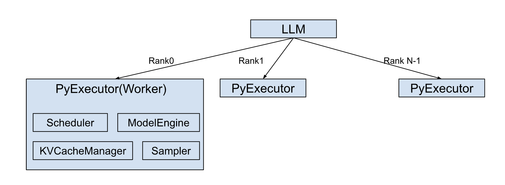

# Architecture Overview

The `LLM` class is a core entry point for the TensorRT-LLM, providing a simplified `generate()` API for efficient large language model inference. This abstraction aims to streamline the user experience, as demonstrated with TinyLlama:

```python
from tensorrt_llm import LLM

# Initialize the LLM with a specified model
llm = LLM(model="TinyLlama/TinyLlama-1.1B-Chat-v1.0")

# Generate text using the model
output = llm.generate("Hello, my name is")
```

The `LLM` class automatically manages essential pre and post-processing steps, including tokenization (encoding input prompts into numerical representations) and detokenization (decoding model outputs back into human-readable text).

Internally, the `LLM` class orchestrates the creation of a dedicated `PyExecutor(Worker)` process on each rank.



This `PyExecutor` operates in a continuous background loop, designed for the efficient, asynchronous processing of inference requests.

The `PyExecutor`'s functionality is built upon several key components:

- `Scheduler`: Responsible for determining which active requests are ready for execution at each processing step.

- `KVCacheManager`: Manages the allocation, deallocation, and maintenance of the Key-Value (KV) Cache. This is a critical optimization for Transformer models, significantly enhancing performance during autoregressive text generation by storing previously computed attention keys and values.

- `ModelEngine`: Handles the loading and highly efficient execution of the language model on the GPU hardware.

- `Sampler`: Takes the raw outputs (logits) from the ModelEngine and applies appropriate sampling strategies (e.g., greedy, top-k, top-p, beam search) to generate the final output tokens.

During each iteration of its background loop, the `PyExecutor` performs the following sequence of operations:

- Request Fetching: Retrieves new inference requests from an internal request queue, if available.

- Scheduling: Interacts with the `Scheduler` to identify and prioritize requests that are ready to be processed in the current step.

- Resource Preparation: Coordinates with the `KVCacheManager` to ensure that the necessary Key-Value (KV) Cache resources are allocated for the selected requests.

- Model Execution: Invokes the `ModelEngine` to perform a forward pass on the scheduled requests, predicting the next output tokens.

- Output Handling: Updates the partial outputs for ongoing requests and finalizes the results for any requests that have reached completion, returning them to the user.
