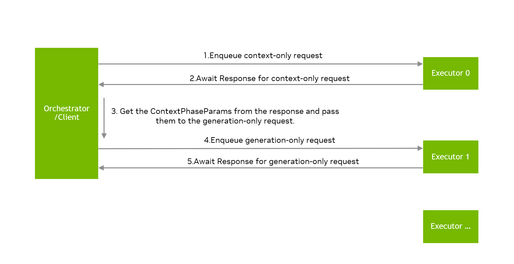

(disaggregated-service)=

# Disaggregated-Service (experimental)


```{note}
Note:
This feature is currently experimental, and the related API is subjected to change in future versions.
```

Currently TRT-LLM supports `disaggregated-service`, where the context and generation phases of a request can run on different executors. TRT-LLM's disaggregated service relies on the executor API, please make sure to read the [executor page](executor.md) before reading the document.

For more information on disaggregated service in LLM inference, one can refer to papers such as [DistServe](https://arxiv.org/abs/2401.09670), [SplitWise](https://arxiv.org/abs/2311.18677).


## Usage

```cpp
enum class RequestType
{
    REQUEST_TYPE_CONTEXT_AND_GENERATION = 0,
    REQUEST_TYPE_CONTEXT_ONLY = 1,
    REQUEST_TYPE_GENERATION_ONLY = 2
};
```
The TRT-LLM executor can execute three types of requests: `REQUEST_TYPE_CONTEXT_AND_GENERATION`, `REQUEST_TYPE_CONTEXT_ONLY`, and `REQUEST_TYPE_GENERATION_ONLY`. An executor instance could execute the context phase of the context-only request or the generation phase of the generation-only request. When the executor completes the context phase of a context-only request, it maintains the corresponding KV cache, which will be requested by the executor for the subsequent generation-only request.

Note that the environment variable `TRTLLM_USE_MPI_KVCACHE=1` should be set for `disaggregated-service`.


Here are some key APIs to use disaggregated service:
```cpp

Request request{...};

request.setRequestType(tensorrt_llm::executor::RequestType::REQUEST_TYPE_CONTEXT_ONLY);

auto contextRequestId = contextExecutor.enqueueRequest(request);

auto contextResponses = contextExecutor.awaitResponses(contextRequestId);

auto contextPhaseParams = contextResponses.back().getResult().contextPhaseParams.value();

request.setContextPhaseParams(contextPhaseParams);

request.setRequestType(tensorrt_llm::executor::RequestType::REQUEST_TYPE_GENERATION_ONLY);

auto generationRequestId = generationExecutor.enqueueRequest(request);

auto genResponses = generationExecutor.awaitResponses(generationRequestId);

```

The generationExecutor will require data such as KV cache from the corresponding contextExecutor based on the `contextPhaseParams` attached to the request, so please make sure that the corresponding contextExecutor is not shut down before getting the generationExecutor's response.

In the code example above, the `contextRequestId` assigned by the contextExecutor and the `generationRequestId` assigned by the generationExecutor are independent, it is the user's responsibility to manage the mapping of the `requestId` for context-only requests to the `requestId` for generation-only requests. The `contextResponses` contains the first output token generated by the context phase, and the `genResponses` also contains the first output token generated by the contextExecutor,  so all output tokens can be obtained from generationExecutor's responses.




An `orchestrator` is required in `disaggregated-service` to manage multiple executor instances and route requests to different executors, TRT-LLM provides class `DisaggExecutorOrchestrator` in `cpp/include/tensorrt_llm/executor/disaggServerUtil.h` to launch multiple executor instances, however, `DisaggExecutorOrchestrator` only routes requests to executors in a simple round-robin policy, users need to implement their own orchestrator for disaggregated-service based on their usage scenario.


## Example

Please refer to `examples/cpp/executor/executorExampleDisaggregated.cpp`

## Benchmarks

Please refer to `benchmarks/cpp/disaggServerBenchmark.cpp` and `benchmarks/cpp/README.md`

## Environment Variables

TRT-LLM uses some environment variables to control the behavior of disaggregated service.

* `TRTLLM_USE_MPI_KVCACHE`: Whether to use MPI to transfer KV cache. Currently, the default value is `0`.

* `TRTLLM_USE_UCX_KVCACHE`: Whether to use UCX to transfer KV cache. Currently, the default value is `0`. To use disaggregated service, either `TRTLLM_USE_MPI_KVCACHE=1` or `TRTLLM_USE_UCX_KVCACHE=1` is required to be set.

* `TRTLLM_PARALLEL_CACHE_SEND`: If set to `1`, contextExecutor will attempt to send KV cache for multiple requests in parallel. The default value is `0`.

* `TRTLLM_DISABLE_KV_CACHE_TRANSFER_OVERLAP`: If set to `1`, generationExecutor will not overlap KV cache transfer with model inference. The default value is `0`.

* `TRTLLM_ENABLE_KVCACHE_RECEIVE_PARALLEL`:  When the generation rank receives KV cache from multiple context ranks within a single context instance, it will receive KV cache from each rank sequentially. If set to `1`, the generation rank will receive KV cache from each rank within one context instance in parallel. The default value is `0`.

* `TRTLLM_REQUEST_KV_CACHE_CONCURRENT`: If set to `1`, generationExecutor prepares independent resources for each context executor to receive KV cache, requests whose KV cache are received from different context executors will be processed concurrently. If set to `0`, the generation executor will reuse the same resource to process KV cache transfer for each request sequentially, reducing the resources used by KV cache transmission and thereby lowering the risk of running out of memory. The default value is `0`.

* `TRTLLM_TRY_ZCOPY_FOR_KVCACHE_TRANSFER`: TRT-LLM typically copies non-contiguous data into a temporary buffer before sending KV cache. If set to `1`, TRT-LLM will attempt to directly transmit each KV cache block, eliminating extra copies. The default value is `0`.

* `TRTLLM_KVCACHE_TRANSFER_BUFFER_SIZE`: By default, TRT-LLM uses a `stream-ordered memory allocator` to allocate temporary buffers. If this environment variable is set to #Size, TRT-LLM will use `cudaMalloc` to allocate buffer of size #Size for KV cache transmission. The default value is `0`. Users can set `TRTLLM_KVCACHE_TRANSFER_BUFFER_SIZE=1GB` to allocate a 1 GB buffer with `cudaMalloc` for KV cache transmission.

* `TRTLLM_KVCACHE_TRANSFER_USE_ASYNC_BUFFER`: If set to `1`, TRT-LLM will use `cudaMallocAsync` to allocate buffers for KV cache transmission. The default value is `0`. This environment variable only takes effect when `TRTLLM_KVCACHE_TRANSFER_BUFFER_SIZE` is greater than 0.

* `TRTLLM_KVCACHE_SEND_MAX_CONCURRENCY_NUM`: The maximum number of concurrent KV cache sends. The default value is `4`. This environment variable only takes effect when `TRTLLM_KVCACHE_TRANSFER_BUFFER_SIZE` is greater than 0.


## Troubleshooting and FAQ

### General FAQs

*Q. What are the limitations of disaggregated-service in TRT-LLM?*

A. Currently, only `decoder-only engine` and `beamWidth=1` are supported, and the KV cache at each layer of the model is required to be homogeneous, with the same data type and the same number of attention headers.

*Q. Is the engine used by disaggregated-service different from other engines?*

A. No. There are no special requirements for the arguments to build engine.

*Q. Do the engines used by the context executor and generation executor need to be the same?*

A. No. The engines used by context executor and generation executor can be different, and their parallelism can be heterogeneous, i.e., TP,PP can be different, and TRT-LLM will handle the heterogeneity of KV cache.

*Q. Does TRT-LLM support running multiple context executor instances and generation executor instances?*

A. Yes. TRT-LLM supports running multiple context executors and generation executors at the same time, and each executor can use different engine, but it is the user's responsibility to route requests to different executors and  manage `requestId`.

*Q. Can an executor handle both context-only requests and generation-only requests?*

A. Yes, but it's not recommended, TRT-LLM does not implement proper scheduling for the case where the executor handles mixed context-only requests and generation-only requests, it's better to run context-only requests and generation-only requests on different executors.

*Q. Does disaggregated-service in TRT-LLM support multi-gpu and multi-node?*

A. Yes, it's recommended that different executor use different GPUs . We support context-only executor and genertion-only executor run on same node or different nodes. The `participantIds` and `deviceIds` used by each executor need to be explicitly set by the user, and the `participantIds` of each executor must not be intersecting.

*Q. What's the requirement for disaggregated-service in TRT-LLM?*

A. TRT-LLM requires `UCX`-backend `CUDA-aware MPI` currently, TRT-LLM implements KV cache transfer with [`CUDA-aware MPI`](https://docs.open-mpi.org/en/v5.0.x/tuning-apps/networking/cuda.html#how-do-i-build-open-mpi-with-cuda-aware-support), and will support more communication components for KV cache transfer in future version.

### Debugging FAQs

*Q. How to handle error `Disaggregated serving is not enabled, please check the configuration?`*

A. please set the environment variables
```
export TRTLLM_USE_MPI_KVCACHE=1
```
or
```
export TRTLLM_USE_UCX_KVCACHE=1
```
When the environment variable `TRTLLM_USE_MPI_KVCACHE=1` is set, TRT-LLM will transfer the KV cache using `CUDA-aware MPI`. All executor processes involved must share the same MPI world communicator. Consequently, with `TRTLLM_USE_MPI_KVCACHE=1`, TRT-LLM only supports launching multiple executors via `MPI`. Additionally, the `CommunicationMode` for the executors must be set to `kLEADER` or `kORCHESTRATOR` with `SpawnProcesses=false` for the `disaggregated-service`. These restrictions do not apply when `TRTLLM_USE_UCX_KVCACHE=1` is set.


*Q. Why do some profiling tools show that TRT-LLM's KV cache transfer does not utilize NVLink even on devices equipped with NVLink?*

A. Ensure TRT-LLM is running with `UCX`-backend `CUDA-aware MPI` , and check version of `UCX` with `ucx_info -v`.
If the version of UCX <=1.17, set the environment variables `UCX_RNDV_FRAG_MEM_TYPE=cuda` and `UCX_MEMTYPE_CACHE=n` to enable NVLink. For BlackWell architecture GPUs, UCX version >=1.19 is required to enable NVLink.
If the version of UCX >=1.18, there are several ways to enable NVLink:
1. Set the environment variables `UCX_CUDA_COPY_ASYNC_MEM_TYPE=cuda`, `UCX_CUDA_COPY_DMABUF=no`, `UCX_MEMTYPE_CACHE=n` and `UCX_RNDV_PIPELINE_ERROR_HANDLING=y`.
2. Set the environment variables `TRTLLM_KVCACHE_TRANSFER_BUFFER_SIZE=$Size`, `UCX_MEMTYPE_CACHE=n` and `UCX_RNDV_PIPELINE_ERROR_HANDLING=y`. $Size represents the size of the buffer for KV cache transfer, which is recommended to be larger than the size of the KV cache for the longest request.

*Q. Does TRT-LLM support using GPU direct RDMA for inter-node KV Cache transfer?*

A. Yes, TRT-LLM supports using GPU direct RDMA for inter-node KV cache transfer, but it is not enabled by default. There are several ways to enable GPU direct RDMA:
1. Set the environment variables `UCX_RNDV_FRAG_MEM_TYPE=cuda`, `UCX_MEMTYPE_CACHE=n` and `UCX_RNDV_PIPELINE_ERROR_HANDLING=y`.
2. Set the environment variables `TRTLLM_KVCACHE_TRANSFER_BUFFER_SIZE=$Size`, `UCX_MEMTYPE_CACHE=n` and `UCX_RNDV_PIPELINE_ERROR_HANDLING=y`, $Size represents the size of the buffer for KV cache transfer, which is recommended to be larger than the size of the KV cache for the longest request.
To achieve the optimal performance when using GPU direct RDMA, it is advisable to create CUDA context before MPI initialization when TRTLLM_USE_MPI_KVCACHE=1 is set. One possible approach is to rely on MPI environment variables to set the correct device before MPI initialization.

*Q. Are there any guidelines for performance tuning of KV cache transfer?*

A. Depending on the user's use case, certain sets of environment variables can help avoid poor KV cache transfer performance.

Environment Variable Set A

```
export UCX_RNDV_FRAG_MEM_TYPES=cuda
export UCX_MEMTYPE_CACHE=n
export UCX_RNDV_PIPELINE_ERROR_HANDLING=y
```
This set allows KV cache transfers to utilize NVLink within nodes and GDRDMA between nodes.

Environment Variable Set B

```
export UCX_CUDA_COPY_ASYNC_MEM_TYPE=cuda
export UCX_CUDA_COPY_DMABUF=no
export UCX_MEMTYPE_CACHE=n
export UCX_RNDV_PIPELINE_ERROR_HANDLING=y
```
Set B may provide slightly better performance on a single node compared to Set A. However, when transferring KV cache across multiple nodes, it may cause program instability.

Environment Variable Set C

```
export TRTLLM_KVCACHE_TRANSFER_BUFFER_SIZE=$Size
export UCX_MEMTYPE_CACHE=n
export UCX_RNDV_PIPELINE_ERROR_HANDLING=y
```
Set C can achieve better performance than Sets A and B, both within and between nodes. However, if the KV cache size exceeds the specified $Size, performance may degrade.
