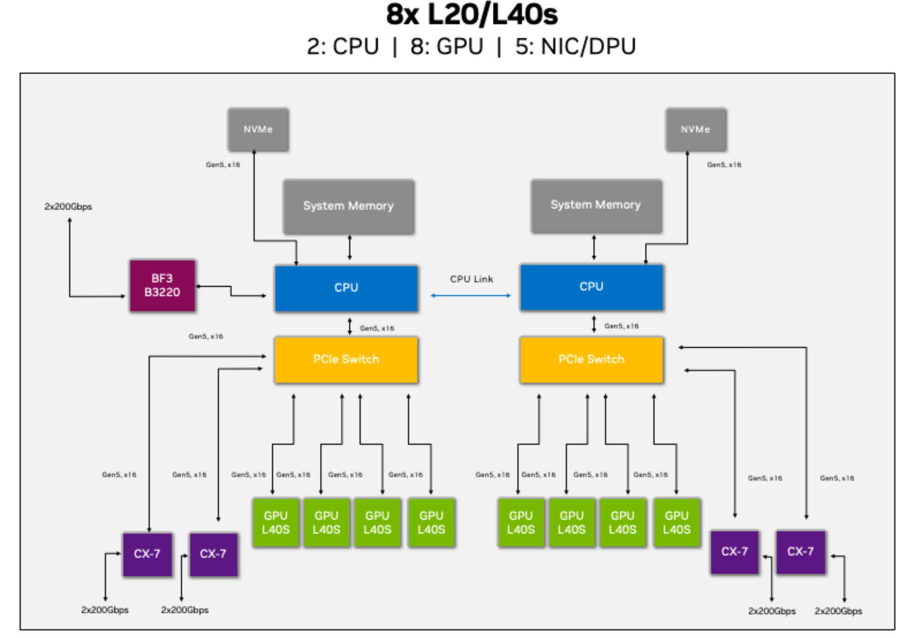

# Low-Precision-AllReduce

```{note}
Note:
This feature is optimized for PCIe-based GPU topologies and may affect model accuracy. Please evaluate precision impact for your specific workload.
```


TRT-LLM supports `low-precision-allreduce`, a communication optimization that accelerates AllReduce operations in PCIe-based GPU environments. This feature quantizes FP16/BF16 data to FP8 during network transmission, reducing communication volume and improving performance.

## Algorithm

The Low-Precision-AllReduce algorithm works by:
1. Quantizing input FP16/BF16 tensors to FP8 format before network transmission


   **Quantization details**: We use a "per-warp" quantization approach where each CUDA warp (32 threads) processes a batch of data. In each warp, 31 threads quantize FP16/BF16 values to FP8 e4m3 format (16 bytes per thread), while the last thread transmits a scalar value. This results in each warp collectively quantizing 496 elements plus one scalar at a time.

2. Transmitting the quantized data through the network
3. Dequantizing received data back to the original precision
4. Performing the reduction operation

In 8-GPU scenarios, this approach shifts the communication bottleneck from cross-NUMA QPI to the PCIe switch, resulting in better overall performance.

## Topology Requirements



Low-Precision-AllReduce is specifically designed for the topology shown above, where:
- Each node contains 2 NUMA domains
- Each NUMA domain has 4 GPUs connected via PCIe switch
- GPUs within the same NUMA node communicate via the PCIe switch

**Important:** This optimization will not accelerate performance in different topologies (e.g., where each GPU is in a separate NUMA domain).

## Usage

The Low-Precision-AllReduce algorithm can be enabled in two ways:

1. **Direct specification** in your code:
```
AllReduce allreduce(mapping=mapping, strategy=AllReduceStrategy.LOWPRECISION);
```

2. Enable by LlmArgs
```
Set allreduce_strategy field in LlmArgs.
Candidates of strategies are "AUTO", "NCCL", "UB", "MINLATENCY", "ONESHOT", "TWOSHOT", "LOWPRECISION" and "MNNVL".
If no strategy is set, AUTO will be set.
```

## Performance and Accuracy Considerations

Low-Precision-AllReduce reduces communication volume by using FP8 data format for transmission. This optimization:
- Improves performance for large message sizes in PCIe-based topologies
- May slightly reduce numerical precision
- Automatically falls back to other strategies when no performance benefit is expected (e.g., with NVLink or small messages)

Users should evaluate the precision impact on their specific models and workloads.

**Note**: When compiling TensorRT-LLM without enabling the `ENABLE_FP8` option, setting Low Precision allreduce will not take effect.
