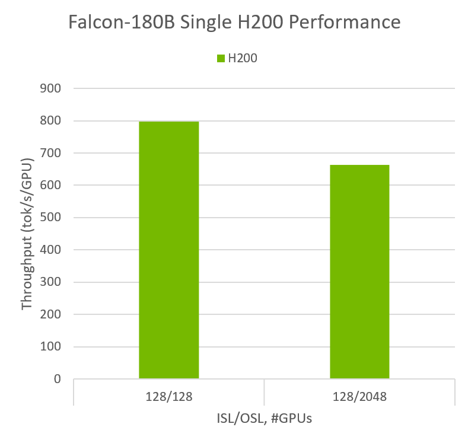
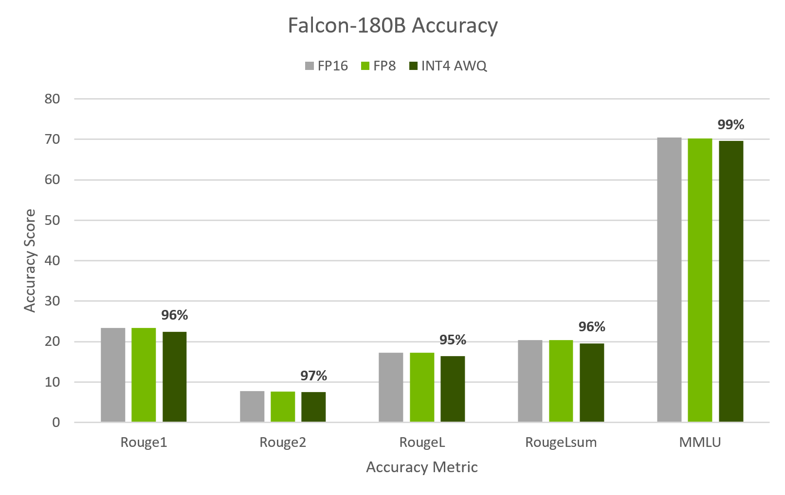
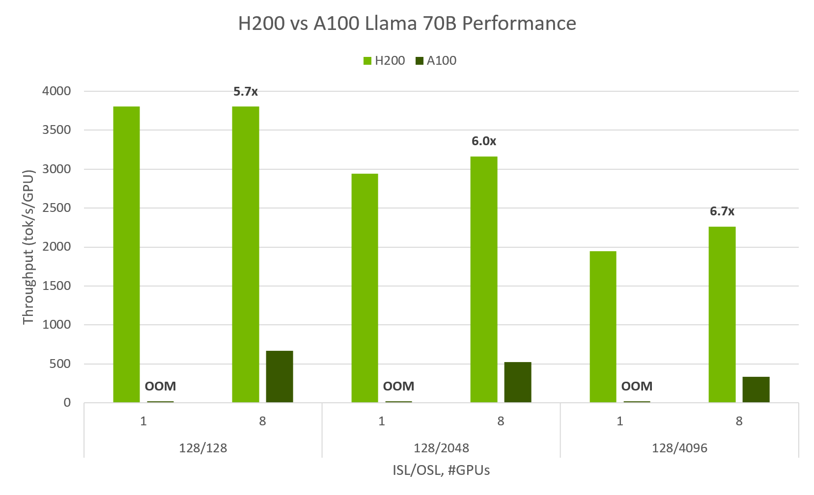

# Falcon-180B on a single H200 GPU with INT4 AWQ, and 6.7x faster Llama-70B over A100

H200's large capacity & high memory bandwidth, paired with TensorRT-LLM's
optimizations, maximizes inference performance.

## Falcon-180B on a single H200 with INT4 AWQ
[Falcon-180B](https://huggingface.co/tiiuae/falcon-180B), one of the largest &
most accurate open source models available, can run on a *single* H200 GPU.

The 141GB of memory on H200, paired with TensorRT-LLM running INT4 AWQ with
FP8, allows for the entire large language model to fit on a single GPU, where
previously eight A100s were required. H200 Falcon-180B provides up to **800**
tok/s and retains high accuracy.

**Model Performance:**
H200's large capacity & high memory bandwidth, utilizing INT4 AWQ to reduce
memory footprint, allows for great performance on Falcon-180B on a single GPU.

Preliminary measured Performance, subject to change. TP1 does not represent peak performance on H200. 

TensorRT-LLM v0.7a |
Falcon-180B |
1xH200 TP1 |
INT4 AWQ |
BS: (in order) 256, 128 

**Model Accuracy:**
Often quantization can have adverse impacts on the accuracy of the model,
however, TensorRT-LLM's AWQ decreases memory footprint of the model by **4x**
while maintaining high accuracy.

Preliminary measured accuracy, subject to change. 

TensorRT-LLM v0.7a |
Falcon-180B |
1xH200 TP1 |
INT4 AWQ

[**INT4 Activation-aware Weight Quantization
(AWQ)**](https://arxiv.org/abs/2306.00978) (Lin et al., 2023) is a quantization
technique which compresses the weights of an LLM down to 4bits based on their
relative importance, and performs computation in FP16. This allows for AWQ to
retain higher accuracy than other 4bit methods and reduce memory usage, but
requires special kernels capable of handling the change in precision
performantly.

TensorRT-LLM has implemented custom kernels for AWQ, and taken the technique a
step further by performing FP8 computation on Hopper GPUs instead of the
standard FP16.

Similar examples running Falcon-180B with quantization in TensorRT-LLM are
available in [examples/falcon](/examples/falcon).

## Llama-70B on H200 up to 6.7x A100

TensorRT-LLM has improved its Group Query Attention (GQA) kernels, in the
generation phase, providing up to 2.4x improvement on Llama-70B over
TensorRT-LLM v0.5, achieving over **3,800** tok/s/gpu at up to **6.7x** faster
than A100.

**H200 6.7x A100**

|Model     |GPUs | Input Length | Output Length | Throughput (out tok/s/GPU)|
|:---------|:----|:-------------|:--------------|:------|
|Llama-70B |   1 |           128|           128 | 3,803 |
|          |   8 |              |               | 3,803 |
|          |   1 |              |          2048 | 2,941 |
|          |   8 |              |               | 3,163 |
|          |   1 |              |          4096 | 1,946 |
|          |   8 |              |               | 2,263 |

Preliminary measured performance, subject to change. 

TensorRT-LLM v0.7a |
Llama2-70B |
1xH200 = TP1, 8xH200 = max TP/PP/DP config |
FP8 |
BS: (in order) 960, 960, 192, 560, 96, 640 

**TensorRT-LLM GQA now 2.4x faster on H200**

Preliminary measured performance, subject to change.

TensorRT-LLM v0.7a vs TensorRT-LLM v0.6a |
Llama2-70B |
1xH200 TP1 |
FP8 |
BS 192 

[**Grouped Query Attention (GQA)**](https://arxiv.org/abs/2305.13245v2)
(Ainslie et al., 2023), used in Llama-70B, is a variant of Multihead Attention
(MHA) which groups key-value (KV) heads together, resulting in fewer KV heads
than query (Q) heads. TensorRT-LLM has a custom implementation of MHA which
supports GQA, multi-query attention (MQA) and standard MHA. It leverages Tensor
Cores, including in the generation phase, and delivers great performance on
NVIDIA GPUs.

###### Closing

These improvements will be published in the `main` branch soon, and will be
included in the v0.7 & v0.8 releases.

Similar examples running Llama-70B in TensorRT-LLM are published in
[examples/llama](/examples/llama).

For more information about H200, please see the [H200 announcement blog](./H200launch.md).

Throughput is calculated as output tokens per second per gpu.
`out_tps=output_seqlen*batch_size/total_latency/tp`

 **Glossary:**
| DP  = Data Parallel
  ISL = Input Sequence Length
| PP  = Pipeline Parallel
| OSL = Output Sequence Length
| OOM = Out of Memory
| TP  = Tensor Parallel 
