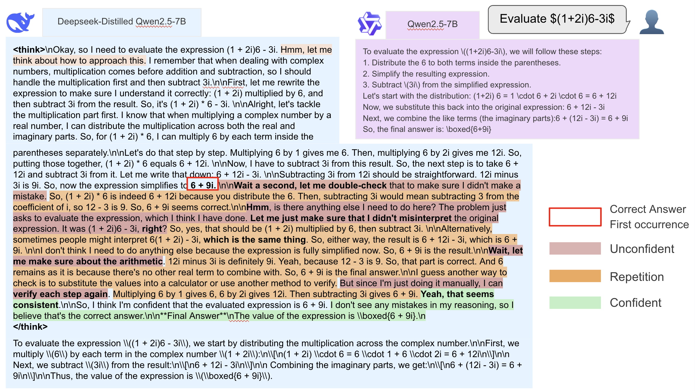
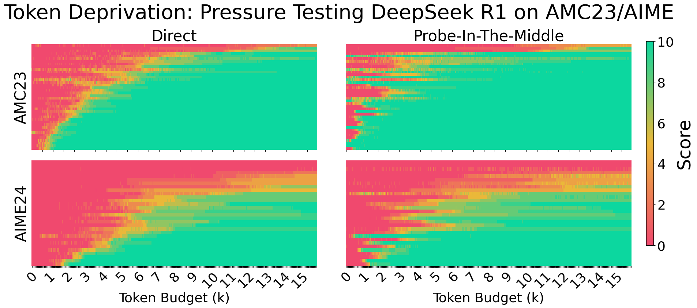
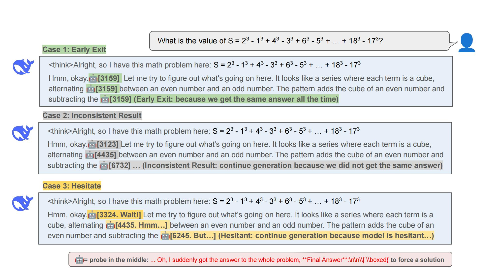

# Inference Time Compute Implementation in TensorRT-LLM

By NVIDIA TensorRT-LLM Team

## Table of Contents
- [Inference-Time Compute Implementation in TensorRT-LLM (Part 1: Design and Implementation](inference-time-compute-implementation-in-tensorrt-llm)
 -[Table of Content](table-of-content)
 -[Background and Motivation](background-and-motivation)
 -[Introduction for Scaffolding: A Framework for inference-time compute](introduction-for-scaffolding)
 -[An Example: Implement Dynasor on Scaffolding](example-for-scaffolding)
  -[Introduction for Dynasor](dynasor-introduction)
  -[Implement Dynasor-CoT in Scaffolding](dynasor-cot-implement-in-scaffolding)
  -[Implement Dynasor-CoT based Majority Voting in Scaffolding](dynasor-cot-based-majority-vote-in-scaffolding)
 -[Feature List on Scaffolding](scaffolding-feature-list)

## An Example: Implement Dynasor-CoT on Scaffolding
Dynasor-CoT is a certainty-based, training-free approach to accelerate Chain-of-Thought (CoT) inference. This chapter discusses how inference-time compute methods can be smoothly integrated into the TRT-LLM Scaffolding framework, using Dynasor-CoT as an example.

<div align="center">
    
</div>
<p align="center"><sub><em>Figure 1. Demo of DeepSeek-R1-Distill-Qwen-7B achieving a 5.74x speedup compared to the baseline when using Dynasor-CoT on MATH500</em></sub></p>

### Introducation for Dynasor-CoT
#### Motivation
LLM reasoning is highly token-inefficient, often requiring far more tokens to achieve the same accuracy as non-reasoning models. A major source of this inefficiency is that reasoning models tend to **self-doubt**; they often reach the correct answer early but then engage in extended verification behaviors like double-checking and reassessment.

For instance, Figure 2 compares a traditional Qwen-7B model with a reasoning-focused, Deepseek-distilled Qwen-7B model on a simple question. While the traditional model reaches its answer in 180 tokens, the reasoning model expends 1,000 tokens on iterative verification, despite having already found the correct answer at token 340. This represents a significant waste of tokens for diminishing returns on accuracy.

<div align="center">
    
</div>
<p align="center"><sub><em>Figure 2. An example answer from reasoning model (Deepseek-distilled Qwen-2.5 7B) vs traditional model (Qwen-2.5 7B) on one of the problem in MATH500 dataset.</em></sub></p>

#### The "Probe" technique
Dynasor-CoT uses a **"Probe-In-The-Middle"** (or "probe" for short) technique to force reasoning models to output their early-stage results based on their unfinished reasoning. Imagine you're in a math exam working on a hard problem. When time is up, you're forced to write down your final answer, regardless of how confident you are.

More specifically, a probe is an extra generation request with an eliciting prompt appended to the intermediate reasoning tokens. One effective eliciting prompt is: `Oh, I suddenly got the answer to the whole problem, Final Answer: boxed{`. Figure 3 shows an analysis comparing the accuracy of directly asking versus probing the model. Taking AMC23 as an example, reasoning models frequently arrive at correct answers early (median: 830 tokens) but continue generating unnecessary tokens due to self-doubt (median: 2.7K tokens).


<div align="center">
    
</div>
<p align="center"><sub><em>Figure 3. DeepSeek-R1's performance on AMC23 and AIME24 at varying token budgets. (Left) Standard reasoning with late answer outputs. (Right) Early answer extraction using the Probe-In-The-Middle technique, demonstrating equivalent accuracy with a 50% token reduction. The greener regions in the right panels suggest the model knows the answers much earlier than it reveals in standard reasoning.</em></sub></p>

#### How it speeds up inference
Instead of generating a fixed number of tokens or waiting for a stop token, Dynasor-CoT **probes the model regularly** (e.g., every 32, 64, or 128 tokens) and **terminates the process** early once a consistent answer is formed across recent probes. This avoids unnecessary computation, directly reducing latency.

Figure 4 provides an illustration:

* **Case 1**: All three probe requests lead to the same answer, "3159." We can assume this is the final answer with high certainty and exit early.

* **Case 2**: The early-stage answers are inconsistent, which indicates low confidence, so we continue generation.

* **Case 3**: The model generates special tokens like "wait" or "hmm," which also indicate hesitation, so we continue the generation.

<div align="center">
    
</div>
<p align="center"><sub><em>Figure 4. Illustration of Dynasor-CoT. Case 1: early exit due to consistent early-stage results. Case 2: continue generation due to inconsistent early-stage results. Case 3: responses containing hesitation words (e.g., wait) are disgarded.</em></sub></p>

### Implement Dynasor-CoT in Scaffolding
A key difference between test-time methods like Dynasor-CoT and a normal LLM generation request is that the generation process can consist of multiple smaller, user-defined tasks. The results of these tasks can dynamically control the overall logic—for example, by determining whether to expand the scope of subsequent generation or to terminate the process entirely. In a single Dynasor-CoT request, generation proceeds chunk by chunk, with additional "probe" tasks running in parallel with the main generation. Once a consistent answer is formed across recent probes, the process terminates early.

`Scaffolding` provides a perfect solution for customizing these kinds of data flows using a concept called a `Controller`. Within a `Controller`, we can customize the data flow logic by defining how and when these smaller tasks are submitted. To implement Dynasor-CoT, we simply inherit from the base `Controller` class and override the `process()` function to customize how it yields tasks. We don't need to worry about how these tasks are executed because the inference-time compute methods and the execution backend are modularized and decoupled in Scaffolding. These tasks are submitted to `ScaffoldingLlm`, which then dispatches workers to complete them.

Let's start the implementation by inheriting the `Controller` class and adding the necessary parameters for Dynasor-CoT.
```python
class DynasorGenerationController(Controller):

    class WorkerTag(Enum):
        GENERATION = "generation_with_dynasor_cot"

    def __init__(
        self,
        generation_dir,
        max_tokens=8192,
        certainty_threshold=3,
        chunk_size=64,
        streaming=False,
    ):
        super().__init__()
        self.generation_dir = generation_dir
        self.max_tokens = max_tokens
        self.certainty_threshold = certainty_threshold
        self.chunk_size = chunk_size
        self.uncertain_words = ["wait", "hold", "but", "okay", "no", "hmm"]
        self.probe_suffix = "... Oh, I suddenly got the answer to the whole problem, **Final Answer**\n\n\\[ \\boxed{"
        self.answer_suffix = "\n\n... Oh, I have got the answer to the whole problem\n**Final Answer:**\n\\[\n \\boxed{"
        self.answer_suffix_with_marker = "\n\n...</think>\n Oh, I have got the answer to the whole problem\n**Final Answer:**\n\\[\n \\boxed{"
        self.tokenizer = AutoTokenizer.from_pretrained(
            self.generation_dir,
            legacy=False,
            padding_side='left',
            truncation_side='left',
            trust_remote_code=False,
            use_fast=True,
        )
        self.streaming = streaming
```

The `process()` function, as mentioned before, is the core method within the `Controller` class. Here, we can customize our data flow by specifying the logic for yielding tasks. For Dynasor-CoT, we have two different kinds of tasks:

1. `proposer_task`: Handles the main content generation, producing self.chunk_size tokens based on the previous content.

2. `probe_task`: Elicits an early-stage answer by generating 20 tokens from the same content.

The code below creates these two types of tasks.

```python
    def process(self, tasks: List[GenerationTask], **kwargs):
        # Start with the initial prompt provided by the first task.
        initial_prompt = tasks[0].input_str

        proposer_task = GenerationTask()
        proposer_task.max_tokens = self.chunk_size
        proposer_task.temperature = 0.6
        proposer_task.top_p = 0.95
        proposer_task.worker_tag = self.WorkerTag.GENERATION

        probe_task = GenerationTask()
        probe_task.max_tokens = 20
        probe_task.temperature = 0.6
        probe_task.top_p = 0.95
        probe_task.worker_tag = self.WorkerTag.GENERATION

        probe_answers = []
        probe_responses = []

        initial_prompt_token_num = len(
            self.tokenizer.encode(initial_prompt, add_special_tokens=False))
        probe_suffix_token_num = len(
            self.tokenizer.encode(self.probe_suffix, add_special_tokens=False))

        current_prompt = initial_prompt
```

To prevent extra latency, the `proposer_task` should not be blocked by the `probe_task`. Scaffolding's task-level concurrency handles this perfectly. We can yield `proposer_task` and `probe_task` in a single list. Multiple tasks yielded together in the same list will be batched and executed in parallel.

```python
    yield[proposer_task, probe_task]
```

In the following `for` loop, each iteration performs these steps:

1. **Submit** both a proposer task and a probe task by yielding them. We don't need to worry about execution details, as they are handled by `ScaffoldingLlm`, which binds the `Controller` and `Workers` together behind the scenes.

2. **Evaluate** the probe response after the tasks return, checking for consistency over several rounds (using `certainty_threshold`).

3. **Finalize** the answer and return if it is consistent. Otherwise, append the new tokens from the proposer task and proceed to the next iteration.

```python
        # Iterate over generation rounds until the maximum tokens limit is reached.
        # Make sure length of prefilling is always smaller than the max_tokens in TRTLLMWorker.init_with_new_llm
        # Otherwise it will through an assertion fail, stated in issue #3576
        for _ in range(initial_prompt_token_num + probe_suffix_token_num,
                    self.max_tokens, self.chunk_size):
            proposer_task.input_str = current_prompt
            probe_task.input_str = current_prompt + self.probe_suffix

            # For the probe task, append the suffix to force a chain-of-thought leading to an answer.
            yield [proposer_task, probe_task]

            # Retrieve the output from the probe task.
            probe_text = probe_task.output_str

            # Extract the potential answer from the probe response.
            answer = self.obtain_answer(probe_text)
            probe_answers.append(answer)
            probe_responses.append(probe_text)

            if self.should_early_stop(probe_answers, probe_responses):
                tasks[0].result = probe_task.result
                # If the current prompt indicates the chain-of-thought phase has ended, use one type of suffix.
                if "</think>" in current_prompt:
                    tasks[0].output_str = (current_prompt + self.answer_suffix +
                                        probe_answers[-1] + "}\n\\]")
                    return
                else:
                    # Otherwise, use the suffix with marker to transition clearly.
                    tasks[0].output_str = (current_prompt +
                                        self.answer_suffix_with_marker +
                                        probe_answers[-1] + "}\n\\]")
                    return

            # If not confident, do another round of generation
            # Append the newly generated text from the proposer to the current prompt for the next iteration.
            current_prompt += proposer_task.output_str

        # If the maximum token limit is reached without satisfying the certainty condition,
        # output the accumulated prompt as the final output.
        tasks[0].result = proposer_task.result
        tasks[0].output_str = current_prompt
        return
```

Now we have implemented a `Controller` for Dynasor-CoT. Here is an example of how to use it:
```python
dynasor_generation_controller = DynasorGenerationController(
    # Parameters for DynasorGenerationController
    )

llm = ScaffoldingLlm(
    prototype_controller=dynasor_generation_controller, 
    # other parameters for ScaffoldingLLM
    )
results = llm.generate(prompts)
```

### Implement Dynasor-CoT based Majority Voting in Scaffolding
Scaffolding is designed to be modular and reusable. We can assemble methods just like LEGO building blocks. For instance, to implement Dynasor-CoT-based Majority Voting, we can simply stack our `DynasorGenerationController` with a `MajorityVoteController`.

Once a controller for majority voting is built, no further implementation is needed. We can directly stack the two controllers as shown below.
```python
dynasor_generation_controller = DynasorGenerationController(
    # Parameters for DynasorGenerationController
    )

majority_vote_controller = MajorityVoteController(
    generation_controller=dynasor_generation_controller, # stack here
    # Other parameters for MajorityVoteController
    )

llm = ScaffoldingLlm(
    prototype_controller=majority_vote_controller, # Expose the outermost controller to ScaffoldingLlm
    # other parameters for ScaffoldingLLM
    )
results = llm.generate(prompts)
```
