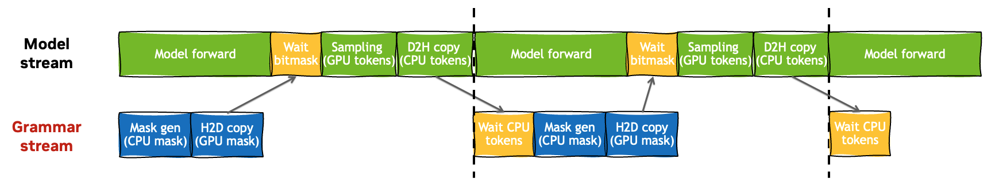

# Combining Guided Decoding and Speculative Deocidng: Making CPU and GPU Cooperate Seamlessly

As a part of the efforts to fill the feature combination gaps, we enabled guided decoding with many important LLM inference features in TensorRT-LLM over the last two months:

* Overlap scheduler: [PR 6000](https://github.com/NVIDIA/TensorRT-LLM/pull/6000)
* CUDA graph padding: [PR 6774](https://github.com/NVIDIA/TensorRT-LLM/pull/6774)
* Disaggregated serving: [PR 6704](https://github.com/NVIDIA/TensorRT-LLM/pull/6704)
* Speculative decoding (two-model implementation): [PR 6300](https://github.com/NVIDIA/TensorRT-LLM/pull/6300)
* Speculative decoding (one-model implementation): [PR 6948](https://github.com/NVIDIA/TensorRT-LLM/pull/6948)

More complicated (higher-order) combinations are also supported; for example, we can run DeepSeek-R1 with guided decoding, overlap scheduler, CUDA graph, attention data parallelism (ADP), multiple token prediction (MTP) and disaggregated serving​ all enabled.

Among all these tasks, combining guided decoding with one-model speulative decoding is the most challenging one and it achieves the best performance for low-latency or throughput@latency scenarios. This blog shares its overall designs, implementation details, and some performance analysis.

*By NVIDIA TensorRT LLM Team and XGrammar Team*

## Table of Contents
- [Combining Guided Decoding and Speculative Deocidng: Making CPU and GPU Cooperate Seamlessly](#combining-guided-decoding-and-speculative-deocidng-making-cpu-and-gpu-cooperate-seamlessly)
  - [Table of Contents](#table-of-contents)
  - [Background and Challenges](#background-and-challenges)
    - [Speculative Decoding](#speculative-decoding)
    - [Guided Decoding](#guided-decoding)
    - [Two Challenges](#two-challenges)
  - [Trace Grammar State for Token Proposal and Rejection](#trace-grammar-state-for-token-proposal-and-rejection)
    - [Target Model](#target-model)
    - [Draft Model](#draft-model)
  - [Make Grammar Computation Capturable by CUDA Graph](#make-grammar-computation-capturable-by-cuda-graph)
    - [CUDA Callback](#cuda-callback)
    - [Integration to TensorRT-LLM Python Runtime](#integration-to-tensorrt-llm-python-runtime)
    - [CUDA Graph Compatibility: Grammar Computation](#cuda-graph-compatibility-grammar-computation)
    - [CUDA Graph Compatibility: Mask Applying Kernel](#cuda-graph-compatibility-mask-applying-kernel)
  - [Acknowledgements](#acknowledgements)

## Background and Challenges

### Speculative Decoding

Speculative decoding is a crucial feature in low-latency or throughput@latency LLM inference scenarios. For a single request, a light-weight drafter proposes several draft tokens, and then the target model verifies the draft tokens in parallel. Hopefully, most draft tokens are accepted, and thus multiple tokens are generated in a single target model forward step. Compared with the normal LLM inference where each model forward generates a single token, speculative decoding effectively makes the generation phase less memory-bound.

TensorRT-LLM has two kinds of speculative decoding implementations, namely the one-model and two-model implementations. The one-model implementation launches a single CUDA graph for a target model forward together with multiple draft model forwards. This is more difficult to implement and coupled with the modeling code, but offers the best performance. The two-model implementation decouples target and draft models to separate CUDA graphs, which is much more flexible and offers better feature coverage.

### Guided Decoding

Guided decoding (or interchangeably constrained decoding, structured generation) guarantees that the LLM outputs are amenable to user-specified grammar (e.g., JSON schema), which is particularly useful for LLM agents. For example, guided decoding can help LLM generate function arguments that strictly conforms function signatures. Thus, the LLM can correctly call external tools, and integrate the tool calling results for a better response.

For a request at the prefill step, guided decoding creates an initial grammar state (i.e., grammar initialization), and generates a mask tensor indicating which tokens from the vocabulary are allowed for the first generated token (i.e., mask gen). At each generation step, guided decoding advances the grammar state based on the last generated token (i.e., grammar advance), and generates a mask tensor for the next token. The mask will be applied to the logits to mask out the disallowed tokens before sampling (i.e., mask applying), which ensures the next token is amenable to the grammar constraints.

TensorRT-LLM integrates third-party grammar backends (e.g., [XGrammar](https://github.com/mlc-ai/xgrammar), [LLGuidance](https://github.com/guidance-ai/llguidance)) for the grammar computation. Currently, these grammar backends are implemented on CPU, so the grammar computation introduces significant CPU overhead. Fortunately, this can be overlapped with the GPU computation, achieving [near-zero overhead](https://blog.mlc.ai/2024/11/22/achieving-efficient-flexible-portable-structured-generation-with-xgrammar).

<div align="center">
<figure>
  
</figure>
</div>
<p align="center"><sub><em>Figure 1: Top: guided decoding pipeline without overlapping. Bottom: guided decoding pipeline with overlapping. (The figure is from the XGrammar paper.)</em></sub></p>

### Two Challenges

When combining guided decoding and speculative decoding, two challenges arise. First, at each generation step, speculative decoding proposes multiple draft tokens, and some of them might be rejected in the verification step. The draft token proposal and rejection are not transparent to guided decoding. Specifically, this can be broken down to two views:

* For the target model, guided decoding should advance the grammar state and generate the mask for every draft token. If some draft tokens are rejected, guided decoding should rollback the grammar state to the last accepted token.
* For the draft model, without grammar constraints, some draft tokens may violate the grammar and thus be forcefully rejected in the verification step. Clearly, this hurts the acceptance rate. Hence, guided decoding should also intervene the logits for every draft token generation if possible.
  * Some speculative algorithms propose draft tokens recurrently by computing logits and sampling (e.g., the standard draft-target model, EAGLE or MTP), similarly to a standard LLM. In that case, guided decoding can apply grammar constraints in a similar mask gen and applying way.
  * Some drafting algorithms work without logits sampling, which require other ways to apply the grammar constraints.

Second, the CPU-GPU synchronization is challenging when multiple (draft and target) generation steps are launched by a single CUDA graph.
For every step $i$, there are two event waits:

* The host waits the CPU tokens (asynchronously copied from GPU tokens) from step $i-1$.
* The model forward stream waits the GPU masks (asynchronously copied from CPU masks) from step $i$.

If multi-step forwards are launched by a single CUDA graph, it is not possible to let the CUDA graph wait events recorded from the host anymore.

<div align="center">
<figure>
  
</figure>
</div>
<p align="center"><sub><em>Figure 2: The CPU-GPU synchronization for multiple generation steps.</em></sub></p>


## Trace Grammar State for Token Proposal and Rejection

### Target Model

For a target model forward step, a request should have one new token and multiple draft tokens from the last verification step and drafter, respectively. For each token in the sequence, guided decoding should advance the grammar state and fill the mask tensor. Before sampling, the masks should be applied to the corresponding logits. After verification, the grammar state should be rolled back by the number of rejected tokens.

Compared to guided decoding with non-speculative decoding, the rollback operation is newly introduced. Thankfully, it is built-in supported by grammar backends like [XGrammar](https://github.com/mlc-ai/xgrammar/blob/v0.1.21/python/xgrammar/matcher.py#L341-L350) and [LLGuidance](https://github.com/guidance-ai/llguidance/blob/v1.1.1/python/llguidance/_lib.pyi#L363-L366).

Before proceeding to the draft model view, note that the LLM can generate correct outputs as long as we apply grammar constraints on the target model, because any draft tokens violating the grammar will be forcefully rejected by the verification step. However, this hurts the acceptance rate.

### Draft Model

As aforementioned, we can apply grammar constraints for draft tokens in a similar mask gen and applying way for speculative algorithms based on recurrent logits sampling. Specifically, for the first drafting step, guided decoding advances the grammar state using the last new token. For the following drafting steps, the grammar state is advanced using the last draft token. Each step should fill and apply the mask to the corresponding draft model logits before sampling. 

After the drafting process, the grammar state should be rolled back to the original state, so that the subsequent target model forward can have the correct grammar state. If the draft and target models share the same vocabulary, then the grammar computation is exactly the same so the masks can be reused.

One special case is EAGLE3, whose draft model has a [pruned vocabulary](https://github.com/SafeAILab/EAGLE/blob/58d1de099fe315645a82fe002e46586d54efe405/eagle/traineagle3/config.json#L22-L23) compared to the target model. For instance, LLaMA 3.1 has a 128k vocabulary size, while the corresponding EAGLE3 drafter has a vocabulary containing the most frequent 32k tokens. This saves some computation of lm_head GEMM. Note that grammar is built on the target model’s vocabulary, so the produced mask cannot be directly applied to the logits of the draft model. EAGLE3 provides a special [d2t](https://github.com/SafeAILab/EAGLE/blob/d7161f9f94aaa345654d9b4045931145811d4d03/eagle/traineagle3/cnets.py#L673-L681) tensor that maps draft token IDs to target token IDs. [PR 7481](https://github.com/NVIDIA/TensorRT-LLM/pull/7481) fuses this d2t mapping to the mask applying kernel.

> **Note:** Here we focus on the chain-based speculative algorithms. A tree-based algorithm will further complicates the implementation; in particular, guided decoding should traverse the drafting tree, advance and rollback grammar states accordingly.

## Make Grammar Computation Capturable by CUDA Graph

### CUDA Callback

CUDA graph can help eliminate the CPU overhead, which is an important technique in the LLM inference systems, especially for the generation phase. As aforementioned, the one-model speculative decoding implementation launches a single CUDA graph to compute multi-step draft and target model forwards. This makes the CPU-GPU synchronization challenging: Once the CUDA graph is launched, the CUDA stream cannot wait the events recorded from the host anymore.

CUDA callback [`cudaLaunchHostFunc`](https://docs.nvidia.com/cuda/cuda-runtime-api/group__CUDART__EXECUTION.html#group__CUDART__EXECUTION_1g05841eaa5f90f27124241baafb3e856f) can launch a host function to a CUDA stream. (The host function should not call any CUDA API) This has two crucial implicatins:

* CUDA events and event waits can be inserted before and after the host functions, which can be used to synchronize the CPU and GPU computation.
* The host functions can be captured and replayed by CUDA graph.

Hence, we can launch grammar computation along with other auxiliary host functions as CUDA callbacks to a CUDA stream. The CUDA graph should capture and replay multi-step model forwards and corresponding grammar computation all together. To achieve CPU-GPU overlap, the grammar computation should be placed on a dedicated CUDA stream. Specifically, for every step $i$:

* The grammar stream:
  * waits the *token event* that indicates the readiness of CPU tokens from step $i-1$;
  * performs grammar advance and mask gen (CUDA callback);
  * asynchronously copies the CPU masks to GPU;
  * records the *mask event*.
* The model forward stream:
  * computes model forward using the last GPU tokens;
  * waits the *mask event* that indicates the readiness of GPU masks;
  * applies the mask to logits and then samples new tokens;
  * asynchronously copies the GPU tokens to CPU;
  * records the *token event*.

<div align="center">
<figure>
  
</figure>
</div>
<p align="center"><sub><em>Figure 3: The CPU-GPU synchronization for multiple generation steps by CUDA callback.</em></sub></p>

### Integration to TensorRT-LLM Python Runtime

We surveyed some off-the-shelf Python bindings implementations of `cudaLaunchHostFunc`, but it turned out that they do not work well with CUDA graph (e.g., [CUDA-Python](https://github.com/NVIDIA/cuda-python/issues/790) and [cupy](https://github.com/cupy/cupy/issues/9274)). The probable reason is that the intermediate wrapper data structures are released once the callback is executed; hence, even though the callback is captured by CUDA graph, it cannot be replayed for multiple times.

We implement our own bindings to `cudaLaunchHostFunc` -- [`launch_hostfunc`](https://github.com/NVIDIA/TensorRT-LLM/blob/v1.1.0rc5/cpp/tensorrt_llm/nanobind/runtime/hostfunc.cpp#L76). Specifically, `launch_hostfunc` packs the Python function and arguments to an [intermediate data structure](https://github.com/NVIDIA/TensorRT-LLM/blob/v1.1.0rc5/cpp/tensorrt_llm/nanobind/runtime/hostfunc.cpp#L33) and calls `cudaLaunchHostFunc` to launch a [trampoline function](https://github.com/NVIDIA/TensorRT-LLM/blob/v1.1.0rc5/cpp/tensorrt_llm/nanobind/runtime/hostfunc.cpp#L49) to a CUDA stream. The trampoline function unpacks the intermediate data structure and invokes the Python function with the arguments. Note that `launch_hostfunc` offers great flexibility -- it can launch an arbitrary Python function (without any CUDA API calls) as a CUDA callback. Hence, the grammar computation logics can still be implemented in Python.

When CUDA graph is capturing, `launch_hostfunc` does not release the intermediate data structure, so it is accessible during CUDA graph replay. The intermediate data structures can be manually released via [`free_hostfunc_user_data`](https://github.com/NVIDIA/TensorRT-LLM/blob/v1.1.0rc5/cpp/tensorrt_llm/nanobind/runtime/hostfunc.cpp#L97); otherwise, they are automatically cleaned up when the Python interpreter exists. If CUDA graph is disabled (e.g., prefill phase), the intermediate data structure should be released timely to avoid memory leak. Specifically, the trampoline function automatically release it once the callback finishes execution.

In Python, we provides a decorator `hostfunc` which casts an arbitrary Python function to a CUDA callback. For example, run the below code snippet:

```python
import torch
from tensorrt_llm._torch.hostfunc import hostfunc

@hostfunc
def increase(x: torch.Tensor):
    x.add_(1)

x = torch.zeros(10, dtype=torch.int32)

stream = torch.cuda.Stream()
g = torch.cuda.CUDAGraph()
with torch.cuda.graph(g, stream=stream):
    increase(x)
    increase(x)
torch.cuda.synchronize()

with torch.cuda.stream(stream):
    for _ in range(10):
        g.replay()

torch.cuda.synchronize()
print(x)
```

The output would look like:

```txt
tensor([20, 20, 20, 20, 20, 20, 20, 20, 20, 20], dtype=torch.int32)
```

Note that the CUDA graph increases the tensor twice, and it is replayed for ten times, so the tensor should be totally increased by 20 times. Clearly, the output validates that the CUDA graph capture and replay are successful.

As the final step, we implements a variant of `GuidedDecoder` -- [`CapturableGuidedDecoder`](https://github.com/NVIDIA/TensorRT-LLM/blob/v1.1.0rc5/tensorrt_llm/_torch/pyexecutor/guided_decoder.py#L405). It reuses most logics from `GuidedDecoder`, but the grammar computation and some auxilirary methods are decorated by `hostfunc`, making it capturable by CUDA graph.

### CUDA Graph Compatibility: Grammar Computation

Once captured, CUDA graph can be launched to run the same GPU kernels as many times as needed. Note that the replayed kernels are always executed using the fixed input and output memory addresses. By filling input buffers with new data, we can run the same work on new data. This pattern also applies to CUDA callback, except that the input and output buffers are on CPU. 

In the runtime, each request is assigned with a fixed and exclusive slot ID (0 <= slot ID < max_batch_size) upon the first scheduling. The slot ID is occupied until the request is finished and removed from the scheduler. In general, guided decoder manages buffers and resources via the slot IDs:

* [Request states](https://github.com/NVIDIA/TensorRT-LLM/blob/v1.1.0rc5/tensorrt_llm/_torch/pyexecutor/guided_decoder.py#L20): All the necessary request information affecting grammar computation, including the slot ID, user-specified grammar, the last new token and draft tokens.
* [Grammar states](https://github.com/NVIDIA/TensorRT-LLM/blob/v1.1.0rc5/tensorrt_llm/_torch/pyexecutor/guided_decoder.py#L167-L168): The grammar states managed by grammar backends. By leveraging the grammar backends, guided decoder advances grammar states and fills mask tensors.
* [New tokens tensor](https://github.com/NVIDIA/TensorRT-LLM/blob/v1.1.0rc5/tensorrt_llm/_torch/pyexecutor/guided_decoder.py#L419-L422): The tensor values are copied from the newly computed GPU tokens, and used to update the last new token or draft tokens of the request states.
* [Mask tensor](https://github.com/NVIDIA/TensorRT-LLM/blob/v1.1.0rc5/tensorrt_llm/_torch/pyexecutor/guided_decoder.py#L175-L177): The tensor values are filled according to the grammar states and then copied to GPU masks, which will be used to apply to logits.

All these buffers and resources are associated via slot IDs. 

When the runtime schedules a new batch of requests, the guided decoder updates the request states on the host. After that, all the other operations (grammar initialization/advance, mask gen, buffer copying, etc.) happen on CUDA streams and should be capturable by CUDA graph. More specifically, buffer copying should be asynchronous, and the other CPU computation should be CUDA callbacks.

### CUDA Graph Compatibility: Mask Applying Kernel

The mask applying kernel takes a batch of logits and masks as the input, and inplace modifies the logits. Specifically, the masked-out (disallowed by grammar) token logits are assigned with the negative infinite value, so that they are impossible to be sampled as the next tokens.

Note that currently CUDA graph is enabled for the generation phase only, and the draft length is fixed for all requests. This greatly simplifies the effort for CUDA graph compatibility. Given `batch_size` and `max_num_draft_tokens`, the logits tensor is of shape `(batch_size * (1 + max_num_draft_tokens), vocab_size)`. Clearly, we can fill the first `(batch_size * (1 + max_num_draft_tokens)` rows of the mask tensor accordingly, and pass the mask tensor address to the kernel.

Some requests may have no grammar constraints. For such requests, we can fill the corresponding masks as all ones (allowed by grammar) so the logits will not be modified by the kernel, but this causes unnecessary computation. To resolve this, a token-level mask tensor is introduced. The tensor values are filled with zeros for requests without grammar constraints. The kernel reads this mask values and skips the rows with mask values being zero.

### Trouble Shooting: Data Race between Host and CUDA Callback

Similar to GPU kernels, CUDA callbacks are asynchronously executed on CUDA streams. Note that both normal host functions and CUDA callbacks can access the same CPU memory addresses, so it can easily cause data race.

In the initial implementation, `CapturableGuidedDecoder` directly reads request states from [`ScheduledRequests`](https://github.com/NVIDIA/TensorRT-LLM/blob/v1.1.0rc5/tensorrt_llm/_torch/pyexecutor/scheduler.py#L18). However, the `ScheduledRequests` is shared through an executor iteration and thus probably modified by other executor components. This creates a potential data race scenario:

* Guided decoder launches A CUDA callback, which will read some request states from `ScheduledRequests`;
* Some other executor components inplace modify `ScheduledRequests`;
* The CUDA callback is executed, reading some modified request states from `ScheduledRequests`.

Clearly, the CUDA callback may read unexpected data. This data race motivates a dedicated request states class -- [`GuidedRequest`](https://github.com/NVIDIA/TensorRT-LLM/blob/v1.1.0rc5/tensorrt_llm/_torch/pyexecutor/guided_decoder.py#L20). It is a request snapshot created for guided decoder only, so it will never be modified by other components. It is also possible that the guided decoder itself may access request states via both normal host functions and CUDA callbacks, so we adopt a protocol that the request snapshots should be created on the host, and then only accessed via CUDA callbacks only. This prevents potential data race within an executor iteration.

When overlap scheduler is enabled, another data race scenario exits between executor iterations:

* Iteration $i$ launches CUDA callbacks, which will read request states from a fixed address;
* Iteration $i+1$ updates the request states;
* Iteration $i$'s CUDA callbacks are executed, reading request states updated by iteration $i+1$.

Again, the CUDA callbacks may read unexpected data. A straightforward solution is letting the request state update wait for CUDA callback execution, but this effectively disables overlap scheduling. To resolve this issue and also unblock overlap scheduling, a [queue](https://github.com/NVIDIA/TensorRT-LLM/blob/v1.1.0rc5/tensorrt_llm/_torch/pyexecutor/guided_decoder.py#L417) is introduced. For each iteration, a new batch of request states is put into the queue; then, a CUDA callback is launched to fetch a new batch of request states from the queue, and all the subsequent CUDA callbacks access the newly fetched request states. This allows the co-existance of the request snapshots of two (or even more) iterations, which prevents potential data race between iterations.

### Trouble Shooting: Deadlock by GIL and CUDA Mutex


## Performance Analysis


## Limitations and Future Work

### Further Performance Optimization

We are planning to implement more performance optimizations for the large EP implementation, including optimizing the `concat_qkv` operation for the context phase, quantizing `Wo_GEMM` to FP4, supporting low-precision `All2All` operations, and fusing some `All2All` kernels into one. We will also explore integrating more features such as PDL.

## Acknowledgements

This work represents an outstanding example of collaborative engineering excellence within the TensorRT LLM team. The successful implementation and optimization of large-scale Expert Parallelism required coordinated efforts across multiple domains - from low-level CUDA kernel optimizations to high-level system architecture design. The dedication and technical expertise demonstrated by our team members throughout this project has been truly remarkable.

Large-scale Expert Parallelism represents one of the important workloads for users productive scenarios, enabling efficient deployment of large MoE models. The performance improvements achieved through this work demonstrate the transformative potential of expert parallelism at scale, and this work opens new possibilities for deploying increasingly sophisticated AI models in production environments.
