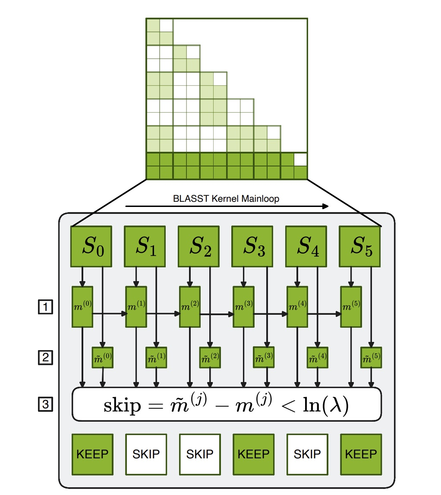
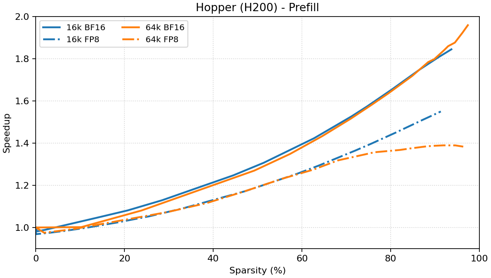
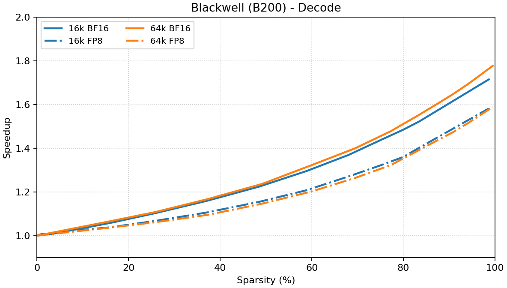

# Accelerating Long-Context Inference with Skip Softmax Attention

As context lengths grow from thousands to hundreds of thousands of tokens, attention computation becomes a major bottleneck in long-context LLM inference. TensorRT-LLM provides a [sparse attention framework](../../features/sparse-attention.md#framework-level-sparse-attention) that supports techniques like KV cache compression and sparse pattern prediction, featured in [RocketKV](https://arxiv.org/pdf/2502.14051) and [DSA](https://github.com/deepseek-ai/DeepSeek-V3.2-Exp/blob/main/DeepSeek_V3_2.pdf). However, these require framework-level support—additional token selection steps, auxiliary data structures, and kernel modifications are required, compared to the vanilla attention architecture. This complexity introduces **runtime overhead** that can offset performance gains, particularly when context lengths are not long enough to amortize the extra work.

In this blog, we introduce **Skip Softmax Attention**, a drop-in sparse attention technique that is designed to accelerate the existing pretrained models that use standard attention mechanisms like MHA, GQA, or MLA. Skip Softmax Attention based on top of the Flash Attention algorithm and only requires modifying the existing **attention kernels**. Due to this simplicity, the end-to-end performance gain is more predictable. In addition, it is only an approximation method of the attention kernel computation, making it compatible with nearly all the other features, such as FP8 attention, KV cache reuse, chunked prefill etc.

## Table of Contents
- [Accelerating Long-Context Inference with Skip Softmax Attention](#accelerating-long-context-inference-with-skip-softmax-attention)
  - [Table of Contents](#table-of-contents)
  - [Method Overview](#method-overview)
  - [Example Usage](#example-usage)
  - [Accuracy Evaluation](#accuracy-evaluation)
  - [Performance Benchmark](#performance-benchmark)
    - [Kernel Performance](#kernel-performance)
    - [End-to-end Performance](#end-to-end-performance)
  - [Reproduction](#reproduction)
    - [Accuracy evaluation (LongBench V1/V2)](#accuracy-evaluation-longbench-v1v2)
    - [End-to-end performance (TTFT/TPOT)](#end-to-end-performance-ttfttpot)
  - [Conclusion](#conclusion)

## Method Overview

The idea of Skip Softmax Attention is to compare the local maximum $\tilde{m}_i^{(j)}$ of $Q \cdot K^T$ with the running global maximum $m_i^{(j)}$, and skip the softmax (exp) and BMM2 calculation for blocks that are below a certain threshold $\lambda$:

$$\tilde{m}_i^{(j)} - m_i^{(j)} < \lambda$$

In this way, we can indirectly control the sparsity via the threshold. The threshold is set to be inversely proportional to the context length, i.e., the longer the context, the smaller the threshold is needed to achieve the same sparsity.

The method is fully dynamic, and can be applied to both the prefilling and decoding. The algorithm of Skip Softmax Attention is described in the paper [BLASST: Dynamic Blocked Attention Sparsity via Softmax Thresholding](https://arxiv.org/pdf/2512.12087). We have also published a [Developer Blog](https://developer.nvidia.com/blog/accelerating-long-context-inference-with-skip-softmax-in-nvidia-tensorrt-llm/) for explanation. Please refer to these resources for in-depth dive into the algorithm details. We will focus on the application of Skip Softmax Attention in TensorRT-LLM to accelerate long-context inference.

<p align="center">
  
</p>

## Example Usage

Enabling Skip Softmax Attention is pretty simple: we only need to configure the `SkipSoftmaxAttentionConfig` and pass it to the `LLM` API:

```python
from tensorrt_llm import LLM
from tensorrt_llm.llmapi import SkipSoftmaxAttentionConfig

sparse_attention_config = SkipSoftmaxAttentionConfig(threshold_scale_factor=1000.0)

# Additionally, the threshold_scale_factor for prefill and decode could be separately configured.
sparse_attention_config = SkipSoftmaxAttentionConfig(threshold_scale_factor={"prefill": 1000.0, "decode": 500.0})

llm = LLM(
   model="Qwen/Qwen3-30B-A3B-Instruct-2507",
   sparse_attention_config=sparse_attention_config,
   # Other LLM arguments...
)
```

The configuration could also be specified through the extra LLM API options YAML file. An example to launch an OpenAI-compatible endpoint is shown below:

```bash
cat >extra_llm_api_options.yaml <<EOF
sparse_attention_config:
    algorithm: skip_softmax
    threshold_scale_factor: 1000.0
EOF

# Additionally, the threshold_scale_factor for prefill and decode could be separately configured.
cat >extra_llm_api_options.yaml <<EOF
sparse_attention_config:
    algorithm: skip_softmax
    threshold_scale_factor:
        prefill: 1000.0
        decode: 500.0
EOF

trtllm-serve Qwen/Qwen3-30B-A3B-Instruct-2507 --extra_llm_api_options extra_llm_api_options.yaml
```

The actual threshold value equals the `threshold_scale_factor` divided by the context length. [NVIDIA Model Optimizer](https://github.com/NVIDIA/Model-Optimizer) will support the calibration to automatically determine the required value given the target sparsity. We will use `Qwen3-30B-A3B-Instruct-2507` as the example model for testing, and the calibrated threshold scale factors are listed below:

| Target Sparsity | Threshold Scale Factor (Prefill) | Threshold Scale Factor (Decode) |
|:---------------:|:----------------------------:|:----------------------------:|
| 0.0             | 0.0                          | 0.0                          |
| 0.1             | 18.76                        | 0.32                         |
| 0.2             | 44.37                        | 0.86                         |
| 0.3             | 104.97                       | 2.30                         |
| 0.4             | 248.40                       | 6.17                         |
| 0.5             | 587.18                       | 16.52                        |
| 0.6             | 1390.63                      | 44.26                        |
| 0.7             | 3293.04                      | 118.62                       |
| 0.8             | 7799.91                      | 317.99                       |
| 0.9             | 18471.56                     | 852.20                       |

## Accuracy Evaluation
We evaluate the accuracy of Skip Softmax Attention using LongBench V1 and V2. LongBench V1 is a comprehensive benchmark for medium-to-long context understanding, with average sequence length of 10k tokens. LongBench V2 is a harder benchmark that contains longer sequences, and we pick its `medium` subset and truncate the prompt length to 256k due to the limit of the native context window of the model. The average sequence length of LongBench V2 is 130k tokens.

The evaluation results (on H200) are summarized in the table below:

| Target Sparsity | LongBench V1 Overall Accuracy | LongBench V2 Overall Accuracy |
|:---------------:|:----------------------------:|:----------------------------:|
| 0.0             | 47.79                    |          35.81              |
| 0.1             | 47.92                       |       40.00                 |
| 0.2             | 47.80                        |      38.14                  |
| 0.3             | 47.84                        |       38.60                 |
| 0.4             | 47.84                       |        39.53                |
| 0.5             | 46.87                       |       37.67              |
| 0.6             | 46.45                       |       36.28                 |
| 0.7             | 45.56                     |         34.88               |
| 0.8             | 43.38                     |         36.74              |
| 0.9             | 39.84                       |        39.07            |

Note that the number of samples in LongBench V2 is very small (~200), so the result is subject to large variance. You will see non-monotonic relationship between sparsity and accuracy. We recommend to look at LongBench V1 (~5000 samples) for inspecting the accuracy loss trend.


## Performance Benchmark
Skip Softmax Attention is supported on both Hopper and Blackwell GPUs and builds on top of the SoTA performance of the TensorRT-LLM's attention kernels. Hopper prefilling is implemented in [fmha_v2](https://github.com/NVIDIA/TensorRT-LLM/tree/main/cpp/kernels/fmha_v2), Hopper decoding is implemented in [XQA](https://github.com/NVIDIA/TensorRT-LLM/tree/main/cpp/kernels/xqa), and Blackwell is implemented in [trtllm-gen](https://github.com/NVIDIA/TensorRT-LLM/tree/main/cpp/tensorrt_llm/kernels/trtllmGenKernels).

### Kernel Performance

We provide the performance data of the attention kernels under different achieved sparsity by specifying the threshold. The micro-benchmarking is performed under these configs: q_heads=64, kv_heads=4, head_dim=128, seqlen=16k/64k. Both BF16 and FP8 attention are supported. For prefilling, batch size is set to 1; for decoding, batch size is 64.

As a reference, the baseline performance data **without** Skip Softmax Attention are listed below (you can fill in the numbers).

**Prefill Baseline (we report compute performance in TFLOP/s):**

| GPU | Seqlen | Precision | TFLOP/s | Duration µs |
|:---:|:-----:|:---------:|--------:|--------------:|
| H200 | 16k | BF16 | 594.05 | 7403 |
| H200 | 16k | FP8  | 852.81 | 5157 |
| H200 | 64k | BF16 | 610.30 | 115301 |
| H200 | 64k | FP8  | 873.60 | 80550 |
| B200 | 16k | BF16 | 1029.13 | 4273 |
| B200 | 16k | FP8  | 1523.57 | 2886 |
| B200 | 64k | BF16 | 1038.26 | 67775 |
| B200 | 64k | FP8  | 1621.41  | 43399 |

**Decode Baseline (we report memory bandwidth in TB/s):**

| GPU | Seqlen | Precision | TB/s | Duration µs |
|:---:|:-----:|:---------:|-----------------:|--------------:|
| H200 | 16k | BF16 | 4.31 | 498 |
| H200 | 16k | FP8  | 4.03 | 266 |
| H200 | 64k | BF16 | 4.37 | 1962 |
| H200 | 64k | FP8  | 4.10 | 1045 |
| B200 | 16k | BF16 | 7.08 | 303 |
| B200 | 16k | FP8  | 5.46 | 196 |
| B200 | 64k | BF16 | 7.10 | 1209 |
| B200 | 64k | FP8  | 5.68 | 755 |

The following figures plot **speedup vs. achieved sparsity**, on top of the baseline performance:

<table style="width: 100%; border: 0;">
  <tr>
    <td style="width: 50%; padding: 0 8px; vertical-align: top;">
      <p align="center"><b>Hopper (H200)</b></p>
      <p align="center"><b>Prefill</b></p>
      
      <p align="center"><b>Decode</b></p>
      
    </td>
    <td style="width: 50%; padding: 0 8px; vertical-align: top;">
      <p align="center"><b>Blackwell (B200)</b></p>
      <p align="center"><b>Prefill</b></p>
      
      <p align="center"><b>Decode</b></p>
      
    </td>
  </tr>
</table>

Skip Softmax Attention could further boost the performance of FP8 attention, though the gain is less significant compared to BF16.


### End-to-end Performance

We benchmark the end-to-end performance to demonstrate the benefit of Skip Softmax Attention. Due to the quadratic complexity of the attention, the TTFT in long-context scenarios is often a severe blocker for real-world usage. Skip Softmax Attention can significantly reduce the TTFT by accelerating the prefilling kernel, and the TPOT can also be reduced if the context length is long enough. The experiemnt is conducted on a single H200 or B200 GPU, using the exact same dataset as the accuracy evaluation.

**LongBench V1, avg ISL=10k, OSL=6:**

| Target Sparsity | TTFT/ms (H200) | TPOT/ms (H200) | TTFT/ms (B200) | TPOT/ms (B200) |
|:--------------:|------------------:|-----------------:|--------------------:|--------------------:|
| 0.0            | 9419.61           | 1731.80          | 4854.55             | 928.45              |
| 0.1            | 9519.40           | 1746.73          | 4758.06             | 909.08              |
| 0.2            | 9417.36           | 1729.74          | 4794.23             | 916.64              |
| 0.3            | 9304.48           | 1711.27          | 4770.26             | 913.51              |
| 0.4            | 9139.85           | 1684.78          | 4672.09             | 896.25              |
| 0.5            | 8847.43           | 1633.08          | 4548.07             | 873.80              |
| 0.6            | 8437.45           | 1560.64          | 4459.08             | 858.60              |
| 0.7            | 8134.72           | 1508.60          | 4385.12             | 846.64              |
| 0.8            | 8107.73           | 1507.82          | 4348.80             | 831.88              |
| 0.9            | 8130.39           | 1516.16          | 4150.44             | 798.93              |

LongBench V1 results are reported with concurrency 64. Due to the nature of in-flight batching, the decoding requests might be piggybacked with the prefilling requests, so the TPOT is relatively high.

**LongBench V2, avg ISL=130k, OSL=200:**

| Target Sparsity | TTFT/ms (H200) | TPOT/ms (H200) | TTFT/ms (B200) | TPOT/ms (B200) |
|:--------------:|------------------:|-----------------:|--------------------:|--------------------:|
| 0.0            | 16486.70          | 9.34             | 6990.59             | 6.30                |
| 0.1            | 16487.54          | 8.61             | 7024.50             | 6.30                |
| 0.2            | 16169.69          | 8.61             | 6687.21             | 6.34                |
| 0.3            | 15750.17          | 8.46             | 6616.12             | 6.33                |
| 0.4            | 15288.68          | 8.61             | 6432.32             | 6.27                |
| 0.5            | 14554.04          | 8.45             | 6193.92             | 6.29                |
| 0.6            | 14323.08          | 8.44             | 5966.53             | 6.32                |
| 0.7            | 13871.32          | 8.42             | 5769.19             | 6.31                |
| 0.8            | 12922.99          | 8.58             | 5605.66             | 6.23                |
| 0.9            | 12507.95          | 8.58             | 5276.67             | 6.29                |

Due to the extremely long context length, we only run LongBench V2 with concurrency 1. In this scenario, the prefilling/decoding is better separated and we can observe how is TTFT/TPOT affected by the sparsity. Note that the speedup for decoding is less pronounced under small batch size. Small batch size and small number of heads (with TP) are more close to real-world usage for long-context serving due to the limit of SLO, and we are actively optimizing the decoding performance under such scenarios.

## Reproduction

We provide the commands to reproduce the results in the previous context, as a showcase of how to evaluate the accuracy and benchmark the performance for Skip Softmax Attention.

### Accuracy evaluation (LongBench V1/V2)

Both LongBench V1 and V2 are integrated into the TensorRT-LLM accuracy test suite, `trtllm-eval`. Here are the example scripts to run the accuracy evaluation:

```bash
# Dump the extra LLM API options YAML file.
cat >extra_llm_api_options.yaml <<EOF
kv_cache_config:
    free_gpu_memory_fraction: 0.8
sparse_attention_config:
    algorithm: skip_softmax
    threshold_scale_factor:
        prefill: ${thr_prefill}
        decode: ${thr_decode}
EOF
```

```bash
# Evaluate LongBench V1.
trtllm-eval --model Qwen/Qwen3-30B-A3B-Instruct-2507 \
 --max_batch_size 64 --max_num_tokens 100000 \
 --extra_llm_api_options extra_llm_api_options.yaml \
 longbench_v1 \
 --output_dir ${OUTPUT_DIR}  # Dump dataset for perf benching
```

```bash
# Evaluate LongBench V2.
trtllm-eval --model Qwen/Qwen3-30B-A3B-Instruct-2507 \
--max_batch_size 1 --max_num_tokens 262144 \
--extra_llm_api_options extra_llm_api_options.yaml \
longbench_v2 \
--length medium \  # Medium subset of LongBench V2
--max_input_length 256000 \  # Truncate the prompt length to 256k
--output_dir ${OUTPUT_DIR}  # Dump dataset for perf benching
```

### End-to-end performance (TTFT/TPOT)
The option `--output_dir` in `trtllm-eval` will dump the dataset in the format required by `trtllm-bench` as `dumped_ids.json`. After getting the data, we can perform end-to-end benchmarking:

```bash
# Benchmark on LongBench V1.
trtllm-bench --model Qwen/Qwen3-30B-A3B-Instruct-2507 \
throughput --dataset ${OUTPUT_DIR}/dumped_ids.json \
--concurrency 64 --max_batch_size 64 --max_num_tokens 100000 \
--extra_llm_api_options extra_llm_api_options.yaml \
--warmup 0 --streaming \
--report_json ${OUTPUT_DIR}/report.json
```

```bash
# Benchmark on LongBench V2.
trtllm-bench --model Qwen/Qwen3-30B-A3B-Instruct-2507 \
throughput --dataset ${OUTPUT_DIR}/dumped_ids.json \
--concurrency 1 --max_batch_size 1 --max_num_tokens 262144 \
--extra_llm_api_options extra_llm_api_options.yaml \
--warmup 0 --streaming \
--report_json ${OUTPUT_DIR}/report.json
```


## Conclusion
Skip Softmax Attention is a kernel-based solution for accelerating the attention. Due to the design that BMM1 ($Q \cdot K^T$) in the attention kernel is not skipped, the performance gain is capped to 1.8x at kernel level. Nevertheless, it excels at achieving high sparsity with minimal accuracy degradation, and is especially effective in the medium-to-long context scenarios where previous methods like MInference cannot well handle, because the introduced runtime overhead may not pay off the speedup of the attention kernel. The drop-in nature of Skip Softmax Attention makes it a flexible, easy-to-use method for accelerating long-context inference. The Skip Softmax Attention kernels will also be available in FlashInfer for adoptions by the open-source community.
