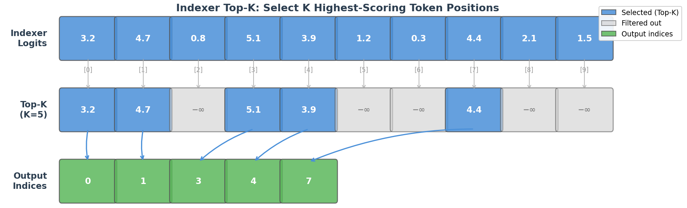
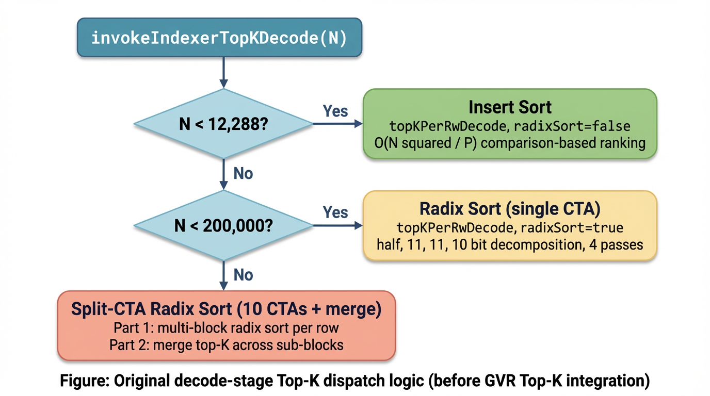
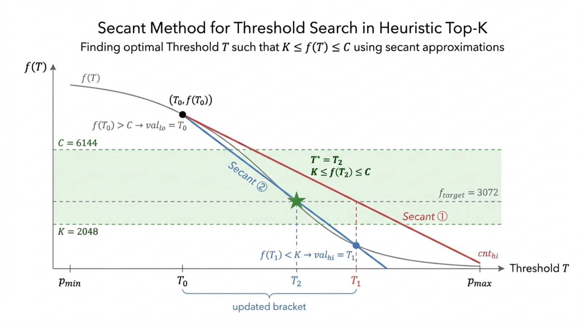
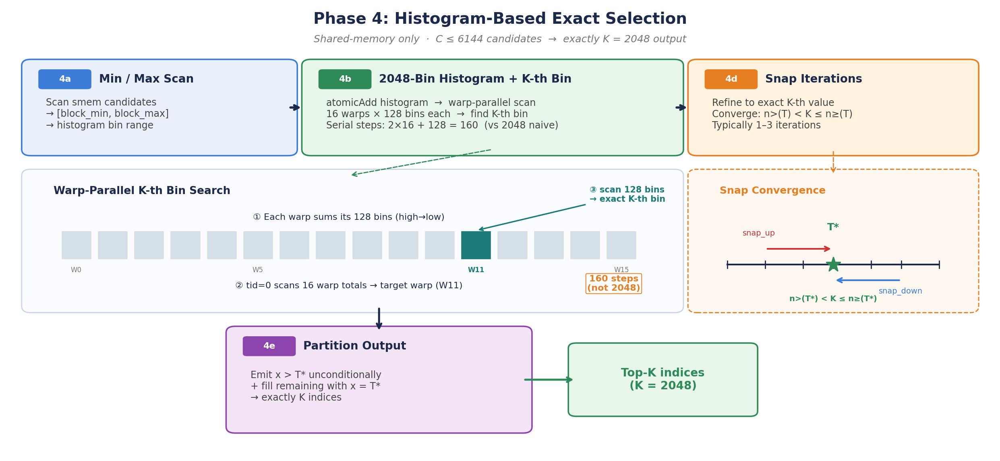
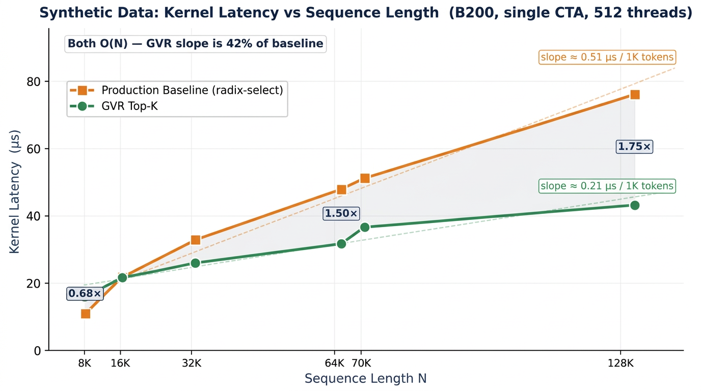
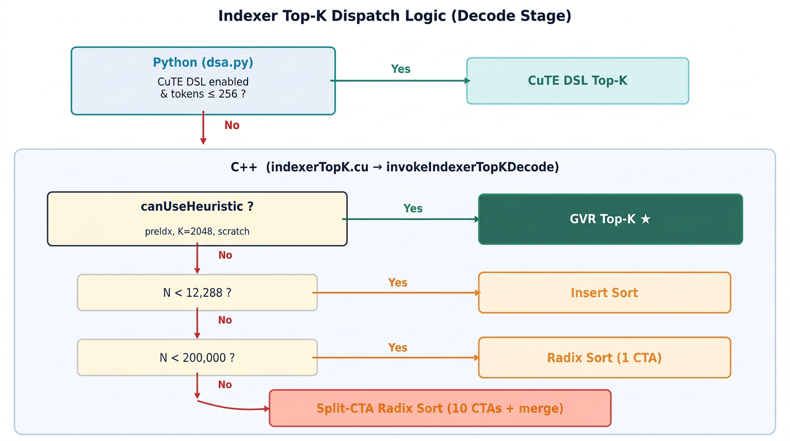

# Temporal Correlation Meets Sparse Attention: A Heuristic Top-K Kernel for Blackwell

By NVIDIA TensorRT LLM team

## Table of Contents

- [Introduction](#introduction)
- [Background: Indexer Top-K in DeepSeek Sparse Attention](#background-indexer-top-k-in-deepseek-sparse-attention)
  - [Lightning Indexer and Top-K Selection](#lightning-indexer-and-top-k-selection)
  - [Existing Radix-Select-Based Top-K Implementation](#existing-radix-select-based-top-k-implementation)
  - [Complexity of Classical Top-K Approaches](#complexity-of-classical-top-k-approaches)
- [The Long-Sequence Challenge](#the-long-sequence-challenge)
  - [Agentic AI and Growing Context Lengths](#agentic-ai-and-growing-context-lengths)
  - [Why Indexer Top-K Becomes a Bottleneck for Long Sequences](#why-indexer-top-k-becomes-a-bottleneck-for-long-sequences)
- [Temporal Correlation in LLM Sparse Attention](#temporal-correlation-in-llm-sparse-attention)
  - [Empirical Observation](#empirical-observation)
  - [Theoretical Basis: RoPE Frequency Structure](#theoretical-basis-rope-frequency-structure)
  - [Pre-Computed Candidate Indices](#pre-computed-candidate-indices)
- [Heuristic-Guided Top-K Algorithm](#heuristic-guided-top-k-algorithm)
  - [Core Idea](#core-idea)
  - [Algorithm Phases](#algorithm-phases)
    - [Phase 1: Pre-Indexed Statistics](#phase-1-pre-indexed-statistics)
    - [Phase 2: Secant-Method Threshold Search](#phase-2-secant-method-threshold-search)
    - [Phase 3: Ballot-Free Candidate Collection](#phase-3-ballot-free-candidate-collection)
    - [Phase 4: Histogram-Based Exact Selection](#phase-4-histogram-based-exact-selection)
  - [Complexity Analysis](#complexity-analysis)
- [GPU Kernel Implementation on Blackwell](#gpu-kernel-implementation-on-blackwell)
  - [Single-CTA Design](#single-cta-design)
  - [Key Optimizations](#key-optimizations)
  - [Shared Memory Layout](#shared-memory-layout)
  - [Memory Footprint Comparison](#memory-footprint-comparison)
- [Evaluation](#evaluation)
  - [Experimental Setup](#experimental-setup)
  - [Correctness Verification](#correctness-verification)
  - [Single-Operator Performance](#single-operator-performance)
    - [Synthetic Data](#synthetic-data)
    - [Real Decoding Data](#real-decoding-data)
  - [Integration and Activation](#integration-and-activation)
  - [End-to-End Accuracy](#end-to-end-accuracy)
  - [End-to-End Throughput](#end-to-end-throughput)
- [Future Work](#future-work)
- [Acknowledgement](#acknowledgement)

## Introduction

The rise of agentic AI workloads — where LLMs autonomously browse, plan, write code, and orchestrate multi-step tool calls — has driven context lengths from thousands to hundreds of thousands of tokens. In these scenarios, every component in the inference pipeline that scales with sequence length becomes a potential bottleneck. DeepSeek Sparse Attention (DSA), introduced with [DeepSeek-V3.2](https://api-docs.deepseek.com/news/news251201), mitigates the quadratic cost of attention by selecting only the most important key-value entries via a lightweight **lightning indexer** and **Top-K selector**. While the sparse MLA kernel and indexer MQA kernel have been heavily optimized (see [Tech Blog 15](blog15_Optimizing_DeepSeek_V32_on_NVIDIA_Blackwell_GPUs.md)), the Top-K selection itself — choosing the top-2048 entries from potentially tens or hundreds of thousands of indexer scores — becomes an increasingly significant fraction of the DSA module latency as sequences grow longer.

This blog introduces a **temporally-correlated, heuristic-guided Top-K algorithm** that exploits a fundamental property of LLM inference: the set of important key-value tokens changes slowly between consecutive decoding steps. By leveraging the previous step's Top-K results as a prediction signal, the algorithm can estimate a tight threshold in as few as 1–2 global passes over the data, then collect and refine candidates using ballot-free shared-memory techniques. On real DeepSeek-V3.2 decoding workloads running on NVIDIA Blackwell GPUs, this data-aware approach achieves an average **1.81×** single-operator speedup over the production radix-select kernel (up to **2.36×** per layer per step), with no loss in output accuracy.

We present the theoretical foundation rooted in RoPE frequency structure, the four-phase algorithm with per-phase complexity analysis, correctness verification against `torch.topk`, single-operator and end-to-end benchmarks, and the integration path into TensorRT-LLM.

## Background: Indexer Top-K in DeepSeek Sparse Attention

### Lightning Indexer and Top-K Selection

As described in [Tech Blog 15](blog15_Optimizing_DeepSeek_V32_on_NVIDIA_Blackwell_GPUs.md), DSA computes index scores via a lightweight MQA mechanism:

$$I_{t} = \sum_{j=1}^{h}W_j^I \cdot \text{ReLU}(Q_{t, j}^I (K_t^I)^T)$$

The index score tensor $I_t \in \mathbb{R}^N$ (where $N$ is the current sequence length) quantifies the importance of each past key-value token for the current query token. A Top-K operation then selects the $K = 2048$ highest-scoring positions, and only these are used for the subsequent sparse MLA computation.

<div align="center">
<figure>
  
</figure>
</div>
<p align="center"><sub><em>Figure 1. Indexer Top-K selection (illustrated with K=5, N=10). The indexer produces a score for each of the N past tokens. The Top-K operator selects the K positions with the highest scores and outputs their indices. In DeepSeek Sparse Attention, K=2048 and N can range from 8K to 128K+.</em></sub></p>

The Top-K step is critical to the DSA pipeline: it must be both fast (to avoid becoming the latency bottleneck) and correct (to preserve model accuracy). The challenge intensifies with longer sequences — as $N$ grows from 8K to 64K or beyond, the Top-K kernel must process proportionally more data while the output size ($K = 2048$) remains fixed.

### Existing Radix-Select-Based Top-K Implementation

The production TensorRT-LLM implementation (`invokeIndexerTopKDecode` in `indexerTopK.cu`) dispatches to different kernel variants based on sequence length:

<div align="center">
<figure>
  
</figure>
</div>
<p align="center"><sub><em>Figure 1b. Original decode-stage Top-K dispatch in `invokeIndexerTopKDecode` (before heuristic Top-K). The kernel selects insert sort for short sequences, radix sort for medium sequences, and a multi-CTA split approach for very long sequences.</em></sub></p>

The core algorithm (`topKPerRowJob`) uses a **radix-select** approach that is data-distribution-agnostic. It partitions the 32-bit floating-point representation into digit groups and iteratively narrows the candidate set:

1. **Histogram**: Count elements per digit bucket using shared-memory atomic operations
2. **Prefix Sum**: Compute cumulative counts via `cub::BlockScan`
3. **Find Threshold**: Identify which bucket contains the $K$-th element
4. **Filter**: Retain candidates in the threshold bucket; emit elements in higher buckets directly

The implementation follows a **half → 11 → 11 → 10** bit decomposition (4 iterations), with an optimization that exits early and switches to CUB radix sort or comparison-based ranking when the candidate set drops below 2048 elements. For very long sequences ($N > 200$K), the split-CTA path distributes work across 10 CTAs and merges results.

### Complexity of Classical Top-K Approaches

<div align="center">

| Algorithm | Time Complexity | Global Memory Passes | GPU Suitability |
|:-----------:|:----------------:|:---------------------:|:-----------------:|
| `torch.topk` (sorting-based) | $O(N \log N)$ | Multiple | General-purpose, high constant |
| Radix Select (TRT-LLM production) | $O(R \cdot N/P)$ | $R$ passes ($R \leq 4$) | Good, distribution-agnostic |
| Heap/Priority Queue | $O(N \log K)$ | 1 pass | Poor GPU parallelism for large $K$ |
| **Heuristic-Guided (this work)** | $O((I+1) \cdot N/P)$ | $I+1$ passes (I ≈ 1–2) | Optimal with good prediction |

</div>

Here $N$ is the sequence length, $K = 2048$, $P$ is the thread count, and $R$ or $I$ denotes the number of iterative passes. The key distinction of the heuristic approach is that the effective number of global-memory passes $I$ depends on the quality of the initial threshold estimate — which, as we will show, is consistently high in LLM decoding workloads.

## The Long-Sequence Challenge

### Agentic AI and Growing Context Lengths

Modern agentic AI systems routinely process contexts of 32K–128K tokens or more:

- **Multi-turn tool use**: An agent accumulating conversation history, tool outputs, and intermediate reasoning across dozens of interaction rounds
- **Long-document reasoning**: Summarization, QA, and analysis over extensive codebases, legal documents, or scientific papers
- **Code generation**: Large repository contexts with cross-file dependencies

These workloads stress every component of the inference pipeline that scales with $N$. While the sparse MLA kernel benefits from token sparsity (computing attention only over $K = 2048$ tokens regardless of $N$), and the indexer MQA kernel has been optimized with FP8 arithmetic and Blackwell-specific instructions, the Top-K selector must still scan all $N$ indexer scores every decoding step.

### Why Indexer Top-K Becomes a Bottleneck for Long Sequences

The three DSA decode-step components have fundamentally different scaling characteristics. Since all three are memory-bound during decode, the roofline cost of each is proportional to its total memory traffic:

<div align="center">

| Component | Scaling | Total Memory Traffic | Trend as $N$ Grows |
|:-----------:|:---------:|:---------------------:|:-------------------:|
| **Indexer MQA** | $O(N)$ | $N \cdot d_i \cdot 2B$ | Linear growth |
| **Top-K (radix-select)** | $O(R \cdot N)$ | $R \cdot N \cdot 4B$ | Linear growth ($R$ passes) |
| **Sparse MLA** | $O(K)$ | $K \cdot d \cdot 2B$ | **Constant** ($K$ fixed) |

</div>

<sub><em>N: sequence length. K = 2048: fixed Top-K count. R ≈ 3: radix-select passes. d<sub>i</sub> = 128: indexer head dimension. d = 192: MLA head dimension (128 non-PE + 64 PE).</em></sub>

The Top-K memory traffic R·N·4B grows linearly with $N$ while sparse MLA remains constant at K·d·2B. This means the **Top-K fraction of DSA latency increases monotonically** with sequence length — from a minor component at short sequences to a dominant bottleneck at long sequences. The production radix-select kernel already achieves 7.4× over `torch.topk` (see [Tech Blog 15](blog15_Optimizing_DeepSeek_V32_on_NVIDIA_Blackwell_GPUs.md)), yet two factors limit its efficiency beyond the raw $O(R \cdot N)$ traffic:

- **Multi-pass data re-reads**: each of the $R \approx 3$ radix-select steps performs two full scans of all $N$ elements (histogram build + filter/collect), totaling ~6 $N$-element scans per kernel invocation.
- **Shared-memory atomic serialization**: the histogram phase uses `atomicAdd` on shared-memory bin counters (2048 bins, hot-bin contention), and the collect phase funnels all qualifying elements through a single `atomicAdd(&counter, 1)` — serializing threads that compete on the same address and reducing effective SIMT utilization well below the memory bandwidth ceiling.

This motivates the search for a Top-K algorithm that can reduce the number of global-memory passes by exploiting properties specific to LLM decoding.

## Temporal Correlation in LLM Sparse Attention

### Empirical Observation

A key empirical observation is that the Top-K index sets exhibit **strong temporal correlation** during LLM decoding: the set of important tokens at step $t$ overlaps significantly with the set at step $t-1$. We measured this overlap (hit ratio) on real DeepSeek-V3.2 decode-stage indexer logits from SWE-Bench-64K evaluation:

<div align="center">
<figure>
  
</figure>
</div>
<p align="center"><sub><em>Figure 2. Top-K overlap (hit ratio) between consecutive decoding steps across different layers in DeepSeek-V3.2, measured on SWE-Bench-64K (2025 decode steps). Layers 20–60 exhibit 35–50% average overlap (max ~60%), while Layers 0 and 1 show near-zero overlap (~1–2%), reflecting distinct indexer score dynamics in early vs. deeper layers.</em></sub></p>

The following diagram illustrates the intuition: across consecutive decode steps, the majority of selected Top-K tokens remain the same (dark blue), with only a fraction changing (orange). The underlying mechanism is the Toeplitz structure of the attention score matrix — the score depends only on relative position $\Delta = n - m$, so advancing by one step causes only a smooth shift in the score landscape.

<div align="center">
<figure>
  
</figure>
</div>
<p align="center"><sub><em>Figure 3. Top: Temporal correlation with offset+1 shift — when the query advances by one position, all relative positions $\Delta$ shift by +1, causing ~60% of Top-K tokens to persist (dark navy, shifted right by one cell) while ~40% change (orange). The specific tokens entering/leaving differ between step pairs. Bottom-left: Toeplitz structure of the attention score matrix. Bottom-right: Normalized $f(\Delta)$ comparison — standard RoPE (blue dashed) shows rapid peak decay, while YaRN (dark solid) maintains significant peaks at large $\Delta$, enabling Top-K selection across both nearby and remote positions.</em></sub></p>

This temporal correlation is not coincidental — it has a principled theoretical basis in the structure of the indexer's attention mechanism.

### Theoretical Basis: Toeplitz Structure and RoPE Frequency Analysis

The DSA lightning indexer computes token importance scores via an MQA dot product between [RoPE](https://arxiv.org/abs/2104.09864)-encoded query and key tensors. In RoPE, each query-key pair at positions $(n, m)$ is multiplied by a block-diagonal rotation matrix $R_{n-m}$ whose entries are cosines and sines of position-dependent angles. For the indexer's RoPE-only dimensions ($d_{\text{rope}} = 64$ in DeepSeek-V3.2), the positional contribution to the attention score reduces to:

$$f(\Delta) = 2 \sum_{i=0}^{d_{\text{rope}}/2 - 1} \cos(\Delta \cdot \theta_i), \quad \Delta = n - m, \quad \theta_i = \beta^{-2i/d_{\text{rope}}}$$

where $\beta = 10000$ is the RoPE base frequency. This expression is the inner product of all-ones vectors transformed by $R_\Delta$, representing the pure positional-encoding contribution independent of data content.

**Toeplitz property.** Since $f$ depends only on the relative position $\Delta = n - m$, the positional score matrix $P \in \mathbb{R}^{S \times S}$ is a [Toeplitz matrix](https://en.wikipedia.org/wiki/Toeplitz_matrix) — constant along each diagonal. This reduces the problem of understanding which token pairs are positionally favored from a 2D matrix analysis to a **1D function analysis** on $f(\Delta)$.

**Multi-scale cosine superposition.** $f(\Delta)$ is a superposition of $d_{\text{rope}}/2 = 32$ cosines with periods spanning $2\pi/\theta_0 \approx 6.3$ to $2\pi/\theta_{31} \approx 58{,}600$ — a 10,000:1 frequency ratio. The global maximum is at $\Delta = 0$ (self-position); secondary peaks arise at positions where cosine waves constructively interfere. Because $f$ is smooth, advancing the query by one position ($\Delta \to \Delta + 1$) causes only a small perturbation to the score landscape — directly explaining why Top-K indices change slowly between consecutive decode steps.

**YaRN extension.** DeepSeek-V3.2 extends RoPE with [YaRN](https://arxiv.org/abs/2309.00071) (scaling factor $s = 40$), which interpolates low-frequency components while preserving high-frequency ones. The effect on $f(\Delta)$ is that **peaks at large relative positions remain significant** rather than decaying monotonically (see Figure 3, bottom-right). This produces a more spatially uniform distribution of important tokens — favoring the heuristic Top-K approach, since the Top-K set spans both nearby and distant positions, providing a richer prediction signal for the next step.

### Pre-Computed Candidate Indices

The frequency structure of RoPE enables a static pre-computation. Given the model's RoPE parameters (dimension $d = 64$, YaRN scaling with `scaling_factor = 40`), we can compute the idealized score function $f(\Delta)$ for all possible relative positions and find the $K$ positions with the largest scores:

$$\mathcal{P}_{\text{static}} = \text{argtopk}_{\Delta \geq 0} \; f(\Delta)$$

An earlier approach considered using **peak indices** of $f(\Delta)$ (positions where $f'(\Delta) = 0$ and $f''(\Delta) < 0$) as candidates. However, analysis showed that peak indices achieve only ~17–35% prediction success rate — the ratio of significant peaks to total tokens is low (~13%), and many true Top-K indices fall between peaks. The **TopK-based prediction** (using the Top-K of $f(\Delta)$ directly) achieves 45–100% success rate, a several-fold improvement.

This pre-computed index set captures the **structural prior** — the positions that RoPE frequency structure inherently favors. During inference, the actual Top-K indices for a query at position $n$ are the positions $m$ such that $n - m \in \mathcal{P}_{\text{static}}$, modulated by the data-dependent content of the actual Q/K tensors and the indexer weight $W^I$.

In practice, we use the **previous step's Top-K result** as the prediction signal (`preIdx`), which captures both the structural RoPE prior and the data-dependent content correlation. For the majority of layers (L20–L60), this achieves prediction accuracy α ≈ 0.35–0.50 (35–50% of the previous Top-K indices remain in the current Top-K set), which is sufficient for the heuristic algorithm to converge in 1–2 interpolation iterations. Notably, Layers 0 and 1 exhibit near-zero temporal correlation ($\alpha \approx 0.01$), causing the heuristic kernel to fall back on more interpolation iterations for those layers — consistent with their lower speedup ratios in the benchmarks.

## Heuristic-Guided Top-K Algorithm

### Core Idea

Given input vector $\mathbf{x} = (x_0, x_1, \ldots, x_{N-1}) \in \mathbb{R}^N$ and a predicted index set $\mathcal{P} = \{p_0, p_1, \ldots, p_{M-1}\} \subset \{0, \ldots, N-1\}$ (where $M = 2048$), find index set $\mathcal{S}^\ast$ with $|\mathcal{S}^\ast| = K$ containing the indices of the $K$ largest values in $\mathbf{x}$.

**Core theorem**: If threshold $T$ satisfies $K \leq |\{i : x_i \geq T\}| \leq C$ (where $C$ = MAX\_CANDIDATES = 6144), then the candidate set $\mathcal{C} = \{i : x_i \geq T\}$ contains all Top-K elements, i.e., $\mathcal{S}^\ast \subseteq \mathcal{C}$.

The algorithm uses the predicted indices $\mathcal{P}$ to estimate a threshold $T$ that is close to the true $K$-th largest value $x_{(K)}$. With a good estimate, only 1–2 global passes over the data are needed (versus 3–4 in radix select), followed by in-shared-memory refinement on the small candidate set.

### Algorithm Phases

<div align="center">
<figure>
  
</figure>
</div>
<p align="center"><sub><em>Figure 4. Heuristic-guided Top-K algorithm flow. Four phases execute sequentially within a single CTA. Complexity annotations show per-phase cost; I and S denote the number of threshold-search and snap iterations, respectively.</em></sub></p>

#### Phase 1: Pre-Indexed Statistics

Using the predicted index set $\mathcal{P}$, compute the min, max, and mean of the corresponding input values:

$$T_0 = \bar{x}_{\mathcal{P}} = \frac{1}{|\mathcal{P}|} \sum_{i \in \mathcal{P}} x_i$$

With prediction accuracy $\alpha \approx 0.5$, $T_0$ approximates:

$$T_0 \approx \alpha \cdot \mathbb{E}[x_i \mid i \in \mathcal{S}^\ast] + (1 - \alpha) \cdot \mathbb{E}[x_i]$$

This is significantly closer to $x_{(K)}$ than the unconditional mean, enabling fast Phase 2 convergence. The phase uses scattered `__ldg` reads and `redux.sync` warp reductions (a single instruction on sm\_80+ replacing 5 shuffle operations).

**Cost**: $O(M/P)$ — reading $M = 2048$ scattered global memory values with $P = 512$ threads.

#### Phase 2: Secant-Method Threshold Search

<div align="center">
<figure>
  
</figure>
</div>
<p align="center"><sub><em>Figure 5. Phase 2 interpolation-based threshold search. Starting from T₀ = pmean with bracket [pmin, pmax], the algorithm evaluates f(T₀): since f(T₀) > C, val_lo is set to T₀. Secant ① connects (val_lo, cnt_lo) and (val_hi, cnt_hi), crossing f_target to determine T₁. Since f(T₁) < K, val_hi is updated to T₁, narrowing the bracket. Secant ② connects the updated anchors and crosses f_target to produce T₂, which lands in the target zone [K, C] — convergence achieved. First-iteration damping (f ≤ 0.50) prevents overshoot. Note: the actual f(T) = count(input ≥ T) is a monotonically non-increasing step function; the smooth curve is shown here for illustration only.</em></sub></p>

Define counting function $f(T) = |\{i : x_i \geq T\}|$, a monotonically non-increasing step function. The goal is to find $T^\ast$ such that $K \leq f(T^\ast) \leq C$.

Each iteration computes an exact global count via `blockCountGE` — a bandwidth-bound loop using `float4` vectorized `__ldg` loads, pure register comparison and accumulation, and warp-level reduction. Critically, `blockCountGE` caches each thread's partial count into `smem->per_thread_counts[tid]` before the warp reduction — this cache is reused by Phase 3 to eliminate a redundant $N$-scan (see below).

The threshold update uses secant interpolation:

$$T_{\text{new}} = T_{\text{lo}} + \frac{f(T_{\text{lo}}) - f_{\text{target}}}{f(T_{\text{lo}}) - f(T_{\text{hi}})} \cdot (T_{\text{hi}} - T_{\text{lo}})$$

with first-iteration damping ($\leq 0.5$) to prevent overshoot, and bisection fallback at float precision limits. For smooth CDFs, secant interpolation achieves superlinear convergence (order $\approx 1.618$).

When Phase 2 converges cleanly (`done=1`), a **safety-net guard** skips the subsequent verification `blockCountGE` call that would otherwise be redundant, saving ~4 µs per kernel invocation.

**Cost**: $O(I \cdot N/P)$ where $I$ is the number of iterations. On real decoding data with good prediction: I ≈ 1–2. On synthetic data with poor prediction: I ≈ 4–6.

#### Phase 3: Ballot-Free Candidate Collection

Once a valid threshold is found, all elements $\geq T$ are collected into shared memory. This phase uses a **ballot-free** design with a key optimization: **Phase 3 sub-pass 1 (count) is eliminated** by reusing the per-thread counts cached by Phase 2's last `blockCountGE` call. Since the threshold has not changed between Phase 2's final count and Phase 3, the cached `smem->per_thread_counts[tid]` values are directly valid — saving an entire $N$-element rescan (~4 µs).

- **Write-offset computation**: Read per-thread counts from cache → warp prefix sum → cross-warp prefix sum → pre-computed write offsets.
- **Sub-pass 2 (Write)**: Each thread writes to its pre-allocated shared-memory range. No `__ballot_sync`, no `__shfl_sync`, no `atomicAdd`.

The ballot-free design is critical: `__ballot_sync` acts as a compiler barrier that serializes L2 load pipelining. The original per-element ballot approach costs ~30,000 cycles (5x the `blockCountGE` cost); the ballot-free approach costs ~16,000 cycles.

**Cost**: $O(N/P)$ — one sub-pass scanning the full input (the count sub-pass is eliminated via caching).

#### Phase 4: Histogram-Based Exact Selection

<div align="center">
<figure>
  
</figure>
</div>
<p align="center"><sub><em>Figure 6. Phase 4 detail: 4a scans candidates for min/max range; 4b builds a 2048-bin histogram with warp-parallel K-th bin search (16 warps × 128 bins, 160 serial steps); 4d refines via snap iterations converging when n>(T) < K ≤ n≥(T); 4e partitions the final output.</em></sub></p>

If the candidate count does not exactly equal $K$, a shared-memory refinement selects exactly $K$ elements:

1. **Min/Max scan** over candidates for accurate histogram bins
2. **2048-bin histogram** via `atomicAdd` over the candidate set, followed by a **warp-parallel K-th bin search**: each warp sums its `NUM_BINS / NUM_WARPS` bins (high-to-low), then `tid=0` scans `NUM_WARPS` warp-totals to find the target warp, and finally the target warp's `lane=0` locates the exact bin. This reduces serial scan steps from 2048 to `2×NUM_WARPS + NUM_BINS/NUM_WARPS = 160` (12.8× fewer).
3. **Snap iterations**: Refine the threshold to the exact $K$-th largest value by stepping through distinct data values. Each fused snap iteration computes `(count_ge, count_gt, snap_up, snap_down)` in one shared-memory scan. Convergence: when $n_{>}(T) < K \leq n_{\geq}(T)$. With 2048 bins, only **1–3** snap iterations are needed per kernel invocation.
4. **Partition**: Emit elements $> T^\ast$ unconditionally, fill remaining slots with elements $= T^\ast$.

**Cost**: $O(S \cdot C/P)$ where S ≈ 1–3 snap iterations, $C \leq 6144$ candidates. This is purely shared-memory work — no global memory access.

### Complexity Analysis

<div align="center">

| Phase | Time Complexity | Memory Access | Space |
|:-------:|:----------------:|:---------------:|:-------:|
| Phase 1 (PreIdx Stats) | $O(M/P)$ | $M$ scattered global reads | $O(1)$ registers |
| Phase 2 (Threshold Search) | $O(I \cdot N/P)$ | $I \times N$ sequential reads (L2) | $O(1)$ registers |
| Phase 3 (Candidate Collect) | $O(N/P)$ | $N$ sequential reads (L2) | $O(C)$ shared memory |
| Phase 4 (Exact Selection) | $O(S \cdot C/P)$ | Shared memory only | $O(B)$ shared memory |
| **Total** | $O((I+1) \cdot N/P + S \cdot C/P)$ | $(I+1) \times N + M$ global | ~60 KB shared |

</div>

For real decoding data ($I \approx 2$, $S \approx 2$, $P = 512$, $B = 2048$, $C \leq 6144$): approximately $3N/P + 2C/P$ memory accesses. The Phase 3 count-cache optimization eliminates one full $N$-scan (the count sub-pass), reducing the total from $(I+2)$ to $(I+1)$ global-memory passes. Compared to the radix-select baseline which requires $R \cdot N/P$ accesses with R ≈ 3–4 passes (each pass includes histogram + prefix sum + filter), the heuristic approach has fewer global memory accesses and significantly less shared-memory synchronization overhead.

## GPU Kernel Implementation on Blackwell

### Single-CTA Design

The heuristic Top-K kernel is implemented as a **single-CTA (Cooperative Thread Array)** kernel with 512 threads per block. This design enables:

- All inter-phase communication via shared memory (no global synchronization)
- Efficient reuse of L2 cache across phases (the input data stays warm)
- Simple integration as a drop-in replacement for the existing per-row Top-K kernel
- CUDA Graph compatibility (fixed grid dimensions per batch)

Each CTA processes one row of the batch (one query token's indexer scores). The multi-row kernel `heuristicTopKMultiRowKernel` is a thin wrapper that computes per-row parameters (sequence length, pointer offsets) and delegates to the `heuristicTopKJob` device function.

### Key Optimizations

The kernel incorporates multiple optimizations targeting specific bottlenecks identified through systematic profiling:

<div align="center">

| Optimization | Description |
|:-------------:|:-------------:|
| `__ldg` + `redux.sync` | Read-only texture cache loads + single-instruction warp reduction (sm\_80+) |
| Ballot-free Phase 3 | Eliminates `__ballot_sync` compiler barriers that serialize L2 load pipelining |
| Safety-net guard | Skips redundant `blockCountGE` when Phase 2 converges cleanly |
| 2048-bin histogram + warp-parallel scan | Warp-parallel K-th bin search reduces serial scan steps; fewer snap iterations |
| Phase 3 count-cache | Caches per-thread counts from Phase 2's `blockCountGE`; eliminates Phase 3's redundant $N$-scan |

</div>

### Shared Memory Layout

The kernel uses approximately 60 KB of shared memory:

```text
KernelSmem {
    float  keys[MAX_CANDIDATES];       // 6144 × 4B = 24,576 B
    int    vals[MAX_CANDIDATES];       // 6144 × 4B = 24,576 B
    int    warp_counts[NUM_WARPS];     //   16 × 4B =     64 B
    int    histogram[NUM_BINS];        // 2048 × 4B =  8,192 B
    int    per_thread_counts[BLOCK_SIZE]; // 512 × 4B = 2,048 B  ← P3 count cache
    // + scalar temporaries             //            ~    40 B
}                                      // Total: ~60 KB
```

On Blackwell (sm\_100), the kernel opts in to extended shared memory (>48 KB) via `cudaFuncSetAttribute`. The `MAX_CANDIDATES = 6144` buffer size provides a 3x margin over $K = 2048$, ensuring the safety-net threshold can always find a valid range without overflow. The `per_thread_counts` array enables the Phase 3 count-cache optimization (eliminating a redundant $N$-scan), and the 2048-bin histogram enables fewer snap iterations at the cost of additional shared memory.

### Memory Footprint Comparison

<div align="center">

| Metric | Radix Sort | Heuristic-Guided |
|:--------:|:----------:|:-----------------:|
| **SMEM per CTA** | ~28 KB (union-based, time-multiplexed) | ~60 KB (flat struct, persistent candidates) |
| **Extended SMEM opt-in** | No | Yes (>48 KB) |
| **Additional HBM** | 0 | Scratch + prev\_topk (see below) |

</div>

The heuristic kernel uses ~2× the SMEM of radix-select because candidates collected in Phase 3 must remain accessible through Phase 4 (no union reuse possible). On Blackwell (sm\_100, 228 KB shared memory per SM), this still allows 3 CTAs per SM — sufficient occupancy for typical batch sizes.

The heuristic path requires two additional persistently pre-allocated HBM buffers (CUDA Graph compatible):

- **`heuristic_scratch_values`** (`B × K × 4` bytes): A write-only dummy buffer for the kernel's output-values path. The DSA pipeline only consumes the output indices, but the kernel unconditionally writes values alongside indices to preserve optimal SASS code generation quality. This buffer is never read downstream.
- **`heuristic_prev_topk`** (`L × B × K × 4` bytes, where L = number of local DSA layers): Stores the previous decode step's Top-K indices per layer as preIdx for the next step. A dedicated buffer is required because (1) `topk_indices_buffer` is overwritten in-place each step (read-after-write conflict), (2) each layer needs independent temporal state, and (3) CUDA Graph replay requires stable-address feedback buffers.

## Evaluation

### Experimental Setup

**Platform**: NVIDIA B200 GPU (Blackwell, sm\_100). All micro-kernel benchmarks are single-batch, single-row (one CTA), with **512 threads per block** for both the heuristic kernel and the production radix-select baseline, ensuring a fair comparison under identical thread-level resources.

**Input data** falls into two categories:

<div align="center">

| Category | Source | preIdx | Temporal Correlation |
|:----------:|:--------:|:--------:|:---------------------:|
| **Synthetic random** | Random Q/K (1 + Aₘ · 𝒩(0,1)) + YaRN-RoPE → single-head qᵀR_Δk | Static RoPE prior (all-ones Q/K → f(Δ) Top-K) | Moderate (~60%+ overlap, Aₘ-dependent) |
| **Real decode** | DeepSeek-V3.2 SWE-Bench-64K indexer logits (multi-head MQA with Wᴵ, ReLU) | Previous step's actual Top-K output | High (~35–50% overlap) |

</div>

The synthetic pipeline computes a simplified single-head dot product on RoPE dimensions only ($d_{\text{rope}} = 64$), while the real indexer uses a multi-head weighted sum $I_t = \sum_j W_j^I \cdot \text{ReLU}(Q_{t,j}^I (K_t^I)^T)$ across 64 heads. Synthetic data captures positional structure but lacks the content-dependent correlations present in real decode, resulting in lower preIdx quality and more Phase 2 iterations.

<details>
<summary><b>Synthetic score generation code</b></summary>

```python
import math, torch, numpy as np

def yarn_inv_freq(dim=64, base=10000.0, sf=40.0, orig_max=4096, bf=32, bs=1):
    """DeepSeek-V3.2 YaRN frequency computation."""
    pos_f = base ** (torch.arange(0, dim, 2, dtype=torch.float32) / dim)
    freq_extra, freq_inter = 1.0 / pos_f, 1.0 / (sf * pos_f)
    lo = max(int(dim * math.log(orig_max/(bf*2*math.pi)) / (2*math.log(base))), 0)
    hi = min(int(math.ceil(dim*math.log(orig_max/(bs*2*math.pi)) / (2*math.log(base)))), dim-1)
    ramp = torch.clamp((torch.arange(dim//2).float() - lo) / max(hi-lo, 1e-3), 0, 1)
    return freq_inter * ramp + freq_extra * (1 - ramp)

def compute_static_pre_idx(N, K=2048, d_rope=64):
    """Compute preIdx from the all-ones RoPE structural prior: f(Δ) = 2·Σcos(Δ·θᵢ)."""
    theta = yarn_inv_freq(d_rope).numpy()
    f = 2 * np.cos(np.outer(np.arange(N), theta)).sum(axis=1)
    return torch.from_numpy(f).topk(K).indices.int()

def generate_indexer_scores(N, K=2048, Am=0.1, d_rope=64, device="cuda"):
    """Generate synthetic scores (random Q/K + YaRN-RoPE) and static preIdx."""
    inv_freq = yarn_inv_freq(d_rope).to(device)
    pos = torch.arange(N, device=device).float()
    cos_t = torch.cos(pos[:, None] * inv_freq[None, :])
    sin_t = torch.sin(pos[:, None] * inv_freq[None, :])
    def rope(x, c, s):
        x1, x2 = x[..., ::2], x[..., 1::2]
        return torch.cat([x1*c - x2*s, x2*c + x1*s], dim=-1)
    q = 1.0 + Am * torch.randn(1, d_rope, device=device)
    k = 1.0 + Am * torch.randn(N, d_rope, device=device)
    scores = (rope(q, cos_t[:1], sin_t[:1]) @ rope(k, cos_t, sin_t).T).squeeze(0)
    pre_idx = compute_static_pre_idx(N, K, d_rope).to(device)
    return scores, pre_idx
```

</details>

**Benchmark methodology**: All kernel timings are collected via `nsys` profiling with cold-start input data (L2 cache flushed before each kernel invocation to eliminate cache-warm artifacts).

### Correctness Verification

The heuristic Top-K kernel produces **bit-exact** Top-K index sets compared to `torch.topk` across all tested sequence lengths ($N$ = 8K–131K). The output is non-deterministic for tied values (same as the production kernel); as validated in [Tech Blog 15](blog15_Optimizing_DeepSeek_V32_on_NVIDIA_Blackwell_GPUs.md), this has negligible accuracy impact.

### Single-Operator Performance

#### Synthetic Data

<div align="center">
<figure>
  
</figure>
</div>
<p align="center"><sub><em>Figure 7. Kernel latency vs sequence length on synthetic data (B200). Both kernels scale as O(N); the heuristic kernel's fitted slope is ~42% of the baseline, reflecting fewer global-memory passes. Speedup labels show the ratio at representative N values.</em></sub></p>

<div align="center">

| $N$ | Heuristic (ns) | Production Baseline (ns) | Speedup |
|:-----:|:----------------:|:--------------------------:|:--------:|
| 8,192 | 16,512 | 11,200 | 0.68× |
| 16,384 | 21,856 | 21,984 | **1.01×** |
| 32,768 | 26,112 | 32,928 | **1.26×** |
| 65,536 | 31,904 | 47,936 | **1.50×** |
| 70,690 | 36,864 | 51,200 | **1.39×** |
| 131,072 | 43,392 | 76,128 | **1.75×** |

</div>

<sub><em>Table 1. B200, synthetic input with norm/gamma/beta distribution. "Production Baseline" is the `topKPerRowDecode` kernel (insert sort for $N < 12288$, radix sort for $N \geq 12288$). "Speedup" = baseline time / heuristic time.</em></sub>

At short sequences ($N = 8192$), the overhead of Phase 1 (scattered preIdx reads) and Phase 2 (interpolation iterations) outweighs the savings, making the heuristic kernel ~32% slower. The heuristic kernel breaks even around $N = 16384$ and increasingly outperforms the baseline as sequence length grows — reaching **1.75×** at $N = 131072$. This scaling advantage arises because the heuristic kernel's global-memory pass count (I + 1 ≈ 3–4) grows slowly relative to the radix-select approach, whose multi-pass histogram + prefix-sum + filter pipeline incurs higher per-pass overhead at large $N$.

**Key insight**: The static RoPE structural prior used as preIdx in the synthetic benchmark achieves substantial overlap with the true Top-K, enabling Phase 2 to converge in fewer iterations than a blind search. Combined with the efficient single-CTA design and ballot-free collection, this yields a consistent scaling advantage at longer sequence lengths.

#### Real Decoding Data

We evaluate on real DeepSeek-V3.2 decode-stage indexer logits captured from SWE-Bench-64K inference (prompt length 68,665, decode length 2,025). From the 2,024 decode steps (step 0 skipped as no preIdx is available), 16 evenly spaced samples (stride 128, starting from step 1) plus the final decode step (step 2,024, $N = 70{,}690$) are selected — 17 samples total — for profiling across 9 representative layers. The preIdx for each sample is the Top-K output from the preceding decode step, reflecting realistic temporal correlation.

<div align="center">
<figure>
  
</figure>
</div>
<p align="center"><sub><em>Figure 8. Per-layer kernel latency at N = 70,690 (last decode step) on B200. The heuristic kernel achieves 1.32×–2.11× speedup vs the production radix-select baseline across all 9 layers. L21 benefits most (2.11×) due to its highly consistent beta distribution; L0 benefits least (1.32×) due to heterogeneous lognormal distribution.</em></sub></p>

**Average speedup across all 17 sampled decode steps (N = 68,667–70,690):**

<div align="center">

| Layer | Avg Speedup | Min Speedup | Max Speedup |
|:-------:|:-------------:|:-------------:|:-------------:|
| 0 | **1.48×** | 1.17× | 1.83× |
| 1 | **1.72×** | 1.57× | 1.89× |
| 20 | **1.76×** | 1.32× | 2.21× |
| 21 | **1.99×** | 1.49× | 2.28× |
| 22 | **1.92×** | 1.67× | 2.30× |
| 40 | **1.80×** | 1.26× | 2.20× |
| 41 | **1.79×** | 1.15× | 2.24× |
| 42 | **2.00×** | 1.33× | 2.36× |
| 60 | **1.86×** | 1.33× | 2.14× |
| **Overall Avg** | **1.81×** | — | — |

</div>

<sub><em>Table 3. Per-layer average, min, and max speedup ratios (radix sort / heuristic) across 17 sampled decode steps (stride 128 from 2,024 total). The heuristic kernel achieves an overall average of 1.81× vs the production radix-select baseline.</em></sub>

The results show that the heuristic kernel **consistently outperforms** the production radix-select baseline across all layers and all decoding steps. The speedup is remarkably stable: even the worst-case layer (Layer 0, avg 1.48×) still provides meaningful improvement, while the best layers (21, 42) achieve 2.0× average speedup.

On real decoding data, `pmean` closely approximates the true threshold due to the high temporal correlation of preIdx (~50% overlap between consecutive steps), enabling Phase 2 convergence in 1–2 iterations. The variance across layers (e.g., Layer 0 having lower speedup than Layer 21) reflects differences in the score distribution characteristics of individual attention layers — some layers exhibit sharper score distributions that converge faster, while others have flatter distributions requiring additional interpolation steps.


#### Data Distribution Analysis

Understanding the score distribution per layer is essential for interpreting performance variance. We performed statistical fitting on the SWE-Bench-64K decode logits (9 layers × 2,024 decode steps × ~70,690 elements) to characterize each layer's distribution:

<div align="center">

| Layer | Best-Fit Distribution | % Rows | Runner-Up | % Rows | Mean Logit | Kurtosis |
|:-------:|:----------------------:|:--------:|:-----------:|:--------:|:------------:|:----------:|
| L0 | **lognorm** | 42.9% | beta | 26.0% | −4.12 | −0.128 |
| L1 | **logistic** | 59.4% | t | 40.6% | −0.47 | +0.931 |
| L20 | **beta** | 90.1% | weibull\_min | 9.9% | −0.65 | −0.282 |
| L21 | **beta** | 99.7% | weibull\_min | 0.2% | −0.87 | −0.337 |
| L22 | **weibull\_min** | 63.9% | beta | 36.1% | −3.04 | −0.111 |
| L40 | **beta** | 86.1% | lognorm | 5.0% | −3.16 | −0.162 |
| L41 | **beta** | 79.5% | lognorm | 10.3% | −2.76 | −0.138 |
| L42 | **beta** | 63.7% | weibull\_min | 36.4% | −4.51 | −0.621 |
| L60 | **weibull\_min** | 93.6% | beta | 6.3% | −2.26 | −0.396 |

</div>

Key observations for threshold search performance:
- **Beta distributions dominate** L20/21/40/41/42 — bounded, shaped distributions where `pmean` accurately approximates the Top-K threshold, enabling fast Phase 2 convergence (1–2 iterations).
- **L1 is leptokurtic** (kurtosis +0.931) with heavy tails (logistic/t split) — harder threshold estimation, more Phase 2 iterations.
- **L0 is the most heterogeneous** (three-way split: lognorm/beta/weibull) with the widest value range (17.28) — explains its consistently lower speedup across benchmarks.
- All mean logit values are negative (−0.47 to −4.51), consistent with post-attention indexer logit space.

#### Distribution Sensitivity of the Heuristic Algorithm

The heuristic Top-K algorithm's speedup is fundamentally sensitive to the input score distribution, because the distribution determines two key factors: (1) how close `pmean` is to the true K-th value (Phase 2 initial guess quality), and (2) how many candidates fall near the threshold (Phase 4 snap iteration count).

Combining the synthetic and real-data benchmarks reveals a clear pattern:

<div align="center">

| Distribution Type | Representative | preIdx Overlap | Phase 2 Iters | Observed Speedup |
|:-------------------:|:---------------:|:----------------:|:--------------:|:-----------------:|
| **Beta** (bounded, peaked) | L21, L40, L41 | High | 1–2 | **1.80–2.11×** |
| **Weibull** (right-skewed) | L22, L60 | Moderate–High | 2–3 | **1.72–1.92×** |
| **Logistic/t** (heavy-tailed) | L1 | Moderate | 2–3 | **1.74×** |
| **Lognorm** (heterogeneous) | L0 | Lower | 3–4 | **1.32×** |
| **Synthetic** (gamma/beta-like, static preIdx) | N=70K | Moderate | 2–4 | **1.39×** |

</div>

The pattern is consistent: **bounded, peaked distributions** (beta) yield the best speedup because `pmean` sits close to the Top-K threshold and the candidate count drops quickly during interpolation. **Heavy-tailed distributions** (logistic, lognorm) spread the score mass across a wider range, causing `pmean` to be a less precise initial estimate — more interpolation iterations are needed, and the candidate set around the threshold may be denser (more snap iterations).

Notably, even the worst-case real layer (L0, lognorm, 1.32×) and the synthetic benchmark with static preIdx (1.39×) still consistently outperform the baseline. This demonstrates the algorithm's **strong robustness across diverse score distributions** — delivering stable speedup regardless of whether the underlying distribution is bounded (beta), heavy-tailed (logistic), skewed (weibull), or heterogeneous (lognorm).

### Integration and Activation

The heuristic Top-K is integrated into the TensorRT-LLM DSA pipeline with a two-level dispatch:

<div align="center">
<figure>
  
</figure>
</div>
<p align="center"><sub><em>Figure 9. Full decode-stage Top-K dispatch. Python level selects between CuTE DSL Top-K (small batch) and the C++ kernel. Within the C++ kernel, the heuristic path takes highest priority when preIdx and scratch buffer are available; otherwise the radix-select fallback chain handles the request.</em></sub></p>

**Python level** (`dsa.py`): If the CuTE DSL Top-K backend is enabled and batch size is small ($\leq 256$ tokens), it is used directly. Otherwise, the dispatch falls through to the C++ `indexer_topk_decode` operator:

```python
if self.use_cute_dsl_topk and num_gen_tokens <= 256:
    torch.ops.trtllm.cute_dsl_indexer_topk_decode(logits, kv_lens, indices, topk, next_n)
else:
    torch.ops.trtllm.indexer_topk_decode(logits, kv_lens, indices, next_n, topk,
                                          pre_idx=pre_idx,               # previous step's Top-K
                                          heuristic_scratch=heuristic_scratch)  # scratch buffer
```

**C++ level** (`indexerTopK.cu`): The `canUseHeuristic` gate checks all conditions before selecting the heuristic fast path:

```cpp
bool const canUseHeuristic = preIdx != nullptr       // previous-step Top-K available
    && stride1 == 1                                  // contiguous memory layout
    && topK == kHeuristicTopK                        // K = 2048
    && preIdxCount == kHeuristicSize                 // M = 2048
    && preIdxStride >= preIdxCount                   // valid stride
    && numColumns < effectiveSplitWorkThreshold      // N < 200K (single-CTA)
    && heuristicScratch != nullptr;                  // scratch buffer allocated
```

When any condition is not met (e.g., prefill phase, $N \geq 200$K, first token without preIdx), the dispatch falls through to the original radix-select pipeline, ensuring no regression.

**How to enable.** The heuristic Top-K is controlled by the `enable_heuristic_topk` field in `DeepSeekSparseAttentionConfig` (default: `false`). It can be enabled via the YAML config file passed to `trtllm-serve`, `trtllm-bench`, or `trtllm-eval`:

```yaml
# config.yml (or extra_llm_api_options.yaml)
sparse_attention_config:
    algorithm: dsa
    enable_heuristic_topk: true    # set to false to use default radix-select
```

This YAML can be passed to `trtllm-serve`, `trtllm-bench`, or `trtllm-eval` via the `--config` or `--extra_llm_api_options` flag. The heuristic path is only active on sm\_100+ (Blackwell) GPUs; on older architectures the flag is silently ignored.

### End-to-End Accuracy

We validated end-to-end model accuracy using `trtllm-eval` on five benchmarks with DeepSeek-V3.2 NVFP4 (B200 ×8, EP8+DP8, MTP-1). Each benchmark was run multiple times independently to assess run-to-run variance.

<div align="center">

| Benchmark | Samples | Baseline (avg) | Heuristic (avg) | Delta | Exps (B / H) |
|:-----------:|:---------:|:---------------:|:-----------------:|:-------:|:--------------:|
| **MMLU** | 14,042 | 87.51 | 87.50 | **−0.01** | 1 / 4 |
| **GSM8K** | 1,319 | 95.11 | 95.23 | **+0.12** | 1 / 4 |
| **GPQA-Diamond** | 198 | 77.27 | 77.15 | **−0.12** | 1 / 4 |
| **LongBench V1** | ~5,000 | 44.61 | 44.28 | **−0.33** | 8 / 8 |
| **LongBench V2** | 215 | 49.58 | 49.12 | **−0.46** | 5 / 5 |

</div>

<sub><em>Table 4. End-to-end accuracy summary on DeepSeek-V3.2 NVFP4. "Exps (B / H)" = number of independent runs for Baseline / Heuristic. All deltas are within run-to-run variance and statistically insignificant.</em></sub>

**Per-benchmark details:**

- **MMLU** (14,042 questions, single-token output): Heuristic runs are deterministic at 87.52/87.51/87.49/87.49 — virtually identical to the baseline 87.51. The DSA indexer Top-K is not exercised on short-output benchmarks since decode sequence lengths are minimal.
- **GSM8K** (1,319 math problems): Heuristic average 95.23 (range 95.03–95.49) vs baseline 95.11 — consistent with Blog 15's reference of 95.26 for the NVFP4 checkpoint.
- **GPQA-Diamond** (198 questions, thinking mode with long output): Heuristic average 77.15 (range 75.25–78.79) vs baseline 77.27. The high per-experiment variance (±3 points) is expected given the small sample size; both are within noise.
- **LongBench V1** (~5,000 tasks, avg ISL ~10K): 8 independent experiments each. Baseline range 44.25–45.01, heuristic range 43.73–44.67. The delta (−0.33) is well within the ±0.76 run-to-run spread.
- **LongBench V2** (215 tasks, avg ISL ~130K): 5 independent experiments each. Baseline range 47.44–52.09, heuristic range 47.91–50.23. The delta (−0.46) is negligible compared to the ±4.65 baseline spread — inherent to this small, long-context benchmark.

**Reproduction.** All accuracy experiments use the same YAML config (key fields shown below) passed to `trtllm-eval`. To switch between heuristic and baseline, set `enable_heuristic_topk` to `true` or `false`:


### End-to-End Throughput

We benchmarked end-to-end min-latency inference on B200 ×8 with DeepSeek-V3.2 NVFP4 (EP8, MTP-1, NVFP4 quantization, FP8 KV cache), using `trtllm-bench` with a **long-context synthetic dataset** (ISL=16K, OSL=131K, batch=1, concurrency=1). This workload stress-tests the decode phase where the heuristic Top-K is most active — generating 131K output tokens with a sequence length growing from 16K to ~147K.

<div align="center">

| Metric | Baseline | Heuristic | Delta |
|:--------:|:----------:|:-----------:|:-------:|
| **TPOT** (ms) | 9.456 | 9.410 | **−0.49%** |
| **Output Throughput** (tps) | 105.66 | 106.18 | **+0.49%** |
| **Per GPU Output** (tps/gpu) | 13.21 | 13.27 | **+0.49%** |
| **TTFT** (ms) | 1051.19 | 1051.01 | −0.02% |
| **Total Latency** (s) | 1240.5 | 1234.5 | **−0.48%** |

</div>

<sub><em>Table 5. Min-latency scenario on B200 ×8, Batch=1, ISL=16K, OSL=131K, EP8+DP8, MTP-1. Synthetic random dataset (generated via `prepare_dataset.py` with fixed ISL/OSL).</em></sub>

The end-to-end improvement is modest (~0.5%) for two reasons: (1) the Top-K kernel is only one component among MoE, attention, MLP, and communication in each decode step, and (2) the synthetic dataset has weaker temporal correlation in the indexer scores compared to real inference data (e.g., SWE-Bench), which limits the heuristic kernel's advantage. On real agentic workloads with stronger temporal correlation and longer effective context, the per-step Top-K savings accumulate over 100K+ decode steps — the ~6 µs saving per step × 65K decode iterations translates to ~0.4 s of total wall-time reduction, consistent with the observed 6 s latency drop (1240.5 → 1234.5 s).

## Future Work

- **Multi-CTA heuristic for ultra-long sequences**: The current single-CTA design falls back to radix-select when $N > 200$K. Extending the heuristic approach to a multi-CTA split-work regime would unlock acceleration for ultra-long sequences, improve GPU occupancy and throughput through cooperative CTA-level parallelism, and eliminate the last fallback path in the dispatch logic.
- **Prefill-phase analytical prediction**: During prefill, no previous-step Top-K exists to serve as `preIdx`. Investigate analytically derived prediction signals — such as the static RoPE/YaRN frequency prior $f(\Delta)$ or inter-query correlation within the same prefill batch — to bootstrap the heuristic path without temporal history, potentially accelerating the prefill-phase indexer Top-K as well.
- **Cross-model generalization**: Validate the temporal-correlation-guided Top-K on other sparse attention architectures that employ Top-K selection in their critical path, such as RocketKV's generation-phase dynamic Top-K and NSA-style block-sparse selection, to establish the approach as a general-purpose sparse attention primitive.
- **Multi-batch and variable-length sequence optimization**: The current kernel has been heavily tuned for batch=1 minimum-latency scenarios; multi-batch decode is functionally supported but not yet performance-optimized. Dedicated tuning for high-concurrency batches and variable-length sequences arising from MTP > 1 speculative decoding — where per-request sequence lengths diverge — would require adaptive kernel parameterization (thread count, iteration budget, candidate capacity) to fully exploit GPU throughput.
- **Next-generation GPU architecture adaptation**: Port and optimize for post-Blackwell architectures (e.g., sm\_120+), leveraging anticipated improvements in shared memory capacity, warp-level reduction primitives, and L2 cache bandwidth to further reduce the per-iteration cost of `blockCountGE` and histogram operations.

## Acknowledgement

This work demonstrates that **data-aware algorithm design** — tailoring GPU kernels to the statistical properties of their target workloads — can yield meaningful gains beyond what distribution-agnostic methods achieve. We welcome contributions from the community to extend this approach, whether through new prediction strategies, cross-model validation, or next-generation architecture support. TensorRT-LLM is open source — join us in building a faster GPU inference ecosystem for the agentic era.
