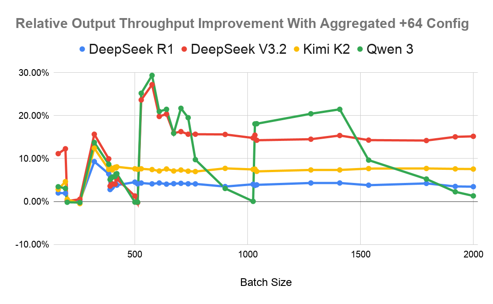
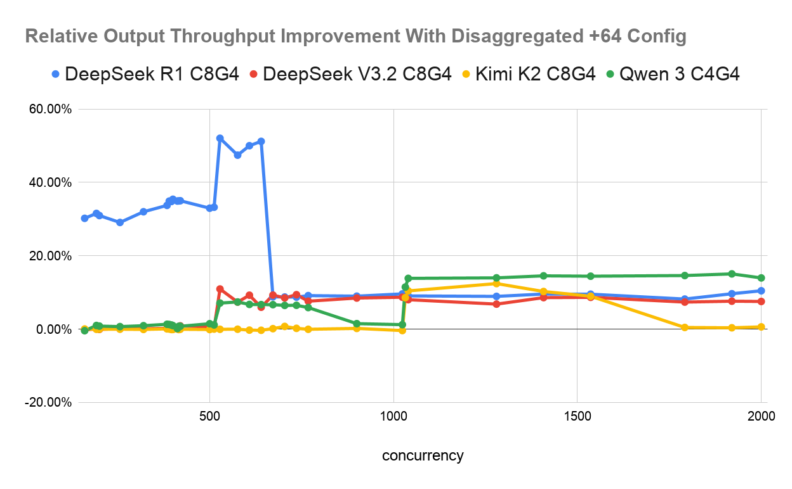
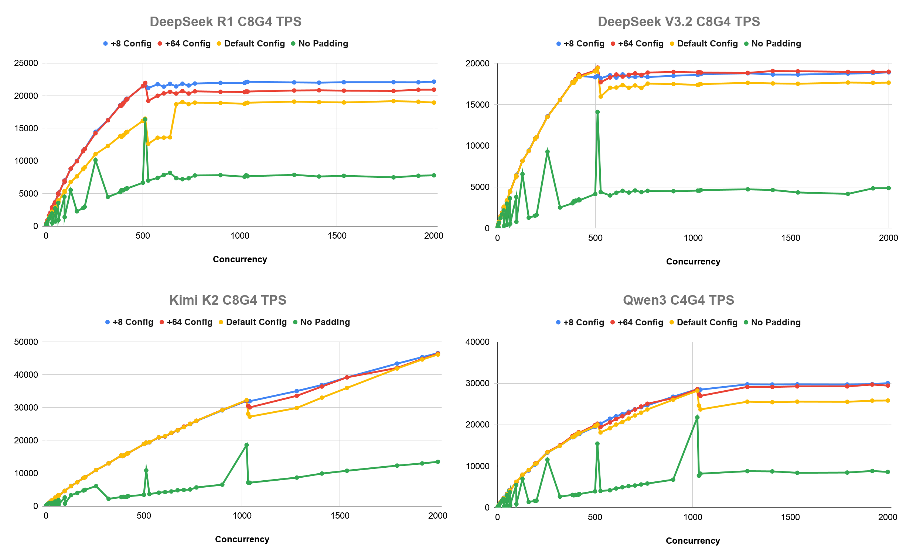

# Tuning CUDA Graph Batch Sizes for Higher Output Throughput

By NVIDIA TensorRT-LLM Team

CUDA graphs reduce per-step GPU launch overhead by pre-recording sequences of GPU operations and replaying them as a single unit. In TensorRT-LLM, CUDA graphs are captured for a fixed set of batch sizes; when CUDA graph padding is enabled, an incoming batch is padded to the next available captured size, wasting some compute on empty slots. The default configuration captures only 23 batch sizes using a roughly-doubling progression, leaving gaps of up to 1024 between consecutive sizes in the high-concurrency range. This post investigates the throughput impact of filling those gaps with finer-grained batch size sets, and characterizes the resulting GPU memory and server startup time overhead.

## Table of Contents

- [Background: CUDA Graph Padding](#background-cuda-graph-padding)
- [Configurations Under Study](#configurations-under-study)
- [Experiment Setup](#experiment-setup)
- [Phase 1: The +64 Configuration](#phase-1-the-64-configuration)
  - [Aggregated Serving Results](#aggregated-serving-results)
  - [Disaggregated Serving Results](#disaggregated-serving-results)
  - [GPU Memory Overhead](#gpu-memory-overhead)
  - [Server Startup Time Overhead](#server-startup-time-overhead)
- [Phase 2: The +8 Configuration](#phase-2-the-8-configuration)
  - [Throughput Results](#throughput-results)
  - [KV Cache and Memory Tradeoff](#kv-cache-and-memory-tradeoff)
- [Conclusions](#conclusions)
- [Future Work](#future-work)

## Background: CUDA Graph Padding

TensorRT-LLM captures CUDA graphs for a predetermined set of batch sizes before inference begins. At each generation step, the scheduler assembles a batch of requests; if the batch size does not match any captured size, the runtime pads it up to the nearest larger captured size, running the model over some empty slots. The wasted computation is proportional to the gap between the actual batch and the next captured size.

The default **x2 configuration** covers 23 batch sizes using a coarsely-doubling sequence:

```text
1, 2, 4, 8, 16, 24, 32, 40, 48, 56, 64, 72, 80, 88, 96, 104, 112, 120, 128, 256, 512, 1024, 2048
```

The dense coverage up to 128 is appropriate for low-concurrency scenarios where batches are small. However, the large gaps above 128 — 128 to 256, 256 to 512, 512 to 1024, and 1024 to 2048 — can cause up to 50% padding waste in high-concurrency scenarios where the decode server processes hundreds to thousands of concurrent requests simultaneously. Finer granularity in this range directly reduces that waste.

## Configurations Under Study

We evaluate three configurations that differ in how densely they cover batch sizes in the 128–2048 range:

| Config | Batch Size Sequence (above 128) | Total Graphs |
|--------|--------------------------------|--------------|
| **x2** (default) | 256, 512, 1024, 2048 | 23 |
| **+64** | 192, 256, 320, …, 1984, 2048 (64-step) | 49 |
| **+8** | 136, 144, 152, …, 2040, 2048 (8-step) | 259 |

Both +64 and +8 configs share the same fine-grained coverage up to 128 as the default x2 config; the differences are exclusively in how the 128–2048 range is subdivided. The +64 configuration reduces the maximum per-step padding from 1024 to 63 tokens in this range; the +8 configuration reduces it to 7 tokens, effectively eliminating padding waste above batch size 128.

## Experiment Setup

All experiments are conducted on NVIDIA GB200 servers using TensorRT-LLM v1.3.0rc8. We evaluate four frontier NVFP4-quantized models under two serving topologies:

- **Aggregated mode**: a single server with 4×GB200 GPUs handling both prefill and decode, with tensor parallelism (TP)
- **Disaggregated mode**: 4 or 8×GB200 GPUs for the prefill (context) server and 4×GB200 GPUs for the decode (generation) server, with expert parallelism (EP)

The primary metric is **output throughput** in terms of tokens per second (TPS). Benchmarks sweep a range of concurrency levels at fixed ISL=500, OSL=2000. All results report TPS improvement of the candidate configuration relative to the x2 baseline at each concurrency level.

## Phase 1: The +64 Configuration

### Aggregated Serving Results

In aggregated mode, we measure the TPS improvement of the +64 config over the default x2 config across various concurrencies for each model. Improvements are concentrated in the concurrency range above 128, where the +64 config introduces intermediate sizes that reduce padding waste.

<div align="center">
<figure>
  
</figure>
</div>
<p align="center"><sub><em>Figure 1. Relative output throughput improvement (%) of the +64 config over x2 in aggregated mode for all four models.</em></sub></p>

Across all four models, the +64 config improves TPS by **up to 1.3x** at high concurrency. Concurrencies up to 128 show near-zero difference and are omitted. Gains emerge above concurrency 128 where the +64 config fills in the large gaps in the mid-to-high batch size range.

### Disaggregated Serving Results

In disaggregated mode, we use 4 to 8 GPUs for the context server and 4 for the generation server, with EP for the MoE layers. We again test the four models under various concurrencies.

<div align="center">
<figure>
  
</figure>
</div>
<p align="center"><sub><em>Figure 2. Relative output throughput improvement (%) of the +64 config over x2 in disaggregated mode for all four models. C8G4 denotes 8 context GPUs and 4 generation GPUs; C4G4 denotes 4 context and 4 generation GPUs.</em></sub></p>

DeepSeek-R1 shows the largest gains, reaching **up to 1.5x** around concurrency 500–600 before stabilizing at 1.1x at higher concurrency levels. DeepSeek-V3.2 and Qwen3-235B achieve 1.08x–1.15x gains at high concurrencies. Kimi-K2 shows the lowest improvement: as a one-trillion-parameter model on 8 context and 4 generation GB200s, its KV cache is already fully constrained, and the increased memory usage from the +64 config's additional CUDA graphs reduces available KV cache further, counteracting the padding efficiency gains. This memory-throughput tradeoff is examined in more detail in the GPU Memory Overhead section below.

### GPU Memory Overhead

Capturing more CUDA graphs requires more GPU memory for graph data. TensorRT-LLM already uses `graph.pool()` to share a memory pool across all captured graphs when capturing various tensor buffers for decoding passes, so the memory pool size is determined by the memory footprint of the largest graph — which is identical in the x2 and +64 configurations. The observable memory difference lies instead in the CUDA graph metadata outside the pool.

Using `torch.cuda.mem_get_info()` on an aggregated-mode DeepSeek-R1 model at TP=4, we find on average each CUDA graph adds approximately 10 MB of dedicated data. The 26 additional graphs in the +64 configuration therefore account for approximately **260 MB** more GPU memory consumption, which reduces the amount of memory available for the KV cache.

We suggest deploying high-parameter models like Kimi-K2 with higher parallelism to provision more GPU memory per serving instance, thereby reducing the negative effect of capturing more CUDA graphs on KV cache capacity.

### Server Startup Time Overhead

CUDA graph capture occurs twice during server initialization: once as a **dry run** to measure runtime GPU memory consumption (from which the amount of GPU memory for safe KV cache allocation is estimated), and once as the **live launch** with the full KV cache allocated. Capturing more graphs extends both phases proportionally.

Measured on GB200 with DeepSeek-R1 at TP=4 and maximum batch size 2048:

| Config | Graphs | 1st capture | 2nd capture | Total LLM init |
|--------|--------|-------------|-------------|----------------|
| x2 (default) | 23 | 10.77 s | 10.38 s | 183.62 s |
| +64 | 49 | 25.90 s | 25.39 s | 215.13 s |
| **Ratio** | 2.1× | **2.4×** | **2.4×** | **1.17×** |

The graph capture phase scales linearly with the number of graphs and increases by 2.4×. However, because model weight loading dominates total initialization time, the end-to-end LLM server startup increases by only 1.17×. The startup overhead from the dry run could be further reduced in a future update by capturing only a small representative subset of graphs during the dry run phase to estimate per-graph memory footprints, rather than capturing all graphs twice.

## Phase 2: The +8 Configuration

Building on the gains from the +64 configuration, we investigate whether reducing the batch size step from 64 to 8 yields further throughput improvements. The +8 configuration captures 259 batch sizes, adding steps at every 8-token interval between 128 and 2048, which reduces the maximum padding per step above batch size 128 to at most 7 tokens.

For DeepSeek-R1 at TP=4 setup, the 210 additional graphs over +64 consume a total of **2.6 GB** of dedicated GPU memory — a substantially larger overhead than the 260 MB incurred by +64.

Experiments are conducted in disaggregated mode under the same ISL=500, OSL=2000 conditions. The throughput curves below compare four configurations: +8 (blue), +64 (red), x2/default (yellow), and a no-padding baseline (green, which disables CUDA graph padding entirely and serves as a performance lower bound).

### Throughput Results

<div align="center">
<figure>
  
</figure>
</div>
<p align="center"><sub><em>Figure 3. TPS vs. concurrency in disaggregated mode for all four models, comparing +8 (blue), +64 (red), default (yellow), and no-padding (green) configs.</em></sub></p>

All four plots show finer-grained batch size sets result in smoother output throughput curves. The curves of the +8 config are smoother than the +64.
DeepSeek-R1 and Qwen3-235B show some improvement with the +8 config over +64, with DeepSeek-R1 gaining up to 1.15x at concurrency 576 and Qwen3 gaining up to 1.06x around concurrency 1040. Kimi-K2 shows marginal gains from +8 relative to +64; its TPS continues scaling past concurrency 2000, indicating the decode server is not yet saturated at the highest tested concurrency. DeepSeek-V3.2 is the exception: +8 underperforms +64 by up to 5% around concurrency 500, a regression driven by the KV cache reduction analyzed in the following section.

### KV Cache and Memory Tradeoff

The table below profiles CUDA graph and KV cache GPU memory usage for DeepSeek-V3.2 and DeepSeek-R1:

| Metric | V3.2 +8 | V3.2 +64 | R1 +8 | R1 +64 |
|--------|---------|---------|-------|--------|
| CUDA graphs compiled | 259 | 49 | 259 | 49 |
| KV cache max\_tokens | 543,219 | 655,758 | 603,860 | 660,491 |
| KV cache GPU memory | 23.46 GB | 28.32 GB | 21.22 GB | 23.21 GB |
| KV cache token reduction | −17.2% | — | −8.6% | — |
| KV cache memory reduction | 4.86 GB | — | 1.99 GB | — |

DeepSeek-V3.2's 210 additional graphs (over +64) consume 4.86 GB of GPU memory, compared to 1.99 GB for the same 210 graphs in DeepSeek-R1. V3.2's CUDA graphs thus consume 2.4× more GPU memory per graph than R1's, probably due to V3.2's complex DeepSeek Sparse Attention (DSA) mechanism. This larger footprint reduces the KV cache token capacity by 17.2% for V3.2, versus 8.6% for R1. TensorRT-LLM's batch autotuner prevents active requests' KV cache from being evicted mid-generation, so a smaller KV cache directly caps the number of concurrent in-flight requests, reducing output throughput.

The adoption of the +8 config is therefore more situation-dependent: it benefits models whose CUDA graphs have a modest per-graph memory footprint (relative to available GPU memory for the KV cache), and regresses on models with larger per-graph footprints where KV cache reduction is the dominant effect.

## Conclusions

We experimented with new batch size sets for captured CUDA graphs to reduce wasted compute from padding, measuring the effect on output throughput, GPU memory usage, and server startup time.

Under our experimental settings (ISL=500, OSL=2000, 4×GB200 decode), the +64 config achieves up to 1.3× output throughput in aggregated mode and up to 1.5× in disaggregated mode across models and concurrencies. It increases the number of captured CUDA graphs from 23 to 49, adding approximately 260 MB of GPU memory and increasing server startup time by 1.17× on DeepSeek-R1. The +8 config achieves slightly higher throughput in most cases but at a considerably higher GPU memory cost and much slower server startup time.

Based on these results, we have decided to change the default batch sizes when CUDA graph padding is enabled to the +64 config. The +8 config is currently not recommended. This change is expected to improve output throughput for most LLM deployments. Should you encounter a regression after this change, we suggest tuning the serving configuration to use higher parallelism, or explicitly setting the batch size list back to the original x2 default config shown at the beginning of this post.

## Future Work

- **Optimized dry-run estimation**: The serve memory dry-run procedure could be streamlined by capturing only two to four graphs during the dry-run phase to estimate per-graph memory footprints, rather than capturing the full CUDA graph set twice. This would reduce the startup time penalty on capturing a large number of CUDA graphs.
- **Additional Batch Size Experiments**: We could test the effect of the +8 config under large EP degrees (EP=16 to 32) and evaluate intermediate step sizes such as +16, x1.25, and x1.5 to derive model-specific batch size recommendations.
- **Automatic CUDA graph batch size tuning**: We could parse serving logs to compute the best set of CUDA graph batch sizes to capture based on the recorded concurrency distribution, rather than requiring users to manually set CUDA graph batch sizes or leave to the default.
