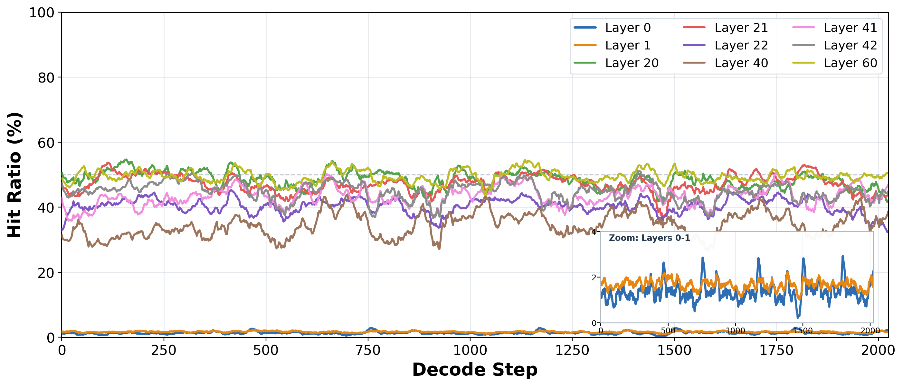
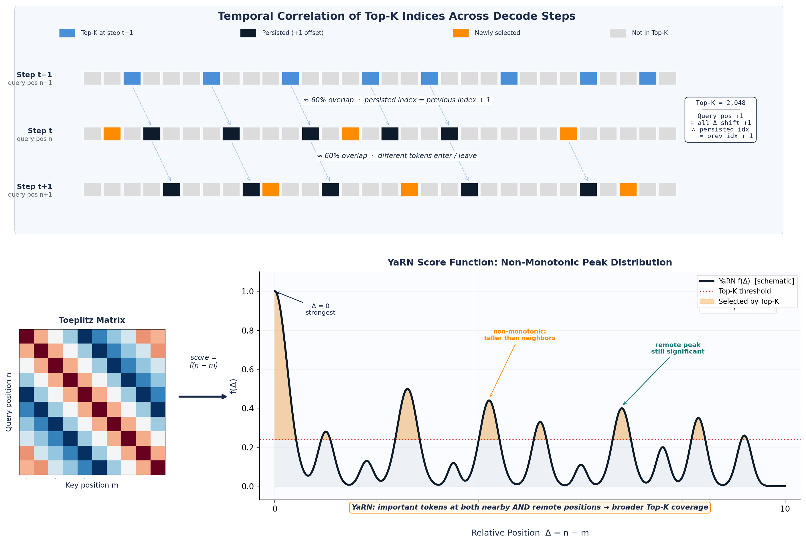
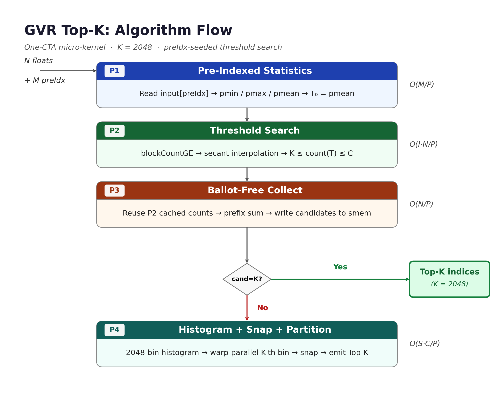
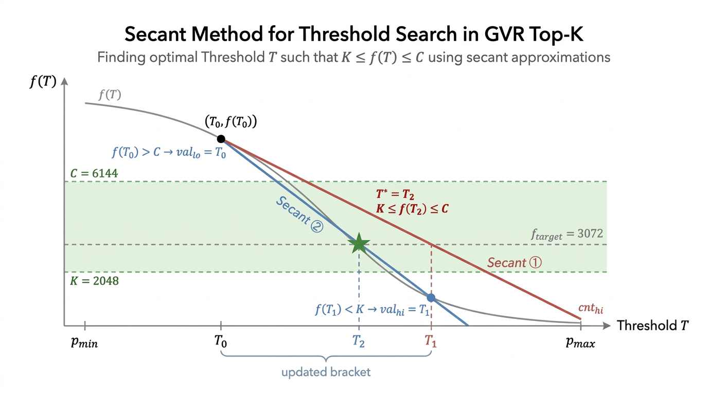
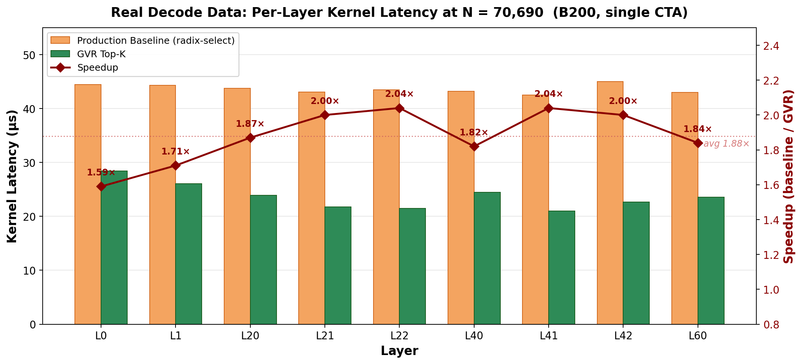
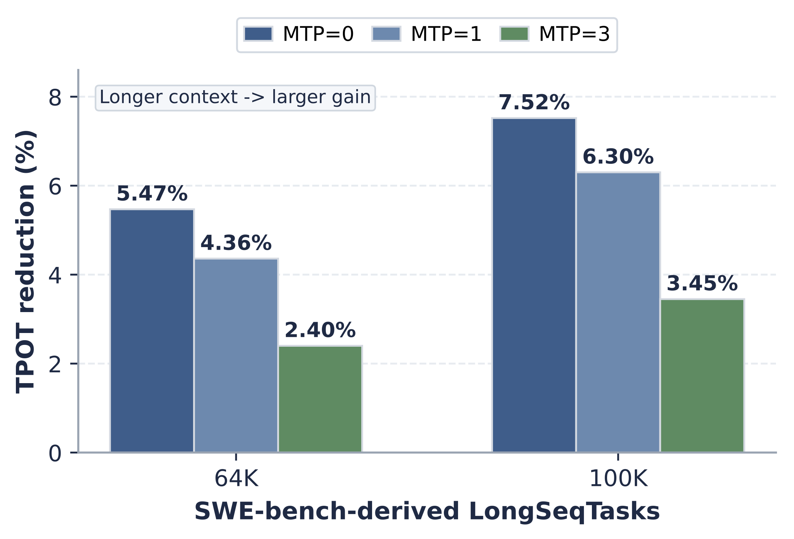

# Temporal Correlation Meets Sparse Attention: Guess-Verify-Refine Top-K for Blackwell

By NVIDIA TensorRT LLM team

## Table of Contents

- [Introduction](#introduction)
- [Why Decode-Time Top-K Matters in DSA](#why-decode-time-top-k-matters-in-dsa)
  - [Lightweight Indexer and Top-K Selection](#lightweight-indexer-and-top-k-selection)
  - [Why Long Context Makes Top-K a Bottleneck](#why-long-context-makes-top-k-a-bottleneck)
- [Why Temporal Correlation Exists](#why-temporal-correlation-exists)
  - [What We Observe in Real Decode Traces](#what-we-observe-in-real-decode-traces)
  - [Why RoPE and YaRN Make This Predictable](#why-rope-and-yarn-make-this-predictable)
- [How GVR Works](#how-gvr-works)
  - [Phase 1: Guess from Previous-Step Top-K](#phase-1-guess-from-previous-step-top-k)
  - [Phase 2: Verify with Secant Threshold Search](#phase-2-verify-with-secant-threshold-search)
  - [Phase 3: Ballot-Free Candidate Collection](#phase-3-ballot-free-candidate-collection)
  - [Phase 4: Exact Refinement in Shared Memory](#phase-4-exact-refinement-in-shared-memory)
  - [Why This Is Still Exact](#why-this-is-still-exact)
- [TensorRT-LLM Integration](#tensorrt-llm-integration)
  - [Where GVR Fits in the DSA Stack](#where-gvr-fits-in-the-dsa-stack)
  - [How to Enable It](#how-to-enable-it)
  - [When It Falls Back to Radix Select](#when-it-falls-back-to-radix-select)
- [Results](#results)
  - [Single-Operator Performance](#single-operator-performance)
  - [Ablation: Architecture vs Prediction Quality](#ablation-architecture-vs-prediction-quality)
  - [End-to-End Accuracy](#end-to-end-accuracy)
  - [End-to-End TPOT Reduction](#end-to-end-tpot-reduction)
- [Further Reading and Reproduction](#further-reading-and-reproduction)
- [Conclusion](#conclusion)

## Introduction

Long-context and code-centric LLM workloads routinely push decode-time context lengths into the 100K+ regime. Sparse attention reduces the quadratic attention bottleneck, but it does **not** remove the need to rank a long vector of indexer scores at every decode step. In practical sparse-attention deployments such as DeepSeek DSA, exact **Top-K selection** remains on the critical path, and its cost still grows with sequence length.

TensorRT-LLM already ships a highly tuned production radix-select Top-K kernel for DeepSeek Sparse Attention (DSA), as described in [Tech Blog 15](blog15_Optimizing_DeepSeek_V32_on_NVIDIA_Blackwell_GPUs.md). This blog introduces the next step: **Guess-Verify-Refine (GVR)**, a data-aware **exact** Top-K algorithm that uses the previous decode step's Top-K result as a prediction signal.

The core observation is simple:

- consecutive decode steps tend to query highly similar KV neighborhoods,
- so the previous step's Top-K is a strong warm-start for the current step,
- which lets GVR reduce full-row passes from 3-4 to 1-2 in the common case,
- while still preserving exact Top-K outputs.

On real DeepSeek-V3.2 decoding workloads running on NVIDIA Blackwell GPUs, GVR delivers:

- **1.88x average** single-operator speedup over the production radix-select baseline,
- up to **2.42x** per layer per decode step,
- and end-to-end TPOT reduction of up to **7.52%** in fixed-OSL TEP8 min-latency deployment.

This blog explains the motivation, algorithm, TensorRT-LLM integration, enablement path, and measured operator-level and end-to-end gains. For full derivations, correctness arguments, iteration statistics, and supplementary methodology, see Cheng, Long, et al. ["Guess-Verify-Refine: Data-Aware Top-K for Sparse-Attention Decoding on Blackwell via Temporal Correlation"](https://doi.org/10.48550/arXiv.2604.22312), arXiv:2604.22312 (2026).

## Why Decode-Time Top-K Matters in DSA

### Lightweight Indexer and Top-K Selection

As described in the [DeepSeek-V3 technical report](https://arxiv.org/abs/2412.19437), DSA computes index scores with a lightweight MQA-style indexer:

$$I_{t} = \sum_{j=1}^{h}W_j^I \cdot \text{ReLU}(Q_{t, j}^I (K_t^I)^T)$$

The index score tensor $I_t \in \mathbb{R}^N$ (where $N$ is the current sequence length) estimates which past KV tokens matter most for the current query token. A Top-K operator then selects the top 2048 positions, and only those selected entries participate in sparse MLA.

<div align="center">
<figure>
  
</figure>
</div>
<p align="center"><sub><em>Figure 1. Indexer Top-K selection in DeepSeek Sparse Attention. The indexer scores all historical tokens, and Top-K keeps only the most important ones for sparse MLA.</em></sub></p>

This design is powerful because it preserves the benefits of fine-grained token sparsity. But it also means that decode-time latency still contains a full-row ranking problem whose cost grows with context length.

### Why Long Context Makes Top-K a Bottleneck

The DSA decode step has three main components:

| Component | Scaling | Total Memory Traffic | Trend as $N$ Grows |
|:----------|:--------|:---------------------|:-------------------|
| **Indexer MQA** | $O(N)$ | $N \cdot d_i \cdot 2B$ | Linear growth |
| **Top-K (radix-select)** | $O(R \cdot N)$ | $R \cdot N \cdot 4B$ | Linear growth |
| **Sparse MLA** | $O(K)$ | $K \cdot d \cdot 2B$ | Constant ($K$ fixed) |

Here $K = 2048$ is fixed, while $N$ grows with the request's decode-time context length.

This creates a very specific long-context effect:

- sparse MLA stays roughly constant because it always attends to only $K$ tokens,
- but the decode-stage Top-K still has to inspect all $N$ scores,
- so the **Top-K fraction of DSA latency grows with context length**.

That is why Top-K becomes worth optimizing as a standalone operator rather than being treated as a small side cost. The production radix-select kernel is already very strong, but it still pays for multiple full-row passes and shared-memory atomic serialization. GVR keeps exactness, but uses temporal structure in the workload to reduce those passes.

## Why Temporal Correlation Exists

### What We Observe in Real Decode Traces

A key empirical observation is that the Top-K index sets in DSA have strong temporal stability across decode steps: the important tokens at step $t$ often overlap substantially with the important tokens at step $t-1$.

We measured this on real DeepSeek-V3.2 decode-stage indexer logits using a long-context coding prompt from **SWE-bench-derived LongSeqTasks**. Concretely, the prompt used here is entry 1 of the 64K bucket, built from repository files of a single SWE-bench task; its actual prompt length is 68,665 tokens, followed by 2,025 decode steps.

<div align="center">
<figure>
  
</figure>
</div>
<p align="center"><sub><em>Figure 2. Raw Top-K overlap between consecutive decode steps across layers. Layers 20-60 show 35-50% average raw overlap, while Layers 0 and 1 are much lower.</em></sub></p>

Two details help interpret the figure:

1. **Figure 2 reports raw overlap**, i.e. exact set intersection between consecutive steps.
2. A related but different view is **shifted overlap**, where the previous-step indices are shifted by `+1` before comparison. Shifted overlap is useful for intuition, but Figure 2 itself uses the stricter raw metric.

The practical takeaway is straightforward: for most layers, the previous step's Top-K is already a useful prediction set for the next step.

### Why RoPE and YaRN Make This Predictable

The empirical observation is not accidental. It is tied to how the DSA indexer uses RoPE-encoded query and key tensors.

At a high level:

- the positional score contribution depends on relative position $\Delta = n - m$,
- so the positional score landscape is Toeplitz-like,
- and advancing the query by one decode step produces a smooth translation rather than a random reshuffling.

<div align="center">
<figure>
  
</figure>
</div>
<p align="center"><sub><em>Figure 3. Intuition for temporal correlation in decode-stage Top-K. The previous step's Top-K is not exact ground truth for the next step, but it remains a strong local predictor because the score landscape moves smoothly.</em></sub></p>

YaRN matters here too: by preserving meaningful long-range peaks, it makes the Top-K set span both nearby and more distant positions, which strengthens the prediction signal available from the previous step.

For the full theoretical derivation and the formal connection between RoPE/YaRN structure and temporal Top-K stability, see the [GVR Top-K arXiv paper](https://doi.org/10.48550/arXiv.2604.22312).

## How GVR Works

GVR turns the previous step's Top-K into a **prediction-guided exact selection** pipeline.

At a high level, the algorithm does four things:

1. estimate a threshold from the predicted indices,
2. verify that threshold with a small number of full-row passes,
3. collect the resulting candidates efficiently,
4. finish exact selection in shared memory.

<div align="center">
<figure>
  
</figure>
</div>
<p align="center"><sub><em>Figure 4. Guess-Verify-Refine (GVR) pipeline. The previous step's Top-K provides the warm-start; exact selection is preserved by verification and in-shared-memory refinement.</em></sub></p>

### Phase 1: Guess from Previous-Step Top-K

The previous step's Top-K indices are passed in as `preIdx`. GVR reads those positions and computes:

- `pmin`
- `pmax`
- `pmean`

The most important quantity is `pmean`, which gives a much better initial threshold estimate than the unconditional mean of the full score vector. In real decode workloads, the hit ratio of `preIdx` is much larger than the trivial baseline $K/N$, so `pmean` is already biased toward the Top-K tail.

### Phase 2: Verify with Secant Threshold Search

Starting from `pmean` and the bracket `[pmin, pmax]`, GVR runs a secant-style threshold search over the monotone count function:

$$f(T) = |\{i : x_i \geq T\}|$$

The target is to find a threshold $T^\ast$ such that the candidate count falls into a safe refinement range:

$$K \leq f(T^\ast) \leq C$$

where $C$ is a bounded candidate capacity.

<div align="center">
<figure>
  
</figure>
</div>
<p align="center"><sub><em>Figure 5. Secant-style threshold search in GVR. With a good starting estimate, the search typically converges in 1-2 iterations on real decode data.</em></sub></p>

This is where temporal correlation directly turns into speedup: instead of blindly narrowing the search space with distribution-agnostic radix passes, GVR starts close to the relevant tail and needs only a small number of global scans in the common case.

### Phase 3: Ballot-Free Candidate Collection

Once a valid threshold is found, GVR collects all elements above threshold into shared memory.

This stage is optimized around two ideas:

- **count-cache reuse**: Phase 2's per-thread counts are reused so Phase 3 can avoid a redundant full-row count pass,
- **ballot-free write layout**: candidates are written via prefix-sum-derived offsets rather than per-element ballot/atomic machinery.

This reduces synchronization overhead and avoids the compiler barriers associated with `__ballot_sync`, which is especially important on Blackwell where streaming memory behavior matters.

### Phase 4: Exact Refinement in Shared Memory

If the candidate count is already exactly $K$, GVR is done.

Otherwise, GVR performs exact refinement entirely in shared memory:

1. scan candidates for min/max,
2. build a 2048-bin histogram,
3. identify the relevant bin with a warp-parallel search,
4. run snap refinement until the exact boundary is identified,
5. emit the exact Top-K output.

<div align="center">
<figure>
  
</figure>
</div>
<p align="center"><sub><em>Figure 6. Shared-memory refinement stage of GVR. This is where the algorithm preserves exactness while avoiding a global-memory sort.</em></sub></p>

### Why This Is Still Exact

GVR is not an approximate pruning method. The heuristic is used only to get a good threshold estimate quickly; exactness is preserved by the verification step and the final shared-memory refinement.

In practice:

- the output Top-K set matches `torch.topk` on tested sequence lengths,
- ties remain non-deterministic in the same way as the production kernel,
- and end-to-end model behavior remains unchanged within observed variance.

For the full correctness argument, the exact candidate-set condition, detailed pseudocode, and the GPU performance model, see the [GVR Top-K arXiv paper](https://doi.org/10.48550/arXiv.2604.22312).

## TensorRT-LLM Integration

### Where GVR Fits in the DSA Stack

GVR is integrated into the existing TensorRT-LLM DSA decode path rather than as a separate code path. The high-level dispatch is:

1. Python-level DSA code decides whether a small-batch CuTE DSL path is appropriate,
2. otherwise the request falls through to the C++ `indexer_topk_decode` operator, carrying the previous-step Top-K indices and a graph-safe scratch buffer when GVR is enabled,
3. inside that operator, the GVR Top-K dispatcher selects the fast path only when the heuristic prerequisites and hardware-aware `(batch size, sequence length)` thresholds are met,
4. otherwise the original insertion/radix-select fallback chain is used.

<div align="center">
<figure>
  
</figure>
</div>
<p align="center"><sub><em>Figure 7. Full decode-stage Top-K dispatch in TensorRT-LLM. GVR takes priority only when `preIdx`, scratch buffers, and hardware-aware thresholds are satisfied; otherwise dispatch falls back to the original insertion/radix-select pipeline.</em></sub></p>

From a system point of view, this fits naturally into the broader TensorRT-LLM sparse attention stack described in [Tech Blog 17](blog17_Sparse_Attention_in_TensorRT-LLM.md), while specifically accelerating the DSA Top-K selector discussed in [Tech Blog 15](blog15_Optimizing_DeepSeek_V32_on_NVIDIA_Blackwell_GPUs.md).

### How to Enable It

GVR is controlled by the DSA configuration and is enabled through the existing YAML config path used by `trtllm-serve`, `trtllm-bench`, and `trtllm-eval`.

Example:

```yaml
sparse_attention_config:
  algorithm: dsa
  index_topk: 2048
  enable_heuristic_topk: true
```

The same option is also available through the Python LLM API:

```python
from tensorrt_llm import LLM
from tensorrt_llm.llmapi import DeepSeekSparseAttentionConfig

llm = LLM(
    model="<model>",
    sparse_attention_config=DeepSeekSparseAttentionConfig(
        index_topk=2048,
        enable_heuristic_topk=True,
    ),
)
```

The current GVR implementation supports `index_topk=2048`. Support for `index_topk=512` and `index_topk=1024` is planned but not enabled yet, so those configurations continue to use the production insertion/radix Top-K path.

Looking ahead, DeepSeek V4-style DSA workloads are expected to make this extension more important: the indexer Top-K can move to smaller `index_topk` settings such as 512 or 1024 while still operating over long decode-time sequences. GVR Top-K is being extended to cover those configurations so the same temporal-correlation idea can accelerate both today's `2048`-wide selector and upcoming smaller-K long-context selectors.

Pass that config with the usual DSA deployment flow, for example:

```bash
trtllm-serve <model> --config config.yaml
```

or

```bash
trtllm-bench --model <model> throughput --config config.yaml
```

At the operator boundary, the C++ path receives both the current logits and the previous-step Top-K indices:

```python
torch.ops.trtllm.indexer_topk_decode(
    logits,
    kv_lens,
    indices,
    next_n,
    topk,
    pre_idx=pre_idx,
    heuristic_scratch=heuristic_scratch,
)
```

GVR Top-K does not add another user-facing API beyond this configuration flag. The public option remains `enable_heuristic_topk`, and the public launcher/operator names keep the existing `heuristic_*` spelling for compatibility. Internally, the single-CTA micro-kernel is named after the algorithm (`gvrTopKJob` / `gvrTopKKernel`).

Two environment variables are useful for benchmarking and debugging:

- `TRTLLM_HEURISTIC_NMIN=<int>` overrides the small-sequence lower bound (`12288` by default, valid range `[1024, 200000]`).
- `TRTLLM_SCHEMEX_DEBUG=1` prints the per-launch GVR dispatcher decision, including the SM/L2-derived batch threshold and the small-N route marker.

### When It Falls Back to Radix Select

The GVR fast path is only taken when the required conditions are satisfied. Notable fallback cases include:

- **prefill** (no previous-step Top-K yet),
- missing or invalid `preIdx` / scratch feedback buffers,
- non-contiguous logits layout, `index_topk` values other than the currently supported `2048`, or unsupported hint size,
- **short rows** below the small-sequence threshold,
- **large batches** above the SM/L2-derived batch threshold,
- **very long rows** where the implementation still prefers the existing split-work radix path,
- unsupported architectures.

In other words, enabling GVR is designed to be low-risk: if the heuristic path is not applicable, TensorRT-LLM simply continues to use the production radix-select implementation.

Today, the heuristic path is targeted at **Blackwell (sm_100+)**. On older architectures, the flag is effectively ignored.

## Results

### Single-Operator Performance

On synthetic data, GVR shows the expected scaling behavior: there is fixed overhead at short sequence length, but the reduced pass count wins as $N$ grows. Production dispatch uses a hardware-aware GVR gate rather than a single hard crossover: the default small-sequence lower bound is `12288`, while a hardware-aware batch threshold routes large-batch or L2-pressure cases back to radix.

<div align="center">
<figure>
  
</figure>
</div>
<p align="center"><sub><em>Figure 8. On random synthetic data, standalone GVR reaches parity around 16K sequence length and then increasingly outperforms the production radix-select kernel as context grows. In production, the GVR dispatcher starts from the validated 12,288-token lower bound and falls back when the `(batch size, sequence length)` cell is better served by radix.</em></sub></p>

The more important result is real decode data.

We evaluate on real DeepSeek-V3.2 decode-stage indexer logits captured from a 68,665-token SWE-bench-derived long-context coding prompt, using 17 sampled decode steps across 9 representative layers. Under those conditions:

- the average speedup is **1.88x**,
- the per-layer range is **1.57x-2.02x**,
- and the best per-step measurement reaches **2.42x**.

<div align="center">
<figure>
  
</figure>
</div>
<p align="center"><sub><em>Figure 9. GVR consistently outperforms the production radix-select baseline across all evaluated layers on real DeepSeek-V3.2 decode traces.</em></sub></p>

These real-data gains line up with the main design intuition:

- high-correlation layers tend to converge in fewer Phase 2 iterations,
- bounded distributions (for example beta-like layers) give cleaner thresholds,
- but even the harder layers still remain meaningfully faster than the baseline.

For the full tables, per-layer breakdowns, and replay statistics of Phase 2 / Phase 4 iteration counts, see the [GVR Top-K arXiv paper](https://doi.org/10.48550/arXiv.2604.22312).

### Ablation: Architecture vs Prediction Quality

One of the most important questions is how much of the gain comes from **better prediction** versus **better exact-kernel structure**.

The ablation below answers that directly:

| preIdx Source | Overlap ($\alpha$) | Kernel Latency | vs. Radix Baseline |
|:--------------|:------------------:|:--------------:|:------------------:|
| No preIdx (radix fallback) | 0% | 43.7 us | 1.00x |
| Random indices | ~2.9% | 30.9 us | **1.44x** |
| Prev-step Top-K (L20-60) | ~44% | 22.7 us | **1.94x** |
| Prev-step Top-K (L0-1) | ~1.5% | 27.2 us | **1.65x** |

This is a useful way to think about GVR:

- **architecture alone already matters**: even random `preIdx` gives 1.44x,
- **temporal prediction adds another layer of gain**: high-correlation layers reach 1.94x,
- and the kernel degrades gracefully instead of collapsing when prediction quality is weak.

### End-to-End Accuracy

We validated that enabling GVR does not introduce measurable end-to-end quality regression in the TensorRT-LLM stack. Using `trtllm-eval` on DeepSeek-V3.2 NVFP4 on B200, all observed deltas stay within run-to-run variance across:

- MMLU
- GSM8K
- GPQA-Diamond
- LongBench V1

The high-level conclusion is the important one for this blog: GVR accelerates the decode-stage Top-K path without introducing measurable end-to-end accuracy regression.

For the detailed benchmark table and discussion of why long-context evaluation is the most representative stress test for this path, see the [GVR Top-K arXiv paper](https://doi.org/10.48550/arXiv.2604.22312).

### End-to-End TPOT Reduction

To isolate the length-scaling behavior of the decode-stage optimization, we measured fixed-OSL min-latency serving on DeepSeek-V3.2-Exp NVFP4 with TensorRT-LLM on B200 x8 under TEP8 parallelism.

The benchmark is intentionally set up so that decode-time Top-K is a meaningful fraction of end-to-end latency:

- **batch size = 1** for min-latency serving,
- **TEP8** with `tp=8, ep=8`,
- **chunked prefill enabled** with `max_num_tokens=8192`,
- **FP8 KV cache** with `tokens_per_block=64` and `free_gpu_memory_fraction=0.8`,
- **CUDA Graph padding enabled**,
- **real SWE-bench-derived prompts** tokenized into `trtllm-bench` dataset format,
- and **interleaved A/B execution** so the radix baseline and GVR path are run back-to-back under the same GPU conditions.

For each configuration we use 5 requests and repeat the A/B pair 3 times. The fixed-OSL figure and table below focus on the `OSL=1K` slice because it is a clean way to compare how the benefit scales with input length and speculative decoding depth without mixing in very short or very long output tails.

<div align="center">
<figure>
  
</figure>
</div>
<p align="center"><sub><em>Figure 10. End-to-end TPOT reduction at fixed OSL=1K. GVR helps more as context length grows, and the gain is diluted as MTP becomes more aggressive.</em></sub></p>

| Context Bucket | MTP = 0 | MTP = 1 | MTP = 3 |
|:---------------|:-------:|:-------:|:-------:|
| **64K** | **5.47%** | **4.36%** | **2.40%** |
| **100K** | **7.52%** | **6.30%** | **3.45%** |

The fixed-OSL=1K slice shows the two expected trends. First, GVR becomes more valuable as context grows: at MTP=0, TPOT reduction rises from 5.47% at 64K to 7.52% at 100K. Second, speculative decoding dilutes the per-step saving, but does not remove it: at 100K, the gain remains positive from MTP=0 through MTP=3.

The broader 16K-128K sweep shows the same pattern: gains increase with context length, and MTP reduces the magnitude through Amdahl's law while preserving the direction. This is consistent with the single-operator story: the longer the context, the larger the decode-stage Top-K burden, and the more valuable the heuristic warm-start becomes.

## Further Reading and Reproduction

If you want the paper-level version of this work, start with Cheng, Long, et al. ["Guess-Verify-Refine: Data-Aware Top-K for Sparse-Attention Decoding on Blackwell via Temporal Correlation"](https://doi.org/10.48550/arXiv.2604.22312), arXiv:2604.22312 (2026).

The arXiv paper contains the low-level algorithm, pseudocode, replay statistics, and GPU performance model behind the implementation summarized here.

For surrounding TensorRT-LLM context, the most relevant companion reads are:

- [Tech Blog 15: Optimizing DeepSeek-V3.2 on NVIDIA Blackwell GPUs](blog15_Optimizing_DeepSeek_V32_on_NVIDIA_Blackwell_GPUs.md)
- [Tech Blog 17: Sparse Attention in TensorRT LLM](blog17_Sparse_Attention_in_TensorRT-LLM.md)

Those cover:

- the original DSA production path,
- the broader sparse attention framework in TensorRT-LLM,
- and the system context in which GVR is integrated.

For end-to-end benchmarking, use `trtllm-bench` with the standard DSA config path and only toggle `enable_heuristic_topk` between the A/B runs. A representative setup looks like this:

```yaml
cuda_graph_config:
    enable_padding: true
    max_batch_size: 1
kv_cache_config:
    free_gpu_memory_fraction: 0.8
    enable_block_reuse: false
    tokens_per_block: 64
    dtype: fp8
enable_chunked_prefill: true
enable_attention_dp: false
moe_config:
    backend: TRTLLM
speculative_config:
    decoding_type: MTP
    num_nextn_predict_layers: 1
sparse_attention_config:
    algorithm: dsa
    index_topk: 2048
    enable_heuristic_topk: true
```

And the corresponding `trtllm-bench` command follows the standard throughput path:

```bash
trtllm-bench -m deepseek-ai/DeepSeek-V3.2-Exp \
    --model_path <DeepSeek-V3.2-Exp-FP4-path> throughput \
    --tp 8 \
    --ep 8 \
    --backend pytorch \
    --dataset <tokenized_swebench_dataset.json> \
    --max_batch_size 1 \
    --max_num_tokens 8192 \
    --max_seq_len <computed_from_dataset> \
    --kv_cache_free_gpu_mem_fraction 0.8 \
    --concurrency 1 \
    --warmup 2 \
    --streaming \
    --config <config.yml> \
    --num_requests 5
```

In the benchmark script, the only A/B difference between the two runs is:

- `enable_heuristic_topk: false` for the production radix-select path,
- `enable_heuristic_topk: true` for the GVR path.

The benchmark configuration above is the self-contained TensorRT-LLM setup for the technical-blog reproduction path; additional methodology details are available in the [GVR Top-K arXiv paper](https://doi.org/10.48550/arXiv.2604.22312).

## Conclusion

GVR shows that **data-aware exact selection** can outperform even highly tuned distribution-agnostic GPU Top-K kernels when the workload contains a strong temporal signal.

In DeepSeek Sparse Attention decode, the previous step's Top-K is exactly such a signal:

- it gives a much better initial threshold estimate,
- reduces full-row passes in the common case,
- lowers synchronization overhead in candidate collection,
- and still preserves exact Top-K outputs.

That combination is what makes GVR interesting: it is not an approximate pruning trick and it is not just a micro-optimization of radix select. It is a workload-aware exact algorithm that fits naturally into TensorRT-LLM's DSA path and converts temporal stability into real operator-level and end-to-end gains. As DSA-style models evolve toward long-sequence `index_topk=512/1024` use cases, the same GVR Top-K direction is expected to remain useful beyond the current `index_topk=2048` deployment.
