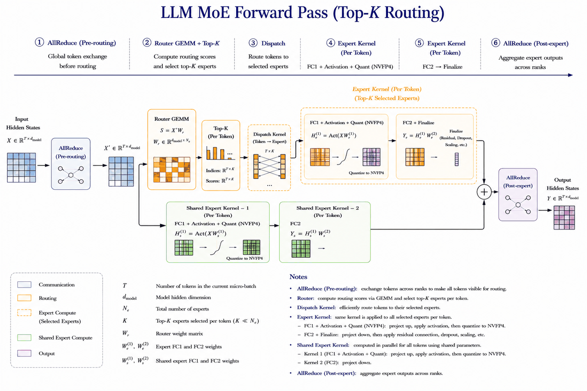
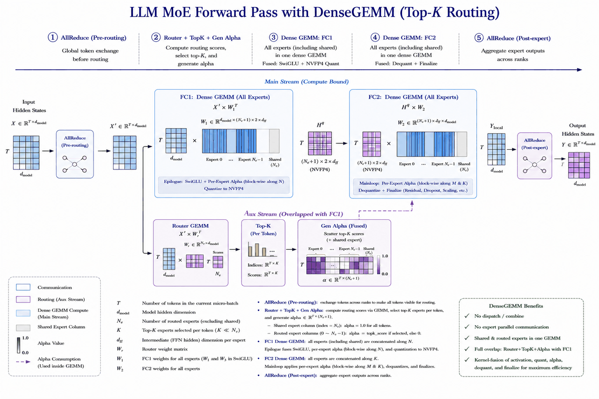

# MoE as Dense GEMM: Optimizing Low-Latency MoE Inference on NVIDIA Blackwell

by NVIDIA TensorRT LLM team

## Abstract

Large-scale MoE models such as DeepSeek-V3/R1, Mixtral, and Qwen3-MoE often use tensor parallelism
for latency-sensitive inference. In the low-latency range where tens to a few hundred tokens enter a
routed MoE layer, the routed experts are still largely memory-bound, while grouped-GEMM execution pays
overheads from small per-expert shapes, expert scheduling, alpha generation, and routed-output
accumulation.

This post introduces **DENSEGEMM**, a TensorRT-LLM backend for NVFP4 MoE on NVIDIA Blackwell
(SM100 / SM103). The target workflow is deliberately counterintuitive: express the MoE FFN as dense
FC1/FC2 GEMMs over all experts, including the always-on shared expert, then use per-token alpha masks to
keep only the selected routed experts. In the memory-bound low-latency regime, the extra arithmetic has
limited latency impact, while the denser GEMM shapes improve hardware utilization.

The implementation in TensorRT-LLM is staged. The current backend applies this dense formulation to the
routed experts first, while shared experts and Router/TopK scheduling remain outside the dense backend.
On a DeepSeek-V3-style B200 profile, this current routed-expert implementation is best in the
`num_tokens = 48-256` range, reaching up to 1.30x speedup over the TRTLLM-Gen grouped-GEMM path in the
measured routed-MoE backend benchmark.

<p align="center">

</p>
<p align="center"><em>Figure 1. Conventional TP routed-MoE path: routing and small grouped GEMMs
dominate low-latency execution.</em></p>

## Table of Contents

- [Background: MoE Inference Latency Regimes](#background-moe-inference-latency-regimes)
- [Scope and Takeaways](#scope-and-takeaways)
- [DENSEGEMM Design](#densegemm-design)
- [Advantages over the Grouped-GEMM Flow](#advantages-over-the-grouped-gemm-flow)
- [Roofline Analysis](#roofline-analysis)
- [Kernel Implementation (CuTe DSL on Blackwell)](#kernel-implementation-cute-dsl-on-blackwell)
- [Performance Evaluation](#performance-evaluation)
- [Current Limitations and Future Work](#current-limitations-and-future-work)
- [References](#references)

## Background: MoE Inference Latency Regimes

Partitioning MoE inference workloads by `num_tokens` (the number of tokens entering the MoE module per
forward pass) clarifies which optimization strategy applies in which regime. Using DeepSeek-V3
(`num_experts = 256`, `top_k = 8`) as a reference:

| Regime | num_tokens | Physical characteristics |
|---|---|---|
| **Min-Latency** | <= 32 | Many routed experts receive no tokens; selected experts receive very few tokens. Fixed overheads dominate. |
| **Low-Latency** | 32-320 | Most routed experts receive at least one assignment, but per-expert token counts remain small. Routed FC1/FC2 remain memory-bound. |
| **Throughput at Latency** | 320-10k | Average routed assignments per expert continue to grow; some experts cross into compute-bound execution while others stay memory-bound. |
| **Max Throughput** | > 10k | All experts are compute-bound; grouped GEMM approaches peak hardware utilization. |

DENSEGEMM primarily targets the **Low-Latency** regime and partially covers its boundaries. It is not a
universal replacement for grouped GEMM: at very small batches, loading all routed experts is too
expensive; at larger batches, the redundant dense arithmetic starts to appear on the critical path.

## Scope and Takeaways

This post separates the target DENSEGEMM workflow from the current TensorRT-LLM implementation. The
main claims should be read with the following scope:

- **Target workflow** describes the intended end state: routed experts and shared experts use one dense
  FC1/FC2 representation, Router/TopK/alpha generation are scheduled to overlap with FC1, and FC2
  consumes alpha to produce the weighted routed output.
- **Current implementation** applies DENSEGEMM to routed experts first. The shared expert remains a
  standalone `shared_experts` FFN, Router GEMM and TopK are computed before the dense backend is invoked,
  and `TRTLLM_MOE_FUSED_FC2_ALPHA` is disabled by default.
- **Performance numbers** refer to the current routed-expert implementation, not the full target
  workflow. The benchmark excludes the two tensor-parallel AllReduces that flank the MoE module and the
  separate shared-expert FFN.
- The practical sweet spot in the measured B200 DeepSeek-V3-style profile is `num_tokens = 48-256`.
  Below that range, TRTLLM-Gen is faster; above it, DENSEGEMM's redundant compute starts to cost latency.

The core idea is therefore narrow but useful: when routed expert GEMMs are memory-bound, it can be
faster to issue one dense, well-shaped GEMM over all routed experts than many small grouped GEMMs over
only the selected experts. The target workflow extends that idea to the rest of the MoE FFN once the
remaining scheduling, layout, and accuracy issues are resolved.

## DENSEGEMM Design

Conventional routed-MoE execution first determines the top-k experts for each token, then executes FC1
and FC2 as grouped GEMMs over the selected expert/token pairs. That flow avoids redundant arithmetic,
but it exposes the hardware to many small expert-local shapes in low-latency serving.

DENSEGEMM keeps the same routing semantics, but changes how the MoE FFN compute is expressed. The
design target is to represent expert selection as alpha masking inside dense FC1/FC2 GEMMs, rather than
as many expert-local grouped GEMM problems.

### Target Workflow

In the full target workflow, DENSEGEMM treats both routed experts and the shared expert as slices of the
same dense FC1/FC2 representation:

- **FC1**: W1 / W3 weights for all routed experts plus the shared expert are concatenated along N into a
  single matrix of shape `[hidden, (num_experts + 1) x 2 x intermediate]`. All tokens execute one
  `x @ W^T`. W1 / W3 are interleaved in groups of 64 within N so SwiGLU can be fused in the epilogue.
- **FC2**: W2 weights are concatenated along K into a single matrix of shape
  `[(num_experts + 1) x intermediate, hidden]`. Each expert occupies a 256-element block along K with
  its own alpha, fused as block-wise scaling along M and K in the mainloop.
- **Alpha mask**: alpha has shape `[num_tokens, num_experts + 1]`. For routed experts, alpha is
  `topk_score` when the token selects the expert and 0 otherwise. For the shared expert, alpha is 1.0
  for every token, making it an always-on expert in the same dense GEMM.
- **Router-side overlap**: Router GEMM, TopK, and alpha generation are scheduled on an auxiliary stream
  while FC1 runs on the main stream. FC1 depends only on `hidden_states` at launch time; alpha is needed
  at the fused scaling point. With the right synchronization, the router-side work can be hidden when
  FC1 is longer than Router/TopK/alpha generation.

This is the intended end state: shared expert and routed experts share the same dense GEMM mainloops,
expert selection is represented by alpha, and the intra-MoE critical path moves closer to
`Quantize -> FC1 -> FC2`.

### Current Implementation in TensorRT-LLM

The current TensorRT-LLM implementation is the first stage of that workflow. It implements dense GEMM
for routed experts and keeps the remaining pieces conservative:

- **Routed experts only**: FC1 uses shape `[hidden, num_experts x 2 x intermediate]`; FC2 uses shape
  `[num_experts x intermediate, hidden]`; alpha has shape `[num_tokens, num_experts]`.
- **Shared expert remains standalone**: DeepSeek-style shared experts are still created and executed as
  `self.shared_experts`, then added to the routed output at the model layer.
- **Router/TopK remain serialized before the backend**: the model computes `router_logits` before calling
  the MoE backend, and `ConfigurableMoE` applies routing before `backend.run_moe`.
- **FC2 alpha fusion is optional**: by default, `gen_fc2_alpha_fused` builds the per-token-per-expert
  alpha consumed by the dense FC2 kernel. Setting `TRTLLM_MOE_FUSED_FC2_ALPHA=1` can pre-multiply FC2
  alpha into FC1's `alpha_post`, but this is disabled by default because of a known TP accuracy issue.

The performance data in this post measures this current implementation, not the full target workflow.

### Why the Implementation is Staged

The staged implementation is a pragmatic way to land the core roofline trade-off first while containing
accuracy and integration risk:

- **Shared-expert fusion changes more than kernel shape.** In DeepSeek-style models, the shared expert
  can have separate quantization config, TP sharding, and output scaling from the routed experts. Folding
  it into the routed dense layout requires common weight packing, scale handling, and model-layer
  integration.
- **Router/TopK overlap crosses the model/backend boundary.** The current model layer computes
  `router_logits` before invoking the backend, and the wrapper applies routing before `run_moe`. Hiding
  Router/TopK behind FC1 requires a scheduling change above the FC1/FC2 kernels, not only a kernel
  rewrite.
- **Fused FC2 alpha needs accuracy closure.** The fused-alpha path is attractive for latency, but it is
  not the default until the known TP accuracy issue is resolved.
- **The routed-expert path validates the main premise.** It is enough to test the central claim that, in
  a memory-bound low-latency window, denser GEMM shapes can beat grouped GEMM despite redundant
  arithmetic.

### Data Flow

The figure below shows the TP scenario. The two AllReduces flanking the MoE module are dictated by TP
itself; DENSEGEMM does not change that communication. The target workflow densifies the whole MoE FFN,
while the current implementation realizes the routed-expert dense FC1/FC2 portion first.

<p align="center">

</p>
<p align="center"><em>Figure 2. Target DENSEGEMM TP flow. The current implementation realizes the
routed-expert dense FC1/FC2 portion and keeps shared experts plus Router/TopK scheduling staged.</em></p>

## Advantages over the Grouped-GEMM Flow

It is useful to separate the benefits that are available today from the benefits expected from the full
target workflow.

### Available Today

Against a conventional grouped-GEMM TP path, the current backend has three measured advantages:

1. **Routed FC1 and FC2 use larger, denser GEMM shapes.** Grouped GEMM splits tokens across experts;
   FC1's N is only `2 x intermediate` per expert and FC2's K is only `intermediate` per expert.
   DENSEGEMM concatenates all routed experts at once, growing FC1's N to `E x 2 x intermediate` and
   FC2's K to `E x intermediate`. In the low-latency range, those larger shapes better utilize the
   tcgen05 / TMA pipeline.

2. **Expert selection is represented as alpha math inside dense GEMM.** Once alpha is scattered, selected
   and non-selected routed experts share the same dense mainloop. The backend trades redundant
   multiply-by-zero work for fewer small-shape scheduling decisions.

3. **Routed-output weighting is fused into dense FC2.** The top-k weights enter through alpha, so the
   selected experts' contribution is applied during dense FC2, or through FC1's optional `alpha_post`
   fusion, rather than as a separate post-processing pass for the dense backend.

### Expected from the Full Target Workflow

The full target workflow is expected to add three more benefits once the staged issues above are closed:

1. **The shared expert becomes an always-on dense slice.** This removes the separate shared FFN scheduling
   path and lets routed and shared expert weights share the same FC1/FC2 mainloops.

2. **Router-side work can move off the exposed critical path.** Router GEMM, TopK, and alpha generation
   can be scheduled on an auxiliary stream and synchronized with FC1 at the point where alpha is first
   consumed.

3. **The intra-MoE path gets closer to `Quantize -> FC1 -> FC2`.** In TP, the two flanking AllReduces
   remain unchanged. In EP-style deployments, the same alpha representation can also reduce explicit
   dispatch/combine work.

The table below contrasts the conventional grouped-GEMM TP flow, the current DENSEGEMM implementation,
and the full target workflow. Only the current implementation column is measured in the performance
section.

| Stage | Grouped-GEMM TP Flow | Current DENSEGEMM | Target DENSEGEMM |
|---|---|---|---|
| Before entering MoE | AllReduce (from attention) | AllReduce (from attention) | AllReduce (from attention) |
| Router side | Router GEMM -> TopK before FC1 | Router GEMM -> TopK before FC1 | Router GEMM / TopK / alpha generation overlapped with FC1 |
| Routed-expert representation | Expert-local grouped GEMM problems | Token-major dense GEMM with `[M, E]` alpha | Token-major dense GEMM with `[M, E + 1]` alpha |
| MoE compute | grouped FC1 -> activation -> grouped FC2 | dense routed FC1 -> dense routed FC2 | dense FC1/FC2 over routed + shared expert slices |
| Shared expert | Standalone FFN at model layer | Standalone FFN at model layer | Always-on expert slice in dense FC1/FC2 |
| Leaving MoE | AllReduce | AllReduce | AllReduce |

This is why the performance win appears only in a specific range. DENSEGEMM must load and multiply all
routed expert weights, so it loses at very small `num_tokens`. It wins when the grouped-GEMM path still
has poor small-shape efficiency but dense GEMM remains memory-bound. Once the workload becomes
compute-bound, the redundant arithmetic is no longer cheap.

## Roofline Analysis

The analysis below models the current routed-expert implementation. The target workflow adds the shared
expert as another dense slice, but the same memory-bound argument applies: only `top_k = 8` routed
experts are selected, yet the weights of all `E = 256` routed experts are loaded and multiplied. The
share of arithmetic not associated with selected routed experts is about 96.9%. A roofline analysis
explains why this can still be a good latency trade-off in the memory-bound range.

### Step 1: Notation

Below are the per-rank symbols (that is, dimensions after TP / EP partitioning):

| Symbol | Meaning |
|---|---|
| `M` | num_tokens (number of tokens entering the MoE module per forward) |
| `E` | per-rank number of routed experts |
| `k` | top_k (experts activated per token, typically 4-8) |
| `H` | hidden size (per-rank, after TP) |
| `I` | intermediate size (per-rank) |
| `b` | bytes per weight element (NVFP4 is about 0.5) |
| `BW` | HBM bandwidth (B200 is about 8 TB/s) |
| `P` | NVFP4 dense peak FLOPs (B200 is about 10 PFLOPS) |

Total weight bytes per routed expert (W1 + W2 + W3 in SwiGLU form):

```
B_exp = (2 x H x I + H x I) x b = 3 x H x I x b
```

### Step 2: The Low-Latency Regime is Memory-Bound

The arithmetic-intensity ridge point at NVFP4 dense FLOPs and HBM bandwidth on Blackwell B200 is:

```
AI_crit = P / BW = 10e15 / 8e12 = 1250 FLOPs / Byte
```

The arithmetic intensity of dense routed FC1 over `M` tokens and `E` experts (ignoring activation bytes
because weight bytes dominate) is:

```
FLOPs_FC1 = 2 x M x (E x 2I) x H
Bytes_FC1 = E x (2 x H x I) x b
AI_FC1   = 2 x M x E x 2I x H / (E x 2I x H x b) = 2M / b
```

Plugging in NVFP4's `b = 0.5` gives `AI_FC1` of about `4M`. Under this simplified model, whether FC1 is
memory-bound depends primarily on `M`, not on `hidden`, `intermediate`, or `num_experts`.

Memory-bound condition:

```
AI_FC1 < AI_crit  <=>  4M < 1250  <=>  M < ~312
```

The same analysis gives `AI_FC2` of about `4M`, with the same ridge point of about 312. Hence, for `M`
up to roughly 312, FC1 and FC2 are roofline-predicted to be memory-bound, and DENSEGEMM's redundant
arithmetic should have limited latency impact:

> **Roofline upper bound: M up to roughly 312 (B200 NVFP4 dense, 10 PFLOPS / 8 TB/s).** Beyond this, the
> redundant compute introduced by densification begins to translate into actual latency cost.

The empirical FC1 memory-to-compute crossover is at about `M = 336` (see the roofline table in the
performance section), close to the theoretical ridge point of 312. The empirical value is slightly higher
because dense GEMM still sustains around 80% SOL% near the crossover, effectively pushing the
equivalent-FLOPs ceiling slightly back.

## Kernel Implementation (CuTe DSL on Blackwell)

DENSEGEMM consists of two CuTe DSL kernels, both registered as `torch.library.custom_op`. The Python-side
entry is `fused_moe_densegemm.py:run_moe_nvfp4`, with kernel bodies under
`cute_dsl_kernels/blackwell/moe_as_dense_gemm/{fc1,fc2}.py`. Both share
`Sm100BlockScaledPersistentDenseGemmKernel`, a dense GEMM template using persistent CTA, TMA load, and
tcgen05 MMA, on top of which expert-aware alpha fusion is implemented separately.

| | FC1 | FC2 |
|---|---|---|
| Custom op | `cute_dsl_nvfp4_dense_gemm_swiglu_blackwell` | `cute_dsl_nvfp4_dense_gemm_fc2_blackwell` |
| Math form | `A = SwiGLU(alpha_fc31 x X @ W^T)`, optional `A x alpha_post` | `C = (alpha_scale x A) @ B` |
| Expert concat dim | N (per-expert tile = `2 x intermediate`) | K (per-expert tile = `intermediate`, 256-aligned) |
| Alpha fusion site | **Epilogue**, block-wise along N | **Mainloop**, block-wise along M and K |
| AutoTune space | MMA `[(128,128),(128,256),(256,256)]`, cluster `[(1,1),(1,2),(1,4),(2,1)]` | MMA `[(128,64),(128,128),(128,256)]`, cluster `[(1,1),(1,2),(1,4)]` |

Notes:

- **FC1 epilogue fusion**: each N tile knows which expert it belongs to and can multiply in
  `alpha_post[:, expert_id]` after SwiGLU. Since W1 / W3 are interleaved within 64-groups along N,
  SwiGLU can fetch `(gate, up)` and compute the activation in the epilogue.
- **FC2 mainloop fusion**: every 256 elements along K belong to one expert; before each MMA K-block
  enters the tensor cores, `alpha_scale[:, expert_id]` is multiplied in. Non-activated experts have
  alpha = 0, equivalent to multiply-by-zero masking. This requires `intermediate_size` to be a multiple
  of 256.
- **Weight layout**: W2 is transposed from expert-major `(E, H, I)` to hidden-major `(H, E x I)`; the
  weight scale undergoes a `_transform_w2_weight_scale_for_min_latency` rearrangement so that the
  256-aligned K scales can be loaded into SMEM by TMA and fed to the mainloop alpha multiply.
- **Optional fusion `TRTLLM_MOE_FUSED_FC2_ALPHA`**: setting this environment variable to `1`
  pre-multiplies the per-token-per-expert FC2 alpha into FC1's `alpha_post`, reducing FC2 to a regular
  NVFP4 GEMM with scalar alpha. This is disabled by default because of a known TP accuracy issue.

## Performance Evaluation

### Setup

- **GPU**: single NVIDIA B200 (SM100)
- **Workload profile**: DeepSeek-V3-style routed MoE with `hidden = 7168`, `num_experts = 256`,
  `top_k = 8`, activation = SwiGLU, precision = NVFP4. `intermediate` may differ across comparison
  entries to reflect the per-rank shard size after TP partitioning.
- **Object under measurement**: per-rank routed-MoE backend compute latency under TP deployment,
  including Router GEMM, TopK, alpha generation, FC1, FC2, and necessary quantization. The shared expert
  FFN and the two flanking AllReduces are excluded from this backend comparison.
- **Comparison points**: DENSEGEMM (this work, dense routed-expert path) vs TRTLLM-Gen (per-expert
  grouped GEMM, TP) vs CUTLASS (reference).

### Per-Rank Routed-MoE Backend Latency

The table below reports latency for representative `num_tokens` values. Before reading the full table,
the three main takeaways are:

- DENSEGEMM is not the min-latency winner at `num_tokens <= 32`.
- DENSEGEMM is strongest in the `num_tokens = 48-256` range.
- TRTLLM-Gen catches up and overtakes once DENSEGEMM approaches the compute-bound crossover.

The speedup column is `t_TRTLLM-Gen / t_DENSEGEMM`; values greater than 1 indicate DENSEGEMM is faster.

| num_tokens | DENSEGEMM (us) | TRTLLM-Gen (us) | CUTLASS (us) | DENSEGEMM vs TRTLLM-Gen |
|---:|---:|---:|---:|:---:|
| 1   | 153.62 | 30.32  | 109.44 | 0.20x |
| 8   | 144.44 | 56.08  | 156.41 | 0.39x |
| 16  | 145.34 | 80.28  | 202.66 | 0.55x |
| 32  | 137.98 | 113.35 | 259.59 | 0.82x |
| **48**  | **133.41** | 149.10 | 302.68 | **1.12x** |
| **64**  | **134.18** | 155.28 | 324.80 | **1.16x** |
| **128** | **136.16** | 176.79 | 344.26 | **1.30x** |
| **256** | **162.88** | 189.93 | 347.44 | **1.17x** |
| 272 | 221.21 | 191.64 | 346.75 | 0.87x |
| 336 | 225.74 | 193.54 | 354.81 | 0.86x |
| 512 | 263.12 | 202.36 | 361.31 | 0.77x |

Observations:

- **`num_tokens = 48-256` is DENSEGEMM's measured sweet spot**, with a 12%-30% lead over TRTLLM-Gen and
  a 2x-3x lead over CUTLASS across that range.
- **DENSEGEMM is not advantageous at `num_tokens <= 32`.** The current implementation loads weights for
  all 256 routed experts; at small batch sizes, the weight-load time is roughly fixed at about 145 us,
  while TRTLLM-Gen only loads selected experts.
- **TRTLLM-Gen overtakes DENSEGEMM at `num_tokens >= 272`** for two reasons: the FC1 best config switches
  to `128x256 @ (1,2)` and latency steps up from about 96 us to 144 us, and the workload approaches the
  compute-bound crossover where redundant dense arithmetic starts to matter.

### Internal Kernel Breakdown (`num_tokens = 128`)

| Component | Latency (us) |
|---|---:|
| `deepseek_v3_topk_kernel` | 4.17 |
| FC1 (`densegemm_fc1`)     | 82.97 |
| FC2 (`densegemm_fc2`)     | 48.06 |
| `quantize_with_block_size` | 3.66 |
| Misc (gen_alpha, etc.)    | 1.47 |
| **Total**                 | **136.16** |

FC1 + FC2 sum to 131 us, or about 96% of the measured total. Router/TopK overhead is small in this
profile, but it is still part of the current routed-MoE path rather than a hidden parallel module.

### Roofline Sanity Check

The measured FC1 behavior matches the roofline prediction. At `num_tokens = 48` and `128`, FC1 reaches
about 80% of B200 HBM bandwidth and stays close to the memory-bound lower bound. Around
`num_tokens = 336`, FC1 crosses into the compute-bound region: `xRoofline` rises above 2x and effective
bandwidth drops below 50%. This matches the routed-MoE latency trend where DENSEGEMM wins in the
`48-256` range but loses again once the redundant dense arithmetic becomes visible.

## Current Limitations and Future Work

The current backend intentionally optimizes a specific low-latency routed-MoE window as the first stage
toward the target workflow. The remaining gaps are:

- It is not the best path for `num_tokens <= 32`, where loading all routed experts overwhelms the benefit
  of denser GEMM shapes.
- Router GEMM and TopK are still serialized before the backend's FC1/FC2 compute.
- DeepSeek-style shared experts are still executed separately as `shared_experts`.
- `TRTLLM_MOE_FUSED_FC2_ALPHA` is disabled by default because of a known TP accuracy issue.

Future directions include:

1. **Min-Latency: skip zero-load experts.** For `num_tokens <= 32`, dynamically pick the subset of experts
   that are actually selected and only load / compute those weights. This addresses the current gap
   versus TRTLLM-Gen and is the key to extending DENSEGEMM into the Min-Latency regime.
2. **Router-side overlap.** Move Router GEMM, TopK, and alpha generation into a model-layer schedule that
   can run concurrently with FC1 and synchronize only when alpha is consumed.
3. **Shared-expert fusion.** Folding the shared expert into the dense FC1/FC2 representation would remove
   the separate shared FFN scheduling path for DeepSeek-style models.
4. **Fused FC2 alpha accuracy closure.** Make `TRTLLM_MOE_FUSED_FC2_ALPHA=1` accurate under TP so the
   latency-friendly fused-alpha path can become a default path where it is beneficial.
5. **Broader TP/EP coverage.** The current implementation assumes a specific routed-expert deployment
   shape. Future work can adapt DENSEGEMM to broader TPxEPy combinations, supporting deployments from
   8xB200 to GB200 NVL72.
6. **Throughput-at-latency chunking.** In the 320-10k token range, partition the grouped GEMM by experts
   into multiple chunks: chunks that remain within the low-latency regime run with dense GEMM, while
   compute-bound chunks remain on the grouped path.

## References

- Source code: [`tensorrt_llm/_torch/modules/fused_moe/fused_moe_densegemm.py`](../../../../tensorrt_llm/_torch/modules/fused_moe/fused_moe_densegemm.py)
- Backend selection: [`tensorrt_llm/_torch/modules/fused_moe/create_moe.py`](../../../../tensorrt_llm/_torch/modules/fused_moe/create_moe.py)
- FC1 kernel: [`tensorrt_llm/_torch/cute_dsl_kernels/blackwell/moe_as_dense_gemm/fc1.py`](../../../../tensorrt_llm/_torch/cute_dsl_kernels/blackwell/moe_as_dense_gemm/fc1.py)
- FC2 kernel: [`tensorrt_llm/_torch/cute_dsl_kernels/blackwell/moe_as_dense_gemm/fc2.py`](../../../../tensorrt_llm/_torch/cute_dsl_kernels/blackwell/moe_as_dense_gemm/fc2.py)
- Custom op registration: [`tensorrt_llm/_torch/custom_ops/cute_dsl_custom_ops.py`](../../../../tensorrt_llm/_torch/custom_ops/cute_dsl_custom_ops.py)
- Companion blogs: [blog18 - Optimizing MoE Communication with One-Sided AlltoAll over NVLink](./blog18_Optimizing_MoE_Communication_with_One_Sided_AlltoAll_Over_NVLink.md); [blog04 - Scaling Expert Parallelism in TensorRT-LLM](./blog04_Scaling_Expert_Parallelism_in_TensorRT-LLM.md)
