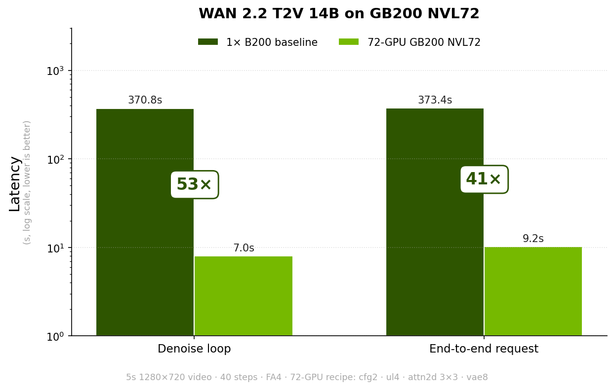
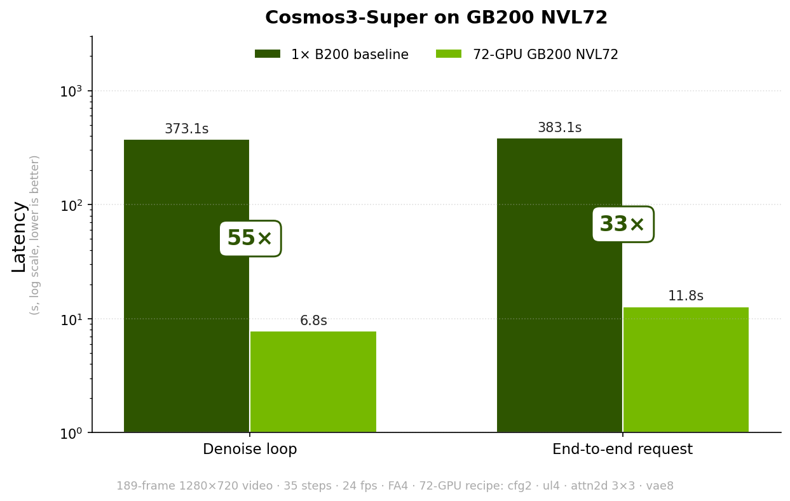
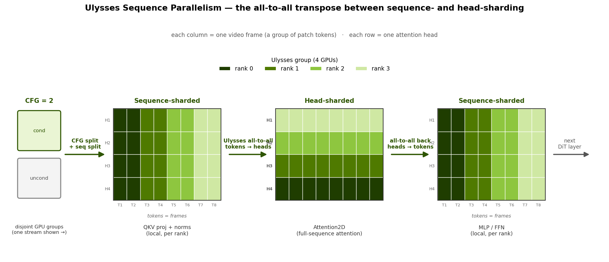
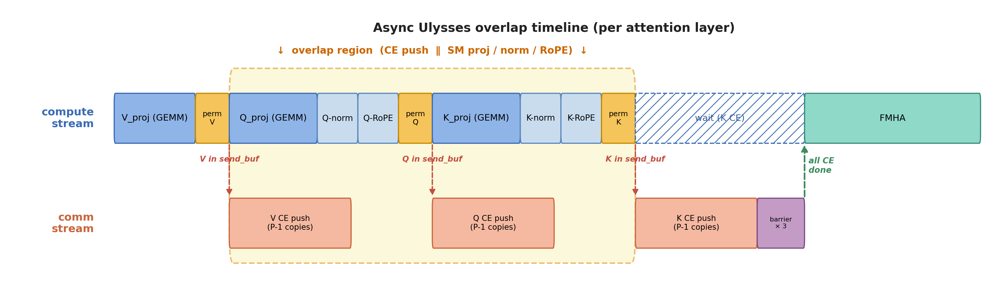
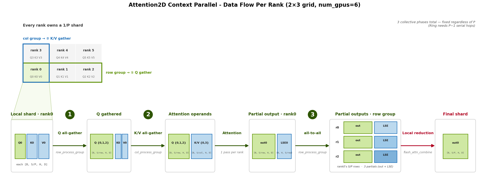
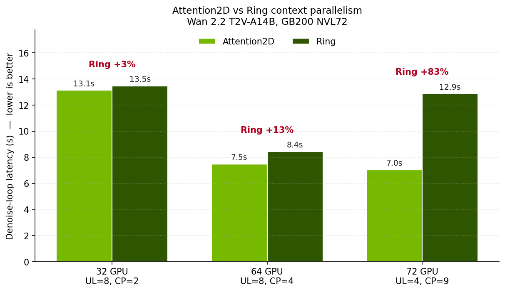
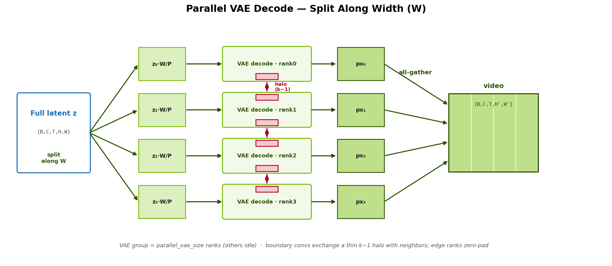
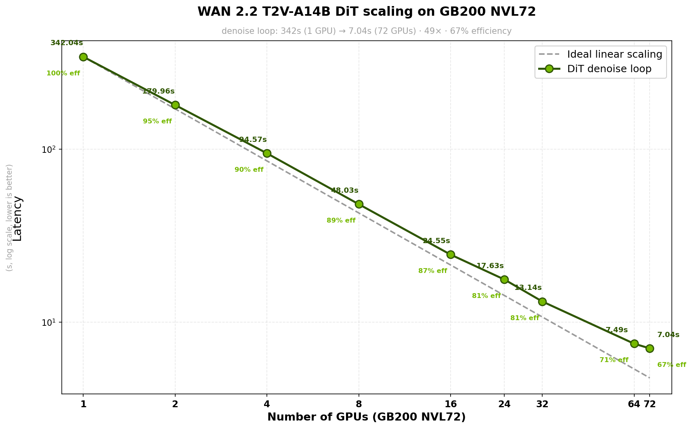
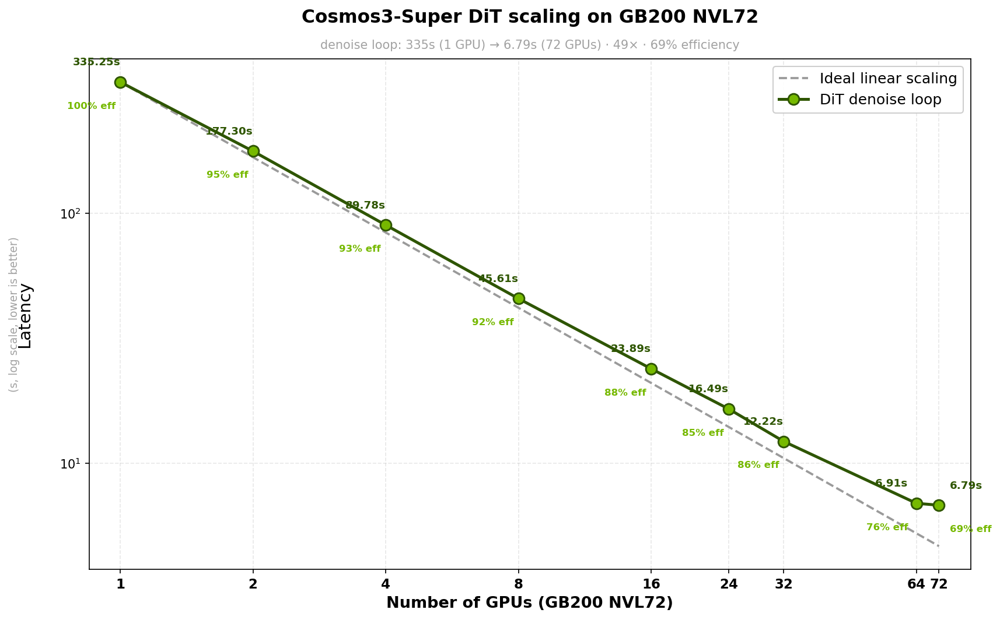

# Scaling Video Generation Across NVL72 rack with TensorRT-LLM

By NVIDIA TensorRT LLM Team

## Abstract

Modern Diffusion Transformer (DiT) video generation models such as [Wan 2.2 T2V-A14B](https://huggingface.co/Wan-AI/Wan2.2-T2V-A14B-Diffusers) and [Cosmos3-Super](https://huggingface.co/nvidia/Cosmos3-Super) model) are computationally expensive: generating a single 5-second 720p clip takes over five minutes. Almost all of that time is the DiT denoising loop, which runs tens of full forward passes, each over a 70-150k-token sequence. Unlike LLM decode, every denoising step in DiT is a "prefill" - classifier-free guidance (CFG) evaluates the transformer twice, and the VAE decoder has its own peak both in compute and in activation memory. At these sequence lengths, the dense bidirectional attention — quadratic in the sequence — dominates the per-step compute cost. Pipeline parallelism cannot amortize a single-step single-request workload. Tensor parallelism reduces per-layer compute effectively within a node but adds communication in every layer including the FFN. Sequence-parallel methods restrict communication to inside the attention operation and directly attack the dominant cost, which is why the sequence is the natural multi-node scaling axis.

This post describes how the `VisualGen` runtime in TensorRT-LLM scales the DiT denoising loop and the VAE decoder from a single NVIDIA B200 to a full GB200 NVL72 rack using techniques like \- **CFG**, **Ulysses parallelism**, **Ring Attention**, **Attention2D context parallelism**, and **parallel VAE** \- unified under a single PyTorch `DeviceMesh`. The first four shard the DiT's CFG streams and token sequence, while parallel VAE scales the decoder independently. All axes are declarative knobs on `ParallelConfig`; no model code changes are required to go from 1 GPU to 72\.

On Wan 2.2 T2V-A14B (a 5-second 1280×720 video, 40 steps), the `CFG=2 × Ulysses=4 × Attention2D 3×3` recipe shrinks the DiT denoising loop by **\~53×** going from a single NVIDIA B200 to a full GB200 NVL72 rack \- which in turn drives a **\~41× end-to-end** speedup. End-to-end trails the denoise speedup because of a fixed tail that stays constant as the DiT is sharded wider, setting the floor by Amdahl's law.

The same runtime carries over unchanged to Cosmos3-Super (a 64B Mixture-of-Transformers generating a 189-frame 1280×720 clip), where the identical `CFG=2 × Ulysses=4 × Attention2D 3×3` recipe delivers **\~49× on the denoise loop (\~29× end-to-end)** on the full GB200 NVL72 rack.

<p align="center">
  
  
</p>

<p align="center"><sub><em>Figure 1. The same VisualGen recipe scaling two models from a single GPU to a full GB200 NVL72 rack. Left: Wan 2.2 T2V-A14B (5-second 1280×720, 40 steps) \- ~53× on the DiT denoise loop, ~41× end-to-end. Right: Cosmos3-Super (189-frame 1280×720, 35 steps) under the identical `CFG=2 × Ulysses=4 × Attention2D 3×3` recipe.</em></sub></p>

## Table of Contents

- [The Scaling Challenge in Video Generation](#the-scaling-challenge-in-video-generation)  
- [CFG Parallelism](#cfg-parallelism)  
- [Ulysses Parallelism](#ulysses-parallelism)  
  - [Toward Async Ulysses: Overlapping Communication and Computation](#toward-async-ulysses-overlapping-communication-and-computation)  
- [Context Parallelism](#context-parallelism)  
  - [Ring Attention](#1-ring-attention)  
  - [Attention2D Context Parallelism](#2-attention2d-parallelism)  
- [Scaling the VAE Decoder](#scaling-the-vae-decoder)  
- [The Parallelism Mesh](#the-parallelism-mesh)  
- [NVL72 Scaling Results](#nvl72-scaling-results)
  - [Cosmos3-Super](#cosmos3-super)  
- [Serving with trtllm-serve](#serving-with-trtllm-serve)  
- [Quality Evaluation](#quality-evaluation)  
- [Conclusion](#conclusion)  
- [Picking the Right Configuration](#picking-the-right-configuration)  
- [Limitations and Future Work](#limitations-and-future-work)  
- [References](#references)
- [Acknowledgement](#acknowledgement)

---

## The Scaling Challenge in Video Generation

Video generation with a multi-step diffusion transformer has a distinctive compute profile. A single request runs the full transformer forward 30–50 times — once per denoising step — and each step attends over the entire spatiotemporal sequence from scratch: there is no KV cache and no amortization across steps. For [Wan-AI/Wan 2.2 T2V-A14B](https://huggingface.co/Wan-AI/Wan2.2-T2V-A14B-Diffusers) generating a 5-second 1280×720 video, that is roughly **72k DiT tokens** per step of dense, bidirectional self-attention, repeated across 40 steps\*. Even on a single NVIDIA B200 GPU, this could take several minutes generating a 5s clip.

At 72k tokens per step, dense bidirectional self-attention — quadratic in sequence length, with no causal mask — dominates the per-step compute cost whereas the FFN, norms, and modulation scale linearly with sequence length; attention does not. By contrast, LLM inference can keep per-step attention cost bounded: at decode, given sequence length N, the KV cache reduces each step to O(N) against a fixed cached context; even at prefill, the full O(N²) is paid once over sequences that are typically far shorter than 72k tokens. In DiT inference, O(N²) is paid on every denoising step at full length, with no caching. The **sequence** is therefore the natural axis to shard — the attention matrix is a full, unmasked N×N block — so the sequence and workload can divide cleanly across GPUs in ways that causal, triangularly-masked attention cannot. A second natural axis is CFG: classifier-free guidance evaluates the transformer twice per step — conditional and unconditional — sharing no state between the two passes, so the two evaluations can run on disjoint GPU groups in parallel.

Tensor parallelism is a natural fit for reducing per-layer memory and compute: it partitions weight matrices across GPUs and runs efficiently over fast intra-node interconnects. TRT-LLM VisualGen supports TP and it becomes more important as models grow (head counts climb to 40 in Wan 2.2 A14B model to 64 in [nvidia/Cosmos3-Super](https://huggingface.co/nvidia/Cosmos3-Super) model). Its tradeoff is communication cost across the full model: TP adds a collective in every layer, including the FFN. When attention dominates the per-step cost — as it does at 72k tokens — sequence-parallel methods are a better fit, because they restrict communication to inside the attention operation and let FFN, norms, and modulation run on the local sequence shard with no collective overhead.

Pipeline parallelism, on the other hand, is a poor fit for a different reason. PP hides its inter-stage communication by microbatch pipelining, but that only pays off with many requests in flight. Video generation here is latency-bound on a single request at a time, so at any moment all but one pipeline stage would sit idle. Hence, PP buys no speedup on the metric that matters for these workloads.

This post focuses on the sequence and CFG axes as the primary multi-node scaling story; TP composes with all of them and is out of scope here due to its relatively poor efficiency across multiple nodes. 

Finally, the VAE decoder at the end of the loop has its own activation-memory peak that is *larger* than any single DiT step's activation footprint, and lives outside the transformer entirely.

To summarize, this post adopts the parallelism strategy below to scale video generation:
  - **CFG parallelism** splits the conditional and unconditional prompts onto disjoint GPU groups \- two perfectly parallel prefills with one small all-gather at the combine step.  
  - **Sequence parallelism** (Ulysses, Ring, Attention2D) shards the spatiotemporal sequence across GPUs and pays for it with collectives only inside the attention layer; the FFN, norms, and modulation run sequence-sharded for free.  
  - **Parallel VAE** spatially shards the decoder so the post-DiT decode peak does not become the new bottleneck after the DiT itself has been scaled out.

The rest of this post walks through each of these axes first, then shows how they compose into a single PyTorch `DeviceMesh` built from declarative knobs on `ParallelConfig` \- and how the same configuration scales from a single NVIDIA B200 to a full GB200 NVL72 rack. 

<sub>\* This post targets multi-step diffusion transformers; step-distilled diffusion models and autoregressive video models are out of scope. See - [Limitations and Future Work](#limitations-and-future-work)</sub>

## CFG Parallelism

Classifier-Free Guidance evaluates the diffusion transformer twice per denoising step \- once with the positive prompt embedding to produce `noise_cond`, once with the negative prompt embedding to produce `noise_uncond` \- and combines the two predictions as

```
noise = noise_uncond + guidance_scale * (noise_cond - noise_uncond)
```

The two evaluations share weights, timestep, and shape, so they are perfectly parallelisable across two disjoint GPU groups. CFG parallelism exploits this by setting `cfg_size = 2`: the conditional stream runs on one half of the mesh and the unconditional stream on the other half. Each half runs its full DiT forward end to end with no cross-stream communication; only the two scalar noise tensors meet at the combine step.

`cfg` is the outermost mesh dimension, so each half of the GPUs runs one stream end to end and loads only its own (conditional or unconditional) prompt embedding. The two halves meet just once per step: a single all-gather over the CFG group exchanges the local `noise_pred`, after which every rank holds both predictions and applies the combine locally. Extra guidance streams (e.g. STG, modality conditioning) reuse the same all-gather \- one collective per stream.

**The net effect is a near-2x per-step latency reduction** for the cost of 2x weight replication and a single per-step all-gather over a 2-rank group \- small enough that the collective is bandwidth-bound, not latency-bound, and overlaps essentially perfectly with the post-combine scheduler step on each rank. Turning on `cfg_size=2` alone, with no other parallelism, nearly halves latency:

| Config | GPUs | Denoise | End-to-end | Speedup |
| :--- | ---: | ---: | ---: | ---: |
| `cfg1` (single stream) | 1 | 342.04s | 346.16s | 1.0× |
| `cfg2` (CFG parallel) | 2 | 179.96s | 183.01s | **1.90× / 1.89×** |

That near-linear scaling makes CFG the cheapest scaling axis available, and the one worth spending GPUs on *before* widening a sequence-parallel axis. On a 72-GPU rack, moving a 2x factor onto CFG (`cfg2·ulysses4·cp9`) rather than Ulysses (`cfg1·ulysses8·cp9`) cuts the denoise loop from 7.57s to 7.04s \- **\~7.5% faster on the denoise loop (\~6% end-to-end)** \- and CFG composes with every other axis (Ulysses, Attention2D, Ring, parallel VAE) unchanged.

## Ulysses Parallelism

The key insight behind Ulysses ([arXiv:2309.14509](https://arxiv.org/abs/2309.14509)) is that outside the attention operation, activations are already sharded across GPUs along the sequence axis — each rank holds `[B, S/P, H, D]` (`P` is the sequence-parallel degree), and FFN, norms, and modulation all run locally on that shard with no communication. The problem is that standard attention is inherently global: a query at position `i` needs to see all keys and values across the full sequence length. Ulysses solves this by swapping the sharding axis just for the attention operation. A pair of all-to-alls converts `[B, S/P, H, D]` → `[B, S, H/P, D]` before attention and back again after, so each rank sees the full sequence but only a `1/P` slice of heads. The FFN and everything else never touch a collective (unless composed with an FFN-sharding scheme like TP, which adds its own).

<p align="center">
  
</p>

<p align="center"><sub><em>Figure 2. Ulysses keeps every stage except attention sequence-sharded \- each rank owns a slice of the video frames (all heads), so QKV projection, norms, and the MLP run locally with no collective. A pair of all-to-alls transposes the layout to head-sharded (each rank owns all frames but a `1/P` slice of heads) just for the full-sequence attention, then transposes back for the MLP.</em></sub></p>

**Fused vs. unfused QKV all-to-all.** Before the input all-to-all, Q, K, and V have been computed by the QKV projection and sit in memory as three separate `[B, S/P, H, D]` tensors. They need the same collective pattern over the same process group, so there are two ways to send them:

- **Unfused (3 collectives):** issue a separate `all_to_all_4d` for Q, then K, then V. Simple, and works with any inner backend since the result lands as three independent tensors the backend can read directly.  
- **Fused (1 collective):** pack Q, K, V into a single `[B, S/P, 3, H, D]` buffer and exchange it in one `all_to_all_5d`. Requires the inner backend to accept a stacked QKV input.

The two paths transfer exactly the same bytes over the wire — the bandwidth cost is identical. The difference is in **launch overhead**: each NCCL collective is its own kernel launch with its own staging and stream synchronization, so cutting from three collectives to one removes two of those serialization points on the critical path. At the small per-rank tensor sizes and batch sizes of DiT inference this is a measurable win, particularly when Ulysses is running across many layers per denoising step.

The stacked QKV buffer produced by the all-to-all is a single contiguous allocation; the inner backend can apply a single pass FP8 cast before the attention kernel rather than launching three separate casts on three separate tensors. For a workflow that runs QKV in BF16 but wants to feed the attention kernel in FP8, the fused path cuts the quantization overhead by roughly 3×. The resulting FP8 QKV also lands in a layout that can be passed directly into the attention kernel without an intermediate copy, keeping the memory footprint tight.

**Communication cost.** Ulysses parallelism involves **only two all-to-all communications per layer, regardless of sequence length**. For a sequence length `N` and `P` GPUs, each GPU sends a data chunk of size `O(N/P²)` to each of the other `P-1` GPUs. This leads to a communication cost of `O(N/P)`.

**Limitation.** Ulysses sequence parallelism is constrained by the model’s attention head count: the Ulysses degree `P` must not exceed the head count `num_heads` and must evenly divide `num_heads`; to use all GPUs in an NVL72 system uniformly, `P` must also divide 72\. For Wan2.2‑T2V‑A14B with `num_heads = 40`, this constraint makes `P = 8` the largest feasible Ulysses degree on NVL72.

### Toward Async Ulysses: Overlapping Communication and Computation

<p align="center">
  
</p>

<p align="center"><sub><em>Figure 3. Async Ulysses moves the Q/K/V all-to-all onto the GPU's Copy Engines on a separate stream and pipelines it V→Q→K, so each tensor's cross-rank transfer overlaps the next tensor's projection compute (V's transfer hides under Q's compute, Q's under K's), hiding the collective latency behind useful work.</em></sub></p>

The current Ulysses implementation issues the input all-to-all synchronously — the compute stream idles for the full duration of the collective before the attention kernel starts. At WAN-scale sequence lengths with `ulysses_size = 4` on NVIDIA B200, each all-to-all runs roughly 1-2ms. Across 40 attention layers and 40 denoising steps, that idle time adds up. Async Ulysses saves the idle time by running the V/Q/K cross-rank exchange on a dedicated side stream concurrently with the next V/Q/K's compute on the default stream. It is opt-in via `async_ulysses: true` in `parallel_config`, and applies to peers that are reachable over NVLink via CUDA IPC.

**Design**

- **Use Copy Engine for peer-to-peer communication.** The P2P data movement runs on the GPU's Copy Engines (CE) instead of SM-resident NCCL kernels. NCCL collectives occupy SMs and would compete with the next Q/K/V projection, normalization, and RoPE for compute resources; CEs and SMs are physically disjoint hardware, so comm and compute can truly run in parallel.
- **Write the local chunk directly, skip the CE.** A fused pre-exchange kernel handles the permute and writes the local rank's own chunk directly via HBM, avoiding a local D2D copy through the CE's local channel whose limited bandwidth would otherwise become the critical path.
- **Communication and computation on separate streams.** The two lanes run on independent CUDA streams, synchronized by lightweight events at each Q/K/V issue point, so they execute in parallel rather than blocking each other on the same stream.
- **V → Q → K rolling pipeline.** V is issued first because it has the lightest pre-exchange compute (no normalization, no RoPE) — its compute finishes earliest, which lets the first CE push kick off as early as possible and starts the comm/compute overlap right away. From there each transfer hides under the next slot's compute: V's push overlaps Q's compute, and Q's push overlaps K's compute. K, issued last, has no follow-up compute to hide behind, so the default stream waits for the K transfer (and final barrier) before attention starts.  
- **Symmetric-memory buffers and barriers for cross-rank exchange.** A small ring of CUDA-IPC-backed symmetric-memory buffers holds the per-V/Q/K receive slots, with peer-writable pointers exchanged once at startup. Barriers are deferred to the end of all three V/Q/K pushes — the transfers stream through the CE back-to-back without intervening fence kernels, and the default stream sees a fully-synced receive buffer before attention starts.

**Speedup:**

*B200 Isolated all-to-all.* Single-tensor all-to-all latency, `B=2, S_total=6144, H=32, D=128`, warmup=30, bench=100.

| Ulysses Size | Fused QKV 5D all-to-all | Split QKV 3x 4D all-to-all | Async Ulysses Pipeline |
| :---- | :---- | :---- | :---- |
| 4 | 419 µs (1.00×) | 483 µs (0.87×) | **339 µs (1.24×)** |
| 8 | 251 µs (1.00×) | 294 µs (0.85×) | **194 µs (1.29×)** |

*B200 End-to-end.* OFF vs ON = async Ulysses disabled vs enabled.

WAN 2.2 T2V-A14B, 720×1280, 80 frames, 40 steps, NVFP4:

| World size | Ulysses | CFG | Async off e2e (s) | Async off denoise (s) | Async on e2e (s) | Async on denoise (s) | E2E Δlatency | Denoise Δlatency |
| ----: | ----: | ----: | ----: | ----: | ----: | ----: | ----: | ----: |
| 2 | 2 | 1 | 206.731 | 203.31 | 198.311 | 194.89 | **−4.07%** | **−4.14%** |
| 4 | 2 | 2 | 103.031 | 100.46 | 100.504 | 97.93 | **−2.45%** | **−2.55%** |
| 8 | 4 | 2 | 55.444 | 53.28 | 54.114 | 51.95 | **−2.40%** | **−2.48%** |


## Context Parallelism

### 1\. Ring Attention

Like Ulysses, Ring attention ([arXiv:2310.01889](https://arxiv.org/abs/2310.01889)) shards the spatiotemporal sequence so each rank holds `[B, S/P, H, D]` and FFN, norms, and modulation run on that shard with no communication. The difference is how attention itself is made global: Ulysses swaps to head sharding inside the attention layer, which caps the parallel degree at the number of attention heads. **Ring has no head-count ceiling** \- the ring degree `P` can exceed `num_heads`, which makes it the lever required for pushing sequence parallelism past the Ulysses limit on a given GPU count.

**K/V blocks rotate; Q stays put.** Each rank keeps its local query shard resident and passes key/value blocks around a ring of `P` GPUs. Over `P` steps, the rank computes partial attention of its local Q against whichever K/V block it currently holds, then merges the result into a running output. After `P` steps, every query position has attended over every key/value in the full sequence:

```
Rank r holds Q_r (fixed) and K/V block for step i

  step 0:  attn(Q_r, K_r, V_r)  --isend/irecv-->  K/V from rank r+1
  step 1:  attn(Q_r, K_{r+1}, V_{r+1})  --isend/irecv-->  ...
     ...
  step P-1: attn(Q_r, K_{r-1}, V_{r-1})   (no exchange on final step)

  running output merged after each step  -->  final O_r
```

**Online-softmax merge.** Each step yields a partial output and a log-sum-exp (LSE) statistic; [`RingAttention`](https://github.com/NVIDIA/TensorRT-LLM/blob/163be837f3e82d092eb33704747a93fb419e7099/tensorrt_llm/_torch/visual_gen/attention_backend/parallel.py) merges them with a streaming softmax recurrence in **fp32**, block by block, until the result matches one global attention pass.

**Overlapping communication and compute.** The K/V exchange for the next block is posted with non-blocking point-to-point (`batch_isend_irecv`) *before* the current block's FA4 kernel runs, so the neighbor transfer overlaps with attention compute. Even ranks send-then-recv and odd ranks recv-then-send to avoid deadlock; the final ring step skips the exchange entirely.

**Communication cost.** Ring pays `P-1` neighbor exchanges per attention layer, and communication volume scales as `O(N)` in sequence length `N` — more sequential steps than Ulysses. Each ring step also runs a partial FA4 pass plus an online-softmax merge, so attention work grows with ring degree `P`, not just communication. The upside is flexibility: **no head-count ceiling**, a simple 1D topology, and straightforward composition with Ulysses on the same mesh (`cp_size × ulysses_size`). P2P can overlap with compute, which keeps Ring competitive at small `P` and short sequences. For production video lengths, though, we **generally prefer Attention2D** (detailed in the next section) for the context-parallel axis, owing to its lower communication cost – O(N/√P) versus O(N) for Ring attention.

### 2\. Attention2D Parallelism

Attention2D parallelism ([arXiv:2503.15758](https://arxiv.org/abs/2503.15758)) treats the `P` context-parallel GPUs as a logical 2D grid of `row_size × col_size` workers. It is our preferred **context-parallel strategy** once Ulysses has consumed the head-divisible fraction of the mesh and more GPUs remain. Like Ring, it shards the spatiotemporal sequence with **no head-count ceiling** — any `row_size × col_size` grid is valid regardless of how many attention heads the DiT has. It also **generalizes 1D context parallelism** \- setting `col_size`\=1 reduces to the no-merge scheme (all-gather K/V), while setting `row_size`\=1 reduces to the merge scheme (all-gather Q). \- and **scales the CP degree better**, gathering only `S/√P` per axis (`O(N/√P)` communication) on a symmetric grid, which suits long-sequence DiT inference. The runtime adapts the original Attention2D design from causal LLM training to **full bidirectional** DiT inference.

**Gather phase: Q along rows and K/V along columns.** Ranks form a `row_size × col_size` grid (`P = row_size × col_size`). Each rank starts with a `1/P` shard of all three tensors — `Q_i, K_i, V_i`, each `[B, S/P, H, D]`. Attention2D then runs two all-gathers on the two independent grid axes:

- **Q gather** over the **row group** (`row_process_group`): the `col_size` ranks that share a row. Concatenates their `Q_i` → every member holds `[B, S/row_size, H, D]`. K/V are untouched.  
- **K/V gather** over the **column group** (`col_process_group`): the `row_size` ranks that share a column, fused into a single collective. Concatenates their `K_i`/`V_i` → every member holds `[B, S/col_size, H, D]`. Q is untouched.

So **Q expands by `col_size`** (a row holds `col_size` ranks → `S/row_size`) and **K/V expand by `row_size`** (a column holds `row_size` ranks → `S/col_size`); on a symmetric `√P × √P` mesh both land at `S/√P`. The picture below uses a `2 × 3` grid (`row_size=2, col_size=3`, `P=6`), with `S` split into shards `0..5`:

<p align="center">
  
</p>

<p align="center"><sub><em>Figure 4. Attention2D data flow traced for rank0 on a `2×3` grid (`row_size=2, col_size=3, P=6`). Each rank starts with a `1/P` shard; ① an all-gather over the `row_process_group` collects Q, ② an all-gather over the `col_process_group` collects K/V, giving each rank the `[B, S/row, H, D]` queries × `[B, S/col, H, D]` keys it attends in one pass to produce a single partial output (with its LSE). The row group's ranks share the same Q but attend over disjoint K/V slices, so ③ an `all_to_all` over the `row_process_group` exchanges those partials, then a local `flash_attn_combine` reduction merges them into the final `[B, S/P, H, D]` shard.</em></sub></p>

Members of a **row (Q) group** end up with identical Q but **disjoint** K/V slices; members of a **column (K/V) group** share identical K/V but hold different Q.

**Local Attention.** The inner backend ([`Attention2DAttention`](https://github.com/NVIDIA/TensorRT-LLM/blob/163be837f3e82d092eb33704747a93fb419e7099/tensorrt_llm/_torch/visual_gen/attention_backend/parallel.py)) runs attention with LSE returning a partial output `[B, S/row_size, H, D]` and a log-sum-exp (LSE) statistic `[B, H, S/row_size]`. The LSE records the softmax normalizer for that partial pass.

**Merge phase.** The `col_size` ranks that share the same Q each attended over a **disjoint slice of K/V** (above: ranks `0`, `1`, `2` all hold queries `{0,1,2}` but keys `{0,3}`, `{1,4}`, `{2,5}` respectively). Their FA4 outputs are partial results for the **same query positions** over **complementary key spans**, so they must be combined **within that row group** to recover the full softmax. For `col_size = 3`, the partial results are spread across 3 GPUs. These are combined into the final output as follows: 

1. **`all_to_all_single`** over the `row_process_group` exchanges output and LSE chunks among the `3` ranks.  
2. **`flash_attn_combine`** merges the `3` received `(output, LSE)` pairs in one batched kernel, producing the fully reduced `[B, S/P, H, D]` shard that matches the input layout.

**Difference from Ring:**

|  | Ring | Attention2D |
| :---- | :---- | :---- |
| **Q communication** | None. All required Q tokens  available locally. | `O(N / √P)` data all-gathered among `col_size` ranks within a row group |
| **K/V communication** | `O(N)` data exchanged among all `P` ranks in a P2P fashion | `O(N / √P)` data all-gathered among `row_size` ranks within a column group |
| **Partials** | `P` blocks, one per ring step, each against a rotating K/V shard | `N = col_size` partials from the row (Q) group, each over a disjoint slice of K/V |
| **Merge schedule** | **Streaming** — merge after every FA4 step, in-place on the local rank (`sigmoid` / `logsigmoid` recurrence) | **Batch** — one FA4 pass, then a single `flash_attn_combine` after the row `all_to_all` |
| **Merge communication** | None (all local) | One **`all_to_all`** of size `O(N / √P)` on output+LSE within the row group (fixed collectives, no per-hop wait tail) |
| **Attention passes** | `P` partial FA4 kernels | **1** FA4 kernel per rank |
| **Compute–communication overlap** | Computation and communication overlap | Computation and communication currently run in separate phases (no overlap) |
| **Communication cost** | `O(N)` | `O(N / √P)` |
| **Scaling** | No scaling: communication cost remains constant as `P` increases | Efficient scaling: communication cost decreases as `O(1 / √P)` as `P` increases |

**Communication cost.** Across the full layer, Attention2D runs three collective phases: Q all-gather (row), K/V all-gather (column), and output+LSE all-to-all (row). On a symmetric mesh (`row_size ≈ col_size ≈ √P`), moved volume scales as **`O(N / √P)`** in sequence length `N`, compared to **`O(N)`** for Ring — the same head-count freedom, but better communication scaling and one attention pass instead of `P`.

<p align="center">
  
</p>

<p align="center"><sub><em>Figure 5. Denoise-loop latency for Attention2D vs Ring on GB200 NVL72 (Wan 2.2 T2V-A14B, 5-second 1280×720 video, 40 steps). `cfg=2` is fixed. Attention2D scales favorably with increasing context-parallel degree — its communication cost reduces as O(1 / √P) while Ring Attention's remains flat at O(1), for a fixed sequence length N  — yielding progressively larger latency gaps of +3% at CP=2, +13% at CP=4, and +83% at CP=9. Ring Attention suffers a sharp latency regression at 72 GPUs: to evenly divide the 36 available GPUs per cfg replica, the Ulysses parallelism degree (UL) must be reduced from 8 to 4, which increases communication volume along the CP axis. This amplifies Ring Attention's latency, as its communication cost scales as O(N). Attention2D is far less sensitive to the increased communication volume because its cost scales as O(N / √P), allowing the higher parallelism degree to offset the additional volume.</em></sub></p>

## Scaling the VAE Decoder

After the DiT denoising loop finishes, a single latent tensor still has to be turned into pixels by the VAE decoder. When the DiT is scaled out to 72 GPUs as on a GB200 NVL72 rack, the denoising loop runs in a fraction of its single-GPU time, but an unsharded VAE decode still runs on a single rank \- so VAE decoding becomes a non-trivial performance bottleneck in the whole pipeline. Parallel VAE removes that serial tail.

**Spatial sharding.** Unlike the DiT \- which shards the *token sequence* \- the VAE is a convolutional UNet-style stack that operates on a `(B, C, T, H, W)` video tensor, so the natural axis to split is **image space**. `parallel_vae_split_dim` selects height or width, and the latent (decode) or video (encode) tensor is chunked along that dimension across the `parallel_vae_size` ranks. Each rank owns a `1/P` spatial slice and decodes it locally; a single all-gather at the end reconstructs the full frame:

<p align="center">
  
</p>

<p align="center"><sub><em>Figure 6. Parallel VAE decode. The full latent is split along an image-space axis (`W` here) into `1/P` slices across the `parallel_vae_size` VAE-group ranks (the rest idle); each rank decodes its slice locally — boundary convolutions exchange only a thin `k−1` "halo" with their neighbors (edge ranks zero-pad), and attention blocks gather the full split dimension — then a final all-gather reconstructs the full video.</em></sub></p>

**Convolutions need their neighbors: Halo Exchange.** A spatial split breaks every convolution at the chunk boundary \- a `k x k` conv needs `k-1` rows/columns that now live on the adjacent rank. Instead of gathering the whole activation, each conv exchanges only the thin boundary "halo" with its neighbors, runs, then strips the extra output; boundary ranks zero-pad. The halo is tiny and kernel-sized, so per-conv communication stays small regardless of activation size. VAE attention blocks, being global, instead gather along the split dimension before attention and re-shard afterward.

**The VAE's parallel degree is chosen independently of how the DiT is sharded.** `parallel_vae_size` sets the VAE's width without matching the CFG, Ulysses, or context-parallel degrees \- independence of degree, not hardware, since the VAE decodes on a subset of the same GPUs. A separate knob is needed because the VAE saturates far earlier than the DiT, and because the split dimension must divide the few latent rows/columns evenly, which a large `world_size` rarely does.

This yields two regimes:

- **Single node (`world_size <= 8`)** \- `parallel_vae_size == world_size`; every rank decodes (e.g. the 8-GPU Wan 2.2 example pairs `cfg_size=2, ulysses_size=4` with `parallel_vae_size=8`).  
- **Multi-node (`world_size > 8`, e.g. NVL72)** \- the DiT scales to all 72 ranks but `parallel_vae_size` stays at its ceiling (\~8); the VAE decodes on that subset while the rest idle.

**Measured impact.** On the full 72-GPU recipe the denoising loop is only **7.04s**, but a rank-0-only decode adds **\~2.7s** \- after the DiT has already been scaled out \~53x, **\~25% of the 11.1s end-to-end request** is now spent in a single-rank VAE. Sweeping `parallel_vae_size` shows why a separate VAE knob matters: the first few doublings nearly halve decode latency, then returns flatten as the VAE runs out of spatial work to split and per-rank halo/all-gather overhead starts to dominate. Setting `parallel_vae_size=8` cuts decode to **\~0.8s** (**3.3x faster, a 69% reduction**), shrinking end-to-end to **9.2s** (**1.2x, \-17%**) and dropping the VAE's share to **\~9%**. The VAE saturates at this width \- `parallel_vae_size=16` measures no faster \- which is why the multi-node recipe caps the VAE at \~8 ranks.

*Decode scaling curve* \- the full sweep, decode-only:

| `parallel_vae_size` | VAE decode | Decode speedup |
| :--- | ---: | ---: |
| 1 (unsharded) | 2.72s | 1.00× |
| 2 | 1.72s | 1.58× |
| 4 | 1.04s | 2.62× |
| 8 | 0.83s | **3.28×** |
| 16 | 0.85s | 3.20× |

*End-to-end impact* \- on the full 72-GPU NVL72 recipe:

| NVL72 recipe | VAE decode | VAE share of E2E | End-to-end | E2E speedup |
| :--- | ---: | ---: | ---: | ---: |
| `parallel_vae_size=1` (unsharded) | 2.72s | 24.5% | 11.08s | 1.00× |
| `parallel_vae_size=8` | 0.83s | 9.0% | 9.20s | **1.20×** |


## The Parallelism Mesh

All five parallelism axes \- CFG, TP, Ulysses, context parallelism, and the parallel-VAE slice \- live on a single PyTorch `DeviceMesh` built once at startup by `VisualGenMapping` (in [`mapping.py`](https://github.com/NVIDIA/TensorRT-LLM/blob/163be837f3e82d092eb33704747a93fb419e7099/tensorrt_llm/_torch/visual_gen/mapping.py)). The user only sets the per-axis sizes on `ParallelConfig`; every per-axis process group (`cfg_group`, `ulysses_group`, `cp_group`, `attn2d_row_group`, `attn2d_col_group`, `vae_group`, ...) is derived from that one mesh and cached, so different layers \- Linear, attention, VAE \- all see consistent NCCL communicators.

The total world size is just the product of the axes:

```
world_size = cfg_size  x  tp_size  x  cp_size  x  ulysses_size

cp_size = ring_size                                 (Ring attention)
          OR attn2d_row_size x attn2d_col_size      (Attention2D, 2D tile)
```

The mesh axis order is fixed as **`cfg - tp - cp - ulysses`** regardless of CP mode. For Attention2D, `cp_size = attn2d_row_size × attn2d_col_size`, and dedicated **row** and **column** process groups are derived from the rank layout for Q vs K/V gathers:

```
Ring:          cp = ring_size
Attention2D:   cp = attn2d_row × attn2d_col   (+ row_group, col_group subgroups)
```

The ordering is deliberate: **Ulysses is innermost, CFG is outermost**, decided by how *sensitive* each axis's communication pattern is to the uniformity of the interconnect (TP not shown here as it is out-of-scope for this post):

- **Ulysses (innermost)** wraps CP, so its **all-to-all** fires first and moves only `≈ A/(UL·CP)` per rank (`A = S·H`) — the *least* traffic of the three — yet it is the most bisection-bandwidth-hungry, topology-fragile collective there is: every rank exchanges with every other rank in the group, so the transfer is gated by the *slowest* pairwise link, and it is a single blocking step on the attention critical path. So even though it is the lightest axis, the entire Ulysses group has to live on a single fast, fully-connected fabric, because one slow hop drags down the whole exchange. This only matters on **heterogeneous** topologies that mix NVLink with a slower fabric — e.g. an 8-GPU/node cluster consisting of intra-node NVLink but inter-node InfiniBand with `ulysses_size > 8` would push the all-to-all onto the slow links. On a uniform NVLink domain like GB200 NVL72 every pair is NVLink-connected, so a Ulysses group can span all 72 GPUs at full bandwidth.
- **Context parallelism (middle)** moves more per rank than Ulysses, but how much depends on the backend. **Ring** moves `≈ A/UL` — because each rank relays the full K/V around the ring over its `CP−1` point-to-point steps, exchanging only with its two neighbors (never a full-group all-to-all). **Attention2D** moves just `≈ A/(UL·√CP)` — since its K/V all-gather is confined to a `√CP`-rank row/column subgroup, a factor `√CP` lighter than a full-group all-to-all. Both patterns are **boundary-tolerant**: heavier in bytes than Ulysses, but far less fragile than its all-to-all. And on a uniform fabric like GB200 NVL72, Ulysses' fit-within-NVLink constraint goes away entirely, so making CP the innermost axis (to favor its larger volume) becomes a reasonable alternative — one we leave to future work.
- **CFG (outermost)** only recombines the conditional/unconditional branches once per denoising step - a tiny reduction a few dozen times for the entire generation, so it can afford the slowest inter-node / inter-rack fabric.

This maps onto hardware through the rank layout. PyTorch lays out global ranks row-major over `mesh_shape` (leftmost dim varies slowest, rightmost varies fastest), so making Ulysses the **fastest-varying** axis means ranks that share `(cfg, tp, cp)` get *consecutive* IDs. A launcher that binds ranks contiguously per node then realizes the placement above for free — each axis lands on the fabric it needs without any manual rank-to-GPU mapping.

The VAE is handled separately from the denoiser axes. Instead of being carved from the denoiser mesh, its group is built by **overlaying a fresh device group on top of the existing world** (the `cfg × tp × cp × ulysses` mesh), which lets VAE parallelism scale independently of the DiT (see [Scaling the VAE Decoder](#scaling-the-vae-decoder) above). Its one constraint is that the VAE ranks fit within a single CFG group, or span the whole world: after the guidance combine the latent handed to the decoder lives on a single CFG branch, so a VAE group straddling both branches would mix the conditional and unconditional copies and its gather/halo collectives would be incoherent.

For the full property catalog (every `*_group`, `*_rank`, the flattened `seq_mesh`, and the `to_llm_mapping()` bridge that lets Linear layers reuse the LLM TP path), see [`mapping.py`](https://github.com/NVIDIA/TensorRT-LLM/blob/163be837f3e82d092eb33704747a93fb419e7099/tensorrt_llm/_torch/visual_gen/mapping.py).

## NVL72 Scaling Results

All performance numbers in this section use the same measured workload and publish one distributed recipe: `examples/visual_gen/configs/wan22_t2v_bf16_gb200_nvl72.yml`.

| Item | Value |
| :--- | :--- |
| Model | [`Wan-AI/Wan2.2-T2V-A14B-Diffusers`](https://huggingface.co/Wan-AI/Wan2.2-T2V-A14B-Diffusers) |
| Hardware | GB200 NVL72 |
| Request shape | 5-second 1280×720 video (`num_frames=80`\* at 16 fps) |
| Denoising steps | 40 |
| Precision | BF16 |
| Attention backend | FA4 |
| Guidance scale | 5.0 |
| Benchmark load | 3 prompts, single-stream |

<sub>\* We request 80 frames rather than Wan's native 81 because of the sequence-parallel divisibility constraint: Wan's temporal VAE maps 81 frames to 21 latent frames which does not divide evenly across the context-parallel degrees in the sweep, while 80 frames gives 20 latent frames which gives a sequence length cleanly divisible by different CP. This is a benchmarking convenience, not a hard limit — 81 frames can be easily supported by padding a few tokens at the framework level (see [Limitations and Future Work](#limitations-and-future-work)).</sub>

Throughout this section we report two metrics. **Denoise loop** is the DiT denoising time — the work that the parallelism axes actually shard. **End-to-end request** is the full per-request latency measured at the serving endpoint, which adds the fixed tail that does not shrink as the DiT is sharded wider: text encoding and VAE decode plus mp4 encode and request/transport overhead.

The headline result is summarized in [Figure 1](#scaling-video-generation-across-nvl72-rack-with-tensorrt-llm) at the top of the post; the underlying numbers are:

| Metric | 1× B200 baseline | 72-GPU GB200 NVL72 | Speedup |
| :--- | ---: | ---: | ---: |
| Denoise loop | 370.8s | 7.04s | 52.7× (~53×) |
| End-to-end request | 373.35s | 9.20s | 40.6× (~41×) |

Sweeping the best recipe at every width on GB200 NVL72 shows the DiT denoise loop scaling almost linearly across the full rack:

<p align="center">
  
</p>

<p align="center"><sub><em>Figure 7. DiT denoise-loop scaling on GB200 NVL72 (best config at each width, GB200 1-GPU baseline). The loop tracks ideal linear scaling closely \- ~49× at 72 GPUs \- because CFG and sequence parallelism shard the transformer almost perfectly.</em></sub></p>

Crucially, that ~67% efficiency at full-rack scale is only reachable with **Attention2D**. Once Ulysses hits WAN's head-divisibility wall (`ulysses_size ≤ 8` for 40 heads), the residual GPUs have to go into a context-parallel axis \- and Attention2D is the only one that holds up at NVL72 scale. At 72 GPUs, `cfg2·ul4·attn2d 3×3` lands at **~67% efficiency**, while the equivalent `cfg2·ul4·ring9` collapses to **~37% efficiency** \- **83% slower at the same GPU count**. Attention2D's fixed `O(N/√P)` row/column collectives keep scaling all the way across the rack (see [Figure 5](#2-attention2d-parallelism)).

The full recipe behind these numbers is shown below:

```yaml
attention_config:
  backend: FA4
parallel_config:
  cfg_size: 2            # CFG: conditional / unconditional streams on disjoint halves
  ulysses_size: 4        # Ulysses sharding
  attn2d_size: [3, 3]    # Attention2D context parallelism (row × col)
  parallel_vae_size: 8   # spatial VAE sharding (saturates at ~8)
compilation_config:
  resolutions:
    - [720, 1280]        # warmup at the benchmarked shape (request size 1280x720)
  num_frames:
    - 80                 # 5-second clip at 16 fps
```

### Cosmos3-Super

The same runtime scales a very different model unchanged. Cosmos3-Super is a 64B Mixture-of-Transformers with 64 attention heads, generating a longer 189-frame clip — so each denoising step is an even larger dense prefill than Wan. Only the workload and the per-width recipe change; the CFG, Ulysses, Attention2D, and parallel-VAE knobs are identical (`examples/visual_gen/configs/cosmos3_t2v_bf16_gb200_nvl72.yml`)

| Item | Value |
| :--- | :--- |
| Model | [`nvidia/Cosmos3-Super`](https://huggingface.co/nvidia/Cosmos3-Super) |
| Hardware | GB200 NVL72 |
| Request shape | 189-frame 1280×720 video at 24 fps |
| Denoising steps | 35 |
| Precision | BF16 |
| Attention backend | FA4 |
| Guidance scale | 6.0 |
| Benchmark load | 3 prompts, single-stream |

The headline result is summarized on the right of [Figure 1](#scaling-video-generation-across-nvl72-rack-with-tensorrt-llm) at the top of the post; the underlying numbers are:

| Metric | 1× GB200 baseline | 72-GPU GB200 NVL72 | Speedup |
| :--- | ---: | ---: | ---: |
| Denoise loop | 335.25s | 6.79s | 49.4× (~49×) |
| End-to-end request | 347.18s | 11.78s | 29.5× (~29×) |

Sweeping the best recipe at every width gives the same near-linear denoise-loop scaling as Wan:

<p align="center">
  
</p>

<p align="center"><sub><em>Figure 8. Cosmos3-Super DiT denoise-loop scaling on GB200 NVL72 (best config at each width, GB200 1-GPU baseline). The loop tracks ideal linear scaling closely \- ~49× at 72 GPUs \- because CFG and sequence parallelism shard the transformer almost perfectly.</em></sub></p>

As with Wan, the denoise loop scales almost linearly under the *same* recipe, which proves that the sequence-length sharding pattern for the DiT generalizes across models — even at a very different model size and sequence length. End-to-end efficiency falls off faster because it folds in everything outside the DiT, including the longer clip's larger mp4 encode and transport/persist; those fixed per-request costs become the dominant share once the denoise loop collapses to ~7s (Amdahl's law).

## Serving with trtllm-serve

The same `--extra_visual_gen_options` YAML drives `trtllm-serve` for online serving. Distributed multi-node serving is handled by the `benchmark_visual_gen_mgmn_distributed.sh` script under `examples/visual_gen/serve/`:

```shell
export CONTAINER_IMAGE=/path/to/tensorrt-llm.sqsh
export PROJECT_ROOT=/path/to/TensorRT-LLM
export MODEL=Wan-AI/Wan2.2-T2V-A14B-Diffusers
export SERVER_CONFIG=examples/visual_gen/configs/wan22_nvl72.yml

sbatch -N 18 --ntasks-per-node=4 --ntasks=72 \
    examples/visual_gen/serve/benchmark_visual_gen_mgmn_distributed.sh
```

The script spawns `trtllm-serve` across all allocated ranks in the background, polls `http://${MASTER_ADDR}:8000/health` until 200, and then runs `tensorrt_llm.serve.scripts.benchmark_visual_gen` from rank-0 only.

OpenAI-compatible client example:

```shell
curl -X POST "http://${MASTER_ADDR}:8000/v1/videos" \
  -H "Content-Type: application/json" \
  -d '{
    "model": "Wan-AI/Wan2.2-T2V-A14B-Diffusers",
    "prompt": "A cute cat playing piano",
    "size": "1280x720",
    "num_frames": 80,
    "fps": 16,
    "num_inference_steps": 40,
    "guidance_scale": 5.0,
    "seed": 42
  }'
```

## Quality Evaluation

We validate the implementation in two ways - **correctness** checks that every parallel configuration reproduces a single-GPU reference forward of the transformer, and **quality** compares full decoded video against a single-GPU reference across many prompts.

#### Distributed correctness

A single-node (4- and 8-GPU) parity harness ([`test_wan_transformer_parallel.py`](https://github.com/NVIDIA/TensorRT-LLM/blob/163be837f3e82d092eb33704747a93fb419e7099/tests/unittest/_torch/visual_gen/multi_gpu/test_wan_transformer_parallel.py)) runs a BF16 `WanTransformer3DModel` forward (reduced layers, FA4) under each parallel configuration and compares it against an unsharded single-GPU reference on identical weights and seeded inputs.

Every configuration — Ulysses, CFG+Ulysses, Ring×Ulysses, and Attention2D `row×col`×Ulysses — matches the single-GPU reference within `atol = 1e-2, rtol = 1e-3`. Because the harness uses randomly-initialized (stabilized) weights and a single forward on a reduced model, it isolates the **parallelism itself**: it proves the all-gather / all-to-all / online-softmax-merge collectives are numerically correct, independent of any specific checkpoint.

#### End-to-end video quality

We generate small videos using 6 prompts with Wan 2.2 T2V-A14B at 832x480, 9 frames, 8 steps, fixed seed 42 (BF16, FA4), and score each parallel configuration's decoded video against a single-GPU reference, averaging LPIPS / PSNR / SSIM / cosine over all frames.

Comparing decoded videos needs a reference point as the FA4 attention kernel and compiled layer (`torch.compile`) use nondeterministic reductions (see below), so two single-GPU runs with the same prompt and seed differ slightly, and the iterative denoiser compounds those differences over its steps. We therefore establish a floor — a second single-GPU run scored against the first — and report each parallel configuration relative to it. All four metrics are computed per frame on the decoded MP4 and averaged, so they also include H.264 quantization.

| Configuration | GPUs | LPIPS↓ | ΔLPIPS vs floor | PSNR↑ | SSIM↑ | Cosine↑ |
| :--- | ---: | ---: | ---: | ---: | ---: | ---: |
| _floor_ (2nd single-GPU run) | 1 | 0.121 | — | 25.18 | 0.878 | 0.981 |
| `ulysses2` | 2 | 0.187 | +0.066 | 24.34 | 0.796 | 0.974 |
| `cfg2` | 2 | 0.200 | +0.079 | 23.83 | 0.777 | 0.970 |
| `cfg2·ulysses2` | 4 | 0.196 | +0.075 | 23.72 | 0.783 | 0.970 |
| `ulysses4` | 4 | 0.198 | +0.077 | 23.87 | 0.777 | 0.969 |
| `attn2d 2×1·ulysses2` | 4 | 0.198 | +0.077 | 24.00 | 0.777 | 0.970 |
| `attn2d 1×2·ulysses2` | 4 | 0.209 | +0.088 | 23.45 | 0.768 | 0.968 |
| `attn2d 2×2` | 4 | 0.220 | +0.099 | 23.36 | 0.759 | 0.967 |

To drill into that nondeterminism — and to confirm each parallel configuration is measured against the right baseline — we first isolate it on a single GPU. Wan runs in BF16 with two performance knobs, FA4 attention and `torch.compile`, both of which use nondeterministic reductions, so the same prompt and seed need not produce identical pixels and the iterative denoiser compounds those tiny differences across its steps. To size that effect, we hold the model and seed fixed and change one implementation detail at a time:

| Single-GPU perturbation, same seed | LPIPS↓ |
| :--- | ---: |
| PyTorch SDPA, `torch.compile` off — rerun | 0.00 (bit-exact) |
| FA4 vs PyTorch SDPA attention backend | 0.21 |
| PyTorch SDPA, `torch.compile` on vs off | 0.24 |

A deterministic backend (PyTorch SDPA attention, `torch.compile` off) reproduces byte-for-byte, confirming the harness is exact. Turning on the fast kernels breaks that: an FA4 rerun alone already moves the output 0.121 LPIPS — the _floor_ row in the results table above — and swapping the attention backend (0.21) or toggling `torch.compile` (0.24) moves it further. Routine single-GPU choices alone therefore span 0–0.24 LPIPS, all from pixel-level kernel ordering rather than any algorithmic change (LPIPS is a learned perceptual distance where 0 is bit-wise identical).

Against that band, parallelism is essentially free. Every parallel configuration lands at 0.187–0.220 LPIPS (cosine ≥ 0.967, PSNR ≥ 23 dB) — only 0.07–0.10 above the floor, well inside the spread that single-GPU kernel choices already produce. The offset is independent of parallel degree: 2-GPU Ulysses (0.187) is as close to the reference as the 4-GPU recipes (~0.196–0.198). Attention2D paths run marginally higher (up to 0.220) because their cross-rank online-softmax merge and gather collectives reorder non-associative BF16 additions — the same effect the correctness test isolates, bounded across steps rather than compounding. A parallel run is thus about as far from the single-GPU reference as two single-GPU runs are from each other.

## Conclusion

Serving Diffusion Transformers for video generation is a different scaling problem from LLM serving: a single latency-bound request, no KV cache, and full bi-directional attention over a 70–150k-token sequence that dominates all of the tens of denoising steps. The `VisualGen` runtime in TensorRT-LLM attacks that cost by unifying four parallelism axes — CFG, Ulysses, Attention2D context parallelism, and parallel VAE — under a single PyTorch `DeviceMesh`, exposed as declarative knobs on `ParallelConfig`. All four axes work together to compress the latency: CFG splits the two guidance streams, halving per-rank compute across the CFG group (2 GPUs, ~2×). Ulysses then shards the sequence until it hits each model's head-count wall (`ulysses ≤ 8` for Wan and Cosmos3), taking the first 16 GPUs to ~14×. Context parallelism carries the DiT the rest of the way to the full rack: we use Attention2D rather than Ring Attention because its 2D row/column groups and `O(N/√P)` collectives hold near-linear scaling at 72 GPUs — where Ring Attention's `O(N)` cost caps out around 64 — reaching ~49× on the denoise loop. Finally, parallel VAE scales out the decode, which becomes the bottleneck at NVL72 scale once the DiT is this small.

The result is near-ideal scaling of the DiT denoising steps. On Wan 2.2 T2V-A14B, the `CFG=2 × Ulysses=4 × Attention2D 3×3` recipe shrinks the DiT denoise loop ~53× from a single B200 to a full GB200 NVL72 rack (~41× end-to-end), and the *same* recipe applies unchanged to the 64B Cosmos3-Super (~49× denoise), confirming that the sequence-length sharding pattern generalizes across very different model sizes and sequence lengths. Concretely, a video clip that once took over five minutes to generate now finishes in ~9 seconds on the full GB200 NVL72 rack — and we expect the same approach to carry over to the next generation of longer, higher-resolution video models.

## Picking the Right Configuration

We allocate GPUs in order of how cleanly each axis scales. **CFG** comes first: it splits the two guidance streams, halving per-rank compute for a roughly 2× gain. **Ulysses** follows, sharding the sequence until it saturates the model's head count. The remaining GPUs go to **Attention2D**, kept as a symmetric grid so neither axis becomes the bottleneck. Finding the right balance between Ulysses and Attention2D is a matter of tuning: going from 64 to 72 GPUs, for instance, Ulysses drops from 8 to 4 and Attention2D widens to keep the grid square. Finally, VAE decode is tuned separately and scaled out only once it surfaces as the end-to-end bottleneck — a degree of 4 or 8 usually gives the best scaling.

## Limitations and Future Work

- In the current implementation, the sequence length must be divisible by the sequence-parallel size. This will be extended in the future to support arbitrary input dimensions, e.g. via padding or another scheme.

Future directions:

1. **Fuse the Attention2D dispatch/combine into FA4.** Today the row/column gathers and the `flash_attn_combine` reduction run as separate steps around the attention kernel, costing an extra all-gather plus a memory copy on the critical path of every attention block. Folding the dispatch and combine directly into the FA4 kernel would remove that round-trip and shrink the per-layer context-parallel overhead.
2. **Overlap Attention2D communication with compute.** The Attention2D row/column gathers and the `flash_attn_combine` reduction currently run as exposed, blocking collectives around the attention kernel. Overlap is possible by pipelining them against compute and is left for future work.
3. **Fold the Attention2D combine into a reduce-scatter.** To merge the partial attention outputs across a subgroup, Attention2D today does an `all-to-all` followed by a local LSE merge. It could instead be expressed as a single `reduce-scatter` with the LSE merge as a custom reduce op.
4. **Disaggregate the VAE from the DiT.** The VAE decode is currently overlaid on the denoiser ranks, locking both stages to one resource pool. Splitting them into independently scaled pools — the denoiser streaming latents to a dedicated VAE service frame-by-frame — would let each be provisioned for its own throughput target, a key enabler for low-latency interactive models.
5. **Tune for heterogeneous NVLink + InfiniBand clusters.** Every recipe and scaling number here was measured on a single GB200 NVL72 NVLink domain. On an NVL8 + cross-node IB topology the trade-offs shift: async Ulysses only accelerates the NVLink peers reachable over CUDA IPC, and the best mesh ordering and config — the Ulysses/CP split for a given GPUs-per-node and which CP backend wins across IB — is an open question. A dedicated tuning study on that topology is left for future work.
6. **Extend to autoregressive video models.** The recipes here target multi-step diffusion. Autoregressive video models instead use causal, KV-cache-bearing attention with a fundamentally different cost profile, so adapting the parallelism strategy to that regime is left for future work.
7. **Explore step-distilled models.** The methods in this post apply directly to step-distilled models: each step is the same dense prefill, so the per-step DiT sharding and its optimal mesh are unchanged. The end-to-end balance shifts, however, due to a handful of DiT steps, the fixed tail (VAE decode, text encoding) starts to dominate the request, so parallel VAE and VAE disaggregation matter much more. Re-tuning the DiT-vs-VAE GPU split for that regime is left for future work.
8. **Compose TP with Attention2D.** Tensor parallelism composes with the sequence and CFG axes today, but combining it with Attention2D is not yet implemented. Supporting it would let large-head-count models split weights and sequence simultaneously on the same mesh.

## References

- VisualGen runtime: [`tensorrt_llm/_torch/visual_gen/`](https://github.com/NVIDIA/TensorRT-LLM/tree/163be837f3e82d092eb33704747a93fb419e7099/tensorrt_llm/_torch/visual_gen)  
  - Mesh: [`mapping.py`](https://github.com/NVIDIA/TensorRT-LLM/blob/163be837f3e82d092eb33704747a93fb419e7099/tensorrt_llm/_torch/visual_gen/mapping.py)  
  - Parallelism wrappers: [`attention_backend/parallel.py`](https://github.com/NVIDIA/TensorRT-LLM/blob/163be837f3e82d092eb33704747a93fb419e7099/tensorrt_llm/_torch/visual_gen/attention_backend/parallel.py)  
  - Pipeline base: [`pipeline.py`](https://github.com/NVIDIA/TensorRT-LLM/blob/163be837f3e82d092eb33704747a93fb419e7099/tensorrt_llm/_torch/visual_gen/pipeline.py)  
  - Config models: [`config.py`](https://github.com/NVIDIA/TensorRT-LLM/blob/163be837f3e82d092eb33704747a93fb419e7099/tensorrt_llm/_torch/visual_gen/config.py)  
  - Parallel VAE: [`modules/vae/parallel_vae_interface.py`](https://github.com/NVIDIA/TensorRT-LLM/blob/163be837f3e82d092eb33704747a93fb419e7099/tensorrt_llm/_torch/visual_gen/modules/vae/parallel_vae_interface.py)  
- Examples:  
  - Offline scripts: [`examples/visual_gen/`](https://github.com/NVIDIA/TensorRT-LLM/tree/163be837f3e82d092eb33704747a93fb419e7099/examples/visual_gen)  
  - Shared YAML configs: [`examples/visual_gen/configs/`](https://github.com/NVIDIA/TensorRT-LLM/tree/163be837f3e82d092eb33704747a93fb419e7099/examples/visual_gen/configs)  
  - Serving \+ benchmark: [`examples/visual_gen/serve/`](https://github.com/NVIDIA/TensorRT-LLM/tree/163be837f3e82d092eb33704747a93fb419e7099/examples/visual_gen/serve)  
- Papers:  
  - DeepSpeed Ulysses: [arXiv:2309.14509](https://arxiv.org/abs/2309.14509)  
  - Attention2D: [arXiv:2503.15758](https://arxiv.org/abs/2503.15758)  
  - Ring Attention: [arXiv:2310.01889](https://arxiv.org/abs/2310.01889)

## Acknowledgement

Scaling video generation across the GB200 NVL72 rack in TensorRT-LLM is the result of close collaboration spanning multiple people and teams. We are grateful to the dedicated team of engineers whose collective expertise has helped advance the state-of-the-art in terms of video generation performance in TensorRT LLM. We hope that the techniques and the experience shared in this blog will help the developer community better leverage NVIDIA GPU capabilities in their critical video generation applications.
