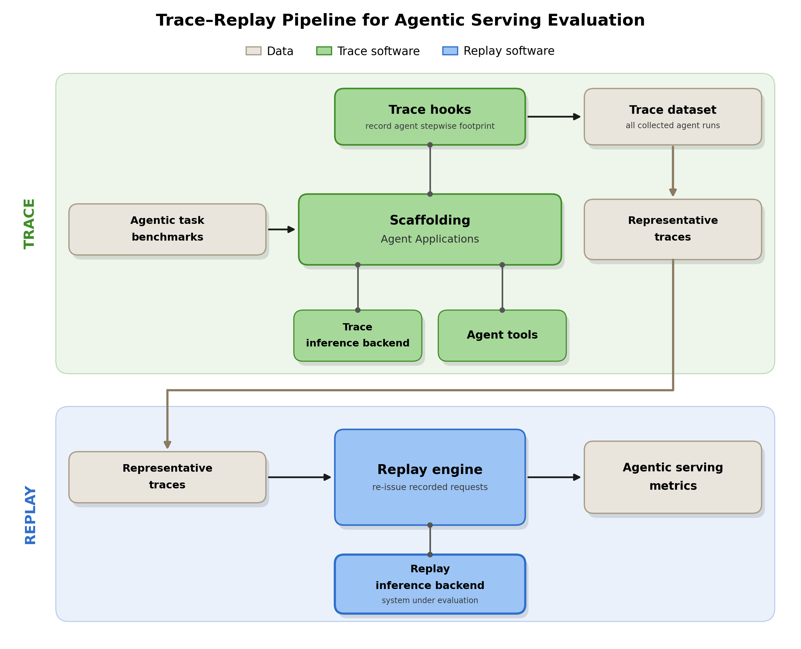
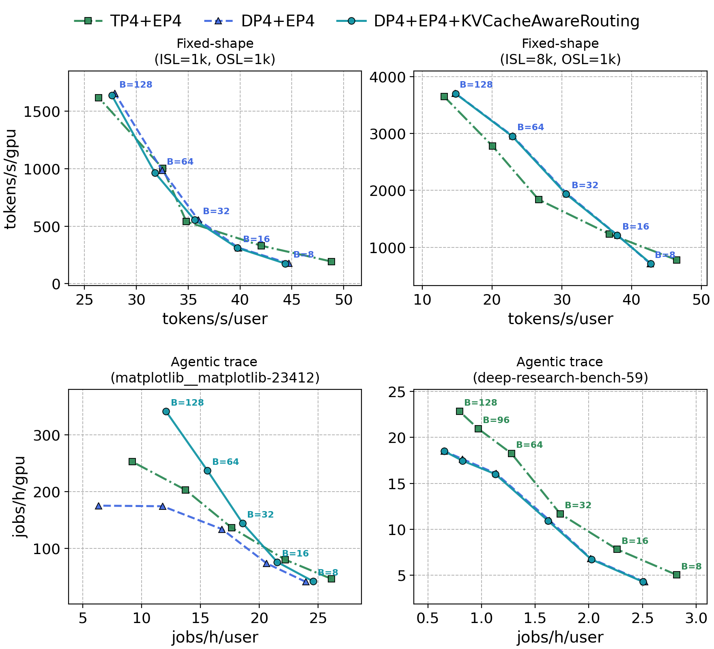
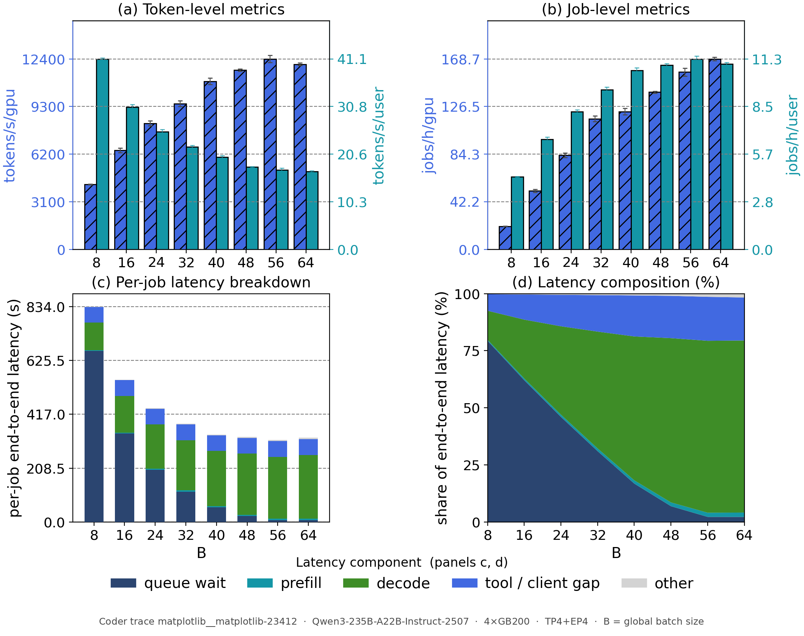
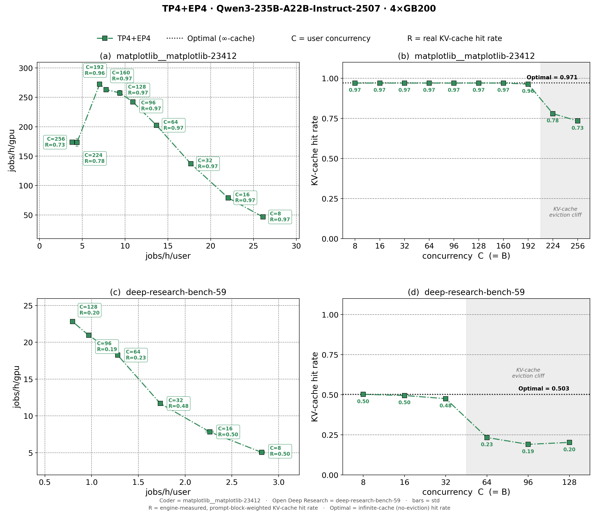
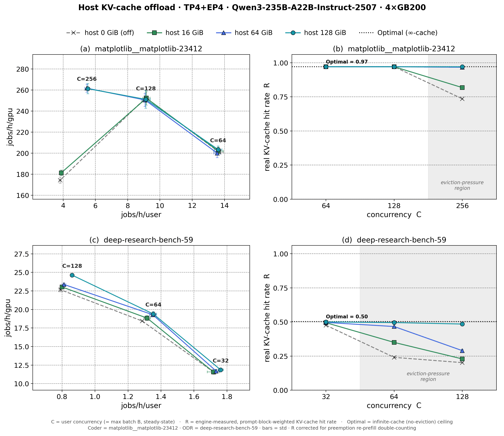
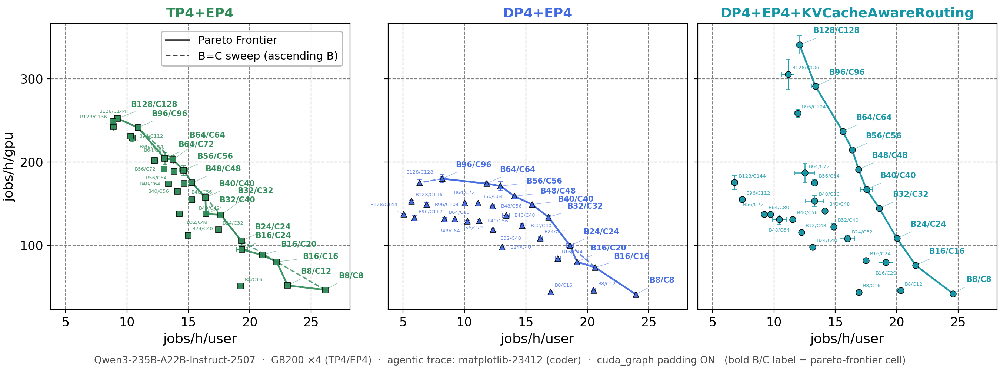
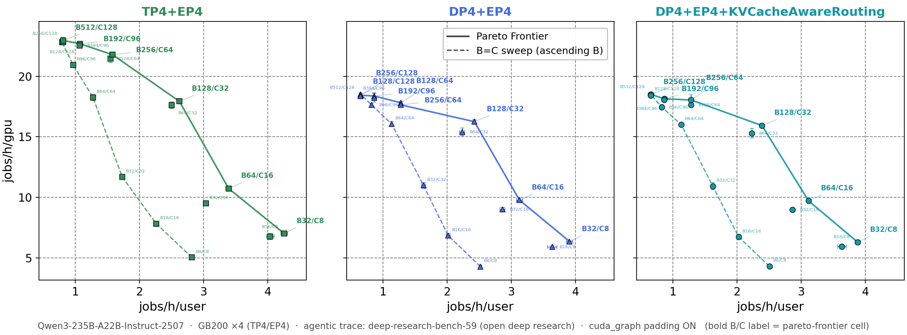

# Evaluating Agentic Serving with Trace Replay and Job-Level Metrics

## Overview

In previous tech blogs, we introduced the [Scaffolding framework](https://nvidia.github.io/TensorRT-LLM/latest/blogs/tech_blog/blog13_Inference_Time_Compute_Implementation_in_TensorRT-LLM.html) for inference-time compute and showed how it enables [joint optimization of agent applications and TensorRT-LLM](https://nvidia.github.io/TensorRT-LLM/latest/blogs/tech_blog/blog23_Joint_Optimization_of_Agent_Applications_and_TensorRT-LLM.html). This blog addresses the question that naturally comes next: **how do we measure whether a serving system is actually good at agentic workloads?**

Conventional benchmarks issue independent requests with fixed input and output lengths (ISL/OSL). A real agent task instead unfolds as a long-lived *job*: a shared system prompt is reused across many turns, the conversation grows as the agent reasons and invokes tools, sub-agents may run in parallel, and branches synchronize before the job completes. These behaviors — prefix reuse, tool-call gaps, parallel branching — are exactly what govern serving efficiency, and none of them is visible to a fixed-shape benchmark. Nor can such a benchmark answer the question practitioners actually ask: how many agent tasks does a GPU complete per hour?

We take a **trace-and-replay** approach: record each agent run once as a trace, then replay it structure-faithfully against an inference backend as many times as needed — without re-instantiating any tools — and evaluate the result with **job-level metrics** that complement conventional token-level ones. The framework code lives under [`tensorrt_llm/scaffolding/trace_replay/`](https://github.com/NVIDIA/TensorRT-LLM/tree/main/tensorrt_llm/scaffolding/trace_replay), with runnable examples under [`examples/scaffolding/trace_replay/`](https://github.com/NVIDIA/TensorRT-LLM/tree/main/examples/scaffolding/trace_replay).

## The Trace-Replay Framework

Single-request benchmarks cannot capture prefix reuse or agent-level throughput; running live agent systems is realistic but hard to reproduce — the full tool environment (sandboxes, browsers, search services) must stay stable under high concurrency, and model nondeterminism makes every run take a different path. Trace replay sidesteps both problems, provided the trace records the prefix structure that drives cache reuse, the tool-call latency of each step, and the parallel-branch topology of the agent.

Figure 1 shows the pipeline. In the trace-collection phase (top), Scaffolding-based agents run agentic task benchmarks with their tools while trace hooks record the stepwise footprint of every run. In the replay-and-evaluation phase (bottom), the replay engine re-issues the recorded requests against the replay backend — the system under evaluation — and we compute agentic serving metrics from the run. The replay backend need not be the system that served the agents during tracing: a trace collected with one model can be replayed against another.

<div align="center">
    
</div>
<p align="center"><sub><em>Figure 1. The trace-replay evaluation pipeline: a trace-collection phase (top) and a replay-and-evaluation phase (bottom).</em></sub></p>

### The Trace

Each agent run produces one compact JSON file holding an ordered `events` list. Because token content does not affect serving performance, a trace records only structure and sizes, never the underlying text. The listing below is the opening of the Coder trace `matplotlib__matplotlib-23412`, which ships with the repository as a ready-to-run example:

```json
{
  "trace_id": "ee41c788-de9a-451c-8d9d-696cdb4b9c2b",
  "events": [
    { "event_type": "message", "role": "system", "conversation_id": 0,
      "message_index": 0, "system_prompt_id": "c124a9b6-...", "tokens": 2827 },
    { "event_type": "message", "role": "user", "conversation_id": 0,
      "message_index": 1, "tokens": 1493 },
    { "event_type": "message", "role": "assistant", "conversation_id": 0,
      "message_index": 2, "tool_calls": ["read_file"], "prompt_tokens": 4320,
      "completion_tokens": 176, "reasoning_tokens": 55, "finish_reason": "tool_calls" },
    { "event_type": "tool_call", "tool_name": "read_file",
      "tool_call_id": "tooluse_hc5n...", "duration_ms": 152.8 },
    { "event_type": "message", "role": "tool", "conversation_id": 0,
      "message_index": 3, "tokens": 306 },
    ...
  ]
}
```

Every event is one of three kinds: a **`message`** (one conversation turn, with role, conversation membership, token counts, and — for assistant turns — prompt/completion/reasoning token splits and issued tool calls), a **`tool_call`** (tool name plus measured `duration_ms`), or a **`parallel_start`/`parallel_end`** boundary marking fan-out and synchronization of concurrent branches. A `system_prompt_id` marks which messages share a cacheable prefix, so replay reproduces prefix-cache behavior faithfully.

### Capturing and Replaying

Tracing attaches to an existing Scaffolding agent with two decorators — no change to the agent's logic:

```python
from tensorrt_llm.scaffolding import with_execution_tracing, tokenize_trace_scope

if enable_tracing:
    coder_type = with_execution_tracing(coder_name)(coder_type)
    coder_type = tokenize_trace_scope()(coder_type)
```

The example agents already wire this up behind a flag, so collecting a trace is one CLI switch (`--enable_tracing`). Replay then follows a few fixed rules: each call keeps its recorded ISL/OSL but is filled with random token IDs; all replay copies share the same synthetic system-prompt prefix, so prefix caching is exercised rather than bypassed; tool calls become timed sleeps of the recorded duration; and concurrency is created by replaying many copies of the same trace at once. Internally, the `ReplayEngine` runs one queue per branch path so parallel sections and join points run concurrently rather than serialized.

Replaying the bundled example trace against a running `trtllm-serve` endpoint takes one command:

```bash
python examples/scaffolding/trace_replay/run_trace_replay.py \
  examples/scaffolding/trace_replay/trace_example/matplotlib__matplotlib-23412/matplotlib__matplotlib-23412.trace.json \
  --model Qwen/Qwen3-235B-A22B-Instruct-2507 \
  --openai-base-url http://127.0.0.1:8000/v1
```

The framework also includes an offline analyzer that needs no GPU: it walks a trace against an idealized infinite cache and reports the **optimal (upper-bound) KV-cache hit rate**, which we compare against engine-measured hit rates below.

```bash
python examples/scaffolding/trace_replay/analysis/compute_cache_hit_trace.py path/to/dataset/
```

## Trace Dataset and Setup

We collect 730 traces from four Scaffolding agents chosen to cover distinct execution patterns: **Coder**, a single-thread ReAct loop over filesystem/shell tools (500 SWE-bench Verified tasks); **Open Deep Research**, a supervisor that fans out to parallel researcher subagents (100 Deep Research Bench tasks); **IterResearch**, an iterative researcher that keeps its context bounded through compaction (100 Deep Research Bench tasks); and **Tree-of-Thought Research**, a tree-structured reasoner that expands, scores, and prunes parallel branches (30 AIME 2026 problems). For replay we serve Qwen3-235B-A22B-Instruct-2507 through TensorRT-LLM on a single GB200 node (4 GPUs).

The agents occupy clearly different regions of the workload space:

| | **Coder** | **Open Deep Research** | **IterResearch** | **Tree-of-Thought** |
|---|---|---|---|---|
| ISL / request (median) | 14.4k | 6.2k | 6.3k | 1.7k |
| OSL / request (median) | 110 | 632 | 1.7k | 985 |
| Optimal cache hit rate (mean) | 96.5% | 47.8% | 24.4% | 28.8% |

<p align="center"><sub><em>Table 1. Trace-dataset summary. The optimal cache hit rate is the per-trace upper bound on prefix reuse, computed offline from the trace.</em></sub></p>

Coder is input-heavy and decode-light, and caches almost perfectly (96.5%): one shared prefix grows monotonically, so each turn re-reads what previous turns already cached. The research agents invert the shape — moderate inputs, long reasoning-heavy outputs — and cache far worse, because subagent fan-out, context rewriting, and branch exploration repeatedly introduce fresh context. The rest of this blog follows two representative traces at opposite ends of this space: a **Coder** trace (single ReAct thread, 23 requests, only ~3% fresh tokens per prompt) and an **Open Deep Research** trace (supervisor plus four parallel researcher branches, generation-bound, mostly fresh context).

## Job-Level Metrics

Inference systems are conventionally compared with token-level Pareto curves (tokens/s/GPU against tokens/s/user). For agentic workloads we complement that with a Pareto curve over whole **jobs**, for two reasons. First, users perceive end-to-end job latency — spanning many model calls, tool gaps, and synchronization points — not per-token rates. Second, token throughput is ambiguous under heavy prefix reuse: on our agentic traces, counting reused prefix tokens reports a per-GPU throughput roughly five times higher than counting only freshly computed tokens, and neither number alone compares systems fairly. A completed job carries no such ambiguity.

The two axes are:

- **Job-level interactivity — jobs/h/user**: 3600 divided by the mean end-to-end job latency.
- **Job-level throughput — jobs/h/GPU**: completed jobs per hour, normalized by GPU count.

Because a single agent job runs for minutes, both are measured over a steady-state window: the shared system prompt is preloaded so it is a cache hit from the first call, session starts are staggered with a jittered ramp-up so identical copies do not stay phase-aligned, and a job is credited only if it completes inside the window.

## Experimental Findings

We replay the two representative traces while varying the server maximum batch size **B** and the user concurrency **C** (the number of agent sessions replayed at once).

### Token-Level and Job-Level Metrics Can Disagree

Figure 2 compares three ways of parallelizing the model across the four GPUs — TP4+EP4, DP4+EP4, and DP4+EP4 with KV-cache-aware routing — under the token-level view on fixed-shape inputs (top) and the job-level view on the agentic traces (bottom). On fixed shapes the three strategies nearly coincide; on the agentic traces TP4+EP4 leads along the entire frontier, and KV-cache-aware routing helps only where a large shared prefix exists to route toward: it lifts the frontier substantially on the highly cacheable Coder trace, but shows no visible gain on Open Deep Research, whose parallel researcher branches share little prefix, nor on fixed shapes, where independent requests share none at all. A fixed-shape benchmark would report the strategies as interchangeable and hide this difference entirely.

<div align="center">
    
</div>
<p align="center"><sub><em>Figure 2. Token-level Pareto on fixed-shape inputs (top) versus job-level Pareto on the agentic traces (bottom), across three parallel strategies.</em></sub></p>

The two views also favor different batch sizes. Figure 3 holds C fixed and sweeps B: token-level interactivity (tokens/s/user) falls monotonically as B grows, because a larger decode batch lengthens each step — yet job-level interactivity (jobs/h/user) *rises* over most of the sweep, peaking at an intermediate B. The latency breakdown (panels c, d) explains why: a larger batch sharply reduces the queue wait that dominates end-to-end latency at small B, and that outweighs the longer decode, so the whole job finishes sooner. Only the job-level view follows the latency a user actually experiences.

<div align="center">
    
</div>
<p align="center"><sub><em>Figure 3. Sweeping the server batch size at fixed user concurrency. Token-level (a) and job-level (b) interactivity move oppositely; the per-job latency breakdown (c, d) explains why.</em></sub></p>

### Prefix Caching Dominates Multi-Turn Serving

Figure 4 sweeps concurrency (with TP4+EP4 fixed) and annotates each job-level Pareto point with the engine-measured KV-cache hit rate. At low and moderate concurrency the measured rate matches the optimal upper bound computed offline from the trace — about 0.97 for Coder and 0.50 for Open Deep Research — confirming that the idealized per-trace rates are actually realized once the cache can hold the prefixes. As concurrency rises, the KV-cache pool overflows and the hit rate falls off a **KV-cache eviction cliff** (toward 0.73 and 0.19 respectively), and the job-level Pareto degrades in exactly that region. For Coder-style serving, the performance ceiling is set by prefix-cache residency, not raw compute.

<div align="center">
    
</div>
<p align="center"><sub><em>Figure 4. Measured versus optimal prefix-cache hit rate, with the job-level Pareto alongside, as concurrency grows (Coder top, Open Deep Research bottom).</em></sub></p>

Host offloading pushes the cliff back. In TensorRT-LLM this is one line in the serving config:

```yaml
# extra-llm-api-config.yml
kv_cache_config:
  host_cache_size: 68719476736   # 64 GiB of host memory for offloaded KV blocks
```

Figure 5 repeats the sweep with host budgets of 0–128 GiB. Evicted prefixes are retained in host memory instead of discarded, so the hit rate stays near optimal at high concurrency — for Coder, from 0.73 back to nearly the 0.97 optimum at the largest budgets — and the job-level Pareto lifts accordingly. The benefit scales with workload reusability: largest for Coder, still clear for Open Deep Research.

<div align="center">
    
</div>
<p align="center"><sub><em>Figure 5. Effect of host KV-cache offloading (0 to 128 GiB) on hit rate and job-level throughput (Coder top, Open Deep Research bottom).</em></sub></p>

### Batch Size Should Follow the Agent's Branching Structure

Single-request benchmarks conventionally set C = B and fill every batch slot. Agentic sessions break that correspondence in two opposite ways:

- **Single-branch agents (Coder): stay near B = C.** Tool-call gaps mean fewer than C requests are on the server at any instant, so the batch runs underfilled at C = B (averaging ~51 of 64 slots in our sweep). But raising C above B to fill the batch adds more queuing delay than the underfill costs — especially since CUDA-graph batch padding makes a slightly underfilled batch nearly free. Figure 6 sweeps the full (B, C) grid for the Coder trace: the job-level frontier stays close to the B = C diagonal.
- **Fan-out agents (Open Deep Research): B well above C.** One session issues multiple concurrent requests during its fan-out phase, so the server sees more requests in flight than sessions. Figure 7 repeats the sweep for the Open Deep Research trace, and the contrast with Figure 6 is stark: the frontier sits not on the diagonal but mostly at B = 2C and B = 4C. The branch multiplicity, not the session count, sets the batch size the server needs.

<div align="center">
    
</div>
<p align="center"><sub><em>Figure 6. Job-level Pareto frontier over a full (B, C) sweep for the Coder trace, by parallel strategy. The frontier stays close to the B = C diagonal.</em></sub></p>

<div align="center">
    
</div>
<p align="center"><sub><em>Figure 7. Job-level Pareto frontier over a full (B, C) sweep for the Open Deep Research trace, by parallel strategy. Subagent fan-out pushes the frontier to B = 2C and B = 4C.</em></sub></p>

## Key Takeaways

- **Trace-and-replay makes agentic serving measurable.** Recording each agent run once and replaying it structure-faithfully preserves the behaviors fixed-shape benchmarks miss — prefix reuse, tool-call gaps, and parallel branching — and job-level Pareto metrics report serving performance as completed work: jobs per hour per user and per GPU.
- **Token-level and job-level metrics can disagree** on both the best parallel strategy and the best batch size; only the job-level view follows the end-to-end latency a user actually experiences.
- **Prefix caching sets the ceiling for multi-turn serving.** The hit rate holds at its optimum until the cache overflows, then job-level throughput drops in lockstep with it; host offloading (`kv_cache_config.host_cache_size`) pushes the cliff back.
- **Configure batch size by branching structure**: near B = C for single-branch agents, B several times C for fan-out agents.

## Future Work

We plan to extend the trace dataset with more agent architectures, publish traces for community benchmarking, and use the framework as a reproducible testbed for agent-aware serving features — KV-cache-aware routing, proactive cache management, and agent-aware scheduling introduced in [our previous blog](https://nvidia.github.io/TensorRT-LLM/latest/blogs/tech_blog/blog23_Joint_Optimization_of_Agent_Applications_and_TensorRT-LLM.html) — evaluated directly on job-level metrics. We invite the community to collect traces from their own Scaffolding agents with `--enable_tracing`, replay them against their deployments, and share findings.

## Acknowledgements

This work is a joint effort of the TensorRT-LLM team. We thank everyone who contributed to the Scaffolding framework, the trace-replay implementation, the trace dataset, and the serving experiments behind this blog.
