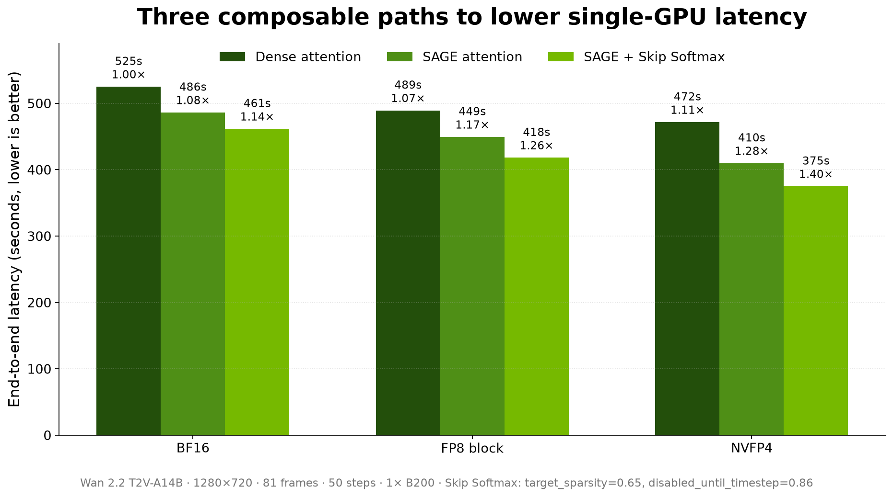
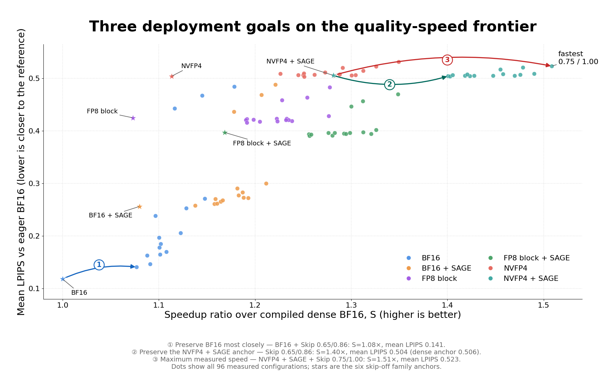

# Accelerating Video Generation on One GPU with Quantization and Sparse Attention

By NVIDIA TensorRT-LLM Team

## Abstract

Our [previous post](blog25_Scaling_Video_Generation_Across_NVL72_Rack_with_TensorRT-LLM.md)
scaled video generation from one NVIDIA B200 GPU to a GB200 NVL72 rack. This post addresses the
complementary problem: reducing the work on each GPU before scaling out.

We combine three composable optimizations in TensorRT-LLM VisualGen:

- **FP8 block-scaled or NVFP4 GEMMs** reduce linear-layer cost.
- **SAGE attention** dynamically quantizes Q and K to INT8 and V to FP8 inside the attention kernel.
- **Skip Softmax Attention** skips softmax and value accumulation for attention blocks whose scores
  fall below a dynamic threshold.

We evaluated 96 configurations on Wan 2.2 T2V-A14B, generating 81-frame 1280×720 videos in 50
denoising steps on one B200. Against a compiled dense BF16 baseline of **525.0 seconds**, the
NVFP4 + SAGE + conservative Skip Softmax configuration completed in **374.9 seconds (1.40×)**.
Its mean LPIPS distance to eager BF16 was **0.504**, compared with **0.506** for its own dense
NVFP4 + SAGE anchor. The fastest measured point reached **348.0 seconds (1.51×)**, but with a
larger reference distance. The distinction matters: Skip Softmax added little measured distance on
top of the quantized anchor, but quantization itself had already moved the result away from eager
BF16.

<p align="center">
  
</p>

<p align="center"><sub><em>Figure 1. The three optimizations compose. All speedups use the same
compiled dense BF16 baseline. Skip Softmax uses `target_sparsity=0.65` and
`disabled_until_timestep=0.86`; lower latency is better.</em></sub></p>

## Table of Contents

- [Three optimization layers](#three-optimization-layers)
- [Benchmark design](#benchmark-design)
- [Where the BF16 baseline time goes](#where-the-bf16-baseline-time-goes)
- [End-to-end results](#end-to-end-results)
- [Quality and the dense-family anchor](#quality-and-the-dense-family-anchor)
- [Choosing an operating point](#choosing-an-operating-point)
- [Configuration](#configuration)
- [Limitations](#limitations)
- [Conclusion](#conclusion)
- [References](#references)

## Three optimization layers

Video diffusion repeatedly runs a full transformer over a long, bidirectional spatiotemporal
sequence. One request therefore exposes three different sources of work:

| Optimization | Work changed | Experiment setting |
| :--- | :--- | :--- |
| GEMM quantization | Eligible linear-layer GEMMs | BF16, `FP8_BLOCK_SCALES`, or `NVFP4` |
| SAGE attention | QK and PV computation inside attention | INT8 Q/K, FP8 V, block sizes 1/16/1 |
| Skip Softmax Attention | Softmax and PV work for dynamically rejected score blocks | Calibrated target sparsity and timestep cutoff |

These layers target different kernels. They can be enabled independently, and their end-to-end
gains must be measured together rather than multiplied from isolated kernel speedups.

### FP8 block-scaled and NVFP4 GEMMs

VisualGen can dynamically quantize eligible linear layers while loading a BF16 checkpoint.
`FP8_BLOCK_SCALES` uses block-scaled FP8 GEMMs. `NVFP4` uses NVIDIA FP4 GEMMs and cuts the data
width further. Operations that are not covered by the quantized linear path remain at their
configured precision, so reducing GEMM precision does not reduce the whole request by the same
factor.

### SAGE attention

[SageAttention](https://github.com/thu-ml/SageAttention) reduces the precision of attention itself.
The recipe used here dynamically quantizes Q and K to INT8 and V to FP8, with per-block scaling
and BF16 input/output tensors. This is separate from GEMM quantization: `NVFP4` can accelerate the
linear projections while SAGE accelerates the attention kernel fed by those projections.

### Skip Softmax Attention

[Skip Softmax Attention](blog16_Accelerating_Long_Context_Inference_with_Skip_Softmax_Attention.md),
also called BLASST, keeps the QK calculation but rejects score blocks that are sufficiently below
the running maximum. Rejected blocks skip exponentiation and the corresponding value
accumulation. It requires no static sparsity pattern.

VisualGen exposes two controls:

- `target_sparsity` is a request to a calibrated checkpoint, not a guarantee of achieved kernel
  sparsity. Checkpoint metadata maps it to the kernel threshold.
- `disabled_until_timestep` keeps early, high-timestep denoising dense. Denoising proceeds from a
  normalized timestep near 1 toward 0; Skip Softmax is enabled only after the timestep falls below
  the cutoff. A lower cutoff leaves a longer dense prefix. `0` disables skipping and `1` is the
  most aggressive setting.

The schedule is essential. The sweep shows that applying the same threshold from the start can
change BF16 output substantially for a modest additional latency gain.

## Benchmark design

The sweep used the following controlled setup:

| Item | Setting |
| :--- | :--- |
| Model | [Wan 2.2 T2V-A14B](https://huggingface.co/Wan-AI/Wan2.2-T2V-A14B-Diffusers), dual transformer |
| Hardware | One NVIDIA B200 per request |
| Output | 1280×720, 81 frames at 16 FPS, 50 denoising steps |
| Guidance | 5.0 / 4.0, maximum text sequence length 512 |
| Prompts | Seven prompts, one fixed seed each |
| Runtime | TensorRT-LLM 1.3.0rc19 at `e1135bbdfa` plus [TensorRT-LLM PR #15318](https://github.com/NVIDIA/TensorRT-LLM/pull/15318) |
| Checkpoint | ModelOpt 0.45.0.dev89 export using the VisualGen calibration schema from [ModelOpt PR #1816](https://github.com/NVIDIA/Model-Optimizer/pull/1816) |
| Compilation | `torch.compile` enabled, CUDA graphs disabled; timed after compilation warmup |

The grid was

```text
{BF16, FP8_BLOCK_SCALES, NVFP4}
× {dense attention, SAGE}
× target_sparsity {0.65, 0.70, 0.75}
× disabled_until_timestep {0.86, 0.90, 0.94, 0.97, 1.00}
```

This gives 90 Skip Softmax variants plus six skip-off family anchors. The seven prompts ran in
parallel on separate B200 GPUs to complete the sweep, but every measured request used one GPU.

Latency is the CUDA-synchronized full pipeline forward, averaged over seven prompts. Speedup uses
the **compiled, skip-off BF16** anchor of 525.011 seconds. Quality uses LPIPS with an AlexNet
backbone: first average over all 81 frames of each clip, then over all seven prompts. Every
candidate is compared with the same **eager, skip-off BF16** video generated from the same prompt
and seed.

The two baselines serve different purposes. Compiled BF16 isolates performance changes among
compiled candidates. Eager BF16 supplies a fixed image-space reference. Even compiled dense BF16
has mean LPIPS 0.118 against eager BF16, so the absolute LPIPS values include compilation drift.

## Where the BF16 baseline time goes

Profiling the compiled dense BF16 pipeline shows where the optimization opportunity is
concentrated. Attention accounts for nearly three quarters of end-to-end latency, while GEMMs
account for roughly one fifth.

| Work | Share of pipeline time |
| :--- | ---: |
| Attention | 71.7% |
| GEMM | 20.8% |
| Other pipeline work | 7.5% |

Attention includes TensorRT-LLM FMHA and cuDNN SDPA kernels. GEMM includes linear-layer matrix
multiplications. The remaining category includes normalization, RoPE, activations, scheduler and
VAE work, memory operations, and host or GPU-idle time.

This distribution explains why the optimizations compose asymmetrically. SAGE and Skip Softmax
target the largest component, while FP8 block-scaled and NVFP4 GEMMs target another substantial
part of the pipeline. Work outside attention and GEMM limits the total end-to-end speedup.

## End-to-end results

The table fixes Skip Softmax at the conservative `target_sparsity=0.65`,
`disabled_until_timestep=0.86` point so that every family is directly comparable.

| GEMM | Attention | Dense latency | Dense speedup | With Skip Softmax | Full speedup | Mean LPIPS, dense → skip |
| :--- | :--- | ---: | ---: | ---: | ---: | ---: |
| BF16 | Dense | 525.0s | 1.00× | 487.6s | 1.08× | 0.118 → 0.141 |
| BF16 | SAGE | 486.2s | 1.08× | 461.5s | 1.14× | 0.256 → 0.258 |
| FP8 block | Dense | 489.2s | 1.07× | 440.6s | 1.19× | 0.425 → 0.423 |
| FP8 block | SAGE | 449.3s | 1.17× | 418.0s | 1.26× | 0.397 → 0.394 |
| NVFP4 | Dense | 471.6s | 1.11× | 428.2s | 1.23× | 0.504 → 0.509 |
| NVFP4 | SAGE | 409.7s | 1.28× | **374.9s** | **1.40×** | 0.506 → 0.504 |

Several effects are visible:

- GEMM quantization alone moves the dense anchor from 1.00× to 1.07× with FP8 block scaling and
  1.11× with NVFP4.
- SAGE adds an observed 1.08×, 1.09×, and 1.15× within the BF16, FP8, and NVFP4 dense families.
- Conservative Skip Softmax adds 1.05–1.09× within the three SAGE families.
- The full NVFP4 + SAGE + Skip Softmax stack reaches 1.40×. This is a measured end-to-end result,
  not a product of the individual ratios.

## Quality and the dense-family anchor

<p align="center">
  
</p>

<p align="center"><sub><em>Figure 2. All 90 Skip Softmax variants and six dense family anchors.
Farther right is faster; lower is closer to eager BF16. A star is the skip-off anchor for that
GEMM and attention combination.</em></sub></p>

The dense anchors separate the effect of quantization from the incremental effect of skipping.
Mean LPIPS is 0.118 for compiled BF16, 0.425 for FP8 block scaling, and 0.504 for NVFP4. With SAGE,
the corresponding anchors are 0.256, 0.397, and 0.506. These are reference distances, not direct
human-preference scores.

At the conservative 0.65/0.86 point, Skip Softmax changes mean LPIPS by only **-0.003 to +0.005**
for the four FP8 and NVFP4 families. The negative values do not establish a quality improvement;
there were no repeated generations to estimate variance. They show only that the measured
increment is small relative to each quantized family's dense anchor.

BF16 exposes the scheduling cost more clearly. At fixed `target_sparsity=0.65`, its mean LPIPS
rises from **0.141 at cutoff 0.86** to **0.443 at cutoff 1.0**, while speedup moves only from 1.08×
to 1.12×. For NVFP4 + SAGE, the same sweep moves from 0.504 to 0.517 and from 1.40× to 1.45×.
Across the tested range, the timestep cutoff is the stronger quality lever; it should be tuned
before increasing target sparsity.

## Choosing an operating point

The sweep suggests three starting points, each with a different contract:

| Goal | Configuration | Latency | Speedup | Mean LPIPS vs eager BF16 |
| :--- | :--- | ---: | ---: | ---: |
| Preserve BF16 most closely | BF16, dense attention, Skip 0.65/0.86 | 487.6s | 1.08× | 0.141 |
| Preserve the NVFP4 + SAGE anchor | NVFP4 + SAGE, Skip 0.65/0.86 | 374.9s | 1.40× | 0.504 (dense anchor 0.506) |
| Maximum measured speed | NVFP4 + SAGE, Skip 0.75/1.00 | 348.0s | 1.51× | 0.523 (dense anchor 0.506) |

The second and third rows preserve proximity to the **quantized family anchor**, not to eager BF16.
A deployment should first accept its dense quantized output, then tune Skip Softmax against that
anchor on prompts representative of the application.

## Configuration

The 1.40× point can be expressed in one VisualGen YAML file:

```yaml
quant_config:
  quant_algo: NVFP4
  dynamic: true

attention_config:
  backend: TRTLLM
  quant_attention_config:
    qk_dtype: int8
    v_dtype: fp8
    q_block_size: 1
    k_block_size: 16
    v_block_size: 1
  sparse_attention_config:
    algorithm: skip_softmax
    target_sparsity: 0.65
    disabled_until_timestep: 0.86

torch_compile_config:
  enable: true
  enable_autotune: false

cuda_graph_config:
  enable: false

parallel_config:
  cfg_size: 1
  ulysses_size: 1
```

Run it offline or pass it to `trtllm-serve`:

```shell
trtllm-serve <calibrated_wan_checkpoint> \
    --visual_gen_args single_gpu_nvfp4_sage_skip.yaml
```

The checkpoint must contain the calibration formula that maps `target_sparsity` to
`threshold_scale_factor`. Without that metadata, set a calibrated `threshold_scale_factor`
directly instead. See the [VisualGen sparse-attention guide](../../visual-gen/features/sparse-attention.md)
for the checkpoint schema and Python API. To test FP8, change `quant_algo` to
`FP8_BLOCK_SCALES`; to test BF16, omit `quant_config`.

## Limitations

- The sweep covers one model, one B200, seven prompts, and one seed per prompt. It does not prove
  the same operating point for other models, resolutions, schedulers, or GPUs.
- LPIPS measures distance from one eager BF16 realization. It does not measure prompt adherence,
  motion quality, temporal consistency, or human preference.
- There are no repeated runs, confidence intervals, or latency percentiles. Small LPIPS and
  latency differences should not be treated as statistically significant.
- `target_sparsity` is a calibrated request. The experiment did not report achieved sparsity per
  layer or denoising step.
- Dynamic quantization and compiled BF16 both introduce reference drift. Absolute LPIPS values
  should not be compared across builds; within-build family anchors are the valid comparison.
- The component breakdown comes from a representative single-prompt profile. Workload mix may
  vary across prompts and configurations.

## Conclusion

Single-GPU video generation has more than one optimization axis. Low-precision GEMMs reduce linear
work, SAGE lowers attention precision, and Skip Softmax removes dynamically unimportant attention
work. On Wan 2.2 T2V-A14B, the conservative combination reduces end-to-end latency from 525.0 to
374.9 seconds, a measured 1.40× speedup, without a measured LPIPS increase relative to its dense
NVFP4 + SAGE anchor in this sweep. The fastest point reaches 1.51×, but it should be treated as a
different quality operating point.

The practical rule is simple: select and validate the dense precision family first, add SAGE, then
tune Skip Softmax from a conservative timestep cutoff. These optimizations reduce the work on each
GPU and compose with the multi-GPU parallelism described in the rack-scale post.

## References

1. [Scaling Video Generation Across NVL72 Rack with TensorRT-LLM](blog25_Scaling_Video_Generation_Across_NVL72_Rack_with_TensorRT-LLM.md)
2. [SageAttention: Accurate 8-Bit Attention for Plug-and-play Inference Acceleration](https://arxiv.org/abs/2410.02367)
3. [BLASST: Dynamic BLocked Attention Sparsity via Softmax Thresholding](https://arxiv.org/abs/2512.12087)
4. [NVIDIA Model Optimizer](https://github.com/NVIDIA/Model-Optimizer)
5. [TensorRT-LLM Visual Generation](../../models/visual-generation.md)
