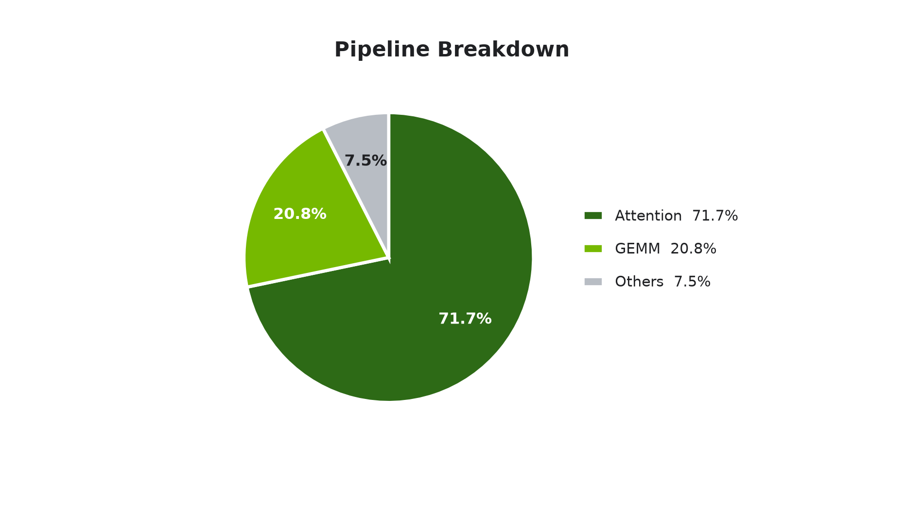
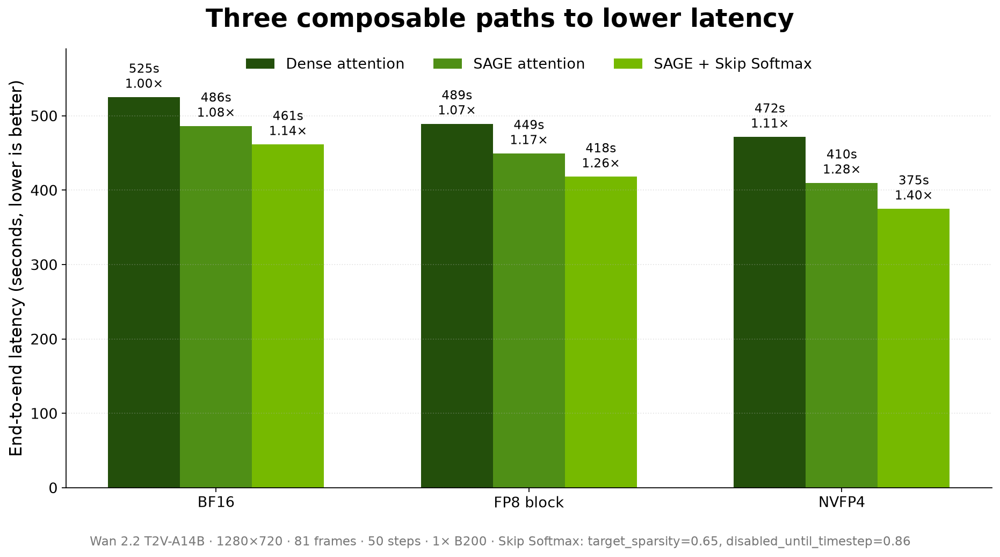

# Accelerating Video Generation with GEMM Quantization, Attention Quantization, and Attention Sparsification

By NVIDIA TensorRT-LLM Team

## Introduction

A video generator does not create all 81 frames in one pass. Wan 2.2 T2V-A14B revisits the full
spatiotemporal sequence across 50 denoising steps, switching from a high-noise transformer to a
low-noise transformer as the video takes shape. At 1280×720, most of that repeated computation
lands in two places: attention and the linear layers around it.

In the compiled BF16 pipeline on NVIDIA B200, attention consumes 71.7% of pipeline-forward time and
linear-layer GEMMs another 20.8%. That concentration gives us a clear optimization strategy: make
the GEMMs cheaper, make dense attention cheaper, and avoid attention work that contributes little.

<p align="center">
  
</p>

<p align="center"><sub><em>Figure 1. Pipeline breakdown for the target Wan 2.2 workload with
compiled dense BF16 on B200.</em></sub></p>

In [Scaling Video Generation Across NVL72 Rack with TensorRT-LLM](https://github.com/NVIDIA/TensorRT-LLM/blob/main/docs/source/blogs/tech_blog/blog25_Scaling_Video_Generation_Across_NVL72_Rack_with_TensorRT-LLM.md),
we showed how TensorRT-LLM scales video generation across multiple GPUs. This post focuses on
accelerating the work on each GPU with three complementary techniques:

- **FP8 block-scaled or NVFP4 GEMMs** reduce linear-layer cost.
- **SAGE attention** dynamically quantizes Q and K to INT8 and V to FP8 in the attention path.
- **Skip Softmax Attention** skips softmax and value accumulation for attention blocks whose
  scores fall below a dynamic threshold.

Together, NVFP4 GEMMs, SAGE attention, and a conservative Skip Softmax operating point reduce
latency from **525.0 to 374.9 seconds**, a **1.40× end-to-end speedup**. The fastest measured
configuration reaches **348.0 seconds, or 1.51×**.

## Table of Contents

- [Three Complementary Optimizations](#three-complementary-optimizations)
- [Evaluation Setup](#evaluation-setup)
- [End-to-End Results](#end-to-end-results)
- [Reproduction](#reproduction)
- [Conclusion](#conclusion)
- [References](#references)

## Three Complementary Optimizations

Video diffusion repeatedly applies a full transformer to a long, bidirectional spatiotemporal
sequence. The three techniques in this study act on different parts of that work:

| Optimization | What it accelerates | Options used here |
| :--- | :--- | :--- |
| GEMM quantization | Eligible linear-layer GEMMs | BF16, `FP8_BLOCK_SCALES`, or `NVFP4` |
| SAGE attention | QK and PV computation inside attention | INT8 Q/K and FP8 V |
| Skip Softmax Attention | Softmax and PV work for dynamically rejected score blocks | Calibrated target sparsity and timestep cutoff |

Because the techniques target different kernels, they can be enabled independently or composed.

### FP8 Block-Scaled and NVFP4 GEMMs

VisualGen dynamically quantizes eligible BF16 linear weights as the model loads. The FP8 and
NVFP4 paths used here therefore do not require separate prequantized checkpoints.
`FP8_BLOCK_SCALES` uses block-scaled FP8 GEMMs, while `NVFP4` reduces the data width further.
Operations outside the eligible linear layers remain at their configured precision.

### SAGE Attention

[SageAttention](https://github.com/thu-ml/SageAttention) reduces the precision of attention
arithmetic. The recipe used here dynamically quantizes Q and K to INT8 and V to FP8, with block
sizes 1/16/1 and BF16 input and output tensors. This is separate from GEMM quantization: NVFP4 can
accelerate the linear projections while SAGE accelerates the attention operation that consumes
them.

### Skip Softmax Attention

[Skip Softmax Attention](blog16_Accelerating_Long_Context_Inference_with_Skip_Softmax_Attention.md),
also called BLASST, keeps the QK calculation but rejects score blocks sufficiently below the
running maximum. Rejected blocks skip exponentiation and the corresponding value accumulation;
the sparsity pattern is determined dynamically rather than stored with the model.

`target_sparsity` selects an operating point calibrated by ModelOpt. The calibration metadata maps
that request to a `threshold_scale_factor` for each transformer component; the kernel divides this
factor by the sequence length to obtain its runtime threshold. The achieved skip rate can vary by
layer and timestep.

Wan 2.2 has separate high-noise and low-noise transformer components. The
[Wan 2.2 Skip Softmax example](https://github.com/NVIDIA/TensorRT-LLM/tree/main/examples/visual_gen/skip_softmax/wan2.2-t2v-a14b)
provides a ModelOpt calibration overlay for each one, plus a helper that merges only
`sparse_attention_config` into `transformer/config.json` and `transformer_2/config.json`. Because
the overlays use different coefficients, the same `target_sparsity` becomes a component-specific
`threshold_scale_factor`. The
[VisualGen sparse-attention guide](../../visual-gen/features/sparse-attention.md) documents the
checkpoint schema and precedence rules.

The second control, `disabled_until_timestep`, keeps the beginning of denoising dense. Denoising
moves from a normalized timestep near 1 toward 0, and skipping begins only after the timestep falls
below this cutoff. A lower value leaves a longer dense prefix; `0` disables skipping, while `1`
enables it from the beginning. In this workload, delaying Skip Softmax preserves output similarity
more effectively than applying the same threshold throughout denoising.

## Evaluation Setup

To see how the optimizations compose, we varied GEMM precision, attention precision, target
sparsity, and the point in denoising at which skipping begins.

| Item | Setting |
| :--- | :--- |
| Checkpoint | [Wan-AI/Wan2.2-T2V-A14B-Diffusers](https://huggingface.co/Wan-AI/Wan2.2-T2V-A14B-Diffusers) |
| Accelerator | NVIDIA B200 |
| Generated video | 1280×720, 81 frames at 16 FPS |
| Denoising | 50 steps; guidance 5.0 for the high-noise expert and 4.0 for the low-noise expert; maximum text sequence length 512 |

Both guidance values enable classifier-free guidance (CFG) throughout denoising. At each step, the
positive- and negative-prompt branches are processed together as a batch of two; CFG parallelism is
not enabled in this configuration.

The experiment covered the following grid:

```text
{BF16, FP8_BLOCK_SCALES, NVFP4}
× {dense attention, SAGE}
× target_sparsity {0.65, 0.70, 0.75}
× disabled_until_timestep {0.86, 0.90, 0.94, 0.97, 1.00}
```

This produces 90 Skip Softmax variants plus six skip-off anchors. We evaluate each setting with the
same seven prompt-and-seed pairs. Speedup is measured against compiled dense BF16, while LPIPS
compares each generated video with an eager BF16 reference from the same prompt and seed.

## End-to-End Results

The three techniques compound because they reduce different parts of the workload. GEMM
quantization first moves the dense baseline from 1.00× to 1.07× with FP8 block scaling and 1.11×
with NVFP4. SAGE then reduces attention cost, with its largest incremental gain appearing alongside
NVFP4. Adding conservative Skip Softmax brings the combined NVFP4 + SAGE path to 1.40×.

<p align="center">
  
</p>

<p align="center"><sub><em>Figure 2. The three optimizations compose. All speedups use the same
compiled dense BF16 baseline. Skip Softmax uses `target_sparsity=0.65` and
`disabled_until_timestep=0.86`; lower latency is better.</em></sub></p>

<!-- TODO(blog27, remove before merge): Add a synchronized comparison of compiled BF16 and
NVFP4 + SAGE + Skip Softmax using the same prompt, seed, resolution, frame count, and denoising
steps. Host the video in an approved NVIDIA media location and keep only its poster image in this
repository. -->

Figure 3 shows the speed-quality tradeoff across the sweep. Each star is the skip-off anchor for one
GEMM-and-attention family; read nearby Skip Softmax points relative to that star. LPIPS uses eager
BF16 as its image-space reference, so compiled dense BF16 begins at a nonzero distance of 0.118.

<p align="center">
  
</p>

<p align="center"><sub><em>Figure 3. The measured quality-speed frontier. Farther right is faster;
lower is closer to eager BF16. Stars are skip-off family anchors, and ①–③ correspond to the
representative operating points below.</em></sub></p>

| Point | Goal | Configuration | Latency | Speedup | Mean LPIPS |
| :---: | :--- | :--- | ---: | ---: | ---: |
| ① | Conservative BF16 skipping | BF16 + dense attention + Skip (target 0.65, cutoff 0.86) | 487.6s | 1.08× | 0.141 |
| ② | Balance the combined optimizations | NVFP4 + SAGE + Skip (target 0.65, cutoff 0.86) | 374.9s | 1.40× | 0.504 |
| ③ | Reach the highest measured speed | NVFP4 + SAGE + Skip (target 0.75, cutoff 1.00) | 348.0s | 1.51× | 0.523 |

At point ②, Skip Softmax moves the dense NVFP4 + SAGE path from 1.28× to 1.40× while mean LPIPS
is 0.504, compared with 0.506 for the matching skip-off anchor. Point ③ starts skipping earlier
and trades a further increase in LPIPS for the highest measured speed. Across the sweep, the
denoising cutoff changes output similarity more strongly than target sparsity. Start with a
conservative cutoff, then raise target sparsity only when additional speed is needed.

## Reproduction

The checked-in
[Wan 2.2 Skip Softmax example](https://github.com/NVIDIA/TensorRT-LLM/tree/main/examples/visual_gen/skip_softmax/wan2.2-t2v-a14b)
contains the calibration overlays, merge helper, and VisualGen YAML for point ②. The published
numbers use the TensorRT-LLM release image
`nvcr.io/nvidia/tensorrt-llm/release:1.3.0rc19`. The commands below assume that environment, a local
copy of the public Wan 2.2 checkpoint, and a TensorRT-LLM checkout.

### Enable the optimized path

Apply the high-noise and low-noise calibration overlays to their matching transformer configs:

```bash
export MODEL_DIR=/path/to/Wan2.2-T2V-A14B-Diffusers
export TRTLLM_ROOT=/path/to/TensorRT-LLM
export EXAMPLE_DIR="$TRTLLM_ROOT/examples/visual_gen/skip_softmax/wan2.2-t2v-a14b"

python "$EXAMPLE_DIR/apply_calibration.py" --model-dir "$MODEL_DIR"
```

The helper preserves the rest of each checkpoint config and is safe to run again. The packaged
[`visual_gen.yaml`](https://github.com/NVIDIA/TensorRT-LLM/blob/main/examples/visual_gen/skip_softmax/wan2.2-t2v-a14b/visual_gen.yaml)
then selects `target_sparsity=0.65` and `disabled_until_timestep=0.86`, enables dynamic NVFP4 GEMM
quantization, and uses the INT8/FP8 SAGE recipe:

```bash
trtllm-serve "$MODEL_DIR" --visual_gen_args "$EXAMPLE_DIR/visual_gen.yaml"
```

### Match the measurement protocol

Figures 2 and 3 measure the pipeline forward rather than HTTP handling or video encoding. For each
prompt, run one full 50-step warmup at the exact 1280×720, 81-frame shape, synchronize the GPU,
then time one complete 50-step forward. Average the resulting times over the seven prompts.

The sweep enables `torch.compile` but not CUDA graphs, because that combination was unsupported in
the release used here. It also disables the generic multi-shape pipeline warmup in favor of the
exact-shape warmup above. As a result, `enable_autotune=false` does not change this benchmark:
TensorRT-LLM invokes that autotuning from the generic warmup that the sweep bypasses.

For the quality axis, generate an eager BF16 reference with the same prompt and seed, compute
AlexNet LPIPS between corresponding frames, average over the 81 frames, and then average over the
seven prompts.

<!-- TODO(blog27, remove before merge): Link the exact seven-prompt manifest, offline timing
harness, LPIPS evaluator environment, result CSV, and figure-generation scripts after they are
published. -->

## Conclusion

GEMM quantization, SAGE attention, and Skip Softmax address complementary parts of video
generation: linear layers, attention arithmetic, and dynamically unimportant attention work. They
can be adopted independently or combined. The dense precision choice establishes the main
speed-quality operating region, and the Skip Softmax denoising cutoff provides the final tuning
control within that region.

Improving per-GPU execution and scaling across GPUs are complementary strategies. GEMM
quantization, SAGE, and Skip Softmax compose with the scale-out methods in
[Scaling Video Generation Across NVL72 Rack with TensorRT-LLM](https://github.com/NVIDIA/TensorRT-LLM/blob/main/docs/source/blogs/tech_blog/blog25_Scaling_Video_Generation_Across_NVL72_Rack_with_TensorRT-LLM.md),
pairing more efficient work on each GPU with rack-scale throughput.

## References

1. [Scaling Video Generation Across NVL72 Rack with TensorRT-LLM](https://github.com/NVIDIA/TensorRT-LLM/blob/main/docs/source/blogs/tech_blog/blog25_Scaling_Video_Generation_Across_NVL72_Rack_with_TensorRT-LLM.md)
2. [SageAttention: Accurate 8-Bit Attention for Plug-and-play Inference Acceleration](https://arxiv.org/abs/2410.02367)
3. [BLASST: Dynamic BLocked Attention Sparsity via Softmax Thresholding](https://arxiv.org/abs/2512.12087)
