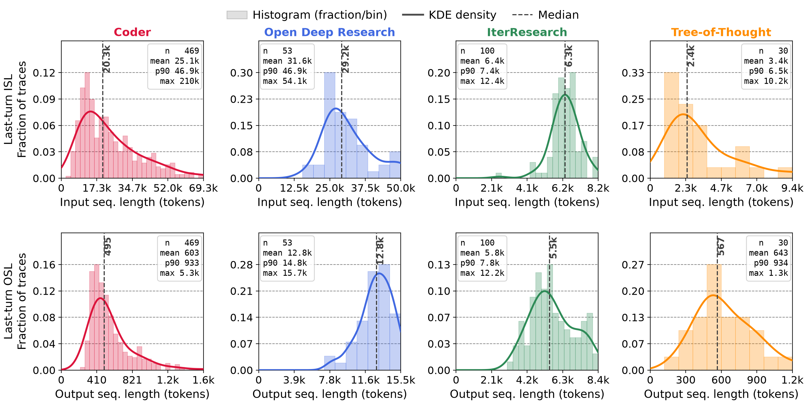

# Evaluating Agentic Serving with Trace Replay and Job-Level Metrics

by NVIDIA TensorRT LLM team

## Overview

Agentic applications — coding assistants, deep-research pipelines, tree-structured reasoners — are a fast-growing share of LLM serving traffic, and they stress an inference system in ways chatbot traffic never did. Evaluation has not followed: performance is still reported on independent requests of fixed shape, while the workload served is a long-running, multi-turn, tool-invoking, sometimes parallel agent task. Hence a practical question for anyone deploying an agent stack: **how do we measure whether a serving system is actually good at agentic workloads?**

Conventional benchmarks issue independent requests with fixed input and output lengths (ISL/OSL). A real agent task instead unfolds as a long-lived *job*: a shared system prompt is reused across many turns, the conversation grows as the agent reasons and invokes tools, and sub-agents may run in parallel before synchronizing. Prefix reuse, tool-call gaps, and parallel branching govern serving efficiency, yet none is visible to a fixed-shape benchmark — nor can one answer the question practitioners actually ask: how many agent tasks does a GPU complete per hour?

We take a **trace-and-replay** approach: record each agent run once as a trace, then replay it structure-faithfully against an inference backend as many times as needed — without re-instantiating any tools — and evaluate with **job-level metrics** that complement conventional token-level ones. The framework lives under [`tensorrt_llm/scaffolding/trace_replay/`](https://github.com/NVIDIA/TensorRT-LLM/tree/main/tensorrt_llm/scaffolding/trace_replay), with runnable examples under [`examples/scaffolding/trace_replay/`](https://github.com/NVIDIA/TensorRT-LLM/tree/main/examples/scaffolding/trace_replay). What follows is what we learned building and using this pipeline, offered as one set of concrete choices others can reuse or argue with.

## Methodology

Benchmarking agentic serving takes three broad forms today, each limited. **Single-request benchmarks** dressed in agentic shapes — long input, short output — are simple and well established, but never exercise prefix-cache reuse, and their token-level numbers cannot answer what deployments ask: how many deep-research tasks does one GB200 finish per hour? **Live agent systems** are realistic and do yield agent-level metrics, but every sandbox, browser, and search service must stay healthy under high concurrency, and the agent loop amplifies generation nondeterminism until runs stop being comparable. **Trace-based** methods avoid both, yet existing traces are usually too coarse: they simulate only part of the prefix structure — which is driven by the system prompt *and* the growing multi-turn conversation — drop tool-call latency, which inflates hit rates (a KV block that survives an instant tool return is often evicted across a 30-second one) and rules out agent-level metrics, and assume a single ReAct thread, while real agents fan out to subagents, think in parallel, and compact their context. Our methodology is trace-based, built to close those gaps.

### Trace Real Runs, Replay Synthetic Data

We record real agent runs — real models, real tools, real tasks — once, and replay them with fake content. Token counts, prefix identity, tool-call durations, and branch boundaries are enough, because content does not affect serving performance: each call keeps its recorded ISL/OSL but is filled with random token IDs. A content-free trace can therefore be published, replayed against a different model than the one that produced it, and scaled to any concurrency without re-instantiating a single tool.

### Simulate the Prefix Pattern

Prefix reuse in agentic serving comes from two sources, and we reproduce both. A `system_prompt_id` marks which calls share a cacheable system prefix, and all replay copies are given the same synthetic system prompt so the cache is exercised rather than bypassed. Within a session, each turn replays the whole accumulated conversation, so the monotonically growing multi-turn prefix — the dominant reuse pattern for coding agents — appears in the request stream exactly as it did in the original run.

### Trace and Simulate Tool-Call Time

Every tool call carries its measured `duration_ms` and replays as a timed sleep of that length. This reproduces the request-readiness gaps that leave a batch underfilled, and it keeps cache accounting honest: the longer a session pauses in a tool, the more likely its blocks are evicted before the next turn, so dropping tool time would overstate the hit rate and the performance that follows from it. It is also what makes end-to-end job latency, and therefore agent-level metrics, meaningful at all.

### Trace and Replay Complex Agent Architectures

The trace records the execution graph, not just a linear turn sequence: `parallel_start`/`parallel_end` boundaries mark subagent fan-out and its join points, and context compaction or rewinding shows up as the prefix change it really is. Parallel branches therefore replay concurrently instead of being flattened into a sequential chain. That is not a fidelity detail — it changes the answer: a fan-out workload wants a batch size two to four times the session concurrency, a single-branch workload wants it near the session count. It also means conclusions do not transfer across architectures, which is why we traced several deliberately different ones rather than a single ReAct loop.

### Replay a Single Trace or a Whole Dataset at Any Concurrency

Replay takes either one trace or a trace dataset, and concurrency is produced by running many copies at once, independent of how many runs were originally collected. Because a single agent job lasts minutes, measurement uses a steady-state window: the shared system prompt is preloaded so it is a cache hit from the first call, session starts are staggered with a jittered ramp-up so identical copies do not stay phase-aligned, and a job is credited only if it completes inside the window.

### Report Job-Level Metrics

Inference systems are conventionally compared with token-level Pareto curves (tokens/s/GPU against tokens/s/user). For agentic workloads we complement that with a Pareto curve over whole **jobs**, for two reasons. First, users perceive end-to-end job latency — spanning many model calls, tool gaps, and synchronization points — not per-token rates. Second, token throughput is ambiguous under heavy prefix reuse: on our agentic traces, counting reused prefix tokens reports a per-GPU throughput roughly five times higher than counting only freshly computed tokens, and neither number alone compares systems fairly. A completed job carries no such ambiguity. The two axes are:

- **Job-level interactivity — jobs/h/user**: 3600 s divided by the mean end-to-end job latency in seconds.
- **Job-level throughput — jobs/h/GPU**: completed jobs per hour, normalized by GPU count.

Industry efforts are converging on the same trace-replay idea from different directions: [AA-AgentPerf](https://artificialanalysis.ai/methodology/agentperf) replays recorded coding sessions to report the concurrent agents a deployment sustains under an SLO, and SemiAnalysis's [InferenceX AgentX](https://inferencex.semianalysis.com/datasets) replays coding traces with per-turn token counts and KV-block hashes to reproduce prefix reuse. Ours differs in scope rather than in kind: it covers agent architectures beyond a coding ReAct thread, replays their execution graph concurrently, and reports job-level throughput instead of SLO-conditioned concurrency.

## Implementation

### Trace Format

Each agent run produces one compact JSON file holding a `trace_id` and an ordered `events` list. Because token content does not affect serving performance, a trace records only structure and sizes, never the underlying text, which keeps it small, readable, and shareable. The listing below abbreviates the opening of the Coder trace `matplotlib__matplotlib-23412`, one of the two representative traces followed later in this blog:

```json
{
  "trace_id": "ee41c788-de9a-451c-8d9d-696cdb4b9c2b",
  "events": [
    { "event_type": "message", "role": "system", "conversation_id": 0,
      "message_index": 0, "system_prompt_id": "c124a9b6-...", "tokens": 2827 },
    { "event_type": "message", "role": "user", "conversation_id": 0,
      "message_index": 1, "tokens": 1493 },
    { "event_type": "message", "role": "assistant", "conversation_id": 0,
      "message_index": 2, "tool_calls": ["read_file"], "prompt_tokens": 4320,
      "completion_tokens": 176, "reasoning_tokens": 55, "finish_reason": "tool_calls" },
    { "event_type": "tool_call", "tool_name": "read_file",
      "tool_call_id": "tooluse_hc5n...", "duration_ms": 151.3 },
    { "event_type": "message", "role": "tool", "conversation_id": 0,
      "message_index": 3, "tokens": 306 }
  ]
}
```

Every event is one of three kinds:

- **`message`** — one conversation turn. It carries the role (`system`, `user`, `assistant`, or `tool`), the `conversation_id` it belongs to, its `message_index` within that conversation, and a `branch_path` locating it among any parallel branches. A system message also carries a `system_prompt_id`, so replay copies sharing a system prompt are known to share a cacheable prefix. Non-assistant messages record a single `tokens` count; an assistant message instead records `prompt_tokens`, `completion_tokens`, and `reasoning_tokens` (separating thinking from answer), the `tool_calls` it issued, and its `finish_reason`.
- **`tool_call`** — one external tool invocation, with `tool_name`, `tool_call_id`, and the measured `duration_ms` that replay reproduces as a timed sleep.
- **`parallel_start` / `parallel_end`** — branch boundaries capturing fan-out and synchronization. A `parallel_start` opens several branches whose events may run concurrently; only events sharing a `branch_path` are ordered, and the matching `parallel_end` joins and waits for all of them. Nested boundaries express multi-level branching, as in an orchestrator spawning parallel subagents. The single-threaded Coder trace above uses none of these and its `branch_path` is always empty, whereas an Open Deep Research trace uses them to mark its parallel researchers.

Because every message records its `conversation_id` and `message_index`, replay can reconstruct the exact prompt each call saw — including a context rewind or compaction — directly from the trace file.

### Framework Pipeline

Figure 1 shows the pipeline: a trace-collection phase (top), in which agents run real agentic task benchmarks with their tools while hooks record the stepwise footprint of every run, and a replay-and-evaluation phase (bottom), in which the replay engine re-issues the recorded requests against the system under evaluation and metrics are computed from the run.

<div align="center">
    
</div>
<p align="center"><sub><em>Figure 1. The trace-replay evaluation pipeline: a trace-collection phase (top) and a replay-and-evaluation phase (bottom).</em></sub></p>

The pieces, one by one:

- **Scaffolding agents.** The traced agents are built on [Scaffolding](https://github.com/NVIDIA/TensorRT-LLM/tree/main/tensorrt_llm/scaffolding), TensorRT-LLM's inference-time-compute framework introduced in [Tech Blog 13](blog13_Inference_Time_Compute_Implementation_in_TensorRT-LLM.md), whose controller/worker structure makes an agent's execution graph explicit and therefore traceable.
- **Trace hooks.** Two decorators attach tracing to an existing agent with no change to its own logic; the example agents wire this up behind a flag, so collecting a trace is one CLI switch.
- **Trace files.** Each run is serialized as one `ExecutionTrace` JSON file in the format above, and a directory of them forms a replayable dataset.
- **`ReplayEngine`.** It applies the replay rules — recorded ISL/OSL filled with random token IDs, a shared synthetic system-prompt prefix, tool calls as timed sleeps — and runs one queue per branch path, so parallel sections and their join points execute concurrently rather than serialized.
- **Replay backend.** Any OpenAI-compatible endpoint, typically `trtllm-serve`; it need not be the system that served the agents during tracing, so a trace collected with one model can be replayed against another.
- **Metrics collector.** It aggregates the run into the job- and token-level Pareto points over the steady-state window, alongside the engine-reported KV-cache hit rate.
- **Offline analyzer.** A no-GPU pass that walks a trace against an idealized infinite cache and reports the **optimal (upper-bound) KV-cache hit rate**, which we compare against engine-measured rates below.

The framework lives under [`tensorrt_llm/scaffolding/trace_replay/`](https://github.com/NVIDIA/TensorRT-LLM/tree/main/tensorrt_llm/scaffolding/trace_replay); a bundled example trace, the runnable replay scripts, and the analysis tools live in [`examples/scaffolding/trace_replay/`](https://github.com/NVIDIA/TensorRT-LLM/tree/main/examples/scaffolding/trace_replay).

### Trace Dataset

We collect 730 traces from four Scaffolding agents, each chosen for a distinct execution pattern and paired with a task suite that matches its workload:

- **Coder** — a ReAct loop that alternates reasoning with filesystem and shell tools (read, search, edit, run, complete). Everything stays in one growing conversation under a single shared system prompt, the canonical ReAct pattern. 500 SWE-bench Verified tasks.
- **Open Deep Research** — a planner–executor researcher. A supervisor turns the request into a research brief, plans directions, and delegates to researcher subagents that investigate in parallel and compress their findings, then synthesizes the final report. It exercises orchestrator–subagent fan-out with a synchronization point before report generation. 100 Deep Research Bench tasks.
- **IterResearch** — an iterative long-horizon researcher. Instead of carrying the full history, it rebuilds each prompt from the current working report, the latest tool call, and the latest observation, then rewrites the report — context compaction that keeps the context bounded across many rounds. 100 Deep Research Bench tasks.
- **Tree-of-Thought Research** — a tree-structured reasoner that expands several candidate thoughts per depth, runs tool calls for selected branches, scores and prunes them, and answers from the surviving trajectory. 30 AIME 2026 problems.

All traces are collected with Claude Opus 4.6 behind an OpenAI-compatible API, which decouples trace collection from the serving stack later evaluated. The four agents land in clearly different regions of the workload space:

| | **Coder** | **Open Deep Research** | **IterResearch** | **Tree-of-Thought** |
|---|---|---|---|---|
| Source dataset | SWE-bench | Deep Research Bench | Deep Research Bench | AIME 2026 |
| Traces | 500 | 100 | 100 | 30 |
| LLM requests / trace (mean) | 38.7 | 27.2 | 11.4 | 25.4 |
| ISL / request (median, p90) | 14.4k, 37.2k | 6.2k, 21.1k | 6.3k, 17.2k | 1.7k, 4.6k |
| OSL / request (median, p90) | 110, 436 | 632, 4.0k | 1.7k, 3.0k | 985, 4.7k |
| Last-turn ISL (mean) | 25.1k | 31.6k | 6.4k | 3.4k |
| Last-turn OSL (mean) | 603 | 12.8k | 5.8k | 643 |
| Optimal cache hit rate (mean) | 96.5% | 47.8% | 24.4% | 28.8% |

<p align="center"><sub><em>Table 1. Trace-dataset summary. ISL/OSL are per LLM request; last-turn values are per trace; the optimal cache hit rate is the per-trace upper bound on prefix reuse, computed offline from the trace.</em></sub></p>

Figure 2 shows the per-request sequence-length distributions. Coder has by far the largest inputs (median 14.4k, p90 37.2k, tail to 210k), because file and shell output accumulate in one growing conversation, yet its outputs are tiny (median 110): it is input-heavy and decode-light. The research agents invert this — Open Deep Research and IterResearch sit near 6k input with much longer outputs (medians 632 and 1.7k), and Tree-of-Thought has the smallest inputs (median 1.7k) with long, reasoning-heavy outputs (median 985, p90 4.7k).

<div align="center">
    
</div>
<p align="center"><sub><em>Figure 2. Per-request input (top) and output (bottom) sequence-length distributions, by agent.</em></sub></p>

Figure 3 shows the last-turn distributions — the final and largest request of each trace, which sets the peak KV-cache footprint of a job. Open Deep Research reaches the largest peaks on both axes (last-turn input averaging 31.6k, output 12.8k for the synthesized report). Coder peaks high on input (mean 25.1k, tail to 210k) but stays short on output (mean 603), while IterResearch and Tree-of-Thought stay small on both — a direct consequence of context compaction and short math answers.

<div align="center">
    
</div>
<p align="center"><sub><em>Figure 3. Per-trace last-turn input (top) and output (bottom) sequence-length distributions, by agent.</em></sub></p>

Figure 4 shows where the four agents differ most: the per-trace optimal prefix-cache hit rate, computed offline by the analyzer against an unbounded cache with the system prompt preloaded. Coder traces are almost entirely reusable (mean 96.5%, tightly concentrated near 100%), because one shared prefix grows monotonically and each turn re-reads what previous turns already placed in cache. The research agents are far less reusable — 47.8% for Open Deep Research, 24.4% and 28.8% for IterResearch and Tree-of-Thought — because subagent fan-out, context rewriting, and branch exploration repeatedly introduce fresh context. This single plot previews why prefix caching dominates Coder-style serving and matters much less for the research agents.

<div align="center">
    
</div>
<p align="center"><sub><em>Figure 4. Per-trace optimal (idealized) prefix-cache hit rate, by agent.</em></sub></p>

The rest of this blog follows two representative traces at opposite ends of this space: a **Coder** trace (`matplotlib__matplotlib-23412`, a single ReAct thread of 23 requests running 119 s, 60% generating and 40% in tools, whose prompts are ~34% shared system prompt and ~63% own history, leaving only ~3% fresh tokens) and an **Open Deep Research** trace (`deep-research-bench-59`, a supervisor plus four parallel researcher branches running 512 s, 98% generation-bound, where the supervisor reuses only ~35% of its prompt and the researcher leaves just ~10%).

## Experimental Findings

We serve Qwen3-235B-A22B-Instruct-2507 through TensorRT-LLM on a single GB200 node (4 GPUs), and replay the two representative traces while varying the server maximum batch size **B** and the user concurrency **C** (the number of agent sessions replayed at once).

### Token-Level and Job-Level Metrics Can Disagree

Figure 5 compares three ways of parallelizing the model across the four GPUs — TP4+EP4, DP4+EP4, and DP4+EP4 with KV-cache-aware routing — under the token-level view on fixed-shape inputs (top) and the job-level view on the agentic traces (bottom). On fixed shapes the three strategies nearly coincide; on the agentic traces TP4+EP4 leads along the entire frontier, and KV-cache-aware routing helps only where a large shared prefix exists to route toward: it lifts the frontier substantially on the highly cacheable Coder trace, but shows no visible gain on Open Deep Research, whose parallel researcher branches share little prefix, nor on fixed shapes, where independent requests share none at all. A fixed-shape benchmark would report the strategies as interchangeable and hide this difference entirely.

<div align="center">
    
</div>
<p align="center"><sub><em>Figure 5. Token-level Pareto on fixed-shape inputs (top) versus job-level Pareto on the agentic traces (bottom), across three parallel strategies.</em></sub></p>

The two views also favor different batch sizes. Figure 6 holds C fixed and sweeps B: token-level interactivity (tokens/s/user) falls monotonically as B grows, because a larger decode batch lengthens each step — yet job-level interactivity (jobs/h/user) *rises* over most of the sweep, peaking at an intermediate B. The latency breakdown (panels c, d) explains why: a larger batch sharply reduces the queue wait that dominates end-to-end latency at small B, and that outweighs the longer decode, so the whole job finishes sooner. Only the job-level view follows the latency a user actually experiences.

<div align="center">
    
</div>
<p align="center"><sub><em>Figure 6. Sweeping the server batch size at fixed user concurrency. Token-level (a) and job-level (b) interactivity move oppositely; the per-job latency breakdown (c, d) explains why.</em></sub></p>

### Prefix Caching Dominates Multi-Turn Serving

Figure 7 sweeps concurrency (with TP4+EP4 fixed) and annotates each job-level Pareto point with the engine-measured KV-cache hit rate. At low and moderate concurrency the measured rate matches the optimal upper bound computed offline from the trace — about 0.97 for Coder and 0.50 for Open Deep Research — confirming that the idealized per-trace rates are actually realized once the cache can hold the prefixes. As concurrency rises, the KV-cache pool overflows and the hit rate falls off a **KV-cache eviction cliff** (toward 0.73 and 0.19 respectively), and the job-level Pareto degrades in exactly that region. For Coder-style serving, the performance ceiling is set by prefix-cache residency, not raw compute.

<div align="center">
    
</div>
<p align="center"><sub><em>Figure 7. Measured versus optimal prefix-cache hit rate, with the job-level Pareto alongside, as concurrency grows (Coder top, Open Deep Research bottom).</em></sub></p>

Host offloading pushes the cliff back. In TensorRT-LLM this is one line in the serving config:

```yaml
# extra-llm-api-config.yml
kv_cache_config:
  host_cache_size: 68719476736   # 64 GiB of host memory for offloaded KV blocks
```

Figure 8 repeats the sweep with host budgets of 0–128 GiB. Evicted prefixes are retained in host memory instead of discarded, so the hit rate stays near optimal at high concurrency — for Coder, from 0.73 back to nearly the 0.97 optimum at the largest budgets — and the job-level Pareto lifts accordingly. The benefit scales with workload reusability: largest for Coder, still clear for Open Deep Research.

<div align="center">
    
</div>
<p align="center"><sub><em>Figure 8. Effect of host KV-cache offloading (0 to 128 GiB) on hit rate and job-level throughput (Coder top, Open Deep Research bottom).</em></sub></p>

### Batch Size Should Follow the Agent's Branching Structure

Single-request benchmarks conventionally set C = B and fill every batch slot. Agentic sessions break that correspondence in two opposite ways:

- **Single-branch agents (Coder): stay near B = C.** Tool-call gaps mean fewer than C requests are on the server at any instant, so the batch runs underfilled at C = B (averaging ~51 of 64 slots in our sweep). But raising C above B to fill the batch adds more queuing delay than the underfill costs — especially since CUDA-graph batch padding makes a slightly underfilled batch nearly free. Figure 9 sweeps the full (B, C) grid for the Coder trace: the job-level frontier stays close to the B = C diagonal.
- **Fan-out agents (Open Deep Research): B well above C.** One session issues multiple concurrent requests during its fan-out phase, so the server sees more requests in flight than sessions. Figure 10 repeats the sweep for the Open Deep Research trace, and the contrast with Figure 9 is stark: the frontier sits not on the diagonal but mostly at B = 2C and B = 4C. The branch multiplicity, not the session count, sets the batch size the server needs.

Fan-out also makes the serving behavior harder to reason about in general. A single session no longer maps to a single in-flight request, so the load a server actually sees depends on how many branches are open at each moment — which varies within a job and across agent architectures. The best (B, C) point therefore leaves the diagonal and moves with the branching structure, and the configuration space to search grows accordingly. Finding a good configuration by intuition or by a fixed-shape benchmark is unlikely; it takes a reproducible replay of the real branching structure, which is what the trace-replay framework provides.

<div align="center">
    
</div>
<p align="center"><sub><em>Figure 9. Job-level Pareto frontier over a full (B, C) sweep for the Coder trace, by parallel strategy. The frontier stays close to the B = C diagonal.</em></sub></p>

<div align="center">
    
</div>
<p align="center"><sub><em>Figure 10. Job-level Pareto frontier over a full (B, C) sweep for the Open Deep Research trace, by parallel strategy. Subagent fan-out pushes the frontier to B = 2C and B = 4C.</em></sub></p>

## Future Work

Agent workloads keep changing, and with them the shapes that reach the serving system: agent architectures evolve, context-management strategies such as compaction alter how much prefix survives across turns, and tool usage shifts the balance between waiting and computing. Any of these can move where the bottleneck sits, and a configuration tuned for today's traces may not hold for tomorrow's.

The TensorRT-LLM team treats real agentic workloads as a first-class target, not a variant of chat serving. We will therefore keep tracking the workload characteristics of real agentic scenarios — extending the trace dataset as new agent patterns appear and re-measuring the job-level behavior they produce — and keep investing in the optimizations these measurements point to, from prefix-cache capacity and KV offloading to routing, scheduling, and configuration that follows an agent's branching structure. The goal is that our performance work is driven by what deployments actually run, and lands where it matters in the real world.
