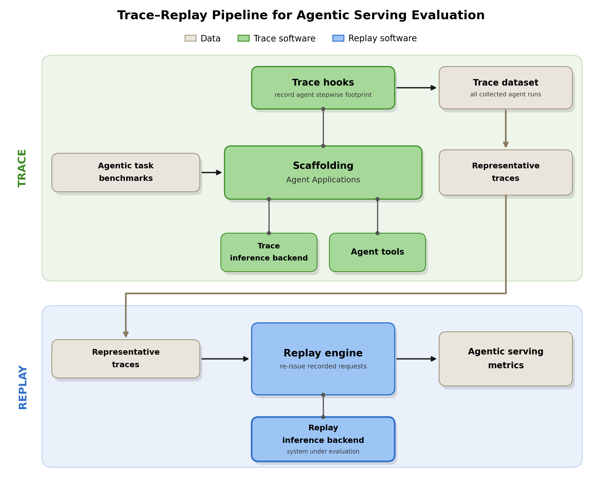
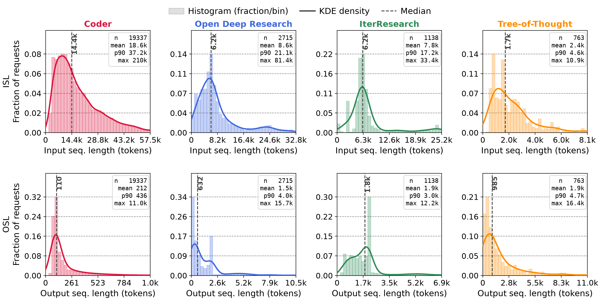
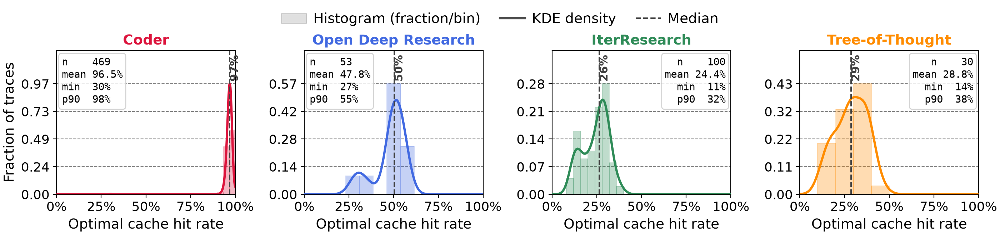
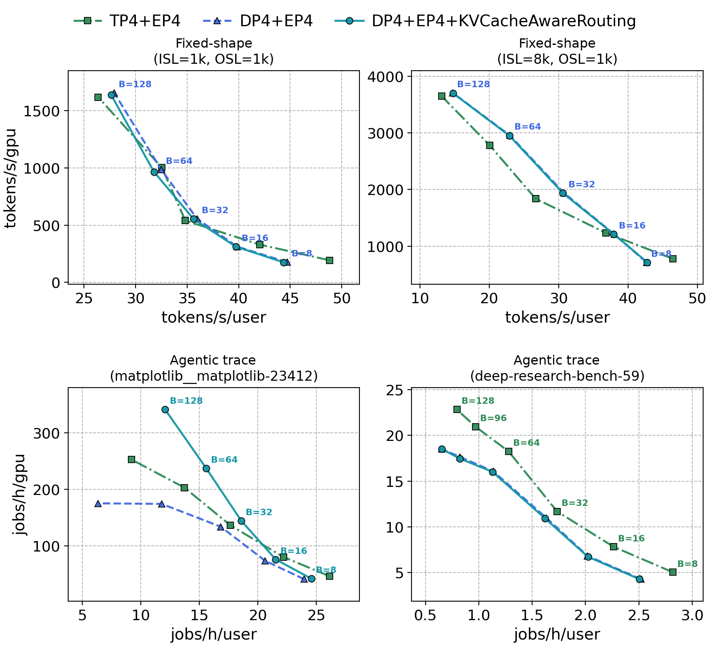
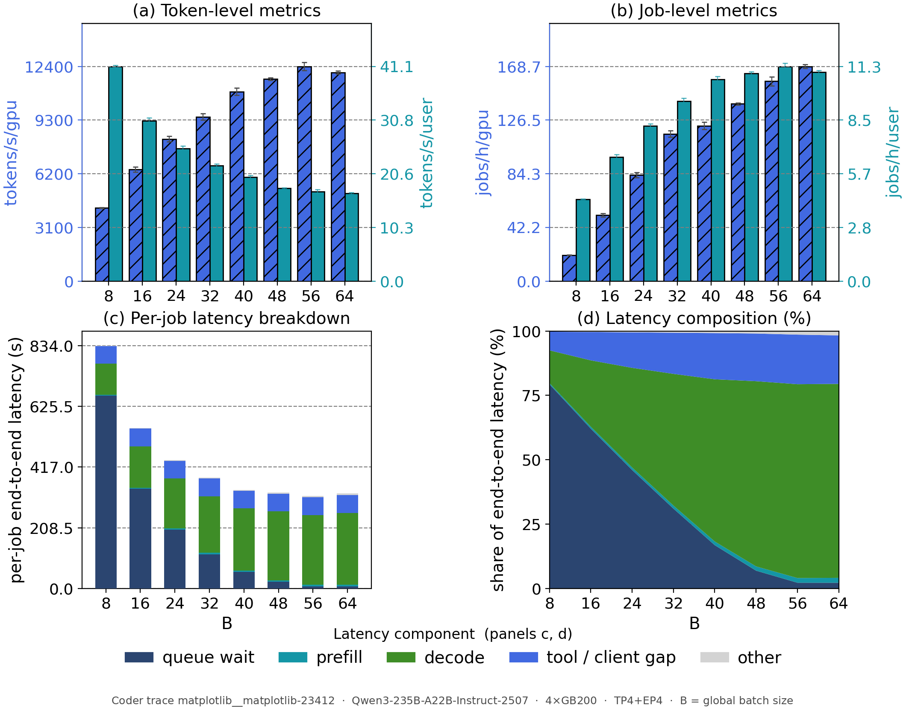
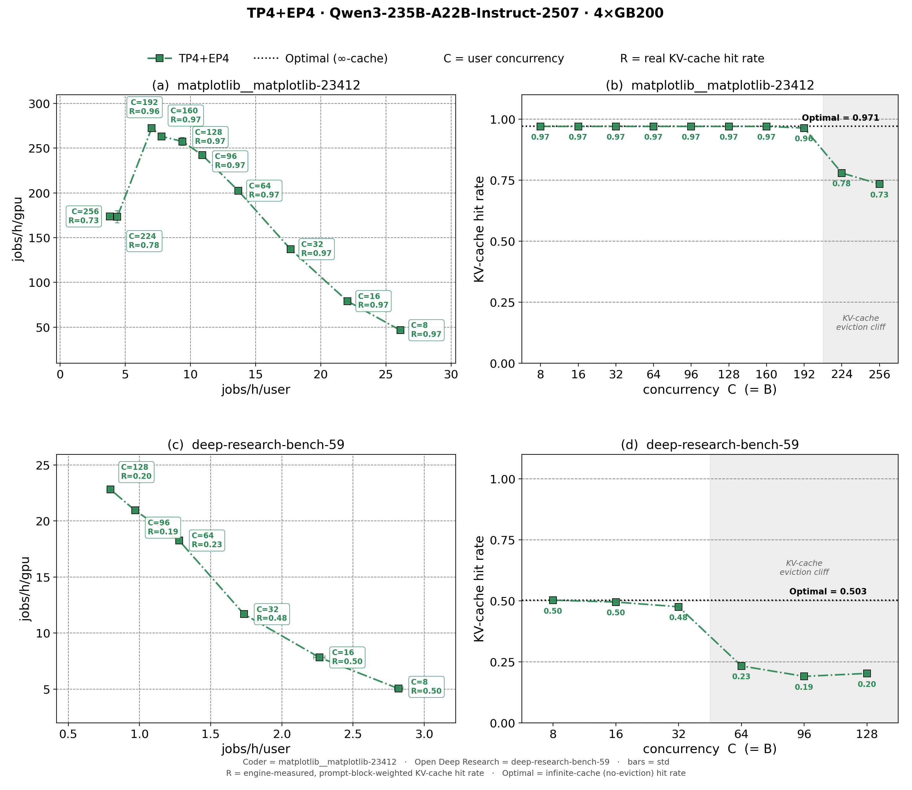
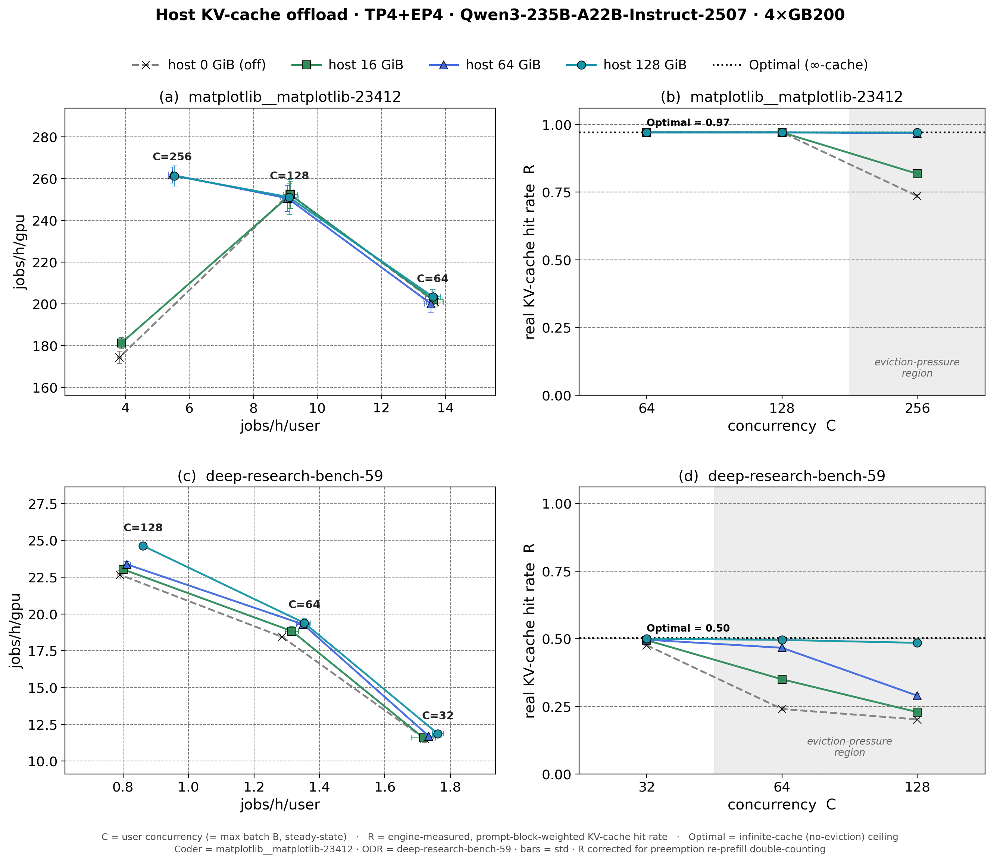
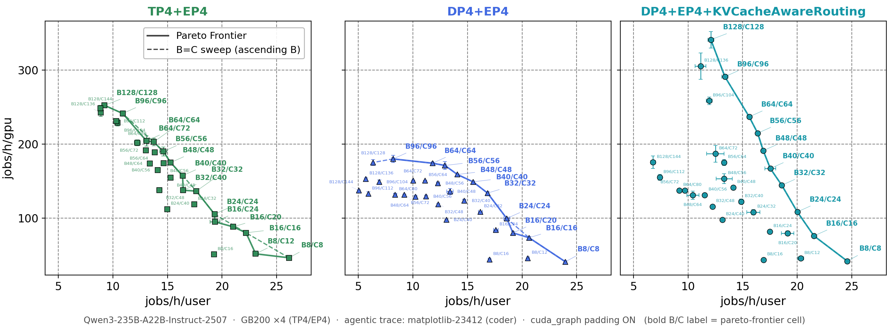
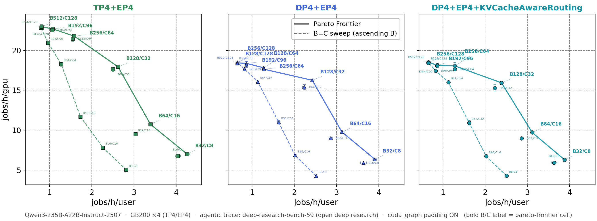

# Evaluating Agentic Serving with Trace Replay and Job-Level Metrics

by NVIDIA TensorRT LLM team

## Motivation

Agentic applications — coding assistants, deep-research pipelines, tree-structured reasoners — are a fast-growing share of LLM serving traffic, and they stress an inference system in ways chatbot traffic never did. Evaluation has not followed: performance is still reported on independent requests of fixed shape, while the workload served is a long-running, multi-turn, tool-invoking, sometimes parallel agent task. Hence a practical question for anyone deploying an agent stack: **how do we measure whether an inference system is actually good at agentic workloads?**

Answering it starts with agreeing on what a good answer looks like. We believe a benchmark for agentic serving should have four characteristics:

- **Intuitive** — it reports the quantity users actually care about, not a proxy.
- **Realistic** — it reflects how the system behaves in a production agent deployment.
- **Convenient** — it can be run apart from the complexity of the real scenario.
- **Reproducible** — repeated runs give stable, comparable results.

These four properties are what the next section measures the existing options against, and what our own methodology is built to satisfy.

## Methodology

To address the aforementioned challenges and strike a balance among the four target dimensions, we adopt the following methodology.

### Trace Real Runs, Replay Synthetic Data

Prior to the agentic era, conventional benchmarks predominantly relied on single-request setups characterized by fixed input and output sequence lengths. Although such benchmarks satisfy the requirements of convenience and reproducibility, they fail to adequately reflect system performance in real-world agentic scenarios. Conversely, evaluating real agents on authentic datasets offers high fidelity, but introduces substantial deployment overhead — requiring not only inference systems but also agent harnesses and sandboxed environments for tool execution. Furthermore, reproducibility is compromised by the non-negligible stochasticity inherent in LLM outputs and agent execution paths.

We therefore record real agent runs — real models, real tools, real tasks — once, and replay them with fake content. Token counts, prefix identity, tool-call durations, and branch boundaries are enough, because content does not affect serving performance: each call keeps its recorded ISL/OSL but is filled with random token IDs. A content-free trace can therefore be published, replayed against a different model than the one that produced it, and scaled to any concurrency without re-instantiating a single tool.

Building upon this, benchmarks typically aim to evaluate scenarios where inference systems concurrently serve multiple agent tasks. In this context, there are two primary design choices: concurrently replaying many copies of a single trace that corresponds to one agent task, or concurrently replaying multiple distinct traces drawn from diverse agent tasks. The former paradigm yields superior reproducibility, whereas the latter more authentically reflects the challenges introduced by inter-request imbalances typical of production environments.

### Simulate the Prefix Pattern

Prefix-based KV-cache reuse significantly affects inference performance in agentic scenarios. Consequently, a realistic benchmark must accurately emulate prefix patterns observed in real-world workloads. This implies that while request content can be synthetic, it cannot be purely random; rather, it must conform to structural prefix constraints. Specifically, these prefix patterns consist of two main components: (1) system prompts, where tokens remain invariant across requests for a given agent service; and (2) multi-turn conversational histories, where preceding turns serve as prefixes for subsequent interactions. Accounting for reasoning (or "thinking") processes introduces further complexity, as internal thinking tokens are typically discarded prior to context propagation. Benchmarks must faithfully capture these characteristics, given their non-negligible impact on serving efficiency.

### Trace and Simulate Tool-Call Time

Frequent tool invocations constitute another defining characteristic of agentic scenarios. From the perspective of the inference system, a tool call introduces an external latency between consecutive requests in a multi-turn conversation. We argue that the time intervals induced by these tool executions are non-negligible in benchmarking. First, they form an integral part of the overall end-to-end latency, thereby directly affecting the corresponding performance metrics. Second, such unpredictable external delays present distinct challenges for inference systems. For instance, (1) the system must prolong KV-cache retention to ensure the cache is not evicted prior to the completion of the tool call; and (2) it must effectively accommodate the inevitable workload fluctuations triggered by these invocations. Consequently, our benchmark records the actual tool execution times from real agent runs and simulates these external delays via sleep operations.

### Trace and Replay Complex Agent Architectures

Today, agentic workflows have evolved far beyond simple multi-turn interactions. The emergence of sub-agents and multi-agent architectures introduces concurrent execution behaviors, whereas operations such as context compression and history rewinding yield increasingly complex prefix patterns. The former induces pronounced request volatility within the inference engine, while the latter degrades KV-cache hit rates and gives rise to large, compute-intensive inference requests. To address this, our work seeks to faithfully capture and replay these higher-order semantics inherent to agentic workloads.

### Report Job-Level Metrics

Inference systems are conventionally compared with token-level Pareto curves (tokens/s/GPU against tokens/s/user). For agentic workloads, we complement that with a Pareto curve over whole **jobs**, for two reasons. First, users perceive end-to-end job latency — spanning many model calls, tool calls, and synchronization points — not per-token rates. Second, token throughput is ambiguous under heavy prefix reuse: on our agentic traces, counting reused prefix tokens reports a per-GPU throughput roughly five times higher than counting only freshly computed tokens, and neither number alone compares systems fairly. A completed job carries no such ambiguity. The two axes are:

- **Job-level interactivity — jobs/h/user**: 3600 s divided by the mean end-to-end job latency in seconds.
- **Job-level throughput — jobs/h/GPU**: completed jobs per hour, normalized by GPU count.

Because a single agent job runs for minutes, both are measured over a steady-state window: the shared system prompt is preloaded so it is a cache hit from the first call, session starts are staggered with a jittered ramp-up so identical copies do not stay phase-aligned, and a job is credited only if it completes inside the window.

Industry practitioners have recently introduced a growing body of work in this domain. [AgentPerf](https://artificialanalysis.ai/methodology/agentperf) from Artificial Analysis replays recorded coding sessions to report the concurrent agents a deployment sustains under an SLO, and [AgentX](https://inferencex.semianalysis.com/datasets) from SemiAnalysis replays coding traces with per-turn token counts and KV-block hashes to reproduce prefix reuse. While sharing a similar high-level methodology, existing efforts still diverge on specific technical choices, such as the selection of evaluation metrics, the rules governing token generation, and the complexity levels of simulated agents.

## Implementation

The methodology above translates into two concrete artifacts: a trace format that captures the structure of an agent run, and a pipeline that collects those traces, replays them against the system under evaluation, and turns the result into metrics. This section takes each in turn, then closes with how to run the pipeline yourself.

### Trace Format

Each agent run produces one compact JSON file holding a `trace_id` and an ordered `events` list. Because token content does not affect serving performance, a trace records only structure and sizes, never the underlying text, which keeps it small, readable, and shareable. The listing below abbreviates the opening of the Coder trace `matplotlib__matplotlib-23412`, one of the two representative traces followed later in this blog:

```json
{
  "trace_id": "ee41c788-de9a-451c-8d9d-696cdb4b9c2b",
  "events": [
    { "event_type": "message", "role": "system", "conversation_id": 0,
      "message_index": 0, "system_prompt_id": "c124a9b6-...", "tokens": 2827 },
    { "event_type": "message", "role": "user", "conversation_id": 0,
      "message_index": 1, "tokens": 1493 },
    { "event_type": "message", "role": "assistant", "conversation_id": 0,
      "message_index": 2, "tool_calls": ["read_file"], "prompt_tokens": 4320,
      "completion_tokens": 176, "reasoning_tokens": 55, "finish_reason": "tool_calls" },
    { "event_type": "tool_call", "tool_name": "read_file",
      "tool_call_id": "tooluse_hc5n...", "duration_ms": 151.3 },
    { "event_type": "message", "role": "tool", "conversation_id": 0,
      "message_index": 3, "tokens": 306 }
  ]
}
```

Every event is one of three kinds:

- **`message`** — one conversation turn. It carries the role (`system`, `user`, `assistant`, or `tool`), the `conversation_id` it belongs to, its `message_index` within that conversation, and a `branch_path` locating it among any parallel branches. A system message also carries a `system_prompt_id`, so replay copies sharing a system prompt are known to share a cacheable prefix. Non-assistant messages record a single `tokens` count; an assistant message instead records `prompt_tokens`, `completion_tokens`, and `reasoning_tokens` (separating thinking from answer), the `tool_calls` it issued, and its `finish_reason`.
- **`tool_call`** — one external tool invocation, with `tool_name`, `tool_call_id`, and the measured `duration_ms` that replay reproduces as a timed sleep.
- **`parallel_start` / `parallel_end`** — branch boundaries capturing fan-out and synchronization. A `parallel_start` opens several branches whose events may run concurrently; only events sharing a `branch_path` are ordered, and the matching `parallel_end` joins and waits for all of them. Nested boundaries express multi-level branching, as in an orchestrator spawning parallel subagents. The single-threaded Coder trace above uses none of these, and its `branch_path` is always empty, whereas an Open Deep Research trace uses them to mark its parallel researchers.

Because every message records its `conversation_id` and `message_index`, replay can reconstruct the exact prompt each call saw — including a context rewind or compaction — directly from the trace file.

### Framework Pipeline

Figure 1 shows the pipeline: a trace-collection phase (top), in which agents run real agentic task benchmarks with their tools while hooks record the stepwise footprint of every run, and a replay-and-evaluation phase (bottom), in which the replay engine re-issues the recorded requests against the system under evaluation and metrics are computed from the run.

<div align="center">
    
</div>
<p align="center"><sub><em>Figure 1. The trace-replay evaluation pipeline: a trace-collection phase (top) and a replay-and-evaluation phase (bottom).</em></sub></p>

The pieces, one by one:

- **Scaffolding agents.** The traced agents are built on [Scaffolding](https://github.com/NVIDIA/TensorRT-LLM/tree/main/tensorrt_llm/scaffolding), TensorRT-LLM's inference-time-compute framework introduced in [Tech Blog 13](blog13_Inference_Time_Compute_Implementation_in_TensorRT-LLM.md), whose controller/worker structure makes an agent's execution graph explicit and therefore traceable.
- **Trace hooks.** Two decorators attach tracing to an existing agent with no change to its logic, so collecting a trace is one CLI switch.
- **Trace files.** Each run is serialized as one `ExecutionTrace` JSON file in the format above; a directory of them forms a replayable dataset.
- **Replay engine.** It applies the replay rules and runs one queue per branch path, so parallel sections and their join points execute concurrently rather than serially.
- **Replay backend.** Any OpenAI-compatible endpoint, typically `trtllm-serve`, and not necessarily the system that served the agents during tracing.
- **Metrics collector.** It aggregates the run into job- and token-level Pareto points over the steady-state window, alongside the engine-reported KV-cache hit rate.
- **Offline analyzer.** A no-GPU pass that walks a trace against an idealized infinite cache and reports the **optimal (upper-bound) KV-cache hit rate**.

### Running the Pipeline

All of these pieces ship in TensorRT-LLM: the tracing hooks and replay engine in [`tensorrt_llm/scaffolding/trace_replay/`](https://github.com/NVIDIA/TensorRT-LLM/tree/main/tensorrt_llm/scaffolding/trace_replay), and an example trace, the replay drivers, and the offline analyzer in [`examples/scaffolding/trace_replay/`](https://github.com/NVIDIA/TensorRT-LLM/tree/main/examples/scaffolding/trace_replay). Four steps cover the flow.

Collecting a trace is one switch on a Scaffolding agent run, which writes a compact `*.trace.json` alongside a full one:

```bash
python examples/scaffolding/contrib/Coder/run_coder.py ... --enable_tracing
```

Replay drives any OpenAI-compatible endpoint, typically `trtllm-serve`, whose config carries the knobs swept in the experiments below. A single-session replay checks the setup, and it works on the shipped example trace before you have collected anything of your own:

```bash
python examples/scaffolding/trace_replay/run_trace_replay.py <trace>.trace.json \
  --model <model> --openai-base-url http://127.0.0.1:8000/v1
```

A job-level Pareto point comes from replaying that trace at concurrency. One run is one point; sweeping the concurrency **C** against the server's batch size **B** traces the curve, and the aggregator collects the runs into one CSV:

```bash
python examples/scaffolding/trace_replay/run_trace_replay_pareto.py <trace>.trace.json \
  --model <model> --openai-base-url http://127.0.0.1:8000/v1 \
  --total-sessions 200 --concurrency 64 --max-batch-size 64 \
  --tensor-parallel-size 4 --arrival-jitter-s 60 --output-json results/run_B64_C64.json

python examples/scaffolding/trace_replay/aggregate_pareto.py results/
```

The offline analyzer needs neither GPU nor server, and reports the `optimal_*` cache hit rates that Figure 6 compares the measured rates against:

```bash
python examples/scaffolding/trace_replay/analysis/compute_cache_hit_trace.py <trace_dir>/
```

See [`examples/scaffolding/trace_replay/README.md`](https://github.com/NVIDIA/TensorRT-LLM/blob/main/examples/scaffolding/trace_replay/README.md) for more details.

## Trace Dataset

We collect 730 traces from four Scaffolding agents, each chosen for a distinct execution pattern and paired with a task suite that matches its workload:

- **Coder** — a ReAct loop that alternates reasoning with filesystem and shell tools (read, search, edit, run, complete). Everything stays in one growing conversation under a single shared system prompt, the canonical ReAct pattern. 500 SWE-bench Verified tasks.
- **Open Deep Research** — a planner–executor researcher. A supervisor turns the request into a research brief, plans directions, and delegates to researcher subagents that investigate in parallel and compress their findings, then synthesizes the final report. It exercises orchestrator–subagent fan-out with a synchronization point before report generation. 100 Deep Research Bench tasks.
- **IterResearch** — an iterative long-horizon researcher. Instead of carrying the full history, it rebuilds each prompt from the current working report, the latest tool call, and the latest observation, then rewrites the report — context compaction that keeps the context bounded across many rounds. 100 Deep Research Bench tasks.
- **Tree-of-Thought Research** — a tree-structured reasoner that expands several candidate thoughts per depth, runs tool calls for selected branches, scores and prunes them, and answers from the surviving trajectory. 30 AIME 2026 problems.

All traces are collected with Claude Opus 4.6 behind an OpenAI-compatible API, which decouples trace collection from the serving stack under evaluation. The four agents land in clearly different regions of the workload space:

| | **Coder** | **Open Deep Research** | **IterResearch** | **Tree-of-Thought** |
|---|---|---|---|---|
| Source dataset | SWE-bench | Deep Research Bench | Deep Research Bench | AIME 2026 |
| Traces | 500 | 100 | 100 | 30 |
| LLM requests / trace (mean) | 38.7 | 27.2 | 11.4 | 25.4 |
| ISL / request (median, p90) | 14.4k, 37.2k | 6.2k, 21.1k | 6.3k, 17.2k | 1.7k, 4.6k |
| OSL / request (median, p90) | 110, 436 | 632, 4.0k | 1.7k, 3.0k | 985, 4.7k |
| Last-turn ISL (mean) | 25.1k | 31.6k | 6.4k | 3.4k |
| Last-turn OSL (mean) | 603 | 12.8k | 5.8k | 643 |
| Optimal cache hit rate (mean) | 96.5% | 47.8% | 24.4% | 28.8% |

<p align="center"><sub><em>Table 1. Trace-dataset summary. ISL/OSL are per LLM request; last-turn values are per trace; the optimal cache hit rate is the per-trace upper bound on prefix reuse, computed offline from the trace.</em></sub></p>

Figure 2 shows the per-request sequence-length distributions. Coder is input-heavy and decode-light: file and shell output accumulate in one growing conversation (median ISL 14.4k, tail to 210k) while each turn emits little (median OSL 110). The research agents invert this, pairing moderate inputs with long, reasoning-heavy outputs.

<div align="center">
    
</div>
<p align="center"><sub><em>Figure 2. Per-request input (top) and output (bottom) sequence-length distributions, by agent.</em></sub></p>

The agents differ most in reuse. Figure 3 plots the per-trace optimal prefix-cache hit rate, computed offline against an unbounded cache with the system prompt preloaded. Coder traces are almost entirely reusable (mean 96.5%, tightly concentrated near 100%), because one shared prefix grows monotonically and each turn re-reads what previous turns already cached. The research agents reach only 47.8%, 24.4%, and 28.8%, because subagent fan-out, context rewriting, and branch exploration repeatedly introduce fresh context — previewing why prefix caching dominates Coder-style serving and matters much less elsewhere.

<div align="center">
    
</div>
<p align="center"><sub><em>Figure 3. Per-trace optimal (idealized) prefix-cache hit rate, by agent.</em></sub></p>

The rest of this blog follows two representative traces at opposite ends of this space: a **Coder** trace (`matplotlib__matplotlib-23412`, a single ReAct thread of 23 requests running 119 s, 60% generating and 40% in tools, whose prompts are ~34% shared system prompt and ~63% own history, leaving only ~3% fresh tokens) and an **Open Deep Research** trace (`deep-research-bench-59`, a supervisor plus four parallel researcher branches running 512 s, 98% generation-bound, where the supervisor reuses only ~35% of its prompt and the researcher branches reuse just ~10%).

## Experimental Findings

We serve Qwen3-235B-A22B-Instruct-2507 through TensorRT-LLM on a single GB200 node (4 GPUs) and replay the two representative traces while varying the server maximum batch size **B** and the user concurrency **C** (the number of agent sessions replayed at once).

### Token-Level and Job-Level Metrics Can Disagree

Figure 4 compares three ways of parallelizing the model across the four GPUs — TP4+EP4, DP4+EP4, and DP4+EP4 with KV-cache-aware routing — under the token-level view on fixed-shape inputs (top) and the job-level view on the agentic traces (bottom). On fixed shapes the three strategies nearly coincide; on the agentic traces TP4+EP4 leads along the entire frontier, and KV-cache-aware routing helps only where a large shared prefix exists to route toward: it lifts the frontier substantially on the highly cacheable Coder trace, but shows no visible gain on Open Deep Research, whose parallel researcher branches share little prefix, nor on fixed shapes, where independent requests share none at all. A fixed-shape benchmark would report the strategies as interchangeable and hide this difference entirely.

<div align="center">
    
</div>
<p align="center"><sub><em>Figure 4. Token-level Pareto on fixed-shape inputs (top) versus job-level Pareto on the agentic traces (bottom), across three parallel strategies.</em></sub></p>

The two views also favor different batch sizes. Figure 5 holds C fixed and sweeps B: token-level interactivity (tokens/s/user) falls monotonically as B grows, because a larger decode batch lengthens each step — yet job-level interactivity (jobs/h/user) *rises* over most of the sweep, peaking at an intermediate B. The latency breakdown (panels c, d) explains why: a larger batch sharply reduces the queue wait that dominates end-to-end latency at small B, and that outweighs the longer decode, so the whole job finishes sooner. Only the job-level view follows the latency a user actually experiences.

<div align="center">
    
</div>
<p align="center"><sub><em>Figure 5. Sweeping the server batch size at fixed user concurrency. Token-level (a) and job-level (b) interactivity move oppositely; the per-job latency breakdown (c, d) explains why.</em></sub></p>

### Prefix Caching Dominates Multi-Turn Serving

Figure 6 sweeps concurrency (with TP4+EP4 fixed) and annotates each job-level Pareto point with the engine-measured KV-cache hit rate. At low and moderate concurrency the measured rate matches the optimal upper bound computed offline from the trace — about 0.97 for Coder and 0.50 for Open Deep Research — confirming that the idealized per-trace rates are actually realized once the cache can hold the prefixes. As concurrency rises, the KV-cache pool overflows and the hit rate falls off a **KV-cache eviction cliff** (toward 0.73 and 0.19 respectively), and the job-level Pareto degrades in exactly that region. For Coder-style serving, the performance ceiling is set by prefix-cache residency, not raw compute.

<div align="center">
    
</div>
<p align="center"><sub><em>Figure 6. Measured versus optimal prefix-cache hit rate, with the job-level Pareto alongside, as concurrency grows (Coder top, Open Deep Research bottom).</em></sub></p>

Host offloading pushes the cliff back. In TensorRT-LLM this is one line in the serving config:

```yaml
# extra-llm-api-config.yml
kv_cache_config:
  host_cache_size: 68719476736   # 64 GiB of host memory for offloaded KV blocks
```

Figure 7 repeats the sweep with host budgets of 0–128 GiB. Evicted prefixes are retained in host memory instead of discarded, so the hit rate stays near optimal at high concurrency — for Coder, from 0.73 back to nearly the 0.97 optimum at the largest budgets — and the job-level Pareto lifts accordingly. The benefit scales with workload reusability: largest for Coder, still clear for Open Deep Research.

<div align="center">
    
</div>
<p align="center"><sub><em>Figure 7. Effect of host KV-cache offloading (0 to 128 GiB) on hit rate and job-level throughput (Coder top, Open Deep Research bottom).</em></sub></p>

### Batch Size Should Follow the Agent's Branching Structure

Single-request benchmarks conventionally set C = B and fill every batch slot. Agentic sessions break that correspondence in two opposite ways:

- **Single-branch agents (Coder): stay near B = C.** Tool-call gaps mean fewer than C requests are on the server at any instant, so the batch runs underfilled at C = B (averaging ~51 of 64 slots in our sweep). But raising C above B to fill the batch adds more queuing delay than the underfill costs — especially since CUDA-graph batch padding makes a slightly underfilled batch nearly free. Figure 8 sweeps the full (B, C) grid for the Coder trace: the job-level frontier stays close to the B = C diagonal.
- **Fan-out agents (Open Deep Research): B well above C.** One session issues multiple concurrent requests during its fan-out phase, so the server sees more requests in flight than sessions. Figure 9 repeats the sweep for the Open Deep Research trace, and the contrast with Figure 8 is stark: the frontier sits not on the diagonal but mostly at B = 2C and B = 4C. The branch multiplicity, not the session count, sets the batch size the server needs.

Fan-out also makes the serving behavior harder to reason about in general. A single session no longer maps to a single in-flight request, so the load a server actually sees depends on how many branches are open at each moment — which varies within a job and across agent architectures. The best (B, C) point therefore leaves the diagonal and moves with the branching structure, and the configuration space to search grows accordingly. Finding a good configuration by intuition or by a fixed-shape benchmark is unlikely; it takes a reproducible replay of the real branching structure, which is what the trace-replay framework provides.

<div align="center">
    
</div>
<p align="center"><sub><em>Figure 8. Job-level Pareto frontier over a full (B, C) sweep for the Coder trace, by parallel strategy. The frontier stays close to the B = C diagonal.</em></sub></p>

<div align="center">
    
</div>
<p align="center"><sub><em>Figure 9. Job-level Pareto frontier over a full (B, C) sweep for the Open Deep Research trace, by parallel strategy. Subagent fan-out pushes the frontier to B = 2C and B = 4C.</em></sub></p>

## Future Work

Agent workloads keep changing, and with them the shapes that reach the serving system: agent architectures evolve, context-management strategies such as compaction alter how much prefix survives across turns, and tool usage shifts the balance between waiting and computing. Any of these can move where the bottleneck sits, and a configuration tuned for today's traces may not hold for tomorrow's.

The TensorRT-LLM team treats real agentic workloads as a first-class target, not a variant of chat serving. We will therefore keep tracking the workload characteristics of real agentic scenarios — extending the trace dataset as new agent patterns appear and re-measuring the job-level behavior they produce — and keep investing in the optimizations these measurements point to, from prefix-cache capacity and KV offloading to routing, scheduling, and configuration that follows an agent's branching structure. The goal is that our performance work is driven by what deployments actually run, and lands where it matters in the real world.
