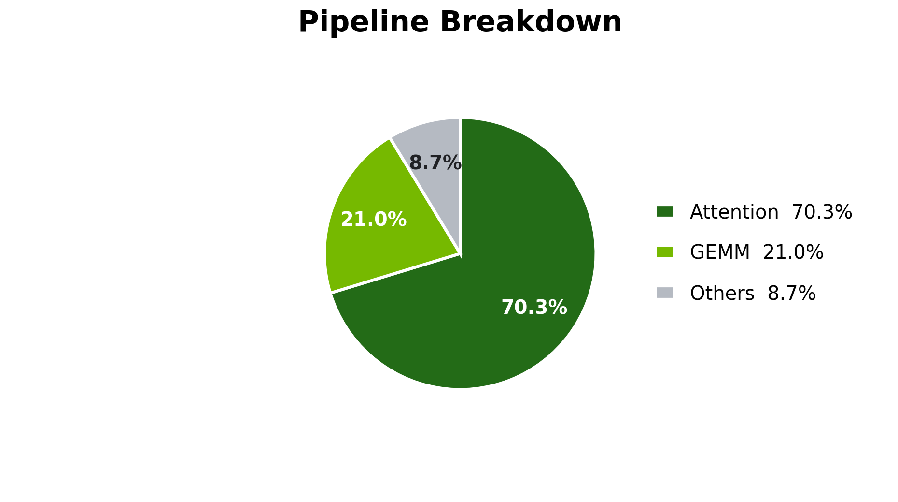
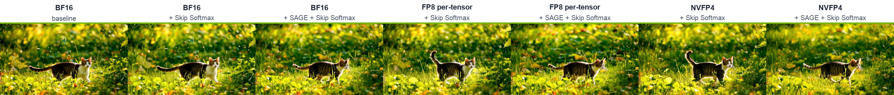
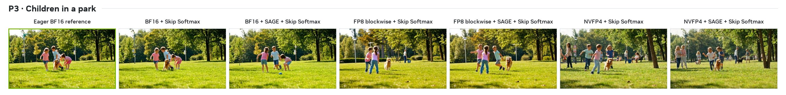
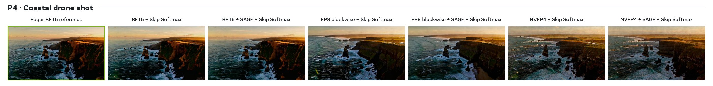
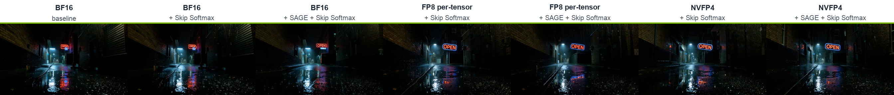
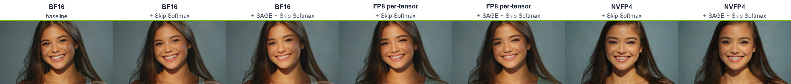
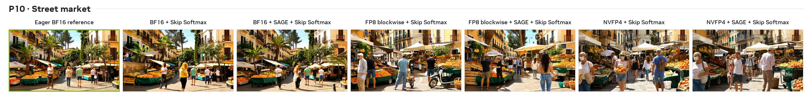
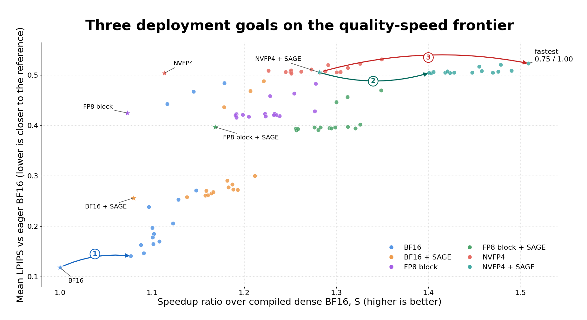

# Accelerating Video Generation: GEMM Quantization and Attention Optimizations in TensorRT-LLM

By NVIDIA TensorRT-LLM Team

## Introduction

Video diffusion transformers repeatedly process long spatiotemporal token sequences across many
denoising steps. Linear layers and attention therefore dominate much of the compute, making them
the two most direct targets for reducing generation latency.

Figure 1 breaks down pipeline-forward time for Wan 2.2 T2V-A14B on a single NVIDIA B200. For an
81-frame, 1280×720 video with 50 denoising steps, attention and linear-layer GEMMs account for
71.7% and 20.8% of compiled BF16 pipeline-forward time, respectively.

<p align="center">
  
</p>

<p align="center"><sub><em>Figure 1. Pipeline-forward breakdown for compiled dense BF16 on
B200.</em></sub></p>

Our earlier post,
[Scaling Video Generation Across NVL72 Rack with TensorRT-LLM](https://github.com/NVIDIA/TensorRT-LLM/blob/main/docs/source/blogs/tech_blog/blog25_Scaling_Video_Generation_Across_NVL72_Rack_with_TensorRT-LLM.md),
focused on scale-out. This post covers three complementary acceleration techniques inside one
transformer pipeline: linear-layer quantization, quantized attention, and sparse attention. On
the Wan 2.2 workload above, the combination of NVFP4 linear layers, SAGE quantized attention, and
Skip Softmax reduces pipeline-forward latency from **525.0 to 374.9
seconds**, a **1.40× speedup**. The central question is how to recover that time without giving
up more visual quality than the application can tolerate.

## Table of Contents

- [Quantization](#quantization)
- [Attention Optimizations](#attention-optimizations)
- [Results](#results)
- [Reproduction](#reproduction)
- [Conclusion](#conclusion)
- [References](#references)

## GEMM Quantization

Linear-layer quantization reduces the precision of eligible weights and activations so their GEMMs
can use higher-throughput Tensor Core paths. The available and upcoming VisualGen paths differ in
both numeric precision and scale granularity:

| Linear-layer path | Weight / activation precision | Scale granularity | Dynamic from high-precision weights | Static checkpoint |
| :--- | :--- | :--- | :---: | :---: |
| FP8 per-tensor | FP8 E4M3 / FP8 E4M3 | One scale per tensor | Yes | Yes |
| FP8 blockwise | FP8 E4M3 / FP8 E4M3 | 128×128 weight blocks; 1×128 activation blocks | Yes | Yes |
| FP8 row-wise | FP8 E4M3 / FP8 E4M3 | Per-output-channel weights; per-token activations | Yes ([WIP](https://github.com/NVIDIA/TensorRT-LLM/pull/16847)) | Yes ([WIP](https://github.com/NVIDIA/TensorRT-LLM/pull/16847)) |
| NVFP4 | FP4 E2M1 / FP4 E2M1 | 16-element blocks with FP8 scale factors | Yes | Yes |

Here, *dynamic* means converting high-precision weights while loading the model, while *static*
means loading a prequantized checkpoint with its scales. Static checkpoints can be produced with
[NVIDIA Model Optimizer](https://github.com/NVIDIA/Model-Optimizer), whose offline calibration can
apply model-aware choices such as calibrated scales and keeping sensitive layers at higher
precision. At the same target format, these algorithmic choices generally preserve accuracy
better than quantizing every eligible layer dynamically at load time. This distinction describes
how weights are prepared; activations are quantized as the model runs. The FP8 blockwise and
NVFP4 results below dynamically quantize eligible BF16 weights at load time. The ModelOpt
metadata stored with the checkpoint calibrates Skip Softmax; it does not prequantize those
weights. NVFP4 pushes precision lower for more throughput.

## Attention Optimizations

Attention offers two complementary levers: quantization makes its matrix multiplications cheaper,
while sparsity avoids work that contributes little to the output.

### Quantized Attention

An attention layer performs two matrix multiplications around softmax. QK16PV8 keeps Q and K in
BF16 and quantizes V to FP8, accelerating the second multiplication while retaining full-precision
inputs for the first. SAGE goes further by quantizing Q/K as well as V, allowing both
multiplications to run through an 8-bit path. TensorRT-LLM's SAGE recipe follows the
[SageAttention2](https://arxiv.org/abs/2411.10958) line of work, using INT8 or FP8 Q/K and FP8 V
rather than the paper's per-thread INT4 Q/K recipe.

This post uses SAGE, which can be layered with Skip Softmax to combine quantization and sparsity in
the same attention path.

### Sparse Attention with Skip Softmax

[Skip Softmax Attention](blog16_Accelerating_Long_Context_Inference_with_Skip_Softmax_Attention.md),
also called BLASST, keeps the QK calculation but rejects score blocks sufficiently below the
running maximum. Rejected blocks skip exponentiation and the corresponding value accumulation;
the sparsity pattern is determined dynamically rather than stored with the model.

Two controls shape the tradeoff: how aggressively to skip and how far into denoising to begin.
Calibration also protects sensitive layers by leaving them on dense attention. Together, these
controls turn Skip Softmax into a final tuning knob after linear-layer and attention quantization
have established the main operating point. For configuration details, see
[Skip Softmax Attention](https://github.com/NVIDIA/TensorRT-LLM/blob/main/docs/source/visual-gen/features/sparse-attention.md#skip-softmax-attention).

## Results

### Experimental setup

We evaluate the three techniques on a fixed Wan 2.2 workload while varying linear-layer precision,
attention precision, and Skip Softmax settings.

| Item | Setting |
| :--- | :--- |
| Checkpoint | [Wan-AI/Wan2.2-T2V-A14B-Diffusers](https://huggingface.co/Wan-AI/Wan2.2-T2V-A14B-Diffusers) BF16 weights with ModelOpt-generated Skip Softmax metadata for both transformers |
| Accelerator | NVIDIA B200 |
| Generated video | 1280×720, 81 frames at 16 FPS |
| Denoising | 50 steps; guidance 5.0 for the high-noise expert and 4.0 for the low-noise expert; maximum text sequence length 512 |
| Linear-layer paths | BF16, dynamic `FP8_BLOCK_SCALES`, dynamic `NVFP4` |
| Attention paths | Dense, or SAGE with INT8 Q/K, FP8 V, and Q/K/V block sizes of 1/16/1 |

Classifier-free guidance runs at every step by batching the positive and negative branches
together; CFG parallelism is disabled.

The 96 configurations are a characterization sweep, not a recommended per-model tuning cost:

```text
{BF16 reference, FP8_BLOCK_SCALES, NVFP4}
× {dense attention, SAGE}
× {no Skip Softmax, or
   target_sparsity {0.65, 0.70, 0.75}
   × disabled_until_timestep {0.86, 0.90, 0.94, 0.97, 1.00}}
```

Every setting uses the same seven prompt-and-seed pairs. Speedup is relative to compiled dense
BF16, and LPIPS compares each video with an eager BF16 generation from the same prompt and seed.
Latency covers one complete 50-step pipeline forward after compilation warmup; model loading, HTTP
handling, and video encoding are outside the measurement.

### Visual comparison

Video quality includes motion consistency and temporal stability, which a framewise metric cannot
show on its own. Figure 2 compares four P1 generations. All three Skip Softmax examples use the
conservative star setting from the frontier: `target_sparsity=0.75` and
`disabled_until_timestep=0.86`.

| Eager BF16 reference | BF16 + SAGE + Skip Softmax |
| :---: | :---: |
|  |  |
| **FP8 blockwise + SAGE + Skip Softmax** | **NVFP4 + SAGE + Skip Softmax** |
|  |  |

<p align="center"><sub><em>Figure 2. P1 video comparison across the eager BF16 reference and three
SAGE + Skip Softmax configurations.</em></sub></p>

Figure 3 expands the first-frame comparison to all seven prompts and all six GEMM/attention
families. Every Skip Softmax image uses the same conservative star setting as Figure 2. Each panel
retains the original 384×216 pixels for every generated frame.

<p align="center">
  
</p>

<p align="center">
  
</p>

<p align="center">
  
</p>

<p align="center">
  
</p>

<p align="center">
  
</p>

<p align="center">
  
</p>

<p align="center">
  
</p>

<p align="center"><sub><em>Figure 3. First-frame comparison across all seven prompts. Every Skip
Softmax result uses `target_sparsity=0.75` and `disabled_until_timestep=0.86`, corresponding to
the stars in Figure 4.</em></sub></p>

### Quality-speed frontier

Skip Softmax introduces an explicit quality-speed tradeoff. Figure 4 maps every configuration
instead of reducing the sweep to a few hand-picked points. Squares mark runs without Skip Softmax;
stars mark the conservative configuration (`target_sparsity=0.75`,
`disabled_until_timestep=0.86`); and triangles mark the aggressive end of the sweep
(`target_sparsity=0.75`, `disabled_until_timestep=1.00`). The remaining sweep points are circles,
and the dashed line traces the global Pareto frontier.

The common speedup baseline is compiled BF16 with dense attention and Skip Softmax disabled. Its
mean pipeline-forward latency is **525.0 seconds** across the seven prompts, so a point at
1.40× corresponds to roughly 375 seconds under the same measurement.

<p align="center">
  
</p>

<p align="center"><sub><em>Figure 4. Speedup–quality frontier across all 96
configurations. LPIPS is measured against eager BF16; speedup is relative to compiled dense
BF16.</em></sub></p>

### Frontier analysis

The table condenses the 18 marked points into six family rows. Each cell reports
`speedup / mean LPIPS`; the star and triangle use the same Skip Softmax settings as Figure 4.

| GEMM/attention quantization | ■ No Skip Softmax | ★ Conservative Skip Softmax | ▲ Aggressive Skip Softmax |
| :--- | :--- | :--- | :--- |
| BF16 | 1.000× / 0.1181 | 1.108× / 0.1701 | 1.179× / 0.4844 |
| BF16 + SAGE | 1.080× / 0.2562 | 1.167× / 0.2681 | 1.221× / 0.4883 |
| FP8 blockwise | 1.073× / 0.4249 | 1.223× / 0.4237 | 1.278× / 0.4835 |
| FP8 blockwise + SAGE | 1.169× / 0.3971 | 1.283× / 0.3961 | 1.349× / 0.4697 |
| NVFP4 | 1.113× / 0.5042 | 1.262× / 0.5071 | 1.349× / 0.5319 |
| NVFP4 + SAGE | 1.281× / 0.5057 | 1.421× / 0.5076 | 1.509× / 0.5234 |

The first large quality shift comes from dynamic GEMM quantization. BF16, FP8 blockwise, and
NVFP4 form distinct LPIPS bands, with lower-precision GEMMs moving progressively higher in the
plot. These runs quantize eligible weights while loading the model. Offline static quantization
with ModelOpt can calibrate scales and protect sensitive layers, leaving substantial room to
improve quality at the same numeric format.

SAGE attention has a smaller quality impact than the dynamic GEMM conversion. The separation
between the BF16, FP8, and NVFP4 bands is much larger than the separation between SAGE and
non-SAGE points inside each band, while SAGE consistently moves the operating point toward higher
speedup.

Skip Softmax then fills the space within each family. `target_sparsity` controls how much work can
be rejected, while `disabled_until_timestep` controls how early that rejection begins. Together
they provide a continuum between the conservative stars and aggressive triangles instead of a
single all-or-nothing sparse mode.

This layered structure explains the Pareto frontier. Almost every frontier point enables Skip
Softmax, and every FP8 or NVFP4 point on the frontier combines it with SAGE. Dynamic GEMM
quantization chooses the broad quality band; SAGE and Skip Softmax then recover speed within that
band.

## Reproduction

The steps below target TensorRT-LLM 1.3.0rc24.

The [Wan 2.2 Skip Softmax example](https://github.com/NVIDIA/TensorRT-LLM/tree/main/examples/visual_gen/skip_softmax/wan2.2-t2v-a14b)
contains the two ModelOpt calibration overlays and the VisualGen configuration for the 1.40×
NVFP4 + SAGE result. Start with a local copy of the public BF16 checkpoint and apply the overlays
to its high-noise and low-noise transformer configs:

```bash
export MODEL_DIR=/path/to/Wan2.2-T2V-A14B-Diffusers
export TRTLLM_ROOT=/path/to/TensorRT-LLM
export EXAMPLE_DIR="$TRTLLM_ROOT/examples/visual_gen/skip_softmax/wan2.2-t2v-a14b"

python "$EXAMPLE_DIR/apply_calibration.py" --model-dir "$MODEL_DIR"
```

The helper adds only calibrated Skip Softmax metadata to the checkpoint; it does not quantize GEMM
weights. Runtime choices are centralized in the packaged
[`visual_gen.yaml`](https://github.com/NVIDIA/TensorRT-LLM/blob/main/examples/visual_gen/skip_softmax/wan2.2-t2v-a14b/visual_gen.yaml).

### VisualGen configuration

The relevant part of the packaged YAML reproduces the 1.40× NVFP4 + SAGE + Skip Softmax
configuration:

```yaml
quant_config:
  quant_algo: NVFP4
  dynamic: true

attention_config:
  backend: TRTLLM
  quant_attention_config:
    qk_dtype: int8
    v_dtype: fp8
    q_block_size: 1
    k_block_size: 16
    v_block_size: 1
  sparse_attention_config:
    algorithm: skip_softmax
    target_sparsity: 0.65
    disabled_until_timestep: 0.86

torch_compile_config:
  enable: true
  enable_autotune: false

cuda_graph_config:
  enable: false
```

The `quant_config` block selects the linear-layer GEMM path. All three choices start from the same
public BF16 checkpoint. For BF16 GEMMs, omit the block or set it to `null`:

```yaml
quant_config: null
```

For dynamic FP8 blockwise GEMMs, use:

```yaml
quant_config:
  quant_algo: FP8_BLOCK_SCALES
  dynamic: true
```

For dynamic NVFP4 GEMMs, retain the packaged setting:

```yaml
quant_config:
  quant_algo: NVFP4
  dynamic: true
```

BF16 leaves eligible linear-layer weights and activations unquantized. With `dynamic: true`, the
FP8 blockwise and NVFP4 paths quantize eligible BF16 weights while loading the checkpoint and
quantize activations as the model runs. FP8 blockwise uses 128×128 weight blocks and 1×128
activation blocks; NVFP4 uses 16-element blocks. These are dynamic conversions, not ModelOpt
static GEMM-quantized checkpoints.

The `quant_attention_config` block selects SAGE attention independently of GEMM precision. Remove
that block to keep attention unquantized while retaining the `TRTLLM` backend and Skip Softmax.
QK16PV8 and SAGE occupy the same field, but use different backends and scaling layouts:

| Recipe | Backend | Q/K precision | V precision | Q/K/V block sizes | Combines with Skip Softmax |
| :--- | :--- | :--- | :--- | :--- | :--- |
| QK16PV8 | `CUTEDSL` | BF16 | FP8 | 0/0/0 (tensor-wide V scale) | No |
| SAGE used here | `TRTLLM` | INT8 | FP8 | 1/16/1 | Yes |

The current QK16PV8 kernel targets Blackwell `sm_100a` and `sm_103a` with head dimension 128; the
current SAGE path requires Blackwell `sm_100`. Skip Softmax also uses the `TRTLLM` backend, which
is why it composes with SAGE but not the `CUTEDSL` QK16PV8 path.

The `sparse_attention_config` block controls Skip Softmax. `target_sparsity` is converted to a
threshold through each transformer's calibration formula, so achieved sparsity can vary by layer
and timestep. `disabled_until_timestep` controls when skipping begins as denoising descends from
near 1 to 0: a lower value keeps more early steps dense. Calibration also supplies an `ignore`
list for layers that should stay dense.

Start `trtllm-serve` with the packaged configuration:

```bash
trtllm-serve "$MODEL_DIR" --visual_gen_args "$EXAMPLE_DIR/visual_gen.yaml"
```

Then submit the P1 prompt from another shell. The synchronous endpoint returns the encoded video
directly:

```bash
curl --fail --silent --show-error \
    --request POST http://localhost:8000/v1/videos/generations \
    --header 'Content-Type: application/json' \
    --output wan22_nvfp4_sage_skip.mp4 \
    --data '{
      "prompt": "A cat walking through a sunlit garden, gentle breeze rustling leaves, slow tracking shot",
      "width": 1280,
      "height": 720,
      "num_frames": 81,
      "frame_rate": 16,
      "num_inference_steps": 50,
      "guidance_scale": 5.0,
      "max_sequence_length": 512,
      "seed": 1001,
      "format": "mp4",
      "extra_params": {
        "guidance_scale_2": 4.0
      }
    }'
```

<details>
<summary>Seven-prompt evaluation manifest</summary>

| ID | Seed | Prompt |
| :--- | ---: | :--- |
| `p01_cat_garden` | 1001 | A cat walking through a sunlit garden, gentle breeze rustling leaves, slow tracking shot |
| `p03_park_kids` | 1003 | Children playing in a busy park, a golden retriever running between them, sunny afternoon, wide shot |
| `p04_drone_coast` | 1004 | Drone shot flying over a rugged coastline at sunset, waves crashing on cliffs below, golden hour lighting |
| `p05_neon_sign` | 1005 | A neon sign reading 'OPEN' flickering in a rainy alley at night, reflections on wet pavement, cinematic |
| `p06_woman_smile` | 1006 | A young woman smiling at the camera, soft studio lighting, slight head tilt, cinematic close-up portrait |
| `p07_horse_gallop` | 1007 | A racehorse galloping on a dirt track, kicking up dust, side tracking shot, dramatic lighting |
| `p10_market` | 1010 | A bustling outdoor street market with people walking and vendors selling fresh fruit, Mediterranean style, midday sun |

</details>

For the reported latency, each prompt first runs one untimed 50-step generation to compile both
Wan transformer stages. After CUDA synchronization, a second 50-step pipeline forward is timed
and synchronized; the seven prompt times are then averaged. Video encoding is outside this timed
region. The eager BF16 quality reference disables compilation, quantization, SAGE, and Skip
Softmax. AlexNet LPIPS is computed between corresponding frames, averaged over all 81 frames and
then over the seven prompts.

### Agentic optimization (TODO)

Finding a useful speed-quality tradeoff by hand is laborious: every candidate must be generated
across multiple prompts, timed, compared with a quality reference, and folded back into the
frontier. **TODO:** add an agentic workflow that launches these experiments, analyzes the frontier,
and proposes the next configurations to evaluate.

## Conclusion

Accelerating video diffusion is not a single precision switch. It is a process of deciding where
the pipeline can tolerate lower precision and where it can safely avoid work altogether.
TensorRT-LLM exposes linear-layer quantization, quantized attention, and Skip Softmax as
composable controls, so deployments can choose an operating point that matches their own quality
bar instead of inheriting one fixed recipe.

That operating point is model-, prompt-, and hardware-dependent. A useful optimization workflow
therefore combines representative prompts, deployment-relevant latency, aggregate quality
metrics, and direct inspection of generated videos. Offline calibration with ModelOpt and a more
automated frontier search are natural next steps for making this process both more accurate and
less labor-intensive.

These single-GPU techniques are also orthogonal to the scale-out methods in
[Scaling Video Generation Across NVL72 Rack with TensorRT-LLM](https://github.com/NVIDIA/TensorRT-LLM/blob/main/docs/source/blogs/tech_blog/blog25_Scaling_Video_Generation_Across_NVL72_Rack_with_TensorRT-LLM.md),
and can be combined with multi-GPU parallelism when the deployment requires higher throughput or
larger workloads.

## References

1. [Scaling Video Generation Across NVL72 Rack with TensorRT-LLM](https://github.com/NVIDIA/TensorRT-LLM/blob/main/docs/source/blogs/tech_blog/blog25_Scaling_Video_Generation_Across_NVL72_Rack_with_TensorRT-LLM.md)
2. [SageAttention: Accurate 8-Bit Attention for Plug-and-play Inference Acceleration](https://arxiv.org/abs/2410.02367)
3. [SageAttention2: Efficient Attention with Thorough Outlier Smoothing and Per-thread INT4 Quantization](https://arxiv.org/abs/2411.10958)
4. [NVIDIA Model Optimizer Diffusers Quantization Example](https://github.com/NVIDIA/Model-Optimizer/tree/main/examples/diffusers)
5. [BLASST: Dynamic BLocked Attention Sparsity via Softmax Thresholding](https://arxiv.org/abs/2512.12087)
