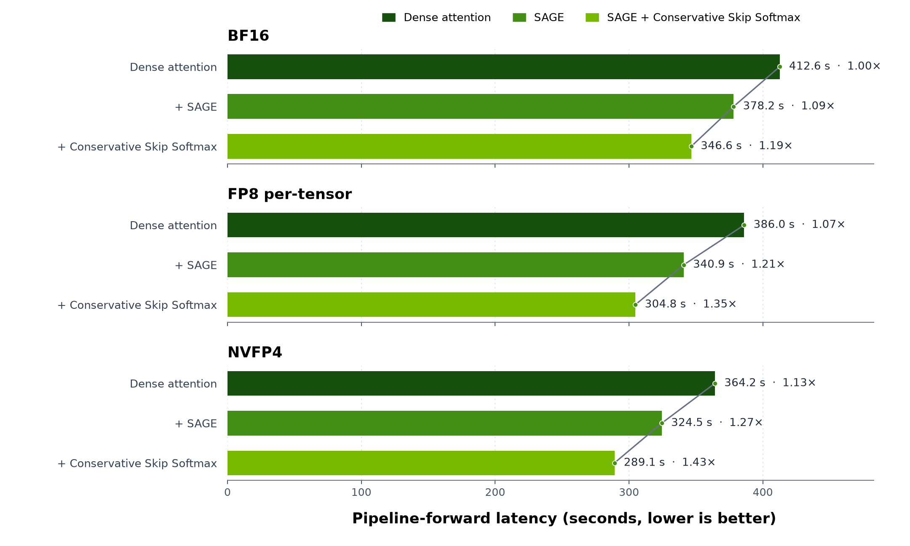

# Accelerating Video Generation with GEMM Quantization, Attention Quantization and Skip Softmax Attention in TensorRT-LLM

By NVIDIA TensorRT-LLM Team

## Introduction

Video diffusion transformers (DiTs) repeatedly process long spatiotemporal token sequences across multiple denoising steps. Linear and attention layers therefore dominate much of the compute, making them the two most direct targets for reducing generation latency.

Figure 1 breaks down pipeline-forward time for Wan 2.2 T2V-A14B on a single NVIDIA B200. For an 81-frame, 1280×720 video with 40 denoising steps, attention and linear-layer GEMMs account for 70.3% and 21.0% of BF16 pipeline-forward time, respectively.

<p align="center">
  
</p>
<p align="center"><sub><em>Figure 1. Diffusion pipeline-forward breakdown for Wan 2.2 T2V-A14B in BF16 on B200.</em></sub></p>

Our earlier post, [Scaling Video Generation Across NVL72 Rack with TensorRT-LLM](https://github.com/NVIDIA/TensorRT-LLM/blob/main/docs/source/blogs/tech_blog/blog25_Scaling_Video_Generation_Across_NVL72_Rack_with_TensorRT-LLM.md), showed how TensorRT-LLM accelerates video generation across an NVL72 rack. This post focuses on three complementary techniques within one transformer pipeline: GEMM quantization, quantized attention, and sparse attention. The central question is how to reduce latency without giving up more visual quality than the application can tolerate.

## Table of Contents

- [GEMM Quantization](#gemm-quantization)
- [Attention Optimizations](#attention-optimizations)
- [Results](#results)
- [Reproduction](#reproduction)
- [Conclusion](#conclusion)
- [References](#references)

## GEMM Quantization

GEMM quantization reduces the numerical precision of weights and activations so linear-layer GEMMs can use higher-throughput, low-precision Tensor Core paths. TensorRT-LLM VisualGen supports the following GEMM quantization paths:

| `quant_algo` | Weight precision | Weight scaling | Activation precision | Activation scaling |
| :--- | :--- | :--- | :--- | :--- |
| `FP8` | FP8 E4M3 | Per tensor (FP32) | FP8 E4M3 | Per tensor (FP32) |
| `FP8_BLOCK_SCALES` | FP8 E4M3 | Per 128×128 block (FP32<sup>*</sup>) | FP8 E4M3 | Per 1×128 block (FP32<sup>*</sup>) |
| `FP8_PER_CHANNEL_PER_TOKEN` ([WIP](https://github.com/NVIDIA/TensorRT-LLM/pull/16847)) | FP8 E4M3 | Per output channel (FP32) | FP8 E4M3 | Per token (FP32) |
| `NVFP4` | FP4 E2M1 | Per 16-element block (FP8 E4M3), plus a per-tensor scale (FP32) | FP4 E2M1 | Per 16-element block (FP8 E4M3), plus a per-tensor scale (FP32) |

<p align="center"><sub><em><sup>*</sup> FP8 blockwise scale values use FP32 in the checkpoint and generic interface. On B200, weight scales are converted to UE8M0 and activation scales are generated in UE8M0 for the Blackwell block-scaled MMA.</em></sub></p>

There are two distinct quantization paths:

- **Static quantization:** Weights are quantized offline. Meanwhile, some representative inputs are forwarded through the network to determine the static scaling factors for the activation. After this procedure of offline quantization and calibration, the quantized weights, weight scales and activation scales are stored in the checkpoint. But note that only per-tensor activation scales will be calibrated offline, such as the FP32 for per-tensor `FP8` and the second-level per-tensor in `NVFP4`. Other activation scales, such as the block scales in `NVFP4` are still computed dynamically during runtime. In addition, accuracy-sensitive modules can be discovered and remained in higher precision during offline quantization.
- **Dynamic quantization:** The original BF16 checkpoint is directly loaded. The weights are quantized to the target precision during loading. The activation is always quantized dynamically during runtime, including the scaling factors, which might be more expensive compared to static quantization path, especially for the per-tensor scales. With dynamic quantization, it is easier to try the target quantization recipe without preparing a dedicated quantized checkpoint, but generally preserves less accuracy than static quantization that could calibrate activation scales and protect sensitive modules.

Static quantization has advantage over dynamic quantization in terms of both speed and accuracy, and should be preferred if possible. The public checkpoints used in this post were quantized with [NVIDIA Model Optimizer (ModelOpt)](https://github.com/NVIDIA/Model-Optimizer). The [ModelOpt diffusion PTQ example](https://github.com/NVIDIA/Model-Optimizer/blob/main/examples/diffusers/README.md#post-training-quantization-ptq) shows how to calibrate and quantize diffusion models.

## Attention Optimizations

There are two orthogonal directions for accelerating attention: quantized attention lowers numerical precision, while sparse attention uses an attention-score criterion to omit selected KV-block contributions and their corresponding computation. The optimizations introduced in this section are available for the `TRTLLM` attention backend.

### Quantized Attention

An attention OP performs two matrix multiplications around softmax: `QKᵀ` produces attention scores, and `PV` linearly combines the V vectors with weights given by the softmax probabilities P. SAGE Attention quantizes the operands of both operations, allowing `QKᵀ` and `PV` to use 8-bit paths. `TRTLLM` SAGE recipe follows the [SageAttention2](https://arxiv.org/abs/2411.10958) line of work, using INT8 or FP8 for `QKᵀ` and FP8 for `PV`.

A quantization block is a group of values that shares one scale. The five fields in `quant_attention_config` define the low-precision formats and scaling granularity used by SAGE Attention:

- `qk_dtype` selects the low-precision format for `QKᵀ`. The `TRTLLM` SAGE attention kernels support `int8` and `fp8`; this post uses `int8`.
- `v_dtype` selects the low-precision format for `PV`. The `TRTLLM` SAGE attention kernels currently only support `fp8` (E4M3).
- `q_block_size` is the number of consecutive query tokens that share a Q scale. A value of `1` gives each query token its own scale.
- `k_block_size` is the number of consecutive key tokens that share a K scale. A value of `16` shares one scale across 16 key tokens.
- `v_block_size` controls scaling along the hidden dimension of V. The value `1` gives each V channel within an attention head its own scale, computed across the tokens.

### Sparse Attention with Skip Softmax

[Skip Softmax Attention](blog16_Accelerating_Long_Context_Inference_with_Skip_Softmax_Attention.md), also known as [BLASST](https://arxiv.org/abs/2512.12087), keeps the `QKᵀ` calculation but rejects score blocks that fall sufficiently below the running maximum. For query row $i$ and KV block $j$, the block is negligible when

$$
\exp(\tilde{m}_i^{(j)} - m_i^{(j)}) < \lambda,
$$

where $\tilde{m}_i^{(j)}$ is the maximum score in the current block, $m_i^{(j)}$ is the running maximum, and $\lambda$ is the threshold. A larger $\lambda$ rejects more blocks. Rejected blocks skip exponentiation and the corresponding `PV` accumulation.

Because the score distribution depends on the input, a fixed threshold $\lambda$ does not guarantee fixed sparsity. To make sparsity easier to control, NVIDIA ModelOpt can calibrate a formula that maps a desired `target_sparsity` to the threshold and store it in the checkpoint configuration. See the [ModelOpt Wan 2.2 Skip Softmax example](https://github.com/NVIDIA/Model-Optimizer/tree/main/examples/diffusers/sparsity) for the calibration workflow. With this metadata, two controls shape the quality-speed tradeoff:

- `target_sparsity` expresses how aggressively to skip as an intuitive target.
- `disabled_until_timestep` keeps the early denoising steps dense before enabling Skip Softmax.

The mapping from `disabled_until_timestep` to actual denoising steps depends on the scheduler and is not linear. In the 40-step UniPC schedule used here, `disabled_until_timestep=0.86` keeps the 14/40 steps dense and enables Skip Softmax for the remaining 26. See the [VisualGen Skip Softmax Attention documentation](https://github.com/NVIDIA/TensorRT-LLM/blob/main/docs/source/visual-gen/features/sparse-attention.md#mapping-disabled_until_timestep-to-actual-denoising-steps) for the scheduler-dependent mapping.

The ModelOpt checkpoints used in this experiment already include this calibration metadata. Without calibration, Skip Softmax can still be enabled by setting the threshold directly. See the [VisualGen Skip Softmax Attention documentation](https://github.com/NVIDIA/TensorRT-LLM/blob/main/docs/source/visual-gen/features/sparse-attention.md#skip-softmax-attention) for direct-threshold configuration.

## Results

### Experimental setup

We evaluate the three techniques on a fixed Wan 2.2 workload while varying GEMM precision, attention precision, and Skip Softmax settings.

| Item | Setting |
| :--- | :--- |
| Checkpoints | [Official BF16](https://huggingface.co/Wan-AI/Wan2.2-T2V-A14B-Diffusers), [ModelOpt FP8 per-tensor](https://huggingface.co/nvidia/Wan2.2-T2V-A14B-Diffusers-FP8), and [ModelOpt NVFP4](https://huggingface.co/nvidia/Wan2.2-T2V-A14B-Diffusers-NVFP4) |
| GPU | NVIDIA B200 |
| Generated video | 1280×720, 81 frames at 16 FPS |
| Denoising | 40 steps; guidance 4.0 for the high-noise expert and 3.0 for the low-noise expert |
| Attention paths | Dense, or SAGE with INT8 `QKᵀ`, FP8 `PV`, and Q/K/V block sizes of 1/16/1 |

The ModelOpt checkpoints have already included calibrated Skip Softmax metadata. For the BF16 Skip Softmax rows, the same metadata is added to the BF16 checkpoint.

We use two baselines:

- **Quality:** LPIPS compares each video with an eager BF16 generation from the same prompt and seed.
- **Speed:** Speedup compares pipeline-forward latency with compiled dense BF16, whose mean latency is **412.6 seconds** across the seven prompts. This excludes compilation's own speedup and isolates the three optimizations studied here.

Compilation can change kernel fusion and floating-point operation ordering, so compiled dense BF16 is not numerically identical to eager BF16. It therefore appears at `1.00×` speedup but has a nonzero mean LPIPS of `0.2150` against the eager quality baseline.

The 96 configurations are a characterization sweep, not a recommended per-model tuning cost:

```text
{BF16 reference, FP8 per-tensor, NVFP4}
× {dense attention, SAGE}
× {no Skip Softmax, or
   target_sparsity {0.65, 0.70, 0.75}
   × disabled_until_timestep {0.86, 0.90, 0.94, 0.97, 1.00}}
```

Every setting uses the same seven prompt-and-seed pairs. Latency covers one complete 40-step pipeline forward; model loading, HTTP handling, and video encoding are outside the measurement. These 96 points form the quality-speed frontier shown next.

### Quality-speed frontier

Figure 2 organizes the 96 data points in two levels. Color identifies one of six GEMM/attention quantization families: three GEMM precisions, each with and without SAGE. Within each color, a square marks no Skip Softmax and the other 15 points sweep three `target_sparsity` values across five `disabled_until_timestep` values. We highlight two of these Skip Softmax configurations:

- **Conservative:** `target_sparsity=0.75`, `disabled_until_timestep=0.86`, shown as a star.
- **Aggressive:** `target_sparsity=0.75`, `disabled_until_timestep=1.00`, shown as a triangle.

The aggressive point shows the upper-speed end of the sweep rather than a recommended setting. The remaining Skip Softmax configurations are circles, and the dashed line traces the global Pareto frontier across all six families.

<p align="center">
  
</p>

<p align="center"><sub><em>Figure 2. Speedup–quality frontier across all 96 configurations. LPIPS is measured against eager BF16; speedup is relative to compiled dense BF16.</em></sub></p>

### Frontier analysis

The table condenses the 18 marked points into six family (GEMM/attention quantization) and lists the three Skip Softmax configs on top of them. Each cell reports `speedup / mean LPIPS`; the star and triangle use the same Skip Softmax settings as Figure 2.

| GEMM/attention quantization | ■ No Skip Softmax | ★ Conservative Skip Softmax | ▲ Aggressive Skip Softmax |
| :--- | :--- | :--- | :--- |
| BF16 | 1.000× / 0.2150 | 1.098× / 0.2422 | 1.194× / 0.4910 |
| BF16 + SAGE | 1.091× / 0.2815 | 1.191× / 0.3011 | 1.288× / 0.4851 |
| FP8 per-tensor | 1.069× / 0.2654 | 1.202× / 0.2807 | 1.311× / 0.4904 |
| FP8 per-tensor + SAGE | 1.210× / 0.2966 | 1.354× / 0.3164 | 1.475× / 0.4850 |
| NVFP4 | 1.133× / 0.3785 | 1.275× / 0.3883 | 1.404× / 0.4821 |
| NVFP4 + SAGE | 1.272× / 0.3646 | 1.427× / 0.3786 | 1.540× / 0.4843 |

FP8 per-tensor stays close to BF16 in LPIPS while reducing latency, whereas NVFP4 moves to a faster operating range with a larger quality tradeoff. Choosing BF16, FP8, or NVFP4 therefore establishes the overall speed-quality range before the attention optimizations tune the operating point within it.

SAGE shifts every GEMM family toward higher speedup with a smaller LPIPS change than the move between GEMM formats. It can therefore be selected independently before using Skip Softmax to fine-tune the operating point.

Skip Softmax then fills the space within each family. `target_sparsity` controls how much work can be rejected, while `disabled_until_timestep` controls how early that rejection begins. Together they provide a continuum between the conservative stars and aggressive triangles instead of a single all-or-nothing sparse mode.

This layering explains the shape of the Pareto frontier: its higher-speed region is dominated by configurations that combine SAGE with Skip Softmax, and no single technique reaches there alone.

### Latency step-down

Figure 3 isolates the attention optimizations within each GEMM precision. Each group starts with dense attention, adds SAGE, and then adds the conservative Skip Softmax setting from the frontier. The bars report absolute pipeline-forward latency, while their labels retain the common speedup against compiled dense BF16.

<p align="center">
  
</p>

<p align="center"><sub><em>Figure 3. Pipeline-forward latency after successively adding SAGE and conservative Skip Softmax within each GEMM precision. Lower is better.</em></sub></p>

### Visual validation

Figure 4 compares the generated videos for prompt P1 across the same six GEMM/attention quantization families used in the frontier. Eager BF16 serves as the visual quality reference, while the speedup labels use compiled dense BF16 as their baseline.

| Eager BF16 reference |
| :---: |
|  |

The six videos below are grouped by GEMM precision, with the SAGE variant on the right. All six use the **Conservative** Skip Softmax setting (★): `target_sparsity=0.75` and `disabled_until_timestep=0.86`.

| **BF16 + Skip Softmax (1.10×)** | **BF16 + SAGE + Skip Softmax (1.19×)** |
| :---: | :---: |
|  |  |
| **FP8 per-tensor + Skip Softmax (1.20×)** | **FP8 per-tensor + SAGE + Skip Softmax (1.35×)** |
|  |  |
| **NVFP4 + Skip Softmax (1.27×)** | **NVFP4 + SAGE + Skip Softmax (1.43×)** |
|  |  |

<p align="center"><sub><em>Figure 4. P1 video comparison across the eager BF16 reference and six conservative Skip Softmax configurations.</em></sub></p>

Figure 5 expands the first-frame comparison to all seven prompts. Each row compares the eager reference with the same six conservative configurations as Figure 4. The previews are downsampled from the original videos.

<p align="center">
  
</p>

<p align="center">
  
</p>

<p align="center">
  
</p>

<p align="center">
  
</p>

<p align="center">
  
</p>

<p align="center">
  
</p>

<p align="center">
  
</p>

<p align="center"><sub><em>Figure 5. First-frame comparison across all seven prompts. Every Skip Softmax result uses `target_sparsity=0.75` and `disabled_until_timestep=0.86`, corresponding to the stars in Figure 2.</em></sub></p>

## Reproduction

The commands below target TensorRT-LLM 1.3.0rc26. The ModelOpt [static FP8 per-tensor checkpoint](https://huggingface.co/nvidia/Wan2.2-T2V-A14B-Diffusers-FP8) or the [static NVFP4 checkpoint](https://huggingface.co/nvidia/Wan2.2-T2V-A14B-Diffusers-NVFP4) has contained the Skip Softmax calibration config, and you may need to manually copy the configs into the official BF16 checkpoint for reproduction.

### VisualGen configuration

Save the following configuration as `visual_gen.yaml`. It enables SAGE and the conservative Skip Softmax setting used by the stars in Figure 2:

```yaml
attention_config:
  backend: TRTLLM
  quant_attention_config:
    qk_dtype: int8
    v_dtype: fp8
    q_block_size: 1
    k_block_size: 16
    v_block_size: 1
  sparse_attention_config:
    algorithm: skip_softmax
    target_sparsity: 0.75
    disabled_until_timestep: 0.86

torch_compile_config:
  enable: true
  enable_autotune: false
```

SAGE Attention and Skip Softmax can be disabled independently by removing the `quant_attention_config` and `sparse_attention_config` blocks, respectively. See [Attention Optimizations](#attention-optimizations) for the meaning of each option.

For a model that does not yet have a prequantized checkpoint, dynamic quantization can be applied to its BF16 checkpoint by adding a top-level `quant_config` block:

```yaml
quant_config:
  quant_algo: NVFP4
  dynamic: true
```

Replace `NVFP4` with others when the model supports that format. Dynamic quantization is an optional path and was not measured in this post.

### Run with trtllm-serve

Start `trtllm-serve` with the NVFP4 checkpoint and the configuration above. Replace the model ID with the FP8 checkpoint to switch the GEMM format without changing the YAML:

```bash
export MODEL=nvidia/Wan2.2-T2V-A14B-Diffusers-NVFP4
trtllm-serve "$MODEL" --visual_gen_args visual_gen.yaml
```

Then submit the P1 prompt from another shell. The synchronous endpoint returns the encoded video directly:

```bash
curl --fail --silent --show-error \
    --request POST http://localhost:8000/v1/videos/sync \
    --header 'Content-Type: application/json' \
    --output wan22_nvfp4_sage_skip.mp4 \
    --data '{
      "prompt": "A cat walking through a sunlit garden, gentle breeze rustling leaves, slow tracking shot",
      "width": 1280,
      "height": 720,
      "num_frames": 81,
      "frame_rate": 16,
      "num_inference_steps": 40,
      "guidance_scale": 4.0,
      "seed": 1001,
      "format": "mp4",
      "extra_params": {
        "guidance_scale_2": 3.0
      }
    }'
```

<details>
<summary>Seven-prompt evaluation manifest</summary>

| ID | Seed | Prompt |
| :--- | ---: | :--- |
| `p01_cat_garden` | 1001 | A cat walking through a sunlit garden, gentle breeze rustling leaves, slow tracking shot |
| `p03_park_kids` | 1003 | Children playing in a busy park, a golden retriever running between them, sunny afternoon, wide shot |
| `p04_drone_coast` | 1004 | Drone shot flying over a rugged coastline at sunset, waves crashing on cliffs below, golden hour lighting |
| `p05_neon_sign` | 1005 | A neon sign reading 'OPEN' flickering in a rainy alley at night, reflections on wet pavement, cinematic |
| `p06_woman_smile` | 1006 | A young woman smiling at the camera, soft studio lighting, slight head tilt, cinematic close-up portrait |
| `p07_horse_gallop` | 1007 | A racehorse galloping on a dirt track, kicking up dust, side tracking shot, dramatic lighting |
| `p10_market` | 1010 | A bustling outdoor street market with people walking and vendors selling fresh fruit, Mediterranean style, midday sun |

</details>

For the reported latency, the pipeline forward is bracketed by CUDA synchronization and the seven prompt times are averaged. The eager BF16 quality reference disables compilation, quantization, SAGE, and Skip Softmax. AlexNet LPIPS is computed between corresponding frames, averaged over all 81 frames and then over the seven prompts.

## Conclusion

Accelerating video diffusion is a process of trading off between the desired accuracy and speedup. TensorRT-LLM exposes GEMM quantization, quantized attention, and Skip Softmax as composable controls, so deployments can choose an operating point that matches their own quality bar instead of inheriting one fixed recipe.

That operating point is model-, prompt-, and hardware-dependent. A useful optimization workflow therefore combines representative prompts, deployment-relevant latency, aggregate quality metrics, and direct inspection of generated videos. In the future, we will explore agentic search to automate these experiments and navigate the speed-quality tradeoff.

These single-GPU techniques complement the multi-GPU methods described in [Scaling Video Generation Across NVL72 Rack with TensorRT-LLM](https://github.com/NVIDIA/TensorRT-LLM/blob/main/docs/source/blogs/tech_blog/blog25_Scaling_Video_Generation_Across_NVL72_Rack_with_TensorRT-LLM.md) and can be combined with multi-GPU parallelism when the deployment requires higher throughput or larger workloads.

## References

1. [Scaling Video Generation Across NVL72 Rack with TensorRT-LLM](https://github.com/NVIDIA/TensorRT-LLM/blob/main/docs/source/blogs/tech_blog/blog25_Scaling_Video_Generation_Across_NVL72_Rack_with_TensorRT-LLM.md)
2. [SageAttention: Accurate 8-Bit Attention for Plug-and-play Inference Acceleration](https://arxiv.org/abs/2410.02367)
3. [SageAttention2: Efficient Attention with Thorough Outlier Smoothing and Per-thread INT4 Quantization](https://arxiv.org/abs/2411.10958)
4. [NVIDIA Model Optimizer Diffusers Quantization Example](https://github.com/NVIDIA/Model-Optimizer/tree/main/examples/diffusers)
5. [NVIDIA Model Optimizer Skip Softmax Calibration Example](https://github.com/NVIDIA/Model-Optimizer/tree/main/examples/diffusers/sparsity)
6. [BLASST: Dynamic BLocked Attention Sparsity via Softmax Thresholding](https://arxiv.org/abs/2512.12087)
