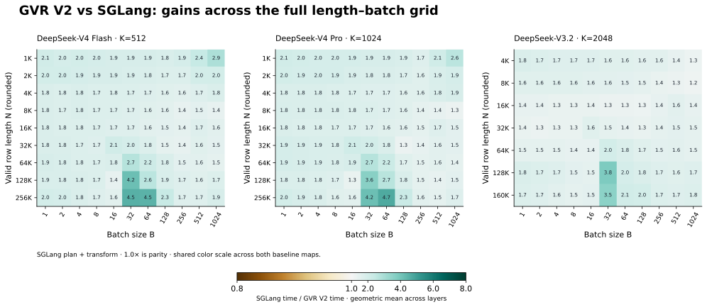
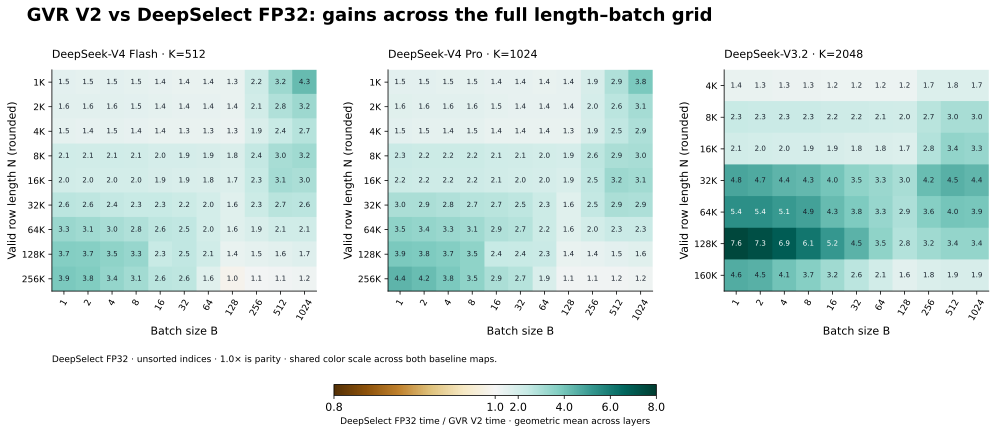

<!--
SPDX-FileCopyrightText: Copyright (c) 2026 NVIDIA CORPORATION & AFFILIATES. All rights reserved.
SPDX-License-Identifier: Apache-2.0
-->

# GVR V2: Faster Exact Top-K with Self-Sampling and Multi-Thresholding

By NVIDIA TensorRT-LLM Team

## Introduction

Selecting 1,024 INT32 indices from 131,072 FP32 scores writes just **4 KiB of output**, yet one complete read of the scores moves **512 KiB**. Every additional full-row pass pays that input cost again. For a sparse-attention indexer, finding the Top-K boundary can therefore cost far more than emitting the winners.

GVR V2 makes each full-row pass more useful. **Self-sampling estimates where the current row's Top-K boundary lies; multi-thresholding derives many exact population counts from one classification pass.** Together, they concentrate exact refinement on the small group of scores still competing for the final slots.

On B200, this design delivers **4.93× geometric-mean speedup over TensorRT-LLM radix CUDA and 1.66× over SGLang v2**, with **2.01× over FlashInfer, 2.37× over DeepSelect FP32, and 1.55× over HPC-ops FP32**. The workloads span DeepSeek-V3.2, DeepSeek-V4 Flash, and DeepSeek-V4 Pro indexers. The SGLang result includes planning; the transform-only comparison is **1.42×**.


*Figure 1. Kernel time relative to GVR V2, geometrically averaged over the same workloads within each model; shorter is faster. The temporal bars show the R0 and tiered implementations. SGLang includes planning; HPC-ops does not support Pro.*

[The original GVR blog](blog21_Temporal_Correlation_Meets_Sparse_Attention.md) described a temporal shortcut: the previous decode step's selected indices predict the next step's winners. V2 makes the row itself the source of the guess. This removes a dependent gather and the need to carry Top-K state across decode steps, while preserving the **Guess–Verify–Refine** exactness contract. It also makes the design useful for prefill, where a previous decode selection does not exist.

## Table of Contents

- [From GVR V1 to V2: Two Costs to Remove](#from-gvr-v1-to-v2-two-costs-to-remove)
- [Self-Sampling: Calibrate the Search to This Row](#self-sampling-calibrate-the-search-to-this-row)
- [Multi-Thresholding: Make Each Full-Row Pass Count](#multi-thresholding-make-each-full-row-pass-count)
- [Mapping Selection to Blackwell](#mapping-selection-to-blackwell)
- [Performance Against Five Baselines](#performance-against-five-baselines)
- [The Roofline Model: Fewer Passes, More Useful Work](#the-roofline-model-fewer-passes-more-useful-work)
- [Decode and Prefill in TensorRT-LLM](#decode-and-prefill-in-tensorrt-llm)
- [Conclusion](#conclusion)
- [Further Reading](#further-reading)

## From GVR V1 to V2: Two Costs to Remove

Original GVR V1 gathers the current scores at the previous step's Top-K indices, estimates a bracket from their minimum, maximum, and mean, then uses a secant-style search on the monotone count function

$$
C(T)=\sum_{i=0}^{N-1}\mathbf{1}[x_i\ge T].
$$

It seeks an admission threshold with enough survivors to contain Top-K, but few enough to fit its candidate capacity. A good temporal prediction makes that search short. Two costs remain: loading the old indices before the score addresses are known, and scanning the row again when another threshold must be tested. The first is a memory dependency; the second multiplies traffic as $N$ grows.

V2 addresses both. Its streaming paths read regularly spaced, coalesced samples of the current row to choose a useful bracket. They then classify the full row into bins whose cumulative counts evaluate many thresholds together. The algorithm spends a small amount of work learning where to look, then obtains much more information from each expensive full-row pass.

V1 also used a histogram during local refinement after candidate collection. The distinction is where that information becomes available: V2 makes multi-threshold population information central to verification, so it can pass an already identified crossing to refinement.

| Algorithm question | Original GVR V1 | Streaming GVR V2 |
| :--- | :--- | :--- |
| Where does the guess come from? | Current scores gathered through previous-step indices | A coalesced sample of the current row |
| What guides admission? | Hint statistics and scalar secant-style count queries | Sample-derived primary threshold, lower safety floor, and upper anchor |
| What does verification learn? | A count for the trial threshold | Exact bin populations and counts at many boundaries |
| Where is the remaining uncertainty? | The admitted candidate set | The crossing bin containing rank $K$ |
| What state crosses decode steps? | Per-layer prior indices | No Top-K prior |
| How does a bad guess affect the result? | More verification/refinement work | Lower admission or exact recovery; membership remains exact |


*Figure 2. Original V1 uses temporal hints and scalar threshold search. The later temporal R0 and tiered implementations introduce broader verification and execution specialization; V2 combines these advances with current-row self-sampling. Bars show speedup over radix CUDA.*

Temporal R0 and tiered GVR achieve **2.59× and 3.47×** speedup over radix CUDA; V2 reaches **4.93×**. V2 is **1.91× faster than temporal R0** and **1.42× faster than tiered temporal GVR**, combining current-row sampling, multi-threshold verification, and specialized execution paths.

## Self-Sampling: Calibrate the Search to This Row

V2 takes a small, deterministic sample across the valid row and uses its ranks to estimate the upper tail of the full population. The sample chooses a starting region; full-row verification determines whether it contains enough candidates.

In the `main` family, a sample unit is two adjacent `float4` vectors: eight scores loaded together. The clustered streaming family uses four vectors, or sixteen scores. Sample units are regularly spaced across the valid interval. Their addresses follow from the row layout, so sampling does not wait for previous-step indices. Sampling can still miss an unusual tail; its role is to reduce work, not to decide output membership.

Let $S$ be the sample size and $A\ge K$ the desired full-row candidate population. A **256-bin sample histogram** approximates the score distribution. Descending sample ranks

$$
r_A\approx\frac{AS}{N},\qquad r_K\approx\frac{KS}{N},\qquad r_{2A}\approx\frac{2AS}{N}
$$

provide three anchors:

- **Primary threshold $T$:** aim for roughly $A$ survivors, leaving room around the desired $K$ winners.
- **Upper anchor $T_K$:** estimate the neighborhood of rank $K$; together with $T$, it defines the upper classification bound $H$ (`HIC` in the implementation).
- **Lower floor $T_{\mathrm{floor}}$:** admit a larger population if the first estimate is too aggressive (`TSH` in the implementation).

Sample budgets, safety margins, and capacity clamps depend on the launch family. The estimate requires neither independent random samples nor a known analytical distribution; exact verification handles a poor estimate.


*Figure 3. The sample histogram estimates a bracket; the verification histogram counts the complete admitted population. The lower panel shows how verification controls refinement and recovery. Bin heights and the 980/73/44 example are illustrative; exact recovery depends on the kernel family.*

## Multi-Thresholding: Make Each Full-Row Pass Count

A scalar verification pass answers one question: how many scores exceed $T$? Multi-thresholding obtains a family of answers from the same classification work.

Conceptually, divide the bracket $[T,H]$ into $M$ ordered bins, with boundaries $t_0,\ldots,t_M$, and let $h_j$ be the exact population of bin $j$. A descending cumulative scan yields

$$
C(t_j)=\sum_{\ell=j}^{M-1}h_\ell,\qquad 0\le j\lt M.
$$

The streaming verification histogram has 256 bins. Each survivor is assigned to a bin once; a small on-chip cumulative scan then exposes counts at all its boundaries. **One classification contributes to an entire family of threshold counts.** The expensive score reads are shared, and the remaining scan touches only the bin counters. Verification can locate where the population crosses $K$ without issuing another full-row query for each trial threshold.

Values above $H$ saturate into the top bin and remain candidates. Full-row accounting establishes whether enough survivors exist. The implementation may build the histogram during streaming, merge shard histograms through distributed shared memory, or reconstruct it from a complete bounded staging slab. Those execution choices preserve the same logical result: exact populations must cover the admitted set before its crossing is trusted.

### Turn a Threshold Search into a Boundary Problem

Scanning bins from high scores to low identifies the crossing bin $j^{\ast}$ with

$$
a=\sum_{\ell\gt j^{\ast}}h_\ell\lt K,\qquad a+h_{j^{\ast}}\ge K.
$$

Every score in a higher bin is a certain winner. Every score in a lower bin is unnecessary. Only $K-a$ winners must be chosen from the crossing bin's $m=h_{j^{\ast}}$ candidates:

$$
\mathrm{TopK}(x)=\lbrace \text{all positions in higher bins}\rbrace
\quad\cup\quad \mathrm{Top}_{K-a}(\text{crossing bin}).
$$

For $K=1024$, suppose 980 scores lie above the crossing bin and 73 lie inside it. Emit the 980 directly and select the best **44 of those 73**. The remaining ranking problem has shrunk from the full row to a narrow boundary population. If the entire crossing bin is needed, it can be emitted directly. Small crossings use direct ranking; larger ones use exact order-preserving FP32 key refinement.

The histogram discretizes the search region, not the selected scores. Exact comparisons within the crossing bin resolve its coarse boundaries, including ties. Thus fewer passes do not require approximate Top-K membership.

### How Verification Preserves Exactness

**The sample focuses the bins; exact bin counts make the sample safe.** A useful bracket keeps the crossing small, while multi-threshold verification avoids a separate full-row query for every trial boundary. Figure 3 distinguishes the resulting paths: refine a complete admitted set, lower admission when too few scores survive, or recover exactly when staging or bracket checks fail.

Two mechanisms have different jobs. The **admission ladder**—the primary threshold, lower floor, and conservative sentinel—widens the candidate region. The **verification bin boundaries** locate rank $K$ within that region. Non-split streaming can rescan at a lower threshold; split-row streaming can stage down to the lower floor within its scan. Overflow requires complete-set or whole-row exact recovery.

Guess quality controls work, while complete counts and exact refinement control membership. There is no fixed one-pass guarantee. For example, [PR #18625](https://github.com/NVIDIA/TensorRT-LLM/pull/18625) repairs infinite-width brackets in register families with exact whole-row key selection, preserving `+inf` winners.

The output contract is an exact selected **value multiset** with valid unique indices. Tied indices may differ from `torch.topk`; output order is unrestricted. Short rows return valid local indices followed by `-1` padding. NaN ordering remains implementation-specific.

## Mapping Selection to Blackwell

A single scheduling policy cannot serve both one short row and thousands of long rows efficiently. GVR V2 uses four kernel families, implemented in CuTe DSL:

| Family | Where the scores or candidates live | Why it helps |
| :--- | :--- | :--- |
| `reg` | A row resides in one thread block's registers | Avoids repeated global loads when the row fits |
| `reg_clus` | Register slices across cooperating blocks | Exposes more parallelism for medium rows at small batch sizes |
| `clus` | Streaming shards; histograms and candidates shared within a hardware cluster | Merges through distributed shared memory |
| `main` | Streaming scan with bounded candidate staging | Covers the remaining shapes, including long rows and large batches |

A thread block is also called a cooperative thread array, or CTA. Blackwell thread-block clusters let cooperating CTAs exchange data through distributed shared memory. This reduces the need to materialize intermediate results in global memory for eligible shapes.

Register families bypass sparse sampling but retain exact histogram crossing and refinement. In the normal case, the first $K$ current-row values establish the initial bracket; near the short-row regime, a whole-row bracket is used. Full-row classification and exact crossing refinement still determine the output. The `main` family can assign multiple CTAs to a row when a small batch would otherwise leave much of the GPU idle.

This explains the two sources of performance improvement: a better starting threshold reduces selection work, and a suitable kernel family reduces the cost of executing that work. Neither eliminates the obligation to examine all valid scores.

## Performance Against Five Baselines

### Benchmark Setup

The benchmarks use FP32 indexer scores from the three models below on NVIDIA B200, with batch sizes from 1 to 1,024. Results report cold-L2 GPU kernel time, excluding compilation, input preparation, and Python overhead. Speedups are geometric means over matched workloads.

| Model | $K$ | Indexer compression | Valid row lengths $N$ |
| :--- | ---: | ---: | :--- |
| DeepSeek-V4 Flash | 512 | 4 | 1,027–262,127 |
| DeepSeek-V4 Pro | 1,024 | 4 | 1,027–262,127 |
| DeepSeek-V3.2 | 2,048 | 1 | 4,111–163,775 |

**$N$ is the indexer row width, not the original prompt length.** A roughly 512K-token V4 context yields a roughly 128K-wide indexer row because of 4× compression.

### Overall Results

| Baseline | Geomean speedup | Minimum speedup | GVR V2 faster |
| :--- | ---: | ---: | ---: |
| SGLang v2, plan + transform | **1.66×** | 0.95× | 99.91% |
| FlashInfer 0.6.14 `top_k` | **2.01×** | 1.20× | 100.00% |
| TensorRT-LLM radix CUDA dispatch | **4.93×** | 1.34× | 100.00% |
| DeepSelect v1.0.0 FP32 | **2.37×** | 0.84× | 99.60% |
| HPC-ops FP32 | **1.55×** | 0.71× | 98.38% |

The minimum column retains individual regressions. Figure 1 shows the model-level comparison on the common workloads supported by each implementation.

### The Gains Extend Beyond an Average

The comparison changes with the model and shape. Figure 1 shows HPC-ops closest on V3.2 and a larger DeepSelect FP32 gap there. The heatmaps resolve those averages into the row-length and batch regions where each advantage appears.

Figure 4 locates the SGLang gains across the full length–batch grid.



*Figure 4. SGLang plan + transform time divided by GVR V2 time, geometrically averaged across layers at each shape. A value of 1.0 means equal performance. Figures 4 and 5 share the same color scale; row lengths are rounded in the axis labels.*

Long rows at intermediate batch sizes show particularly strong gains: **V4 Pro reaches 4.67× at $N=262{,}127$, $B=64$**. This is the strongest shape-average result in the grid; most regions are around 1.3–2.0×.

DeepSelect FP32 shows a different pattern: V2's strongest gains move toward long rows at small batch sizes, especially for V3.2.



*Figure 5. DeepSelect FP32 time divided by GVR V2 time, geometrically averaged across layers at each shape. The layout and color scale match Figure 4: values above 1.0 favor V2, and darker teal indicates a larger gain. Cell labels round to one decimal place.*

For **V3.2, the gain reaches 7.66× around 128K scores at batch size 1** and stays above 6× at that row length through batch size 8. Flash and Pro also show broad gains, with peaks of **4.23×** and **4.34×**. The narrowest margin appears for the longest Flash rows at batch size 128, where the shape average is approximately parity (0.996×).

These patterns identify useful operating regions. The native API contracts below explain which work is included in each comparison.

### What Explains the Differences

**SGLang.** The **1.66×** comparison includes both planning and transformation. Serving integrations can amortize planning across layers; against transformation alone, V2 achieves **1.42×** geometric-mean speedup and wins **98.78%** of comparisons.

**FlashInfer.** Its `top_k` API returns FP32 values and INT64 indices, while GVR V2 returns INT32 indices only. The **2.01×** result includes that additional output work and FlashInfer's scan of the padded row.

**TensorRT-LLM radix CUDA.** The baseline uses the production dispatcher, including short-row insertion and long-row split-work paths. V2's **4.93×** advantage is consistent with reducing full-row selection passes and matching execution to the workload.

**DeepSelect.** The FP32 comparison requests unsorted INT32 indices. Its $K=2048$ path emphasizes correctness coverage, which helps explain the larger **2.79×** gap on V3.2.

**HPC-ops.** FP32 support covers $K \in \lbrace 512,2048\rbrace$. V2's advantage is **2.30×** on Flash and **1.30×** on V3.2, with an overall **1.55×** speedup. HPC-ops retains individual wins on V3.2; Pro is unsupported.

### Latency Across Row Length and Batch Size


*Figure 6. Mean cold kernel time across matching layers. Each row is a model; the columns contrast batch sizes 1 and 1,024. Solid and dashed lines distinguish benchmark runs. Both axes are logarithmic; 1K means 1,024.*

At $B=1$, keeping a short row in registers and exposing parallelism within a longer row matter more than saturating HBM. At $B=1024$, streaming throughput becomes more visible. The different shapes of these curves are why a single average cannot identify every useful operating region.

## The Roofline Model: Fewer Passes, More Useful Work

The bar chart shows how much time GVR V2 saves. The roofline asks how much of that time is fundamentally needed to move the input and output. It connects the algorithm's goal—fewer full-row passes—to a hardware limit.

### Locate Top-K on the Hardware Roof

For FP32 input and INT32 index-only output, define the ideal work and minimum traffic as

$$
W=BN,\qquad Q_{\min}=4B(N+K)\ \text{bytes},\qquad
I=\frac{W}{Q_{\min}}=\frac{N}{4(N+K)}.
$$

Here one unit of work is one **abstract comparison per input score**. This is a common normalization for every implementation, not its measured instruction count. Since $1\le K\le N$, ideal Top-K intensity stays within **$0.125\le I\lt 0.25$ compare/byte**.

The theoretical and calibrated B200 roofs, in Tcompare/s, are

$$
P_{\mathrm{theory}}(I)=\min(37.225,8I),\qquad
P_{\mathrm{calibrated}}(I)=\min(37.047,6.912I).
$$

The calibrated limits are **6.912 TB/s** sustained read bandwidth and **37.047 Tcompare/s** semantic comparison throughput. They meet at **5.36 compare/byte**, more than 21 times the maximum ideal Top-K intensity. The entire workload band sits on the bandwidth slope in Figure 7A.


*Figure 7.* A: the full theoretical and calibrated roofs. B: Pareto curves in the Top-K band at $B=1024$, plotting useful throughput $P=BN/t$ against intensity $I=N/[4(N+K)]$ on linear axes. Green highlights V2; the dotted line is the calibrated bandwidth roof. All kernels share the same minimum-traffic model $Q_{\min}$, while extra reads and output work remain in measured time.

### Compare Pareto Curves and Reachable Rates

Each operator's **Pareto curve** in Figure 7B traces useful throughput across intensities at $B=1024$. At fixed $N$ and $K$, every implementation has the same horizontal position; a faster kernel moves **upward**, toward the calibrated roof. Figure 6 retains the contrasting single-row view, and Figures 4 and 5 cover all 11 batch sizes.

The **reachable rate** is $P(I)/P_{\mathrm{calibrated}}(I)$, expressed as a percentage. The table compares **average / peak reachable rate** along each Pareto curve. The average weights the plotted intensity points equally; the peak is their maximum. Both use the same layer-averaged timings as Figure 7B.

| Operator | V4 Flash | V4 Pro | V3.2 |
| :--- | ---: | ---: | ---: |
| **GVR V2** | **41.6% / 78.0%** | **39.0% / 68.4%** | **41.3% / 65.1%** |
| SGLang, plan + transform | 24.7% / 41.2% | 24.7% / 41.3% | 27.1% / 38.0% |
| FlashInfer | 17.5% / 32.0% | 15.8% / 31.9% | 15.1% / 20.3% |
| TensorRT-LLM radix CUDA | 7.7% / 16.9% | 7.8% / 16.4% | 8.3% / 17.8% |
| DeepSelect FP32 | 21.2% / 64.4% | 19.3% / 56.4% | 14.4% / 34.8% |
| HPC-ops FP32 | 23.0% / 41.0% | — | 31.6% / 53.1% |

*Each cell shows average / peak. HPC-ops does not support the Pro configuration.*

GVR V2 leads both measures on all three models: its average reachable rate is **39.0–41.6%**, with peaks of **65.1–78.0%**. The nearest baseline varies by model. On V3.2, HPC-ops reaches **31.6% / 53.1%**, compared with V2's **41.3% / 65.1%**. On Flash, DeepSelect reaches a **64.4%** peak but averages **21.2%**, while SGLang averages **24.7%**. Reporting both measures captures the best operating point and the performance sustained across the curve.

### Interpret the Remaining Gap

The full ideal bound is $T_{\mathrm{roof}}=\max(Q_{\min}/\mathrm{BW},W/R_{\mathrm{compare}})$. Within the Top-K band, traffic dominates. Sampling, histogram updates, candidate staging, exact refinement, and synchronization account for work beyond the ideal minimum. The read-dominated roof is optimistic, especially when $K/N$ is large; the plotted throughput describes useful selection work rather than measured DRAM traffic.

## Decode and Prefill in TensorRT-LLM

### One Selection Core, Two Row Interfaces

TensorRT-LLM separates phase-specific row metadata from shared selection logic. The `TopK` module applies the same self-sampling configuration to supported decode and prefill paths, then passes each phase's valid score interval to the selected engine.


*Figure 8. Shared selection logic with phase-specific row interfaces. The decode arrow shows its streaming route; register and cluster routes remain available under the same output contract. Prefill specializes the streaming implementation at compile time.*

The adapters preserve each phase's indexing semantics. Decode derives valid prefixes from device KV lengths, multi-token prediction offsets, and compression. Prefill receives `[start, end)` in compressed columns and returns indices relative to `start`. Both write INT32 indices into caller-owned output, with identity indices and `-1` padding for short rows.

Prefill's compile-time mode changes addressing, masking, and index origin in the same **`GvrMainKernel` streaming implementation** used by decode. Self-sampling, multi-threshold counting, collection, and exact refinement stay shared. One block per prefill row and specialized decode scheduling let the common algorithm serve different parallelism requirements. [PR #18702](https://github.com/NVIDIA/TensorRT-LLM/pull/18702) implements this reuse.

The bracket comes from the current scores in both phases. Consequently, V2 needs no previous-step Top-K buffer, prefill-to-decode prior seeding, or prior write-back. [PR #18446](https://github.com/NVIDIA/TensorRT-LLM/pull/18446) limits that state to the temporal engine.

### Stable Launches, Dynamic Row Lengths

Host routing chooses a stable launch envelope; device metadata supplies each row's actual length. The physical memory bound remains separate from the bound used to select an execution plan. Warmup prepares exact-row decode launchers and a bounded set of prefill tiers and width buckets, with distinct compilation-cache keys for the two phase specializations. [PR #18683](https://github.com/NVIDIA/TensorRT-LLM/pull/18683) and [PR #18702](https://github.com/NVIDIA/TensorRT-LLM/pull/18702) establish these rules.

Unsupported layouts use exact native selection. If a prefill specialization is missing during CUDA Graph capture, `TopK` selects radix without compiling inside capture. Both adapters preserve the exact output contract when the fast path is unavailable.

### Serving Gains from the Shared Engine

In B200 profiles, V2 makes prefill Top-K **1.84–2.61×** faster than radix CUDA. Adding V2 prefill to a deployment already using V2 decode improves serving throughput by **2.9–4.5%** on long-input workloads. This is the incremental benefit of the prefill change.

For decode, [PR #18410](https://github.com/NVIDIA/TensorRT-LLM/pull/18410) reports **6–19% lower time per output token** on 8×B200 with TP8/EP8 and batch/concurrency 1. The serving benefit depends on Top-K's share of total execution time; the kernel comparisons above do not measure competing serving stacks.

### Enable GVR V2

On a TensorRT-LLM revision containing the linked integration PRs, save the following as `gvr_v2.yaml`:

```yaml
sparse_attention_config:
  algorithm: deepseek_v4
  enable_heuristic_topk: true
  use_self_sampling_topk: true
```

Use `algorithm: dsa` for DeepSeek-V3.2. The checkpoint supplies the model's Top-K width. For example:

```bash
trtllm-serve deepseek-ai/DeepSeek-V4-Flash \
  --config gvr_v2.yaml --tp_size 8 --ep_size 8
```

`enable_heuristic_topk` defaults to `false`. Once it is enabled, `use_self_sampling_topk` defaults to `true`; the second field is explicit here for clarity. Supported prefill layers follow the same V2 selection. Setting `use_self_sampling_topk: false` selects temporal GVR for decode, whose prefill path remains radix.

V2 requires CUTLASS DSL, datacenter Blackwell SM100/SM103, $K\in\lbrace 512,1024,2048\rbrace$, and supported indexer compression ratios 1 or 4. The fast path expects FP32 scores with unit inner stride, a row stride divisible by four floats, and a 16-byte-aligned base. Unsupported layouts use exact native fallback selection. The retired `TRTLLM_GVR_SELF_SAMPLING` environment variable is no longer the enablement mechanism, and `use_cute_dsl_topk` is not required to select V2.

## Conclusion

GVR V2 makes exact Top-K cheaper by learning more before repeating expensive work. **Self-sampling focuses the search; multi-threshold counts locate the crossing; exact refinement resolves the remaining membership.** Register, streaming, and cluster execution paths adapt that design to the available parallelism.

The performance maps show where the gains occur, and the Pareto curves express them as progress toward the bandwidth roof. A shared streaming implementation carries the same selection logic into decode and prefill, with phase-specific row interfaces and no temporal Top-K prior.

## Further Reading

[Benchmark methodology and figure reproduction](../media/gvr_v2/README.md) are available separately.

Implementation milestones:

- [PR #17821: original self-sampling decode integration](https://github.com/NVIDIA/TensorRT-LLM/pull/17821).
- [PR #18410: current-row brackets and hint-free production API](https://github.com/NVIDIA/TensorRT-LLM/pull/18410).
- [PR #18625: exact handling of positive infinity in register families](https://github.com/NVIDIA/TensorRT-LLM/pull/18625).
- [PR #18646: device-side prior seeding for the temporal path](https://github.com/NVIDIA/TensorRT-LLM/pull/18646).
- [PR #18683: physical envelopes and exact-row warmup](https://github.com/NVIDIA/TensorRT-LLM/pull/18683).
- [PR #18446: configuration-based dispatch and prior-state removal for V2](https://github.com/NVIDIA/TensorRT-LLM/pull/18446).
- [PR #18702: self-sampling prefill](https://github.com/NVIDIA/TensorRT-LLM/pull/18702).

For the surrounding model pipeline, see [Sparse Attention in TensorRT-LLM](blog17_Sparse_Attention_in_TensorRT-LLM.md) and [DeepSeek-V4 on NVIDIA Blackwell](blog26_DeepSeek_V4_on_NVIDIA_Blackwell_Model_Specific_and_Agentic_Workload_Optimizations_in_TensorRT-LLM.md).
