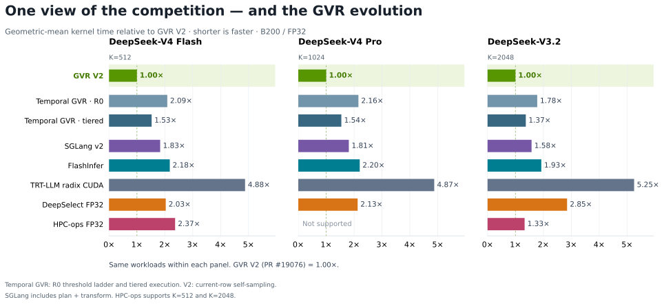
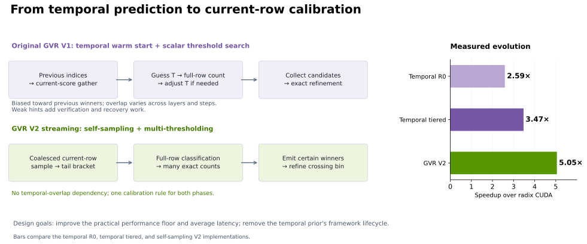
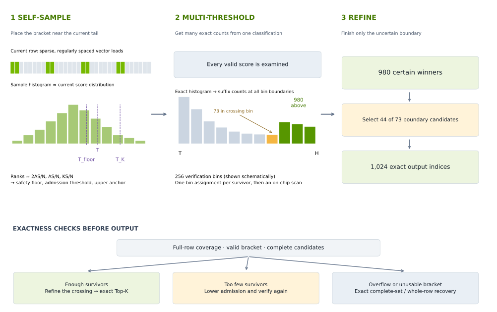
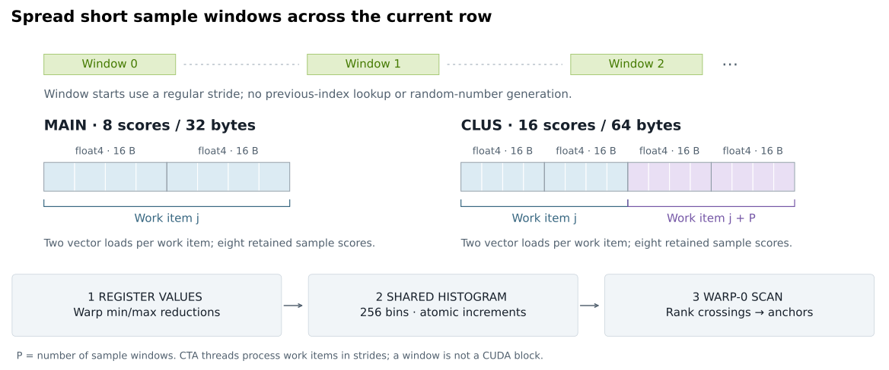
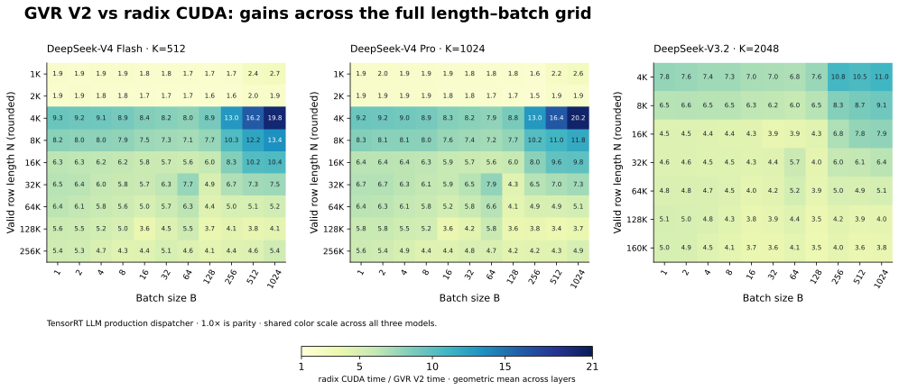
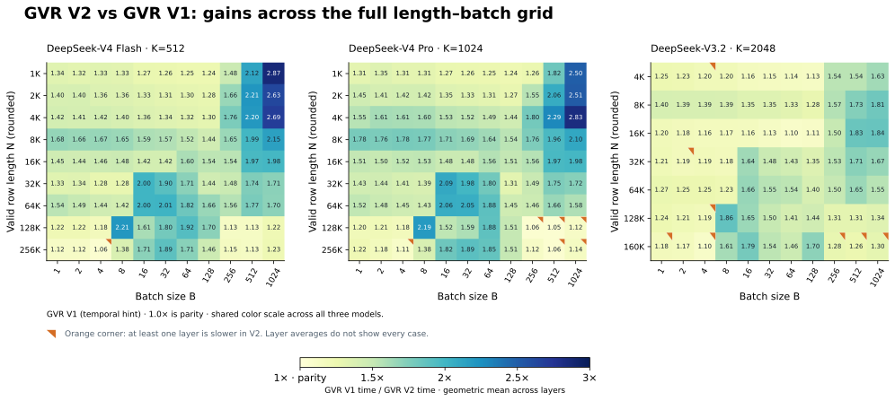
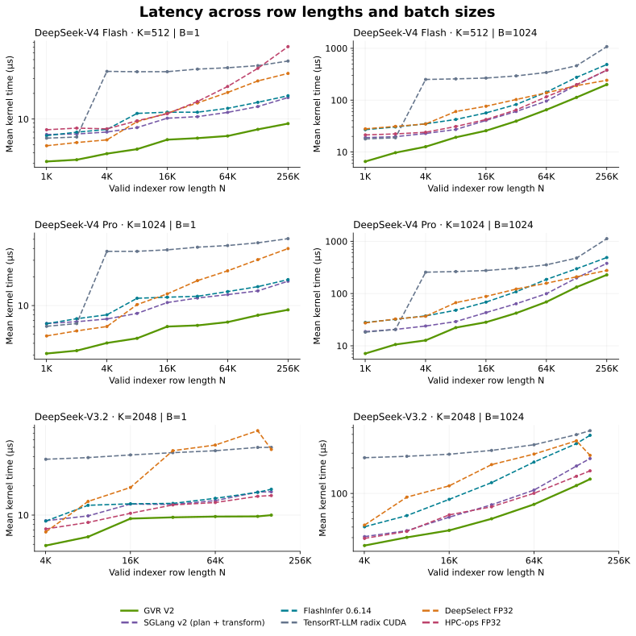
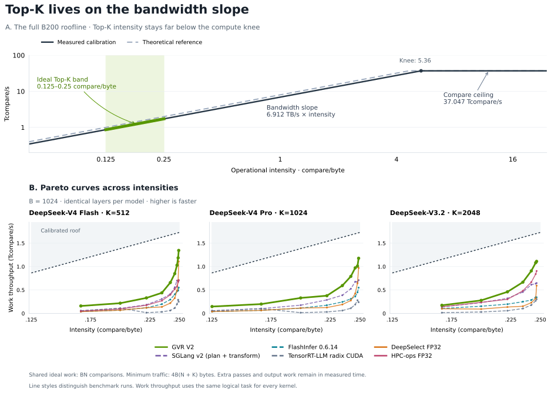
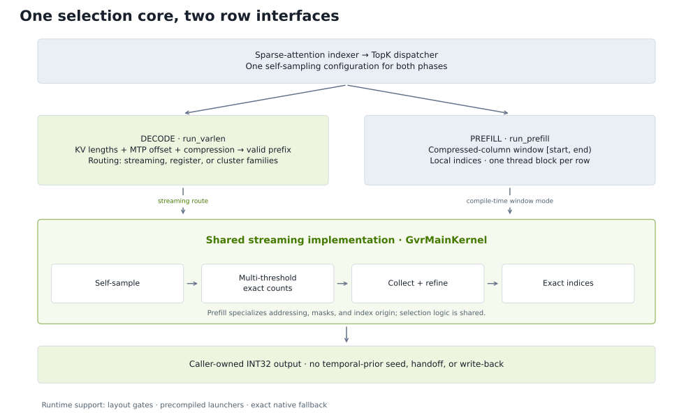

<!--
SPDX-FileCopyrightText: Copyright (c) 2026 NVIDIA CORPORATION & AFFILIATES. All rights reserved.
SPDX-License-Identifier: Apache-2.0
-->

# GVR V2: Self-Sampling and Multi-Thresholding for Faster Exact Top-K

*A Unified Selection Core for Prefill and Decode in TensorRT-LLM*

By NVIDIA TensorRT-LLM Team

Selecting 1,024 INT32 indices from 131,072 FP32 scores writes just **4 KiB of output**, yet one complete read of the scores moves **512 KiB**. Every additional full-row pass pays that input cost again. For a sparse-attention indexer, finding the Top-K boundary can therefore cost far more than emitting the winners.

GVR V2 makes each full-row pass more useful without depending on the previous decode step to predict the current one. **Self-sampling estimates where the current row's Top-K boundary lies; multi-thresholding derives many exact population counts from one classification pass.** Together, they concentrate exact refinement on the small group of scores still competing for the final slots. Removing the Top-K prior also lets prefill and decode share a streaming selection core, with phase differences handled by row adapters.

On B200, this design delivers **5.05× geometric-mean speedup over TensorRT-LLM radix CUDA**, with **1.46× over GVR V1**. Both comparisons use the same 9,746 workloads spanning DeepSeek-V3.2, DeepSeek-V4 Flash, and DeepSeek-V4 Pro indexers.



*Figure 1. Kernel time relative to GVR V2, geometrically averaged over the same workloads within each model; shorter is faster. GVR V1 uses a temporal hint. All three implementations cover the full 9,746-case grid.*

**The operator contract.** Given FP32 indexer scores and valid-row metadata, Top-K returns unordered INT32 positions for sparse attention's KV selection. With finite scores and at least $K$ entries, it selects an exact value multiset through $K$ distinct indices; ties can choose different positions. [Enablement](#enable-gvr-v2) lists hardware, shape, and configuration requirements.

[The original GVR blog](blog21_Temporal_Correlation_Meets_Sparse_Attention.md) described a temporal shortcut: the previous decode step's selected indices predict the next step's winners. Experience with V1 exposed two limits: hint quality varies sharply, and maintaining the hint couples selection to the serving framework. V2 makes the current row the source of the guess, targeting **a stronger performance floor and better average latency**, while enabling **one selection core for prefill and decode**. The **Guess–Verify–Refine** exactness contract remains.

**Table of Contents**

- **[Motivation and Design Foundations](#motivation-and-design-foundations)**
  - [From GVR V1 to V2: Why Move Beyond Temporal Hints?](#from-gvr-v1-to-v2-why-move-beyond-temporal-hints)
  - [From Floyd–Rivest SELECT to GPU Top-K](#from-floydrivest-select-to-gpu-top-k)
- **[Self-Sampling and Multi-Thresholding](#self-sampling-and-multi-thresholding)**
  - [Why Threshold Quality Matters: Passes and Candidate Work](#why-threshold-quality-matters-passes-and-candidate-work)
  - [Self-Sampling: Calibrate the Search to This Row](#self-sampling-calibrate-the-search-to-this-row)
  - [Multi-Thresholding: Make Each Full-Row Pass Count](#multi-thresholding-make-each-full-row-pass-count)
  - [Mapping Selection to Blackwell](#mapping-selection-to-blackwell)
- **[Performance and Roofline Analysis](#performance-and-roofline-analysis)**
  - [Performance Against GVR V1 and Radix CUDA](#performance-against-gvr-v1-and-radix-cuda)
  - [The Roofline Model: Fewer Passes, More Useful Work](#the-roofline-model-fewer-passes-more-useful-work)
- **[TensorRT-LLM Integration and Takeaways](#tensorrt-llm-integration-and-takeaways)**
  - [Decode and Prefill in TensorRT-LLM](#decode-and-prefill-in-tensorrt-llm)
  - [Conclusion](#conclusion)
  - [Further Reading](#further-reading)

## Motivation and Design Foundations

### From GVR V1 to V2: Why Move Beyond Temporal Hints?

GVR V1 gathers current scores at the previous step's Top-K indices to predict admission thresholds. **The GVR V1 baseline already uses multi-thresholding.** Its [streaming implementation](https://github.com/NVIDIA/TensorRT-LLM/pull/16877) uses sampled ladder counts to choose a pivot and a rescue rung, then verifies both exactly in a fused count/collect pass. This is the temporal-hint implementation compared with V2 below.

Its admission objective is expressed through the monotone count function

$$
C(T)=\sum_{i=0}^{N-1}\mathbf{1}[x_i\ge T].
$$

An admission threshold should leave enough survivors to contain Top-K, but few enough to fit candidate capacity. A high-quality temporal hint can make admission very cheap. The difficulty is making that benefit reliable across inference workloads, even with several thresholds checked together.

#### A Biased Sample with Variable Value

Temporal hints are a **biased sample** of current scores at positions predicted from the previous step's winners. The hit rate is the fraction of the current Top-K covered by the mapped temporal hint. High, stable overlap makes that bias useful. Figure 2 shows why it is an unreliable assumption across layers and decode steps.


*Figure 2. Temporal overlap on SWE-bench-64K workloads. Blue marks current selections matched after applying the temporal-hint index mapping; orange marks selections not predicted by that hint. V3.2 shifts prior indices by +1, while V4 Pro keeps the same compressed-bin indices. Upper panels show position crops; lower curves measure full-domain overlap across layers and steps, with means in parentheses. Even a high-mean layer can suffer an abrupt collapse.*

The V3.2 +1 shift is a temporal prediction rule. Its overlap measures how well the shifted positions predict the current Top-K, rather than retention at identical token indices.

Near-64K measurements also expose dependence on the input and layer:

<div align="center">

| Indexer | Input | Layers | Mean | P10–P90 | Min–max |
| :---: | :---: | :---: | :---: | :---: | :---: |
| V4 Pro | SWE-bench | 30 | 71.5% | 60.3–82.6% | 57.1–85.0% |
| V4 Pro | Random tokens | 30 | 57.9% | 33.6–80.4% | 28.4–86.7% |
| V4 Flash | SWE-bench | 21 | 62.8% | 53.4–73.3% | 53.2–83.7% |
| V4 Flash | Random tokens | 21 | 52.8% | 30.7–74.7% | 25.9–81.3% |
| V3.2 | SWE-bench | 61 | 47.4% | 37.9–59.7% | 5.7–70.7% |
| V3.2 | Random tokens | 61 | 46.0% | 33.1–62.2% | 6.0–67.9% |

</div>

*Distribution of per-layer mean hit rates, with layer IDs matched between inputs within each model. Each layer is averaged over its decode steps and then weighted equally; P10–P90 and min–max describe those layer means, not individual transitions. V3.2 uses +1 alignment.*

V4 Pro's mean changes from **71.5% to 57.9%** between these inputs, and its random-token P10–P90 spans **33.6–80.4%**. V3.2 has similar overall means across inputs, yet its weakest SWE-bench layer averages only **5.7%**. **An average overlap cannot serve as a dependable per-row performance assumption.** The table exposes variation across inputs and layers; Figure 2 adds the abrupt changes within a layer over time.

A row's true hit rate is known only after the current selection is established. Verification can expose a poor threshold, but the hint gather and initial work have already been paid for. Conservative admission, repeated counts, capacity checks, and exact recovery keep weak hints safe; their overhead and extra reads reduce average speedup and make latency less predictable.

V2 calibrates from the **current row**, removing dependence on temporal overlap and the read through old indices. It combines this calibration with histogram-based multi-threshold verification and crossing-bin refinement. **The defining change from GVR V1 is the source of the guess and the removal of temporal state; multi-thresholding is part of the design continuity.** These choices target a stronger practical performance floor and better average latency, without a fixed worst-case latency guarantee.

#### A Hint That Crosses Framework Boundaries

V1's prior also has a lifecycle outside the kernel. GVR V1 has no prefill engine: TensorRT-LLM uses radix for prefill and can seed the decode prior from each request's last prefill selection. That phase-dependent history complicates a common selection architecture. V2's current-row calibration removes the Top-K prior dependency, allowing phase differences to stay in dispatch and row-interface adapters. The [integration section](#decode-and-prefill-in-tensorrt-llm) traces the consequences for CUDA Graph preparation and disaggregated serving.

<div align="center">

| Algorithm question | GVR V1 (temporal hint) | Streaming GVR V2 |
| :---: | :---: | :---: |
| Where does the guess come from? | Current scores gathered through previous-step indices | Packed sample windows spread across the current row |
| What makes the guess useful? | High, stable overlap with previous winners | Coverage of the current row's score distribution |
| What guides admission? | A hint-derived pivot and rescue rung | Sample-derived primary threshold, lower safety floor, and upper anchor |
| What does verification learn? | Exact counts at multiple admission thresholds | Exact bin populations and counts at many boundaries |
| Where does exact refinement start? | The admitted candidate set, with path-specific local refinement | The crossing bin containing rank $K$ |
| What state crosses decode steps? | Per-layer prior indices | No Top-K prior in the self-sampling path |
| How do prefill and decode relate? | Radix prefill; its last selection can seed temporal decode | Shared streaming selection with phase-specific row adapters |
| How does a bad guess affect the result? | More admission/refinement work or recovery; membership remains exact | Lower admission or exact recovery; membership remains exact |

</div>



*Figure 3. Multi-thresholding is shared by GVR V1 and V2. The flows emphasize their calibration and refinement choices on streaming paths; the bars compare complete GVR V1 and V2 implementations over radix CUDA. V2 removes the temporal-overlap dependency and prior-state lifecycle.*

GVR V1 achieves **3.47×** speedup over radix CUDA; V2 reaches **5.05×**. V2 is **1.46× faster than GVR V1**. These gains compare complete implementations, including their calibration, verification, refinement, and execution paths.

The fifth percentile remains above parity, while the minimum exposes workloads where V1 retains an advantage:

<div align="center">

| Baseline | Geomean speedup | P5 speedup | Minimum speedup | V2 faster |
| :---: | :---: | :---: | :---: | :---: |
| GVR V1 | **1.46×** | **1.10×** | 0.689× | 99.57% |

</div>

P5 is the fifth percentile across workload-level speedups, each computed as V1 time divided by V2 time. The **0.689× minimum means V2 takes about 45% longer than V1** in the worst measured case. The 99.57% win rate supports broad improvement, while this minimum makes the remaining regressions explicit.

**V1's calibration with temporal hints can still produce a better admission threshold.** An informative prior, validated against current-row samples, can let V1 admit a tighter candidate set than self-sampling. Diagnostics of the pronounced large-batch regressions show V1 accepting enough candidates on its first pass, while V2 initially admits fewer than $K$ scores and rescans at a lower threshold. This identifies extra admission work; differences in dispatch and refinement also contribute to total kernel cost.

These local wins fit the motivation for moving beyond temporal hints. Their usefulness varies across inputs, layers, and decode steps, and their true overlap is unavailable before selection. V2 removes that unstable dependency to improve robustness and average latency with a shared current-row selection core. Self-sampling can still misestimate a tail, so its admission margin and recovery cost remain optimization targets. **A stronger practical performance floor is a design objective, not a guarantee that V2 beats V1 on every input.** This workload distribution also does not establish runtime P95/P99 latency or a fixed worst-case bound.

### From Floyd–Rivest SELECT to GPU Top-K

GVR V2's self-sampling was inspired by Floyd and Rivest's 1975 paper, [*Expected Time Bounds for Selection*](https://people.csail.mit.edu/rivest/pubs/FR75a.pdf). Its theoretical SELECT algorithm draws a random sample, chooses two sample order statistics to bracket the desired rank, partitions the full input, and continues exactly in the partition containing that rank. If the bracket misses, selection continues in the appropriate outer partition. Sampling reduces expected work without making the answer approximate.

The classical expected comparison bound for ascending rank $i$ among $n$ elements is

$$
n+\min(i,n-i)+o(n).
$$

This belongs to a comparison model with random-sampling assumptions; the original treatment assumes distinct keys. [Kiwiel's later analysis](https://arxiv.org/abs/cs/0312055) establishes rigorous bounds for SELECT variants, including repeated keys. These results motivate **using sample ranks to narrow an exact selection problem**.

GVR V2 carries that principle into a different cost model:

<div align="center">

| Design choice | Floyd–Rivest theoretical SELECT | GVR V2 streaming |
| :---: | :---: | :---: |
| Primary objective | Expected element comparisons | Kernel latency: input passes, memory traffic, and parallel work |
| Calibration | Random sample and sample order statistics | Regularly spaced, packed sample windows and histogram quantiles |
| Remaining selection | Exact partitioning and recursive selection | Exact bin counts, crossing-bin refinement, and recovery |
| Result | An element at the requested rank | An exact set of $K$ indices, without requiring sorted output |

</div>

On a GPU, doing more work on chip can be worthwhile if it avoids another full-row read. V2 couples sampling to candidate capacity, vectorized loads, and multi-threshold counts. **The inherited idea is sample-guided exact selection; the optimization target is GPU execution cost.** Its deterministic sampling policy does not inherit SELECT's randomized comparison bound. Exactness follows from full-row accounting and exact refinement or recovery.

## Self-Sampling and Multi-Thresholding

For nontrivial selection, the sampled streaming paths follow three steps. Register-resident families bypass sparse sampling and use a different initial bracket, while retaining exact classification and refinement; the dispatcher chooses among these execution families for each workload.

1. **Guess:** sample packed windows of the current row to place admission and verification bins near its tail.
2. **Verify:** account for every valid score and establish a complete admitted population containing at least K candidates. Too few survivors require wider admission; incomplete staging requires exact recovery.
3. **Refine:** emit winners above the crossing bin and select the remaining slots exactly from that bin.



*Figure 4. The sample histogram estimates a bracket; the verification histogram counts the complete admitted population. The lower panel shows how verification controls refinement and recovery. Bin heights and the 980/73/44 example are illustrative; exact recovery depends on the kernel family.*

For example, with $K=1024$, suppose 980 scores lie above the crossing bin and 73 lie inside it. Emit the 980 directly and select the best **44 of those 73**. A useful sample keeps this boundary problem small; complete counts and exact refinement make the answer correct.

### Why Threshold Quality Matters: Passes and Candidate Work

A useful threshold balances **full-row passes and candidate work**. A loose threshold may save a scan yet admit so many candidates that processing them consumes the saving. Another pass is worthwhile only when the work it removes exceeds its cost.

For a finite-score row, let $\tau$ be the exact K-th-largest score and $q\le\tau$ an admission threshold. The candidate population decomposes as

$$
C_p=C(q)=K+E+D(q,\tau),\qquad
\frac{C_p}{K}=1+\frac{E+D(q,\tau)}{K}.
$$

Here $E$ counts excess entries tied at the boundary, and $D$ counts scores in the shell $q\le x_i\lt\tau$. Dense scores near the boundary can turn a small threshold error into large **candidate amplification**. Temporal overlap alone therefore cannot predict refinement work.


*Figure 5.* A: exact tail counts identify thresholds satisfying $K\le C(q)\le B_r$, where $B_r$ is candidate capacity. The labeled segments split the admitted population into required winners, excess boundary ties, and the boundary shell. B: candidate amplification arises from the latter two components; their proportions are schematic. Exact handling of ties preserves the Top-K value multiset.

Self-sampling aims to place admission near the current tail; multi-thresholding separates certain winners, the crossing bin, and lower bins. V2 balances full-row reads against candidate handling over $C(q)$ entries and exact refinement over $m$ crossing-bin candidates.

### Self-Sampling: Calibrate the Search to This Row

V2 calibrates inside the selection kernel, using the current row's layout to generate sample addresses. It needs neither previous winners nor a separate sampling kernel. The sample estimates a useful starting region; full-row verification determines whether that region contains enough candidates.

#### Load Short Windows, Spread Them Across the Row

A **sample window** is a contiguous group of scores. A CUDA thread block processes many such windows. The streaming families use these layouts:

<div align="center">

| Family | Scores per window | Loads and logical ownership |
| :---: | :---: | :---: |
| `main` | 8 FP32 scores = 32 bytes | One work item loads two adjacent `float4` vectors |
| `clus` | 16 FP32 scores = 64 bytes | Two work items each load two vectors, covering the lower and upper halves |

</div>

Regular spacing spreads the windows across the valid row. The sampling budget sets their count and spacing, while bounds and alignment handling keep loads valid for each phase. A thread block processes more windows in iterations when the sample exceeds its parallel capacity.

**Why eight?** Eight FP32 scores fill a 32-byte memory sector when the window is sector-aligned. A scattered scalar sample can use only four bytes from each fetched sector. Two adjacent, 16-byte-aligned `float4` loads consume the whole window, giving more sample values per touched sector. This is local packing within each window; widely spaced windows still produce strided accesses across the warp. The [CUDA memory-access model](https://docs.nvidia.com/cuda/cuda-c-best-practices-guide/index.html#coalesced-access-to-global-memory) explains the sector granularity. Actual sector traffic also depends on the row's alignment and cache state.

**Why sixteen in `clus`?** It groups two neighboring 32-byte pieces into one sampled location, divided between two work items. Each retains the same eight-score payload as `main`, avoiding a sixteen-score live payload in one worker. The engineering tradeoff is locality versus coverage: at a fixed sample budget, sixteen-score windows visit half as many locations as eight-score windows. Both aligned layouts can fully use their sectors; the clustered grouping favors wider local coverage at each visited location without doubling the per-worker sample payload. These are implementation tradeoffs, not a statistical guarantee or a universal optimum; a 64-byte window comprises four vector loads.



*Figure 6. Each outlined memory box holds four FP32 scores. The 8/16-score grouping describes data layout, while CTA threads execute the work items. Register values feed a shared sample histogram; its rank crossings produce calibration anchors. The lower floor is computed where enabled.*

#### Reduce, Histogram, and Extract the Anchors On Chip

Each sampling worker keeps its first two vectors in registers. Local minima and maxima reduce within each warp; warp results are published through shared memory and combined after a CTA barrier. These extrema define **256 sample bins**. Workers then increment shared-memory counters for their sample values. Additional windows beyond the initially retained pair are reloaded for histogramming, limiting live register state.

After another barrier, warp 0 scans the histogram using vector counter loads and warp shuffles. One scan finds all required rank crossings and clears the counters for the next phase, avoiding a sample sort or a separate search for every anchor.

Let $S$ be the actual sample size and $A\ge K$ the desired full-row candidate population. The launch policy starts with a sample budget proportional to $N/A$, clamps its target between 256 scores and half the row, and rounds to legal windows. It computes target ranks from the resulting $S$, rather than the unrounded budget:

$$
r_A\approx\frac{AS}{N},\qquad r_K\approx\frac{KS}{N},\qquad r_{2A}\approx\frac{2AS}{N}.
$$

The intuition is to keep enough observations in the relevant tail: as its target fraction $A/N$ shrinks, increasing $S$ maintains roughly $AS/N$ tail observations, before clamping and window rounding. Descending histogram crossings supply:

- **Primary threshold $T$:** the lower edge of the sample bin at rank $r_A$, aiming for roughly $A$ full-row survivors.
- **Upper anchor $T_K$:** the bin edge near rank $r_K$, used to choose the verification histogram's upper bound with headroom for sampling error. Values beyond that bound remain candidates.
- **Lower floor $T_{\mathrm{floor}}$:** the bin edge near rank $r_{2A}$, where enabled, admitting a larger population after an aggressive estimate.

The sample histogram estimates these anchors without assuming a known score distribution. Regularly spaced windows can still miss an unusual tail or correlate with structured scores. Degenerate samples use conservative recovery paths; exact full-row accounting remains the authority.

#### Overlap Calibration with the Upcoming Row Read

In the variable-length `main` route, warp 0 prepares sampling geometry while other warps can prefetch their upcoming row slice. The schedule limits overlapping register lifetimes. Clustered streaming repeats the same sample in each CTA so that all ranks derive a common bracket before merging verification histograms. These choices trade a little repeated calibration work for simpler communication. Exact address formulas, prefetch placement, and anchor constants are retained in the [implementation companion](../media/gvr_v2/README.md#gpu-sampling-implementation).

### Multi-Thresholding: Make Each Full-Row Pass Count

A scalar verification pass answers one question: how many scores exceed $T$? GVR V1 already amortizes row reads across several admission thresholds. V2's streaming path uses a verification histogram to obtain a dense family of counts from the same classification work and locate the boundary for exact refinement.

Conceptually, divide the bracket $[T,H]$ into $M$ ordered bins, with boundaries $t_0,\ldots,t_M$, and let $h_j$ be the exact population of bin $j$. A descending cumulative scan yields

$$
C(t_j)=\sum_{\ell=j}^{M-1}h_\ell,\qquad 0\le j\lt M.
$$

The streaming verification histogram has 256 bins. Each survivor is assigned to a bin once; a small on-chip cumulative scan then exposes counts at all its boundaries. **One classification contributes to an entire family of threshold counts.** The expensive score reads are shared, and the remaining scan touches only the bin counters. Verification can locate where the population crosses $K$ without issuing another full-row query for each trial threshold.

Values above $H$ saturate into the top bin and remain candidates. Full-row accounting establishes whether enough survivors exist. The implementation may build the histogram during streaming, merge shard histograms through distributed shared memory, or reconstruct it from a complete bounded staging slab. Those execution choices preserve the same logical result: exact populations must cover the admitted set before its crossing is trusted.

#### Turn a Threshold Search into a Boundary Problem

Scanning bins from high scores to low identifies the crossing bin $j^{\ast}$ with

$$
a=\sum_{\ell\gt j^{\ast}}h_\ell\lt K,\qquad a+h_{j^{\ast}}\ge K.
$$

Every score in a higher bin is a certain winner. Every score in a lower bin is unnecessary. Only $K-a$ winners must be chosen from the crossing bin's $m=h_{j^{\ast}}$ candidates:

$$
\mathrm{TopK}(x)=\lbrace \text{all positions in higher bins}\rbrace
\quad\cup\quad \mathrm{Top}_{K-a}(\text{crossing bin}).
$$

If the entire crossing bin is needed, it can be emitted directly. Small crossings use direct ranking; larger ones use exact order-preserving FP32 key refinement. The same decomposition underlies the 980-plus-44 example in Figure 4.

The histogram discretizes the search region, not the selected scores. Exact comparisons within the crossing bin resolve its coarse boundaries, including ties. Thus fewer passes do not require approximate Top-K membership.

#### How Verification Preserves Exactness

**The sample focuses the bins; exact bin counts make the sample safe.** A useful bracket keeps the crossing small, while multi-threshold verification avoids a separate full-row query for every trial boundary. Figure 4 distinguishes the resulting paths: refine a complete admitted set, lower admission when too few scores survive, or recover exactly when staging or bracket checks fail.

Two mechanisms have different jobs. The **admission ladder**—the primary threshold, lower floor, and conservative sentinel—widens the candidate region. The **verification bin boundaries** locate rank $K$ within that region. Non-split streaming can rescan at a lower threshold; split-row streaming can stage down to the lower floor within its scan. Overflow requires complete-set or whole-row exact recovery.

Guess quality controls work, while complete counts and exact refinement control membership. There is no fixed one-pass guarantee. For example, [PR #18625](https://github.com/NVIDIA/TensorRT-LLM/pull/18625) repairs infinite-width brackets in register families with exact whole-row key selection, preserving `+inf` winners.

The output contract is an exact selected **value multiset** with valid unique indices. Tied indices may differ from `torch.topk`; output order is unrestricted. Short rows return valid local indices followed by `-1` padding. NaN ordering remains implementation-specific.

### Mapping Selection to Blackwell

A single scheduling policy cannot serve both one short row and thousands of long rows efficiently. GVR V2 uses four kernel families, implemented in CuTe DSL:

<div align="center">

| Family | Where the scores or candidates live | Why it helps |
| :---: | :---: | :---: |
| `reg` | A row resides in one thread block's registers | Avoids repeated global loads when the row fits |
| `reg_clus` | Register slices across cooperating blocks | Exposes more parallelism for medium rows at small batch sizes |
| `clus` | Streaming shards; histograms and candidates shared within a hardware cluster | Merges through distributed shared memory |
| `main` | Streaming scan with bounded candidate staging | Covers the remaining shapes, including long rows and large batches |

</div>

A thread block is also called a cooperative thread array, or CTA. Blackwell thread-block clusters let cooperating CTAs exchange data through distributed shared memory. This reduces the need to materialize intermediate results in global memory for eligible shapes.

Register families bypass sparse sampling but retain exact histogram crossing and refinement. In the normal case, the first $K$ current-row values establish the initial bracket; near the short-row regime, a whole-row bracket is used. Full-row classification and exact crossing refinement still determine the output. The `main` family can assign multiple CTAs to a row when a small batch would otherwise leave much of the GPU idle.

This explains the two sources of performance improvement: a better starting threshold reduces selection work, and a suitable kernel family reduces the cost of executing that work. Neither eliminates the obligation to examine all valid scores.

[PR #19076](https://github.com/NVIDIA/TensorRT-LLM/pull/19076) extends this execution policy through host dispatch while keeping the device kernels unchanged. It adds register plans for roughly 4K–8K-score rows, sizes register waves using the device's SM count, and includes targeted B300 routing. It also sets the direct-ranking gate to **96 candidates across register plans**, limiting quadratic work for difficult crossings. The streaming `main` and `clus` families retain their separate **288-candidate** gate. Dispatch therefore balances refinement cost with each family's execution strategy.

## Performance and Roofline Analysis

### Performance Against GVR V1 and Radix CUDA

#### Benchmark Setup

The benchmarks use FP32 indexer scores from the three models below on NVIDIA B200. Batch size $B$ counts score rows: each case repeats one captured row across 1 to 1,024 batch rows to measure kernel scaling. It does not represent heterogeneous serving concurrency. GVR V2 uses the merged [PR #19076](https://github.com/NVIDIA/TensorRT-LLM/pull/19076) implementation. Results report cold-L2 GPU kernel time, excluding compilation, input preparation, and Python overhead. Speedups are geometric means over matched workloads from separate benchmark runs. The grid uses single-token decode and case-matched launch envelopes; ragged batches, MTP, and prefill require separate evaluation. Historical serving results appear in the [integration section](#serving-gains-from-the-shared-engine).

<div align="center">

| Model | $K$ | Indexer compression | Valid row lengths $N$ |
| :---: | :---: | :---: | :---: |
| DeepSeek-V4 Flash | 512 | 4 | 1,027–262,127 |
| DeepSeek-V4 Pro | 1,024 | 4 | 1,027–262,127 |
| DeepSeek-V3.2 | 2,048 | 1 | 4,111–163,775 |

</div>

**$N$ is the indexer row width, not the original prompt length.** A roughly 512K-token V4 context yields a roughly 128K-wide indexer row because of 4× compression.

#### Overall Results

<div align="center">

| Baseline | Geomean speedup | Minimum speedup | GVR V2 faster |
| :---: | :---: | :---: | :---: |
| GVR V1 | **1.46×** | 0.689× | 99.57% |
| TensorRT-LLM radix CUDA dispatch | **5.05×** | 1.34× | 100.00% |

</div>

Both comparisons use the same 9,746 cases. The minimum column retains individual regressions, including the GVR V1 cases where V2 is slower; the [V1-to-V2 discussion](#from-gvr-v1-to-v2-why-move-beyond-temporal-hints) explains how informative temporal hints can retain an admission advantage. Figure 1 shows the model-level comparison over this same workload grid.

#### The Gains Extend Beyond an Average

The gains over TensorRT-LLM radix CUDA vary with the model and shape. Figure 7 shows V2's speedup across every captured row length and all 11 batch sizes, with one panel per model.



*Figure 7. TensorRT-LLM radix CUDA time divided by GVR V2 time, geometrically averaged across layers at each shape. The panels share a 1–21× color scale; 1.0 means equal performance. Row lengths are rounded in the axis labels, and cell labels round to one decimal place.*

The strongest shape-average gains occur around 4K scores at $B=1024$: **19.85× for V4 Flash and 20.18× for V4 Pro** at $N=4{,}099$, and **10.96× for V3.2** at $N=4{,}111$. The Pro result is the largest shape-average speedup in the grid.

The advantage extends across all 275 plotted shapes. The smallest shape-average speedups are **1.55× for Flash, 1.52× for Pro, and 3.50× for V3.2**. These averages summarize layers at each shape; the overall table retains the lower minimum across individual workload cases.

GVR V1 is the closer comparison. Figure 8 uses the same grid and aggregation, with a separate **1–3× color scale** to resolve the smaller differences.



*Figure 8. GVR V1 time divided by GVR V2 time, geometrically averaged across layers at each shape. All three panels share a 1–3× color scale, with parity at 1.0× and cell labels rounded to two decimal places. An orange corner marks at least one constituent layer with speedup below 1×, even when the cell average is above parity.*

The strongest shape-average gains are **2.87× for Flash, 2.83× for Pro, and 1.86× for V3.2**. Flash and Pro peak at $B=1024$ on short rows; V3.2 peaks near 128K scores at $B=8$.

All 275 shape averages exceed parity, but layer averaging can hide local regressions. For Pro at $N=131{,}075$ and $B=512$, the shape average is **1.05×** even though one layer reaches **0.689×**. The orange markers preserve this distinction; the earlier [V1-to-V2 analysis](#from-gvr-v1-to-v2-why-move-beyond-temporal-hints) explains why informative temporal hints can still give V1 a local admission advantage.

#### What Explains the Differences

**TensorRT-LLM radix CUDA.** The baseline uses the production dispatcher, including short-row insertion and long-row split-work paths. V2's **5.05×** advantage is consistent with reducing full-row selection passes and matching execution to the workload.

**GVR V1 (temporal hint).** V1 already combines multiple admission thresholds through pivot/rescue verification. V2 replaces the temporal prior with current-row calibration and couples exact bin counts to crossing-bin refinement. Its **1.46×** gain compares complete implementations, including their execution policies; it does not isolate the contribution of self-sampling alone.

#### Latency Across Row Length and Batch Size



*Figure 9. Mean cold kernel time across all captured layers: 21 for Flash, 30 for Pro, and 61 for V3.2. Each row is a model; the columns contrast batch sizes 1 and 1,024. The solid line shows GVR V2; dashed lines show baselines measured in separate runs. Both axes are logarithmic; 1K means 1,024.*

At $B=1$, keeping a short row in registers and exposing parallelism within a longer row matter more than saturating HBM. At $B=1024$, streaming throughput becomes more visible. The different shapes of these curves are why a single average cannot identify every useful operating region.

### The Roofline Model: Fewer Passes, More Useful Work

The bar chart shows how much time GVR V2 saves. The roofline compares that time with an ideal one-read, index-write traffic model. It connects the algorithm's goal—fewer full-row passes—to a bandwidth reference.

#### Locate Top-K on the Hardware Roof

For FP32 input and INT32 index-only output, define the ideal work and minimum traffic as

$$
W=BN,\qquad Q_{\min}=4B(N+K)\ \text{bytes},\qquad
I=\frac{W}{Q_{\min}}=\frac{N}{4(N+K)}.
$$

Each work unit is an **abstract comparison per input score**, shared across implementations; it is neither an instruction count nor SELECT's comparison bound. For nontrivial selection, $1\le K\lt N$, intensity lies in **$0.125\lt I\lt 0.25$ compare/byte**.

The theoretical and calibrated B200 roofs, in Tcompare/s, are

$$
P_{\mathrm{theory}}(I)=\min(37.225,8I),\qquad
P_{\mathrm{calibrated}}(I)=\min(37.047,6.912I).
$$

The calibrated limits are **6.912 TB/s** sustained read bandwidth and **37.047 Tcompare/s** semantic comparison throughput. Their **5.36 compare/byte** intersection exceeds the maximum ideal Top-K intensity by over 21×, placing the workload band on Figure 10A's bandwidth slope.



*Figure 10.* A: theoretical and calibrated roofs. B: Pareto curves at $B=1024$, plotting useful throughput $P=BN/t$ against ideal intensity $I=N/[4(N+K)]$. Green highlights V2; the dotted line is the calibrated bandwidth roof. All kernels share $Q_{\min}$; extra work remains in measured time. This measures useful work relative to ideal traffic, not actual DRAM utilization.

#### Compare Pareto Curves and Reachable Rates

Each operator's **Pareto curve** in Figure 10B is its measured intensity–throughput trace across row lengths at $B=1024$. At fixed $N$ and $K$, every implementation has the same horizontal position; a faster kernel moves **upward**, toward the calibrated roof. Figure 9 retains the contrasting single-row view, and Figures 7–8 cover all 11 batch sizes.

The **reachable rate** is useful throughput divided by the calibrated roof, expressed as a percentage. Throughout the plotted bandwidth branch, its underlying ratio simplifies to

$$
\rho=\frac{P(I)}{P_{\mathrm{calibrated}}(I)}
=\frac{Q_{\min}}{\mathrm{BW}\,t}.
$$

It measures efficiency relative to the ideal traffic bound. The table compares **average / peak reachable rate** along each Pareto curve: the average weights the plotted intensity points equally, and the peak is their maximum. Both use the same layer-averaged timings as Figure 10B.

<div align="center">

| Operator | V4 Flash | V4 Pro | V3.2 |
| :---: | :---: | :---: | :---: |
| **GVR V2** | **41.6% / 77.8%** | **39.0% / 68.4%** | **41.5% / 66.5%** |
| GVR V1 | 26.1% / 63.3% | 25.4% / 58.9% | 27.8% / 51.1% |
| TensorRT-LLM radix CUDA | 7.7% / 16.9% | 7.8% / 16.4% | 8.3% / 17.8% |

</div>

*Each cell shows average / peak.*

GVR V2 leads both measures on all three models: its average reachable rate is **39.0–41.6%**, with peaks of **66.5–77.8%**. GVR V1 is the stronger baseline by both measures, averaging **25.4–27.8%**, with peaks of **51.1–63.3%**. On V3.2, it reaches **27.8% / 51.1%**, compared with V2's **41.5% / 66.5%**. Reporting both measures captures the best operating point and the performance sustained across the curve.

#### Interpret the Remaining Gap

The full ideal bound is $T_{\mathrm{roof}}=\max(Q_{\min}/\mathrm{BW},W/R_{\mathrm{compare}})$. Within the Top-K band, the bandwidth term sets this bound. A kernel's actual bottleneck can also involve histogram updates, synchronization, register pressure, candidate staging, or exact refinement. Attributing the measured gap to these mechanisms requires counters or ablations beyond the latency comparisons. Short-row identity/padding paths can skip score reads and lie outside this model.

The pass/candidate tradeoff in Figure 5 explains two sources of this gap: another full-row scan adds traffic, while a loose admission threshold adds candidate work even when the scan count stays fixed. V2 uses exact bin populations to restrict the remaining selection to the crossing bin. These costs increase measured time; under the shared minimum-traffic model, they move useful throughput downward at the same intensity. The read-dominated roof is optimistic, especially when $K/N$ is large; the plotted throughput describes useful selection work rather than measured DRAM traffic.

## TensorRT-LLM Integration and Takeaways

### Decode and Prefill in TensorRT-LLM

The integration follows three boundaries: remove the Top-K prior lifecycle, adapt each phase's row metadata, and prepare launch specializations before graph capture.

#### Remove the Top-K Prior Lifecycle

A temporal prior carries state from an earlier selection. Its buffers, initialization, request alignment, and write-back must stay valid through CUDA Graph warmup and replay. Disaggregated prefill/decode also needs a policy for providing that prior at the phase handoff.

With `use_self_sampling_topk: true`, the [`TopK` wrapper](https://github.com/NVIDIA/TensorRT-LLM/blob/be1b9885e8df9bf070e8cb68459e24a7119afaa9/tensorrt_llm/_torch/modules/top_k.py#L350-L392) selects V2's self-sampling decode [`run_varlen`](https://github.com/NVIDIA/TensorRT-LLM/blob/be1b9885e8df9bf070e8cb68459e24a7119afaa9/tensorrt_llm/_torch/cute_dsl_kernels/blackwell/top_k/gvr_topk_decode_self_sampling_host.py#L1435-L1445) entry point. Its public signature takes score, sequence-length, and output-index tensors plus row/launch metadata; it has **no `pre_idx` parameter**. The wrapper's [`needs_gvr_prior`](https://github.com/NVIDIA/TensorRT-LLM/blob/be1b9885e8df9bf070e8cb68459e24a7119afaa9/tensorrt_llm/_torch/modules/top_k.py#L69-L75) property is false for this path.

The separate V1 temporal dispatcher, [`tiered_topk`](https://github.com/NVIDIA/TensorRT-LLM/blob/be1b9885e8df9bf070e8cb68459e24a7119afaa9/tensorrt_llm/_torch/cute_dsl_kernels/blackwell/top_k/gvr_topk_decode_dispatch.py#L334-L357), still requires valid `pre_idx` for its supported heuristic routes. Setting `use_self_sampling_topk: false` selects that temporal engine; callers must retain its prior input.

V2 derives its bracket from the current scores in both phases, removing the previous-step Top-K buffer, prefill-to-decode prior seeding, and prior write-back from the self-sampling path. Request metadata and launch preparation remain, but they no longer maintain a selection history. [PR #18446](https://github.com/NVIDIA/TensorRT-LLM/pull/18446) confines prior ownership to the temporal engine.

#### One Selection Core, Two Row Interfaces

TensorRT-LLM separates phase-specific row metadata from shared selection logic. The `TopK` module applies the same self-sampling configuration to supported decode and prefill paths, then passes each phase's valid score interval to the selected engine.



*Figure 11. Current-row calibration lets both phases enter the same selection core without a temporal-prior lifecycle. The decode arrow shows its streaming route; register and cluster routes remain available under the same output contract. Prefill specializes the streaming implementation at compile time.*

The adapters preserve each phase's indexing semantics. Decode derives valid prefixes from device KV lengths, multi-token prediction offsets, and compression. Prefill receives `[start, end)` in compressed columns and returns indices relative to `start`. Both write INT32 indices into caller-owned output, with identity indices and `-1` padding for short rows.

Prefill's compile-time mode changes addressing, masking, and index origin in the same **`GvrMainKernel` streaming implementation** used by decode. Self-sampling, multi-threshold counting, collection, and exact refinement stay shared. One block per prefill row and specialized decode scheduling let the common algorithm serve different parallelism requirements. [PR #18702](https://github.com/NVIDIA/TensorRT-LLM/pull/18702) implements this reuse.

This separation keeps phase-specific decisions in the wrapper, dispatch, and compile-time row adapters. Improvements to threshold calibration, counting, and exact recovery can serve both phases through the shared streaming body, reducing duplicated selection logic and the number of state transitions the framework must maintain.

#### Stable Launches, Dynamic Row Lengths

Host routing chooses a stable launch envelope; device metadata supplies each row's actual length. The physical memory bound remains separate from the bound used to select an execution plan. Before capture, warmup must prepare exact-row decode launchers and a bounded set of prefill tiers and width buckets, using the same envelope-dependent plan rule as execution and readiness checks.

Prefill and decode have distinct specialization keys; decode launcher and warmup caches also distinguish SM count and architecture. This lets dispatch tune execution, including sampled prefill plans for qualifying small envelopes, while preserving the graph's prepared launch contract. These rules are implemented through [PR #18683](https://github.com/NVIDIA/TensorRT-LLM/pull/18683), [PR #18702](https://github.com/NVIDIA/TensorRT-LLM/pull/18702), and [PR #19076](https://github.com/NVIDIA/TensorRT-LLM/pull/19076).

When scores fail the `TopK` module's dtype, stride, or alignment gate, it selects native insertion/radix. Prefill also selects radix for an all-short tile or a missing capture-time specialization. Decode requires its exact launcher key to be warmed before capture; a missing key raises an error. Invalid low-level tensor or storage contracts likewise raise, so fallback is a dispatch policy, not a catch-all for engine errors.

#### Serving Gains from the Shared Engine

In [PR #18702's B200 profiles](https://github.com/NVIDIA/TensorRT-LLM/pull/18702), the aggregate Top-K kernel time within measured Flash/Pro prefill windows improves by **1.84–2.61×** over radix CUDA. Adding V2 prefill to a deployment already using V2 decode improves serving throughput by **2.9–4.5%** on the tested long-input, batched workloads. These are historical integration results and measure the incremental benefit of the prefill change.

For decode, [PR #18410](https://github.com/NVIDIA/TensorRT-LLM/pull/18410) reports **6–19% lower time per output token** on 8×B200 with TP8/EP8 and batch/concurrency 1. The serving benefit depends on Top-K's share of total execution time; the kernel comparisons above do not measure competing serving stacks.

#### Enable GVR V2

Use a TensorRT-LLM revision containing [PR #19076](https://github.com/NVIDIA/TensorRT-LLM/pull/19076). The production V2 dispatch requires CUTLASS DSL, datacenter Blackwell SM100/SM103, $K\in\lbrace 512,1024,2048\rbrace$, and indexer compression ratios 1 or 4. Save the following as `gvr_v2.yaml`:

```yaml
sparse_attention_config:
  algorithm: deepseek_v4
  enable_heuristic_topk: true
  use_self_sampling_topk: true
```

Use `algorithm: dsa` for DeepSeek-V3.2. The checkpoint supplies the model's Top-K width. With a prepared benchmark dataset in `dataset.jsonl`, run:

```bash
trtllm-bench --model deepseek-ai/DeepSeek-V4-Flash throughput \
  --dataset dataset.jsonl \
  --config gvr_v2.yaml \
  --tp 8 --ep 8
```

`enable_heuristic_topk` defaults to `false`. Once it is enabled, `use_self_sampling_topk` defaults to `true`; the second field is explicit here for clarity. Supported prefill layers follow the same V2 selection. Setting `use_self_sampling_topk: false` selects the temporal-hint decode dispatcher, which chooses among temporal kernel routes; prefill remains radix.

The fast path expects FP32 scores with unit inner stride, a row stride divisible by four floats, and a 16-byte-aligned base. A single-row decode input also needs its physical width divisible by four; its valid prefix may be shorter. The retired `TRTLLM_GVR_SELF_SAMPLING` environment variable is no longer the enablement mechanism, and `use_cute_dsl_topk` is not required to select V2.

### Conclusion

GVR V2 follows from a practical limit of temporal prediction: a biased hint can be excellent when overlap is high, yet expensive to rely on when quality fluctuates. **Self-sampling calibrates from the current row; multi-threshold counts locate the crossing; exact refinement resolves the remaining membership.** Together, they target both difficult-input performance and average latency while preserving exactness.

The performance map shows the gains across shapes, and the Pareto curves relate them to the bandwidth roof. Removing the temporal prior also removes its framework lifecycle: a shared streaming implementation serves prefill and decode through phase-specific row interfaces. The result is one algorithmic core whose calibration depends on the input it is selecting now.

### Further Reading

[Benchmark methodology and figure reproduction](../media/gvr_v2/README.md) are available separately.

Selection background:

- [Floyd and Rivest, *Expected Time Bounds for Selection* (1975)](https://people.csail.mit.edu/rivest/pubs/FR75a.pdf), *Communications of the ACM* 18(3), 165–172: the sampling-based selection idea behind V2's calibration.
- [Kiwiel, *Randomized Selection with Quintary Partitions*](https://arxiv.org/abs/cs/0312055): rigorous analysis of SELECT variants and repeated-key handling.

Implementation milestones:

- [PR #17821: original self-sampling decode integration](https://github.com/NVIDIA/TensorRT-LLM/pull/17821).
- [PR #18410: current-row brackets and hint-free production API](https://github.com/NVIDIA/TensorRT-LLM/pull/18410).
- [PR #18625: exact handling of positive infinity in register families](https://github.com/NVIDIA/TensorRT-LLM/pull/18625).
- [PR #18646: device-side prior seeding for the temporal path](https://github.com/NVIDIA/TensorRT-LLM/pull/18646).
- [PR #18683: physical envelopes and exact-row warmup](https://github.com/NVIDIA/TensorRT-LLM/pull/18683).
- [PR #18446: configuration-based dispatch and prior-state removal for V2](https://github.com/NVIDIA/TensorRT-LLM/pull/18446).
- [PR #18702: self-sampling prefill](https://github.com/NVIDIA/TensorRT-LLM/pull/18702).
- [PR #19076: register-plan tuning, a unified crossing-bin gate, sampled prefill plans, and SM-aware B200/B300 dispatch](https://github.com/NVIDIA/TensorRT-LLM/pull/19076).

For the surrounding model pipeline, see [Sparse Attention in TensorRT-LLM](blog17_Sparse_Attention_in_TensorRT-LLM.md) and [DeepSeek-V4 on NVIDIA Blackwell](blog26_DeepSeek_V4_on_NVIDIA_Blackwell_Model_Specific_and_Agentic_Workload_Optimizations_in_TensorRT-LLM.md).
