# Scaling Expert Parallelism in TensorRT-LLM (Part 1: Design and Implementation of Large-scale EP)

By NVIDIA TensorRT-LLM Team

## Table of Contents
- [Scaling Expert Parallelism in TensorRT-LLM (Part 1: Design and Implementation of Large-scale EP)](#scaling-expert-parallelism-in-tensorrt-llmpart-1-design-and-implementation-of-large-scale-ep)
  - [Table of Contents](#table-of-contents)
  - [Motivation for large-scale EP](#motivation-for-large-scale-ep)
    - [Observations over one machine translation dataset](#observations-over-one-machine-translation-dataset)
    - [Observation over GSM8K dataset](#observation-over-gsm8k-dataset)
  - [High-level design introduction](#high-level-design-introduction)
  - [EP communication kernels](#ep-communication-kernels)
    - [Motivation of EP communication kernels for GB200](#motivation-of-ep-communication-kernels-for-gb200)
    - [EP communication kernels implementation](#ep-communication-kernels-implementation)
  - [EP Load Balancer](#ep-load-balancer)
    - [Python Interface](#python-interface)
    - [C++ extension](#c-extension)
    - [Core implementations of host side logics](#core-implementations-of-host-side-logics)
    - [Core implementations of GPU side logics](#core-implementations-of-gpu-side-logics)
    - [Online EP Load Balancer](#online-ep-load-balancer)
    - [Offline EP Load Balancer](#offline-ep-load-balancer)
  - [E2E evaluation](#e2e-evaluation)
    - [The effect of EP Load Balancer](#the-effect-of-ep-load-balancer)
      - [Offline EP Load Balancer](#offline-ep-load-balancer-1)
      - [Online EP Load Balancer](#online-ep-load-balancer-1)
    - [Performance study](#performance-study)
  - [Reproducing steps](#reproducing-steps)
    - [The effect of EP Load Balancer](#the-effect-of-ep-load-balancer-1)
        - [Step 1: Run inference and collect statistics](#step-1-run-inference-and-collect-statistics)
        - [Step 2: Generate the EPLB configuration](#step-2-generate-the-eplb-configuration)
        - [Step 3: Run inference with the EPLB configuration](#step-3-run-inference-with-the-eplb-configuration)
    - [Miscellaneous](#miscellaneous)
  - [Expanded thoughts](#expanded-thoughts)
  - [Acknowledgement](#acknowledgement)

The development of model like DeepSeek-V3/R1, which use large-scale fine-grained Mixture-of-Experts (MoE) designs, has significantly advanced open-source model quality. Newly released open-source models such as LLaMA4 and Qwen3 also adopt the similar large-scale fine-grained MoE design principle. However, large-scale MoE models introduce new challenges for inference systems, including high memory demands and inherent expert-level workload imbalance.

In the past, we have shared TensorRT-LLM’s optimization experience to [push the latency boundary](https://github.com/NVIDIA/TensorRT-LLM/blob/main/docs/source/blogs/tech_blog/blog1_Pushing_Latency_Boundaries_Optimizing_DeepSeek-R1_Performance_on_NVIDIA_B200_GPUs.md) of DeepSeek R1 model, [the implementation and optimization of MTP](https://github.com/NVIDIA/TensorRT-LLM/blob/main/docs/source/blogs/tech_blog/blog2_DeepSeek_R1_MTP_Implementation_and_Optimization.md)(Multi-Token Prediction) and [the optimizations for DeepSeek R1 throughput oriented performance](https://github.com/NVIDIA/TensorRT-LLM/blob/main/docs/source/blogs/tech_blog/blog3_Optimizing_DeepSeek_R1_Throughput_on_NVIDIA_Blackwell_GPUs.md).

The DeepSeek team has also shared their valuable experience and practice as to how to optimize this kind of large-scale Expert Parallelism (EP) model, including [DeepEP](https://github.com/deepseek-ai/DeepEP) and [EPLB](https://github.com/deepseek-ai/EPLB). Also, the DeepSeek team has hared their concrete design considerations in [this](https://arxiv.org/abs/2412.19437) tech report. On top of these great sharings, there are also nice community efforts to implement large-scale EP in the inference engine, such as [this](https://lmsys.org/blog/2025-05-05-large-scale-ep/) effort from the SGLang team.

In this tech blog, we will introduce the details of design and implementation of supporting E2E large-scale EP in TensorRT-LLM, with mainly covering the following parts:

* How to leverage NVIDIA GB200 MNNVL(Multi-Node NVLink) HW feature to implement high-performance communication kernels.
* How to design and implement an online expert workload balancer to balance the expert load distribution in a dynamic way, thus to be adaptive with the changes of online traffic pattern, including
  * The empirical data analysis demonstrating the needs to do so.
  * The implementation of the online traffic data statistic module.
  * The design and implementation of replication/placement strategy solver.
  * The MoE weight load/re-distributer to balance the online workload  across multiple GPUs.
  * The changes needed as to the MoE routers and computation module to adapt with the expert load balancer needs.
  * Some preliminary data demonstrating the effectiveness of the current implementation in TensorRT-LLM.

In the future tech blogs, we will also cover the following topics:
* The introduction of performance tuning and optimization for TensorRT-LLM large-scale EP GB200 implementation.
* How to implement efficient large-scale EP support for B200/Hopper and other NVIDIA GPUs without MNNVL.
* The best practices of leveraging large-scale EP to get performance gain.
* How to combine large-scale EP with other system optimization techniques.


Though in this tech blog, we focus on the introduction based on TensorRT-LLM, we believe the core ideas and implementation inside TensorRT-LLM can also be applied for other inference engines, thus to the inference performance on NVIDIA GPUs. Also, with the help of the community, we would like to figure out how to better modularize the current TensorRT-LLM large-scale EP implementation to make it more easily reusable by the community.

In this tech blog, there are implementation details which are targeted towards the GB200 system, such as the communication components leveraging the GB200 MNNVL inter-GPU connection, and the MoE weight load/re-distributer module leveraging the high bandwidth C2C connection between Grace CPU and Blackwell GPU. Nevertheless, the overall design principle and software architecture can still apply to non-GB200 NVIDIA GPU systems. To facilitate the extension to other non-GB200 system, we have, on purpose, paid attention to the generalization of the design and implementation. These changes should be easily composable with other existing components.

## Motivation for large-scale EP


The main motivation of introducing large-scale EP (here means EP \> 8\) is due to the following system observation:

* The reduction of execution latency due to the increased aggregated memory bandwidth to load the expert weights.
* More possibility to increase the effective batch size to saturate the GPU computing power.

Note that **when the E2E execution time is dominated by the MoE GroupGEMM computation, by introducing large-scale EP, it is expected to see clear performance benefits. But if the E2E execution time is not dominated by the MoE GroupGEMM computation, then large-scale EP may bring limited performance benefit.**


Also there isn't free lunch in the system design. When the EP size increases up to greater than 8(sometimes even less than 8), due to the sparsity execution nature of MoE models, it can inherently trigger the EP-level workload imbalance issue.

And here are some empirical observations based on some datasets(*all the analyses below are done with the **DeepSeek R1 model**, on **32 GB200 GPUs**).*

### Observations over one machine translation dataset

Firstly let’s have an overview of the overall imbalance issues across layers:

<div align="center">
<figure>
  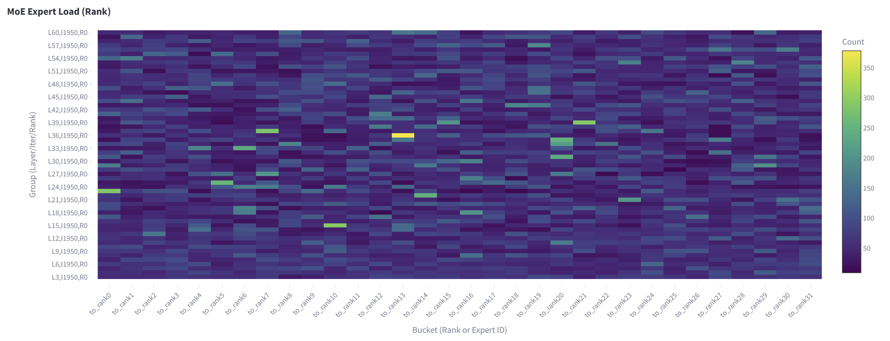
</figure>
</div>
<p align="center"><sub><em>Figure 1: The routed token count from rank 0 to all the ranks(including rank 0), for decode iteration 1950, and all the MoE layers</em></sub></p>

In Figure 1, it can be seen clearly that for MoE layer 36, it receives much more tokens sent from **rank 0** to **rank 13\.**

If we zoom in the MoE layer 36 about its activated expert rank distribution, it can be observed as the following:

<div align="center">
<figure>
  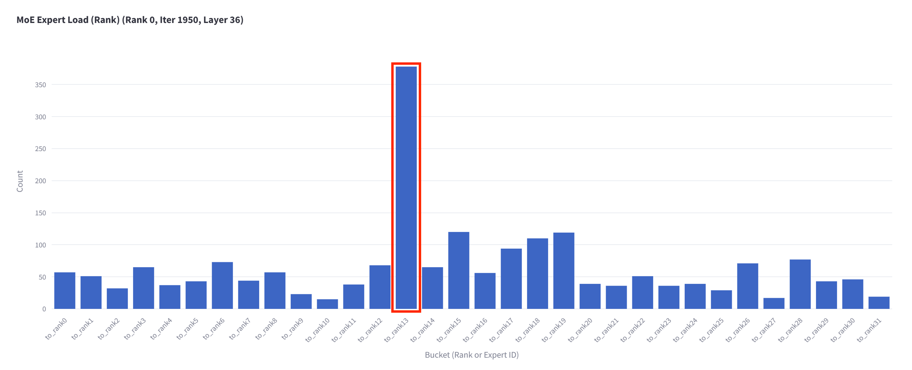
</figure>
</div>
<p align="center"><sub><em>Figure 2: The tokens received for each expert rank for layer 36</em></sub></p>

If we flatten the data to see the routed tokens for each expert, we can see the following pattern:

<div align="center">
<figure>
  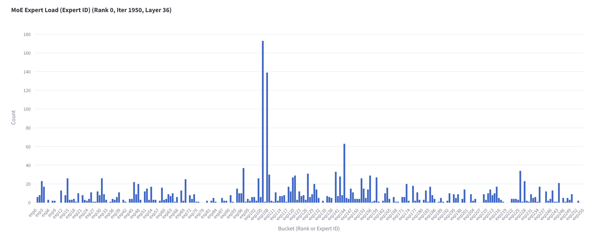
</figure>
</div>
<p align="center"><sub><em>Figure 3: The tokens received for each expert for layer 36</em></sub></p>

It is also interesting to see whether this kind imbalance issue is stable across multiple iterations:

<div align="center">
<figure>
  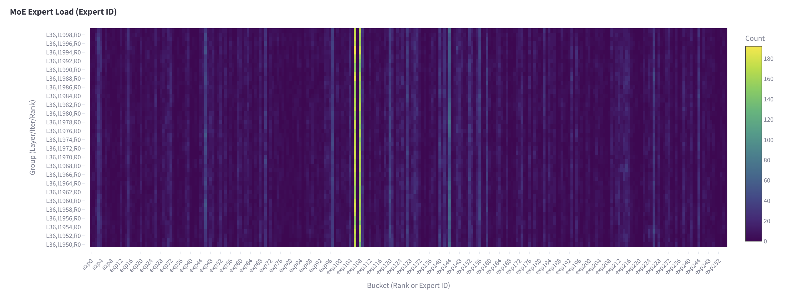
</figure>
</div>
<p align="center"><sub><em>Figure 4: The accumulated token counts received for each expert for layer 36, within 50 decode steps, and the local batch size=256.</em></sub></p>

Clearly, the hot experts in Figure 4 are actually the same as in Figure 3 which only have data for a single decode iteration.
We have also done the duration-based analysis for local batch size=1 which correspond to a single request with observing the similar pattern:

<div align="center">
<figure>
  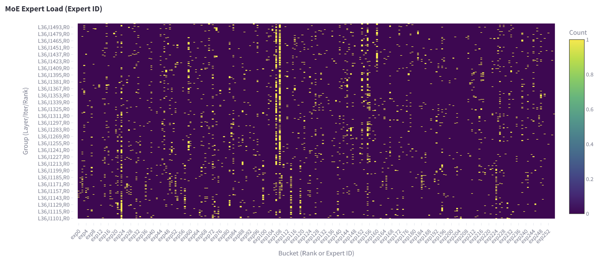
</figure>
</div>
<p align="center"><sub><em>Figure 5: The accumulated token counts received for each expert  for layer 36, within 400 decode iterations, and the local batch size \= 1\.</em></sub></p>

To conclude the findings for the study over this machine translation dataset:

* There are hot spots in some layers in which the workload of some EP ranks can be much higher than others.
* This may be caused by the hottest expert or some hot experts located at the same rank.
* The routed token distributions can be the same for tens to hundreds of iteration steps or even more.
* For the execution of a single request, it also has the same hot experts between steps.

And another natural question is whether the above observation can change significantly on other datasets. So we have done a similar analysis with the GSM8K dataset.

### Observation over GSM8K dataset

<div align="center">
<figure>
  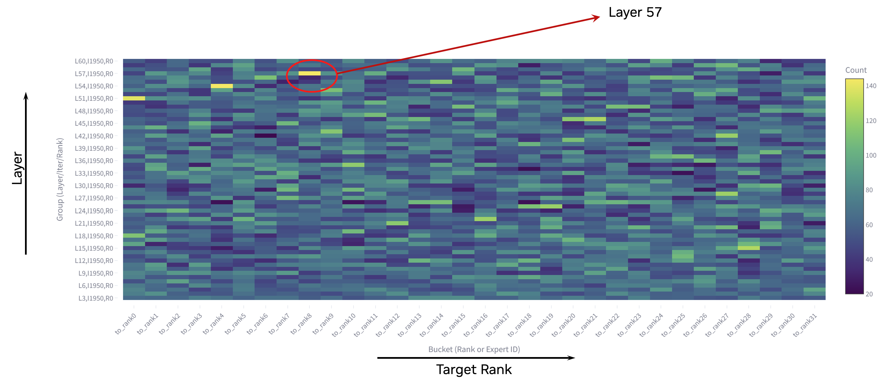
</figure>
</div>
<p align="center"><sub><em>Figure 6: The routed token count from rank 0 to all the ranks, for iteration 1950, and all the MoE layers</em></sub></p>

In Figure 6, compared with Figure 1, it can be seen that for GSM8K, the hot layer becomes layer 57 rather than layer 36\. Then what about the concrete status of layer 36 for the GSM8K dataset?

<div align="center">
<figure>
  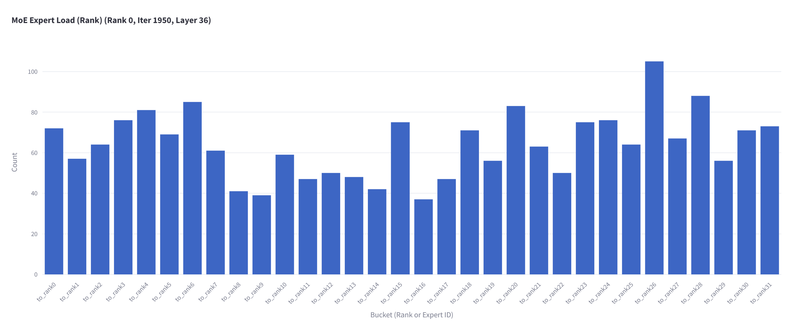
</figure>
</div>
<p align="center"><sub><em>Figure 7: routed token counts from EP rank 0 to other EP ranks, still taking the iteration 1950, MoE layer 36 as the example</em></sub></p>

Clearly from Figure 7, it can be observed the workload imbalance extent is different from what can be observed in Figure 2 which corresponds to MoE Layer 36 but on a different dataset.
Then let’s go back and zoom in with the analysis of layer 57 on GSM8K dataset:

<div align="center">
<figure>
  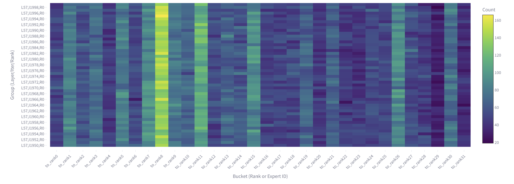
</figure>
</div>
<p align="center"><sub><em>Figure 8: The accumulated token counts sent from EP Rank 0 to all the ranks, for MoE layer 57 within 50 decode steps, local batch size=256</em></sub></p>

Based on Figure 8, it can be observed that the workload imbalance issue is relatively stable across multiple iterations on GSM8K dataset also, which is the same as the previous machine translation dataset.

If we flatten the EP rank level data to expert-level data, we can have the following figure.

<div align="center">
<figure>
  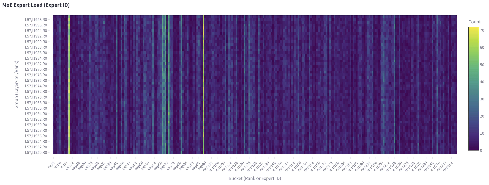
</figure>
</div>
<p align="center"><sub><em>Figure 9: The accumulated token counts received for each expert for layer 57, within 50 decode steps, and the local batch size=256.</em></sub></p>

The similar imbalance pattern also exists for a single request.

<div align="center">
<figure>
  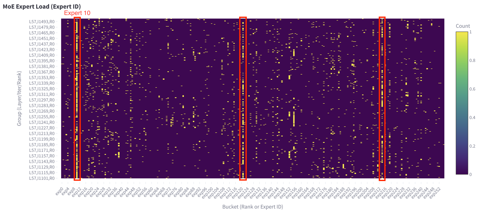
</figure>
</div>
<p align="center"><sub><em>Figure 10: The accumulated token counts received for each expert for layer 57, within 400 decode steps, for a single request</em></sub></p>

If we use another request, then we can still observe the expert imbalance issue, while the hot experts can become different with some in common(in this example it is expert 10).

<div align="center">
<figure>
  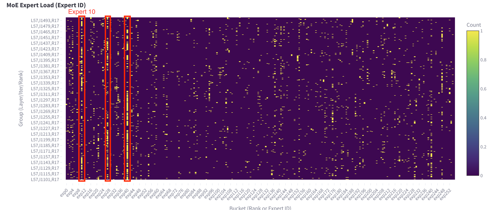
</figure>
</div>
<p align="center"><sub><em>Figure 11: The accumulated token counts received for each expert for layer 57, within 400 decode steps, for a single request</em></sub></p>

So combining the data analysis of two datasets, we have the following findings:

* EP level workload imbalance issue is common for large-scale EP inference on multiple datasets. And the EP imbalance severity can be different per layer. Also the EP imbalance issue is dataset sensitive.
* The EP rank level imbalance issue can be caused by a certain hottest expert or multiple hot experts staying on the same EP rank.
* The EP rank imbalance distribution is relatively stable across tens to hundreds of iterations.
* Though there is time-dimension stability of EP rank imbalance distribution, clearly different requests can have different EP imbalance distribution.

Based on these findings, they can lead to our design consideration of TensorRT-LLM’s large-scale EP implementation:

* By design the EP imbalance issue needs to be considered to assure great E2E performance.
* Online EP Load Balancer(rather than only a Offline EP Load Balancer implementation) based on the real-time online request traffic is essential to ensure the robustness of EP balancer.
* The time-dimension stability of EP rank imbalance distribution can be leveraged to re-distribute the MoE weights to different EP ranks in an efficient manner.

In the next section we will illustrate the high-level design.

## High-level design introduction

Based on the detailed analysis and study in section [Motivation of large-scale EP](#motivation-of-large-scale-ep), it can be clearly observed that EP level imbalance issue is a common pattern for large-scale EP. And the EP imbalance issue can clearly impede the overall system performance in the following ways:

* The hot EP rank will consume more memory which can limit the effective max batch size to be scheduled during the inference process.
* More data will be sent to/received from the hot EP rank
* And these can clearly result into a system-level straggling effect in which the hot EP rank will delay the overall E2E execution.

So to make sure large-scale EP can run well, careful considerations are needed to minimize the EP imbalance issue.
The overall design is as following:

<div align="center">
<figure>
  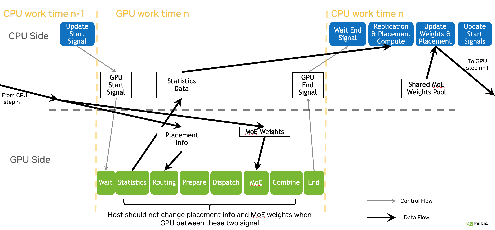
</figure>
</div>
<p align="center"><sub><em>Figure 12: the high-level design of TensorRT-LLM large-scale EP</em></sub></p>

In this design, there are both CPU and GPU side logics:

* CPU side
  * Implement the Replication \& Placement algorithms **(Replication \& Placement Compute** component) to achieve a more balanced EP strategy. Since these kinds of logics usually are classical algorithms, CPU computation is enough and more suitable, also by offloading this computation to CPU side, the interference with GPU can be reduced. In the future machine-learning based algorithms may be also explored here and additional design consideration will be needed then. The **Replication \& Placement Compute** component will generate the **“Placement Info”** which will then be consumed by both the GPU side **Routing** logic and the CPU-side **Update Weights \& Placement** component. And the **Replication \& Placement Compute** component will consume the **Statistics Data** generated by the **Statistics** component run on the GPU side.
  * Orchestrate the process(**Update Weights \& Placemen**t component) to update and reload the MoE weights from CPU host memory to GPU device memory. This component will also consume the **Placement Info** generated by the **Replication \& Placement Compute** component. And the design is also scalable to reload the MoE weights from remote GPU memory via MNNVL or NIC.
* GPU side
  * This is the main execution workflow of inference. And there are some new components introduced on GPU side
    * EP communication kernels, in Figure 11 it corresponds to the **Dispatch** and **Combine** components.
    * Online traffic data statistics collector(the **Statistics** component) and it will collect the **Statistics Data** which is to be consumed by the **Replication \& Placement Compute** component.
    * The MoE router logic(the **Routing** component) which is to send one token to the activated experts. It needs to be adjusted to adapt with the dynamic MoE weight placement needs. It will also consume the **Placement Info** generated by the **Replication \& Placement Compute** component.
    * The MoE computation logic(the **MoE** component) also needs to be adjusted correspondingly.
* Since there are both CPU and GPU side logics, careful synchronizations are needed to ensure the validity of the entire execution process. Otherwise it can either cause hang or sub-optimal execution behavior or even illegal execution behavior.

For the **Update Weights \& Placemen**t component, there are two design choices:

* Bulk approach
  * In this approach, when the MoE weight redistribution logic starts, the online inference of the current serving instance will get paused until the MoE weight redistribution process finishes. It means that there can be approximately **0.5 \~** **1 second** online serving stalls and sometimes it can cause some requests to time out.  This kind of timeout or stalls can be mitigated at the system level such as routing the request to another serving instance or just re-send the request.
* Layer-wise approach
  * In this approach, the MoE weight redistribution will be done in a layer-wise way and in each decode iteration only certain layers(which can be configurable) which are not used for inference computation will be updated about their MoE weights redistribution. So all layers will be updated with the balanced MoE weight redistribution in multiple iterations. By doing so, the online serving user experience almost feels nothing about the MoE weight redistribution behaviors.

<div align="center">
<figure>
  
</figure>
</div>
<p align="center"><sub><em>Figure 13: One example of the layer-wise MoE weight re-distribution</em></sub></p>

In our current system, we choose to implement **the layer-wise approach** to minimize the impact to online user experience. Bulk approach should be much easier to implement so we will not touch it in this tech blog.
To implement the layer-wise approach properly, we need to carefully evaluate the capability of different underlying HWs to decide the concrete implementation.
Let’s use GB200 as an example. In Figure 14, we illustrate the communication bandwidth of different HW mediums in a GB200 node.

<div align="center">
<figure>
  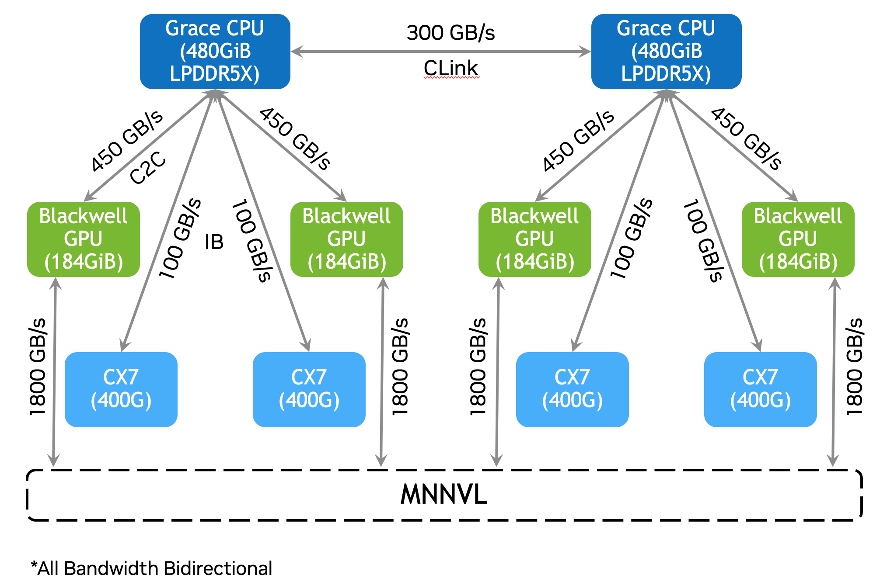
</figure>
</div>
<p align="center"><sub><em>Figure 14: high-level topology of GB200 system</em></sub></p>

Using the DeepSeek R1 model as an example, with FP4 precision, each MoE expert occupies 24MiB memory space. There are 256 experts per layer. With totally 58 MoE layers, plus 1 MTP layer. So the maximum MoE weights size which needs to be redistributed to achieve EP balance is 348GiB.
For one GB200 node, it has 480GB LPDDR5X memory for each Grace CPU, with totally 960GB host memory across NUMA domain, so one GB200 node can host the entire MoE weights of models like DeepSeek R1 onto its CPU host memory. Then based on it, the MoE weight redistribution can be done by moving the corresponding MoE weights from CPU host memory to GPU device memory.

Assuming that we shoot for **50ms** inter-token-latency(ITL) as the latency constraint, based on some envelope calculation, it can be computed about the theoretical number of expert weights which can be moved from the MoE weight pool (it can be kept in Grace CPU memory or GPU memory in another node) to the Blackwell GPU side(to do the real MoE inference) for each decode iteration:

<div align="center">
<figure>
  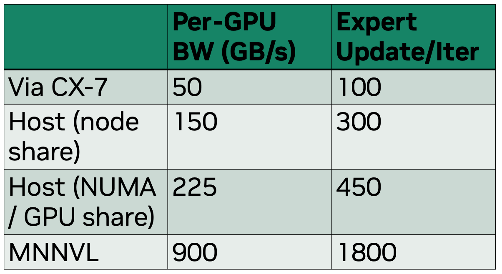
</figure>
</div>
<p align="center"><sub><em>Figure 15: The theoretical expert count to be updated for each iteration with following 50ms ITL constraints, by using different HW as pools to store the full MoE weight</em></sub></p>

Based on this analysis, if we rely on the Grace CPU memory on each node as the MoE weight pool, for each decode iteration, in theory the weights of up to 300 experts can be redistributed to each GPU on the same GB200 node.
And here are some more concrete use-case studies. Assuming the goal is to finish the MoE weight balancing redistribution for the full size model within 5 decode iterations.

* Use-case 1(with only doing balanced expert placement, and no expert replication)
  * 64 GPUs with 4 Experts per GPU
  * 58 layers, 232 Experts per GPU
  * Need 47 Expert Update / Iter, all methods can satisfy this goal.
* Use-case 2(with both balanced expert placement and replication)
  * 64 GPUs or 72 GPUs with 5 Experts per GPU
  * 58 layers, 290 Experts per GPU
  * Need 58 Expert Update / Iter, also all methods can satisfy.
* Use-case 3(with both balanced expert placement and replication)
  * 36 GPUs with 8 Experts per GPU
  * 58 layers, 464 Experts per GPU
  * Need 93 Expert Update / Iter, also all methods can achieve.

In summary, based on the theoretical analysis, using Grace CPU memory as the pool to hold the full size MoE weights is feasible to achieve the EP(Expert-Parallelism) balancer goal within 5 decode iterations. If we relax the requirements to 10 or more iterations, there can be even more system implementation flexibility.

Next we will introduce the implementation details of our large-scale EP system.

## EP communication kernels

We have evaluated multiple ways of implementing the EP communication kernels needed by large-scale EP, including DeepEP, other solutions and developing something from scratch.

The current technical decision is:

* For GB200, we choose to implement a new set of [custom EP communication kernels](https://github.com/NVIDIA/TensorRT-LLM/pull/3504).
* For non-GB200 systems(such as B200/Hopper/etc.), we choose to integrate DeepEP directly, with some potential enhancement.

 The considerations are:

* DeepEP is a great work done by the DeepSeek team. And when we started the TensorRT-LLM large-scale EP efforts, our first focus was on GB200. We chose to implement our own custom EP communication kernels as there are more flexibilities to introduce optimizations suitable to release GB200 MNNVL capability. Also based on our current evaluation, DeepEP hasn’t provided CUDA graph compatibility for all the scenarios and in our scenario we believe that CUDA graph is mandatory for performance needs.
* Later when we started the efforts to enable large-scale EP on Hopper, we made more investigation and analysis of DeepEP and for Hopper we think what DeepEP provides can basically meet our needs at least on Hopper. There are two interfaces of DeepEP, where one has issues with CUDA graph while the other low-latency interface requires some additional changes as to our current MoE module design to be performant enough. For both issues our latest judgement is that they can be enhanced(with some potential API level changes) so we decided to turn to DeepEP for Hopper support for now, and we plan to extend it to also cover B200 cluster later.

We are also actively evaluating the possibility of consolidating GB200 and non-GB200 EP communication kernels into a single solution to make the system simpler, and we will keep the community posted on the status.
Now let’s talk a little bit more about the optimizations introduced into the custom EP communication kernel implementations.

### Motivation of EP communication kernels for GB200

In the Decoding Phase with Prefill-Decoding (PD) separation, we observed that the batch size may not be very large, so besides throughput, latency also becomes a significant concern. In this context, compatibility with CUDA Graph can be a natural requirement.
[NCCL](https://github.com/NVIDIA/nccl) is a great GPU communication library which provides highly efficient communication kernels and primitives.
For now, its Send and Recv operations require the data size to be explicitly specified when invoking with `ncclSend`/`ncclRecv`.
However, in large expert parallel (large-EP) scenarios, the data size to be transmitted is determined dynamically based on model output in each iteration.
If we follow the NCCL's communication interface, it would require explicit synchronization to send communication size back to CPU and launching NCCL calls on the CPU with the corresponding data size, which would break CUDA Graph compatibility.
So we need some high performance communication kernels which is compatible with CUDA graph and can accept communication sizes on GPU memory.
And for GB200, we also want to make use of MNNVL's bandwidth advantages.

### EP communication kernels implementation
To address this, we adopted a communication approach similar to NCCL’s LL128 primitive, as this approach strikes a good balance between latency and bandwidth, it is well-suited for LLM inference.
By wrapping the logic into a custom kernel, it is allowed that metadata such as the communication size can be stored directly in GPU memory, so it compatible with CUDA Graph even when the data size varies across different runs.

In our implementation, we use CUDA's Driver API to establish a peer-to-peer (P2P) buffer via MNNVL as a workspace.
Each GPU can access the workspace of other GPUs. The workspace is divided into multiple channels, each assigned to a remote GPU as a write buffer.
These write buffers are used in a FIFO manner, with flags used to synchronize FIFO status and avoid data corruption.
More details can be found in [PR 3504](https://github.com/NVIDIA/TensorRT-LLM/pull/3504).

## EP Load Balancer

TensorRT-LLM implements a set of utility logics to achieve EP Load Balancer.  And there are several key components of these utility logics:

### Python Interface

The Python interface layer provides a user-friendly PyTorch/Python native interface to access the MoE Load Balancing implementations, such as the Python wrapper of the GPU/CPU synchronization logics and the online data statistics collection, and other logics implemented in 4.2 to 4.4.

### C++ extension

The C++ extension acts as the bridge between PyTorch/Python interface and the C++/CUDA core implementations.

### Core implementations of host side logics

The host-side core logics implements the following key parts:

* Load balancing algorithms
  * Replication algorithm
  * Placement algorithm
* Orchestration logics of MoE weight updates
* MoE weight update logics

### Core implementations of GPU side logics

The GPU-side core logics implement the following stuffs:

* Online traffic statistics collection
  * To reduce the CPU-GPU back-and-forth synchronization cost, we choose to implement the online traffic statistic logic on the GPU side.
* Expert routing logic
  * The MoE router logics need to be enhanced to adapt with the dynamic EP balance impact.
* Also there are GPU/CPU synchronization logics implemented.

More details can be found in [PR 4384](https://github.com/NVIDIA/TensorRT-LLM/pull/4384) and [PR 4495](https://github.com/NVIDIA/TensorRT-LLM/pull/4495).

Based on these core utilities, there are two versions of EP Load Balancer in TensorRT-LLM: Offline EP Load Balancer and Online EP Load Balancer.

### Online EP Load Balancer

For production deployment needs, Online EP Load Balancer is recommended since it can adapt with the change of online traffic pattern dynamically, thus with more performance guarantee.

The Online EP Load Balancer faces several challenges.

First, load balancing introduces dynamic Expert placement. A single Expert’s location may shift based on current workload. For example, if Expert 0 and Expert 1, originally assigned to Rank 0, both become hot experts, the load balancing policy might redistribute them to different ranks alongside cold experts, which necessitates timely updates to the weight data.

We aim for the Online Load Balancer to react swiftly to changes in request patterns and adjust Expert assignments to avoid load imbalance issues. Importantly, we do not want the balancing process to interfere with the online inference execution process, nor do we want to employ a "Stop-The-World"(Bulk) strategy for updating weights.

In large MoE models (such as DeepSeek R1) during the decoding phase, batch sizes are often small, making CUDA Graph an effective acceleration method—especially when high TPS per user is required. This benefit is even more pronounced on platforms like GB200. Hence, we want the entire load balancing mechanism to be compatible with CUDA Graph.

To avoid invalidating pre-captured CUDA Graphs, we perform in-place weight updates by writing new Expert weights into the same memory locations, rather than swapping out tensor pointers. This ensures the weights tensor address remains unchanged in the Model Engine.

In this design, each Expert Slot serves as a container for holding an Expert’s weights, decoupled from any specific Expert. The number of Expert Slots must be greater than or equal to the total number of Experts so that each Expert always has at least one available Slot. Hot Experts may occupy multiple Slots. Each Slot is identified by a SlotId.

Since the MoE model's routing logic outputs ExpertIds(not SlotIds), we maintain a routing table from ExpertId to SlotId which is updated by load balancing policy periodically. The Load Balancer Routing module uses the current routing table (Expert replication information and slots) to map each token to a suitable Expert Slot.

To make weight updates non-blocking and avoid "Stop-The-World", we use a layer-wise update approach. After a layer’s forward pass completes and before its next forward pass starts, we perform the weight balancing for that layer; the next forward pass for the same layer should wait until the last update is done if it happens at this iteration.

As the forward execution is typically driven by a single Python thread invoking a sequence of PyTorch operations, we offload the weight update routine to a background C++ thread. The Python side only initializes the Expert Slots and registers Expert Weights in shared host memory.

During forward execution, we insert lightweight lock/unlock kernels before and after MoE computation, as well as kernels for collecting statistics and assigning SlotIds to ExpertIds. These kernels must be short and overlap-friendly to minimize performance impact. As long as the CPU weights update thread can finish its work on time, the lock/unlock will be very short. All except the routing kernel are lightweight and can easily overlap with forward kernels in different CUDA streams; the routing kernel is the primary optimization focus.

On GB200, we utilize MNNVL for inter-GPU communication during Expert dispatch and combine. Expert weights reside in host memory and are brought into GPU memory via C2C to support asynchronous updates. A multi-threaded Host Copy Engine manages this process, auto-detecting NUMA topology and choosing optimal CPU cores, enabling full asynchrony with model forward passes.

On servers without C2C but with PCIe, if cross-node communication is required, network and weight updates may compete for PCIe bandwidth, requiring additional tuning and design consideration. We have not implemented the copy engine for PCIe servers yet and it is our in our future task list.

### Offline EP Load Balancer

Online EP balancer is more suitable for production deployment needs to react timely with the online traffic changes, while Offline EP Balancer provides a lightweight way for performance study/debugging and validation. You can refer to [this](https://github.com/NVIDIA/TensorRT-LLM/pull/4695) PR to learn more implementation details of the Offline EP Load Balancer. Also there is a tool provided to collect the expert activation distribution statistics which can be used as the input to deduce the EP balancing placement strategy. You can refer to [this](https://github.com/NVIDIA/TensorRT-LLM/tree/feat/large-ep/examples/ep_load_balancer#offline-ep-load-balancer) doc to know more details as to how to run through the Offline EP Load Balancer in E2E approach.

## E2E evaluation

### The effect of EP Load Balancer

#### Offline EP Load Balancer
As shown by Figure 1, on the machine translation dataset, MoE layer 36 suffers from extreme expert load imbalance issues, so we use that layer to illustrate the effect of EP Load Balancer. We still run DeepSeek-R1 with 32-way expert parallelism on 32 GB200 GPUs.

<div align="center">
<figure>
  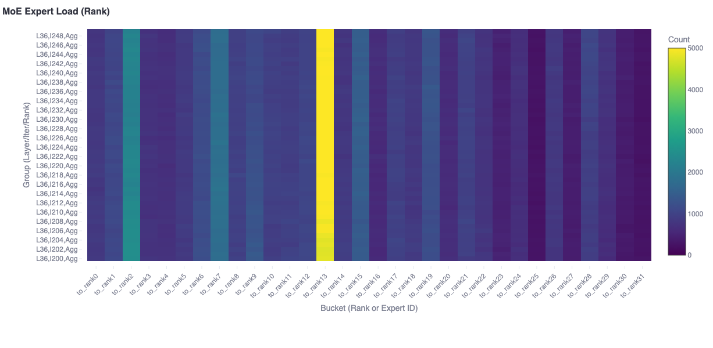
</figure>
</div>
<p align="center"><sub><em>Figure 16: The routed token count by receiving ranks (x-axis) and iterations (y-axis) at layer 36 (No EPLB)</em></sub></p>

<div align="center">
<figure>
  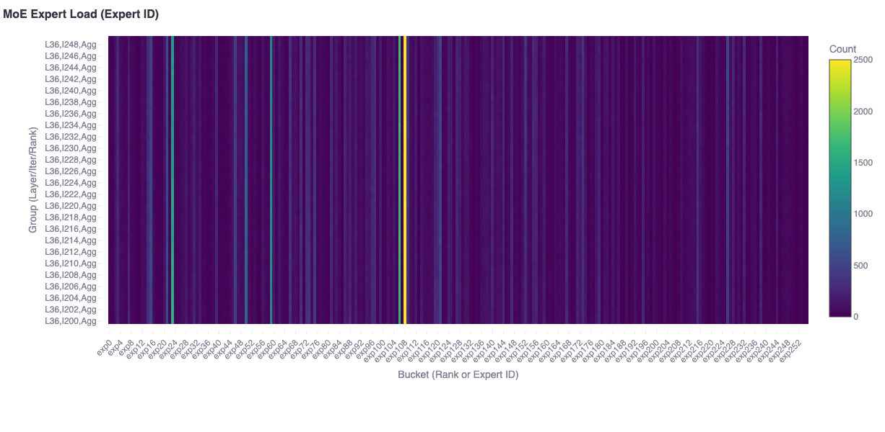
</figure>
</div>
<p align="center"><sub><em>Figure 17: The routed token count by experts (x-axis) and iterations (y-axis) at layer 36 (No EPLB)</em></sub></p>

Figure 16 displays the routed token count by receiving ranks over 50 iterations, which could represent the workload for each rank. Rank 13 receives significantly more workloads than all other ranks, and such imbalanced workload distribution is almost constant over iterations. Figure 17 breaks down the workload to experts. Clearly, two hot experts on rank 13 cause the excessive workloads.

With the above statistics, we can perform offline EPLB. One potential strategy is to maintain the 32-way expert parallelism while increasing expert slots from 8 to 9 per rank. This results in 32 redundant experts and 288 expert slots in total. Figures 18 and 19 show the routed token count after EPLB. Clearly, the per-rank workload distribution is much more balanced, and there are no apparently hot experts anymore.

<div align="center">
<figure>
  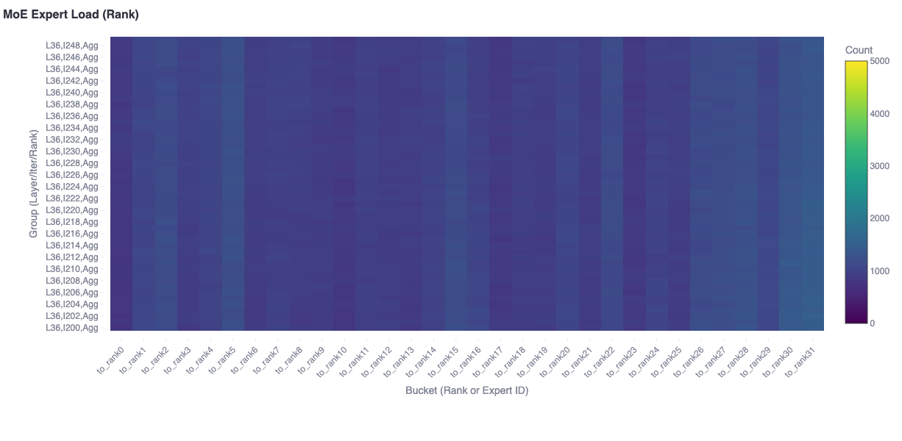
</figure>
</div>
<p align="center"><sub><em>Figure 18: The routed token count by receiving ranks (x-axis) and iterations (y-axis) at layer 36 (EPLB with 9 per-rank slots and EP 32)</em></sub></p>

<div align="center">
<figure>
  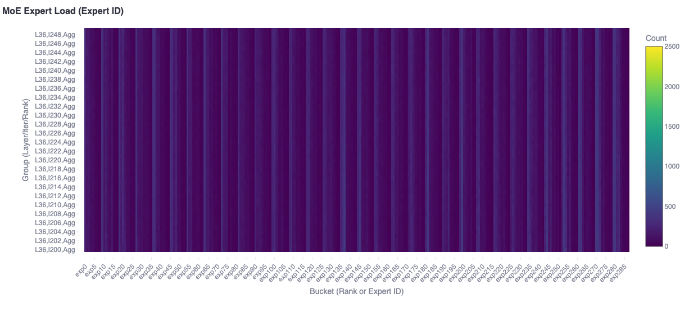
</figure>
</div>
<p align="center"><sub><em>Figure 19: The routed token count by experts (x-axis) and iterations (y-axis) at layer 36 (EPLB with 9 per-rank slots and EP 32)</em></sub></p>

Another EPLB strategy is to maintain 8 expert slots per rank while increasing expert parallelism to 36 ways. This strategy also results in 32 redundant experts and 288 expert slots in total. As displayed by Figures 20 and 21, the workloads also become balanced across ranks or expert slots.

<div align="center">
<figure>
  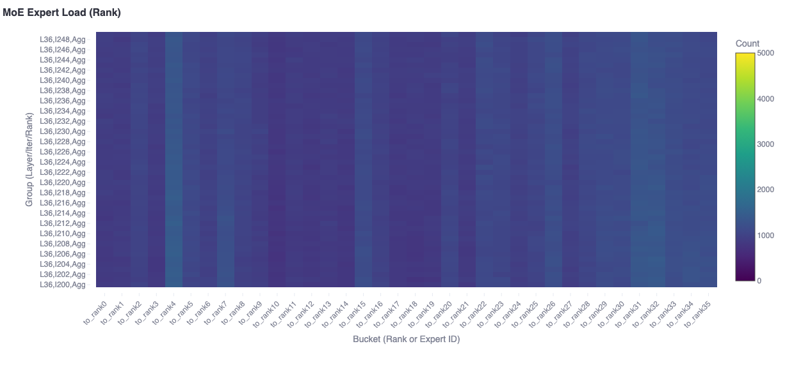
</figure>
</div>
<p align="center"><sub><em>Figure 20: The routed token count by receiving ranks (x-axis) and iterations (y-axis) at layer 36 (EPLB with 8 per-rank slots and EP 36)</em></sub></p>

<div align="center">
<figure>
  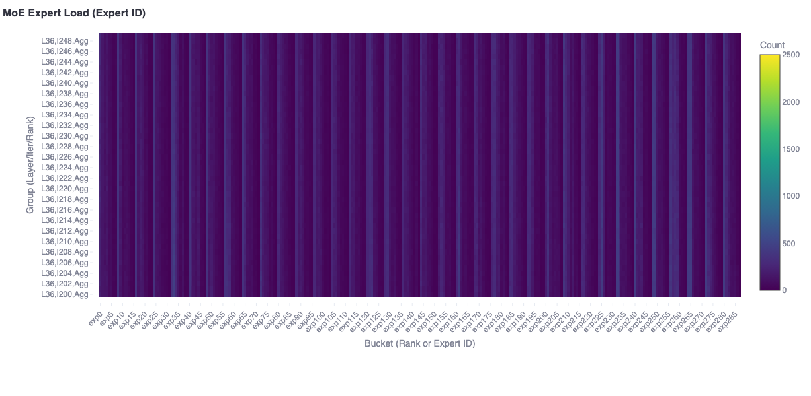
</figure>
</div>
<p align="center"><sub><em>Figure 21: The routed token count by experts (x-axis) and iterations (y-axis) at layer 36 (EPLB with 8 per-rank slots and EP 36)</em></sub></p>

For each layer and iteration, the load imbalance can be measured using simple metrics such as the standard deviation or the imbalance ratio. Given the routed token counts for all ranks (or experts), the imbalance ratio is defined as $(max - mean) / mean$, which represents the excessive workload received by the hottest rank (or expert). A perfectly balanced load would have an imbalance ratio of 0.

Table 1 reports the standard deviation and imbalance ratio for the aforementioned cases. Each number is averaged from the per-layer per-iteration metrics. Without EPLB, the load imbalance is significant -- on average, the hottest rank receives 1.56 times more routed tokens than the mean. EPLB can effectively reduced the load imbalance -- on average, the hottest rank receives only about 0.11 times more routed tokens than the mean.

|  | By rank |  |  | By expert slot |  |  |
| :---: | :---: | :---: | :---: | :---: | :---: | :---: |
|  | Average | Std. Dev. | Imb. Ratio | Average | Std. Dev. | Imb. Ratio |
| No EPLB (8 per-rank slots and EP 32) | 1024 | 491.6 | 1.564 | 128 | 164.1 | 10.948 |
| EPLB (9 per-rank slots and EP 32)    | 1024 |  52.0 | 0.109 | 114 | 77.8  |  1.792 |
| EPLB (8 per-rank slots and EP 36)    | 1024 |  53.9 | 0.115 | 128 | 87.5  |  1.791 |

*Table 1: The standard deviation and imbalance ratio (average of per-layer and per-iteration metrics)*

#### Online EP Load Balancer

In the previous section, we demonstrated the impact of the Offline EP Load Balancer. Given our implementation of the Online EP Load Balancer, we further examine the dynamic patterns of EP balance status under online conditions.
Let’s still use the machine translation dataset, DeepSeek R1 model,  layer 36(which is shown in Figure 1\) as the example to understand the online pattern change status:

<div align="center">
<figure>
  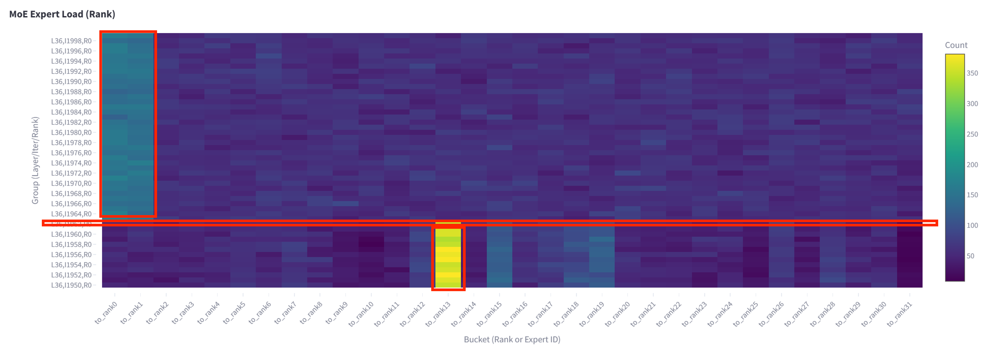
</figure>
</div>
<p align="center"><sub><em>Figure 22: The token count sent from rank 0 to all the ranks, run on GB200, with EP32, local batch size=256, with 256 slots(no replication), so each rank hosts 8 experts</em></sub></p>

From Figure 22, it is clear that from iteration 1963, since the EPLB has taken into effect, the original hottest rank 13 is no longer the hot rank and the original workload sent to rank 13 has been redistributed to rank 0 and rank 1\.

In Figure 22, only placement adjustment has been done by the Online EPLB. If we further introduce expert replication, the balance situation can be further improved, such as in the following figure:

<div align="center">
<figure>
  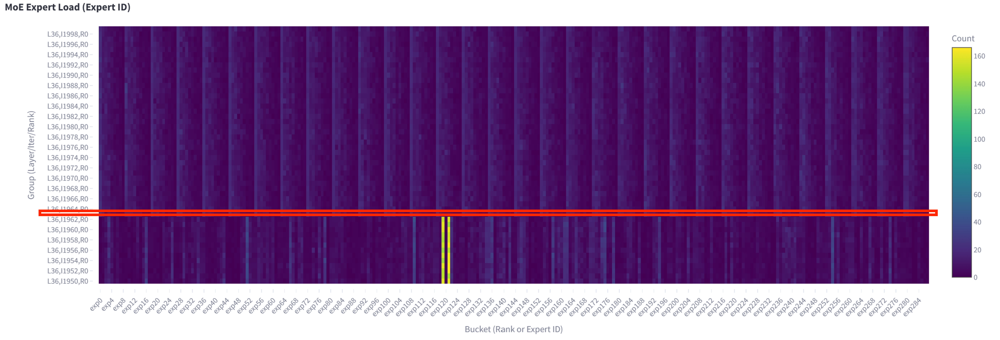
</figure>
</div>
<p align="center"><sub><em>Figure 23: The token count sent from rank 0 to all the ranks, run on GB200, with EP32, local batch size=256, with 288 slots(with replication), so each rank hosts 9 experts</em></sub></p>

Clearly, by introducing expert replication when doing the EPLB, the EP balance situation can be further improved.
Further complicated experiments can be designed to observe the Online EPLB taking into effect periodically during the online serving process to balance the EP workload in a dynamic way and we welcome the community to report any interesting EPLB pattern observation to us.

### Performance study
Note: all the representative workloads illustrated in this section are from the performance traces extracted from DeepSeek R1 inference execution. The E2E performance tuning/optimization is still ongoing and we will demonstrate them in the future tech blogs.

Let's use some representative workloads to illustrate the performance impact with large-scale EP.
<div align="center">
<figure>
  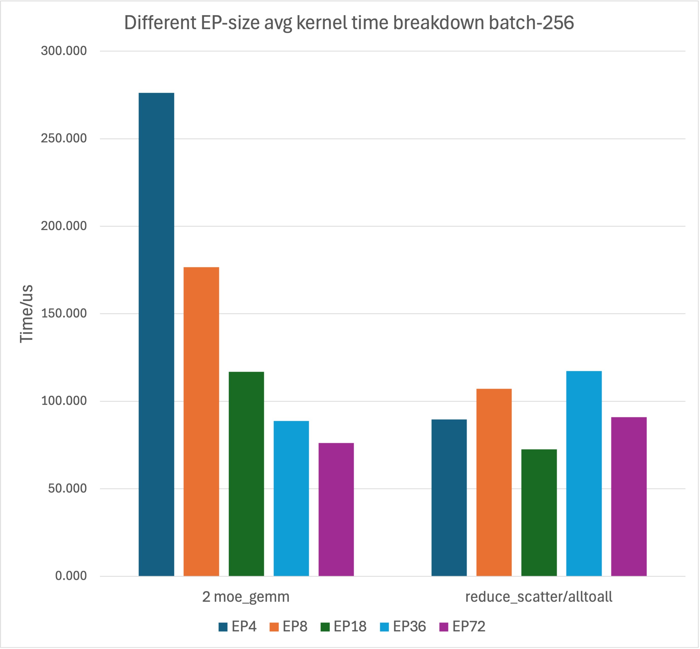
</figure>
</div>
<p align="center"><sub><em>Figure 24: EP impact over MoE Group GEMM and EP communication</em></sub></p>
In Figure 24, it can be observed by increasing the EP size from 4 to 72, the MoE Group GEMM computation time gets reduced, while the EP communication time(for EP4/EP8 reduce_scatter is used while for EP>8 A2A is used) stays almost constant.
When the EP size increase from 18 to 32, the speed-up diminishes, and there are efforts to optimize it.

Next let's use some representative workloads to understand the performance impact with EPLB.
<div align="center">
<figure>
  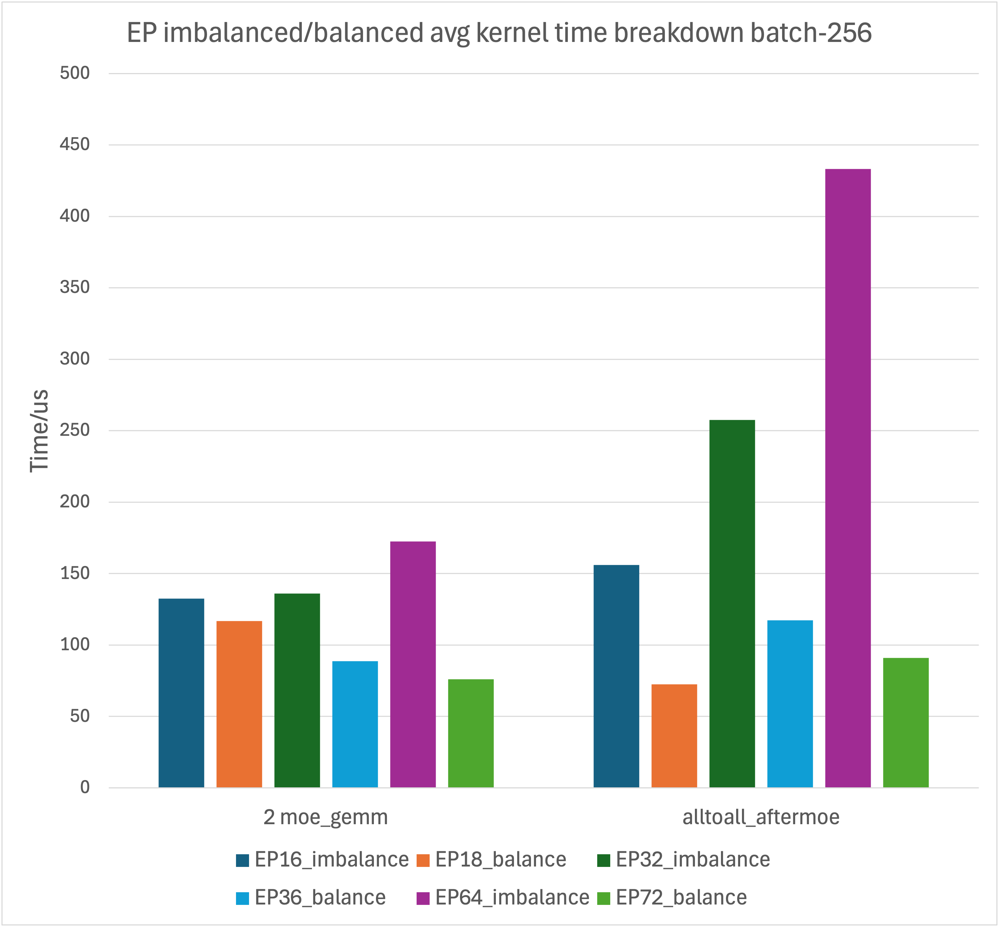
</figure>
</div>
<p align="center"><sub><em>Figure 25: EPLB performance impact</em></sub></p>
Clearly in Figure 25, we can see that EPLB brings clear performance improvement when EP size increases, for both MoE GroupGEMM and EP communication time.

## Reproducing steps
Currently to run through the reproducing steps described in this section, pls use this [feature branch](https://github.com/NVIDIA/TensorRT-LLM/tree/feat/large-ep/tensorrt_llm) and it will get merged to the main branch soon.
### The effect of EP Load Balancer
Please refer to the [EP Load Balancer example](https://github.com/NVIDIA/TensorRT-LLM/tree/feat/large-ep/examples/ep_load_balancer) for how to reproduce the effectiveness of offline EP Load Balancer.

##### Step 1: Run inference and collect statistics

To generate the necessary statistics for load rebalancing, run your model on a target dataset and count the routed expert IDs during inference. Once the counting is complete, the statistics will be saved for further processing.

Set up some environment variables:

```bash
export MODEL_NAME=deepseek-ai/DeepSeek-R1
export MODEL_PATH=<YOUR_MODEL_PATH>
# Set the expert statistic data path
export EXPERT_STATISTIC_PATH=./expert_statistic
# Enable counting of routed expert IDs from iteration 100 to iteration 200
export EXPERT_STATISTIC_ITER_RANGE=100-200
```

Prepare a dataset following the [benchmarking documentation](https://github.com/NVIDIA/TensorRT-LLM/blob/main/docs/source/performance/perf-benchmarking.md#preparing-a-dataset) and save it as `./dataset.json`.

Run 32-way expert parallelism inference on the prepared dataset. Please refer to the [LLM API MGMN example](https://github.com/NVIDIA/TensorRT-LLM/blob/main/examples/llm-api/llm_mgmn_trtllm_bench.sh) for details on running `trtllm-bench` on Slurm.

```bash
cat > ./extra_llm_api_options.yaml <<EOF
enable_attention_dp: true
use_cuda_graph: true
EOF

trtllm-llmapi-launch \
trtllm-bench --model ${MODEL_NAME} \
    --model_path ${MODEL_PATH} \
    throughput \
    --tp 32 \
    --ep 32 \
    --extra_llm_api_options ./extra_llm_api_options.yaml \
    --kv_cache_free_gpu_mem_fraction 0.75 \
    --backend pytorch \
    --dataset ./dataset.json \
    --warmup 0 \
    --eos_id -1
```

After inference, review the dumped statistic files in `$EXPERT_STATISTIC_PATH`. Run the `examples/ep_load_balancer/report_load_statistics.py` script to show the standard deviation and imbalance ratio metrics:

```bash
python examples/ep_load_balancer/report_load_statistics.py --expert_statistic_path $EXPERT_STATISTIC_PATH
```

The output would look like:

```txt
Load statistics:
           mean         std  imbalance-ratio
3        1024.0  187.955200         0.498043
4        1024.0  202.728516         0.537602
5        1024.0  209.339981         0.458676
...
58       1024.0  570.880676         2.461014
59       1024.0  341.339447         0.717498
60       1024.0  381.045471         1.119648
average  1024.0  491.651199         1.564272
```

##### Step 2: Generate the EPLB configuration

Use the provided `examples/ep_load_balancer/generate_eplb_config.py` script to convert the collected statistics into an EPLB configuration file. Specify the target expert parallelism size (`--ep_size`) and the total number of slots (`--num_slots`) that will be used for deployment. For example, if we choose to maintain 8 expert slots per rank while increasing expert parallelism to 36 ways, there should be 32 redundant experts and 288 expert slots in total.

```bash
python examples/ep_load_balancer/generate_eplb_config.py \
    --ep_size 36 \
    --num_slots 288 \
    --expert_statistic_path $EXPERT_STATISTIC_PATH \
    --output_path ./moe_load_balancer.yaml
```

The `./moe_load_balancer.yaml` file would look like:

```yaml
initial_global_assignments:
  3: [138, 81, 60, ..., 69, 250, 77]
  4: [24, 243, 72, ..., 90, 251, 52]
  5: [120, 162, 246, ..., 14, 192, 171]
  ...
  58: [67, 70, 160, ..., 212, 103, 125]
  59: [45, 142, 152, ..., 99, 205, 49]
  60: [34, 162, 119, ..., 234, 26, 129]
num_slots: 288
layer_updates_per_iter: 0
```

##### Step 3: Run inference with the EPLB configuration

Set up some environment variables:

```bash
# Set a new expert statistic data path
export EXPERT_STATISTIC_PATH=./expert_statistic_eplb
# Enable counting of routed expert IDs from iteration 100 to iteration 200
export EXPERT_STATISTIC_ITER_RANGE=100-200
```

Run 36-way expert parallelism inference with the EPLB configuration incorporated:

```bash
cat > ./extra_llm_api_options_eplb.yaml <<EOF
enable_attention_dp: true
use_cuda_graph: true
moe_load_balancer: ./moe_load_balancer.yaml
EOF

trtllm-llmapi-launch \
trtllm-bench --model ${MODEL_NAME} \
    --model_path ${MODEL_PATH} \
    throughput \
    --tp 36 \
    --ep 36 \
    --extra_llm_api_options ./extra_llm_api_options_eplb.yaml \
    --kv_cache_free_gpu_mem_fraction 0.75 \
    --backend pytorch \
    --dataset ./dataset.json \
    --warmup 0 \
    --eos_id -1
```

Run the `examples/ep_load_balancer/report_load_statistics.py` script again:

```bash
python examples/ep_load_balancer/report_load_statistics.py --expert_statistic_path $EXPERT_STATISTIC_PATH
```

The output would look like:

```txt
Load statistics:
           mean        std  imbalance-ratio
3        1024.0  37.612328         0.081947
4        1024.0  42.367714         0.093256
5        1024.0  42.623219         0.092623
...
58       1024.0  49.167507         0.113420
59       1024.0  44.529514         0.092314
60       1024.0  48.408348         0.101029
average  1024.0  53.976442         0.115378
```

> **Note:** The expert ID counting could significantly hurt performance, so remember to disable it by unsetting `EXPERT_STATISTIC_ITER_RANGE` when running inference for benchmarking or production purposes.

### Miscellaneous
- **GB200 NUMA binding**: Since on GB200, GPU memory are also on NUMA nodes, system can also use GPU's memory. It is suggested to use `numactl -m 0,1` to bind memory to CPU nodes if you don't want that happen.
- **Shared Memory Clean Up**: To achieve online load balance, all expert weights are stored in shared host memory. 4 ranks on same GB200 node share the same expert weights to save memory. Normally, these shared host memory will be cleaned up at process exit. But if an abnormal exit happens, they may not get chance to be cleaned. In that case, you may need to manually check `/dev/shm` directory and delete `/dev/shm/moe_shared_*` if any.

## Expanded thoughts

We deeply acknowledge the system innovation from the DeepSeek team of introducing the large-scale EP support into their in-house inference system and their open spirit of sharing their engineering insights to the community to boost the baseline of inference system design.
**Also we want to point out that there isn't any silver bullet in system design and optimization, so as large-scale EP.**
Based on our current performance analysis, when you plan to apply large-scale EP, you should take the following factors into considerations:

* Does MoE GroupGEMM computation time become the E2E performance bottleneck?
  * Large-scale EP mainly helps reduce the MoE GroupGEMM execution time due to the reduced expert weight loading pressure, thus increasing the compute intensity of the MoE GroupGEMM layer. For your workload setting, if the MoE GroupGEMM computation is not the bottleneck, then large-scale EP may not help too much.
* The latency constraints.
  * Large-scale EP mostly helps when there is stricter latency constraint, especially on GB200/B200 with more memory capacity.  For GPUs with less memory capacity, for scenarios with less latency constraints, large-scale EP can still help due to that it can help achieve higher concurrency and better tps/GPU.
* The available HW spec.
  * The optimal use of large-scale EP depends on GPU specifications \- including memory bandwidth, capacity, inter-GPU bandwidth, and compute power \- which determine both whether to employ large-scale EP and the ideal degree of parallelism.
* System complexity and the production deployment constraints.
  * Without fault tolerance guarantee, large-scale EP can increase the online system failure ratio, though it is possible to do cluster level coordination to route the traffic to other running serving instances when certain large-scale EP serving instances fail, due to the large number of GPUs required for a single-instance deployment, it can increase system level deployment challenges.

**In the future, we plan to summarize and share more of the best practices of deploying with large-scale EP techniques.**

**Please use your own judgement to decide whether to use large-scale EP into your system or not, and when you use it, what is the suitable EP size and concrete deployment settings suitable for your own requirements.**

The current TensorRT-LLM large-scale EP implementation is not perfect enough and there are still clear known tasks to be completed(community contributions are also welcome to take these tasks), such as:

* More platforms coverage
  * Extending the support to cover other non-GB200 NVIDIA GPU HWs. **We are actively working on this now.**
  * Currently the large-EP support only covers NVFP4 data precision, incremental efforts are needed to cover FP8 and INT8/INT4 data precision.
* Performance
  * Further performance tuning and optimizations. **We are actively working on this now.**
  * More validation with workloads close to production traffic. **Here we highly welcome the community’s feedback to help us calibrate TensorRT-LLM large-scale EP implementation based on more concrete workloads.**
  * The thorough validation of combination with other inference core features, such as dis-aggregated serving, speculative decoding, validation on more MoE model families, etc. **We are actively working on this now.**
* Ease-of-use
  * Easy to be customizable
    * We believe large-scale EP can be decomposed into at least two layers:
      * Mechanism layer which should be mainly taken care by core inference engine developers such as the customized EP communication kernels, the synchronization logics between CPU and GPU, the MoE weight re-distributed logics.
      * Strategy layer which can be taken by both core inference engine developers as well as machine learning researchers, such as how to collect the online traffic statistics in different approaches, and how to design different expert replication/placement algorithms.
    * Based on this understanding, we plan to make components close to the strategy layer easier to be extended and customized by the community users, thus to trigger better ideas.
  * Based on user inputs of the deployment requirements(ISL/OSL, latency constraints, HW spec), automatically recommend the best EP setting.
* Fault tolerance
  * Due to that the large-scale EP deployment solution can naturally lead to the fault ratio of the online deployment system, and to achieve decent fault tolerance, it requires typical cross-layer interactions with multiple components of the E2E LLM inference system on NVIDIA GPUs, including the low-level communication kernel, the cluster-level orchestrator and scheduler, etc.  And we are actively working with various NVIDIA engineering teams to push forward on this.


While we believe the current implementation can be viewed as the reasonable MVP E2E large-scale EP implementation which can pave the foundation for the community to try any new ideas and performance validation, thus to reduce the cycle to receive valuable community feedback to help us move faster in this area.  Any feedback and contributions from the community are highly appreciated. Also we are actively tracking the TensorRT-LLM large-scale EP execution in [this](https://github.com/NVIDIA/TensorRT-LLM/issues/4127) github issue to ensure transparency to the community.


## Acknowledgement

The large-scale EP work is another great team effort, spanning kernel-level optimizations, runtime enhancements, and systematic performance analysis and tuning. While we can't individually acknowledge every contributor, we're proud to recognize the dedicated team of engineers whose collective expertise has helped advance the state-of-the-art in TensorRT-LLM performance engineering.
Through this collaborative endeavor, we've developed valuable insights into improving GPU utilization for large language model inference. We hope that the techniques and experiences shared in this blog will empower the developer community to better leverage NVIDIA GPU capabilities in their mission-critical LLM inference applications.
