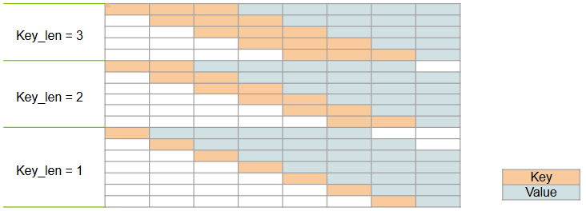
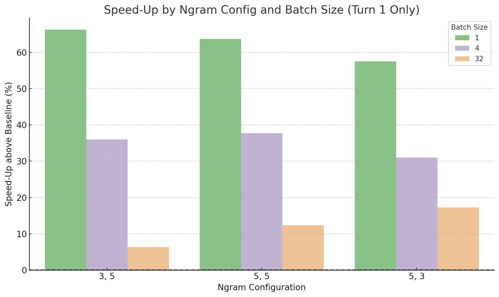
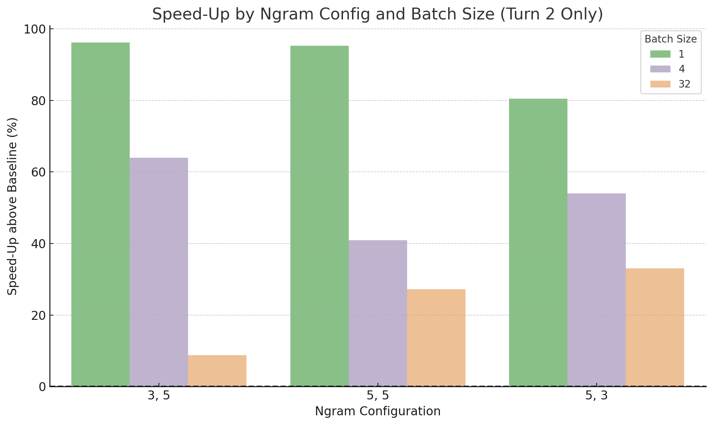

# N-Gram Speculative Decoding in TensorRT‑LLM
N-Gram speculative decoding leverages the natural repetition in many LLM workloads. It splits previously seen text into configurable (key, value) n‑gram pairs and, during generation, swiftly proposes draft tokens by matching the current key against n-gram pools in memory.

In this blog, we introduce TensorRT‑LLM’s new N-Gram speculative decoding algorithm, highlight its performance gains, and explain the auto‑enablement heuristic that activates it when it delivers the most benefit.

## Highlights
* **Fast & lightweight.** N‑Gram algorithm runs on the host with low overhead.
* **Real speed‑ups at low concurrency.** N-Gram achieves accepted length of 1.37 and more on average running on the Magpie-Align/Magpie-Llama-3.1-Pro-MT-300K-Filtered dataset ([link](https://huggingface.co/datasets/Magpie-Align/Magpie-Llama-3.1-Pro-MT-300K-Filtered/viewer/default/train)) with the first round of conversation. Results in 10-60% E2E runtime speed-up.
* **Works even better with multi-turn conversations.** With the cache built up during the first round of conversation, the second round achieved a higher accepted length of 1.66 and a 30–90 % E2E runtime speed-up.
* **Excels on tasks with natural repetition like translation.** With the translation dataset, the accepted length can exceed 4.0. New requests can benefit from cache generated by previous requests with similar tasks and reduce latency by up to 70%.
* **Heuristic “just works”.** Set `spec_decode_algo=AUTO` to enable N‑Gram by default when `concurrency ≤ 32`; with the following heuristic
  * Batch size 1‑4: N-Gram configuration with `k=3, v=5`.
  * Batch size 5‑32: N-Gram configuration with `k=5, v=3`.
  * Batch size > 32: disable N-Gram.
  * This policy adds ≈15% overhead to iteration latency yet still nets double‑digit end‑to‑end speed‑ups.

---

## Table of Contents
- [Background & Motivation](#background--motivation)
- [Algorithm & Complexity](#algorithm--complexity)
- [Performance Study](#experimental-setup)
    - [Experimental Setup](#experimental-setup)
    - [Case 1 with Conversation Dataset ](#case-1-with-conversation-dataset)
        - [Speed-up for the First Turn](#speed-up-for-the-first-turn)
        - [Effect of Multi-turn conversation](#effect-of-multi-turn-conversation)
    - [Case 2 with Translation Dataset](#case-2-with-translation-dataset)
        - [Warm‑Cache Experiments](#warmcache-experiments)
- [Auto‑Enablement with Heuristic](#autoenablement-with-heuristic)
- [Feature Gaps & Future Work](#featuregaps--future-work)

---


## Background & Motivation
Speculative decoding drafts several tokens, verifies them on the model, and keeps the accepted prefix. An N‑Gram proposer can generate drafts without extra model computation for draft models, making it low-cost for low‑latency serving. Average accepted length (AL) is ~1.3 in generic chat (MT‑Bench, Magpie with the first round of conversation) and can exceed 4.0 on highly repetitive data like the translation workload.

---


## Algorithm & Complexity
`NGramDecodingConfig` in TensorRT-LLM:
```python
spec_config = NGramDecodingConfig(
    max_draft_len = v ,             # max length of draft tokens
    max_matching_ngram_size  = k ,  # max length for keys
    is_keep_all   = True,           # Whether to keep all candidate pattern-matches pairs, only one match is kept for each pattern if False.
    is_use_oldest = True,           # Whether to provide the oldest match when pattern is hit, the newest one is provided if False.
    is_public_pool= True,           # Whether to use a common pool for all requests, or the pool is private for each request if False.
)
```
* **Processing New Request** ‑ scan input sequence once to create N-Gram key-value pairs for the new sequence.

    With *max_matching_ngram_size = 3, max_draft_len = 5, input_sequence_len=8*, Figure 1 shows the 18 new key-value pairs added to the cache pool.

    The number of cache pairs grows proportionally to the product of the maximum key length and the input sequence length.

<div align="center">
  <figure>
    
  </figure>
</div>
<p align="center"><sub><em>Figure 1. Request initial scan</em></sub></p>

* **Per‑token update** ‑ slide window and update cache pool

    We now have a new token in the sequence. Figure 2 shows how the cache pool is updated accordingly. For existing key-value pairs whose value length is less than the `max_draft_len`, the new token can be appended. The new token can be the value to new keys as well, which are marked as new pairs in the graph.

    The number of cache update and addition is approximately the product of `max_draft_len` and `max_matching_ngram_size`, which is a constant for fixed parameters.

<div align="center">
  <figure>
    
  </figure>
</div>
<p align="center"><sub><em>Figure 2. Per-token update</em></sub></p>

* **Lookup** ‑ construct the last k tokens as the key and propose draft tokens as its value.

    If `is_public_pool= True`, a global pool is shared by all the requests. If `is_public_pool= False`, each request will have its own cache pool.

    The lookup time is amortized constant time, but extra latency can be observed once the dictionary outgrows the CPU’s fastest cache.

* **Verification** ‑ Verify proposed draft tokens.

    Run the target model with `verification_batch =  original_batch × (v+1)`; There will always be at least one new token from verification even if no draft token is correct. In this case, the accepted length (AL) will be `1`. In addition, if `w` out of the `v` draft tokens are accepted, the accepted length (AL) will be `w+1`.

    The iteration latency grows as the verification batch becomes larger than the original batch. As we increase `max_draft_len (v)`, the overhead grows even more. Therefore, speculative decoding tends to work best with small batch sizes and low concurrency.

---

## Performance Study

### Experimental Setup
* **Hardware:** 8 × B200 GPUs (Blackwell)
* **Model:** Llama‑4‑Scout‑17B‑16E, FP8 weights
* **Tensor Parallel:** 8

---

### Case 1 with Conversation Dataset

In this experiment, we used Magpie-Align/Magpie-Llama-3.1-Pro-MT-300K-Filtered dataset ([link](https://huggingface.co/datasets/Magpie-Align/Magpie-Llama-3.1-Pro-MT-300K-Filtered/viewer/default/train)) which is a conversational dataset with two turns. The user question on the second turn is related to the previous question and answer.

The first turn only data represents a general conversation with no context. The repetition comes from the conversational structure and correlation between the question and answers.

On the second turn, the global cache already has the knowledge of the previous conversation. The additional repetitions comes from the correlation between the second answer and previous conversation.

#### Speed-up for the First Turn
For batch size of 1, 4 and 32, we config the max_batch_size of the model accordingly. We will run `20 * batch_size` number of requests with the model and compare the E2E runtime with and without N-Gram speculative decoding.

<div align="center">
  <figure>
    
  </figure>
</div>
<p align="center"><sub><em>Figure 3. First Turn Speed-up</em></sub></p>

We can see that N-Gram can provide speed-ups for batch sizes up to 32 and works best with a single batch. The main overhead with larger batch sizes is the verification cost. With batch size being 1 and 4, `k = 3, v = 5` is the best N-Gram configuration. With batch size = 32, `k = 5, v = 3` is the best configuration since the verification batch size is smaller and the overhead is less.


#### Effect of Multi-turn conversation
The table below shows the accepted length (AL) derived from 3000 sampled conversations using different N-Gram configurations.
| k | v | AL Turn1 | AL Turn2 |
|---|---|-------|-------|
| 3 | 5 | 1.37 | 1.66 |
| 5 | 5 | 1.40 | 1.77 |
| 5 | 3 | 1.37 | 1.66 |

Among the proposed draft tokens, Figure 4 shows the distribution of accepted draft token length with `k=3, v=5`. Note that `Accepted‑length (AL) = accepted draft token length + 1`.

<div align="center">
  <figure>
    
  </figure>
</div>
<p align="center"><sub><em>Figure 4. Accepted draft token length distribution</em></sub></p>

In Figure 5, for each iteration, we plot the average of accepted length (AL) for each request. Transparency is calculated according to the number of requests scheduled on that iteration and normalized by the max capacity among all iterations. If fewer requests are scheduled, the dot is more transparent.

<div align="center">
  <figure>
    
  </figure>
</div>
<p align="center"><sub><em>Figure 5. AL over iteration</em></sub></p>

Figure 6 shows the speed-up with N-Gram speculative decoding for the second turn of conversation only.
Ngram with `k = 3, v = 5` delivers 96.13% of speed-up with single batch and 63.99% of speed-up with batch size 4. With batch size 32 and NGram `k = 5, v = 3`, the speed up is 33.06%.
<div align="center">
  <figure>
    
  </figure>
</div>
<p align="center"><sub><em>Figure 6. Second Turn Speed-up</em></sub></p>

We can draw the conclusion that:

**N-Gram speculative decoding improves the runtime of conversational workloads, especially when the conversation has multiple rounds.**

---


### Case 2 with Translation Dataset
From the conversational dataset, we learned that N-Gram takes advantage of structural repetition. In the second case study, we unleash the potential of N-Gram by testing it with a translation dataset that exhibits natural repetition in both context and language. The dataset has a single turn, with prompts in English asking for translations into other languages.

The table below shows the accepted length (AL) measured with 4000 requests. AL grows with increasing `max_draft_len (v)` and the trend extends beyond `max_draft_len (v) = 23` in our measurements.

|              | 1    | 2    | 3    | 4    | 5    | 6    | 7    | 8    | 9    | 10   | 11   | 12   | 13   |14   |
|--------------|------|------|------|------|------|------|------|------|------|------|------|------|------|------|
| k  | 3    | 5    | 3    | 5    | 3    | 5    | 3    | 5    | 3    | 5    | 5    | 5    | 5    | 5    |
| v  | 7    | 7    | 9    | 9    | 11   | 11   | 13   | 13   | 15   | 15   | 17   | 19   | 21   | 23   |
| AL | 3.44 | 3.62 | 3.708| 3.925| 3.878| 4.092| 4.079| 4.214| 4.198| 4.36 | 4.43 | 4.55 | 4.59 | 4.73 |


Figure 7 shows properties of accepted tokens among the drafts with N-Gram configured with k = 5, v = 7. Note that `accepted tokens = accepted length (AL) - 1` as it does not include the one good token from verification.

From the pie chart on the left, among the seven draft tokens proposed by N-Gram, roughly one-third of the cases accept none of the drafts, while another one-third accept all of them. Compared with the similar pie chart in Case 1 Figure 4, the ratio is very high. The graph on the right plots the accepted tokens among the drafts at each iteration with five random requests.

<div align="center">
  <figure>
    
  </figure>
</div>
<p align="center"><sub><em>Figure 7. Accepted Tokens from Drafts</em></sub></p>


####  Warm‑Cache Experiments
We have seen great performance from N-Gram speculative decoding. Can we push the limits even further by constructing a common warm cache before starting? In this section, we present an experiment with warm caches.


We ran 20 requests from the translation dataset and set the model concurrency to a single batch. A cold cache means the cache pool starts empty, whereas a warm cache is initialized from other datasets or requests.

<div align="center">
  <figure>
    
  </figure>
</div>
<p align="center"><sub><em>Figure 8. Warm Cache Study</em></sub></p>

Figure 8 shows the Accepted length (AL) by N-Gram configuration and cache conditions. Warm cache with magpie initialize the cache pool using the Magpie-Align/Magpie-Llama-3.1-Pro-MT-300K-Filtered dataset ([link](https://huggingface.co/datasets/Magpie-Align/Magpie-Llama-3.1-Pro-MT-300K-Filtered/viewer/default/train)). Warm cache with translation dataset builds the cache pool with 4k requests from the translation dataset other than the 20 requests used for benchmarking.

Comparing the accepted length (AL) between the cold cache and the warm cache initialized with Magpie, we see little improvement from the warm cache. Note that warm cache increases the size of the cache pool and thus the lookup overhead. The gain does not outweigh the overhead and therefore does not provide a benefit.

When comparing the accepted length (AL) between the cold cache and the warm cache built with the translation dataset, the improvement is significant! The warm cache from other requests running similar tasks benefits new requests. The natural repetition in context and language can deliver around a 77 % latency speed-up.

**In conclusion, the benefit of warm cache highly depends on context similarity.**

---


##  Auto‑Enablement with Heuristic
To take advantage of the strong performance of the N-Gram speculative decoding algorithm, we propose a simple batch-aware policy that keeps iteration overhead under control and yields ~15 % end-to-end speed-up at low to mid concurrency.

  * Batch size 1‑4: N-Gram configuration with `k=3, v=5`.
  * Batch size 5‑32: N-Gram configuration with `k=5, v=3`.
  * Batch size > 32: disable N-Gram.

How to enable the heuristic?

Example with quickstart_advanced.py
```python
python3 quickstart_advanced.py --model_dir $MODEL_DIR \
    --spec_decode_algo AUTO
```

Example with LLM speculative_config parameter
```python
LLM(model = ...,
    backend='pytorch',
    speculative_config = AutoDecodingConfig(),
    ...)
```
---

## Feature Gaps
* N-Gram is not compatible with overlap scheduler. `disable_overlap_scheduler=True` is required to enable N-Gram speculative decoding.
* The drafter will always pad the draft token length to `max_draft_len` even if the meaningful draft length is smaller. This forced padding behavior adds wasteful computation in verification.
