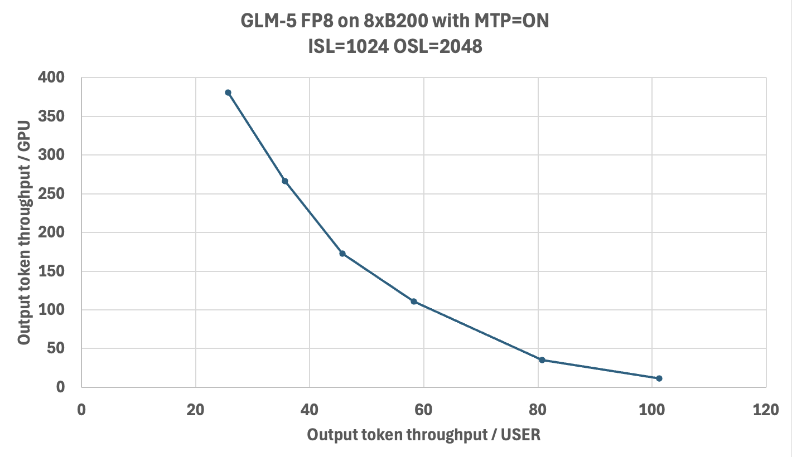

# Deployment Guide for GLM-5 on TensorRT LLM - Blackwell Hardware

## Introduction

This deployment guide provides step-by-step instructions for running the GLM-5 model using TensorRT LLM with FP8 and NVFP4 quantization, optimized for NVIDIA Blackwell GPUs. It covers the complete setup required; from accessing model weights and preparing the software environment to configuring TensorRT LLM parameters, launching the server, and validating inference output.

GLM-5 uses Multi-Latent Attention (MLA) with DeepSeek Sparse Attention (DSA). It shares the same architecture as DeepSeek V3.2 and reuses the `DeepseekV32ForCausalLM` code path in TensorRT LLM. GLM-5 natively supports Multi-Token Prediction (MTP) for speculative decoding.

The guide is intended for developers and practitioners seeking high-throughput or low-latency inference using NVIDIA's accelerated stack.

## Prerequisites

* GPU: 8x NVIDIA B200 (SM100)
* OS: Linux
* Drivers: CUDA Driver 575 or later
* Docker with NVIDIA Container Toolkit installed
* Minimum TensorRT LLM version: 1.3.0rc8

## Models

The following checkpoints are available:

* FP8 model: [zai-org/GLM-5-FP8](https://huggingface.co/zai-org/GLM-5-FP8) — Official FP8 checkpoint
* BF16 model: [zai-org/GLM-5](https://huggingface.co/zai-org/GLM-5) — Official BF16 checkpoint
* NVFP4 model: [warnold-nv/GLM-5-nvfp4-v1](https://huggingface.co/warnold-nv/GLM-5-nvfp4-v1) — Unofficial NVFP4 checkpoint for experimentation only. *Quantized with ModelOpt by Will Arnold.*

```bash
git lfs install
git clone https://huggingface.co/zai-org/GLM-5-FP8 /models/GLM-5-FP8
```

## MoE Backend Support Matrix

There are multiple MoE backends inside TensorRT LLM. Here is the support matrix for GLM-5:

| Device | Checkpoint | Supported moe_backend |
|--------|-----------|----------------------|
| B200/GB200 | FP8 | DEEPGEMM |
| B200/GB200 | NVFP4 | TRTLLM |

The default MoE backend is `CUTLASS`. For GLM-5, you must set `moe_config.backend` explicitly as shown in the configurations below.

## Deployment Steps

### Run Docker Container

Run the Docker container using the TensorRT LLM NVIDIA NGC image.

```bash
docker run --rm -it \
    --ipc=host \
    --gpus all \
    -p 8000:8000 \
    -v /path/to/your/models:/models \
    --name tensorrt_llm \
    nvcr.io/nvidia/tensorrt-llm/release:1.3.0rc8 \
    /bin/bash
```

Note:

* You can mount additional directories using the `-v <host_path>:<container_path>` flag, such as mounting the downloaded weight paths.
* The command maps port `8000` from the container to your host so you can access the LLM API endpoint from your host.
* See <https://catalog.ngc.nvidia.com/orgs/nvidia/teams/tensorrt-llm/containers/release/tags> for all available containers. Containers published in the main branch weekly have an `rcN` suffix, while the monthly release with QA tests has no `rcN` suffix. Use the `rc` release to get the latest model and feature support.

If you want to use the latest main branch, you can build from source: [https://nvidia.github.io/TensorRT-LLM/latest/installation/build-from-source-linux.html](https://nvidia.github.io/TensorRT-LLM/latest/installation/build-from-source-linux.html)

> **All commands below should be run inside the Docker container.**

---

### Recommended Performance Settings

**Treat these as a starting point and tune the parameters for your workload.**

#### B200 FP8 Config

```bash
cat > /tmp/config.yml <<EOF
custom_tokenizer: glm_moe_dsa
cuda_graph_config:
  enable_padding: true
  max_batch_size: 128
enable_attention_dp: false
enable_chunked_prefill: true
kv_cache_config:
  enable_block_reuse: false
  free_gpu_memory_fraction: 0.75
  dtype: fp8
stream_interval: 10
moe_config:
  backend: DEEPGEMM
EOF
```

#### B200 FP8 Config with MTP

GLM-5 natively supports Multi-Token Prediction (MTP), which enables speculative decoding by predicting multiple tokens per step. MTP can significantly improve output token throughput, especially for generation-heavy workloads. To enable it, add the `speculative_config` section:

```bash
cat > /tmp/config.yml <<EOF
custom_tokenizer: glm_moe_dsa
cuda_graph_config:
  enable_padding: true
  max_batch_size: 128
enable_attention_dp: false
enable_chunked_prefill: true
kv_cache_config:
  enable_block_reuse: false
  free_gpu_memory_fraction: 0.75
  dtype: auto
speculative_config:
  decoding_type: MTP
  num_nextn_predict_layers: 1
stream_interval: 10
moe_config:
  backend: DEEPGEMM
EOF
```

#### B200 NVFP4 Config

To run with NVFP4, use the same configuration as the FP8 config above with two changes: point to the NVFP4 model checkpoint and set `moe_config.backend` to `TRTLLM` (DEEPGEMM does not support NVFP4):

```yaml
moe_config:
  backend: TRTLLM
```

> **Note:** MTP is not currently supported with the NVFP4 checkpoint.

### Launch the TensorRT LLM Server

Below is an example command to launch the TensorRT LLM server with GLM-5 from within the container.

```bash
trtllm-serve \
  /models/GLM-5-FP8 \
  --host 0.0.0.0 \
  --port 8000 \
  --max_batch_size 128 \
  --max_num_tokens 8192 \
  --tp_size 8 \
  --ep_size 8 \
  --pp_size 1 \
  --config /tmp/config.yml
```

> [!WARNING]
> If you encounter OOM errors, try one or more of the following:
> - Lower `kv_cache_config.free_gpu_memory_fraction` (e.g., `0.6`).
> - Reduce `--max_num_tokens` to `3072` for max-throughput configs.
> - Reduce `--max_batch_size` and `cuda_graph_config.max_batch_size` to `32` or `16` for min-latency configs.

### LLM API Options (YAML Configuration)

These options provide control over TensorRT LLM's behavior and are set within the YAML file passed to the `trtllm-serve` command via the `--config` argument.

#### `custom_tokenizer`

* **Description:** Specifies a custom tokenizer to use. GLM-5 requires the `glm_moe_dsa` tokenizer.

#### `kv_cache_config`

* **Description**: Configuration for the Key-Value (KV) cache.
* **Options**:
  * `enable_block_reuse`: Enables KV cache block reuse across requests with shared prefixes.
  * `free_gpu_memory_fraction`: A value between `0.0` and `1.0` that specifies the fraction of free GPU memory to reserve for the KV cache after the model is loaded.
    **Recommendation:** If you experience OOM errors, try reducing this value to `0.7` or lower.
  * `dtype`: Sets the data type for the KV cache. **Default**: `"auto"`.

#### `cuda_graph_config`

* **Description**: Configuration for CUDA graphs to optimize performance.
* **Options**:
  * `enable_padding`: If `true`, input batches are padded to the nearest CUDA graph batch size. This can significantly improve performance. **Default**: `false`
  * `max_batch_size`: Sets the maximum batch size for which a CUDA graph will be created. **Recommendation**: Set this to match the `--max_batch_size` command-line option.

#### `moe_config`

* **Description**: Configuration for Mixture-of-Experts (MoE).
* **Options**:
  * `backend`: The backend to use for MoE operations. Must be `DEEPGEMM` for FP8 on B200 or `TRTLLM` for NVFP4 on B200. **Default**: `CUTLASS`

#### `speculative_config`

* **Description**: Configuration for speculative decoding with MTP.
* **Options**:
  * `decoding_type`: Set to `MTP` to enable Multi-Token Prediction.
  * `num_nextn_predict_layers`: Number of MTP prediction layers to use (GLM-5 supports `1`).

#### `enable_chunked_prefill`

* **Description**: Enables chunked prefill to overlap prefill and generation, improving throughput for mixed batches. **Default**: `false`

See the [`TorchLlmArgs` class](https://nvidia.github.io/TensorRT-LLM/llm-api/reference.html#tensorrt_llm.llmapi.TorchLlmArgs) for the full list of options which can be used in the YAML configuration file.

## Testing API Endpoint

### Health Check

Start a new terminal on the host to test the TensorRT LLM server you just launched. You can query the health/readiness of the server using:

```bash
curl -s -o /dev/null -w "Status: %{http_code}\n" "http://localhost:8000/health"
```

When `Status: 200` is returned, the server is ready for queries. Note that the very first query may take longer due to initialization and compilation.

### Basic Test

After the TensorRT LLM server is set up and shows *Application startup complete*, you can send requests to the server.

```bash
curl http://localhost:8000/v1/completions \
  -H "Content-Type: application/json" \
  -d '{
      "model": "zai-org/GLM-5-FP8",
      "prompt": "What is the capital of France?",
      "max_tokens": 16,
      "temperature": 0
  }'
```

Example response:

```json
{
  "id": "cmpl-...",
  "object": "text_completion",
  "model": "zai-org/GLM-5-FP8",
  "choices": [
    {
      "index": 0,
      "text": "The capital of France is Paris. Paris is the largest city",
      "finish_reason": "length"
    }
  ],
  "usage": {
    "prompt_tokens": 8,
    "total_tokens": 24,
    "completion_tokens": 16
  }
}
```

### Troubleshooting Tips

* **CUDA OOM errors:** Try reducing `--max_batch_size`, `--max_num_tokens`, or `kv_cache_config.free_gpu_memory_fraction`.
  * As a workaround for memory fragmentation, you can set `PYTORCH_ALLOC_CONF=max_split_size_mb:8192`. For more details, refer to the [PyTorch documentation on optimizing memory usage](https://docs.pytorch.org/docs/stable/notes/cuda.html#optimizing-memory-usage-with-pytorch-cuda-alloc-conf).
* **Checkpoint compatibility:** Ensure your model checkpoints are compatible with the expected format.
* **GPU utilization:** For performance issues, check GPU utilization with `nvidia-smi` while the server is running.
* **Container startup:** If the container fails to start, verify that the NVIDIA Container Toolkit is properly installed.
* **Port conflicts:** Make sure the server port (`8000` in this guide) is not being used by another application.
* **Configuration files:** Ensure that YAML config files are correctly formatted to avoid runtime errors.
* **Architecture:** GLM-5 reuses the DeepSeek V3.2 attention implementation (`DeepseekV32Attention`), which includes a built-in DSA indexer that routes context attention through absorption mode. The DSA parameters (`index_n_heads`, `index_head_dim`, `index_topk`) are read automatically from the model config.

## Benchmarking Performance

To benchmark the performance of your TensorRT LLM server, you can use the built-in `benchmark_serving.py` script. First, create a wrapper `bench.sh` script:

```bash
cat << 'EOF' > bench.sh
concurrency_list="32 64 128 256 512 1024 2048 4096"
multi_round=5
isl=1024
osl=1024
result_dir=/tmp/glm5_output

for concurrency in ${concurrency_list}; do
    num_prompts=$((concurrency * multi_round))
    python -m tensorrt_llm.serve.scripts.benchmark_serving \
        --model zai-org/GLM-5-FP8 \
        --backend openai \
        --dataset-name "random" \
        --random-input-len ${isl} \
        --random-output-len ${osl} \
        --random-prefix-len 0 \
        --random-ids \
        --num-prompts ${num_prompts} \
        --max-concurrency ${concurrency} \
        --ignore-eos \
        --tokenize-on-client \
        --percentile-metrics "ttft,tpot,itl,e2el"
done
EOF
chmod +x bench.sh
```

To save results to files, add these options to each benchmark command:

```bash
--save-result \
--result-dir "${result_dir}" \
--result-filename "concurrency_${concurrency}.json"
```

For more benchmarking options see [benchmark_serving.py](https://github.com/NVIDIA/TensorRT-LLM/blob/main/tensorrt_llm/serve/scripts/benchmark_serving.py).

Run `bench.sh` to begin a serving benchmark. This will take a long time if you run all the concurrencies.

```bash
./bench.sh
```

Sample TensorRT LLM serving benchmark output. Your results may vary due to ongoing software optimizations.

```
============ Serving Benchmark Result ============
Successful requests:                      16
Benchmark duration (s):                   17.66
Total input tokens:                       16384
Total generated tokens:                   16384
Request throughput (req/s):               [result]
Output token throughput (tok/s):          [result]
Total Token throughput (tok/s):           [result]
User throughput (tok/s):                  [result]
---------------Time to First Token----------------
Mean TTFT (ms):                           [result]
Median TTFT (ms):                         [result]
P99 TTFT (ms):                            [result]
-----Time per Output Token (excl. 1st token)------
Mean TPOT (ms):                           [result]
Median TPOT (ms):                         [result]
P99 TPOT (ms):                            [result]
---------------Inter-token Latency----------------
Mean ITL (ms):                            [result]
Median ITL (ms):                          [result]
P99 ITL (ms):                             [result]
----------------End-to-end Latency----------------
Mean E2EL (ms):                           [result]
Median E2EL (ms):                         [result]
P99 E2EL (ms):                            [result]
==================================================
```

### Key Metrics

#### Time to First Token (TTFT)
The typical time elapsed from when a request is sent until the first output token is generated.

#### Time Per Output Token (TPOT) and Inter-Token Latency (ITL)
* TPOT is the typical time required to generate each token *after* the first one.
* ITL is the typical time delay between the completion of one token and the completion of the next.
* Both TPOT and ITL ignore TTFT.

For a single request, ITLs are the time intervals between tokens, while TPOT is the average of those intervals:

$$
\text{TPOT (1 request)} = \text{Avg(ITL)} = \frac{\text{E2E latency} - \text{TTFT}}{\text{Num Output Tokens} - 1}
$$

Across different requests, **average TPOT** is the mean of each request's TPOT (all requests weighted equally), while **average ITL** is token-weighted (all tokens weighted equally):

$$
\text{Avg TPOT (N requests)} = \frac{\text{TPOT}_1 + \text{TPOT}_2 + \cdots + \text{TPOT}_N}{N}
$$

$$
\text{Avg ITL (N requests)} = \frac{\text{Sum of all ITLs across requests}}{\text{Num Output Tokens across requests}}
$$

#### End-to-End (E2E) Latency
The typical total time from when a request is submitted until the final token of the response is received.

#### Total Token Throughput
The combined rate at which the system processes both input (prompt) tokens and output (generated) tokens.

$$
\text{Total TPS} = \frac{\text{Num Input Tokens}+\text{Num Output Tokens}}{T_{last} - T_{first}}
$$

#### Tokens Per Second (TPS) or Output Token Throughput
How many output tokens the system generates each second.

$$
\text{TPS} = \frac{\text{Num Output Tokens}}{T_{last} - T_{first}}
$$

## Performance

The chart below shows the Pareto frontier of output-token throughput per GPU versus per-user latency on 8x B200 with GLM-5-FP8 and MTP enabled. Benchmarks were run using AI-Perf as the client against TRT-LLM v1.2.0rc4 (`cc45119`).


