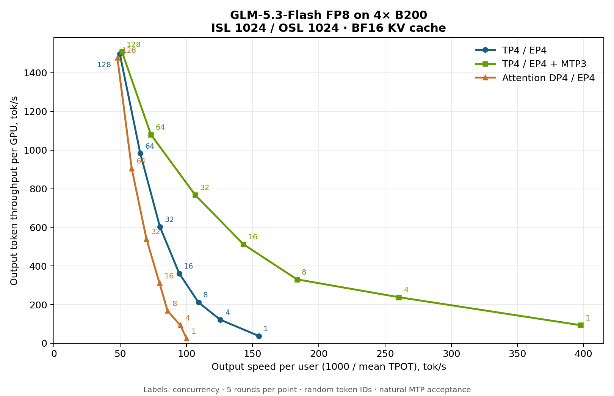

# Deployment Guide for GLM-5.3-Flash on TensorRT LLM - Blackwell Hardware

## Introduction

This guide describes how to deploy GLM-5.3-Flash with the TensorRT LLM PyTorch backend and the official FP8 checkpoint on NVIDIA Blackwell GPUs.

GLM-5.3-Flash is a 320B-parameter mixture-of-experts model with 18B active parameters. It combines KDA linear attention with sparse Multi-Latent Attention and is served through `Glm5NextForConditionalGeneration`. The model supports text, image, and video inputs, as well as Multi-Token Prediction (MTP) for speculative decoding.

### Validated Features

The following features have been tested on B200 with four GPUs per worker. Disaggregated serving uses separate context and generation workers:

* CUDA Graph
* Overlap scheduler
* Chunked prefill
* Multi-Token Prediction (MTP)
* Attention data parallelism, including MTP (see [`enable_attention_dp`](#enable_attention_dp))
* FP8 KV cache
* Disaggregated serving
* Disaggregated serving with MTP
* KV cache block reuse (with periodic Mamba state snapshots, see [`kv_cache_config`](#kv_cache_config))
* Image and video inputs (see [Multimodal Inputs](#multimodal-inputs))
* Automatic tool calling and JSON structured output (see [Tool Calling and Structured Output](#tool-calling-and-structured-output))

### Limitations

* KV cache block reuse requires a periodic Mamba snapshot policy; see [`kv_cache_config`](#kv_cache_config).

See the [Model-Feature Support Matrix](../models/supported-models.md#model-feature-support-matrix-key-models) for the current support status.

## Prerequisites

* GPU: 4x NVIDIA B200 (SM100) for aggregated serving; 8x B200 for disaggregated serving.
* OS: Linux
* Drivers: CUDA Driver 575 or later
* Docker with NVIDIA Container Toolkit installed
* Minimum TensorRT LLM version: 1.3.0rc26
* Install Transformers commit `49995e1a8c76de9158cf4f4e4995ac7454b8f141` in the GLM deployment environment for model configuration and image/video processing:

  ```bash
  pip install "git+https://github.com/huggingface/transformers.git@49995e1a8c76de9158cf4f4e4995ac7454b8f141"
  ```
* Install `fla-core` and `einops` in the container: `pip install fla-core einops`.

## Models

* FP8 model: [zai-org/GLM-5.3-Flash](https://huggingface.co/zai-org/GLM-5.3-Flash)

Download the checkpoint to the model directory mounted into the container:

```bash
git lfs install
git clone https://huggingface.co/zai-org/GLM-5.3-Flash /models/GLM-5.3-Flash
```

## MoE Backend Support Matrix

There are multiple MoE backends inside TensorRT LLM. Here is the support matrix for GLM-5.3-Flash:

| Device | Checkpoint | Supported moe_backend |
|--------|-----------|----------------------|
| B200/GB200 | FP8 | TRTLLM, DEEPGEMM |

On B200, the default `moe_config.backend` (`AUTO`) selects `TRTLLM` for this checkpoint. `DEEPGEMM` is also supported.

## Deployment Steps

### Run Docker Container

Run the Docker container using the TensorRT LLM NVIDIA NGC image.

```bash
docker run --rm -it \
    --ipc=host \
    --gpus all \
    -p 8000:8000 \
    -v /path/to/your/models:/models \
    --name tensorrt_llm \
    nvcr.io/nvidia/tensorrt-llm/release:1.3.0rc26 \
    /bin/bash
```

Note:

* You can mount additional directories using the `-v <host_path>:<container_path>` flag, such as mounting the downloaded weight paths.
* The command maps port `8000` from the container to your host so you can access the LLM API endpoint from your host.
* See <https://catalog.ngc.nvidia.com/orgs/nvidia/teams/tensorrt-llm/containers/release/tags> for all available containers. Containers published in the main branch weekly have an `rcN` suffix, while the monthly release with QA tests has no `rcN` suffix. Use the `rc` release to get the latest model and feature support.

If you want to use the latest main branch, you can build from source: [https://nvidia.github.io/TensorRT-LLM/latest/installation/build-from-source.html](https://nvidia.github.io/TensorRT-LLM/latest/installation/build-from-source.html)

> **All commands below should be run inside the Docker container.**

### Recommended Performance Settings

Use these configurations as starting points for 4x B200 with FP8 weights and a BF16 KV cache. Tune the batch size and token budget for your workload; the [Performance](#performance) section lists the settings used for the measured curve.

#### B200 FP8 Config

```bash
cat > /tmp/config.yml <<EOF
cuda_graph_config:
  enable_padding: true
  max_batch_size: 64
enable_attention_dp: false
enable_chunked_prefill: true
kv_cache_config:
  enable_block_reuse: false
  free_gpu_memory_fraction: 0.5
EOF
```

#### B200 FP8 Config with MTP

MTP predicts multiple tokens per decoding step. Set `max_draft_len` to choose the number of draft tokens (`1` to `5`); the following configuration uses `3`.

```bash
cat > /tmp/config.yml <<EOF
cuda_graph_config:
  enable_padding: true
  max_batch_size: 64
enable_attention_dp: false
enable_chunked_prefill: true
kv_cache_config:
  enable_block_reuse: false
  free_gpu_memory_fraction: 0.5
speculative_config:
  decoding_type: MTP
  max_draft_len: 3
EOF
```

#### B200 FP8 Config with Attention Data Parallelism

Attention data parallelism distributes requests across ranks while keeping the routed experts expert-parallel. Set `enable_attention_dp: true` and reduce `--max_num_tokens` to `4096` in the launch command below. To enable MTP as well, add the `speculative_config` section from the MTP example above.

```bash
cat > /tmp/config.yml <<EOF
cuda_graph_config:
  enable_padding: true
  max_batch_size: 64
enable_attention_dp: true
enable_chunked_prefill: true
kv_cache_config:
  enable_block_reuse: false
  free_gpu_memory_fraction: 0.5
EOF
```

To use FP8 KV cache with any of these aggregated-serving configurations, add `dtype: fp8` under `kv_cache_config`. This halves latent KV storage; indexer and KDA state precision are unchanged. Selected KV rows are dequantized in bounded query chunks before attention. For large prefills, repeated staging and attention calls can increase time to first token and reduce prefill throughput, in addition to decode overhead. Use BF16 KV when prioritizing latency or prefill throughput. `dtype: auto` inherits the checkpoint's KV-cache quantization metadata, so BF16 also requires that metadata not to enable FP8 KV quantization. The performance curves below use BF16 KV cache.

### Launch the TensorRT LLM Server

Below is an example command to launch the TensorRT LLM server with GLM-5.3-Flash from within the container.

```bash
trtllm-serve \
  /models/GLM-5.3-Flash \
  --served_model_name zai-org/GLM-5.3-Flash \
  --host 0.0.0.0 \
  --port 8000 \
  --max_batch_size 64 \
  --max_num_tokens 16384 \
  --max_seq_len 16384 \
  --tp_size 4 \
  --ep_size 4 \
  --pp_size 1 \
  --config /tmp/config.yml
```

### Disaggregated Serving

Disaggregated serving runs prefill and decode on separate workers and supports MTP. GLM-5.3-Flash requires the Python NIXL transceiver. Add the following configuration to both context and generation workers:

```yaml
cache_transceiver_config:
  backend: NIXL
  transceiver_runtime: PYTHON
```

Reuse the [FP8 or FP8-with-MTP configuration](#recommended-performance-settings), with matching `speculative_config` settings on both workers when using MTP. Set `disable_overlap_scheduler: true` and `cuda_graph_config: null` on the context worker.

On an 8-GPU node, use GPUs 0–3 for the context worker and GPUs 4–7 for the generation worker, each with `--tp_size 4 --ep_size 4`.

The orchestrator is launched with a disaggregated config that lists the context and generation worker URLs:

```bash
trtllm-serve disaggregated -c disagg_config.yaml
```

```yaml
hostname: localhost
port: 8000
context_servers:
  num_instances: 1
  urls:
    - "localhost:8001"
generation_servers:
  num_instances: 1
  urls:
    - "localhost:8002"
```

Clients send requests to the orchestrator at `localhost:8000`. For worker launch commands and multi-node deployment, see the [Disaggregated Serving guide](../features/disagg-serving.md).

### LLM API Options (YAML Configuration)

These options provide control over TensorRT LLM's behavior and are set within the YAML file passed to the `trtllm-serve` command via the `--config` argument.

#### `kv_cache_config`

* **Description**: Configuration for the KV cache and recurrent-state pools.
* **Options**:
  * `enable_block_reuse`: Enables prefix reuse. Requires `mamba_state_config.periodic_snapshot_interval` (for example `256`); without this policy, reuse is disabled.
  * `free_gpu_memory_fraction`: Fraction of free GPU memory reserved for caches after loading the model. **Recommendation**: `0.5`; reduce it if you encounter OOM errors.
  * `dtype`: Attention KV-cache data type. **Default**: `auto`, which follows the checkpoint's KV-cache quantization metadata. Set to `fp8` to reduce latent KV storage; this also works with MTP and attention data parallelism.

#### `cuda_graph_config`

* **Description**: Configuration for CUDA graphs to optimize performance.
* **Options**:
  * `enable_padding`: If `true`, input batches are padded to the nearest CUDA graph batch size. This can significantly improve performance. **Default**: `false`
  * `max_batch_size`: Sets the maximum batch size for which a CUDA graph will be created. **Recommendation**: Set this to match the `--max_batch_size` command-line option.

#### `moe_config`

* **Description**: Configuration for Mixture-of-Experts (MoE).
* **Options**:
  * `backend`: The backend to use for MoE operations. Use `AUTO` (resolves to `TRTLLM`) or `DEEPGEMM` on B200.

#### `speculative_config`

* **Description**: Configuration for speculative decoding with MTP.
* **Options**:
  * `decoding_type`: Set to `MTP` to enable Multi-Token Prediction.
  * `max_draft_len`: Number of draft tokens proposed per step (`1` to `5`). The example uses `3`.

#### `enable_chunked_prefill`

* **Description**: Enables chunked prefill to overlap prefill and generation, improving throughput for mixed batches. **Default**: `false`. **Recommendation**: `true` for prompts of several thousand tokens.

#### `enable_attention_dp`

* **Description**: Enables attention data parallelism with expert-parallel MoE. **Default**: `false`. When enabled, use `--max_num_tokens 4096` for the configuration above. MTP can be enabled with the same `speculative_config` as tensor parallelism.

See the [`TorchLlmArgs` class](https://nvidia.github.io/TensorRT-LLM/llm-api/reference.html#tensorrt_llm.llmapi.TorchLlmArgs) for the full list of options which can be used in the YAML configuration file.

## Testing API Endpoint

### Health Check

Start a new terminal on the host to test the TensorRT LLM server you just launched. You can query the health/readiness of the server using:

```bash
curl -s -o /dev/null -w "Status: %{http_code}\n" "http://localhost:8000/health"
```

When `Status: 200` is returned, the server is ready for queries. Note that the very first query may take longer due to initialization and compilation.

### Basic Test

After the TensorRT LLM server is set up and shows *Application startup complete*, you can send requests to the server.

```bash
curl http://localhost:8000/v1/completions \
  -H "Content-Type: application/json" \
  -d '{
      "model": "zai-org/GLM-5.3-Flash",
      "prompt": "The capital of France is",
      "max_tokens": 16,
      "temperature": 0
  }'
```

Example response:

```json
{
  "id": "cmpl-...",
  "object": "text_completion",
  "model": "zai-org/GLM-5.3-Flash",
  "choices": [
    {
      "index": 0,
      "text": " Paris. In French, Paris is spelled the same way but pronounced \"pa-",
      "finish_reason": "length"
    }
  ],
  "usage": {
    "prompt_tokens": 5,
    "total_tokens": 21,
    "completion_tokens": 16
  }
}
```

For `/v1/chat/completions`, pass reasoning controls through `chat_template_kwargs`, for example `{"reasoning_effort": "low", "clear_thinking": true}`. `reasoning_effort` accepts `low`, `high`, or `max` (default); `clear_thinking` controls whether earlier reasoning is retained. Thinking is always enabled, and `enable_thinking` is not supported.

### Multimodal Inputs

Send images and videos to `/v1/chat/completions` using the OpenAI-compatible `image_url` and `video_url` content types. Video decoding requires `opencv-python-headless` in the container.

### Tool Calling and Structured Output

For tool calling, add `--tool_parser glm47 --reasoning_parser deepseek-r1` to the server command and use `tool_choice: "auto"` (streaming/non-streaming and MTP all supported). Limitations: `tool_choice: "required"` and named-function choice are not supported, and `parallel_tool_calls` should be omitted (the model can still return multiple tool calls under `auto`).

### Long Context

The checkpoint supports a total sequence length of 1,048,576 tokens. Set `--max_seq_len 1048576` and keep chunked prefill enabled; input + output must fit within this limit. On 4×B200 (TP4/EP4, BF16 KV), a validated config is `--max_batch_size 16`, `--max_num_tokens 8192`, CUDA graph batch limit 16, and `kv_cache_config.free_gpu_memory_fraction: 0.6`. This was smoke-tested up to the exact limit (≈1.04M-token multi-needle retrieval and a full 1,048,576-token run) — validating execution and basic retrieval, not comprehensive long-context quality.

### Troubleshooting Tips

* **CUDA OOM errors:** Reduce `--max_batch_size`, `--max_num_tokens`, or `kv_cache_config.free_gpu_memory_fraction`. Keep `cuda_graph_config.max_batch_size` consistent with the server batch limit.
* **Configuration or processor errors:** Check that the Transformers revision in [Prerequisites](#prerequisites) is installed in the serving environment.
* **Block reuse disabled:** Configure the periodic snapshot policy described in [`kv_cache_config`](#kv_cache_config).

## Benchmarking Performance

To benchmark the performance of your TensorRT LLM server, you can use the built-in `benchmark_serving.py` script. First, create a wrapper `bench.sh` script:

```bash
cat << 'EOF' > bench.sh
concurrency_list="1 4 8 16 32 64 128"
multi_round=5
isl=1024
osl=1024
result_dir=/tmp/glm53_flash_output

for concurrency in ${concurrency_list}; do
    num_prompts=$((concurrency * multi_round))
    python -m tensorrt_llm.serve.scripts.benchmark_serving \
        --model zai-org/GLM-5.3-Flash \
        --backend openai \
        --dataset-name "random" \
        --random-input-len ${isl} \
        --random-output-len ${osl} \
        --random-prefix-len 0 \
        --random-ids \
        --num-prompts ${num_prompts} \
        --max-concurrency ${concurrency} \
        --ignore-eos \
        --tokenize-on-client \
        --seed 0 \
        --percentile-metrics "ttft,tpot,itl,e2el"
done
EOF
chmod +x bench.sh
```

To save results to files, add these options to each benchmark command:

```bash
--save-result \
--result-dir "${result_dir}" \
--result-filename "concurrency_${concurrency}.json"
```

For more benchmarking options see [benchmark_serving.py](https://github.com/NVIDIA/TensorRT-LLM/blob/main/tensorrt_llm/serve/scripts/benchmark_serving.py).

Run `bench.sh` to begin a serving benchmark. This will take a long time if you run all the concurrencies.

```bash
./bench.sh
```

Sample TensorRT LLM serving benchmark output. Your results may vary due to ongoing software optimizations.

```
============ Serving Benchmark Result ============
Successful requests:                      40
Benchmark duration (s):                   [result]
Total input tokens:                       40960
Total generated tokens:                   40960
Request throughput (req/s):               [result]
Output token throughput (tok/s):          [result]
Total Token throughput (tok/s):           [result]
User throughput (tok/s):                  [result]
---------------Time to First Token----------------
Mean TTFT (ms):                           [result]
Median TTFT (ms):                         [result]
P99 TTFT (ms):                            [result]
-----Time per Output Token (excl. 1st token)------
Mean TPOT (ms):                           [result]
Median TPOT (ms):                         [result]
P99 TPOT (ms):                            [result]
---------------Inter-token Latency----------------
Mean ITL (ms):                            [result]
Median ITL (ms):                          [result]
P99 ITL (ms):                             [result]
----------------End-to-end Latency----------------
Mean E2EL (ms):                           [result]
Median E2EL (ms):                         [result]
P99 E2EL (ms):                            [result]
==================================================
```

### Key Metrics

#### Time to First Token (TTFT)

The typical time elapsed from when a request is sent until the first output token is generated.

#### Time Per Output Token (TPOT) and Inter-Token Latency (ITL)

* TPOT is the typical time required to generate each token *after* the first one.
* ITL is the typical time delay between the completion of one token and the completion of the next.
* Both TPOT and ITL ignore TTFT. With MTP, tokens can arrive in groups, so streaming ITL depends on how tokens are delivered; use TPOT for per-token decode comparisons.

For a single request, ITLs are the time intervals between tokens, while TPOT is the average of those intervals:

$$
\text{TPOT (1 request)} = \text{Avg(ITL)} = \frac{\text{E2E latency} - \text{TTFT}}{\text{Num Output Tokens} - 1}
$$

Across requests, **average TPOT** weights each request equally, while **average ITL** averages the recorded inter-token intervals:

$$
\text{Avg TPOT (N requests)} = \frac{\text{TPOT}_1 + \text{TPOT}_2 + \cdots + \text{TPOT}_N}{N}
$$

$$
\text{Avg ITL (N requests)} = \frac{\text{Sum of all ITLs across requests}}{\text{Num measured inter-token intervals}}
$$

#### End-to-End (E2E) Latency

The typical total time from when a request is submitted until the final token of the response is received.

#### Total Token Throughput

The combined rate at which the system processes both input (prompt) tokens and output (generated) tokens.

$$
\text{Total TPS} = \frac{\text{Num Input Tokens}+\text{Num Output Tokens}}{T_{last} - T_{first}}
$$

#### Tokens Per Second (TPS) or Output Token Throughput

How many output tokens the system generates each second.

$$
\text{TPS} = \frac{\text{Num Output Tokens}}{T_{last} - T_{first}}
$$

## Performance

The chart compares TP4 / EP4 and attention DP4 / EP4, each with and without MTP3, on 4x B200 with FP8 weights and a BF16 KV cache. Measurements use the `benchmark_serving` client above, ISL 1024 / OSL 1024, random token IDs, seed 0, and greedy decoding. Each run sends `5 * concurrency` requests. Points combine all matching runs; faint dots show individual runs and bars show their minimum and maximum, not confidence intervals.

To reproduce the curve, use the serving configurations above with `--max_batch_size 128`, `--max_seq_len 8192`, and `cuda_graph_config.max_batch_size: 128`. Keep CUDA graph padding, chunked prefill, and the overlap scheduler enabled; use a cache memory fraction of 0.5 and disable block reuse. Set `--max_num_tokens 16384` for TP4 / EP4 or `4096` for attention DP4 / EP4, with or without MTP3.

The horizontal axis is `1000 / mean_tpot_ms`, excluding TTFT. The vertical axis is aggregate output-token throughput divided by four GPUs, excluding input-token throughput. For repeated runs, throughput is total output tokens divided by total measured duration, and mean TPOT is weighted by request count.



With TP4 / EP4, MTP3 improves single-user decode speed from approximately 153 to 372 tok/s/user. At concurrency 128, the four configurations deliver approximately 5.9K–6.3K output tok/s in aggregate. Attention DP4 / EP4 was also repeated in ascending and descending concurrency order; earlier TTFT spikes at concurrency 8 and 32 did not consistently recur, and all matching samples remain included. MTP uses natural acceptance; random-token workloads can have different acceptance rates from real conversations. This sweep covers the plotted concurrency range, not peak throughput or maximum-context validation.
