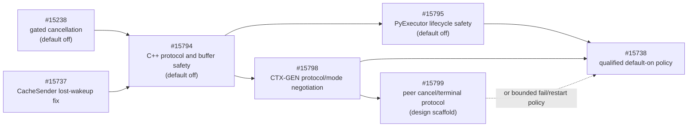

<!--
SPDX-FileCopyrightText: Copyright (c) 2026 NVIDIA CORPORATION & AFFILIATES. All rights reserved.
SPDX-License-Identifier: Apache-2.0
-->

# Disaggregated Peer Cancellation and Terminal Protocol

|  |  |
| --- | --- |
| **Status as of** | 2026-06-30 |
| **Status** | Design scaffold; this draft implements no runtime behavior |
| **JIRA** | TRTLLM-12721 |
| **Scope** | C++ transceiver; `CacheTransceiver` NIXL backend over NIXL-UCX; preallocated buffer; positive transfer timeout; overlap enabled; PP=1; CP=1; attention-DP off; layerwise and zero-copy off |
| **Prerequisite** | #15798: CTX-GEN protocol and effective-mode negotiation |
| **Dependent rollout** | #15738: qualified default-on policy |
| **Default behavior** | Unchanged; cancellation remains default-off in this PR |
| **Unsupported/unqualified paths** | Python transceiver, direct UCX, MPI, Mooncake, NIXL-libfabric, non-preallocated transfer, nonpositive timeout, overlap disabled, PP>1, CP>1, attention-DP, layerwise, zero-copy, and unqualified EP/topology combinations |

## Purpose

#15798 provides a fixed v1 descriptor, effective-mode and local-profile checks, per-view highest-common-version
selection, and pre-DMA protocol rejection. This phase defines the next layer: generation-safe transfer identity,
asynchronous peer cancellation, terminal acknowledgement, and bounded retirement of cancellation metadata. Phase B2
extends #15798's per-view result into one topology-wide cancellation-control version, capability set, and serialization
ABI selection.

CTX and GEN do not synchronously vote on each cancellation. Either endpoint may initiate cancellation. Local
participants still reach a rank-consistent outcome, and cancellation-related physical resource reuse waits for a
terminal result that is safe for every expected peer. The ordinary, uncontended success path keeps its existing
authoritative local-completion cleanup and does not wait for a terminal-control exchange.

This draft intentionally adds no live cancellation messages. In particular, it does not claim that a cancelled NIXL
transfer is quiescent and does not return a possibly written buffer to the reusable pool.

## Safety invariants

1. Request ID alone never identifies a transfer.
2. A transfer attempt is valid only in the process epochs that created it.
3. Only an exact active-registry match may authorize `ready=true` or DMA.
4. Cancellation is idempotent and may be initiated by either endpoint.
5. An endpoint may report `LOCAL_NOT_STARTED` only when its rank-pair did not cross the ready/DMA commit boundary;
   topology-wide `NOT_STARTED` requires matching evidence from both endpoints of every expected rank-pair and every
   participating local rank.
6. A source reports `LOCAL_SOURCE_COMPLETE` only after backend source access ended. A destination reports
   `LOCAL_DESTINATION_COMPLETE` only after transfer completion and destination postprocessing. Topology-wide
   `COMPLETED` requires both reports for every expected rank-pair and agreement on every local rank.
7. Missing, conflicting, stale, malformed, or otherwise unproven state becomes `UNKNOWN`.
8. A timeout, cache expiry, message receipt, or backend-handle release is never by itself proof that memory is reusable.
9. No cancellation-related result other than topology-wide `NOT_STARTED` permits early release of source/send or
   destination/receive leases reserved for the attempt.
10. `UNKNOWN` makes the logical attempt unsafe, quarantines each still-owned and unproven local lease, and follows the
    bounded fail/restart policy. It never retroactively mutates a lease generation already released after authoritative
    local completion.
11. Cancellation-related early cleanup and logical request completion occur only after rank-consistent aggregation.
    Physical endpoint-local resources may follow the existing success fast path immediately after authoritative local
    completion; bounded evidence is retained for a later cancellation race.
12. A delayed message cannot affect a newer attempt that reused the same request ID.
13. A control receipt acknowledges exact bytes only. It is neither quiescence evidence nor a topology-wide decision.
14. Network input never directly names memory to release. Cleanup resolves an exact active lease generation from the
    registry and runs through one cleanup-once token.
15. A rank-local timeout or transport callback records cancellation intent only. It does not call a cancellation
    primitive, complete a promise, or release a lease before the topology-specific local-rank decision.
16. Completion evidence is attempt-bundle-wide: every KV, KV-indexer, RNN, registration, status handle, and required
    postprocessing step covered by the parent lease must be terminal. One completed component never releases a partial
    parent lease or certifies the edge.

## Transfer identity

### Process epoch

#15798 advertises a nonzero process-session token for every registered NIXL agent. This token is the endpoint's
`instance_epoch` and changes whenever that process or registered agent restarts.

An epoch is an identity discriminator, not a timestamp. It must not be reused by a replacement process.

### Context ticket

CTX creates a context ticket before publishing `ContextPhaseParams`:

```text
ContextTicket {
    uint64 ctx_request_id;      // full-width ID; never packed or truncated
    uint64 ctx_instance_epoch;  // nonzero logical CTX publication epoch
    uint64 ctx_attempt;         // nonzero, unique in that publication epoch
    Direction direction;        // initially CTX_TO_GEN
}
```

`ctx_instance_epoch` is generated by the authoritative CTX rank for the logical CTX publication session; it is distinct
from the per-rank agent epochs advertised by #15798. `ctx_attempt` is generated once per exported context result.
Reusing a request ID or restarting the CTX publication session creates a new ticket.

The same logical ticket must be visible on every participating CTX rank. The implementation must generate it at one
authoritative rank and distribute it at an existing rank-lockstep point, or provide an equivalent proof that every rank
derives the same value.

### Full transfer key and topology identity

GEN creates one nonzero `gen_attempt` when it begins one logical consumption of a context result. A control transport
retransmission to the same endpoint reuses that attempt; it does not create another protocol identity. An application
retry that can select another worker or allocate different destination buffers is a new logical attempt. It is permitted
only after proving the previous attempt never opened or after obtaining a new context result and `ContextTicket`.
Version 1 does not authorize sequential rebinding of one ticket after an unresolved attempt.

Each rank-pair transfer is identified by:

```text
TransferKey {
    uint64 ctx_request_id;
    uint64 ctx_instance_epoch;
    uint64 ctx_attempt;
    uint64 gen_attempt;
    Direction direction;

    uint32 source_rank;
    uint32 destination_rank;
    uint64 source_instance_epoch;
    uint64 destination_instance_epoch;
    byte expected_topology_digest[32];
}
```

The full `ContextTicket`, including `ctx_instance_epoch`, is embedded in every key and control payload. The source and
destination epochs come from #15798's peer descriptors. `source_rank` and `destination_rank` are zero-based indices in
the ordered source and destination `CommState` agent-state vectors used for this transfer. They are not assumed to be
MPI world ranks, TP ranks, or interchangeable with another communicator's indices.

`expected_topology_digest` is SHA-256 over the following padding-free, network-order canonical bytes:

```text
bytes domain[8]="TRTLTOP1" | u16 topology_schema_version=1 | u8 direction | u16 selected_control_version |
u64 selected_capabilities | u64 serialization_abi_id |
u32 source_count | repeated(source_count, u32 agent_name_length | bytes agent_name | u64 instance_epoch) |
u32 destination_count | repeated(destination_count, u32 agent_name_length | bytes agent_name | u64 instance_epoch) |
u32 edge_count | repeated(edge_count, u32 source_rank | u32 destination_rank)
```

Agent lists retain their `CommState` order; edges are sorted lexicographically and duplicates are invalid. Names are the
exact NIXL agent-identity bytes, not locale-normalized text. Counts and name lengths use the same topology/message bounds
as decoding. Every rank derives the same digest at a lockstep point. The digest freezes the exact participant set for the
attempt; world size is never substituted for the topology-specific set. The outer NIXL notification sender, embedded
agent identity, rank indices, instance epochs, and digest must all agree before connection, buffer, ready, or DMA state
changes.

Golden digest fixtures cover asymmetric source/destination counts, multiple edges, and identical numeric rank indices
under different ordered agent namespaces.

No field may be compressed into request-ID high bits. Counters must fail closed before wraparound.

## Active-context registry

CTX owns an active-context registry keyed by `ContextTicket`. It is the authorization source for new transfer work. GEN
owns a corresponding local attempt registry keyed by `(ContextTicket, gen_attempt)`; the services do not share memory or
registry ownership. On each endpoint, the parent entry owns binding and topology aggregation, and each expected
rank-pair has a child entry keyed by its exact `TransferKey`. The following shape is logical and exists independently at
both endpoints, with role-specific local leases and evidence.

An entry contains at least:

```text
ContextEntry {
    ContextTicket ticket;
    ContextState state;
    optional<GenBinding> binding;
    ParentLease parent_lease; // CTX publication lease until bind; then role-specific attempt lease
    ExpectedPeerSet expected_peers;
    map<TransferKey, TransferEdgeEntry> edges;
    optional<TerminalDisposition> topology_terminal;
    monotonic_time created_at;
    monotonic_time updated_at;
}

TransferEdgeEntry {
    TransferKey key;
    EdgeState state;
    ImmutableBufferBinding buffers;
    EndpointLeaseClaim local_claim;
    optional<EndpointTerminalEvidence> local_evidence;
    optional<EndpointTerminalEvidence> remote_evidence;
    DedupeWindow dedupe;
    optional<CanonicalTerminalMessage> terminal_message;
    optional<TerminalReceipt> terminal_receipt;
}
```

`GenBinding` contains one logical generation attempt plus the destination rank/epoch information needed to construct
every expected rank-pair key. It is installed atomically and never replaced by a conflicting attempt. Per-edge state is
required because one logical transfer can fan out to multiple peers and observe partial progress.

State is partitioned by owner; one mixed enum must not be shared accidentally across parent and edge records. The
diagrams below are normative. An implementation may split them further but must preserve at least these distinctions:

```text
CTX parent: PUBLISHED, BOUND, REDUCING, SUCCESS_COMPLETE,
            TERMINAL_NOT_STARTED, TERMINAL_COMPLETED, TERMINAL_UNKNOWN, RETIRED
CTX edge: BOUND, READY_PREPARED, CANCEL_PENDING, READY_DECIDED, IN_FLIGHT,
          EVIDENCE_NOT_STARTED, EVIDENCE_SOURCE_COMPLETE, EVIDENCE_UNKNOWN, RETIRED
GEN parent: CONTEXT_IMPORTED, ADMISSION_PREPARED, ADMISSION_DECIDED, OPEN_PUBLISHING, OPEN_SENT,
            CANCEL_PENDING, CANCEL_SENT,
            IN_FLIGHT, REDUCING, UNINSTALLED_UNKNOWN, SUCCESS_COMPLETE, LOCAL_CANCELLED,
            TERMINAL_NOT_STARTED, TERMINAL_COMPLETED, TERMINAL_UNKNOWN, RETIRED
GEN edge: OPEN_SENT, CANCEL_SENT, READY_ACCEPTED, IN_FLIGHT,
          EVIDENCE_NOT_STARTED, EVIDENCE_DESTINATION_COMPLETE, EVIDENCE_UNKNOWN, RETIRED
```

Required behavior:

- Create `PUBLISHED` before the context result becomes externally visible.
- Accept a new generation open/request only when its context ticket exactly matches a `PUBLISHED` entry. An exact
  duplicate after binding returns the cached decision without allocating or submitting again.
- An authenticated but incompatible `OPEN` proposal consumes the ticket: CTX removes authorization, commits
  `TERMINAL_UNKNOWN`, quarantines its still-owned publication lease, caches the exact negative READY keyed by the
  proposal key/fingerprint, and enters bounded fail/restart. A duplicate receives the byte-equivalent rejection; a
  different `gen_attempt` can never rebind that ticket.
- Bind one generation attempt atomically. A conflicting attempt or endpoint epoch produces `UNKNOWN`; it never replaces
  the existing binding. A retransmission reuses the exact `gen_attempt`, key, payload, and message ID.
- Install the topology-wide `READY_DECIDED` state on every participating local rank before sending or making
  `ready=true` visible.
- Remove transfer authorization when entering any terminal state.
- Retain only bounded terminal metadata for duplicate replies and diagnostics.
- Treat an absent or retired ticket as unauthorized. An exact no-peer terminal-cache hit may reproduce
  `READY=NOT_READY + LOCAL_NOT_STARTED`; every miss or mismatch receives `READY=NOT_READY + LOCAL_UNKNOWN`. Neither
  case recreates an active entry or authorizes DMA.

This default-deny rule is what makes bounded tombstone retirement safe: evicting diagnostic terminal metadata can
reduce a late peer's answer from `NOT_STARTED` to `UNKNOWN`, but can never reopen DMA.

### Resource leases and ABA protection

CTX creates a `ContextPublicationLease` before publishing a context result. On successful bind, it atomically transfers
that ownership into a parent `TransferAttemptLease`; GEN creates its parent attempt lease before advertising destination
memory. Together the CTX and GEN attempt halves form the logical request-level `TransferLease`. A parent local half
owns, as applicable:

- the pinned request object;
- KV, KV-indexer, and RNN send/receive `BufferIndexHolder` resources;
- dynamic and zero-copy registrations used by a future supported cell;
- backend status handles and their connection, agent, and plugin lifetimes;
- immutable buffer bindings; and
- one cleanup-once token shared by every completion, cancellation, timeout, and teardown path.

A no-peer CTX publication owns its source request and KV resources through the publication lease before the context
result becomes visible. Physical holders shared by multiple peer connections are owned once by the parent attempt, with
one cleanup token. Child edge entries hold non-owning segment claims and evidence; they cannot independently free a
shared holder. Resources are never partially released from a request lease because one edge or buffer kind appeared
idle.

Every pool-backed binding records `(pool_id, slot_id, slot_generation, buffer_kind)`. Slot generation increments before
a freed slot is leased again. A handler may release or quarantine memory only after resolving the exact active
`TransferKey` and matching all recorded lease generations. A terminal-cache entry contains evidence and fingerprints;
it never owns memory and cannot release a slot. Minimum slot states are `FREE`, `LEASED`,
`QUARANTINED_PENDING_RESTART`, and `PERMANENTLY_QUARANTINED`.

`UNKNOWN` atomically removes every still-owned, unproven local lease generation from reusable capacity and marks the
worker unhealthy. A slot already released after authoritative local completion remains released; cached evidence and
generation matching prevent a late topology outcome from touching its newer occupant. The logical attempt still becomes
`UNKNOWN` and triggers restart. The executor that owns the transceiver must stop admission, reject or settle outstanding
work, preserve all quarantined allocations, and request process exit within a configured
`unknown_restart_deadline`; failure to exit gracefully escalates to forced termination.
The deployment supervisor owns restart. This is the bounded fail/restart policy, not an optional logging action.

Shutdown order is: stop admission; freeze new bindings; settle cancellation/terminal evidence for a bounded interval;
permanently isolate unresolved leases; join response and tracker workers; deregister memory while backing storage still
exists; and destroy the NIXL agent/plugin last. No destructor may silently return a quarantined slot to its pool.

Response and background status workers may validate input, record immutable backend evidence, and wake the executor.
They do not release resources, fulfill user promises, run a collective, or invoke cancellation primitives. The executor
applies rank-consistent state transitions and cleanup at its ordered lockstep point.

### Active-registry bounds

The active registry and terminal cache have different capacity rules:

- Reaching the active-entry limit applies admission backpressure. CTX must fail or defer publication before exposing a
  new context result; it must not evict an authorized active entry to make room.
- A `PUBLISHED`, `BOUND`, or `READY_PREPARED` entry that expires before topology-wide ready commit is cancelled through
  the normal rank-consensus path and may become `NOT_STARTED` only with complete local evidence.
- A `READY_DECIDED` or `IN_FLIGHT` entry that exceeds its deadline becomes `UNKNOWN`; each endpoint quarantines its
  still-owned, unproven local lease generations and the fail/restart policy runs.
- Capacity and TTL never silently remove active authorization. Only an explicit terminal transition removes it.
- Terminal duplicate-response metadata may use bounded age/capacity eviction only after its mandatory control lifetime
  (or no-peer publication validity) expires. Capacity pressure before that point applies admission backpressure; it does
  not evict an in-contract response. A later miss remains default-denied and returns `UNKNOWN`.

## Control protocol

Phase B2 extends #15798's descriptor and compatibility result with a distinct
`PEER_CANCELLATION_CONTROL` capability, a `serialization_abi_id`, and a selected control version. ABI ID 1 means the
version-1 carrier and legacy payload frozen below on a 64-bit little-endian host. Every participating local rank
contributes its own range/capabilities/ABI plus the descriptors for every remote edge it can reach, including an empty
edge list. One topology-wide reduction first computes `global_min=max(all min_version)`,
`global_max=min(all max_version)`, and
`global_capabilities=bitwise_and(all capabilities)` across every local and remote endpoint in the frozen topology. The
topology rejects if the range is empty or the required control bit is absent; otherwise every rank selects
`global_max`. All ABI IDs must be identical. Selection is never performed independently over rank-local peer subsets.
Every participant installs the same capability set, selected version, ABI, peer epochs, and topology digest at an
existing ordered lockstep point.

The capability value is `uint64(1) << 2`. #15798 already owns bit 0 for in-flight cancellation and bit 1 for pre-DMA
protocol rejection. Its v1 descriptor is a fixed five-field envelope and must not be extended in place. B2 therefore
uses a new descriptor-schema marker with one required ABI field:

```text
__trtllm_protocol_v2_<min_version>_<max_version>_<capabilities_hex>_<mode>_<session_token_hex>_<serialization_abi_id_hex>__trtllm_protocol_end
```

A #15798 v1 parser treats the v2 marker as no descriptor and never advertises bit 2, so it cannot receive the active
carrier. A B2 parser may accept the fixed v1 descriptor only for baseline compatibility; active control requires a valid
six-field v2 descriptor, bit 2, and a nonzero ABI ID. ABI ID 1 is encoded as hexadecimal `1`; future incompatible native
schemas allocate a new nonzero ID and control version rather than changing either descriptor schema in place.

Fixed-peer deployments preflight every peer before accepting traffic. Dynamic CTX routing cannot know the GEN
`CommState` before the first request. In that case, `OPEN` is the sole capability-gated proposal: GEN first installs a
candidate selection across all GEN ranks using its local descriptors and the CTX descriptors carried by the context
result, then sends `OPEN` only because every target CTX agent advertises the control capability and compatible ABI. CTX
queues the proposal, recomputes and installs the exact topology-wide result across all CTX ranks, and compares the
version, ABI, epochs, and topology digest before mutating transfer/data connections, buffers, readiness, or DMA. A
mismatch returns `READY=NOT_READY` plus `LOCAL_UNKNOWN`. Establishing or looking up the NIXL control-plane connection
needed to receive `OPEN` is allowed; it does not authorize transfer state.

`OPEN`, a proposal-scoped `READY=NOT_READY + LOCAL_UNKNOWN` rejection, and an exact no-peer terminal-cache response of
`READY=NOT_READY + LOCAL_NOT_STARTED` are the only pre-install messages; they use a carrier version/ABI already proven
common by the advertised descriptors. Positive READY, CANCEL, TERMINAL, and receipt traffic requires both sides to
install the exact selection. A local GEN cancellation after `OPEN` but before READY remains pending and sends no CANCEL;
READY/timeout resolution below determines its safe outcome. An incompatible previously unseen peer fails that request
without silently falling back.

GEN tracks `peer_installation_proven` per edge. It becomes true only after validating `READY=READY` or a bound-session
`TERMINAL` carrying the exact selected version/key/digest; an `OPEN` proposal or negative READY alone does not set it.
GEN may parse a candidate-version TERMINAL to validate this proof because its own topology installed the candidate
before `OPEN`; a valid TERMINAL demonstrates that CTX installed the same selection. Outgoing CANCEL/TERMINAL is forbidden
on every edge whose proof remains false.
During a rolling upgrade, active cancellation remains disabled for a routing pool until every possible peer supports
the selected control protocol.

### Notification carrier and dispatch

Version 1 appends `ControlMessageInfo` as variant index 3 of the existing NIXL `NotificationInfo` variant; existing
variant indices 0 through 2 and their bytes remain unchanged. `ControlMessageInfo` contains one bounded
`ControlEnvelope`. It is emitted only after the descriptor precheck proves a common control carrier/ABI; full dynamic
selection may still be pending for the `OPEN` proposal and its negative rejection. An old peer never receives the new
variant. A raw `TRTLCAN1` envelope is not placed directly into the notification queue because current receive paths would
parse its first bytes as the native legacy variant index.

The exact carrier is `[legacy native-size_t variant_index=3][32-byte ControlEnvelope][payload]`. There is no generic
string/vector length between the variant index and envelope. The receiver parses directly from the length already
reported by NIXL, validates that the span contains the complete fixed header and declared payload, and only then copies
or allocates. Because the outer index and embedded `REQUEST_AND_BUFFER_INFO` remain legacy-native, peers must have a
matching `serialization_abi_id`. Control v1/ABI 1 freezes the exact field sequence, fundamental widths, and native
encoding defined here; any incompatible `RequestAndBufferInfo` schema/layout or architecture requires a new ABI ID and
selected control version.

The notification dispatcher first decodes the bounded outer variant, preserves the NIXL-reported sender identity, and
routes control messages to one serialized control handler. Request, ready, sync, and control notifications may
interleave in one queue; unrelated variants remain queued for their existing consumers. Before registry mutation, the
control handler verifies that the outer sender equals the embedded agent identity and the endpoint named by the exact
key. The outer decoder checks the notification length before reading the native variant index and requires exact
consumption for `ControlMessageInfo`; it does not call the current unchecked stream decoder on malformed input. Golden
tests freeze indices 0 through 3, and interleaving tests cover every legacy/control ordering.

All new envelope, TLV-header, transfer-key, and scalar-TLV integers use unsigned network byte order. The opaque embedded
legacy `REQUEST_AND_BUFFER_INFO` value retains its current native representation. The fixed 32-byte length-delimited
envelope is:

```text
ControlEnvelope {
    byte magic[8];          // ASCII "TRTLCAN1"
    uint16 protocol_version;
    uint16 message_type;
    uint32 flags;           // must be zero in version 1
    uint32 payload_length;  // at most 1048576 bytes
    uint32 payload_crc32c;  // CRC-32C (Castagnoli) over payload
    uint64 message_id;      // nonzero; scoped by sender epoch and key
    bytes payload;
}
```

The 1 MiB value is a protocol ceiling, not proof that the NIXL notification backend accepts that size. At admission,
the implementation computes the effective ceiling as the minimum of the protocol limit and the configured or queried
backend notification limit, including outer-variant overhead. Version 1 does not fragment control messages: a request
that cannot fit is rejected before allocation or advertisement. Silent fallback after active negotiation is forbidden.

Version 1 rejects unknown flag bits, an unknown message type, a zero message ID, a payload above the effective ceiling,
a length mismatch, trailing bytes, or a CRC mismatch before registry mutation. Message type values are fixed as `OPEN=1`,
`READY=2`, `CANCEL=3`, `TERMINAL=4`, and `TERMINAL_RECEIPT=5`. Golden byte fixtures must freeze every message type and
both endian conversion and malformed-input behavior.

Initial message types are:

| Message | Direction | Purpose |
| --- | --- | --- |
| `OPEN` | GEN to CTX | Atomically validate/bind the context ticket and carry complete request-and-buffer information |
| `READY` | CTX to GEN | Return the ready decision for the exact transfer key |
| `CANCEL` | Either | Request logical cancellation idempotently |
| `TERMINAL` | Either | Report sender-local terminal evidence for the exact rank-pair key |
| `TERMINAL_RECEIPT` | Either | Confirm the exact key, message ID, evidence, and digest received |

Control payloads use the same network-order `uint16 type`, `uint16 flags`, `uint32 length`, and value TLV header defined
for the context trailer. The version-1 types are `TRANSFER_KEY=1`, `REQUEST_AND_BUFFER_INFO=2`, `READY_DECISION=3`,
`CANCEL_REASON=4`, `LOCAL_EVIDENCE=5`, `TERMINAL_MESSAGE_ID=6`, and `PAYLOAD_SHA256=7`. Known fields may appear only
once. `TRANSFER_KEY` is always required and has this exact 89-byte, padding-free value layout:

```text
u64 ctx_request_id | u64 ctx_instance_epoch | u64 ctx_attempt | u64 gen_attempt |
u8 direction | u32 source_rank | u32 destination_rank |
u64 source_instance_epoch | u64 destination_instance_epoch | bytes expected_topology_digest[32]
```

`OPEN` additionally requires `REQUEST_AND_BUFFER_INFO`; `READY` requires `READY_DECISION`; `CANCEL` requires a 32-bit
`CANCEL_REASON`; `TERMINAL` requires a one-byte `LOCAL_EVIDENCE`; and `TERMINAL_RECEIPT` requires the original 64-bit
terminal message ID, one-byte evidence, and 32-byte SHA-256 terminal-payload digest. `READY=NOT_READY` also requires
exactly one `LOCAL_EVIDENCE`, whose value is `LOCAL_NOT_STARTED` for a bound pre-commit rejection or exact cached
no-peer terminal hit, or `LOCAL_UNKNOWN` for an unbound/proposal rejection or cache miss. `READY=READY` forbids
`LOCAL_EVIDENCE`. All new scalar TLV values use network byte order;
the opaque legacy value is the stated exception. Unknown required TLVs, duplicates, bad lengths, and missing or
forbidden message-specific fields reject before state mutation. Golden fixtures cover positive READY and both negative
evidence cases.

Version-1 enum values are fixed:

| Field | Values |
| --- | --- |
| `Direction` | `INVALID=0`, `CTX_TO_GEN=1` |
| `READY_DECISION` | `INVALID=0`, `READY=1`, `NOT_READY=2` |
| `LOCAL_EVIDENCE` | `INVALID=0`, `LOCAL_NOT_STARTED=1`, `LOCAL_SOURCE_COMPLETE=2`, `LOCAL_DESTINATION_COMPLETE=3`, `LOCAL_UNKNOWN=4` |
| `CANCEL_REASON` | `INVALID=0`, `USER=1`, `DEADLINE=2`, `SHUTDOWN=3`, `PEER_FAILURE=4`, `PROTOCOL_ERROR=5` |

Unknown required enum values reject active mode. `INVALID` is never valid on the wire.

The new envelope does not add positional fields to existing `RequestInfo`, `RequestAndBufferInfo`, or
`DataTransceiverState` serialization. Active mode uses one `OPEN` envelope containing a length-delimited copy of the
complete current `RequestAndBufferInfo`: agent name, connection address, nested `RequestInfo`, destination memory
descriptors, optional metadata, valid connection index, and buffer kinds. Carrying only `RequestInfo` is invalid because
the source needs the other fields to establish the connection and DMA destination.

Before calling any existing legacy deserializer, active mode must run a checked structural preflight (or use a new
checked bounded reader) over every nested string, optional, descriptor, vector, and scalar. Counts are bounded by the
negotiated topology and configured buffer kinds; lengths and arithmetic are checked against remaining input and the
effective message budget; no `reserve`, allocation, connection, or registry mutation occurs first; and exact byte
consumption is required. A valid envelope around an unchecked legacy blob is not considered bounded decoding.

Dispatch validates the envelope, outer sender, embedded agent/address, full key, connection index, nested request ID,
mode, and active-registry entry before the decoded request can reach any ready or DMA handler. Each endpoint separately
resolves its immutable local binding and slot generations from that registry; wire-provided bytes never directly assert
a trusted local generation. A bare legacy request can authorize work only in baseline mode. A separately reordered
sidecar is not permitted. The baseline path continues using its existing messages unchanged.

### Cancellation

`CANCEL` contains the exact `TransferKey`, a reason code, and the sender's monotonically increasing message ID.

Receiving `CANCEL`:

- is idempotent;
- never blocks on a cross-service vote;
- returns the already committed terminal result when one exists;
- contributes `LOCAL_NOT_STARTED` evidence only after the pending rank-wide ready decision proves that no participant
  committed;
- contributes `LOCAL_UNKNOWN` evidence for ambiguous post-commit work;
- may return the already committed role-specific `LOCAL_SOURCE_COMPLETE` or `LOCAL_DESTINATION_COMPLETE` evidence only
  when that local completion was already authoritative.

Cancellation is serialized with the edge state under one local lock. Once cancellation wins that lock, a late or
duplicate `READY` cannot authorize DMA. If cancellation arrives while a ready decision is being reduced, it is marked
pending until that decision resolves: a rejected decision may prove `LOCAL_NOT_STARTED`; a committed decision is
post-commit and therefore `LOCAL_UNKNOWN` unless role-specific completion was already authoritative.

The initial implementation has no `DRAINING` or `QUIESCED` terminal claim. If a rank-pair cannot prove
`LOCAL_NOT_STARTED`, it reports `LOCAL_UNKNOWN`.

### Terminal acknowledgement

`TERMINAL` carries sender-local evidence for one exact rank-pair key:

- `LOCAL_NOT_STARTED`: the sender proves that rank-pair did not cross the topology-wide ready/DMA commit boundary;
- `LOCAL_SOURCE_COMPLETE`: the source proves its backend will no longer access source/send memory;
- `LOCAL_DESTINATION_COMPLETE`: the destination proves transfer completion and destination postprocessing;
- `LOCAL_UNKNOWN`: any other state.

A rank-pair report is evidence, not a global terminal decision. Only the all-peer and local-rank reduction may commit
one of these topology-wide terminal dispositions:

| Disposition | Meaning | Resource consequence |
| --- | --- | --- |
| `NOT_STARTED` | Every expected rank-pair and participating local rank proved it did not cross ready/DMA commit | Release both source/send and destination/receive leases reserved for the unstarted attempt |
| `COMPLETED` | Every rank-pair has matching source-complete and destination-complete evidence, and every local rank agrees | Follow normal successful cleanup for both source and destination leases |
| `UNKNOWN` | Any source/destination quiescence or exact topology state is unproven | Quarantine still-owned, unproven local lease generations; poison and fail/restart; never mutate an authoritatively released generation |

`QUIESCED` is deliberately absent. It may be added only in a later PR that cites a backend contract proving no further
source or destination memory access after cancellation.

Terminal state is monotonic. Once an attempt commits `UNKNOWN`, a late success notification does not make its
quarantined source or destination memory reusable in this phase. A backend-handle `release()` alone is not
`LOCAL_SOURCE_COMPLETE` proof.

When cancellation or ambiguity makes local evidence immutable at the ordered local decision point, the executor
constructs and sends its canonical `TERMINAL` promptly on each edge with installation proof, outside the state lock,
without waiting for peer evidence. A
`CANCEL` is answered by this `TERMINAL`; there is no separate cancellation acknowledgement. This rule prevents both endpoints from waiting in
`REDUCING` for evidence that neither has published. A `TERMINAL_RECEIPT` echoes the exact key, terminal message ID,
sender-local evidence, and payload digest. It acknowledges those bytes only, never a topology disposition, and gates
only duplicate-response metadata retirement.

Uncontended success does not require this exchange. Each endpoint follows its existing authoritative successful
completion and endpoint-local cleanup, records immutable completion evidence in the bounded terminal cache, and sends a
`TERMINAL` only if a later cancellation or ambiguity requires cross-service reduction.

Physical cleanup on this fast path is local and bundle-wide: an endpoint releases its parent attempt lease only after
all local edge claims and every owned buffer kind/status/postprocessing step are authoritatively complete. Logical
request success still waits for topology-local rank agreement. If another rank later becomes `UNKNOWN`, the already
proven and released generation remains safe; only still-owned/unproven generations quarantine, while the logical
request and worker follow fail/restart.

### Topology-local intent coordination

Local admission, cancellation, and logical completion decisions follow one unconditional ordered protocol. Once per
executor decision iteration, every participant enters the same topology-scoped batched operation, including ranks with
no records. The version-1 contribution is a fixed header `(schema_version, decision_round_id, record_count)` plus
records sorted by `(ContextTicket, key_present, source_rank, destination_rank)`, using `UINT32_MAX` ranks when no key
exists. Each record contains the full available
key, intent (`ADMIT`, `CANCEL`, `COMPLETE`, or `REJECT`), effective mode/version/topology digest, and local evidence.
Empty contributions are explicit; a request never gates whether a rank enters the collective.

The internal version-1 contribution uses network order and this bounded encoding:

```text
u16 schema_version=1 | u16 flags=0 | u64 decision_round_id | u32 record_count |
repeated(record_count,
    u32 record_length |
    ContextTicket[25] | u64 proposed_gen_attempt | u8 key_present |
    optional(TransferKey[89]) | u8 intent | u8 local_evidence |
    u8 open_publication_state | u8 effective_mode | u16 selected_version | u64 selected_capabilities |
    u64 serialization_abi_id | bytes expected_topology_digest[32])
```

Intent values are `ADMIT=1`, `CANCEL=2`, `COMPLETE=3`, and `REJECT=4`; zero is invalid. Before a key exists, the
authoritative GEN participant contributes the one nonzero proposed attempt and every other participant contributes zero;
the reduction rejects multiple distinct nonzero proposals and returns the agreed attempt to all ranks. Counts, record
lengths, key presence, enum ranges, ordering, duplicates, and exact consumption are validated before applying a record.
Internal `local_evidence=0` means `NONE` and is allowed only for admission; nonzero values match the control enum.
`open_publication_state` is `UNSET=0`, `MAYBE_OBSERVABLE=1`, `ACKED=2`, or `FAILED_INDETERMINATE=3`.

The reduction applies this state-dependent precedence; implementations may not choose a different tie-breaker:

| State at decision round | Contributions | Decision |
| --- | --- | --- |
| Before every edge is `READY_DECIDED` | all `ADMIT` and identical identity/mode/topology | Continue admission/ready preparation |
| Before every edge is `READY_DECIDED` | any `CANCEL` or `REJECT` | Prevent READY; `NOT_STARTED` only if every local edge/rank proves no commit, otherwise `UNKNOWN` |
| At or after any edge is `READY_DECIDED` | any `CANCEL` or `REJECT` without prior bundle completion | `UNKNOWN` |
| Any state | bundle-wide endpoint-local completion was committed on every required local edge/rank in an earlier decision round | Preserve role-specific local completion evidence and enter peer reduction; topology `COMPLETED` still requires matching remote evidence |
| Any state | `CANCEL` races `COMPLETE` in the same round, or completion coverage/order differs by rank | `UNKNOWN` |
| Any state | conflicting identity, topology, mode, version, or unrecognized intent | `UNKNOWN` |

Thus cancellation never loses to a same-round ready/admit proposal. Local completion evidence is preserved only when
its bundle-wide evidence point is strictly earlier than the cancellation decision epoch; it does not become topology
completion without remote evidence. Tests cover same-round
`CANCEL+COMPLETE`, `CANCEL+ADMIT`, and `CANCEL+READY_PREPARED` on different ranks.

Request cancellation is parent-scoped to `(ContextTicket, gen_attempt)`. Any authenticated child-edge `CANCEL` is
promoted to one parent intent and atomically marks every sibling edge `CANCEL_PENDING`. After the local decision, the
endpoint sends CANCEL, negative READY, or TERMINAL as applicable on every expected edge. A fault that is truly confined
to one edge still makes the parent `UNKNOWN`; version 1 never lets sibling edges continue to READY/DMA after one edge is
cancelled or indeterminate.

Pre-`OPEN` local release requires `open_publication_state=UNSET` from every participant in the same decision round. If
any rank reports `MAYBE_OBSERVABLE`, `ACKED`, or `FAILED_INDETERMINATE`, the parent remains cancel-pending, waits for all
known notify outcomes, and follows installed `OPEN_SENT` cancellation or `UNKNOWN` semantics. One rank can never release
because only its local notify had not started.

The reduction returns one decision per record. Before that decision commits, no rank may send a locally initiated
`CANCEL` or `TERMINAL`, invoke a backend cancellation primitive, complete a user promise, drop the request from
scheduling, or release a cancellation-related lease. Response/status workers only authenticate and enqueue peer intent
or immutable evidence. An authenticated peer `CANCEL` is queued immediately, but the executor publishes the response
after the corresponding local decision round. The ready prepare/install protocol below uses the same ordered round
framework and participant set, rather than adding a request-gated collective.

GEN performs a pre-`OPEN` admission round before destination allocation or advertisement. That round agrees on the
`ContextTicket`, one shared `gen_attempt`, selected mode/version, expected topology and digest, and whether cancellation
is already pending. Only `ADMISSION_DECIDED` may create the parent receive lease and send `OPEN`. GEN's later aggregation
of CTX `READY` replies governs its local DMA/outcome and quarantine; it does not authorize CTX source DMA, which remains
guarded by CTX's own ready prepare/install decision.

## Endpoint state machine

```text
CTX:

ABSENT
  publish ContextTicket
    -> PUBLISHED

PUBLISHED
  matching OPEN after CTX topology-local proposal decision
    -> BOUND
  authenticated OPEN proposal rejected by CTX topology-local decision
    -> TERMINAL_UNKNOWN (remove authorization, cache READY=NOT_READY + LOCAL_UNKNOWN, fail/restart)
  local CTX cancellation
    -> topology-local decision -> TERMINAL_NOT_STARTED (cache and settle; no peer reduction)
  unbound peer CANCEL
    -> reject without mutation; READY=NOT_READY + LOCAL_UNKNOWN

BOUND
  local/peer CANCEL before ready intent is sealed
    -> CANCEL_PENDING
  topology-local cancel decision commits while still pre-ready
    -> LOCAL_NOT_STARTED -> REDUCING (publish READY=NOT_READY and TERMINAL)
  validate exact binding and prepare ready intent
    -> READY_PREPARED

READY_PREPARED
  cancel arrives while rank decision is pending
    -> CANCEL_PENDING (do not publish READY or decide evidence yet)
  rank-wide prepare/install protocol rejects
    -> LOCAL_NOT_STARTED -> REDUCING (publish READY=NOT_READY and TERMINAL)
  rank-wide prepare/install protocol commits on every participant
    -> READY_DECIDED

READY_DECIDED
  make READY=true visible, then submit/progress DMA
    -> IN_FLIGHT
  pending/new cancel, timeout, or transport uncertainty
    -> CANCEL_PENDING -> topology-local decision -> LOCAL_UNKNOWN -> REDUCING

IN_FLIGHT
  source backend access ended
    -> SUCCESS_COMPLETE (physical local cleanup; cache LOCAL_SOURCE_COMPLETE)
  cancel, timeout, failure, conflicting evidence
    -> CANCEL_PENDING -> topology-local decision -> LOCAL_UNKNOWN -> REDUCING

REDUCING
  enter with immutable evidence committed by the local decision and publish/retry TERMINAL
  all expected peer evidence plus local-rank consensus
    -> TERMINAL_NOT_STARTED | TERMINAL_COMPLETED | TERMINAL_UNKNOWN

SUCCESS_COMPLETE
  late CANCEL within retained evidence window
    -> CANCEL_PENDING -> topology-local decision -> REDUCING (publish cached LOCAL_SOURCE_COMPLETE)
  authoritative cleanup plus maximum accepted control lifetime
    -> RETIRED

TERMINAL_*
  reply idempotently to duplicate messages
  fix local disposition/cleanup, receive required receipts, and pass retention horizon
    -> RETIRED

RETIRED / ABSENT
  stale OPEN, CANCEL, or TERMINAL
    -> reject; report UNKNOWN; never reopen
```

GEN follows the corresponding states:

```text
CONTEXT_IMPORTED
  enqueue admission or local cancellation intent
    -> ADMISSION_PREPARED

ADMISSION_PREPARED
  topology-local admission decision succeeds
    -> ADMISSION_DECIDED
  topology-local cancellation/rejection decision succeeds
    -> LOCAL_CANCELLED (release unadvertised GEN resources; send no peer CANCEL)

ADMISSION_DECIDED
  create parent attempt lease, allocate destination buffers, and seal open_publish_committed
    -> OPEN_PUBLISHING
  local cancel wins before open_publish_committed
    -> topology-local decision; all participants report publication UNSET -> LOCAL_CANCELLED
  local cancel, but any participant may have published
    -> CANCEL_PENDING

OPEN_PUBLISHING
  NIXL notification publication succeeds
    -> OPEN_SENT
  NIXL notification publication succeeds with cancellation pending
    -> CANCEL_PENDING
  cancel while publication may be observable
    -> CANCEL_PENDING (wait for publication result; do not release)
  notification result is failed or indeterminate
    -> UNINSTALLED_UNKNOWN

OPEN_SENT
  local cancel wins the edge-state lock before any READY=true is accepted
    -> CANCEL_PENDING (late READY cannot authorize DMA)
  every edge returns exact cached no-peer READY=NOT_READY + LOCAL_NOT_STARTED
    -> topology-local consensus -> TERMINAL_NOT_STARTED (no TERMINAL message required)
  every installed/bound edge returns READY=NOT_READY + LOCAL_NOT_STARTED and matching TERMINAL
    -> TERMINAL_NOT_STARTED
  all expected peers READY=true, then local-rank binding/ready prepare/install succeeds
    -> IN_FLIGHT
  cancellation pending when any READY=true is accepted
    -> LOCAL_UNKNOWN -> REDUCING
  mixed, missing, conflicting, or invalid replies with any installed-edge proof
    -> LOCAL_UNKNOWN -> REDUCING (send control only on proven installed edges)
  missing/conflicting/invalid replies with no installed-edge proof
    -> UNINSTALLED_UNKNOWN

CANCEL_PENDING
  every edge returns exact cached no-peer READY=NOT_READY + LOCAL_NOT_STARTED
    -> topology-local consensus -> TERMINAL_NOT_STARTED (no TERMINAL message required)
  every installed/bound edge returns READY=NOT_READY + LOCAL_NOT_STARTED and matching TERMINAL
    -> TERMINAL_NOT_STARTED
  any READY=READY
    -> topology-local post-commit decision -> CANCEL_SENT + LOCAL_UNKNOWN -> REDUCING
  READY=NOT_READY + LOCAL_UNKNOWN, missing/conflicting response, or deadline, with any installed-edge proof
    -> LOCAL_UNKNOWN -> REDUCING (send control only on proven installed edges)
  same outcomes with no installed-edge proof
    -> UNINSTALLED_UNKNOWN

CANCEL_SENT
  retry CANCEL/TERMINAL while reducing peer evidence; exhaustion remains UNKNOWN

IN_FLIGHT
  local destination transfer and postprocessing complete
    -> SUCCESS_COMPLETE (physical local cleanup; cache LOCAL_DESTINATION_COMPLETE)
  cancel, timeout, failure, or uncertainty
    -> CANCEL_PENDING -> topology-local decision -> LOCAL_UNKNOWN -> REDUCING

REDUCING
  enter with immutable evidence committed by the local decision
  publish/retry CANCEL or TERMINAL only for edges with installation proof
  all expected peer evidence plus local-rank consensus
    -> TERMINAL_NOT_STARTED | TERMINAL_COMPLETED | TERMINAL_UNKNOWN

UNINSTALLED_UNKNOWN
  quarantine still-owned local leases, mark worker unhealthy, and begin bounded fail/restart
  send no CANCEL or TERMINAL because peer installation is unproven

SUCCESS_COMPLETE
  late CANCEL within retained evidence window
    -> CANCEL_PENDING -> topology-local decision -> REDUCING (publish cached LOCAL_DESTINATION_COMPLETE)
  authoritative cleanup plus maximum accepted control lifetime
    -> RETIRED
```

`LOCAL_CANCELLED` is an endpoint-local outcome, not a topology disposition. It cannot mutate the still-unbound CTX
publication. The service/orchestrator may cancel the CTX request independently; otherwise CTX's bounded publication
validity/expiry path performs the no-peer decision.

`open_publish_committed` is set under the attempt lock before entering the NIXL notify API and is never cleared. The
payload and parent lease already exist at that point. Cancellation before the bit is set may take the local path after
the topology decision only when every participant reports `UNSET`; cancellation at or after any rank's bit follows
`OPEN_SENT`/indeterminate semantics for the entire parent. Version 1 treats notify failure as
indeterminate and `UNKNOWN` unless the transport provides an explicit proof that no peer could observe any bytes.

### Ready-decision linearization

No rank may make `READY=true` visible or start destination DMA until every topology-specific local participant has
installed the same irreversible decision for the logical ticket, generation binding, effective mode, selected protocol
version, expected-peer set, and ready intent. The response thread records input and wakes the executor; it never enters a
collective.

The executor uses a bounded, divergence-safe two-phase protocol at its existing ordered status-poll lockstep point:

1. Under the edge-state lock, each participant either seals `READY_PREPARED` or records rejection. A participant that
   has contributed a prepared intent cannot independently roll it back; a concurrent cancellation becomes pending.
2. A topology-scoped reduction computes one prepare decision. A conflicting or rejected participant selects reject. If
   the collective returns that decision, all prepared ranks can prove no READY was published and resolve pending
   cancellation as `LOCAL_NOT_STARTED`.
3. On unanimous prepare, each participant installs `READY_DECIDED` under its state lock, then enters an ordered
   installation barrier for that decision epoch. A bounded collective failure yields `UNKNOWN` and no rank publishes
   READY.
4. Only after the installation barrier returns may a rank publish `READY=true` or authorize DMA. Cancellation pending
   at or after `READY_DECIDED` is post-commit and yields `LOCAL_UNKNOWN` unless authoritative completion already exists.

The implementation should piggyback or batch these phases with existing topology-aware status polling; it must not add
an independently ordered per-request collective in the response worker. Network, collectives, CUDA, promise completion,
and callbacks run outside registry locks. Deterministic tests inject cancellation before prepare, after prepare input,
after decision installation, after the installation barrier, and before/after READY publication.

The current blocking `allgather`/`allgatherv` status path is not a bounded primitive and cannot turn a rank that never
enters into an in-process `UNKNOWN`. B3 must make every intent/ready decision round use a nonblocking/timeout-capable
topology collective or arm a process/communicator watchdog that terminates the affected local workers by the decision
deadline. A watchdog exit is the bound; the surviving service observes changed peer epochs and follows restart
handling. Qualification injects one rank skipping admission, cancellation, ready-prepare, ready-install, and completion
rounds and proves bounded termination with no asymmetric side effect or READY publication.

## Multi-peer and local-rank reduction

First reduce the two endpoint reports for every exact rank-pair key:

```text
source LOCAL_NOT_STARTED + destination LOCAL_NOT_STARTED
    -> EDGE_NOT_STARTED
source LOCAL_SOURCE_COMPLETE + destination LOCAL_DESTINATION_COMPLETE
    -> EDGE_COMPLETED
anything else
    -> EDGE_UNKNOWN
```

"Anything else" includes:

- mixed not-started and source/destination-complete evidence;
- any explicit `LOCAL_UNKNOWN`;
- a missing reply at the bounded control deadline;
- conflicting transfer keys or process epochs;
- one peer reporting ready while another rejects;
- a semantically invalid message whose envelope, sender, and exact key were first validated; or
- a duplicate message with conflicting contents.

An invalid frame, length, or CRC has no trustworthy key and must not mutate the edge named by untrusted bytes. It is a
connection-scoped protocol fault: stop admission to that sender, mark every active binding on the authenticated sender
connection `UNKNOWN` through the local-rank decision path, and begin bounded fail/restart. A valid frame with an
authenticated sender and exact key but conflicting semantics affects only that key.

All expected edges must then agree: all `EDGE_NOT_STARTED` becomes topology-wide `NOT_STARTED`, all `EDGE_COMPLETED`
becomes topology-wide `COMPLETED`, and anything else becomes `UNKNOWN`. The peer-edge reduction and local-rank reduction
form one topology decision; neither intermediate result authorizes resource release. Release requires the same safe
disposition on every participating local rank. Any rank uncertainty makes the topology-wide result `UNKNOWN`.

The parent `ContextEntry` aggregates child `TransferEdgeEntry` results; child progress is never stored in one shared
ready bit or evidence field. Partial edge progress therefore remains representable. If an implementation cannot prove
the exact per-edge state, it must collapse the entire topology to `UNKNOWN`, not infer a common state from one edge.

## No-peer cancellation

CTX cancellation can occur before GEN consumes the context result and before CTX knows a GEN endpoint.

The required behavior is:

1. CTX finds the exact active `ContextTicket` and starts the local-rank cancellation decision.
2. If every participating CTX rank proves the ticket is still `PUBLISHED` and uncommitted, the ranks atomically remove
   transfer authorization and commit topology-wide `NOT_STARTED`.
3. A missing, bound, committed, or conflicting local rank instead commits `UNKNOWN` and triggers fail/restart.
4. CTX settles the local future without waiting for a GEN peer after the local-rank decision completes.
5. A bounded terminal cache remembers `NOT_STARTED` for an exact late ticket.
6. A late matching `OPEN` receives:
   - `READY=NOT_READY + LOCAL_NOT_STARTED` while the terminal cache entry remains;
   - `READY=NOT_READY + LOCAL_UNKNOWN` after that cache entry is evicted.
7. An active-registry miss without an exact terminal-cache hit, or any mismatched ticket, receives
   `READY=NOT_READY + LOCAL_UNKNOWN`; it can never start DMA.

No cross-service acknowledgement is possible when no peer ever exists. Memory safety therefore comes from the
active-registry allowlist and non-reusable attempt identity, not from retaining an unbounded request-ID tombstone.

Terminal-cache age or capacity eviction is allowed only because the fallback is `UNKNOWN` plus rejection. TTL expiry
never authorizes transfer or memory reuse. A stale cache miss does not quarantine or release an unrelated current slot:
the receiver has no active exact lease generation to mutate, so it rejects and reports `UNKNOWN` without changing its
health. The requester that still owns the exact unproven lease quarantines it and enters bounded restart. The receiver
restarts only when it has a matching active lease or the fault is connection-scoped corruption.

## Retry, deduplication, and reconnect

### Deduplication

- Every new control message has a nonzero `message_id`, strictly increasing within
  `(sender_instance_epoch, TransferKey)`; a byte-identical retransmission reuses its original ID.
- The receiver keeps a bounded window of `(message_id, payload_sha256, reply)` entries plus the highest accepted ID and
  current terminal reply for that scope.
- Repeated `OPEN` for the same exact key returns the same ready/terminal result and never allocates or submits twice.
- Repeated `CANCEL` returns the current terminal result.
- Repeated `TERMINAL` returns a `TERMINAL_RECEIPT` that names the exact key, terminal message ID, sender-local evidence,
  and terminal-payload digest. The receipt does not assert a topology disposition.
- The same in-window message ID with different content is a protocol violation and contributes `LOCAL_UNKNOWN`.
- An ID at or below the evicted-window floor never mutates state. A terminal scope returns its cached terminal reply; a
  nonterminal scope returns `LOCAL_UNKNOWN`. It does not claim to compare content that is no longer retained.

### Retry

- `OPEN`, `CANCEL`, and `TERMINAL` use bounded retry with backoff. A retransmission reuses the byte-identical payload,
  `message_id`, `gen_attempt`, and `TransferKey`; creating a new message ID is a new protocol message, not a retry.
- The retry deadline is no longer than the configured transfer/control deadline.
- Exhausting `OPEN` or any cancellation/ambiguity exchange contributes `LOCAL_UNKNOWN` and therefore commits
  topology-wide `UNKNOWN`; it never assumes cancellation succeeded. Ordinary successful completion does not start a
  terminal exchange and is not made unavailable by loss of the control channel.
- Promise completion and resource release must not depend on an unbounded control retry loop.
- The OpenAI client's regenerated `disagg_request_id` is worker-request identity only. In active mode,
  `ContextPhaseParams.req_id` remains the original `ctx_request_id`. A blind generation-only `_post_with_retry` may
  select a different worker or buffer binding and therefore cannot rebind the old ticket. It must either prove that the
  first attempt never reached `OPEN` and reuse the exact binding, or rerun context to obtain a new ticket. The current
  retry path needs an end-to-end guard and test before active mode is supported.

### Reconnect and restart

- Reconnection with unchanged process epochs may replay an idempotent message.
- A changed source or destination epoch invalidates every old `TransferKey`.
- In-flight work is not resumed across a process-epoch change.
- The surviving endpoint detects the epoch change, transitions every active binding to the old peer epoch to `UNKNOWN`,
  quarantines its exact local leases, stops admission, and enters bounded fail/restart. A stale message never creates a
  new entry.
- A replacement process starts with an empty active registry, rejects old keys, and does not attempt to contribute
  evidence for state it never owned. Recovery requires a new context result and new attempts.
- State reconstruction across process restart is out of scope.

## Serialization constraints

### Context ticket trailer

The context ticket crosses the service boundary in the existing length-delimited `ContextPhaseParams.opaque_state`.
The legacy `DataTransceiverState` bytes remain an exact prefix:

```text
[legacy DataTransceiverState bytes]
[versioned TLV payload]
[fixed trailer footer]
```

All trailer integers use unsigned network byte order. The fixed 20-byte footer is:

```text
TrailerFooter {
    byte magic[8];          // ASCII "TRTLCTX1"
    uint16 schema_version;  // 1
    uint16 flags;           // must be zero in version 1
    uint32 payload_length;  // at most 4096 bytes
    uint32 payload_crc32c;  // CRC-32C (Castagnoli) over TLV payload
}
```

Each payload field uses an 8-byte TLV header: network-order `uint16 type`, `uint16 flags`, and `uint32 length`, followed
by exactly `length` bytes. TLV flag bit 0 means required; all other version-1 bits are zero. Version-1 type IDs are
`CTX_REQUEST_ID=1`, `CTX_INSTANCE_EPOCH=2`, `CTX_ATTEMPT=3`, `DIRECTION=4`, `REQUIRED_CAPABILITIES=5`, and
`SERIALIZATION_ABI_ID=6`; each appears exactly once and is required. Integer values are network-order 64-bit values,
except `DIRECTION`, which is a one-byte enum. Schema version 1 requires ABI ID 1. Duplicate known fields, unknown
required fields, bad scalar lengths, nonzero reserved bits, trailing payload bytes, or a CRC mismatch reject active mode
before registry mutation. Unknown optional TLVs are skipped.

The payload contains bounded TLVs for:

- full `ctx_request_id`;
- `ctx_instance_epoch`;
- `ctx_attempt`;
- direction;
- required protocol capability bits; and
- serialization ABI ID.

Rules:

- The footer is located from the end of the opaque byte vector.
- An active `opaque_state` is at most 16 MiB in total, including the legacy prefix, trailer payload, and footer. The
  bound is checked before parsing or allocation.
- `payload_length` is bounds-checked before allocation or parsing.
- The complete TLV payload is at most 4 KiB.
- Unknown optional TLVs are skipped.
- Unknown required TLVs reject active mode.
- The request ID in the trailer must equal `ContextPhaseParams.req_id`. The active C++ path constructs this field from
  `ctx_request_id`, even when Python assigns a different `disagg_request_id` to a retried worker request.
- The network-order trailer and ABI ID are validated from the end before structurally parsing the native legacy prefix.
  A mismatched or unknown ABI is rejected without interpreting that prefix.
- With a ticket present, `setReqId` accepts only the same value; C++ and Nanobind mutation APIs cannot create a second
  in-memory identity.
- A malformed or truncated trailer is never treated as an active ticket.
- A legacy opaque state with no trailer remains valid only for baseline mode; enabled mode rejects it before buffer
  allocation.

The generic positional serialization of `DataTransceiverState` must not change.

### Selected preservation strategy

`ContextPhaseParams` owns a private typed `optional<ContextTicket>` alongside its typed `DataTransceiverState`.

- The `vector<char>` constructor applies the total bound, locates and validates the fixed footer from the end, and runs a
  no-allocation checked structural preflight over the complete legacy `DataTransceiverState` prefix. Only after nested
  counts, lengths, checked arithmetic, and exact prefix consumption pass may it deserialize the legacy state and store
  the parsed ticket separately.
- `getSerializedState()` reserializes the typed legacy state and appends the canonical TLV payload/footer when a ticket
  is present.
- Copy, move, equality, Nanobind pickle, and `opaque_state` access preserve the typed ticket explicitly; they do not
  depend on unparsed trailing bytes.
- CTX result construction moves the complete typed `ContextPhaseParams` through an internal factory that updates first
  tokens and optional draft tokens while preserving the legacy state and ticket. Reconstructing a new object from
  `releaseState()` alone is forbidden because the current result path would drop the sidecar ticket.
- The class-layout change requires the normal C++ API/ABI review before implementation. No public constructor argument
  changes are required.

Generic C++ `ContextPhaseParams` serialization is currently positional and embeds state inside larger `Request` and
`Result` objects, so an unmarked trailer would corrupt following fields. Version 1 therefore selects an active-only
tagged state encoding after the existing `hasState=true` byte:

```text
ACTIVE_STATE_ENCODING {
    byte tag = 0xD7;              // outside canonical legacy optional<bool> values 0 and 1
    byte magic[8] = "TRTLCTX1";
    uint32 opaque_state_length;   // network order; at most 16 MiB in version 1
    bytes opaque_state;           // legacy state prefix plus validated ticket trailer
}
```

A new decoder peeks the next byte: canonical `0` or `1` selects the byte-identical legacy `DataTransceiverState` path;
`0xD7` selects the bounded active envelope; every other value is malformed. Baseline serialization emits the exact old
bytes. Active encoding is deliberately unreadable by an old worker and may be emitted only after a local-topology
capability check proves every serializer/deserializer is new. If that proof is unavailable, enabled mode is rejected at
request admission. Frozen old `ContextPhaseParams`, `Request`, and `Result` fixtures plus active golden fixtures are
required.

The implementation must preserve the opaque trailer through:

- CTX result construction;
- Nanobind copy, move, pickle, and `opaque_state` access;
- base64 encode/decode in the OpenAI disaggregated service;
- generation request construction;
- worker/RPC/MPI handoff used by the qualified executor path.

It must not assume that the current `ContextPhaseParams(std::vector<char>)` constructor preserves trailing bytes;
explicit storage and round-trip tests are required. A dedicated `createResult()` round trip must begin with a typed
ticket and compare the returned opaque trailer byte-for-byte. If a qualified handoff cannot carry a length-delimited
opaque extension, the feature must reject that configuration rather than modify a generic positional wire layout
silently.

The OpenAI request layer enforces the bound before C++: `encoded_opaque_state` is ASCII base64 with at most 22,369,624
characters (the encoding ceiling for 16 MiB), uses strict alphabet/padding validation, and is decoded only with strict
validation enabled. The decoded value is then checked at 16 MiB before constructing `ContextPhaseParams`. Malformed or
oversized input is rejected before allocating an unbounded decoded buffer.

Malformed-prefix fuzzing uses an otherwise valid ticket/footer around truncated scalars and oversized nested
string/vector counts. Every case must reject before allocation and without falling back to baseline mode.

### Control messages

- New control payloads are length-delimited and versioned.
- Existing positional `RequestInfo` serialization is unchanged.
- Existing baseline notification variants and indices are unchanged; the active-only control variant is appended.
- Unknown message types or required fields are rejected before state mutation.
- Decoders validate the authenticated sender, lengths, effective backend limit, enum ranges, nested counts, duplicate
  fields, checked arithmetic, and exact payload consumption before allocation or mutation.
- Frozen legacy byte fixtures protect old baseline decoding.

## Tombstone and terminal-cache retirement

The registry separates authorization from duplicate-response metadata:

`maximum_accepted_control_lifetime` is the configured maximum control retry deadline plus the maximum notification queue
delay and allowed same-epoch reconnect replay delay. A receiver emits `TERMINAL_RECEIPT` only after atomically storing
the canonical terminal bytes, sender-local evidence, and dedupe fingerprint.

- The active registry is an allowlist.
- Terminal entries cannot authorize DMA.
- The terminal cache may be bounded by count and age.
- A cache hit may reproduce `NOT_STARTED` or `COMPLETED`.
- A cache miss returns `UNKNOWN` and rejects the operation.
- Request-ID reuse is safe because a new attempt has a different ticket.
- Known-peer terminal metadata may retire only after the local topology disposition and cleanup action are fixed, every
  expected peer returns a matching `TERMINAL_RECEIPT`, and the maximum accepted control lifetime has elapsed since the
  last send. Receipt alone is insufficient.
- Normal-success evidence that never needed a terminal exchange may retire only after its configured duplicate/control
  horizon, which is at least the maximum accepted control lifetime, and authoritative local cleanup; a later stale
  message is rejected and cannot touch a newer slot generation.
- No-peer metadata may retire by bounded eviction because an unknown late ticket is default-denied.
- Eviction never releases a poisoned transfer buffer.
- `UNKNOWN` buffer ownership remains governed by the process fail/restart policy.

## Performance requirements

The protocol is not qualified merely because it is safe. Its no-fault path must preserve the current completion fast
path and avoid a terminal round trip. Rank agreement must reuse or batch with the existing topology-aware status-poll
sequence. Response workers do not launch collectives; one unconditional bounded batch per existing executor decision
iteration replaces request-gated/per-request control collectives.

Qualification reports, separately for payload counts 0, 1, 128, and 1024 and for local NVLink and cross-node IB:

- number, payload bytes, and p50/p95/p99 time of added local-rank collective operations per transfer phase;
- control-message encode/decode, queue, retry, and end-to-end latency;
- notification size at and above the effective carrier limit;
- throughput, TTFT, and TPOT p50/p95/p99 with cancellation disabled, enabled without faults, and under cancellation; and
- active-registry, terminal-cache, and quarantined-capacity growth under a marathon run.

Initial no-fault guardrails are at most 3% throughput regression and at most 5% TTFT/TPOT p99 regression relative to
the same C++ NIXL configuration with the feature off. Any exception requires a measured, reviewed budget before
default-on rollout. The ready-decision collective count and latency are blocking metrics, not diagnostic-only counters.

## Observability

Expose per-worker counters or gauges for:

- active context tickets;
- bound and in-flight transfers;
- terminal-cache entries and oldest age;
- terminal-cache capacity/age evictions;
- sent, received, retried, and duplicate control messages;
- `NOT_STARTED`, `COMPLETED`, and `UNKNOWN` outcomes;
- rejected unknown tickets;
- stale process epochs;
- attempt and direction mismatches;
- malformed envelopes and trailers;
- control retry exhaustion;
- mixed or missing peer dispositions;
- poisoned buffers and fail/restart escalation.

Logs should include the request ID, attempts, endpoint epochs, direction, peer rank, and one stable reason code. Repeated
retries must be rate-limited. Do not log opaque payload bytes.

Required alerts for default-on qualification include:

- nonzero or increasing `UNKNOWN` rate;
- terminal-cache exhaustion;
- oldest active/terminal age above the configured bound;
- repeated stale-epoch traffic;
- poisoned pool capacity;
- fail/restart events.

## Rollout and rollback

1. `OFF`: land this design scaffold and implementation pieces with no active control behavior.
2. `OBSERVE_ONLY`: create identities and record would-be decisions without changing existing transfer or cleanup.
3. `OPT_IN_FAIL_CLOSED`: enable the default-deny registry, typed ticket, exact lease generations, and bounded
   fail/restart behavior for explicit homogeneous C++ NIXL deployments.
4. `OPT_IN_PROTOCOL`: enable the negotiated control carrier and lifecycle after deterministic TP=2 fault tests,
   serialization fuzzing, and performance qualification pass.
5. Canary 1%, 10%, and 50% of exact supported deployment cells, with rollback at each step on `UNKNOWN`, restart,
   latency, throughput, or capacity thresholds.
6. Run the disaggregated stress suite and full post-merge-stage CI at every rollout-changing commit.
7. Make #15738 default-on only for an exact qualified cell after this protocol or an explicitly approved bounded
   fail/restart alternative satisfies the same safety requirements. Unsupported cells remain baseline.

The existing environment flag remains the kill switch. Rollback stops new active-mode sessions first. Existing transfer
keys finish under the protocol that created them; rollback must not reinterpret an `UNKNOWN` transfer as safe. If safe
drain cannot be proven, restart.

Baseline mode and unsupported transports remain unchanged.

Rollback tests must cover active sessions, a changed peer epoch, control loss, and mixed-version routing. The kill
switch stops only new active admissions; an already active key finishes under the version and mode frozen at admission.

## Test matrix

| Area | Case | Required result |
| --- | --- | --- |
| Legacy compatibility | Legacy opaque state, baseline mode | Existing path unchanged |
| Legacy rejection | Missing trailer, enabled mode | Reject before allocation/advertisement |
| Version selection | Different overlapping ranges across local ranks and peers | Every rank freezes the same highest common control version |
| Serialization ABI | Peer omits or mismatches ABI ID 1 | Active proposal rejected; old peer receives no control variant |
| Dynamic precheck | Advertised CTX descriptor has incompatible mode/version/ABI | GEN rejects before allocation/`OPEN`; no silent fallback |
| Dynamic proposal | CTX recomputes a different topology/version from `OPEN` | After bounded advertisement but before READY/DMA, retire ticket as `UNKNOWN` and quarantine/restart exact leases |
| Rejected proposal replay | Duplicate rejected `OPEN` or different attempt for its ticket | Cached negative READY for duplicate; new attempt denied; authorization never reopens |
| Active dispatch | Bare or reordered legacy `RequestAndBufferInfo` after active negotiation | Reject; only atomic `OPEN` can authorize work |
| Notification carrier | Control mixed with request, ready, and sync variants | Stable variant indices; correct sender-preserving dispatch |
| Complete `OPEN` | Agent, address, request, descriptors, metadata, connection index, and kinds | Exact bounded round trip and binding validation |
| Bounded decode | Tiny payload with huge nested string/vector/count | Reject before reserve, allocation, connection, or registry mutation |
| Trailer | New round trip through Nanobind and HTTP base64 | Exact ticket preserved |
| Result construction | Typed ticket passes through `createResult()` | Returned opaque trailer preserved byte-for-byte |
| Ticket mutation | C++ or Nanobind `setReqId` changes a ticketed object | Different ID rejected; identical ID remains valid |
| HTTP retry | GEN request retries with a regenerated `disagg_request_id` | `ctx_request_id` stays stable; exact unstarted binding is replayed or context is rerun with a new ticket |
| Trailer | Truncated, oversized, bad CRC, unknown required TLV | Reject without registry mutation |
| Trailer ABI | Valid footer with unknown/mismatched serialization ABI | Reject before parsing the native legacy prefix |
| HTTP opaque state | Oversized or malformed base64 input | Reject by encoded/decoded bound and strict validation before C++ construction |
| Fixed serialization | Frozen baseline `ContextPhaseParams`, `Request`, `Result`, `DataTransceiverState`, and `RequestInfo` fixtures | Byte-identical |
| Active serialization | Tagged active state plus every control message | Golden portable-field bytes, frozen ABI-1 legacy blob, and bounded decode |
| Identity | Same request ID, new CTX attempt | Old messages cannot bind |
| Identity | Same CTX ticket, new GEN attempt | Conflict becomes `UNKNOWN` |
| Identity | Source/destination epoch mismatch | Stale reject and `UNKNOWN` |
| Identity | Direction or rank mismatch | Reject without DMA |
| Identity | Same rank numbers in a different `CommState` topology | Topology digest mismatch; reject without mutation |
| No peer | Cancel before `OPEN` | Rank-consistent local completion and cached `NOT_STARTED` |
| No peer | Late `OPEN` before cache eviction | `READY=NOT_READY + LOCAL_NOT_STARTED`; no TERMINAL required |
| No peer | Late `OPEN` after cache eviction | `READY=NOT_READY + LOCAL_UNKNOWN` |
| GEN admission | One local rank cancels or proposes a different attempt before `OPEN` | No destination allocation/advertisement; rank-consistent local rejection |
| OPEN publication | Cancel/failure immediately before, during, and after notify | Pre-commit local cancel only; possibly observable/indeterminate publication retains or quarantines lease |
| OPEN rank race | One rank is `UNSET` while a sibling is `MAYBE_OBSERVABLE` | Parent cannot take local-cancel release; wait/resolve or become `UNKNOWN` |
| Uninstalled timeout | Dropped `OPEN`/READY or proposal rejection while cancellation is pending | Local quarantine and bounded restart; no CANCEL/TERMINAL sent without installation proof |
| Intent batch | Empty rank contribution or one rank skips a decision round | No asymmetric side effect; bounded collective failure or watchdog exit |
| Pre-commit | Cancel after `OPEN`, before ready commit | Topology-wide `NOT_STARTED`; reserved source/destination leases releasable |
| Negative READY | Bound pre-commit rejection with dropped/reordered READY or TERMINAL | `READY=NOT_READY` carries `LOCAL_NOT_STARTED`; retry stays idempotent and bounded |
| Ready prepare | Cancel after one rank contributes ready intent | Pending until common decision; never asymmetric `NOT_STARTED`/READY |
| Ready install | Rank timeout before installation barrier completes | No READY is published; topology-wide `UNKNOWN` |
| Commit race | Cancel races with `ready=true` | Exactly one linearized result; post-commit uncertainty is `UNKNOWN` |
| Reorder | `CANCEL` crosses delayed or duplicate `READY=true` | Cancellation winner blocks DMA; committed READY makes result `UNKNOWN` |
| Completion race | Cancel races with successful completion | `COMPLETED` only with authoritative all-peer success; otherwise `UNKNOWN` |
| Terminal progress | Both endpoints cancel simultaneously | Each publishes local TERMINAL without waiting; no circular wait |
| Success fast path | Control channel drops after uncontended completion | Existing authoritative cleanup completes; no mandatory terminal round trip |
| Duplicate | Repeated `OPEN`, `CANCEL`, `TERMINAL`, receipt | Idempotent; no double allocation, response, or release |
| Conflict | Same message ID, different payload | Protocol error and `UNKNOWN` |
| Dedupe eviction | Old ID below retained fingerprint window | No mutation; cached terminal or `UNKNOWN` response |
| Retry | Dropped control replies | Bounded retry; exhaustion becomes `UNKNOWN` |
| Reconnect | Same epoch reconnect | Idempotent replay |
| Restart | Changed peer epoch | No resume; stale reject and `UNKNOWN` |
| Restart ownership | `UNKNOWN` does not drain within configured bound | Admission stops, leases remain isolated, process exits or is terminated |
| Multi-peer | Both endpoints report `LOCAL_NOT_STARTED` on every edge | `NOT_STARTED` |
| Multi-peer | Source-complete plus destination-complete on every edge | `COMPLETED` |
| Multi-peer | Mixed, missing, or conflicting peers | `UNKNOWN` |
| Multi-peer cancel | One child edge receives cancel before ready | Parent marks every sibling pending; no edge continues to READY/DMA |
| Intent race | CANCEL vs COMPLETE/ADMIT/READY_PREPARED in one round | Normative precedence table; same-round completion race is `UNKNOWN` |
| TP=2 | One local rank sees mismatch/timeout | Rank-consistent `UNKNOWN`; no asymmetric release |
| TP=2 binding | Local ranks bind different GEN attempt/epoch | No `READY=true`; topology-wide `UNKNOWN` |
| Resource safety | `UNKNOWN` after advertised buffer | Still-owned, unproven local leases remain quarantined; authoritatively released generations are untouched; fail/restart |
| ABA | Delayed terminal arrives after slot reuse | Old slot generation cannot release or quarantine the new lease |
| Source safety | Cancel after NIXL submission while source may still be read | Send staging slot is not reused or unpoisoned |
| Bundle completion | KV completes while indexer or RNN remains active | No completion claim; entire parent lease becomes `UNKNOWN`/quarantined on deadline |
| Teardown | Shutdown with active, completed, and unknown leases | Workers join and memory deregisters before agent/plugin destruction; no silent reuse |
| Capacity | Repeated no-peer cancellations | Registry/cache remain bounded; late work never reopens |
| Active capacity | Active registry limit or deadline | Admission backpressure or explicit terminal transition; no silent eviction |
| Default-off | Existing synchronous/asynchronous suites | No behavior regression |
| Initial cell | C++ NIXL-over-UCX, preallocated, timeout>0, overlap, PP=CP=1, no attention-DP/layerwise/zero-copy | Active protocol may be admitted after all other gates pass |
| Unsupported path | Python/direct-UCX/MPI/Mooncake/libfabric or any initial-cell gate mismatch | No new messages; existing baseline policy preserved |
| GPU integration | Deterministic before-ready and after-ready races on NIXL | Expected disposition, no hang, no unsafe reuse |
| Stress | B200/B300 cancellation and restart campaign | Bounded metadata, exact counters, no silent reuse |
| Performance | No-fault active mode across payload/topology matrix | Throughput regression <=3%; TTFT/TPOT p99 regression <=5% |

## Implementation phases

### Phase B0 - Design scaffold

- Land this document.
- Review and approve identity, disposition, ownership, and serialization decisions.
- Add no runtime behavior.

### Phase B1 - Identity and registry

- Add `ContextTicket` and `TransferKey` value types.
- Add rank-consistent CTX and GEN attempt generation.
- Add typed `ContextPhaseParams` ticket storage, the opaque-state trailer, active-only tagged internal serialization,
  frozen baseline fixtures, and round-trip tests.
- Add the active-context allowlist and bounded terminal cache.
- Add endpoint transfer leases, buffer slot generations, cleanup-once ownership, and no-peer publication pinning.
- Reject unknown or stale tickets before `ready=true`.
- Keep cancellation default-off.

### Phase B2 - Control protocol

- Extend #15798 with capability bit 2, the v2 descriptor schema, serialization ABI ID 1, deterministic selected
  version, and immutable per-session compatibility result.
- Add the atomic length-delimited `OPEN`, `READY`, `CANCEL`, `TERMINAL`, and `TERMINAL_RECEIPT` envelopes and golden
  byte fixtures.
- Append the active-only control notification variant and add checked bounded decoding for complete
  `RequestAndBufferInfo` payloads.
- Implement exact-key deduplication and bounded retry.
- Preserve the legacy baseline path.

### Phase B3 - Lifecycle integration

- Connect pre-commit cancellation to `LOCAL_NOT_STARTED` evidence.
- Connect source-backend completion to `LOCAL_SOURCE_COMPLETE` and destination postprocessing to
  `LOCAL_DESTINATION_COMPLETE` evidence.
- Map every post-commit ambiguity to `LOCAL_UNKNOWN` evidence.
- Add the ready prepare/decision/installation linearization protocol without running collectives in response threads.
- Add all-peer and local-rank reduction.
- Retire old request-ID-only tombstones after the allowlist is authoritative.
- Integrate source/destination lease quarantine, poison, and bounded fail/restart behavior.

### Phase B4 - Qualification

- Add deterministic TP=2 NIXL race/fault tests.
- Run synchronous and asynchronous disaggregated integration suites.
- Run the original gen-only reproducer and cancellation stress suite on B200/B300.
- Run full pre-merge and post-merge-stage CI.
- Validate counters, alert thresholds, carrier limits, and performance guardrails under load.

## Draft blockers

The draft must remain non-runtime until these are resolved:

- prove rank-consistent CTX and GEN attempt generation plus binding/ready commitment without adding a divergent
  collective;
- replace or watchdog-bound the current blocking status collectives and prove unconditional empty participation;
- complete C++ API/ABI review for typed `ContextPhaseParams` ticket storage;
- prove the opaque trailer and active-only tagged state survive every qualified service and worker handoff while all
  baseline `ContextPhaseParams`, `Request`, and `Result` bytes remain unchanged;
- prove local-topology capability before any active tagged state is sent to a worker;
- prove process/publication epoch generation does not reuse an identity after restart;
- define the control-message dispatch thread and lock ordering;
- implement and fuzz a checked bounded decoder for every nested `RequestAndBufferInfo` field;
- validate the selected protocol version and active-only control carrier across fixed and dynamically routed peers;
- freeze and test descriptor capability bit 2, the v2 marker, serialization ABI ID 1, and proposal-scoped rejection;
- keep network, CUDA, promise, and user callbacks outside registry locks;
- define connection teardown and same-epoch reconnect ownership;
- prove the exact ready-commit linearization point;
- prove the exact existing events that justify `LOCAL_SOURCE_COMPLETE` and `LOCAL_DESTINATION_COMPLETE` independently;
- keep every cancelled post-commit path at `UNKNOWN` until a backend quiescence contract exists;
- add deterministic TP=2 NIXL cancel/complete/ready race tests;
- demonstrate active-registry admission backpressure, explicit expiry transitions, and bounded terminal-cache behavior;
- derive and enforce the maximum accepted control-message lifetime and mandatory retention horizon;
- define and test the process fail/restart trigger for unresolved `UNKNOWN` state;
- demonstrate normal successful cleanup remains independent of the terminal-control channel;
- reject every configuration outside the exact initial supported cell before active admission;
- meet the no-fault throughput, TTFT, and TPOT guardrails.

## Non-goals

This phase does not:

- add a synchronous CTX-GEN cancellation vote;
- claim `QUIESCED` after NIXL cancellation;
- unpoison or reuse a buffer after ambiguous mid-transfer cancellation;
- add a reusable cross-transport recovery framework beyond the endpoint leases required for this C++ NIXL cell;
- support Python transceiver, direct UCX, MPI, Mooncake, or NIXL-libfabric;
- resume an in-flight transfer across process restart;
- change default-on policy;
- change generic positional `DataTransceiverState` or `RequestInfo` encoding.

## Alternatives considered

- **Request-ID tombstones with a TTL:** rejected because request IDs are reusable and expiry is not proof of quiescence.
- **Backend-handle release or timeout as cancellation completion:** rejected because neither proves that source and
  destination memory are no longer accessed.
- **A synchronous cross-service cancellation vote:** rejected because it cannot handle no-peer publication cancellation
  and would put network latency on every cancel path.
- **A raw envelope or independently reordered sidecar notification:** rejected because current notification receivers
  unconditionally decode the legacy variant and because reordering can separate authorization from the buffer payload.
- **Appending fields to generic positional serialization:** rejected because it would corrupt older nested
  `Request`/`Result` decoders and change the baseline wire path.
- **Mandatory terminal exchange for every successful transfer:** rejected to preserve current availability and latency;
  immutable completion evidence is retained and exchanged only if cancellation or ambiguity requires it.
- **Bounded fail/restart without peer protocol:** remains an acceptable #15738 dependency alternative if it provides the
  same exact lease quarantine, admission stop, and bounded supervisor-restart guarantees.

## Implementation ownership

| Concern | Owning component | Phase |
| --- | --- | --- |
| Descriptor capability and selected version | `peerProtocol` / connection admission | B2 |
| Context ticket and result preservation | `ContextPhaseParams`, `LlmRequest::createResult`, Python disaggregated params | B1 |
| Active registry and per-edge lifecycle | C++ cache transceiver / executor state owner | B1-B3 |
| Notification carrier and bounded decode | NIXL `AgentConnectionManager` | B2 |
| Ready prepare/install agreement | Executor topology status-poll path | B3 |
| Lease generation, quarantine, and cleanup-once | Transfer-buffer managers and request lifecycle | B1-B3 |
| Unhealthy-worker exit and supervisor restart | Executor/server health owner and deployment supervisor | B3-B4 |
| Fault, integration, stress, and performance qualification | Disaggregated-serving CI suites | B4 |

## Dependency graph

Arrows point from prerequisite to dependent. #15798 and #15799 are default-on/production-hardening follow-ups; they do
not block the default-off merges of #15238, #15794, or #15795.


