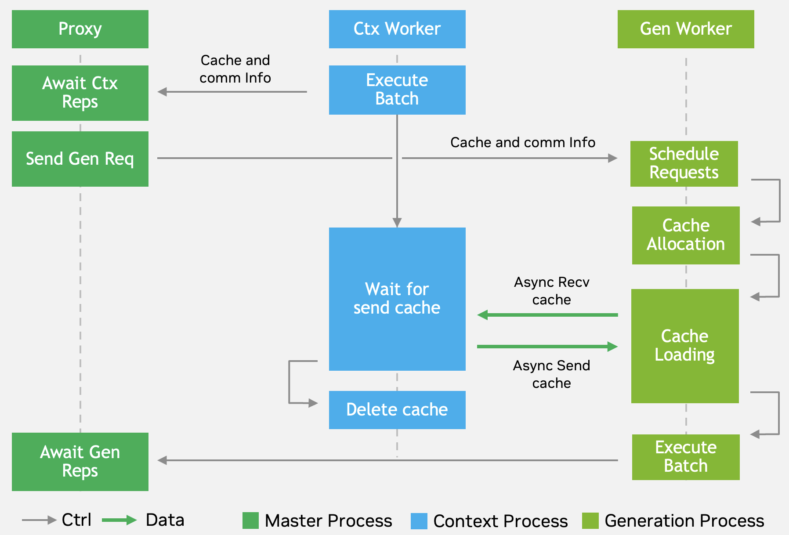

# Introduction to KV Cache Transmission

This article provides a general overview of the components used for device-to-device transmission of KV cache, which is relied upon by dist-serving. It is intended as a reference for users who wish to understand the internal implementation or develop extended functionalities.

## Table of Contents

- [Workflow](#workflow)
- [Key Components](#key-components)
  - [Transceiver](#transceiver)
  - [Sender and Receiver](#sender-and-receiver)
  - [Formatter](#formatter)
  - [Connection](#connection)
  - [Transfer Agent](#transfer-agent)
- [Customization](#customization)
  - [Encapsulation and Overloading of Low-Level Communication Libraries](#encapsulation-and-overloading-of-low-level-communication-libraries)
  - [Modifications to Upper-Level Runtime Logic](#modifications-to-upper-level-runtime-logic)
- [Evolution Outlook](#evolution-outlook)

## Workflow

1. Context phase completes computation, KV cache stays in device memory awaiting transmission.
2. Context returns its communicator handle to the user, who selects the generation executor for continued communication.
3. If no prior connection exists, it's established now. Generation phase shares its cache layout with context.
4. Generation phase requests KV cache for specific tokens.
5. Context sends KV cache to generation phase.
6. Generation phase resumes computation, context releases KV cache.

## Key Components

### Transceiver

Responsible for coordinating the sending and receiving of cache among different ranks within the same executor.

### Sender and Receiver

Responsible for transmitting control plane messages. That is, during per-request transmission, the receiver bound to the generation informs the sender of the specific information it requires. The sender then sends the corresponding KV cache based on these messages.

### Formatter

Performs KV cache data transmission and correctly handles the mapping between caches across different TP/PP configurations.

### Connection

Bidirectional byte-stream protocol facility. Apart from essential operations such as connection establishment, it mainly provides send and receive functionalities. UCX accesses the system through this facility. The `AgentConnection` data structure adapts the upper-layer bidirectional send/receive semantics into a unidirectional read/write operation model.

### Transfer Agent

Unidirectional byte-stream read/write protocol facility. Apart from essential operations such as connection establishment, it primarily provides read and write functionalities. NIXL accesses the system through this facility.

## Customization

At the current stage, the customization work mainly involves inheriting the low-level data plane interfaces to enable the invocation of third-party communication libraries, as well as defining the data structures required for establishing connections in the data plane.

### Encapsulation and Overloading of Low-Level Communication Libraries

Each layer of interface described in the previous section supports overloading. Here, based on whether the underlying library uses a unidirectional or bidirectional protocol, we describe the customization methods respectively.

If the underlying library you are integrating uses a unidirectional communication model, with read/write as its primary interfaces, you should inherit the `executor::kv_cache::BaseTransferAgent` data structure. This structure mainly provides interfaces for memory registration, remote agent loading, and transfer request submission.

If the underlying library you are integrating uses a bidirectional communication model, you should inherit the `executor::kv_cache::Connection` data structure. This structure mainly provides send and receive interfaces.

### Modifications to Upper-Level Runtime Logic

This corresponds to the communication info section shown in the figure above. Since different underlying communication connections may require completely different setup methods—for example, some use IP and port, others require a world rank, and some communication libraries establish connections using binary-transparent metadata—we provide sufficient flexibility to allow users to customize this part as needed.

## Evolution Outlook

Currently, the architecture of KV transfer is being optimized. First, we plan to move the control plane logic up to Python to enable better integration with the Python runtime. In addition, we are reevaluating the current design choice of initiating communication only after the context computation is completed, which was originally made for flexibility. Lastly, since some control logic is still being transmitted through the data plane, we aim to clarify the relationship between the control and data planes, and to simplify and streamline the code logic of the data plane. Due to the modular architecture, these iterative enhancements are only loosely coupled with the `TransferAgent`. We aim to minimize the impact of future upgrades on third-party integrations.
