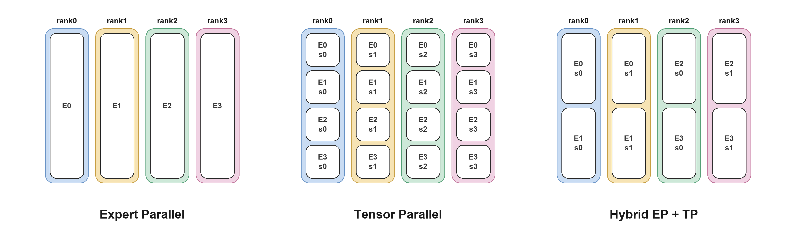

(moe-perf-guide)=

# MoE Performance Guide

## MoE Architecture

An MoE module contains `num_experts` experts and a router that selects `top_k` of them for each token. To accelerate LLM execution, a multi-GPU deployment usually partitions these experts across ranks, which makes each rank hold only part of them. The module therefore additionally pays for a **dispatch** (send each token to the rank that owns its target expert) and a **combine** (bring the results back).

The consequence is that MoE execution time is usually *not* decided by the expert GEMM alone, but by the combination of **how the experts are partitioned**, **how the tokens are exchanged**, and **which kernel implementation runs the GEMM**:

```
                    hidden states
                          |
                +-------------------+
                |   Router (top_k)  |
                +-------------------+
                          |
                +-------------------+
                |     Dispatch      | <--- Communication
                +-------------------+
                          |
                +-------------------+
                |    Expert GEMM    | <--- Backend
                +-------------------+
                          |
                +-------------------+
                |      Combine      | <--- Communication
                +-------------------+
                          |
                        output

     Parallelism decides which experts each rank owns,
     and therefore how much there is to dispatch and to compute.
```

| Option | What it controls |
|---|---|
| **Parallelism** | How experts are sharded across GPUs: EP (expert parallelism, split by expert) vs TP (tensor parallelism, split inside every expert). |
| **Communication** | Which path implements dispatch / combine. |
| **Backend** | Which kernel implementation runs the expert GEMM. Each one supports a different set of quantization formats and GPU architectures. |

The three can be combined in many ways, and no single combination is always the best one. The right choice changes with the world size and with the number of tokens in flight, which is why prefill and decode of the same deployment often need different answers. It also changes with the quantization format, with the GPU architecture, and with whether expert parallelism stays inside one NVLink domain. The large number of options, together with the many factors they depend on, makes it difficult to find the best MoE configuration for a given deployment.

This guide aims to help you reach a high level of MoE performance in practice. It first gives a recommended configuration for a given platform, model, quantization, world size and workload. If you want to push the performance of a specific workload further, it then shows how to benchmark it yourself. Finally, it introduces the advanced techniques that are available when the recommended configuration is not enough.

### Configuration Options

#### Parallelism

The parallelism scheme determines the communication volume and the computation each GPU performs, and therefore the execution efficiency of the MoE module. It also depends on how the attention module is parallelized, and that in turn is decided by whether the deployment targets low latency or high throughput.

The parallelism scheme of MoE is expressed as a combination of `moe_ep_size` (experts partitioned across ranks) and `moe_tp_size` (every rank holds a shard of every expert), with `moe_ep_size * moe_tp_size = world_size`.



| Scheme | Per-rank expert-GEMM `M` | Per-rank GEMM `N` | Communication |
|---|---|---|---|
| **Expert Parallelism (EP)** | `num_tokens * top_k / ep_size` — only the tokens routed here | full `intermediate_size` | dispatch + combine of activations |
| **Tensor Parallelism (TP)** | all `num_tokens` — every rank sees every token | `intermediate_size / tp_size` | AllReduce of outputs; no routing |
| **hybrid (EP+TP)** | `num_tokens * top_k / ep_size` | `intermediate_size / tp_size` | both, at reduced scale each |

EP keeps each rank's GEMM full-width and does redundant work on no token, but pays the routing exchange and becomes load-sensitive when the router is skewed. TP has no routing at all and stays efficient when there are too few tokens to fill an EP dispatch, but every rank redundantly reads every token and each expert's GEMM gets narrower as `tp_size` grows.

The scheme is notated together with the attention parallelism:

| Notation | Attention | MoE |
|---|---|---|
| `DEP` | DP | expert parallelism |
| `TEP` | TP | expert parallelism |
| `DTP` | DP | tensor parallelism |
| `TTP4EP8` | TP | `moe_tp_size=4`, `moe_ep_size=8` |

#### Communication

Under expert parallel every rank holds only part of the experts, so a token whose target expert lives elsewhere has to be dispatched there. Each MoE forward therefore sends every token to the ranks owning its `top_k` experts and brings the partial results back. These are the *Dispatch* and *Combine* boxes in the diagram above.

TensorRT-LLM provides several implementations of this exchange. They differ in the physical link (NVLink inside a domain, or the network across it), how the data is moved (one-sided writes into the peer's memory, or a two-sided handshake), and whether tokens are routed at all. The best communication choice varies with specific workload and deployment environment.

| Strategy | Mechanism |
|---|---|
| `NVLINK_ONE_SIDED` | One-sided writes into a symmetric MNNVL workspace |
| `NVLINK_TWO_SIDED` | Two-sided alltoall over MNNVL |
| `DEEPEP` | DeepEP normal-mode kernels over the network |
| `DEEPEPLOWLATENCY` | DeepEP low-latency kernels over the network |
| `NCCL_EP` | NCCL-EP rank-major exchange |
| `ALLGATHER` | AllGather the tokens, ReduceScatter the outputs |

> The `MEGAMOE` backends fuse dispatch and combine into the expert GEMM kernel over a symmetric memory heap, writing straight into a peer's buffer with no host-side exchange, which forces the communication to `NONE`.

##### How to assign a communication strategy?

Set the environment variable `TRTLLM_FORCE_COMM_METHOD` on every rank:

```bash
TRTLLM_FORCE_COMM_METHOD=NVLINK_ONE_SIDED \
  trtllm-serve <model> --tp_size 8 --ep_size 8 --extra_llm_api_options config.yaml
```

The value is case-insensitive and must be one of the strategy names in the table above.

Implementation Notes: [`MOE_DEVELOPER_GUIDE.md`](https://github.com/NVIDIA/TensorRT-LLM/blob/main/tensorrt_llm/_torch/moe/fused_moe/MOE_DEVELOPER_GUIDE.md).

#### Backend

TensorRT-LLM provides many MoE implementations, differing in supported quantization formats, target GPU architecture, and expert-GEMM scheduling. This is the *Expert GEMM* box in the diagram above.

| Backend | GPU arch | Quantization |
|---|---|---|
| `CUTLASS` | SM80+ | unquantized, FP8 QDQ, FP8 block-scale, NVFP4, W4A16_NVFP4, W4A8_AWQ, W8A16, MXFP4, MXFP8 |
| `TRTLLM` | SM100 / SM103 | NVFP4, FP8 block-scale, W4A8_NVFP4_FP8, MXFP4, BF16 (a separate FlashInfer path) |
| `CUTEDSL` | SM100 / SM103 (SM107 experimental); SM120 / SM121 (a separate decode kernel) | NVFP4, W4A16_NVFP4 (SM120 / SM121) |
| `DEEPGEMM` | SM100 / SM103 | FP8 block-scale |
| `DENSEGEMM` | SM100 / SM103 | NVFP4 |
| `MEGAMOE_CUTEDSL` | SM100 / SM103 | NVFP4 |
| `MEGAMOE_DEEPGEMM` | SM100 / SM103 | W4A8_MXFP4_MXFP8 |
| `MARLIN` | SM89 – SM99 | NVFP4, W4A16_NVFP4 (BF16 activations) |
| `TRITON` (Deprecated) | SM90 (GPT-OSS) | BF16, FP8 QDQ, W4A16_MXFP4, W4A8_MXFP4_FP8 |

##### How to assign a backend?

Set `moe_config.backend` in the `trtllm-serve` config yaml:

```yaml
moe_config:
  backend: TRTLLM          # AUTO (default), CUTLASS, CUTEDSL, TRTLLM, DEEPGEMM,
                           # DENSEGEMM, MEGAMOE_CUTEDSL, MEGAMOE_DEEPGEMM, MARLIN, ...
  use_low_precision_moe_combine: true
```

The *Backend Capability Matrix* and *Quantization Support* tables: [`MOE_DEVELOPER_GUIDE.md`](https://github.com/NVIDIA/TensorRT-LLM/blob/main/tensorrt_llm/_torch/moe/fused_moe/MOE_DEVELOPER_GUIDE.md).

### Terminology

- **`world_size`**: number of ranks (GPUs) the model is served on.
- **NVLink domain**: the set of GPUs reachable over NVLink. GB300 (NVL72) forms one domain of up to 72 GPUs and B300 forms one domain per 8-GPU node, so `world_size > 8` means EP crosses the domain and falls back to the slower network.
- **prefill / decode**: prefill processes the whole prompt at once (large GEMM `M`, compute bound), decode produces one token per request per step (small `M`, communication and memory bound). The two phases usually want different configurations.

## Recommended Configuration

To provide recommended MoE configurations, we use the following two derived variables.

- `activated_tokens_per_rank = num_tokens * top_k / world_size`
  This is the `M` dimension of the per-rank expert GEMM, representing the tokens that land on one rank after dispatch. The per-rank workload is not determined by batch size alone: it also depends on `top_k` and `world_size`. Folding both in provides a unified threshold for the actual per-rank workload across models and batch sizes.

- `dispatch_KB = activated_tokens_per_rank * hidden_size * bytes_per_elem / 1024`
  This quantifies the communication volume between ranks as a byte count (`bytes_per_elem` is 0.5 for NVFP4 and 1.0 for W4A8_MXFP4_MXFP8), providing a unified threshold for selecting the communication method.

### Decision Tree

```
═════════════════ STEP1: Parallelism ═════════════════

Parallelism
│
└─ MoE Module                                        →  EP


═════════════════ STEP2: Backend ═════════════════

Backend
│
├─ SM90  (Hopper: H100 / H200)
│      │
│      ├─ gpt-oss  → TRITON
│      └─ else     → CUTLASS
│
├─ SM120 / SM121  (RTX PRO 6000 Blackwell / DGX Spark)
│      │
│      ├─ NVFP4, tokens per rank < 64, ep_size==1, no attention DP  → CUTEDSL
│      └─ else                                                      → CUTLASS
│
└─ SM100 / SM103  (B300 / GB300)
       │
       ├─ attention TP                                          → TRTLLM
       │
       └─ attention DP
              │
              ├─ GB300 with world_size < 72, or B300 with world_size <= 8
              │  (EP within one NVLink domain)
              │      │
              │      ├─ NVFP4
              │      │      ├─ CUDA graph on   (decode)
              │      │      │      ├─ activated_tokens_per_rank <= 512
              │      │      │      │      ├─ world_size <= 8      → TRTLLM
              │      │      │      │      └─ else                 → CUTEDSL
              │      │      │      └─ else                        → MEGAMOE_CUTEDSL
              │      │      │
              │      │      └─ CUDA graph off  (prefill)
              │      │             ├─ activated_tokens_per_rank <= 16384
              │      │             │                              → TRTLLM
              │      │             └─ else                        → MEGAMOE_CUTEDSL
              │      │
              │      └─ W4A8_MXFP4_MXFP8                          → MEGAMOE_DEEPGEMM
              │
              └─ B300 with world_size > 8
                 (EP crosses the NVLink domain)
                        ├─ NVFP4             → CUTEDSL
                        └─ W4A8_MXFP4_MXFP8  → TRTLLM


═════════════════ STEP3: Communication ═════════════════

Communication
│
├─ attention TP                            → NONE  
│
└─ attention DP
       │
       ├─ GB300 with world_size < 72, or B300 with world_size <= 8
       │  (EP within one NVLink domain)
       │      │
       │      ├─ backend == MEGAMOE_*  → NONE
       │      │     (the MegaMoE fused path owns the exchange)
       │      └─ else                  → NVLINK_ONE_SIDED
       │
       └─ B300 with world_size > 8
          (EP crosses the NVLink domain)
                 │
                 ├─ dispatch_KB <= 8192  (~8 MB per rank)
                 │      ├─ DEEPEPLOWLATENCY supported  → DEEPEPLOWLATENCY
                 │      └─ else                        → DEEPEP
                 │
                 └─ else                               → ALLGATHER
```

> `DEEPEPLOWLATENCY supported`: `hidden_size` in
> `{2048, 2560, 3584, 4096, 5120, 6144, 7168}` and `top_k <= 16`.

> **Notes**
> - The tree is an empirical summary from `bench_moe` sweeps on TensorRT-LLM `v1.3.0rc26` (`21dc97fbc8`, 2026-09-13).
> - Coverage: GB300 / B300; typical workloads of key models (DeepSeek-V4-Pro, GLM-5, Kimi-K2, Kimi-K3, Qwen3.8) on the MoE Perf Dashboard; module-level `bench_moe` with perfect routing and `--use_low_precision_moe_combine`.
> - Perfect routing assigns tokens evenly across experts. Relative rankings of backends and communication strategies hold under this configuration, but a real router can be skewed, so absolute latency can differ from what the deployment sees.
> - The decision tree is a fit to those sweeps, and may not be optimal for a specific workload. Meanwhile, results can become outdated as kernels and autotuning change. To push performance further, test the options yourself with `bench_moe`, as described in *Tuning a Specific Workload*.

### Hints for Making the Choice

#### Impacts of Each Option

**Parallelism** decides how much work lands on each rank. Under expert parallelism a rank holds a subset of the experts, so a token has to be dispatched to whichever rank owns its target expert. A hybrid TP x EP layout splits every expert as well, which shrinks the dispatch, at the cost of a narrower GEMM on each rank and of every rank having to read every token.

**Communication** sets how the dispatch and the combine are carried out. The tokens can be written straight into the peer's memory with no handshake, exchanged after a two-sided handshake, sent out over the network, or not routed at all, which means broadcasting every token to every rank and reducing the outputs back afterwards.

**Backend** governs how the expert GEMM runs. The implementations differ in how their kernels are tuned, some picking parameters from the problem shape and some using a fixed configuration. The MegaMoE backends are the special case, since they fold the exchange into the GEMM kernel and move data while they compute.

#### A Uniform View for Three Options

All three options switch for the same reason. Every configuration pays two kinds of cost, and the number of tokens in flight decides which one dominates.

```
          fixed cost                                  data volume
   kernel launches, cross-rank                 bytes to dispatch and
   synchronisation, handshakes,                combine, FLOPs the
   peers to coordinate with                    expert GEMM runs
          |                                             |
          +---------------- threshold ------------------+
          |                                             |
   dominates when few tokens                    dominates when many
   are in flight                                tokens are in flight
```

#### Rationale Behind Each Threshold

**The MoE layout is always expert parallelism.** Under attention DP, expert parallelism is always the optimum at every workload point in the sweep. Under attention TP, a hybrid TP x EP layout can be slightly better at small token counts, but the gain is small (0.3% at the median and 4% at the 90th percentile). A deployment that is squeezing the last few percent out of a low-latency configuration should still measure `TP<k>EP<m>`.

**The fused path is not always the best choice.** The fused scheme carries a fixed setup cost: three cross-rank NVLink barriers inside the kernel, plus metadata preparation whose cost follows the token bucket size rather than the number of tokens actually present. With few tokens in flight that cost exceeds the overlapped dispatch and combine cost, and fusion only takes off once the workload is large enough for the cost to be amortised and for the overlap to repay it. The threshold `activated_tokens_per_rank = 512` with CUDA graph on is derived from the `bench_moe` sweep over typical workloads.

**We prefer `TRTLLM` over `CUTEDSL` when `world_size <= 8`.** A small world size leaves many experts on each rank (`num_experts / world_size` can be 32 to 224), so the grouped GEMM has many groups with a small `M` dimension. In these cases, TRTLLM-Gen's tuned kernels fit that shape better than the generic CuteDSL grouped GEMM.

**The crossover moves out much further with CUDA graph off.** A CUDA graph replays a recorded launch sequence and reduces the kernel launch overhead during forward. Without CUDA graph, `TRTLLM` drives its whole MoE from one host-side call that issues its kernels internally, while the fused path is a chain of separate host-side steps, including quantize, staging copies, the fused kernel, and a separate top-k reduce, each carrying its own dispatch and tactic lookup. With CUDA graph off, the host overhead dominates the execution of the MoE module. The fused path's expert-GEMM advantage therefore stays out of the comparison until `TRTLLM`'s GPU work has grown past that dispatch cost, which moves the crossover point much further out. In a disaggregated deployment, CUDA graph off maps to the prefill phase.

**Attention TP always uses `TRTLLM`.** Attention TP is a low-latency choice, and the MoE forward never gets a large batch: across the disaggregated-serving workloads behind this guide, attention TP appears only in the decode phase and `activated_tokens_per_rank` never exceeds 64. `CUTEDSL` does overtake `TRTLLM` once the expert GEMM becomes compute bound, but that only happens above roughly 24576 activated tokens per rank, which attention TP does not reach in a disaggregated deployment.

#### Impacts of Crossing the NVLink Domain

An NVL72 system keeps up to 72 GPUs in one domain, while B300 keeps 8 per node. Once expert parallelism extends beyond that, the tokens go over the network, where per-GPU bandwidth drops from 900 GB/s to around 50 GB/s. The same bytes then cost close to twenty times more, which moves every crossover earlier and is why the cross-domain branch switches on absolute dispatch bytes (`dispatch_KB`) rather than on a token count (`activated_tokens_per_rank`).

> The thresholds above were obtained from sweeps over typical workloads on key models, all measured with `--use_low_precision_moe_combine` enabled. This flag speeds up `NVLINK_ONE_SIDED` by about 4% while leaving the fused `NONE` path untouched.

### Typical Deployment Scenarios

#### Low Latency

Optimize for the smallest possible per-step latency at low concurrency, accepting lower GPU utilization.

| | |
|---|---|
| Attention | TP |
| MoE parallelism | EP |
| Backend | `TRTLLM` on SM100 / SM103 |
| Communication | `NONE` (attention TP needs no dispatch) |
| CUDA graph | On |

The MoE forward here is launch-bound, not compute-bound: `activated_tokens_per_rank` stays small. Every fixed cost is therefore fully exposed. If you are chasing the last few percent, measure the hybrid `TP<k>EP<m>` layouts as well, under attention TP they can edge out pure EP at small token counts.

#### High Throughput

Optimize for aggregate throughput at high concurrency, accepting higher per-request latency.

| | |
|---|---|
| Attention | DP |
| MoE parallelism | EP, typically wide |
| Backend | `MEGAMOE_CUTEDSL` (NVFP4) / `MEGAMOE_DEEPGEMM` (W4A8_MXFP4_MXFP8) |
| Communication | `NONE` |
| CUDA graph | On for decode, off for prefill |

Attention DP accumulates tokens per rank as concurrency grows. Fusion is for that case: the MoE module has enough data that overlapping dispatch and combine with the GEMM operations. It is also important to keep expert parallelism inside one NVLink domain if you can.

#### Disaggregated Serving

In a disaggregated deployment the two phases are separate services and should be configured separately rather than compromised into one profile:

- **Prefill / context servers**: large `M`, compute bound, CUDA graph off. Follow the CUDA-graph-off branch of the tree (crossover at `activated_tokens_per_rank = 16384`). This is also the only phase where DWDP applies.
- **Decode / generation servers**: small `M` per step, communication and memory bound, CUDA graph on. Follow the CUDA-graph-on branch (crossover at 512). This is the phase where EPLB pays off, since expert imbalance shows up as a straggler on every step.

## Tuning a Specific Workload

The decision trees give a general configuration that works well across a wide range of deployments. For a specific workload and world size, searching the whole configuration space can find a better one.

`bench_moe` runs the MoE module on its own, without deploying the full model. With the model, quantization, world size and token counts fixed, `--search full` expands backend, communication, parallel layout, and CUDA Graph. This includes layouts the decision trees do not select, such as MoE TP and the even-split hybrid `(D|T)TP<k>EP<m>` modes. It can be executed as:

```bash
PYTHONPATH=tests/microbenchmarks:${PYTHONPATH:-} \
mpirun --allow-run-as-root --oversubscribe --bind-to none --map-by slot -np 8 \
  python3 -m bench_moe \
  --world_size 8 \
  --model deepseek_v4_pro \
  --quant NVFP4 \
  --search full \
  --balanced_total_num_tokens 256 8192 \
  --use_low_precision_moe_combine \
  --output_file out/deepseek_v4_pro_ws8.json
```

This writes `out/deepseek_v4_pro_ws8.json` and `out/deepseek_v4_pro_ws8.analysis.xlsx`. If attention parallelism is already decided, pin `--parallel_mode DEP` or `TEP` and `--search backend comm` instead.

The JSON has `results` (one object per candidate) and `rankings` grouped by `(num_tokens, parallel_mode)`. Start at `rankings`: `best` is the `status=success` candidate with the lowest `score_ms` in that group.

```json
{
  "num_tokens": 256,
  "parallel_mode": "DEP",
  "best": {
    "backend": "TRTLLM",
    "comm_method": "NVLinkOneSided",
    "cuda_graph": true,
    "score_ms": 0.85,
    "status": "success"
  }
}
```

`score_ms` is the trimmed mean of per-iteration slowest-rank forward times; lower is better. In the workbook, `best_by_workload` lists those winners and `all_results` is the full table. Take the `DEP` or `TEP` group that matches the serving job. CUDA Graph on/off share that group, so if the job pins Graph (on for decode, off for prefill), filter `cuda_graph` in `all_results`. Set the winner with `moe_config.backend` and `TRTLLM_FORCE_COMM_METHOD` as in *Configuration Options*.

Search axes and further recipes: [`BENCH_MOE_USER_GUIDE.md`](https://github.com/NVIDIA/TensorRT-LLM/blob/main/tests/microbenchmarks/bench_moe/BENCH_MOE_USER_GUIDE.md).

One thing to know before trusting a `bench_moe` ranking: it has been cross-validated against end-to-end disaggregated serving, detailed in *Appendix*.

## Advanced Techniques

The two techniques below go beyond picking a configuration: they change how experts are placed or how their weights move, and each targets a cost that the options above cannot remove.

### Expert Parallelism Load Balancer (EPLB)

Expert Parallelism Load Balancer (EPLB), introduced in [DeepSeek-V3](https://arxiv.org/abs/2412.19437), is proposed to remove the straggler effect caused by uneven expert activation under large-scale expert parallelism, where the ranks holding the most-activated experts dominate the latency of the whole module while the rest idle. It replicates hot experts and packs the resulting slots onto ranks so that the expected load is even, deriving the assignment from measured routing statistics.

It is recommended to enable EPLB on MoE models when expert parallelism is large (`ep_size` typically `> 8`), the MoE is a significant fraction of runtime, and ranks are imbalanced. This setting usually corresponds to the decode phase of a disaggregated deployment.

EPLB can use an offline plan or recompute the placement online. Offline EPLB is suitable when the traffic pattern is known and stable. Online EPLB is for production when the traffic mix can drift, because hot experts differ across datasets and requests. The online path follows that drift without regenerating a placement. The cost is a full host copy of the experts, background weight-update threads, and platform requirements (GDRCopy, huge pages). At small per-GPU batches, the statistics and update work may not hide behind the MoE GEMMs.

Usage: [`examples/wide_ep/ep_load_balancer/README.md`](https://github.com/NVIDIA/TensorRT-LLM/blob/main/examples/wide_ep/ep_load_balancer/README.md).

### Distributed Weight Data Parallelism (DWDP)

[Distributed Weight Data Parallelism (DWDP)](https://doi.org/10.48550/arXiv.2604.01621) targets a different cost: the dispatch/combine exchange dominates MoE execution even though it carries few tokens in the decode phase. Rather than balancing the exchange, DWDP keeps a resident subset of experts on each worker and asynchronously prefetches the remaining expert weights from its NVLink peers. Therefore, weight transfer substitutes for token communication, and overlaps with computation.

DWDP can be applied to the prefill phase of a serving system when the context batch is large enough for computation to hide the weight prefetch. Decode has no such window, so generation keeps the normal EP dispatch. The cost is a large TTFT regression, from a lower service rate on the context stage, plus extra prefetch memory: each rank stores only its local experts, but adds a double-buffered region of about two layers of remote experts. DWDP cannot run on the same MoE path as EPLB. A disaggregated deployment can use DWDP on context servers and EPLB on generation servers.

Usage: [`examples/dwdp/README.md`](https://github.com/NVIDIA/TensorRT-LLM/blob/main/examples/dwdp/README.md) and [blog19](https://github.com/NVIDIA/TensorRT-LLM/blob/main/docs/source/blogs/tech_blog/blog19_DWDP_Distributed_Weight_Data_Parallelism_for_High_Performance_LLM_Inference_on_NVL72.md).

## Appendix

### MoE Perf Dashboard

The **MoE Perf Dashboard** publishes MoE performance of typical workloads on key models. The recommended configuration in this guide is summarized from these sweeps. Browse it at [MoE Perf Dashboard](./moe-perf-dashboard.md).

Covered Models with MoE Configuration:

| Model | `num_experts` | `top_k` | `hidden_size` | `intermediate_size` |
|---|---|---|---|---|
| DeepSeek-V4-Pro | 384 | 6 | 7168 | 3072 |
| GLM-5 | 256 | 8 | 6144 | 2048 |
| Kimi-K2 | 384 | 8 | 7168 | 2048 |
| Kimi-K3 | 896 | 16 | 3584 | 3072 |
| Qwen3.8 | 512 | 10 | 8192 | 2048 |

### Cross Validation of Microbenchmark with End-to-end Performance

The microbenchmark ranks MoE configurations by module latency, without serving the full model. This ranking is validated against disaggregated serving.

#### Baseline: the Pareto serving configuration

The **baseline** is the MoE configuration on the **Pareto Curve** of the [InferenceX](https://inferencex.com) Dashboard. The curve comes from InferenceX's public benchmark (fixed ISL/OSL, sweeping concurrency and parallelism), and each point is Pareto-optimal for system throughput and per-user interactivity (`tps_per_user`).

These configurations are published in [InferenceX](https://github.com/SemiAnalysisAI/InferenceX):
- [Dashboard](https://inferencex.com): each point's tooltip shows the recipe (model, framework, precision, parallelism, ISL/OSL, concurrency) and a link to the GitHub Actions run.
- [`nvidia-master.yaml`](https://github.com/SemiAnalysisAI/InferenceX/blob/main/.github/configs/nvidia-master.yaml): lists the disagg topology (`num-worker`, `tp`, `ep`, `dp-attn`, ISL/OSL, concurrency) and the `CONFIG_FILE` path.
- [`NVIDIA/srt-slurm`](https://github.com/NVIDIA/srt-slurm): the `CONFIG_FILE` YAML holds the serving configuration (`moe_config.backend`, EP/TP, CUDA Graph, batch, MTP), for example [`ctx1_gen4_tep8_batch1_eplb0_mtp3.yaml`](https://github.com/NVIDIA/srt-slurm/blob/sa-submission-q2-2026/recipes/trtllm/gb300-fp4/1k1k/mtp/ctx1_gen4_tep8_batch1_eplb0_mtp3.yaml).

#### How a Pareto point is compared to `bench_moe` microbenchmark?

Each serving case `(ISL, OSL, instance layout, batch, MTP, concurrency)` is mapped to a `bench_moe` shape: the same model configuration, quantization, hardware, world size, `num_tokens` of the MoE forward, and CUDA Graph on or off. Candidates with the same deployed attention parallelism (DP or TP) are then ranked by module latency (`score_ms`, lower is better). 

The deployed MoE config is compared with that best `bench_moe` candidate and labeled **Match** if they are the same, **Mismatch** otherwise. Each Mismatch is evaluated in disaggregated serving with both the Pareto-curve configuration and the `bench_moe` candidate, and compared on `tps_per_user` (tokens per second per user).

- **Improvement**: the `bench_moe` candidate raises `tps_per_user` by more than 3%.
- **Flat**: the change is within ±3%.
- **Regression**: the `bench_moe` candidate lowers `tps_per_user` by more than 3%.

| Model | Hardware | Match | Mismatch | Improvement | Flat | Regression | Regression after Perfect Routing |
|---|---|---|---|---|---|---|---|
| DeepSeek-V4-Pro | GB300 | 92/108 (85.19%, prefill 54/54, decode 38/54) | 16/108 | 9/16 | 6/16 | 1/16 | 0/16 |
| Kimi-K2 | GB200 | 33/50 (66%, prefill 25/25, decode 8/25) | 17/50 | 4/17 | 10/17 | 3/17 | 0/17 |
| Kimi-K2 | GB300 | 35/50 (70%, prefill 25/25, decode 10/25) | 15/50 | 1/15 | 13/15 | 1/15 | 0/15 |
| GLM-5 | GB200 | 75/92 (81.52%, prefill 43/46, decode 32/46) | 17/92 | 3/17 | 13/17 | 1/17 | 0/17 |
| GLM-5 | GB300 | 36/90 (40.00%, prefill 1/45, decode 35/45) | 54/90 | 5/54 | 49/54 | 0/54 | 0/54 |
| DeepSeek-R1 | GB200 | 92/104 (88.46%, prefill 49/52, decode 43/52) | 12/104 | 5/12 | 7/12 | 0/12 | 0/12 |

Regression cases are re-run with **perfect routing** (balanced expert load). They go to zero in the table, indicating the end-to-end gap came from router skew, as `bench_moe` ranks under balanced expert load.

```{toctree}
:hidden:
:maxdepth: 1

moe-perf-dashboard.md
```
