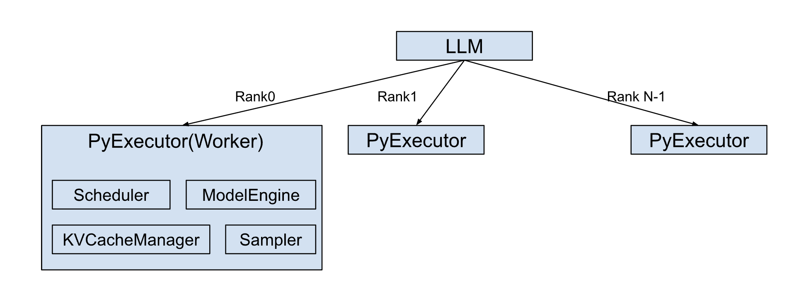

# Architecture Overview

The `LLM` class is a core entry point for the TensorRT LLM, providing a simplified `generate()` API for efficient large language model inference. This abstraction aims to streamline the user experience, as demonstrated with TinyLlama:

```python
from tensorrt_llm import LLM

# Initialize the LLM with a specified model
llm = LLM(model="TinyLlama/TinyLlama-1.1B-Chat-v1.0")

# Generate text using the model
output = llm.generate("Hello, my name is")
```

The `LLM` class automatically manages essential pre and post-processing steps, including tokenization (encoding input prompts into numerical representations) and detokenization (decoding model outputs back into human-readable text).

Internally, the `LLM` class orchestrates the creation of a dedicated `PyExecutor(Worker)` process on each rank.



This `PyExecutor` operates in a continuous background loop, designed for the efficient, asynchronous processing of inference requests.

The `PyExecutor`'s functionality is built upon several key components:

- `Scheduler`: Responsible for determining which active requests are ready for execution at each processing step.

- `KVCacheManager`: Manages the allocation, deallocation, and maintenance of the Key-Value (KV) Cache. This is a critical optimization for Transformer models, significantly enhancing performance during autoregressive text generation by storing previously computed attention keys and values.

- `ModelEngine`: Handles the loading and highly efficient execution of the language model on the GPU hardware.

- `Sampler`: Takes the raw outputs (logits) from the ModelEngine and applies appropriate sampling strategies (e.g., greedy, top-k, top-p, beam search) to generate the final output tokens.

During each iteration of its background loop, the `PyExecutor` performs the following sequence of operations:

- Request Fetching: Retrieves new inference requests from an internal request queue, if available.

- Scheduling: Interacts with the `Scheduler` to identify and prioritize requests that are ready to be processed in the current step.

- Resource Preparation: Coordinates with the `KVCacheManager` to ensure that the necessary Key-Value (KV) Cache resources are allocated for the selected requests.

- Model Execution: Invokes the `ModelEngine` to perform a forward pass on the scheduled requests, predicting the next output tokens.

- Output Handling: Updates the partial outputs for ongoing requests and finalizes the results for any requests that have reached completion, returning them to the user.


## Runtime Optimizations

TensorRT LLM enhances inference throughput and reduces latency by integrating a suite of runtime optimizations, including CUDA Graph, [Overlap Scheduler](../features/overlap-scheduler.md), [Speculative decoding](../features/speculative-decoding.md), etc.

### CUDA Graph

CUDA Graphs drastically reduce the CPU-side overhead associated with launching GPU kernels, which is particularly impactful in PyTorch-based inference where Python's host-side code can be a bottleneck. By capturing a sequence of CUDA operations as a single graph, the entire sequence can be launched with one API call, minimizing CPU-GPU synchronization and driver overhead.

To maximize the "hit rate" of these cached graphs, TensorRT LLM employs CUDA Graph padding. If an incoming batch's size doesn't match a captured graph, it's padded to the nearest larger, supported size for which a graph exists. While this incurs minor overhead from computing "wasted" tokens, it's often a better trade-off than falling back to slower eager mode execution. This optimization has a significant impact, demonstrating up to a 22% end-to-end throughput increase on certain models and hardware.

### Overlap Scheduler

The Overlap Scheduler maximizes GPU utilization by hiding CPU-bound latency behind GPU computation.

The key strategy is to launch the GPU's work for the next step (n+1) immediately, without waiting for the CPU to finish processing the results of the current step (n). This allows the CPU to handle tasks like checking stop criteria or updating responses for one batch while the GPU is already executing the model for the subsequent batch.

This concurrent execution pipeline is illustrated in the `PyExecutor`'s logic:

```python
# Schedule and launch GPU work for the current step (n)
scheduled_batch, _, _ = self._schedule()
batch_outputs = self._forward_step(scheduled_batch, previous_tensors_device)
sample_state = self._sample_async(scheduled_batch, batch_outputs)

# While the GPU is busy, process the CPU-bound results from the previous step (n-1)
if self.previous_batch is not None:
    self._process_previous_batch()
```

This approach effectively reduces GPU idle time and improves overall hardware occupancy. While it introduces one extra decoding step into the pipeline, the resulting throughput gain is a significant trade-off. For this reason, the Overlap Scheduler is enabled by default in TensorRT LLM.

## Visual Generation

For diffusion-based visual generation (image/video), TensorRT-LLM provides a separate `VisualGen` API and `DiffusionExecutor` with its own pipeline architecture. See the [Visual Generation](../models/visual-generation.md) feature documentation.

## Module-Level Logging

TensorRT-LLM log messages include a fixed-width module tag that identifies which subsystem produced the message:

```txt
[TRT-LLM] [I] [runtime ] Loading model weights...
[TRT-LLM] [W] [_torch  ] FlashAttention not available, falling back to default
[TRT-LLM] [I] [serve   ] Server listening on port 8000
```

### Module Abbreviation Table

Module names longer than 8 characters are abbreviated to fit the fixed-width tag:

| Module Name | Display Tag |
|-------------|-------------|
| `_torch` | `_torch  ` |
| `batch_manager` | `batchmgr` |
| `common` | `common  ` |
| `cutlass_extensions` | `cutl_ext` |
| `deep_ep` | `deep_ep ` |
| `deep_gemm` | `deepgemm` |
| `executor` | `executor` |
| `executor_worker` | `exec_wkr` |
| `flash_mla` | `flashmla` |
| `kernels` | `kernels ` |
| `layers` | `layers  ` |
| `runtime` | `runtime ` |
| `serve` | `serve   ` |
| `quantization` | `quantize` |
| `scaffolding` | `scaffold` |
| `auto_parallel` | `autoprll` |
| `visual_gen` | `vis_gen ` |

### Per-Module Log Level Filtering

Use `TLLM_LOG_LEVEL_BY_MODULE` to set different log levels per module, overriding the global `TLLM_LOG_LEVEL`:

```bash
# Format: "level:module1,module2;level:module3"
export TLLM_LOG_LEVEL=warning
export TLLM_LOG_LEVEL_BY_MODULE="debug:_torch,runtime;info:serve"
```

This example sets the global level to `warning` but enables `debug` output for `_torch` and `runtime` modules, and `info` for `serve`. Valid levels: `trace`, `debug`, `verbose`, `info`, `warning`, `error`, `internal_error`.
