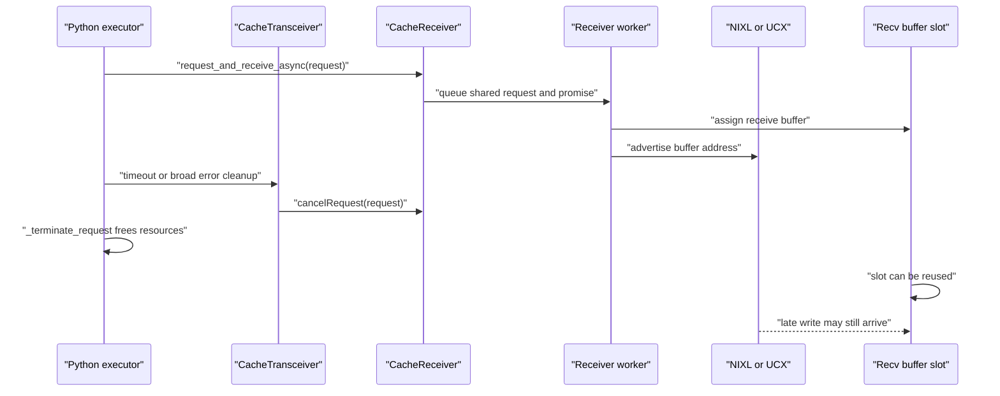
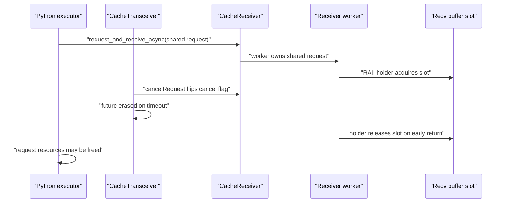
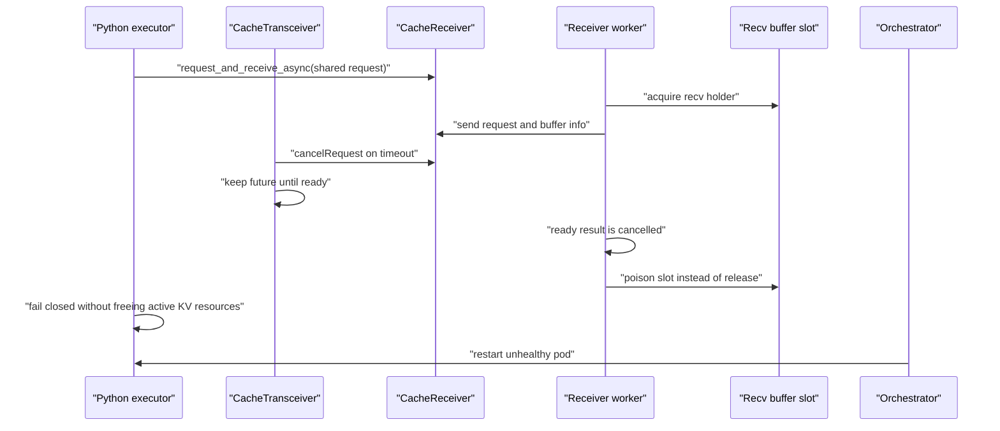

# Disaggregated KV transfer cancellation safety

This note documents the cancellation contract added on top of the rc11
disaggregated-transfer recovery work.  The contract is intentionally
fail-closed: when TRT-LLM cannot prove transport quiescence, it must not return
advertised transfer buffers or in-flight KV resources to normal serving.

## Problem

`cancelRequest()` and backend-handle release are not a global quiescence proof.
For Agent/NIXL transfers, the receiver may have already advertised a GPU
receive buffer to the sender.  If a timeout or Python cleanup path frees that
request while the sender or NIXL worker may still write, the write can land in a
buffer slot that has been reused for another request.

The same issue appears on the sender side for cancellation while `sendAllBuffers`
is still using the preallocated send slot: releasing the slot back to the pool
is only safe after the transfer has completed or failed with a known quiescent
state.

## Main / unsafe lifetime

## PR 13713 lifetime

PR 13713 fixes the raw `LlmRequest*` lifetime issue by keeping shared
references in the C++ tracker and worker paths.  It also makes several waits
cancellable and adds RAII release for buffer-index slots.  That prevents the
observed OOM/leak class, but RAII `release()` still returns a slot to the pool
even when transport quiescence is unknown.

## This PR lifetime

This PR separates three outcomes:

1. Explicit peer not-ready: no data phase will write; the receive slot can be
   released normally.
2. Worker future ready: C++ has observed worker quiescence; the tracker can be
   erased.
3. Local cancel, timeout, missing notification, or exception while a buffer is
   advertised: quiescence is unknown; poison the buffer pool and fail the
   executor closed so orchestration restarts the pod.

## Code-level contract

- `BufferIndexHolder::release()` is only for proven safe paths.
- `BufferIndexHolder::poison()` marks the corresponding send or receive pool
  poisoned and does not return the slot to the pool.
- `BaseTransBufferManager::assignBufferIndex*()` fails once a pool is poisoned.
  This prevents continued serving on memory whose transport quiescence is
  unknown.
- `CacheReceiver::Impl::receiveReadySignalDetailed()` distinguishes explicit
  peer not-ready from local cancellation or missing notification.
- `CacheReceiver::Impl::requestSync()` poisons advertised receive slots on
  local cancel or exception.
- `CacheFormatter::format()` poisons an Agent send slot if `sendAllBuffers`
  exits through an exception.
- Direct zero-copy sends from request-owned KV blocks are disabled for
  cancellable disaggregated transfers until KV-block leases can prove sender
  quiescence before the request is freed.
- `CacheTransceiver::checkGenTransferStatus()` no longer erases a generation
  receive future on timeout until the worker future becomes ready.
- Python `_handle_errors()` and timeout cleanup fail closed for in-flight
  disaggregated transfers instead of freeing active request resources while
  quiescence is unknown.

The result is not an in-process NIXL/UCX deadlock repair.  It is a memory-safety
and operability boundary: no unsafe buffer reuse, no unbounded leak from
continuing to serve on poisoned transfer memory, and a clear restart signal for
health checks.
