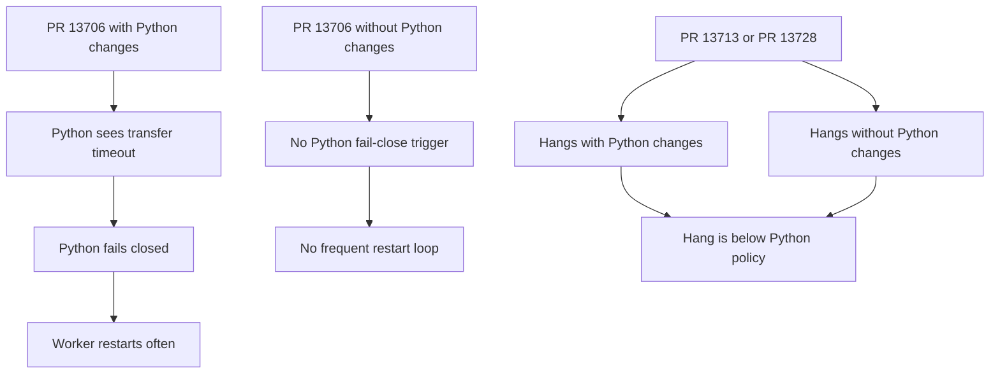
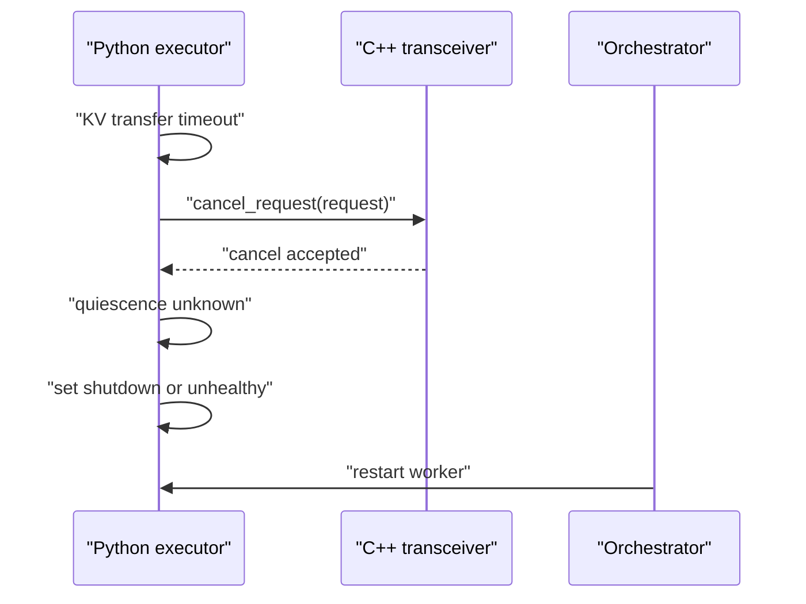
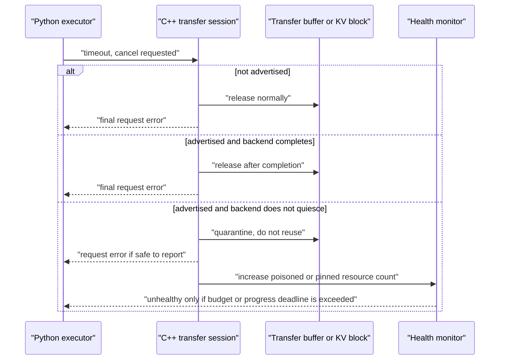

# Disaggregated KV transfer restart and hang analysis

This note summarizes the latest behavior observed across PR 13706, PR 13713,
and PR 13728, then proposes the fix direction that avoids both unsafe memory
reuse and permanent serving hangs.

## Observed behavior

The latest tests split the failure into two different classes:

| Change set | `py_executor.py` changes included | Observed behavior | Immediate implication |
| --- | --- | --- | --- |
| PR 13706 | yes | frequent prefill worker restarts | The Python policy is too aggressive and turns common in-flight transfer timeouts into process-level fail-close events. |
| PR 13706 | no | no frequent restarts | The C++ side alone is not what triggers those restart loops. |
| PR 13713 | yes | hangs | The hang is not explained only by Python fail-close behavior. |
| PR 13713 | no | hangs | There is still a lower-level C++ or transport progress problem. |
| PR 13728 | yes | hangs | The added Python containment does not repair the lower-level hang. |
| PR 13728 | no | hangs | The lower-level hang persists independently of Python cleanup policy. |

The PR 13706 result tells us that per-request Python fail-close is the wrong
default policy. It can be useful as an emergency containment mechanism, but it
is too blunt when it fires for routine transfer timeouts or cancellable races.

The PR 13713 and PR 13728 results tell us something different: removing the
Python policy is not sufficient. If those images still hang without the
`py_executor.py` changes, then at least one C++ or backend path can still stop
making progress without surfacing a final request error.

## Relevant code paths

The Python-side restart behavior comes from timeout and cleanup paths around:

- `PyExecutor._check_kv_transfer_timeout()` in
  `tensorrt_llm/_torch/pyexecutor/py_executor.py`: marks in-flight context or
  generation transfers as timed out.
- `PyExecutor._check_disagg_ctx_cache_transfer_status()`: observes timed-out
  context transfers and calls `kv_cache_transceiver.cancel_request(request)`.
- `PyExecutor._handle_responses()`: observes timed-out generation transfers and
  calls `kv_cache_transceiver.cancel_request(request)`.
- The PR 13706-style Python policy then treated unknown quiescence as a fatal
  executor condition, cleared active queues, and made the worker exit or become
  unhealthy.

The lower-level hang behavior must be analyzed around the C++ transfer
progress paths:

- `CacheTransceiver::checkContextTransferStatus()` and
  `CacheTransceiver::checkGenTransferStatus()` in
  `cpp/tensorrt_llm/batch_manager/cacheTransceiver.cpp`.
- `CacheSender::Impl` and `CacheReceiver::Impl` in
  `cpp/tensorrt_llm/batch_manager/dataTransceiver.cpp`.
- Transfer-buffer assignment and release in
  `cpp/tensorrt_llm/batch_manager/baseTransBuffer.cpp`.
- Agent/NIXL calls reached through
  `cpp/tensorrt_llm/executor/cache_transmission/agent_utils/connection.cpp`.

If a PR hangs with Python cleanup removed, the main event loop is either still
blocking on a C++ wait, or C++ has stranded an in-flight request/future without
making it observable as ready, error, or unhealthy.

## Why the restart-only fix is not acceptable

A pure fail-closed policy is memory safe, but it is operationally noisy:

This avoids reusing memory that a transport may still write, but it restarts on
events that are not necessarily fatal. Under bursty traffic, cancellations, or
slow backend progress, that can turn a recoverable per-request timeout into a
cluster-wide restart loop.

## Why the C++-only fix is not sufficient

A C++-only approach can improve lifetime and avoid some leaks, but the latest
PR 13713 and PR 13728 observations show that it can still hang. That means the
implementation still lacks at least one of these properties:

- every transfer future eventually becomes ready, error, or explicitly
  abandoned with a health signal;
- no executor-facing status function blocks on a future or backend wait unless
  the caller explicitly requested blocking behavior;
- cancellation has a final state that distinguishes "safe to free" from
  "cancel requested but remote writes may still exist";
- poisoned or quarantined resources are bounded and converted into an
  explicit unhealthy signal before the executor silently starves.

## Proper fix direction

The fix should separate three concepts that the earlier PRs mixed together:

1. Request failure: the user request can receive a timeout or network error.
2. Resource quiescence: C++ has proof that no sender, receiver, or backend
   worker can still touch the request's KV blocks or transfer buffers.
3. Process health: the worker should restart only when the backend or resource
   pool is no longer capable of safe progress.

### 1. Python should not fail-close per request

Python should keep these responsibilities:

- mark transfer start time;
- mark a request timed out after `kv_transfer_timeout_ms`;
- call `cancel_request()` once for a timed-out transfer;
- avoid `_terminate_request()` while the request is still in a disaggregated
  transfer state;
- report a request-level error only when C++ reports a final transfer state.

Python should not set global shutdown or clear serving queues solely because a
single in-flight transfer timed out. That is the PR 13706 restart-loop trigger.

### 2. C++ should own transfer sessions until final state

C++ needs a transfer-session concept, explicit or equivalent, that owns all
objects needed by the in-flight transfer:

- a `shared_ptr<LlmRequest>`;
- receive or send buffer-index leases;
- any request-owned KV-block lease needed by direct or zero-copy paths;
- the promise/future pair;
- cancellation state and timeout deadline.

The session can release resources only on proven-safe outcomes:

| Outcome | Safe action |
| --- | --- |
| Completed transfer | release buffers and KV-block leases |
| Peer returned explicit not-ready before data phase | release buffers |
| Cancelled before buffer advertisement | release buffers |
| Worker future ready with structured error | release or quarantine according to where the error occurred |
| Timeout after buffer advertisement and no backend completion | quarantine or poison advertised resources |
| Backend worker wedged or future never resolves | keep resources pinned or quarantined and raise health signal |

The important rule is that `cancel_request()` must not mean "safe to free".
It should return a structured result such as:

- `not_found`;
- `already_complete`;
- `cancelled_before_advertise`;
- `cancel_requested_in_flight`;
- `backend_unhealthy`;
- `not_cancellable`.

Only the first three can permit immediate Python cleanup. The in-flight cases
must remain owned by C++ until a final status arrives or until the resource is
quarantined and the process is marked unhealthy.

### 3. C++ status checks must be non-blocking by default

The executor-facing status functions should be polling APIs:

- `checkContextTransferStatus(0)` and `checkGenTransferStatus(0)` must not
  block on an unready future.
- `atLeastNum=1` should skip unready futures rather than calling `future.get()`
  on a selected-but-unready entry.
- Timeout handling should mark the transfer session cancelled or failed, but
  should not erase the tracking future until the worker reaches a final state.
- Blocking behavior should exist only for explicit drain/shutdown paths.

If a backend call can block indefinitely inside NIXL or UCX, it must not run on
the Python event-loop thread. If it runs on a dedicated worker and wedges, the
event loop must still be able to observe "no progress" and produce a health
signal.

### 4. Quarantine should be bounded and health-driven

Quarantine or poisoning is still needed for memory safety after a buffer has
been advertised to a peer and quiescence is unknown. But poisoning should not
immediately restart the worker for a single request unless no safe capacity
remains.

Recommended policy:

- pre-advertise cancellation releases normally;
- post-advertise unknown-quiescence quarantines the specific buffer or transfer
  slot;
- the transceiver refuses to reuse quarantined resources;
- if the number of quarantined slots or pinned KV blocks exceeds a small budget,
  or if no transfer progress occurs for a global backend deadline, mark the
  transceiver unhealthy;
- health failure should be explicit and observable, so orchestration restarts
  the worker instead of the server silently hanging.

This policy avoids both bad extremes:

- it does not free or reuse memory that may still be touched by the transport;
- it does not restart the worker for every ordinary timeout.

## Expected behavior after the proper fix

| Scenario | Expected result |
| --- | --- |
| Ordinary successful transfer | request completes and resources release normally |
| User cancellation before transfer advertisement | request fails or cancels; resources release normally |
| Timeout before transfer advertisement | request fails; resources release normally |
| Timeout after advertisement but backend later completes | request fails; resources release after worker final state |
| Timeout after advertisement and backend never completes | resource is quarantined; server keeps serving if capacity remains |
| Repeated non-quiescing transfers exhaust quarantine budget | worker becomes unhealthy and restarts with a clear reason |
| NIXL or UCX internal deadlock | no silent hang; health fails after progress deadline unless the backend root cause is fixed |

## Recommended implementation order

1. Remove the per-request Python fail-close behavior from PR 13706-style
   branches. Keep only the "do not terminate while transfer is in progress"
   guard.
2. Make C++ cancellation/status return a structured final-state enum instead
   of a boolean.
3. Keep futures and transfer sessions tracked until the worker reaches ready,
   error, or quarantined final state.
4. Add bounded quarantine counters for advertised transfer buffers and any
   request-owned KV-block leases.
5. Add a transceiver health state that flips only when quarantine capacity is
   exhausted or backend progress is absent past a global deadline.
6. Ensure ADP response enqueueing uses the synchronized pending-response flush
   path from PR 13112 when testing on rc13-derived images.
7. Add regression tests for:
   - PR 13706-style timeout bursts without restart loops;
   - PR 13713/13728-style C++ path without Python changes, proving status APIs
     return error or unhealthy instead of hanging;
   - advertised-buffer timeout followed by block reuse, proving the block is
     quarantined and not reused;
   - ADP response flush, proving all ranks enter response collectives together.

## Bottom line

The Python fail-close policy explains PR 13706's frequent restarts, but it does
not explain PR 13713 or PR 13728 hanging without Python changes. The correct
solution is therefore not "more Python fail-close" and not "C++ lifetime only".

The correct solution is a C++ transfer-session lifecycle with structured cancel
states, non-blocking status polling, bounded quarantine for unknown-quiescence
resources, and an explicit health signal only when safe serving capacity or
backend progress is genuinely lost.
