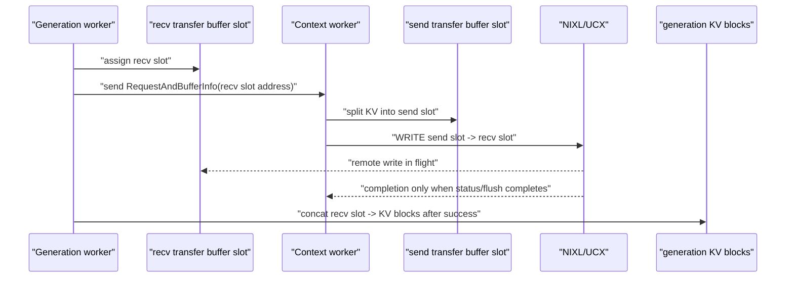

# Disaggregated KV Transfer Poisoning Contract

This note documents the safety contract used when a disaggregated KV-cache
transfer is cancelled or fails before the transport can prove completion.

## Rule

A memory range handed to UCX/NIXL as an in-flight transfer source or destination
must not be returned to any TRT-LLM pool until transfer quiescence is proven.
If quiescence is unknown, the range is poisoned and the process must restart.

`TransferStatus::release()` is a backend handle cleanup request. It is not a
memory quiescence proof. In particular, UCX-backed NIXL may accept local request
release while a one-sided transfer is still not globally known to be stopped.

## C++ NIXL Staged Path

The C++ NIXL Agent path registers TRT-LLM transfer-buffer slots as `kVRAM` and
uses NIXL `WRITE` into the receiver's preassigned transfer buffer. The remote
write target is the transfer buffer first; actual KV blocks are touched later by
the local concat kernel after receive success.

If cancellation interrupts the context-side `WRITE` before completion, the send
slot is poisoned locally. If the generation side observes an exception after it
has advertised preassigned receive slots, those receive slots are poisoned
locally. Poisoned slots are never returned to the pool; later assignments fail
fast so orchestration can restart the process instead of reusing unsafe memory.

## Direct-to-KV Paths

Some paths hand actual KV-block memory to the transport:

- C++ UCX zcopy uses `block->data()` directly.
- Native Python/NIXL registers KV cache pools and builds `WRITE` descriptors
  from actual KV slot addresses.

For those paths, the poisoned range is an actual KV block or KV-pool slot. A
future hardening pass should either disable direct-to-KV transfer for cancellable
traffic or add KV-block leases with the same fail-closed behavior used for C++
transfer-buffer slots.

## Operational Contract

Poisoning intentionally trades availability for memory safety:

1. If completion is proven, release the lease normally.
2. If completion is not proven, poison the memory range.
3. Refuse future assignments from the poisoned pool.
4. Restart the process to reclaim the quarantined memory.

This prevents stale UCX/NIXL writes from landing in memory that has been
reassigned to another request, and prevents silent pool shrinkage from turning
into an unbounded OOM pattern.
