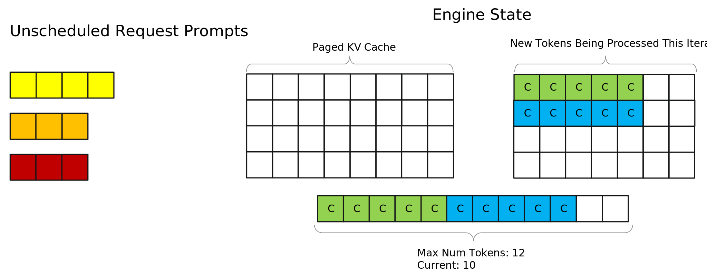
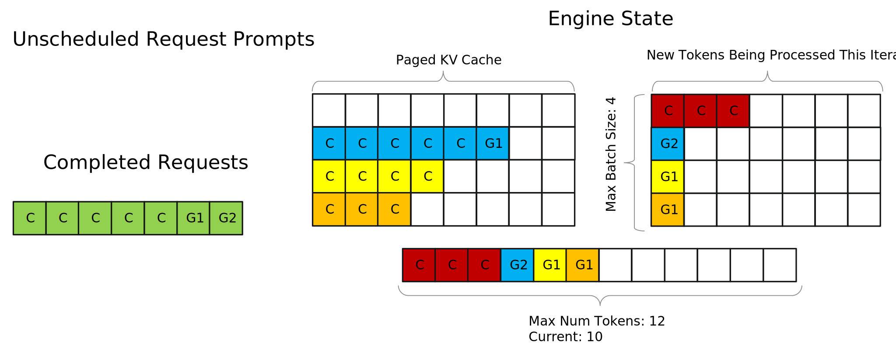

# Paged Attention, IFB, and Request Scheduling

## In-flight Batching

TensorRT LLM supports in-flight batching of requests (also known as continuous
batching or iteration-level batching) for higher serving throughput. With this feature,
sequences in the context phase can be processed together with sequences in the
generation phase. The purpose of that technique is to better interleave
requests to reduce latency as well as make better use of the GPUs.
For efficiency reasons (1), the support for inflight batching ***requires the
input tensors to be packed (no padding)***.

***In the current implementation, the sequences that are going through the
context phase must come before the sequences in the generation phase in the input
tensor. For example, for sequences `S0`, `S1` and `S2`, if `S0` and `S2` are in
context phase (and `S1` in generation), tokens from `S0` and `S2` must appear
before the tokens of `S1` in the input tensor***. The constraint may or may not
be relaxed in a future version.

_(1) Padding sequences in the generation phase that contain a single token to
the length of the maximum input sequence is inefficient use of resources.

### `max_batch_size`, `max_seq_len` and `max_num_tokens`

<p align="center">
    
</p>

#### `max_batch_size`

`max_batch_size` defines the maximum number of requests that the engine can handle.​

It controls the maximum number of requests that can be scheduled at runtime.

Set a sufficiently high  `max_batch_size` when building the engine so that it does not become the bottleneck of the throughput, and use runtime `max_batch_size` to tune throughput or latency without rebuilding the engine.

#### `max_seq_len`

`max_seq_len` defines the maximum sequence length of single request​

Starting from TensorRT LLM v0.11, when `--remove_input_padding` and `--context_fmha` are enabled, `max_seq_len` can replace `max_input_len` and `max_output_len`, and is set to `max_position_embeddings` by default.

Use default `max_seq_len` (which is `max_position_embeddings`), no need to tune it unless you are very sure what max sequence lengths would be on your workloads. If GPU memory is so limited that it cannot support even one request reaching `max_seq_len`, you need to reduce it.

#### `max_num_tokens`

`max_num_tokens` defines the maximum number of batched input tokens after padding is removed in each batch.​

`max_num_tokens` is set to 8192 by default starting from v0.11. You can tune it using the runtime `max_num_tokens` without re-buliding the engine. It is recommended to tune `--max_num_tokens` for better performance.

The maximum number of tokens will not take effect when input padding is not removed. When input padding is removed, the tokens from different sequences are
packed together and the maximum number of the tokens can be set to a different
(lower) value, which by default is 8192.

There are two aspects that must be considered. Firstly, some input sequences
will be shorter than the maximum input length. Secondly, when in-flight
sequence batching is enabled, requests in context phase will be executed with
requests in generation phase. Those latter requests produce a lot fewer tokens
than `max_input_len` (at most, `beam_width` tokens).

Using a more realistic value for `max_num_tokens` allows TensorRT LLM to
allocate more memory to store the KV cache and execute more requests together.
It leads to an increased efficiency.

Increasing `max_num_tokens` appropriately will be beneficial to performance.
When increasing `--max_num_tokens` to some point, GPU utilization will plateau,
going beyond that saturation point may hurt both first token latency as well as
total end-to-end latency.


## Chunked Context (a.k.a Chunked Prefill)

The original behavior was to process all context tokens at once. However, this feature splits the context into several chunks. In this way, the
context chunks can be batched with more tokens during the generation phase,
which should increase overall throughput. Chunking contexts also removes
constraints on input length. To enable this feature, the FMHA paged kv-cache also
needs to be enabled. Except for the last chunk, the size of each context chunk needs to be an integer multiple of the kv-cache block size.

## KV Cache

In the generation phase, a common optimization is to provide the MHA kernel
with a cache containing the values of the past K and V elements that have
already been computed.  That cache is known as the KV cache. TensorRT LLM uses
that technique to accelerate its generation phase. In TensorRT LLM, there is
one KV cache per Transformer layer, which means that there are as many KV
caches as layers in a model. The current version of TensorRT LLM supports two
different types of KV caches: **contiguous** and **paged** KV caches.

### Contiguous KV Cache

The contiguous KV cache is a monolithic tensor. Its shape is:
```
[max_batch_size * max_beam_width, 2, num_heads, max_seqlen, hidden_dim_per_head].
```

This implementation uses much more memory than needed when sequences are shorter than the maximum sequence length. Even if they approach the limit after generating many output tokens, it may take many steps to reach that point.

### Paged KV Cache

The paged KV cache decomposes the KV cache into blocks that are distributed to
the different requests by a cache manager during processing. That cache manager
keeps track of the sequences, allocates new blocks from a pool, and recycles those blocks when required. See the simplified implementation of
[`tensorrt_llm.runtime.KVCacheManager`](source:tensorrt_llm/runtime/kv_cache_manager.py).
A more efficient C++ implementation is included in the
[Batch Manager](source:cpp/include/tensorrt_llm/batch_manager).

## The schedulers

This section visualizes how TensorRT LLM schedules requests based on max-batch size and max-num tokens. The example starts out with a newly initialized engine as well as a few unscheduled requests that have come in. For the sake of this example, toy values are set to `max batch size = 4` and `max num tokens = 12`. Each square block represents a token, and its color represents which request it belongs to.


Now the scheduler takes the first two requests, Request 1 and Request 2, and schedules them to execute the context phase. However, it cannot schedule any more requests because the prompts of the first two requests had 5 tokens each, leaving a budget of 2 tokens due to the max num tokens limit. Since all remaining requests have more than 2 prompt tokens none of them can be scheduled (context chunking can help in this situation, see the paged context attention section below). The tokens are marked with a "C" on them to represent that they are prompt tokens that were processed in the context phase.

> Note: The tokens for different requests are shown on different rows simply for visualization purposes and are not representative of actual memory layouts



Now the engine runs an iteration of execution, completing the context phases for both of the scheduled requests. After it is done, the kv-cache of the prompts for both requests have been created and the first token has been generated. Tokens that were generated are marked with "G(n)" - for example a token marked "G1" represents that it is the first token generated for its request.

TRT-LLM prioritizes scheduling requests in generation phase first so the two generated tokens are queued to be processed in the next iteration. Now, since the two previously scheduled requests have entered generation phase and only take up two tokens out of the max num token budget of 12, the scheduler is able to schedule two additional requests, Request 3 and Request 4. It cannot schedule the last request, Request 5, even though there is space for it in the max num tokens budget because of the max batch size limit of 4.


After the next iteration of execution, the second tokens for Requests 1 and 2 have been generated, and the first tokens for Request 3 and 4 have been generated. Let's say that G2, which was generated for Request 1, is the stop token signifying that Request 1 is completed. In this case the scheduler would evict Request 1 before performing another execution iteration and prepare to return it to the user. This eviction puts the state of the engine below the max batch size limit and allows Request 5 to be scheduled.

Also note that G1, which was generated for Request 2, has been added to the kv-cache for Request 2, illustrating how the kv-cache for a request grows as more tokens are generated.



Overall, the max batch size and max num tokens limits play a key role in determining when requests are executed. Tuning these parameters can significantly impact throughput, as well as how the engine balances previously scheduled requests in the generation phase with new requests in the context phase.

> Note: This presents a simplified visualization of the scheduler to highlight how max batch size and max num tokens affect it. The scheduler also considers things like amount of free memory available to be used for kv-cache and has other configurable options that can affect its behavior. See the Runtime Flags of the Additional Options page for more on this.

## Revisiting Paged Context Attention and Context Chunking

Previously we recommended enabling paged context attention even though in our case study it didn't affect performance significantly. Now that we understand the TensorRT LLM scheduler, we can explain why this is beneficial. In short, we recommend enabling it because it enables context chunking, which allows the context phase of a request to be broken up into pieces and processed over several execution iterations, allowing the engine to provide a more stable balance of context and generation phase execution.

The [visualization](#the-schedulers) of the TensorRT LLM scheduler showed that initially Request 3 couldn't be scheduled because it would put the scheduler over the max-num tokens limit. However, with context chunking, this is no longer the case, and the first chunk of Request 3 can be scheduled.


This is extremely beneficial for several reasons. First, it eliminates the possibility of requests with large prompts (relative to max num tokens) not being scheduled due to other requests already in-flight. In production workloads, this can help improve worst case TTFT numbers. Second, it allows for setting smaller values of max num tokens, since you no longer need max num tokens to be at least as large as the longest prompt you want to support. For long-context cases this is extremely important, because setting extremely large values of max-num tokens takes away from memory available to be used as kv-cache. Given that, in the worst-case scenario, chunked context has minimal impact on performance but can significantly benefit it in many situations, NVIDIA recommends that you always enable it.
