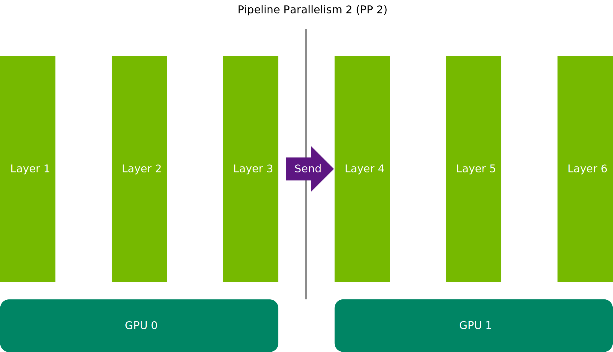
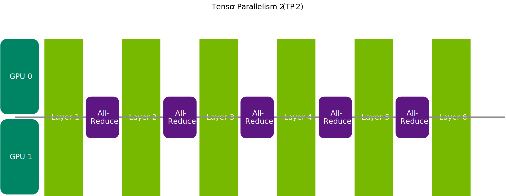

(deciding-model-sharding-strategy)=

# Deciding Model Sharding Strategy

Large models often can't fit on one GPU and need to be sharded across multiple GPUs. The sharding strategies used to accomplish this can have significant impacts on performance. This guide walks through how to determine if tensor parallelism, pipeline parallelism, or a mix of both are the best strategy for you. If you are not familiar with tensor parallelism and pipeline parallelism please refer to [Mastering LLM Techniques - Inference Optimization](https://developer.nvidia.com/blog/mastering-llm-techniques-inference-optimization/)


## How to Think about Model Sharding: Communication is Key

Splitting your model weights between multiple GPUs requires them to communicate activations between each other, adding additional overhead. How expensive this overhead is on your system is the key factor in determining the best strategy for you.

In pipeline parallelism, the model is split into sets of contiguous layers and each GPU houses one of these sets. In this setup, the only required communication is for each GPU to send the outputs of its set to the GPU with the next set.




 On the other hand, tensor parallelism takes each layer of the model and splits it between the GPUs. This means that every GPU houses a portion of every layer. However since each layer needs the full outputs of the previous layer as an input, each GPU has to perform the heavier All-Reduce communication operation to share its results with all other GPUs before it can begin processing the next layer. While this seems disadvantageous, because each GPU only holds partial layers, it also performs smaller matrix multiplications, allowing it to compute its outputs quicker.

 


 Ultimately deciding the best strategy comes down to whether the extra overhead from the All-Reduce operation overshadows the gains from the smaller matrix multiplications. If the interconnects between the GPUs are sufficiently fast, the gains from the reduced computation burden per layer can outweigh the additional communication cost. Consequently, a general rule of thumb is that if your GPUs have fast connections between them like NVLink then tensor parallel is likely a good choice. However if the communication will go over slow connections (across nodes for example) pipeline parallel is likely better. Overall we provide the following guidelines:

**If your model fits on one gpu:** Unless you have a very specific reason, don't shard your model. The best communication overhead is no communication overhead.

**If your model fits in one node:** Tensor parallel is likely the best option here, especially if you have fast connections between the GPUs like NVLink. If you don't, then pipeline parallel might be needed. Start with tensor parallel and sanity check if pipeline parallel is better.

**If your model is sharded across multiple nodes:** Inter-node connections are typically significantly slower than intra-node connections, so if you have tensor parallelism across nodes it will be bottlenecked by the slow interconects. Consequently, a good starting point is having tensor parallelism within the node and pipeline parallelism between nodes. An exception is if you are running on NVL36 or NVL72 Blackwell systems. These have multinode NVLink so as long as you stay within the 36 or 72 GPUs, tensor parallel won't be bottlenecked by inter-node connections.

## How to set Tensor Parallelism and Pipeline Parallelism

The `LLM` class takes `tensor_parallel_size` and `pipeline_parallel_size` as parameters. `tensor_parallel_size * pipeline_parallel_size` should be equal to the total number of GPUs you are sharding the model over, referred to as the world size. For example, if you were sharding a model over 2 nodes, each with 16 GPUs, you might set tensor parallel to 8 (for tensor parallelism within the node) and pipeline parallel to 2 (pipeline parallel between nodes) like this:

```python
    llm = LLM(
        model="/scratch/Llama-3.1-405B-Instruct",
        tensor_parallel_size=8,
        pipeline_parallel_size=2
    )
```

If you are using the [CLI flow for building engines](./benchmarking-default-performance.md#building-and-saving-engines-via-cli) you can specify tensor parallelism and pipeline parallelism by providing the `--tp_size` and `--tp_size` arguments to `convert_checkpoint.py`

```
python examples/models/core/llama/convert_checkpoint.py --model_dir ./tmp/llama/405B/ \
                            --output_dir ./tllm_checkpoint_16gpu_tp8_pp2 \
                            --dtype float16 \
                            --tp_size 8
                            --pp_size 2
```
