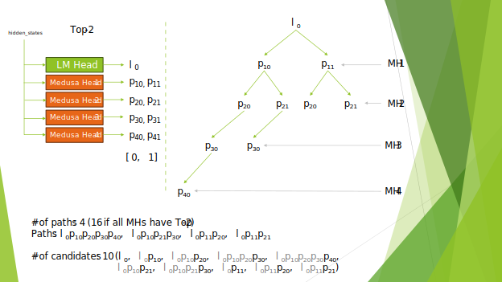

# Speculative Sampling

Speculative Sampling (also referred to as Speculative Decoding) is a set of techniques designed to allow generation of more than one token per forward pass iteration. This can lead to a reduction in the average per-token latency **in situations where the GPU
is underutilized due to small batch sizes.**

Speculative Sampling involves predicting a sequence of future tokens, referred to as draft tokens, using a method
that is substantially more efficient than repeatedly executing the target Large Language Model (LLM).
These draft tokens are then collectively validated by processing them through the target LLM in a single forward pass.
The underlying assumptions are twofold:

1. processing multiple draft tokens concurrently will be as rapid as processing a single token
2. multiple draft tokens will be validated successfully over the course of the full generation

If the first assumption holds true, the latency of speculative decoding will no worse than the standard approach. If the second holds, output token generation advances by statistically more than one token per forward pass.
The combination of both these allows speculative decoding to result in reduced latency.

TensorRT-LLM supports several approaches for generating draft tokens, including:
1. Utilizing a smaller, auxiliary model, known as the draft model approach. For more information, refer to the [Fast Inference from Transformers via Speculative Decoding paper](https://arxiv.org/pdf/2211.17192.pdf).
2. Implementing additional language model heads that predict tokens for future positions, as detailed in the [Medusa: Simple LLM Inference Acceleration Framework with Multiple Decoding Heads paper](https://arxiv.org/abs/2401.10774).

## Performance Improvements

It's important to note that the effectiveness of speculative decoding techniques is highly dependent
on the specific task at hand. For instance, forecasting subsequent tokens in a code-completion scenario
may prove simpler than generating a summary for an article.

Furthermore, when integrating Medusa with a standard PyTorch model implementation which may not be as finely
tuned as TensorRT-LLM, the potential time savings are more pronounced.

# Draft Model Approach

The Draft model approach involves the use of two distinct models trained independently
but sharing the same vocabulary: a smaller Draft model and a larger Target model.
For example, a GPT 125M model can serve as the Draft model, while a GPT 6.7B model acts as the Target model.

The management of Draft and Target models is facilitated through two separate `GptManager` instances.
It is essential that you to coordinate the interactions between the Draft and Target models effectively.
Initially, the Draft model is queried to generate up to `K` draft tokens.
These tokens are then forwarded to the Target model for verification.
Upon verification, the Target model may return up to `K+1` tokens.
Subsequently, the prompt, now updated with the accepted tokens, is sent back to the Draft model to initiate the generation of new draft tokens.
This iterative process continues until a predefined stop conditions are met.
An example of this orchestration process can be found in the [TensorRT-LLM Triton backend](https://github.com/triton-inference-server/tensorrtllm_backend/blob/main/inflight_batcher_llm/client/e2e_grpc_speculative_decoding_client.py).

Configuring and executing the Draft model within the Inflight Fused Batching (IFB) framework
follows the same procedure as for any other model within IFB.
The `maxNewTokens` parameter should be set to the number of draft tokens in the `LlmRequest` for the Draft model query.

When building the Target model, it is necessary to specify the `--max_draft_len <K> --speculative_decoding_mode draft_tokens_external` option to the `trtllm-build` command.
During the Target model's inference phase in IFB, `maxNewTokens` should be set to `1`,
and the draft tokens must be set in the `draftTokens` field of the `LlmRequest` for the Target model query.

**NOTE:** To enhance performance, especially due to the repetitive querying of Draft and Target models with requests that share a common prefix,
it is advisable to enable KV cache reuse for both models.
This can be achieved by adding the `--use_paged_context_fmha=enable` flag to the `trtllm-build` command
and setting `enableBlockReuse=true` in the `KVCacheConfig`.

# Medusa

This approach leverages a single model to both generate and verify draft tokens.
It enhances the existing model by adding multiple extra language model heads, known as Medusa heads.
These additional heads are trained to predict future tokens while the base model remains unchanged.
Specifically, the first Medusa head is tasked with predicting the immediate next token,
the second head predicts the token after that, and so on.
With `K` Medusa heads, the model can forecast up to `K` tokens ahead.
The draft tokens generated by the Medusa heads during iteration `i`
are then verified and potentially accepted in the subsequent iteration, `i+1`.

The true potential of the Medusa strategy is realized when more than one token per head is used,
employing a TopK approach to create multiple potential paths, essentially forming a tree, rather than
a single linear path as seen in the Draft model approach. To reduce redundant computations, many of these paths,
which often share common prefixes, are consolidated into a single path.
This is achieved by applying attention with a sparse mask that represents the various paths. Sparse mask formed by Medusa tree is described in detail later.

By validating multiple paths simultaneously, there is an increased likelihood of accepting more than one token per iteration,
albeit at the expense of additional computational effort.

It is crucial to recognize that as the number of potential paths grows exponentially with `K`,
it is not necessary to explore or validate all of them. A recommended strategy for managing this complexity is to prune the tree
by focusing only on the paths with higher-probability tokens.

You must strike a balance between the breadth and depth of the tree you want to explore and the impact of a larger tree on the overall
performance for your specific application.

In the TensorRT-LLM implementation of Medusa, the configuration of the tree is a runtime parameter.
This flexibility allows you to experiment and identify the optimal tree structure for your use case,
which can then be utilized in a production environment.

## Medusa Tree

Consider the following diagram, which illustrates how the hidden states from the last layer of the base model
are passed to the base model's language model (LM) head and to four Medusa heads (MHs).

    

In this example:

1. The token <code>l0</code> represents the actual token generated by the model.
All other tokens, denoted as <code>phk</code>, are predictions from the MHs,
where `h` indicates the Medusa head index (1-based) and `k` represents the TopK choice index (0-based).
1. Four MHs are used, which means the model is predicting four future tokens.
2. The first two MHs utilize Top-2 predictions, while the last two use Top-1.
For instance, <code>p10</code> and <code>p11</code> are the top and
second top predictions from the first Medusa Head (MH1).
1. A total of four paths are explored, which is fewer than the 16 that would be examined
if a complete binary tree were used (assuming Top-2 predictions for all MHs).
1. As some of these paths may be accepted, there are ten potential candidates, referred to as `medusa_choices`.
The number of tokens that can be accepted at each step, including the true token,
ranges from 1 (if all Medusa predictions are incorrect) to 5 (if all are correct).

During the generation phase, the model receives an input of 10 tokens,
which corresponds to the last tokens of each candidate path, rather than just one.

In TensorRT-LLM, you have the option to define such trees by providing all the Medusa choices
or by simply specifying the unique paths.

- Since each candidate/path begins with the true token (<code>l0</code>),
there is no need to specify it separately. For the predicted tokens, only the TopK indices are required.
- For example, to specify the path <code>l0p10p21p30</code>,
one would use `[0,1,0]`. And
to specify the path <code>l0p11p20</code>,
one would use `[1,0]`.
- To specify all 4 paths in the example, use `medusa_choices=[[0,0,0,0], [0,1,0], [1,0], [1,1]]`.
- It's also possible to specify all candidates explicitly, similar to the Medusa repository.
For instance, `medusa_choices=[[0], [0,0], [0,0,0], [0,0,0,0], [0,1],
[0,1,0], [1], [1,0], [1,1]]`. Note that when specifying all the candidates explicitly, **we don't include
the empty `[]` candidate** for the case where only the true token is accepted, that is, all the predictions from MHs are wrong.
So, only `9` candidates are specified.

**Specifying paths-only instead of all choices is currently supported only in the Python runtime.**

## Using Medusa with TensorRT-LLM

For guidance on constructing and executing Medusa with the Python runtime, consult the [Medusa README](../../examples/medusa/README.md). When utilizing the Inflight Fused Batching (IFB) with the C++ API, it is necessary to define the `medusa_choices` explicitly within the model configuration. For detailed instructions, refer to the [model configuration in TensorRT-LLM backend](https://github.com/triton-inference-server/tensorrtllm_backend?tab=readme-ov-file#modify-the-model-configuration) for more details.

### Limitations

- TensorRT-LLM supports Medusa only for Vicuna (fine tuned LLaMA).
However, similar to any new model, you can follow the same approach to define your own Medusa model and deploy with TensorRT-LLM.
- We match only tokens during the validation phasem that is `medusa_temperature=0`.
- Beam search is **not** compatible with Medusa.
