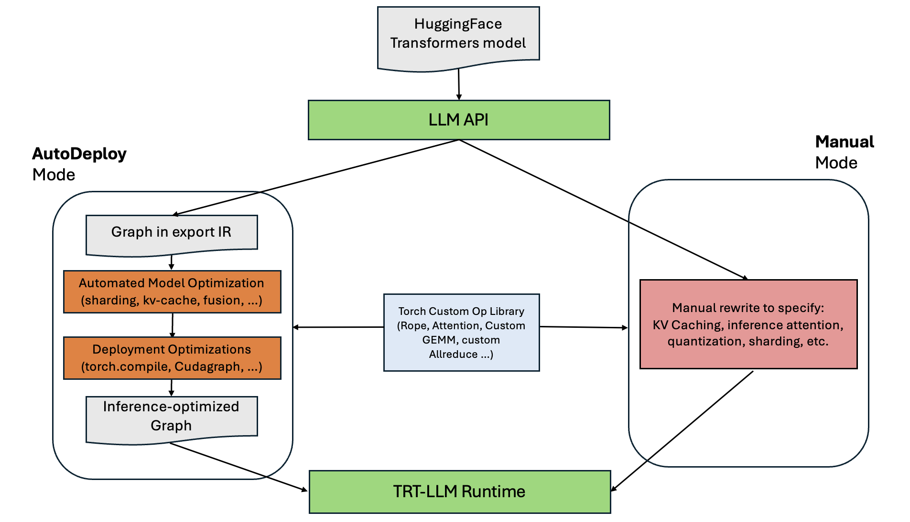

# AutoDeploy

```{note}
Note:
This project is in active development and is currently in a prototype stage. The code is experimental, subject to change, and may include backward-incompatible updates. While we strive for correctness, we provide no guarantees regarding functionality, stability, or reliability.
```

<h4> Seamless Model Deployment from PyTorch to TRT-LLM</h4>

AutoDeploy is a prototype designed to simplify and accelerate the deployment of PyTorch models, including off-the-shelf models like those from HuggingFace transformers library, to TensorRT-LLM.


<sub><em>AutoDeploy overview and relation with TensorRT-LLM's LLM API</em></sub>

AutoDeploy provides an alternative path for deploying models using the LLM API that does not require users to rewrite the source model (e.g., HuggingFace Transformers models) or manually implement various inference optimizations such as KV-caches, multi-GPU parallelism, quantization, etc. Instead, AutoDeploy extracts a computation graph from the source model and applies inference optimizations through a series of automated graph transformations. AutoDeploy generates an inference-optimized graph that can be directly executed in the TensorRT-LLM PyTorch runtime and leverages various runtime optimizations including in-flight batching, paging, and overlap scheduling.

### **Key Features:**

- **Seamless Model Translation:** Automatically converts PyTorch/Hugging Face models to TRT-LLM without manual rewrites.
- **Unified Model Definition:** Maintain a single source of truth with your original PyTorch/Hugging Face model.
- **Optimized Inference:** Built-in transformations for sharding, quantization, KV-cache integration, MHA fusion, and CudaGraph optimization.
- **Immediate Deployment:** Day-0 support for models with continuous performance enhancements.
- **Quick Setup & Prototyping:** Lightweight pip package for easy installation with a demo environment for fast testing.

## Get Started

1. **Install AutoDeploy:**

AutoDeploy is accessible through TRT-LLM installation.

```bash
sudo apt-get -y install libopenmpi-dev && pip3 install --upgrade pip setuptools && pip3 install tensorrt_llm
```

You can refer to [TRT-LLM installation guide](../../installation/linux.md) for more information.

2. **Run Llama Example:**

You are ready to run an in-framework LLama Demo now.

The general entrypoint to run the auto-deploy demo is the `build_and_run_ad.py` script, Checkpoints are loaded directly from Huggingface (HF) or a local HF-like directory:

```bash
cd examples/auto_deploy
python build_and_run_ad.py --model "TinyLlama/TinyLlama-1.1B-Chat-v1.0"
```

## Support Matrix

AutoDeploy streamlines the model deployment process through an automated workflow designed for efficiency and performance. The workflow begins with a PyTorch model, which is exported using `torch.export` to generate a standard Torch graph. This graph contains core PyTorch ATen operations alongside custom attention operations, determined by the attention backend specified in the configuration.

The exported graph then undergoes a series of automated transformations, including graph sharding, KV-cache insertion, and GEMM fusion, to optimize model performance. After these transformations, the graph is compiled using one of the supported compile backends (like `torch-opt`), followed by deploying it via the TensorRT-LLM runtime.

- [Supported Matrix](support_matrix.md)

## Advanced Usage

- [Example Run Script](./advanced/example_run.md)
- [Logging Level](./advanced/logging.md)
- [Incorporating AutoDeploy into Your Own Workflow](./advanced/workflow.md)
- [Expert Configurations](./advanced/expert_configurations.md)
- [Performance benchmarking](./advanced/benchmarking_with_trtllm_bench.md)

## Roadmap

We are actively expanding AutoDeploy to support a broader range of model architectures and inference features.

**Upcoming Model Support:**

- Vision-Language Models (VLMs)

- Structured State Space Models (SSMs) and Linear Attention architectures

**Planned Features:**

- Low-Rank Adaptation (LoRA)

- Speculative Decoding for accelerated generation

To track development progress and contribute, visit our [Github Project Board](https://github.com/orgs/NVIDIA/projects/83/views/13).
We welcome community contributions, see `examples/auto_deploy/CONTRIBUTING.md` for guidelines.
