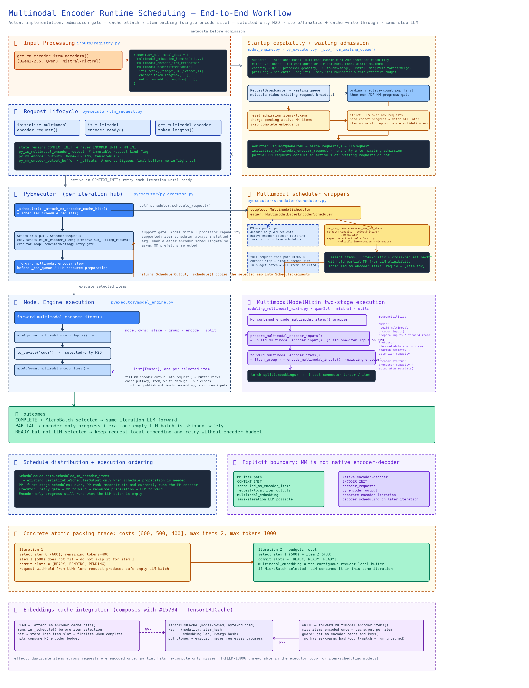

<!--
SPDX-FileCopyrightText: Copyright (c) 2026 NVIDIA CORPORATION & AFFILIATES. All rights reserved.
SPDX-License-Identifier: Apache-2.0
-->

# Multimodal Encoder Runtime Scheduling

> **Review-time design notes — to be removed before merging.**
>
> **Updated 2026-07-16** to match the current diff: the user-facing knob is now
> `encoder_max_num_items` (renamed from the original `encoder_max_batch_size`),
> the full-request fast path is removed in favor of a single encode site (see
> "Scheduler architecture"), and the item path integrates with the #15734
> embeddings cache (see "Memory ownership and encoder cache integration").

| Field | Value |
| --- | --- |
| Status | Implemented; under review |
| Scope | TensorRT-LLM PyTorch backend |
| Follow-up | [PR #13503: encoder sizing controls](https://github.com/NVIDIA/TensorRT-LLM/pull/13503) |
| Implementation | [PR #16051](https://github.com/NVIDIA/TensorRT-LLM/pull/16051) |
| Korean version | [멀티모달 인코더 런타임 스케줄링](multimodal_encoder_runtime_scheduling_design_KR.md) |
| Last updated | 2026-07-15 |

## Summary

This document describes the implemented runtime scheduling for multimodal (MM) encoders. It makes
`encoder_max_num_items` and `encoder_max_num_tokens` effective limits on the work submitted to MM
encoder forwards while preserving the existing LLM scheduling behavior and the same-step MM
encoder-to-LLM execution path.

The scheduler operates on **original MM items** such as one image or one video. An item is atomic in
this design. It may combine multiple compatible items into one physical encoder forward, but it does
not split one item across forwards. The item cost is the number of physical encoder attention tokens
before a connector or merger reduces the representation. This cost is intentionally different from
the number of placeholder embeddings inserted into the LLM prompt.

The default admission policy follows the vLLM model: an MM request rejected by LLM capacity does not
run its encoder independently. The public
`multimodal_config.enable_eager_encoder_scheduling` argument enables an experimental eager encoder
policy for A/B testing and defaults to `false`. That policy lets an already-admitted request make
encoder progress before the current iteration's LLM-capacity filtering; it does not pre-encode waiting
requests.

This document is implementation-oriented: statements in the present tense describe the current
branch. Sections explicitly marked as deferred or required testing are not implemented yet. In
particular, this implementation does not reuse the native encoder-decoder request state or execution path,
does not split an original MM item, and does not create a separate encoder-only request queue.

## Implementation diagram

The diagram below follows the current code from engine initialization through waiting admission,
per-iteration scheduling (cache attach → item selection), single-site encoder execution with cache
write-through, request-local commit, and same-step LLM forward. It also shows PP behavior, the
boundary from native encoder-decoder scheduling, a concrete two-iteration packing trace, and the
embeddings-cache integration region.

[Open the editable Excalidraw source](../../../mm_encoder_scheduling.excalidraw) or
[open the full-resolution PNG](../../../mm_encoder_scheduling.png).

Korean version: [editable Excalidraw source](../../../mm_encoder_scheduling_KR.excalidraw) and
[full-resolution PNG](../../../mm_encoder_scheduling_KR.png).



## Motivation

[PR #13503](https://github.com/NVIDIA/TensorRT-LLM/pull/13503) introduced two user-facing controls and
used them to size encoder attention metadata and dummy inputs deterministically:

- `encoder_max_num_items`: the maximum number of atomic MM items scheduled for encoder execution
  in one iteration, shared across requests and modalities.
- `encoder_max_num_tokens`: the maximum number of encoder attention tokens intended for one encoder
  batch.

That PR deliberately left scheduler enforcement as follow-up work. Consequently, sizing and runtime
work admission can disagree. An encoder forward can receive more items or physical attention tokens
than the configured workspace was designed for. Conversely, using LLM placeholder lengths as the
encoder cost can severely underestimate models with token-reducing connectors, such as Qwen-VL's
vision merger.

LLM chunked prefill does not solve this problem. A long text context can advance through several LLM
iterations, but an MM encoder input is generally bidirectional and cannot be split at arbitrary token
boundaries. The scheduler therefore needs an MM-specific unit of work and budget.

## Goals

1. Enforce a per-iteration MM encoder item budget and physical attention-token budget.
2. Keep one MM item atomic and preserve numerically equivalent encoder and end-to-end results.
3. Preserve the existing MM behavior in which encoder output can feed an LLM forward in the same
   iteration.
4. Preserve the exact non-MM scheduling path and avoid measurable overhead for non-MM models.
5. Reuse existing request metadata, schedule distribution, and model-specific input processors where
   practical.
6. Support Qwen2-VL/Qwen2.5-VL, Qwen3-VL, and Mistral3/Pixtral in the initial implementation.
7. Provide a controlled experiment for eager encoder scheduling without making it the default.

## Non-goals

- Splitting a single image, video, or audio item into spatial, temporal, window, or patch microbatches.
- Introducing a user-facing partial precomputed-embedding API.
- Implementing cross-request MM encoder output caching. The design reserves stable item identities and
  lifecycle hooks so a separate cache effort can integrate later.
- Bounding, evicting, or offloading request-local encoder outputs in the first implementation.
- Changing native encoder-decoder scheduling or execution.
- Supporting MM tower LoRA. The target encoders currently do not accept request-level LoRA parameters.
- Redesigning overlap scheduler or MM prefetch compatibility in the first implementation.
- Extending the new scheduler to models that do not inherit `MultimodalModelMixin`.

## Terminology and units

The word "token" is ambiguous across the MM pipeline. The implementation and metrics must use the
following explicit terms.

| Term | Definition | Example |
| --- | --- | --- |
| MM item | One original user-visible input, such as one image or one video | The second image in a prompt |
| Encoder attention token | One row participating in the encoder's attention before a merger or connector | A Qwen-VL pre-merger vision patch |
| Encoder output embedding | One row emitted after the encoder connector/merger | A row inserted into the LLM embedding sequence |
| Placeholder token | A position or run in the text prompt replaced by MM output embeddings | Image placeholder positions |
| Internal encoder sequence | A sequence/window/segment represented in encoder `AttentionMetadata` | One temporal or window-attention sequence |

The scheduler cost of item `i` is:

```text
encoder_cost(i) = sum(item_encoder_attention_metadata.seq_lens)
```

It is not `multimodal_embedding_lengths[i]`, the placeholder count, or the number returned by an
LLM-side context chunk. A connector may make these values equal, but the scheduler must not assume
that identity.

### Configuration semantics

The encoder token budget is a base scheduling value. `None` resolves that base
from the LLM token budget. Because an atomic MM item cannot be split across
encoder forwards, either base value is raised when necessary to keep the
model's largest valid atomic item schedulable:

```text
resolved_encoder_max_num_items =
    encoder_max_num_items if encoder_max_num_items is not None else max_batch_size

base_encoder_token_budget =
    encoder_max_num_tokens if explicitly set else max_num_tokens

effective_encoder_token_budget =
    max(base_encoder_token_budget,
        model_max_atomic_item_tokens)
```

The four startup configuration cases are therefore:

| User input | Item budget | Token-budget base | Effective token budget |
| --- | --- | --- | --- |
| both values set | `encoder_max_num_items` | `encoder_max_num_tokens` | `max(base, model atomic maximum)` |
| item value only | `encoder_max_num_items` | `max_num_tokens` | `max(base, model atomic maximum)` |
| token value only | `max_batch_size` | `encoder_max_num_tokens` | `max(base, model atomic maximum)` |
| neither value set | `max_batch_size` | `max_num_tokens` | `max(base, model atomic maximum)` |

These rules resolve only the two public scheduling axes. They do **not** copy either value directly
into attention's `max_num_requests`; that separate startup conversion is described below.

The item-count budget counts original MM items. It does not count requests, internal attention
sequences, video frames, temporal units, or physical encoder forwards.

The implementation must:

1. retain the optional configured value plus the base and effective values;
2. log the configured/base/effective values and warn once when atomic-item compatibility raises the
   value;
3. use the effective value consistently for scheduling, profiling, attention metadata, and workspace
   sizing; and
4. not raise `encoder_max_num_items` except to enforce the existing positive-value validation.

An item above the effective startup maximum is invalid. Since that maximum is at least the model's
startup-declared maximum atomic item, normal model-valid inputs are not rejected merely because the
configured base was smaller. Input processing should normally resize or sample media to remain within
model limits. A defensive runtime check fails only an inconsistent request; it must not dynamically
resize metadata or abort the server.

## Scope and model gating

The input processor opts in explicitly with
`supports_mm_encoder_item_scheduling = True`. During model-engine initialization, the executor
computes support once from both sides of the contract:

```python
supports_mm_encoder_item_scheduling = (
    isinstance(model, MultimodalModelMixin)
    and input_processor.supports_mm_encoder_item_scheduling
)
```

The executor installs the MM scheduler only when the combined capability is true. Models outside the
mixin and processors without complete item metadata continue through the existing full-request path.
There is no runtime kill switch and no per-iteration `model.modules()` scan for scheduler gating.

The initial implementation requires complete item-level support for:

- `Qwen2VLModelBase`, covering Qwen2-VL and Qwen2.5-VL;
- `Qwen3VLModelBase`; and
- `Mistral3VLM`, covering Mistral3 and Pixtral variants.

All supported families provide item costs, item identities, output lengths, a startup maximum atomic
item cost, and model item preparation. Setting the processor capability flag without a nonempty,
positive `get_mm_max_tokens_per_item()` result fails engine startup instead of silently falling back.

For a model without item-scheduling support, the executor instantiates and calls the existing
scheduler directly. There is no MM wrapper, MM request scan, MM metadata allocation, or MM schedule
payload.

The current text-only path on a supported MM model is not constant time. In non-ADP mode, the
waiting-admission gate scans `active_requests`, and `_can_schedule_full_request_mm_batch()`
copies/scans the capacity-fitting request list once per scheduling call. Text-only requests exit on their boolean
request-kind flag, so the work is small, but it is still two `O(active_requests)` Python loops. ADP
skips the waiting-admission MM gate, leaving the scheduler scan. A pending-MM request counter or index
is a deferred host-latency optimization; the current implementation does not maintain one.

## Request classification and state

Native `LlmRequestState.ENCODER_INIT` belongs to encoder-decoder scheduling and has next-iteration
semantics that do not match the existing MM workflow. The implementation must not reuse it and must
not add a native `MM_INIT` state.

An MM request remains in `CONTEXT_INIT`. Python attaches an immutable request-kind flag:

```text
py_is_multimodal_encoder_request =
    runtime_item_scheduling_is_enabled_for_model_and_processor
    and request_has_raw_mm_payload
    and request_has_no_complete_precomputed_mm_embedding
```

mRoPE metadata without raw MM content is not an encoder request. A request with a complete externally
precomputed `multimodal_embedding` bypasses encoder compute and consumes no encoder item or token
budget. Partial external embeddings remain unsupported.

The flag identifies request kind; readiness is stored separately. A partially encoded request stays in
the context state but is filtered out before the LLM microbatch until its required embeddings are
ready or will become ready in the current iteration.

### Boundary with native encoder-decoder scheduling

MM item scheduling and native encoder-decoder scheduling are separate executor paths:

| Concern | MM encoder runtime scheduling | Native encoder-decoder |
| --- | --- | --- |
| Request state | Remains `CONTEXT_INIT` | Starts in `ENCODER_INIT` |
| Scheduled output | `scheduled_mm_encoder_items` | `encoder_requests` |
| Request-local output | MM item slots and contiguous `multimodal_embedding` buffer | `py_encoder_output` |
| Executor entry | `_forward_multimodal_encoder_step` | `_run_encoder_step` |
| Decoder timing | May run in the same iteration | Re-enters decoder scheduling on a later iteration |

`MultimodalScheduler` does not run native encoder-decoder readiness filtering. The currently supported
Qwen and Mistral/Pixtral models are decoder-only VLMs, and MM readiness comes exclusively from the
Python item progress described above. Native encoder-decoder schedulers retain their own
`drop_decoder_context_requests_waiting_for_encoder_output()` calls. The MM path never inserts requests
into `encoder_requests` and never calls `forward_encoder()`.

## Static request metadata

Model-specific input processing produces scheduling metadata before waiting-queue admission and
before the initial request broadcast. An opted-in processor returns a typed
`MultimodalEncoderItemMetadata` `NamedTuple`:

```python
MultimodalEncoderItemMetadata(
    item_refs: list[tuple[str, int]],
    encoder_token_lengths: list[int],
    output_embedding_lengths: list[int],
)
```

The generic input-processor wrapper validates that all three lists have the same length, validates an
already-computed embedding-length list when present, and then stores the typed metadata object itself
in `request.py_multimodal_data`. The existing flat embedding-length field remains the generic MM
layout contract and is materialized from the typed metadata when the generic hashing path did not
already compute it:

```python
{
    # Existing: output/placeholder rows per item.
    "multimodal_embedding_lengths": list[int],

    # New: one CPU-only, typed scheduler contract.
    "multimodal_encoder_item_metadata": MultimodalEncoderItemMetadata(
        item_refs=list[tuple[str, int]],
        encoder_token_lengths=list[int],
        output_embedding_lengths=list[int],
    ),
}
```

`output_embedding_lengths` and the existing `multimodal_embedding_lengths` carry the same values. The
former makes the opted-in item-scheduling contract complete even for mixed-modality and basic
input-processing paths where generic hashing does not produce the flat field; the wrapper validates
equality and exposes the flat field for existing downstream consumers. Examples of item references
are `("image", 0)` and `("video", 1)`. All three metadata lists are aligned to the canonical
prompt-placeholder order, not dictionary iteration order, modality grouping, or completion order.
Input processing must reject ambiguous or inconsistent ordering. An opted-in processor receiving a
raw MM payload must return the metadata instead of silently falling back to full-request encoding.

The metadata object and flat embedding lengths are CPU scheduling/layout data registered in
`_CPU_ONLY_MULTIMODAL_DATA_KEYS`, so generic device transfer leaves them on the host. Existing
`MultimodalInput` positions, lengths, hashes, UUIDs, and
item-run metadata remain available, but the current scheduler does not use a hash as an item identity
or require hashing to be enabled. The current hashing path contains a one-modality flattening
assumption, so ordering must be validated before a future cache uses hashes as item identities.

`MultimodalRuntimeData` is not a suitable scheduling store. It is created for an already selected LLM
chunk and therefore exists too late for waiting admission or encoder item selection.

### Cost generation

Each supported input processor computes physical token lengths from normalized media metadata consumed
by its encoder. Qwen uses `prod(grid_thw)` before spatial merge, collapses multiple temporal prompt
spans back into one original video item, and derives output rows by dividing by the spatial merge unit.
Mistral/Pixtral uses `_vit_tokens(width, height, patch)` and derives output rows after the square spatial
merge. The Qwen path reconstructs canonical image/video order from the prompt and rejects disagreement
with the processed grids; the current Mistral path is image-only and uses processed image order.

The current executor validates positive costs, aligned list lengths, the startup maximum, and each
returned item's output embedding length. It does **not** independently recompute and compare the
encoder's runtime attention sequence sum after launch. Keeping processor and model geometry formulas
aligned, plus model-specific tests, is therefore part of the current correctness contract; an explicit
declared-versus-runtime cost assertion remains a possible hardening step.

## Mutable request-local state

The Python request owns fixed-size item slots, one contiguous output buffer, and precomputed offsets:

```python
py_mm_encoder_outputs: list[Optional[torch.Tensor]]
py_mm_encoder_output_buffer: Optional[torch.Tensor]
py_mm_encoder_output_offsets: list[int]
```

An item has exactly one of two persistent states:

| State | Output slot | Meaning |
| --- | --- | --- |
| `PENDING` | `None` | Eligible for selection |
| `READY` | tensor | Reusable request-local result |

For readability, `get_multimodal_encoder_progress()` derives request-level
`MultimodalEncoderProgress.PENDING`, `PARTIAL`, or `READY` from these slots and the existing full-request
embedding. It is not a second stored state and does not modify the C++ `LlmRequestState`; MM requests
remain in `CONTEXT_INIT` so same-iteration encoder-to-LLM execution is preserved.

Selection does not mutate request state. The current executor consumes one schedule result before
constructing another result that could select the same item. Keeping selection in the serialized
scheduler output avoids reservations that could leak when a result is canceled or discarded.

On the first successful item, the executor allocates one contiguous final output buffer using the
declared per-item embedding lengths. Each completed item is copied directly into its canonical slice;
the output slots hold views into this buffer rather than independent allocations. Once all slots are
ready, that same buffer becomes `multimodal_embedding` without a final `torch.cat` allocation. On
request cancellation, validation failure, or execution error, the buffer and slots are released with
the request.

## End-to-end request workflow

### Startup before request admission

Before serving requests, `PyTorchModelEngine` resolves the encoder-specific runtime sizes, falling back
to the LLM values when either user-facing encoder knob is `None`. It then establishes the feature
contract in this order:

1. Create the model-specific input processor and load the model.
2. Set `supports_mm_encoder_item_scheduling` only when the model inherits `MultimodalModelMixin` and
   the processor explicitly advertises complete item metadata support.
3. Require a nonempty `get_mm_max_tokens_per_item()` result with positive per-modality values.
4. Preserve the optional configured value and resolved base separately, then raise the effective
   value to the largest valid atomic item when necessary.
5. Initialize `MultimodalEncoderMixin` attention metadata and direct encoder profiling with the
   effective budget.
6. Reject existing asynchronous MM prefetch and install `MultimodalScheduler` for the default coupled
   policy or `MultimodalEagerEncoderScheduler` when eager scheduling is enabled. Eager mode
   additionally rejects attention DP and a disaggregated KV cache transceiver.

### Request and iteration path

The current request path is:

1. **Input processing.** The model-specific processor normalizes media and returns
   `MultimodalEncoderItemMetadata`. The wrapper writes prompt-ordered item references, physical costs,
   and output lengths into `py_multimodal_data`.
2. **Initial request distribution.** `RequestBroadcaster` sends the ordinary request plus Python-only
   `py_multimodal_data` through its existing TP/PP/CP route. This change adds no MM-specific request
   broadcast.
3. **Waiting admission.** `_pop_from_waiting_queue()` first performs the ordinary active-count pop,
   then applies the non-ADP MM progress gate and prepends deferred requests back to the queue.
4. **Request attachment.** `merge_requests()` creates `LlmRequest`; validation calls
   `initialize_multimodal_encoder_request()`, which classifies the request, validates the startup item
   maximum, and creates item slots and output offsets. The state stays `CONTEXT_INIT`.
5. **Scheduling.** `MultimodalScheduler` runs the default coupled policy;
   `MultimodalEagerEncoderScheduler` runs the opt-in eager policy. Either scheduler returns an
   optional `request_id -> item_indices` map, which the existing schedule serialization propagates.
6. **Item execution.** Every participating executor reconstructs the same selection, resolves active
   requests, slices selected items on CPU, transfers those slices, runs consecutive modality groups,
   and commits one output per item into the request's final buffer.
7. **LLM execution.** A request whose last pending items were selected can enter the same iteration's
   LLM context batch. A request still missing items is absent from the LLM batch and retries next
   iteration. An iteration with only encoder progress skips the empty LLM work.
8. **Post-completion lifetime.** Once all item slots are ready, the contiguous buffer becomes
   `multimodal_embedding` and raw media tensors are removed. Later chunked-prefill iterations reuse the
   embedding without recharging the encoder budget. Normal request teardown eventually releases it.

There is no full-request divergence at step 5: the encoder step is the single encode site. An
in-budget batch is simply the case where every pending item of every fitting request is selected,
and those requests still enter the same iteration's LLM context batch (the encoder step runs before
the LLM forward). Requests whose items were fully attached from the embeddings cache reach `READY`
before selection and are never scheduled for encoder work at all.

### Two distinct budget passes

Waiting admission and item scheduling intentionally run separate simulations:

```text
waiting admission:
    reset encoder item/token budget
    charge pending work from active MM requests
    walk newly popped requests in strict FCFS order
    if the head cannot make initial progress:
        defer the head and every later request

per-iteration scheduling:
    reset encoder item/token budget again
    default mode: select only from CapacityScheduler-fitting requests
    eager mode: select from all already-active requests before capacity
    emit scheduled_mm_encoder_items without mutating request item state
```

The first pass decides whether a waiting request may occupy an active slot. The second decides the
actual item IDs executed by this schedule result. Combining the passes would either admit requests
without a progress guarantee or reserve item work before the LLM capacity decision.

### Concrete atomic-item trace

For one request with costs `[600, 500, 400]`, `encoder_max_num_items=2`, and
`encoder_max_num_tokens=1000`:

| Iteration | Selection | Request-local state after commit | LLM behavior |
| --- | --- | --- | --- |
| 1 | Select item 0. Item 1 does not fit the remaining 400 tokens, and item 2 cannot bypass it. | `[READY, PENDING, PENDING]` | Request remains withheld. If it is the only request, the executor safely skips the empty LLM batch. |
| 2 | Budgets reset; select items 1 and 2 for 900 tokens. | `[READY, READY, READY]`; the contiguous buffer becomes `multimodal_embedding`. | If MicroBatchScheduler selects the request, the LLM consumes the embedding in the same iteration. Otherwise the ready embedding remains request-local. |

Another active request whose next item costs at most 400 could backfill the unused iteration-1 budget.
The scheduler does not reorder items within the first request to fill the gap.

## Scheduler architecture

The MM scheduler is a Python wrapper around the existing request scheduler. For the normal
`SimpleScheduler` layout, it invokes the existing CapacityScheduler and MicroBatchScheduler stages
directly so it can insert MM item selection between them. It is not a replacement for the C++ LLM
capacity scheduler and it does not add encoder costs to that scheduler's token accounting.

```text
waiting requests
      |
      | MM progress eligibility for new admission
      v
existing LLM CapacityScheduler
      |
      | fitting/admitted requests in original policy order
      v
MM atomic-item budget packing
      |
      | partial MM requests are withheld
      v
existing LLM MicroBatchScheduler
      |
      | ready or completing-this-step MM requests retain original order
      v
MM encoder forward(s) -> assemble embeddings -> LLM forward, same iteration
```

The actual default path for one scheduling call is:

1. Run the existing LLM CapacityScheduler over the active requests.
2. Select atomic items from the capacity-fitting list with `_select_items()`, charging both encoder
   budgets. Items already attached from the embeddings cache have filled slots and are skipped.
3. Withhold MM requests that will remain partial after this iteration, and run the existing
   MicroBatchScheduler on the remaining LLM-eligible requests.

The wrapper also supports scheduler implementations without separately exposed capacity and
microbatch stages. That fallback can filter the returned context list, but the production
`SimpleScheduler` path above is the intended path.

### Per-iteration budget

Each call that creates one `ScheduledRequests` result starts with:

```text
max_num_items = resolved_encoder_max_num_items
remaining_items = max_num_items
remaining_tokens = effective_encoder_token_budget
```

The user-facing knob is `encoder_max_num_items` (renamed from `encoder_max_batch_size`): the limit
counts atomic items rather than LLM requests, beams, or model-internal attention segments, and the
name now says so end-to-end.

All physical MM encoder forward groups selected for that result share these counters. Creating several
shape-compatible groups does not create several budgets. The scheduling rank serializes the selection;
TP, PP, and CP ranks reconstruct the same selected item IDs for that replica.

The item-count budget and token budget are independent. An item fits only when both counters can pay
its complete cost. Future cache hits use neither compute counter.

### Item selection order

The selection rules are deliberately simple and deterministic:

1. Within one request, process items in canonical prompt order.
2. Never skip an earlier pending item to select a cheaper later item from the same request.
3. Running/admitted requests may backfill across requests: if one request's next item cannot fit, the
   scheduler may consider another active request.
4. New waiting MM admission is strict FCFS. If the head request cannot make initial progress with its
   first pending item, stop admitting all later waiting requests in that turn to preserve strict FCFS.
   An item larger than the effective budget is admitted so normal validation can fail that request
   instead of permanently blocking the queue.
5. Preserve the existing scheduler-policy order when passing ready requests to the
   MicroBatchScheduler. Do not append newly completed MM requests at the end.

These rules trade some packing efficiency for predictable fairness, stable output ordering, and a
small implementation surface. A best-fit or modality-aware policy can be evaluated later from traces.

### Same-step eligibility

An admitted request is eligible for the current LLM microbatch when every required item is either:

- already `READY`; or
- selected for encoder execution in this same schedule result.

If the request is selected by the MicroBatchScheduler, execution runs its selected encoder items,
assembles the full
embedding, and runs the LLM forward in the same iteration. This preserves the existing MM latency
behavior.

If MM execution completes but the LLM microbatch cannot include the request, its outputs remain in
request-local slots and the request retries LLM scheduling later. Under the default policy, the
CapacityScheduler must have admitted the request before any encoder work is launched; a capacity
rejection does not leave behind speculative encoder output.

An encoder-only progress iteration is valid. If a lone request needs multiple MM iterations, an
intermediate `ScheduledRequests` can have selected MM items and zero context/generation requests. The
executor runs `_forward_multimodal_encoder_step()` before its empty-batch `_can_queue()` check; the
empty LLM batch is then skipped without running forward, sampling, or per-batch statistics. A local
single-request, 32-image test with an item budget of 16 exercised this two-iteration shape, but this is
not yet a committed integration test.

## Admission policies

### Default: LLM-coupled admission

The default follows vLLM's essential admission behavior:

- A request rejected by LLM capacity does not independently run the MM encoder.
- After the ordinary active-request-count pop, a new waiting MM request remains admitted only if it can
  make progress: it is already MM ready, or at least its first required atomic item fits the remaining
  encoder budget simulated for this iteration.
- A waiting request that cannot make any prefill progress remains waiting and consumes no active LLM
  slot.
- Once admitted and making MM progress, a request may occupy an active LLM slot over several encoder
  iterations until all items are ready.

This coupling protects the LLM from an unbounded set of encoder-only active requests and keeps request
lifecycle semantics close to the existing scheduler. The cost is possible LLM slot occupancy while a
large multi-item request advances through encoder iterations.

The waiting gate first charges pending items from active MM requests, skipping requests whose complete
embedding is already ready, and then considers newly popped requests in strict queue order. Once one
head request cannot make progress, it prepends that request and every later request—MM or text—back to
the waiting queue. An item above the effective maximum is deliberately admitted so request validation
can fail it instead of permanently head-of-line blocking the server.

This gate controls active-set admission, while the existing CapacityScheduler remains the authority
that reserves LLM resources. In default mode, item selection occurs only after that capacity result,
which avoids encoding a capacity-rejected request.

### Eager encoder scheduling

The following public argument enables the eager policy:

```yaml
multimodal_config:
  enable_eager_encoder_scheduling: true
```

The default is `false`, which selects the coupled policy.

Eager mode selects encoder items from the existing `active_requests` before LLM capacity
filtering. It lets an already-admitted request continue encoder progress in an iteration where LLM
capacity rejects it; it does not create a separate pre-admission collection or increase the active
request limit. Completed outputs stay request-local until normal LLM scheduling.

Eager mode changes only where item selection occurs relative to LLM capacity. Both policies use
the same active set, serial execution order, model hooks, output validation, and output assembly, which
makes throughput and latency comparisons meaningful.

Eager mode raises `NotImplementedError` when attention data parallelism or a disaggregated KV
cache transceiver is enabled. The default coupled policy does not have that explicit rejection. Any
item-scheduled mode also rejects `multimodal_config.encoder_side_stream_max_ahead > 0` at executor
initialization because the existing asynchronous MM prefetch path has not been integrated with
request-local item state. The ordinary executor overlap loop remains enabled.

## Schedule distribution

TensorRT-LLM already distributes scheduling results from the scheduling rank. This design extends the
existing payload; it does not add a second collective or broadcast.

`ScheduledRequests` and `SerializableSchedulerOutput` gain an optional mapping:

```python
scheduled_mm_encoder_items: dict[int, list[int]] | None
```

The key is request ID and each value contains canonical item indices. Static costs and item references
arrive through the existing initial `RequestBroadcaster`. The per-iteration payload sends only the
selection. Non-MM schedules leave the field as `None`, so their serialized payload and hot path remain
unchanged apart from backward-compatible field handling.

The rank that already owns scheduling applies the MM policy. Other TP/PP/CP ranks reconstruct the same
request/item selection from the serialized result before model execution. No rank independently
re-packs the items.

In pipeline parallel execution, the current implementation executes the selected MM encoder items on
**every PP rank** after reconstructing the first stage's schedule. The supported Qwen and Mistral MM
wrappers currently instantiate the encoder on every PP stage, and the existing full-request MM path
also duplicates encoder execution across PP stages. Therefore item scheduling preserves the existing PP
ownership behavior rather than introducing first-stage-only encoding and an embedding broadcast. It
may duplicate encoder compute by the PP degree. MM+PP needs a dedicated integration test before this
behavior can be considered fully validated or optimized.

`num_fitting_requests` remains the CapacityScheduler's count before MM-incomplete requests are
withheld from the LLM microbatch. The executor uses this value in disaggregated-serving idle/progress
decisions, where an encoder-progress iteration should not be misreported as LLM capacity starvation.
It is not the actual scheduled LLM batch size and is not rewritten by the MM wrapper.

## Model execution API

`MultimodalModelMixin` exposes a two-stage internal item API:

```python
def prepare_multimodal_encoder_inputs(
    self,
    selected_items: Sequence[tuple[MultimodalParams, int]],
) -> list[tuple[MultimodalParams, int, str]]:
    """Build selected item encoder inputs on CPU."""

def forward_multimodal_encoder_items(
    self,
    encoder_inputs: Sequence[tuple[MultimodalParams, int, str]],
) -> list[torch.Tensor]:
    """Forward encoder inputs and return one tensor per item in input order."""
```

The previously proposed single `encode_multimodal_items()` hook is not part of the implementation. The
scheduler knows only request IDs, item indices, and costs. The model engine resolves selected
request/item pairs, calls `prepare_multimodal_encoder_inputs()` while the original payload is still on
CPU, transfers only the prepared microbatch, and then calls `forward_multimodal_encoder_items()`.

The mixin owns:

- slicing raw model-specific tensors by item;
- determining physical forward compatibility;
- grouping compatible consecutive items;
- constructing exact attention metadata;
- executing the encoder and connector; and
- splitting outputs back into one tensor per selected item.

The model engine owns the selected-only H2D transfer, validates one result per selected item and the
declared output row count, copies each result directly into the final contiguous output buffer, and
removes raw modality payloads after all items complete. It resolves request IDs with an explicit
missing-request lifecycle error rather than allowing a dictionary `KeyError`. Completed outputs remain
on GPU for same-step LLM consumption; this design does not offload them.

The existing `encode_multimodal_inputs` remains available for the full-request path and existing prefetch
behavior.

### Physical grouping

Scheduler packing is modality- and shape-agnostic. Current supported models group **consecutive**
selected items by modality; their preparation contracts produce compatible fields, dtype/device, and
shapes within each run. A future model that cannot guarantee this must override
`forward_multimodal_encoder_items()` or use a stricter compatibility key. All physical forwards share
one per-iteration budget.

Nonconsecutive items are not reordered to make a larger batch. Reordering would require an additional
permutation contract and increases the risk of attaching outputs to the wrong placeholders. The
initial implementation favors correctness and a transparent execution trace.

Qwen2/Qwen3 implementations derive item slices from their grid and patch offsets. Mistral derives
image slices from its image metadata. A video remains one item; it is not transformed from `(t, h, w)`
into independent `(1, h, w)` forwards. That transformation can change temporal attention and output,
so it is outside this design.

### LoRA

The target Qwen and Mistral encoder entry points do not currently accept per-request LoRA parameters;
LoRA is applied on the LLM side. Therefore the initial grouping key does not contain `lora_task_id`.
If encoder/tower LoRA is introduced, the adapter identity must become part of both the physical
grouping key and any cache key before the feature is enabled.

## Attention metadata capacity

`encoder_max_num_items` counts original items, while `AttentionMetadata.max_num_requests` may count
internal sequences, temporal segments, or attention windows. They are different units, so the item
budget must never be copied directly into `max_num_requests` unless a model proves a one-to-one
mapping.

At startup, the model engine scans `model.modules()` once for `MultimodalEncoderMixin` and calls:

```python
module.setup_attn_metadata(
    max_num_items=encoder_max_num_items,
    max_num_tokens=effective_encoder_max_num_tokens,
    attention_metadata_capacity=processor_capacity,
)
```

`encoder_max_num_items` is an input budget, not an `AttentionMetadata.max_num_requests` value. Each
encoder maps the item/token pair to its own attention sequence/window/segment capacity. This is
necessary because one image may map to one attention sequence while one video item may expand to
multiple temporal segments, and windowed encoders may create several internal sequences per item.
The input processor owns the exact resize and grid constraints, so an opted-in processor first maps
the resolved budgets and its live startup geometry to model-specific capacities:

```python
processor_capacity = input_processor.get_mm_encoder_attention_metadata_capacity(
    max_num_items=encoder_max_num_items,
    max_num_tokens=effective_encoder_max_num_tokens,
)
```

`None` retains the encoder model's conservative
`get_encoder_attention_metadata_capacity()` fallback. This split is intentional: the model knows what
an attention "request" means, while the processor knows the media geometry that can reach it. The
module scan and conversion run once during initialization and are unrelated to per-iteration scheduler
gating.

For Qwen, let `T` be `effective_encoder_max_num_tokens`, `U = spatial_merge_unit`, and `A_min` be the
minimum number of post-merge spatial cells in one Qwen2.5 image/video frame under the live startup
processor. For window attention, let `W/A` be the maximum number of nonempty windows per post-merge
cell over the startup geometry. Qwen2.5 uses:

```text
Qwen2.5 full-attention max_num_requests =
    max(1, floor(T / (U * A_min)))

Qwen2.5 window-attention max_num_requests =
    max(1, floor(T * max(W / A) / U))
```

`encoder_max_num_items` is intentionally not a factor in these two Qwen2.5 formulas: one atomic video
item can contain enough temporal segments to consume the entire token budget. Request processing
validates the actual Qwen2.5 grids against the same minimum-frame and window-ratio contract. A
request-local processor override may use a different shape only when the resulting grid remains within
the startup capacity; otherwise that request fails before scheduler admission instead of overflowing a
fixed metadata buffer.

Qwen3 differs: its video processor clamps aggregate temporal pixel volume, so a sufficiently long
video can shrink each temporal segment to one merged cell. Its safe bound therefore remains the hard
geometry limit:

```text
Qwen3 attention max_num_requests = max(1, floor(T / U))
```

Pixtral maps each scheduled image item to one nonempty attention context. Its processor aligns images
to a spatial-merge tile, so one context consumes at least `U` physical patches and both budget axes
apply:

```text
Pixtral attention max_num_requests =
    max(1, min(encoder_max_num_items, floor(T / U)))
```

Mistral3 uses `PixtralVisionModel` as its vision tower and therefore receives this processor-derived
mapping. Its processed item metadata also validates the nonempty merge-tile invariant. These
runtime-scheduled Qwen2.5, Qwen3, and Mistral/Pixtral paths do not consume the legacy 8192 fallback.

The base `MultimodalEncoderMixin` retains the legacy minimum only for encoders that have not opted into
runtime item scheduling or have not supplied a model-specific conversion. Their encoder forward is not
yet governed by this feature, so sizing fixed per-segment buffers from a configured runtime budget
would be unsafe.

The effective token budget is passed to attention metadata setup and direct encoder profiling. Direct
profiling executes two feasible boundary shapes sequentially: one longest item and up to
`encoder_max_num_items` equal shorter items sharing the same aggregate token budget. Inputs from one
shape are released before the next, and only the final output remains live for the subsequent LLM
dummy forward. This covers both maximum context length and maximum item/sequence pressure without
adding two dummy batches together into an impossible peak. Both shapes use the effective budget after
atomic-item compatibility resolution.

## Execution ordering

The first implementation is serial from the scheduler's perspective:

```text
selected MM encoder forward group(s)
    -> direct commit into request-local final embedding buffer
    -> selected LLM forward
```

Scheduling itself does not launch MM GPU work. `_prepare_and_schedule_batch()` fetches requests and
returns `ScheduledRequests`; after the benchmark/disaggregated-serving retry gate accepts that result,
the non-PP and overlap executor loops call `_forward_multimodal_encoder_step()`. That phase runs before
`_can_queue()` and `resource_manager.prepare_resources()`, and it is not conditional on a nonempty LLM
batch. The PP loop calls the same phase after schedule propagation and local reconstruction, also
before `_can_queue()`.

This executor ordering is required for same-step consumption. The existing asynchronous MM prefetch
mode remains rejected at initialization, as described above, rather than being silently combined with
item scheduling.

## Error handling and cancellation

Errors before GPU launch, including missing or invalid metadata, inconsistent list ordering or lengths,
and an item larger than the effective startup maximum, fail the affected request. Returned item count,
embedding row count, output shape, dtype, and device are validated during commit. As noted in cost
generation, physical attention cost is not independently recomputed after launch.

A GPU encoder-forward exception follows the executor's conservative fatal/error path. The initial
implementation does not attempt strong per-item fault isolation or continue the same iteration after
a potentially invalid CUDA state. Successfully completed request-local outputs are released when the
request is torn down unless owned by a future cache.

Cancellation removes the request from waiting or active collections and releases request-local output
tensors. Selection does not create an in-flight reservation in the request, so there is no reservation
to roll back when a schedule result is discarded. A selected request that is no longer present in
`active_requests` at execution is treated as an explicit scheduler lifecycle error.

## Memory ownership and future cache integration

The initial implementation intentionally has no separate byte or item limit for accumulated
request-local outputs. This is acceptable for the first correctness/performance evaluation but is a
known risk, especially in eager mode where an already-active request can finish encoding while
it is repeatedly rejected by the current iteration's LLM capacity decision.

The following follow-up is required before eager mode becomes a supported default:

1. Track resident MM output embeddings by items and bytes.
2. Reserve resident capacity before scheduling an item, not after its forward.
3. Stop eager selection when the resident budget is exhausted.
4. Release capacity on LLM consumption, cancellation, validation failure, and executor error.
5. Define whether completed outputs remain on GPU, move to pinned CPU memory, or are evicted.
6. Define per-DP-replica ownership and distributed accounting.
7. Add stress tests for waiting-request accumulation and cancellation storms.

The cross-request embeddings cache (#15734's `TensorLRUCache`) is now integrated exactly along
those lines, without changing scheduler identity:

- **Read side**: `PyExecutor._attach_mm_encoder_cache_hits()` runs in `_schedule()` before item
  selection. A hit is committed into the request-local item slot via
  `fill_mm_encoder_output_into_request()` and consumes no encoder item or token budget; a fully
  attached request reaches `READY` without any encoder work, and a partially attached request
  proceeds through the item path, which re-computes only the misses.
- **Write side**: `forward_multimodal_encoder_items()` write-throughs each freshly encoded item
  with `cache.put()` (which clones, so entries neither alias nor pin the request buffer).
- **Keys**: per item, `(modality, item_hash, embedding_length, mm_processor_kwargs_hash)` —
  single-sourced in `_encoder_cache_item_key()` so the item path and the full-request consumers
  (prefetch, `mm_encoder_only`) hit each other's entries. Per-item modality comes from
  `item_refs`, so mixed-modality requests are keyable on this path.
- **Guard**: `ModelEngine.get_mm_encoder_cache_and_keys()` — model capability, enabled cache,
  item metadata, hashes/kwargs-hash present and count-matched. Any failure means the request runs
  exactly as without a cache.
- **Lifetime**: eviction can never regress progress because requests own their committed copies;
  cache bytes are bounded by `encoder_cache_max_bytes` and accounted by #15734's memory
  estimation.

Remaining follow-ups: within-iteration key dedup (concurrent duplicates still encode once each),
an admission-time probe-only check, and partial-hit assembly for the remaining full-request
consumers (TRTLLM-13996).

## Correctness requirements

Accuracy is a hard invariant. Scheduling may change batching and launch boundaries, but not semantic
item order or model computation.

Required comparisons include:

1. Full-batch encoder output versus micro-scheduled, request-local reassembly for each supported model.
2. Multiple images with different shapes and multiple physical forward groups.
3. Mixed image/video prompts in placeholder order.
4. A request spanning multiple encoder scheduling iterations.
5. Several requests backfilled under both item and token pressure.
6. Complete precomputed embeddings bypassing the encoder budget.
7. Cancellation while an item is pending and while it is in flight.
8. Distributed schedule serialization and reconstruction.
9. Default versus eager admission with identical encoder output and final greedy tokens.

Tests compare encoder outputs using dtype-appropriate numerical tolerances. Bitwise equality is not
always possible when a kernel sees a different physical batch, but deterministic greedy generation
must produce the same tokens. A tolerance-only encoder test is insufficient if the end-to-end greedy
result changes.

No implementation may split Qwen video temporal units merely to satisfy a budget without a separate
model-level proof and accuracy suite.

### Current validation status

Committed unit tests cover atomic packing and cross-request backfill, all-items selection for
in-budget batches, eager selection after LLM-capacity rejection, ready-request admission
accounting, oversized-item admission into validation, CPU item slicing, selected output assembly
into one buffer, embeddings-cache attach/write-through (key parity, full and partial hits,
eviction safety, per-request guards), raw-input
cleanup, prompt-order metadata, original-video item identity, and Qwen/Mistral token-unit calculations.
They also cover typed processor metadata materialization and validation.

The targeted unit suites pass on the development branch. A local single-GPU Qwen e2e exercised a lone
32-image request across two encoder iterations, which validates the empty-LLM-batch executor shape but
is not a checked-in regression test. The following material gaps remain:

- a checked-in full-batch versus item-scheduled greedy/output equivalence integration test;
- MM+PP execution and output equivalence;
- cancellation between schedule distribution and item execution;
- default-mode attention-DP and disaggregated-serving integration; and
- overlap-mode performance and serialization round-trip coverage at executor level.

## Performance and observability

Current observability is intentionally narrow. Startup logs report configured, base, effective, and
model atomic-maximum values; atomic-item compatibility raises also produce a warning.
Startup also reports when eager scheduling is enabled. The normal scheduler does not log each item.

The following desired metrics are not yet implemented as stable counters:

- per-step selected item count, physical token count, and physical forward-group count;
- requests blocked by the item or token budget;
- request-local ready bytes, especially in eager mode;
- selected H2D bytes and peak allocated memory around each encoder forward;
- waiting time to first encoder item and time from final item to first LLM prefill; and
- cache hits/misses when cache integration lands.

Performance evaluation should compare at least:

- non-MM throughput and latency before/after, which should be statistically unchanged;
- current full MM batch behavior against default item scheduling;
- default coupled admission against eager admission;
- single-item and multi-item prompts;
- compatible and incompatible item shapes; and
- encoder-heavy workloads mixed with long LLM prefill/decode workloads.

The primary A/B question is not only encoder utilization. It is whether eager encoder progress
improves end-to-end latency or throughput after accounting for resident-output memory and contention
with LLM work.

Host-side measurements must separate three cases. Non-MM models do not install the wrapper. Supported
MM models serving text-only traffic pay the `O(active_requests)` scans described in model gating, which
can affect minimum-latency scenarios even when GPU throughput is unchanged. MM traffic additionally
pays item selection, CPU slicing, and commit bookkeeping. A pending-MM index/counter should be evaluated
only with lifecycle tests proving exact increments/decrements on admission, completion, cancellation,
and error.

## Implementation status

### Implemented on this branch

1. Qwen2/2.5-VL, Qwen3-VL, and Mistral3/Pixtral processors emit typed physical-cost, output-length,
   and prompt-ordered item-reference metadata.
2. Startup retains configured, base, and effective token budgets. Either an explicit base or the LLM
   fallback may auto-raise for the model atomic maximum. The effective value feeds encoder metadata
   setup and long-item/many-item profiling.
3. Request attachment creates the immutable MM request-kind flag, fixed output slots, and output
   offsets while keeping the request in `CONTEXT_INIT`.
4. `ScheduledRequests` and `SerializableSchedulerOutput` carry selected item IDs through the existing
   schedule distribution.
5. The default wrapper runs LLM capacity first, packs atomic items under separate item/token
   budgets — the encoder step is the single encode site, and an in-budget batch simply selects
   every pending item — and withholds partial MM requests before the LLM microbatch.
6. The FCFS waiting gate accounts for pending active MM work and leaves a request waiting when its
   first item cannot progress.
7. Execution slices on CPU, transfers only selected inputs, groups consecutive modalities, and commits
   outputs directly into one contiguous request-local buffer without `torch.cat`.
8. Completed raw encoder payloads are stripped while scheduler metadata and the final embedding are
   retained.
9. Experimental eager scheduling selects from the existing active set before LLM capacity and is
   controlled by the public `multimodal_config.enable_eager_encoder_scheduling` argument, which
   defaults to `false`.
10. The feature rejects asynchronous MM prefetch, and eager mode rejects attention DP and
    disaggregated serving, rather than silently combining unvalidated paths.

### Deferred or incomplete

1. Resident-output memory budgeting and eviction. Offload is not part of this implementation.
2. Cross-request encoder cache integration.
3. Asynchronous MM prefetch and a dedicated overlap/concurrency design.
4. A constant-time text-only fast path for supported MM models.
5. First-PP-stage-only encoder ownership and embedding distribution.
6. Model-specific attention-sequence capacity hooks for the remaining legacy encoders, allowing the
   base 8192 fallback to be removed.
7. Optional packing policies beyond strict waiting FCFS plus active-request backfill.
8. Item-internal chunking only where a model explicitly proves equivalence.
9. The integration and distributed correctness tests listed above.

## Rejected alternatives

### Charge placeholder/output embedding lengths

Rejected because a merger can reduce physical encoder tokens before insertion into the LLM. The
resulting budget would not control attention workspace or encoder compute.

### Add encoder tokens to the LLM token budget

Rejected because it directly reduces LLM scheduling capacity using a different compute domain and
unit. MM gets a separate per-iteration budget. Default admission remains LLM-coupled for lifecycle and
capacity correctness, not because MM tokens are charged as LLM tokens.

### Run encoder only after all LLM scheduling

Rejected as a general default because it cannot prevent an oversized encoder forward and makes
same-step readiness hard to express. It also risks doing work for a request that LLM capacity did not
admit.

### Reuse `ENCODER_INIT` or add `MM_INIT`

Rejected because native encoder-decoder state transition semantics defer LLM work, while existing MM
requests can encode and prefill in the same iteration. Python readiness and item selection are enough.

### Split video into temporal items

Rejected for the initial design. Independent `(1, h, w)` forwards need not equal one `(t, h, w)`
forward because temporal attention and positional treatment can change. An original video remains
atomic.

### Add a separate encoder-only request collection

Deferred because it would add another ownership and lifecycle domain to an already complex executor.
The experimental eager mode instead operates only on requests already present in
`active_requests`; it does not pre-encode waiting requests, exceed the active-request limit, or require
a second cancellation path. The tradeoff is that an MM request can occupy an active slot across several
encoder iterations.

### Reorder all compatible items

Rejected initially because output permutation and placeholder association become more complex.
Consecutive grouping captures a useful batching case while preserving an obvious order contract.

### Size encoder metadata from item count alone

Rejected because one original item can expand into many attention windows or temporal segments. The
Qwen implementations instead divide the effective physical-token budget by the model's minimum tokens
per internal segment (`spatial_merge_unit`). Pixtral/Mistral combines item count with its minimum of one
physical token per nonempty, one-item-to-one-context sequence. The base mixin retains its legacy 8192
minimum for models without an override.

## Open and deferred questions

The following are intentionally not required to land the first runtime-enforcement change:

1. What resident-output byte limit and eviction policy should eager mode use? GPU-to-host offload
   is not planned for the current work.
2. How should MM prefetch and the overlap scheduler coordinate item ownership and execution ordering?
3. What production benchmark threshold should justify enabling the eager policy for a workload?
4. Is strict FCFS waiting admission preferable after production traces, or should a bounded bypass or
   best-fit policy be added?
5. Which model families can prove semantically equivalent item-internal chunking?
6. How should a cross-request cache coordinate ownership across DP and disaggregated deployments?
7. When encoder/tower LoRA is supported, how should adapter residency interact with batching and cache
   keys?
8. Should MM encoder execution move to PP stage 0 with an embedding broadcast, or should duplicated
   all-stage execution remain the supported ownership model?
9. Can a request-lifecycle counter make text-only iterations constant time without adding fragile
   bookkeeping on completion, cancellation, and error paths?

## Reference implementation map

### TensorRT-LLM

- [PR #13503](https://github.com/NVIDIA/TensorRT-LLM/pull/13503): configuration controls, deterministic
  dummy sizing, and the explicit runtime-scheduler follow-up.
- [`llm_args.py`](../../../tensorrt_llm/llmapi/llm_args.py): user-facing encoder limits and LLM fallback
  resolution.
- [`multimodal.py`](../../../tensorrt_llm/inputs/multimodal.py): `MultimodalInput`,
  `MultimodalRuntimeData`, CPU-only MM fields, and raw-encoder-input cleanup.
- [`registry.py`](../../../tensorrt_llm/inputs/registry.py): typed item metadata, processor capability,
  input processing, placeholder metadata, and MM hashing.
- [`modeling_multimodal_mixin.py`](../../../tensorrt_llm/_torch/models/modeling_multimodal_mixin.py):
  CPU item preparation, prepared-item grouping, and the existing full-request encoder path.
- [`modeling_multimodal_encoder.py`](../../../tensorrt_llm/_torch/models/modeling_multimodal_encoder.py):
  shared encoder sizing and validation support.
- [`modeling_qwen2vl.py`](../../../tensorrt_llm/_torch/models/modeling_qwen2vl.py),
  [`modeling_qwen3vl.py`](../../../tensorrt_llm/_torch/models/modeling_qwen3vl.py), and
  [`modeling_mistral.py`](../../../tensorrt_llm/_torch/models/modeling_mistral.py): initial model-family
  implementations.
- [`scheduler.py`](../../../tensorrt_llm/_torch/pyexecutor/scheduler/scheduler.py): Python scheduling
  interfaces, `MultimodalScheduler`, `ScheduledRequests`, and serialized output.
- [`py_executor.py`](../../../tensorrt_llm/_torch/pyexecutor/py_executor.py): request lifecycle,
  scheduling, and distributed orchestration.
- [`model_engine.py`](../../../tensorrt_llm/_torch/pyexecutor/model_engine.py): MM encoder and LLM model
  execution.
- [`llm_request.py`](../../../tensorrt_llm/_torch/pyexecutor/llm_request.py): Python request metadata and
  helpers.
- [`request_utils.py`](../../../tensorrt_llm/_torch/pyexecutor/request_utils.py): initial request
  broadcast.
- [PyTorch scheduler documentation](scheduler.md): CapacityScheduler and MicroBatchScheduler roles.

### vLLM comparison

The following vLLM files are design references, not APIs that TensorRT-LLM must copy. They were
inspected to understand the current item-level scheduling model:

- [V1 scheduler](https://github.com/vllm-project/vllm/blob/main/vllm/v1/core/sched/scheduler.py):
  per-step encoder budget, atomic item selection, waiting/running admission, and selected item IDs.
- [Encoder cache manager](https://github.com/vllm-project/vllm/blob/main/vllm/v1/core/encoder_cache_manager.py):
  selection-time allocation and request cleanup.
- [V1 request](https://github.com/vllm-project/vllm/blob/main/vllm/v1/request.py): per-item encoder
  embedding counts and computed-item tracking.
- [Input processor](https://github.com/vllm-project/vllm/blob/main/vllm/v1/engine/input_processor.py):
  per-item feature construction and placeholder association.
- [Multimodal inputs](https://github.com/vllm-project/vllm/blob/main/vllm/multimodal/inputs.py) and
  [multimodal utilities](https://github.com/vllm-project/vllm/blob/main/vllm/multimodal/utils.py): item
  specifications and prompt-position ordering.
- [Encoder budget](https://github.com/vllm-project/vllm/blob/main/vllm/multimodal/encoder_budget.py) and
  [scheduler configuration](https://github.com/vllm-project/vllm/blob/main/vllm/config/scheduler.py):
  effective per-item budget and configured defaults.
- [GPU model runner](https://github.com/vllm-project/vllm/blob/main/vllm/v1/worker/gpu_model_runner.py):
  selected-item execution, compatibility grouping, and encoder-before-LLM same-step ordering.

Important differences from vLLM are intentional. vLLM commonly charges post-encoder embedding spans
for its encoder compute budget, while this design charges physical pre-connector attention tokens to
match TensorRT-LLM's user-facing knob and workspace sizing. TensorRT-LLM also keeps its existing C++
LLM CapacityScheduler as the resource authority and adds a narrowly gated Python MM pre-pass.
